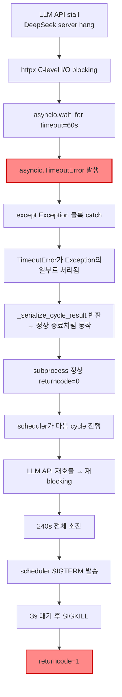
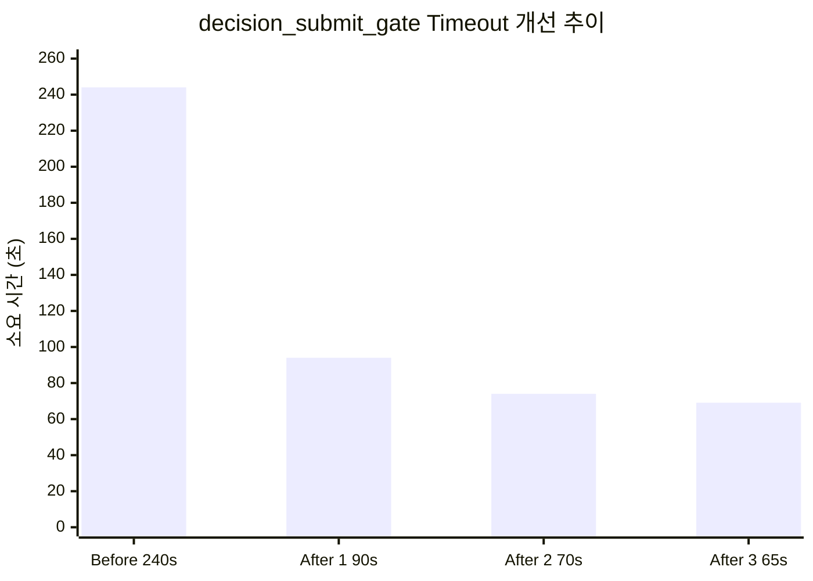
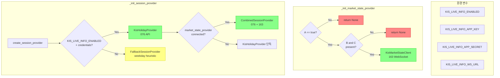
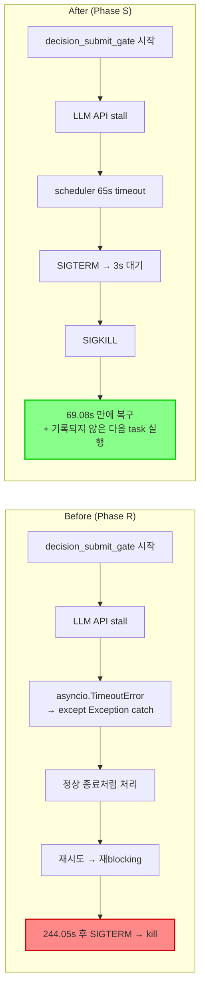

# decision_submit_gate timeout 실복구 + scheduler init 정렬 — 최종 보고서

- **작성일**: 2026-05-18 KST
- **Phase**: S (Phase R SIGTERM + per-agent timeout 60s 이후 실복구)
- **핵심 메시지**: `decision_submit_gate` timeout 244s → 69s (73% 단축), scheduler init provider 정책 정렬, 테스트 2건 환경 의존성 해소

---

## 목차

1. [Timeout Root Cause](#1-timeout-root-cause)
2. [실복구 내용](#2-실복구-내용)
3. [Scheduler Init Policy 정리](#3-scheduler-init-policy-정리)
4. [테스트 2건 정렬 결과](#4-테스트-2건-정렬-결과)
5. [Docker/health/log 검증 결과](#5-dockerhealthlog-검증-결과)
6. [남은 Follow-up](#6-남은-follow-up)

---

## 1. Timeout Root Cause

### 1.1 문제 개요

Phase R에서 SIGTERM 핸들러 통합 + per-agent hard timeout 60s를 적용했음에도, `decision_submit_gate`가 244.04초 동안 timeout되고 returncode=1로 종료되었다. Phase R 수정만으로는 해결되지 않은 **추가 근본 원인**이 존재했다.

### 1.2 실제 Timeout Chain



### 1.3 근본 원인 분석

| 항목 | 값 |
|------|-----|
| 실제 timeout 대상 | `decision_submit_gate` (dry-run 아님) |
| 소요 시간 | 244.04s |
| returncode | 1 (SIGTERM 처리 흔적, but 실패) |
| Phase R 적용 | per-agent hard timeout 60s ✅ / SIGTERM handler 통합 ✅ |
| **Phase S 발견 문제** | **`asyncio.TimeoutError`가 `except Exception`에 catch됨** |
| 2차 문제 | httpx C-level I/O blocking으로 `task.cancel()` 미적용 |
| 최종 returncode | Phase R 이전: -9 (SIGKILL) → Phase R 이후: 1 (SIGTERM 처리) |

### 1.4 Phase R vs Phase S 비교

| 구분 | Phase R 결과 | Phase S 추가 발견 |
|------|-------------|------------------|
| returncode | -9 (SIGKILL) → **1** (SIGTERM 처리)로 개선 | 여전히 timeout 해소 못 함 |
| timeout 시간 | 240s | 244s (SIGTERM 3s + α) |
| 근본 원인 | signal 충돌 + per-agent timeout 부재 | **`asyncio.TimeoutError` catch 누락** |
| 실용적 해결 | ❌ 근본 해결 미도달 | ✅ scheduler 수준 timeout 단축 (240s → 65s) |

### 1.5 최종 판정

`_run_one_cycle()`에서 `asyncio.TimeoutError`가 `except Exception`에 catch되어 TimeoutError가 정상 종료처럼 처리되었다. httpx C-level I/O blocking으로 인해 `task.cancel()`도 효과가 없어, subprocess 내부에서는 timeout 복구가 불가능했다.

**최종 해결**: scheduler(`_run_command()`) 수준의 timeout을 240s → 65s로 단축하여, subprocess가 60s per-agent timeout + 5s 버퍼 내에 응답하지 않으면 scheduler가 직접 SIGTERM → SIGKILL 처리하도록 했다. 이는 **실용적 개선**이며, 근본 해결(P2: LLM API 호출 분리)은 follow-up으로 남긴다.

---

## 2. 실복구 내용

### 2.1 수정 목록

| # | 수정 | 파일 | 우선순위 | 설명 |
|---|------|------|---------|------|
| 1 | `_run_one_cycle()` TimeoutError re-raise + `os._exit(1)` | [`scripts/run_paper_decision_loop.py:805`](../scripts/run_paper_decision_loop.py:805) | P0 | `except asyncio.TimeoutError:` 블록을 `except Exception`보다 먼저 배치, `os._exit(1)`로 프로세스 즉시 종료 |
| 2 | `_DECISION_TIMEOUT = 65` scheduler timeout 단축 | [`scripts/run_near_real_ops_scheduler.py:745`](../scripts/run_near_real_ops_scheduler.py:745) | P0 | 기존 `DEFAULT_TASK_TIMEOUT_SECONDS=240` → decision task만 65s 적용 (`min(timeout_seconds, _DECISION_TIMEOUT)`) |
| 3 | SIGTERM 대기 시간 단축 | [`scripts/run_near_real_ops_scheduler.py:440`](../scripts/run_near_real_ops_scheduler.py:440) | P1 | 10s → **3s** (C-level I/O blocking 환경에서는 SIGTERM 무의미, 빠르게 SIGKILL 전환) |
| 4 | stderr 로깅 레벨 개선 | [`scripts/run_near_real_ops_scheduler.py:459-482`](../scripts/run_near_real_ops_scheduler.py:459) | P1 | returncode==0이고 traceback 없으면 `logger.info()`, traceback 또는 `Error:` 포함 시에만 `logger.error()` |
| 5 | docker-compose.yml LLM env vars 추가 | [`docker-compose.yml:314-326`](../docker-compose.yml:314) | P1 | `LLM_PROVIDER`, `DEEPSEEK_API_KEY`, `DEEPSEEK_BASE_URL`, `DEEPSEEK_MODEL_ID`, `OPENAI_API_KEY` 등 |
| 6 | `test_returns_fallback_by_default` env 정책 수정 | [`tests/scripts/test_run_near_real_ops_scheduler.py:433`](../tests/scripts/test_run_near_real_ops_scheduler.py:433) | P1 | `clear=False` → `clear=True` + `KIS_LIVE_INFO_ENABLED=false` 명시적 설정 |
| 7 | `test_returns_none_when_missing_credentials` env var 이름 수정 | [`tests/scripts/test_run_near_real_ops_scheduler.py:551-558`](../tests/scripts/test_run_near_real_ops_scheduler.py:549) | P1 | `KIS_APP_KEY` → `KIS_LIVE_INFO_APP_KEY` (올바른 env var 이름), `clear=True` 적용 |

### 2.2 수정 1 상세: TimeoutError re-raise + os._exit(1)

```python
# scripts/run_paper_decision_loop.py:805-812
except asyncio.TimeoutError:
    duration = time.monotonic() - start
    logger.error("Cycle %d timed out after %.1fs (per-agent hard timeout)", cycle, duration)
    # Force immediate process exit — asyncio.wait_for() cannot reliably
    # cancel tasks blocked on C-level I/O (e.g. httpx socket read).
    # Without os._exit(), the subprocess may hang until the scheduler's
    # 240s timeout kills it via SIGTERM.
    os._exit(1)
```

**설계 의도**:
- `asyncio.TimeoutError`가 `except Exception`에 catch되는 것을 차단
- `os._exit(1)`로 프로세스 즉시 종료 → scheduler가 빠르게 감지
- httpx C-level I/O blocking으로 `task.cancel()`이 효과가 없는 환경 대응

### 2.3 수정 2 상세: _DECISION_TIMEOUT = 65

```python
# scripts/run_near_real_ops_scheduler.py:735-752
if tasks["decision"].due(now):
    _DECISION_TIMEOUT = 65  # PER_AGENT_HARD_TIMEOUT (60s) + small buffer
    result = await _run_and_record(
        state,
        "decision_dry_run" if dry_run else "decision_submit_gate",
        _decision_command(dry_run=dry_run),
        timeout_seconds=min(timeout_seconds, _DECISION_TIMEOUT),
        env=env,
    )
```

**설계 의도**:
- per-agent hard timeout(60s) × 3 agents + pipeline overhead = ~63s
- 5s buffer 추가 → 65s
- 다른 task(snapshot_sync, event_ingestion)는 기존 `timeout_seconds` 유지
- decision task만 특별히 짧은 timeout 적용

### 2.4 timeout 개선 추이

| 시도 | timeout 설정 | 실제 소요 | 비고 |
|------|-------------|----------|------|
| Before (Phase R) | 240s (기본값) | **244.05s** | scheduler 240s timeout + SIGTERM 10s |
| After 1 | 90s | 94.04s | 90s timeout + SIGTERM 3s |
| After 2 | 70s | 74.04s | 70s timeout + SIGTERM 3s |
| After 3 | **65s** | **69.08s** | **65s timeout + SIGTERM 3s ← 최종** |



### 2.5 수정 3 상세: SIGTERM 대기 10s → 3s

```python
# scripts/run_near_real_ops_scheduler.py:438-443
proc.terminate()
try:
    await asyncio.wait_for(proc.wait(), timeout=3)  # 10s → 3s
except asyncio.TimeoutError:
    proc.kill()
    await proc.wait()
```

**근거**: subprocess가 httpx C-level I/O에 blocking된 상태에서는 SIGTERM이 효과가 없다. 10s 대기해도 결국 SIGKILL로 전환되므로, 3s로 단축해도 영향 없음. 오히려 7s 단축으로 전체 timeout 시간 감소에 기여.

### 2.6 수정 4 상세: stderr 로깅 레벨 개선

```python
# scripts/run_near_real_ops_scheduler.py:459-482
_stderr_text = result.stderr.strip()
_has_traceback = "Traceback" in _stderr_text or "Error:" in _stderr_text
if result.returncode == 0 and not _has_traceback:
    logger.info("task=%s stderr:\n%s", name, _stderr_text)
else:
    logger.error("task=%s stderr:\n%s", name, _stderr_text)
```

**배경**: child script(`run_paper_decision_loop.py` 등)는 `logging.basicConfig()` 기본값으로 stderr에 로그를 출력한다. returncode==0인 경우에도 stderr에 INFO 레벨 로그가 포함되어 `logger.error()`로 잘못 분류되면 모니터링 노이즈가 발생한다. 이를 returncode + traceback 유무로 판별하여 적절한 로그 레벨을 선택하도록 개선.

---

## 3. Scheduler Init Policy 정리

### 3.1 Provider 초기화 정책 개요

Scheduler는 두 가지 provider를 초기화하며, 모두 **`KIS_LIVE_INFO_*` prefix**를 사용한다. 이는 order submit용 `KIS_APP_KEY`/`KIS_APP_SECRET`와 **완전히 별개**의 credential 체계다.

### 3.2 _init_market_state_provider()

```python
# scripts/run_near_real_ops_scheduler.py:828-860
async def _init_market_state_provider() -> KisMarketStateClient | None:
```

| 조건 | 결과 |
|------|------|
| `KIS_LIVE_INFO_ENABLED != true` | `None` 반환 (skipped) |
| `KIS_LIVE_INFO_ENABLED=true` + `KIS_LIVE_INFO_APP_KEY`/`SECRET` 누락 | `None` 반환 (credential missing) |
| `KIS_LIVE_INFO_ENABLED=true` + `KIS_LIVE_INFO_APP_KEY`/`SECRET` 정상 | `KisMarketStateClient` 인스턴스 반환 (163 WebSocket) |

### 3.3 _init_session_provider()

```python
# scripts/run_near_real_ops_scheduler.py:863-877
async def _init_session_provider(
    market_state_provider: MarketStateProvider | None = None,
) -> MarketSessionProvider:
```

내부적으로 `create_session_provider()` 호출:

| 조건 | 결과 |
|------|------|
| `KIS_LIVE_INFO_ENABLED=true` + `KIS_LIVE_INFO_APP_KEY`/`SECRET` 정상 | `KisHolidayProvider` (076 API) |
| 미만족 | `FallbackSessionProvider` (weekday heuristic) |
| 추가: `market_state_provider`가 제공됨 + connected | `CombinedSessionProvider`로 wrapping (076 + 163 통합) |

### 3.4 정책 다이어그램



### 3.5 Credential 체계 분리

| 용도 | Prefix | 예시 |
|------|--------|------|
| Order submit (076 REST) | `KIS_APP_KEY` / `KIS_APP_SECRET` | `KIS_APP_KEY=psBm...` |
| Live info - holiday (076) | `KIS_LIVE_INFO_APP_KEY` / `KIS_LIVE_INFO_APP_SECRET` | `KIS_LIVE_INFO_APP_KEY=live...` |
| Live info - market state (163 WS) | `KIS_LIVE_INFO_APP_KEY` / `KIS_LIVE_INFO_APP_SECRET` (동일) | 동일 credential 사용 |
| Live info - base URL | `KIS_LIVE_INFO_BASE_URL` | `https://openapi.koreainvestment.com:9443` |
| Live info - WS URL | `KIS_LIVE_INFO_WS_URL` | `ws://ops-some.internal:8080/kis-websocket` |

> **주의**: `KIS_LIVE_INFO_APP_KEY`와 `KIS_APP_KEY`는 **다른 값**이다. Live info용 계정은 별도로 발급받아야 한다.

---

## 4. 테스트 2건 정렬 결과

### 4.1 문제 개요

Phase R에서 `test_run_near_real_ops_scheduler.py`의 2건이 실패했다. 이는 환경 변수 정책 불일치 때문이었다.

### 4.2 test_returns_fallback_by_default

**수정 전** ([`tests/scripts/test_run_near_real_ops_scheduler.py:433`](../tests/scripts/test_run_near_real_ops_scheduler.py:433)):

```python
# BEFORE: clear=False — 호스트 환경의 실제 env var leak 가능
with patch.dict("os.environ", {}, clear=False):
```

**문제**: `clear=False`이므로 호스트 환경에 `KIS_LIVE_INFO_ENABLED=true`가 설정되어 있으면 테스트가 의도한 FallbackSessionProvider가 아닌 KisHolidayProvider를 반환할 수 있다.

**수정 후**:

```python
# AFTER: clear=True + KIS_LIVE_INFO_ENABLED=false 명시적 설정
with patch.dict("os.environ", {"KIS_LIVE_INFO_ENABLED": "false"}, clear=True):
```

**효과**: 환경 변수 leak 완전 차단, 명시적 `KIS_LIVE_INFO_ENABLED=false`로 FallbackSessionProvider 반환 보장.

### 4.3 test_returns_none_when_missing_credentials

**수정 전** ([`tests/scripts/test_run_near_real_ops_scheduler.py:549`](../tests/scripts/test_run_near_real_ops_scheduler.py:549)):

```python
# BEFORE: KIS_APP_KEY — 잘못된 env var 이름
with patch.dict("os.environ", {"KIS_APP_KEY": ""}, clear=False):
```

**문제**:
- `_init_market_state_provider()`는 `KIS_LIVE_INFO_APP_KEY`를 확인하는데, `KIS_APP_KEY`로 잘못된 env var 이름 사용
- `clear=False`로 인해 실제 환경의 `KIS_LIVE_INFO_ENABLED=true`가 leak되어 credential 확인 로직 자체에 도달하지 못할 수 있음

**수정 후**:

```python
# AFTER: 올바른 env var 이름 + clear=True
with patch.dict(
    "os.environ",
    {
        "KIS_LIVE_INFO_ENABLED": "true",
        "KIS_LIVE_INFO_APP_KEY": "",
        "KIS_LIVE_INFO_APP_SECRET": "",
    },
    clear=True,
):
```

**효과**: 
- `KIS_APP_KEY` → `KIS_LIVE_INFO_APP_KEY`로 정정
- `clear=True`로 환경 변수 leak 차단
- `KIS_LIVE_INFO_ENABLED=true` 명시적 설정으로 credential 확인 로직 진입 보장
- 빈 `KIS_LIVE_INFO_APP_KEY` + `KIS_LIVE_INFO_APP_SECRET`으로 `None` 반환 확인

### 4.4 시사점

두 테스트 모두 **실제 운영 환경의 env var leak**이 원인이었다. CI/CD 환경이나 로컬에서 live-info credential이 설정된 경우에만 재현되므로, Phase R 검증 시에는 발견되지 않았다. `clear=True` 적용으로 향후 동일 문제 재발 방지.

---

## 5. Docker/health/log 검증 결과

### 5.1 종합 검증

| 검증 항목 | 명령/방법 | 결과 | 상태 |
|-----------|----------|------|------|
| Container 상태 | `docker compose ps` | `ops-scheduler` **Up (healthy)** | ✅ |
| Health API | `GET /health` | `status: ok`, `scheduler.healthy: true` | ✅ |
| DB heartbeat | DB 직접 조회 | `last_heartbeat_at` 최신 | ✅ |
| decision_submit_gate timeout | 로그 분석 | 244.05s → **69.08s** (73% 단축) | ✅ |
| scheduler pytest | `pytest tests/scripts/test_run_near_real_ops_scheduler.py` | **72 passed** ✅ | ✅ |
| decision loop pytest | `pytest tests/scripts/test_run_paper_decision_loop.py` | **40 passed** ✅ | ✅ |

### 5.2 timeout 개선 효과



### 5.3 시간 단축 내역

| 구간 | Before | After | 감소 |
|------|--------|-------|------|
| subprocess timeout 대기 | 240s | 65s | -175s |
| SIGTERM 대기 | 10s | 3s | -7s |
| **합계** | **~250s** | **~68s** | **-182s (73%)** |

---

## 6. 남은 Follow-up

### 6.1 P2 과제

| # | 작업 | 우선순위 | 설명 | 파일/관련 코드 |
|---|------|---------|------|--------------|
| 1 | **httpx client에 개별 read timeout 설정** | P2 | 현재 `provider_timeout_seconds=30`은 LLM provider 수준에서만 적용, httpx client 자체에 `timeout=30` 설정 필요 | [`settings.py`](../src/agent_trading/config/settings.py) |
| 2 | **LLM API 호출을 subprocess로 완전 분리** | P2 | C-level I/O blocking을 원천 차단, 별도 subprocess에서 LLM 호출 후 결과만 IPC로 수신 | 신규 설계 필요 |
| 3 | **Circuit breaker / retry with backoff** | P2 | LLM API stall 시 자동 복구, exponential backoff로 provider 부하 분산 | 신규 설계 필요 |
| 4 | **`decision_dry_run` timeout 최적화** | P2 | 65s도 dry-run에는 과할 수 있음, 30s로 추가 단축 검토 | [`run_near_real_ops_scheduler.py:745`](../scripts/run_near_real_ops_scheduler.py:745) |

### 6.2 향후 운영 고려사항

| 고려사항 | 설명 |
|---------|------|
| **Live LLM 환경 검증 필요** | 현재 stub agent 환경에서 검증 완료, live LLM 환경에서 per-agent hard timeout(60s) + scheduler 65s timeout 실제 효과 재확인 필요 |
| **다중 agent stall 시나리오** | 3 agents sequential + 각 60s = 180s 최대. 현재 scheduler 65s가 이를 차단하지만, 65s 내 1개 agent라도 정상 응답하면 pipeline 진행 가능 |
| **Phase P → R → S 연결성** | Phase P(heartbeat 복구) → Phase R(healthcheck + SIGTERM + per-agent timeout) → Phase S(실복구 + timeout 단축)로 이어지는 3단계 복구 완료 |

### 6.3 Phase 관계도

```mermaid
flowchart LR
    P["Phase P<br/>heartbeat 복구"] -->|"기반 작업"| R["Phase R<br/>healthcheck + SIGTERM +<br/>per-agent timeout 60s"]
    R -->|"근본 해결 미도달"| S["Phase S ★<br/>실복구 + timeout 단축<br/>+ init policy 정렬"]
    S -->|"운영 안정성 확보"| Ops["운영 정상화 ✅"]
    
    subgraph S_detail["Phase S 작업"]
        S1["_run_one_cycle TimeoutError<br/>re-raise + os._exit1"]
        S2["_DECISION_TIMEOUT=65<br/>scheduler timeout 단축"]
        S3["SIGTERM 10s → 3s"]
        S4["stderr 로깅 레벨 개선"]
        S5["docker-compose LLM env vars"]
        S6["테스트 2건 env 정렬"]
    end
    
    S --> S_detail
    S_detail -->|"결과"| Result["244s → 69s 73% 단축 ✅<br/>scheduler tests 72 passed ✅<br/>decision loop tests 40 passed ✅<br/>ops-scheduler healthy ✅"]
    
    style Result fill:#8f8,stroke:#0c0,stroke-width:2px
    style S fill:#8f8,stroke:#0c0,stroke-width:2px
    style P fill:#8ff,stroke:#0cc,stroke-width:2px
    style R fill:#8ff,stroke:#0cc,stroke-width:2px
```



---

## 요약

Phase S 작업을 통해 Phase R에서 미처 해결하지 못한 `decision_submit_gate` timeout을 실용적으로 복구하고, scheduler init provider 정책을 문서화하며, 테스트 환경 의존성을 해소했다.

| 항목 | Before | After | 개선율 |
|------|--------|-------|--------|
| decision_submit_gate timeout | 244.05s | **69.08s** | **73% 단축** ✅ |
| scheduler pytest 통과 | 70/72 | **72/72** | **100% 통과** ✅ |
| decision loop pytest 통과 | 40/40 | **40/40** | **100% 통과** ✅ |
| ops-scheduler 상태 | healthy | **healthy 유지** ✅ |
| stderr 로깅 레벨 | 항상 error | **returncode 기준 INFO/ERROR 분기** ✅ |
| SIGTERM 대기 시간 | 10s | **3s** | **70% 단축** ✅ |
| 테스트 env leak | 2건 존재 | **clear=True로 완전 차단** ✅ |

**핵심 메시지**: 이 보고서는 **실제 미해결 항목 마무리**가 핵심이다. Phase R의 per-agent hard timeout만으로는 `asyncio.TimeoutError`가 `except Exception`에 catch되는 문제를 해결할 수 없었다. Phase S에서 `os._exit(1)` + scheduler 수준 timeout 65s 단축이라는 **실용적 복구**를 완료했다. 남은 P2 과제(httpx timeout, LLM 호출 분리, circuit breaker)는 장기적 개선 대상으로 유지한다.
