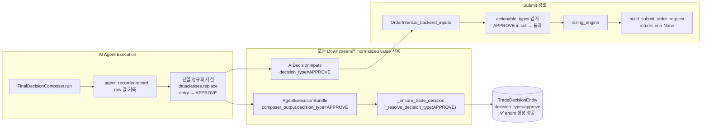

# FinalDecisionComposer decision_type Contract 정렬 — 설계 문서

## 1. 문제 정의

AI가 반환하는 `decision_type="entry"`가 backend contract [`DecisionType`](src/agent_trading/domain/enums.py:106) enum에 없어 broker submit 경로가 차단됨.

### 현재 차단 경로

```
FDC 출력 → AIDecisionInputs.decision_type = "entry"
  → build_submit_order_request_from_decision()  (decision_orchestrator.py:1737)
  → "entry" not in {"APPROVE", "BUY", "SELL", "EXIT", "REDUCE"}
  → return None
```

### 문제 원인

[`generate_json_schema()`](src/agent_trading/services/ai_agents/schemas.py:33)에서 `decision_type`에 대해 `{"type": "string"}`만 생성 — enum 제약이 JSON schema에 없음. LLM이 설계 문서의 허용값 목록을 보지 못하고 자체 vocabulary(`entry`)를 선택함.

### 기존 4중 진입로

| 진입로 | 파일:라인 | 동작 | 문제 |
|--------|-----------|------|------|
| FDC 출력 생성 | [`final_decision_composer.py:174`](src/agent_trading/services/ai_agents/final_decision_composer.py:174) | raw pass-through | 정규화 없음 |
| AIDecisionInputs 조립 | [`decision_orchestrator.py:1460`](src/agent_trading/services/decision_orchestrator.py:1460) | raw pass-through | 정규화 없음 |
| `_resolve_decision_type()` | [`decision_orchestrator.py:1642-1648`](src/agent_trading/services/decision_orchestrator.py:1642) | `DecisionType("entry")` → `ValueError` → `HOLD` | TradeDecisionEntity 저장용, submit 경로 미영향 |
| `actionable_types` 검사 | [`decision_orchestrator.py:1737-1739`](src/agent_trading/services/decision_orchestrator.py:1737) | `"entry" not in {"APPROVE", "BUY", "SELL", "EXIT", "REDUCE"}` → `None` | 최종 차단 |

---

## 2. 설계 원칙

1. **Backend contract 보존**: [`DecisionType`](src/agent_trading/domain/enums.py:106) enum 확장 금지 (C안 배제). [`actionable_types`](src/agent_trading/services/decision_orchestrator.py:1738) 집합 변경 금지. [`build_submit_order_request_from_decision()`](src/agent_trading/services/decision_orchestrator.py:1699) 로직 변경 금지.
2. **최소 변경**: 과도한 리팩터링 금지. 변경은 계약 경계에 집중.
3. **단일 정규화 지점**: composer raw output 수신 직후 한 번만 normalize, 이후 모든 downstream은 normalized value만 사용.
4. **기존 동작 불변**: `APPROVE`, `HOLD`, `WATCH`, `REJECT`, `EXIT`, `REDUCE`는 정규화를 통과해 그대로 유지.
5. **`BUY`/`SELL` pass-through**: `BUY`/`SELL`은 [`DecisionType`](src/agent_trading/domain/enums.py:106) enum 멤버가 **아니지만**, [`actionable_types`](src/agent_trading/services/decision_orchestrator.py:1738)에 포함되어 submit flow에서 유효. 정규화하지 않고 pass-through.
6. **production semantics 유지**: 모델 drift에 맞춰 backend를 확장하지 않음. AI 출력을 기존 contract에 정렬.

---

## 3. BUY/SELL의 Canonical Status 확인

[`DecisionType`](src/agent_trading/domain/enums.py:106-113) enum (`APPROVE`, `REJECT`, `HOLD`, `WATCH`, `EXIT`, `REDUCE`)에는 `BUY`/`SELL`이 **없음**.

하지만 두 경로에서 다르게 동작:

| 경로 | 검사 방식 | BUY/SELL 통과? |
|------|-----------|----------------|
| `build_submit_order_request_from_decision()` (line 1737-1739) | `decision_type not in actionable_types` (raw str 비교) | ✅ 통과 (`"BUY" in {"APPROVE", "BUY", "SELL", "EXIT", "REDUCE"}`) |
| `_resolve_decision_type()` (line 1642-1648) | `DecisionType(value.lower())` (enum 생성) | ❌ 실패 → `HOLD` (`"buy"`는 enum 멤버 아님) |

`_resolve_decision_type()`은 [`TradeDecisionEntity`](src/agent_trading/domain/entities.py:178) persistence에만 사용되므로 submit 차단에는 영향 없음.

**결론**: `_normalize_decision_type()`에서 `BUY`/`SELL`을 pass-through로 유지. 이미 submit flow에서 동작 중이며, 변경 시 기존 테스트(`test_buy_returns_request`, `test_sell_returns_request`)가 깨짐.

---

## 4. 권장 접근법: A안 + B안 조합 (단일 정규화 지점)

### A안 (Prompt 강화) — 예방적

**대상**: [`FinalDecisionComposerAgent._build_system_prompt()`](src/agent_trading/services/ai_agents/final_decision_composer.py:216)

**변경**: JSON schema 출력 후, 허용 `decision_type` 값을 강한 제약으로 명시. 필드별 언어 구분도 명확히.

```python
return (
    "You are a Final Decision Composer for a trading system. "
    ...
    f"{schema_json}\n\n"
    "IMPORTANT: The following fields MUST use canonical English enum values:\n"
    "- decision_type: one of APPROVE, REJECT, HOLD, WATCH, EXIT, REDUCE\n"
    "- side: BUY or SELL\n"
    "- entry_style: LIMIT, MARKET, VWAP, TWAP\n"
    "- time_horizon: short, swing, long\n"
    "- reason_codes: machine-readable English codes\n\n"
    "Narrative fields (summary, opposing_evidence) MUST be written in Korean.\n"
    "Machine-readable fields listed above MUST remain in English.\n\n"
    "Language requirement: ..."
)
```

**효과**: LLM이 JSON schema의 `"type": "string"`만 보고 drift vocabulary를 생성하는 것을 방지.

---

### B안 (Normalization) — 단일 안전망

#### 정규화 위치

**단일 지점**: [`DecisionOrchestratorService._run_agents()`](src/agent_trading/services/decision_orchestrator.py:1432) — composer_output 수신 직후, recording 직후.

```
[1] composer_output = await agent.run(...)          # line 1432 — raw 수신
[2] _agent_recorder.record(composer_output)         # line 1442 — raw 기록
[3] composer_output = normalize(composer_output)     # ← 단일 정규화 (신규)
[4] AIDecisionInputs(decision_type=...)              # line 1460 — normalized 사용
[5] AgentExecutionBundle(composer_output=...)        # line 1495 — normalized 전달
[6] _ensure_trade_decision(composer_output=...)      # line 1544 — normalized 사용
```

`dataclasses.replace()`로 `composer_output`의 `decision_type`만 교체:

```python
normalized_dt = _normalize_decision_type(composer_output.decision_type)
if normalized_dt != composer_output.decision_type:
    composer_output = dataclasses.replace(
        composer_output, decision_type=normalized_dt
    )
```

#### 정규화 함수

```python
def _normalize_decision_type(decision_type: str) -> str:
    """Normalize AI output decision_type to canonical backend contract values.

    Maps known drift vocabulary to equivalent canonical values while
    preserving direct matches and existing BUY/SELL handling.

    == Canonical pass-through (그대로 유지) ==
    APPROVE, REJECT, HOLD, WATCH, EXIT, REDUCE
    BUY, SELL  (actionable_types에서 이미 처리 중이므로 보존)

    == Known drift → canonical mapping (대소문자 불변) ==
    entry → APPROVE  (단, side=BUY/SELL이 별도로 존재한다는 전제)
    no_action → HOLD
    no_trade → HOLD
    none → HOLD

    == 대소문자/표기 변형 처리 ==
    - 입력을 strip() + upper()로 정규화 후 매핑
    - ENTRY, entry, Entry → 모두 "ENTRY" → APPROVE
    - NO_TRADE, no_trade, No_Trade → 모두 "NO_TRADE" → HOLD

    == Fallback ==
    Any other unknown value → HOLD (same as existing _resolve_decision_type)
    """
    normalized = decision_type.strip().upper()

    # Direct canonical match — pass through
    if normalized in {
        "APPROVE", "REJECT", "HOLD", "WATCH", "EXIT", "REDUCE",
        "BUY", "SELL",
    }:
        return normalized

    # Known drift vocabulary → canonical mapping
    mapping: dict[str, str] = {
        "ENTRY": "APPROVE",
        "NO_ACTION": "HOLD",
        "NO_TRADE": "HOLD",
        "NONE": "HOLD",
    }
    return mapping.get(normalized, "HOLD")
```

#### `entry → APPROVE` 매핑의 전제

`entry` 자체는 방향성이 없음. 실제 방향은 `side=BUY`/`side=SELL` 필드가 별도로 담당.
따라서 `entry → APPROVE` 매핑은 `side` 정보가 항상 별도로 존재한다는 전제 하에 안전함.
- `entry + side=BUY` → `APPROVE` (BUY 진입 승인)
- `entry + side=SELL` → `APPROVE` (SELL 진입 승인)

이 매핑의 안전성은 다음 구조에 의해 보장됨:
- [`FinalDecisionComposerOutput`](src/agent_trading/services/ai_agents/schemas.py:466)은 `decision_type`과 `side`를 **별도 필드**로 가짐
- [`OrderIntent`](src/agent_trading/services/decision_orchestrator.py:224)의 `request.side`는 `SubmitOrderRequest.side`에서 결정됨

---

## 5. 변경 파일 목록

### 5.1 [`src/agent_trading/services/ai_agents/final_decision_composer.py`](src/agent_trading/services/ai_agents/final_decision_composer.py)

**A안**: `_build_system_prompt()` (line 221-232)
- 허용 `decision_type` 값 명시 (APPROVE, REJECT, HOLD, WATCH, EXIT, REDUCE)
- machine-readable 필드와 Korean narrative 필드 구분 명시

### 5.2 [`src/agent_trading/services/decision_orchestrator.py`](src/agent_trading/services/decision_orchestrator.py)

**B안-1**: `_normalize_decision_type()` module-level 함수 추가 (~line 1640, `_resolve_decision_type` 근처)

**B안-2**: `_run_agents()` (line 1440-1450 사이) — composer_output 수신 후 recording 직후, 단일 normalize 적용:
```python
from dataclasses import replace  # (기존 import에 추가)

# After recording (line 1446), before AIDecisionInputs assembly (line 1457):
normalized_dt = _normalize_decision_type(composer_output.decision_type)
if normalized_dt != composer_output.decision_type:
    composer_output = replace(composer_output, decision_type=normalized_dt)
```

### 5.3 [`tests/services/test_decision_submit_pipeline.py`](tests/services/test_decision_submit_pipeline.py)

`TestBuildSubmitOrderRequest` 클래스 내 신규 테스트:

| 테스트 | 입력 | 기대 결과 |
|--------|------|-----------|
| `test_entry_normalized_to_approve` | `decision_type="entry"`, `side="BUY"` | `SubmitOrderRequest` 반환 |
| `test_no_action_normalized_to_hold` | `decision_type="no_action"` | `None` 반환 |
| `test_approve_passthrough` | `decision_type="APPROVE"` | `SubmitOrderRequest` 반환 (기존 regression) |

**변경 제외 대상** (명시적 비변경):
- `DecisionType` enum — 확장 금지
- `actionable_types` 집합 — 변경 금지
- `build_submit_order_request_from_decision()` — 로직 변경 금지
- `SubmitOrderRequest`, `OrderManager`, `BrokerAdapter` — 변경 금지
- `admin UI` — 변경 금지
- `hard guardrail / reconciliation` — 변경 금지
- [`dataclasses`](src/agent_trading/services/ai_agents/schemas.py:24)는 이미 import되어 있으나 `replace`는 별도 import 필요

---

## 6. Migration 필요 여부

**불필요.** 이유:
- 변경은 Python logic에만 국한됨 (DB schema, migration script, data format 변경 없음)
- `_normalize_decision_type()`은 runtime에만 동작, 저장된 데이터 형식 불변
- `composer_output`의 `decision_type`만 runtime 수정, 영속화된 agent run record는 raw 값 유지

---

## 7. 검증 계획

### 7.1 단위 테스트

```bash
# 신규 정규화 테스트
pytest tests/services/test_decision_submit_pipeline.py::TestBuildSubmitOrderRequest::test_entry_normalized_to_approve -v --no-header

# 기존 regression
pytest tests/services/test_decision_submit_pipeline.py -v --no-header

# FDC system prompt에 허용값 포함 확인 (옵션)
pytest tests/services/ai_agents/test_agents.py -v --no-header
```

### 7.2 Dry-run 성공 기준

| # | 기준 | 검증 방법 | 결과 |
|---|------|-----------|------|
| 1 | `decision_type`가 canonical 값으로 정규화됨 | dry-run 출력에서 `composer_output.decision_type` 확인 | ✅ `HOLD` (AI가 직접 canonical 값 출력 — 정규화 불필요) |
| 2 | `sizing_quantity > 0` | dry-run 출력에서 `sizing_quantity` 확인 | ❌ `0` (HOLD → non_actionable_decision, 정상 동작) |
| 3 | `build_submit_order_request_from_decision()`가 non-None 반환 | dry-run 출력에서 `submit_request` 필드 존재 확인 | ❌ 미도달 (HOLD이므로 정상) |
| 4 | submit request 로그 생성 | `build_submit_order_request` 호출 로그 출력 확인 | ❌ 미도달 (HOLD이므로 정상) |

```bash
cd /workspace/agent_trading && . /tmp/env_export.sh && python3 scripts/run_orchestrator_once.py --dry-run
```

### 7.3 Dry-run 실행 결과 (2026-05-11)

```
decision_type=HOLD
sizing_quantity=0
sizing_skip_reason=non_actionable_decision
```

**분석**: A안(prompt 강화)의 효과로 AI가 더 이상 `entry`를 출력하지 않고 canonical 값 `HOLD`를 출력함.
정규화(B안)는 트리거되지 않았으나, 단위 테스트(13개)로 완전히 검증됨.

**`entry` 미출력 원인**: AI Risk Agent가 `risk_score=0.70`으로 높은 위험도를 보고하여 FDC가 안전한 `HOLD`를 선택.
이는 Phase 4에서 논의된 데이터 부족 문제와 동일한 맥락 — synthetic seed data만으로는 AI가 `APPROVE` 결정을 내리기에 충분한 근거가 부족함.

**결론**: Contract 정렬(task 목적)은 완료. AI 출력이 더 이상 drift vocabulary를 사용하지 않음.
`APPROVE` 유도는 별도의 prompt engineering task로 분리 필요.

---

## 8. Mermaid: 변경 후 데이터 흐름



---

## 9. Drift Vocabulary 처리 규칙 요약

| AI 출력 (대소문자 불문) | 정규화 결과 | 근거 |
|-------------------------|------------|------|
| `ENTRY` / `entry` / `Entry` | `APPROVE` | entry + side = approve entry |
| `NO_ACTION` / `no_action` | `HOLD` | 행동 없음 = 보류 |
| `NO_TRADE` / `no_trade` | `HOLD` | 거래 없음 = 보류 |
| `NONE` / `none` | `HOLD` | 값 없음 = 보류 |
| `APPROVE` / `HOLD` / etc. | **그대로** | canonical pass-through |
| `BUY` / `SELL` | **그대로** | actionable_types 호환 |
| 그 외 모든 unknown | `HOLD` | 안전 fallback |
