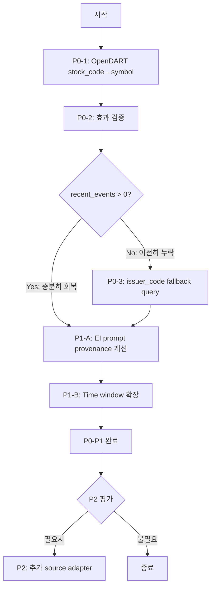

# EI Agent 고도화 1차 설계 — 이벤트 입력 품질과 symbol/issuer 연결 강화

> **목적**: Event Interpretation Agent의 입력 이벤트 품질과 symbol/issuer 연결성을 개선하기 위한
> 우선순위 및 구현 단위 설계. 실제 구현은 하지 않음 (설계/분석 전용).
>
> **제약**:
> - Admin UI 변경 금지
> - Broker submit semantics 변경 금지
> - Source over-expansion 금지 (기존 OpenDART 이외 신규 source는 P0/P1 검증 후 P2에서 평가)
> - Paper/Live 동일 시스템 가정
> - **최소 범위 additive 변경 우선, prompt-only 해결로 흐르지 말 것**
> - **OpenDART source adapter와 external_events query contract를 source of truth에 가깝게 정리**

---

## 1. 현재 EI 동작 현황 — 6개 진단 질문

### Q1. OpenDART 이벤트가 symbol 기반 조회에서 누락되는 정확한 원인은?

**정답: 2중 누락 구조**

#### 누락 1 — Ingestion 시점: `symbol = None` 고정

[`src/agent_trading/brokers/opendart_adapter.py`](src/agent_trading/brokers/opendart_adapter.py:150) `_raw_from_item()` 메서드:

```python
return RawEvent(
    ...
    symbol=None,  # ← line 178: OpenDART API의 stock_code 필드를 읽지 않음
    issuer_code=item.get("corp_code"),  # corp_code는 issuer_code로만 저장
    ...
)
```

OpenDART `/list.json` API 응답에는 `stock_code` 필드(종목코드, 예: `"005930"`)가 포함되어 있지만,
**현재 코드에서 이 필드를 전혀 읽지 않고 `None`으로 고정**하고 있다.

**형식 호환성 확인 완료**:

| 항목 | 값 | 비고 |
|------|------|------|
| 시스템 `request.symbol` | `"005930"` (6자리) | [`run_orchestrator_once.py:71`](scripts/run_orchestrator_once.py:71) |
| 시스템 `request.symbol` | `"005930"` (6자리) | [`seed_smoke_test.py:25`](scripts/seed_smoke_test.py:25) |
| OpenDART `stock_code` | `"005930"` (6자리) | OpenDART API 응답 형식 |
| **호환성** | **✅ 동일 형식** | 추가 변환 불필요, 직접 대입 가능 |

#### 누락 2 — Query 시점: `symbol` 단독 조회

[`src/agent_trading/services/decision_orchestrator.py`](src/agent_trading/services/decision_orchestrator.py:447):

```python
repos.external_events.list_by_symbol(
    symbol=request.symbol,
    since=timedelta(hours=24),
)
```

[`src/agent_trading/repositories/postgres/external_events.py`](src/agent_trading/repositories/postgres/external_events.py:91):

```sql
SELECT * FROM trading.external_events
WHERE symbol = $1 AND published_at >= $2
```

`list_by_symbol()`은 `WHERE symbol = $1`만 조건으로 사용하므로, `symbol = None`인 OpenDART 이벤트는
**절대 조회되지 않는다**. `issuer_code`로 조회하는 메서드 자체가 존재하지 않는다.

#### 누락 3 — `issuer_code → symbol` 해석 경로 부재

설계 문서 [`08_ai_decision_policy.md`](plan_docs/detailed_design/08_ai_decision_policy.md:258)의 EI Agent 설계에는
`symbol/issuer`를 입력으로 받도록 명시되어 있지만, 실제 ingestion → query → EI 전달 체인 중
어느 단계에서도 `issuer_code`를 `symbol`로 변환하는 로직이 없다.

**결과**: OpenDART 공시 데이터가 DB에 저장되어도 EI Agent는 단 한 건도 수신하지 못한다.
EI가 해석하는 `recent_events`는 항상 비어 있다.

---

### Q2. `issuer_code → symbol` 해석은 어느 계층에서 수행해야 하는가?

**권장: Ingestion 계층 (OpenDartSourceAdapter)에서 1차 해결, Query 계층에서 2차 fallback**

| 계층 | 역할 | 적용 시점 |
|------|------|-----------|
| **Ingestion (1차)** | OpenDART `stock_code` → `symbol` 직접 대입 | P0-1 |
| **Query (2차, 조건부)** | `issuer_code` 기반 fallback query | P0-3 (P0-2 검증 후 필요시) |

Ingestion 계층 해결이 우선인 이유:
- 변경 범위 최소 (1 file, ~5 lines)
- Downstream 전 계층이 자동受益 — `list_by_symbol()`이 그대로 동작
- 이미 DB에 있는 과거 데이터도 symbol 누락 상태

---

### Q3. 가장 ROI가 높은 작업은?

**순위 (순차 게이트 방식)**:

| 순위 | 작업 | 예상 효과 | 난이도 | 선행 조건 |
|------|------|-----------|--------|-----------|
| **P0-1** | OpenDART `stock_code` → `symbol` 매핑 | 즉시 효과. OpenDART 이벤트가 EI로 전달됨 | **하** (~5 lines, 1 file) | `stock_code` 형식 검증 완료 |
| **P0-2** | P0-1 효과 검증 | 실제 event 수신 회복 여부 확인 | **하** | P0-1 구현 |
| **P0-3** | `issuer_code` fallback query (조건부) | P0-1로도 누락되는 경우에만 추가 | **중** (4 files) | P0-2에서 누락 확인 |
| **P1-A** | EI prompt/input context 개선 | EI 판단 품질 향상 | **중** (1 file) | P0-1 완료 (event 수신 확인 후) |
| **P1-B** | Event time window 확장 | Regulatory event coverage 증가 | **하** (1 file) | P0-1 완료 |
| **P2** | 추가 source adapter 평가 | Coverage 확장 | **상** | P0-1~P1-B 안정화 후 |

---

### Q4. Stale event 처리는 어떻게 개선할까?

**현재 상태**:
- [`FreshnessBudget`](src/agent_trading/brokers/freshness.py:23)가 `PollingWorker.poll_once()`에서 stale marking 수행
- `metadata["stale"]` flag가 `ExternalEventEntity`에 저장됨
- `InterpretedEvent.stale` 필드가 schema에 있음 ([`schemas.py`](src/agent_trading/services/ai_agents/schemas.py:138))
- **그러나** OpenDART 이벤트가 EI에 도달하지 않으므로 stale flag가 실제로 사용되지 않음

**개선 방안 (P1-A에서 함께 처리)**:

1. **Ingestion 시점**: `FreshnessBudget`은 이미 정상 작동 중 — 별도 변경 불필요
2. **EI 전달 시점**: `_build_user_prompt()`에서 각 이벤트에 stale 여부 + provenance 정보를 명시적으로 표시

```python
# 예시: P1-A prompt에 stale + provenance 정보 포함
lines.append(
    f"  - [{e.source_name}][{e.event_type}]"
    f"{' [STALE]' if e.metadata.get('stale') else ''}"
    f" {e.headline}"
    f" (published: {e.published_at.isoformat()})"
)
```

---

### Q5. Event query contract 확장 방안?

**현재**: [`ExternalEventRepository`](src/agent_trading/repositories/contracts.py:499)는
`list_by_symbol()`과 `list_by_type()`만 제공.

**P0-3 확장안** (조건부 — P0-2 검증 후 필요시에만):

```python
async def list_by_symbol_or_issuer(
    self,
    symbol: str,
    issuer_code: str | None,
    since: datetime,
) -> Sequence[ExternalEventEntity]:
    """Find events matching either symbol or issuer_code.

    Semantics
    ---------
    - ``WHERE (symbol = $1 OR issuer_code = $2) AND published_at >= $3``
    - ``OR`` 조건의 합집합 (union) — symbol match 또는 issuer_code match 모두 포함
    - 중복 제거: 동일 event_id가 두 조건에 모두 걸리면 1건만 반환
        (SQL DISTINCT 또는 application-level dedup)
    - 정렬: ``published_at DESC`` (symbol/issuer_code 조건 간 우선순위 없음)
    - ``issuer_code``가 ``None``이면 symbol 단독 조건으로 fallback
        (= 기존 ``list_by_symbol()``과 동일)
    """
    ...
```

**caller의 `issuer_code` 확보 경로**:

[`SubmitOrderRequest`](src/agent_trading/domain/models.py:103)에는 현재 `issuer_code` 필드가 없음.
`request.symbol`만 존재. 따라서 P0-3 구현 시 `issuer_code` 확보 필요:

```python
# assemble() 내 issuer_code resolve (예시)
issuer_code: str | None = None
instrument = await self._repos.instruments.find_by_symbol(request.symbol)
if instrument is not None:
    issuer_code = instrument.issuer_code  # InstrumentEntity에 issuer_code 필드 필요
```

**→ P0-3은 `InstrumentRepository.find_by_symbol()` + `InstrumentEntity.issuer_code`가
먼저 확인되어야 함.** 없으면 P0-1만으로도 충분할 가능성 높음.

---

### Q6. 개선 효과는 어떻게 측정/검증할까?

**2개 층으로 분리 측정**:

#### Layer 1: Ingestion/Query 레벨 (연결성 회복)

| 지표 | 측정 방법 | Before (추정) | After 목표 |
|------|-----------|---------------|------------|
| OpenDART event 중 `symbol != None` 비율 | `SELECT COUNT(*) WHERE source_name='opendart' AND symbol IS NOT NULL / COUNT(*)` | **0%** (현재 항상 None) | **일부** (상장사는 매핑 성공, 비상장사/기타는 None 유지) |
| Orchestrator `recent_events` count | `AgentRunRecorder`의 `input_bundle_uri`/log | 0건 | > 0건 |
| Symbol 일치율 (매핑된 event 중) | 수동 검증 또는 테스트 | N/A | 100% (형식 동일하므로) |

#### Layer 2: EI Outcome 레벨 (output 품질)

| 지표 | 측정 방법 | Before | After (기대) |
|------|-----------|--------|--------------|
| EI output `events` tuple 길이 | `EventInterpretationOutput.events` | 빈 tuple | 최소 1개 이상 |
| `aggregate_view.overall_bias` 분포 | Reason code 집계 | N/A (항상 빔) | positive/negative/neutral |
| Reason code 다양성 | Unique reason code 수 | 0 | 다양해질 것으로 기대 |

**주의**: Layer 2는 단순 "event 수 0→N"이 아닌 "연결성 회복"과 "EI output 변화"를 분리해서 측정.

---

## 2. 고도화 우선순위 — 순차 게이트 구조

### P0-1: OpenDART `stock_code` → `symbol` 매핑 (Ingestion)

**범위**: 최소 변경, 1 file

**변경 내용** ([`opendart_adapter.py:178`](src/agent_trading/brokers/opendart_adapter.py:178)):

```python
# AS-IS
symbol=None,

# TO-BE
symbol=item.get("stock_code") or None,
```

**`stock_code` 형식 검증 완료**:

| 구분 | 시스템 symbol | OpenDART stock_code | 호환성 |
|------|---------------|---------------------|--------|
| 삼성전자 | `"005930"` | `"005930"` | ✅ 동일 (6자리 숫자) |
| SK하이닉스 | `"000660"` | `"000660"` | ✅ 동일 |

**매핑 실패 케이스** (symbol=None 유지 조건):

| 케이스 | OpenDART stock_code | symbol | 설명 |
|--------|---------------------|--------|------|
| 상장사 공시 | `"005930"` | `"005930"` | 정상 매핑 |
| 비상장사 공시 | `""` 또는 null | `None` 유지 | `issuer_code`=corp_code는 보존 |
| 지주회사/기타 법인 | 없을 수 있음 | `None` 유지 | 후속 P0-3에서 issuer_code 기반 fallback 대상 |
| 상장폐지 | `""` | `None` 유지 | 동일 |

**변경 파일**:
- [`src/agent_trading/brokers/opendart_adapter.py`](src/agent_trading/brokers/opendart_adapter.py:178) — 1줄 변경
- [`tests/brokers/test_opendart_adapter.py`](tests/brokers/test_opendart_adapter.py:23) — `_SAMPLE_LIST_RESPONSE`에 `stock_code` 추가, symbol 검증 테스트 추가

**테스트 추가 사항**:
1. `stock_code`가 있는 item → `RawEvent.symbol == "005930"` 검증
2. `stock_code`가 없는 item → `RawEvent.symbol == None` 유지 검증
3. `normalize()` 후 `ExternalEventEntity.symbol` 전파 검증

---

### P0-2: P0-1 효과 검증 (게이트)

**방법**:
1. P0-1 적용 후 `run_event_ingestion_loop.py`로 OpenDART 이벤트 수집
2. DB 직접 조회: `symbol != None`인 OpenDART event 비율 확인
3. `run_orchestrator_once.py --dry-run` 실행 → `recent_events`에 event 포함 여부 확인
4. EI `EventInterpretationOutput.events`에 event 포함 여부 확인

**판정**:
- `recent_events` count > 0 AND EI output events > 0 → **P0-3 불필요, P1-A로 진행**
- 여전히 누락 발생 → **P0-3 필요**

---

### P0-3: `issuer_code` fallback query (조건부)

**범위**: P0-2에서 누락 확인 시에만 진행. 4 files.

**변경 내용**:

1. [`contracts.py:515`](src/agent_trading/repositories/contracts.py:515) — `list_by_symbol_or_issuer()` 메서드 추가

```python
async def list_by_symbol_or_issuer(
    self,
    symbol: str,
    issuer_code: str | None,
    since: datetime,
) -> Sequence[ExternalEventEntity]:
    """Find events matching symbol OR issuer_code since a timestamp.

    Semantics:
    - ``WHERE (symbol = $1 OR issuer_code = $2) AND published_at >= $3``
    - ``OR`` 조건 합집합 (union). 동일 event_id 중복 발생 시 1건만 반환
    - ``published_at DESC`` 정렬
    - ``issuer_code=None``이면 ``symbol`` 단독 조건으로 fallback
    """
    ...
```

2. [`postgres/external_events.py:91`](src/agent_trading/repositories/postgres/external_events.py:91) — SQL 구현

```sql
SELECT DISTINCT * FROM trading.external_events
WHERE (symbol = $1 OR (issuer_code = $2 AND issuer_code IS NOT NULL))
  AND published_at >= $3
ORDER BY published_at DESC
```

3. [`memory.py`](src/agent_trading/repositories/memory.py) — In-memory 구현 (기존 `list_by_symbol()` 확장)

4. [`decision_orchestrator.py:447`](src/agent_trading/services/decision_orchestrator.py:447) — `assemble()` 호출 변경

```python
# issuer_code resolve (InstrumentRepository 필요)
issuer_code: str | None = None
instrument = await self._repos.instruments.find_by_symbol(request.symbol)
if instrument is not None:
    issuer_code = getattr(instrument, "issuer_code", None)

events = await self._repos.external_events.list_by_symbol_or_issuer(
    symbol=request.symbol,
    issuer_code=issuer_code,
    since=timedelta(hours=24),
)
```

**`issuer_code` source 확인 결과**:
- `SubmitOrderRequest`에 `issuer_code` 필드 없음
- `InstrumentRepository.find_by_symbol()` 존재 확인 필요
- `InstrumentEntity`에 `issuer_code` 필드 존재 확인 필요
- **미확인 시 P0-3 보류**

---

### P1-A: EI prompt/input context 개선 (event provenance)

**범위**: 1 file 변경

**현재** [`_build_user_prompt()`](src/agent_trading/services/ai_agents/event_interpretation.py:217):

```python
lines.append(f"  - [{e.event_type}] {headline}{' — ' + summary[:200] if summary else ''}")
```

**개선 방향 — event provenance 포함**:

```python
def _build_user_prompt(self, request: AgentExecutionRequest) -> str:
    context = request.context
    score = context.score
    events = context.recent_events or []
    lines: list[str] = [
        f"Correlation ID: {request.correlation_id}",
        f"Issuer code: {context.get('issuer_code', 'unknown')}",
    ]
    if score:
        lines.append(f"Score: {score.score} (threshold: {score.threshold})")
        if score.reason_codes:
            lines.append(f"Reason codes: {', '.join(score.reason_codes)}")
    lines.append(f"Recent events ({len(events)}):")
    for e in events[:20]:
        headline = e.headline or "(no headline)"
        summary = e.body_summary or ""
        # Provenance: source + tier + stale + published_at
        source_info = f"[{e.source_name}]" if e.source_name else ""
        tier_info = f"[{e.source_reliability_tier}]" if e.source_reliability_tier else ""
        stale_mark = " [STALE]" if e.metadata and e.metadata.get("stale") else ""
        pub_info = ""
        if e.published_at:
            pub_info = f" ({e.published_at.strftime('%Y-%m-%d')})"
        lines.append(
            f"  - {source_info}{tier_info}[{e.event_type}]{stale_mark}{pub_info}"
            f" {headline}"
            f"{' — ' + summary[:200] if summary else ''}"
        )
    return "\n".join(lines)
```

**변경 파일**:
- [`src/agent_trading/services/ai_agents/event_interpretation.py`](src/agent_trading/services/ai_agents/event_interpretation.py:217) — `_build_user_prompt()` 수정
- [`tests/services/ai_agents/test_event_interpretation.py`](tests/services/ai_agents/test_event_interpretation.py) — prompt format 테스트 추가

---

### P1-B: Event time window 및 quality filtering

**범위**: 1 file 변경 (`decision_orchestrator.py`)

**현재**: 항상 `timedelta(hours=24)` 고정

**개선 방안**:
- 기본 24h 유지
- T1 (regulatory) source 이벤트의 경우 72h window로 확장 (공시는 장기 참조)
- T2-T3 (news, social)은 24h 유지

```python
# assemble() 내
since = timedelta(hours=24)
events = await self._repos.external_events.list_by_symbol_or_issuer(...)
# If any T1 events exist, also check with wider window
# (선택적 — P1-B는 P0-1 완료 후 효과 측정하며 결정)
```

---

### P2: 추가 high-signal source adapter 평가 (보류)

**조건**: P0-1 ~ P1-B 안정화 및 효과 검증 완료 후

**평가 기준**:
1. 기존 OpenDART 만으로도 충분한 event coverage인가?
2. 추가 source의 signal-to-noise ratio는 충분한가?
3. 구현/유지보수 비용 대비 효과가 있는가?

**2026-05-12 업데이트 — 뉴스 source 3차 평가 완료, v1에서는 OpenDART only로 확정**:

| 평가 단계 | 접근법 | 결과 | 문서 |
|-----------|--------|------|------|
| 1차 | Naver Finance Scraping | ❌ Legal Gate No-Go | [`1st_design.md`](plans/news_source_adapter_1st_design.md) |
| 2차 | Naver News Search API | ❌ sort=sim/date/2-stage hybrid 모두 No-Go | [`2nd_design_api.md`](plans/news_source_adapter_2nd_design_api.md) |
| 3차 | 대체 후보 6개 (Yahoo/FMP/Alpha Vantage/한경RSS/Bing/연합RSS) | ❌ 모두 v1 기준 No-Go | [`3rd_evaluation.md`](plans/news_source_adapter_3rd_evaluation.md) |

**핵심 발견**:
- **Company name 기반 검색 source** (Bing, 한경 RSS 등)는 Naver 검증 결과 precision 24~26% 문제가 API/포털의 문제가 아니라 **검색 기반 접근법 자체의 근본적 한계** — v1 정밀도 기준 미달
- **Symbol 직접 매핑 source** (Yahoo Finance, FMP, Alpha Vantage)는 한국 주식 coverage가 없거나 Legal 문제가 있음
- **Legal + 한국 Coverage + Symbol 직접 매핑을 모두 만족하는 source는 존재하지 않음**

**최종 결론**: v1 External Event Source = **OpenDART only**. 뉴스 source 통합은 **P2 Backlog**으로 이동.

**향후 재검토 조건**:
1. Licensed vendor 도입 (예: 연합인포맥스 유료 tier)
2. Legal-approved source (Naver Finance scraping 법적 재검토)
3. Stronger symbol mapping path (LLM re-ranking 개념 증명 완료 후)
4. Yahoo Finance conditional path는 정책 승인 전까지 제외

---

## 3. 전체 변경 파일 목록 (구현 시, 조건부 포함)

| # | 파일 | 변경 유형 | 우선순위 | 설명 |
|---|------|----------|----------|------|
| 1 | `src/agent_trading/brokers/opendart_adapter.py` | **수정** | **P0-1** | `_raw_from_item()` 1줄: `symbol=item.get("stock_code") or None` |
| 2 | `tests/brokers/test_opendart_adapter.py` | **수정** | **P0-1** | `_SAMPLE_LIST_RESPONSE`에 `stock_code` 추가 + symbol 검증 테스트 |
| 3 | `src/agent_trading/repositories/contracts.py` | **수정** | P0-3 (조건부) | `list_by_symbol_or_issuer()` 추가 |
| 4 | `src/agent_trading/repositories/postgres/external_events.py` | **수정** | P0-3 (조건부) | SQL `WHERE symbol = $1 OR issuer_code = $2` |
| 5 | `src/agent_trading/repositories/memory.py` | **수정** | P0-3 (조건부) | In-memory 구현 |
| 6 | `src/agent_trading/services/decision_orchestrator.py` | **수정** | P0-3 (조건부) | `assemble()` query + issuer_code resolve |
| 7 | `src/agent_trading/services/ai_agents/event_interpretation.py` | **수정** | P1-A | `_build_user_prompt()` provenance 추가 |
| 8 | `tests/services/ai_agents/test_event_interpretation.py` | **수정** | P1-A | Prompt format 테스트 |
| 9 | `tests/repositories/test_external_events.py` | **수정** | P0-3 (조건부) | 새 query 메서드 테스트 |

---

## 4. Mermaid: 순차 게이트 의사결정 흐름



---

## 5. 효과 측정 지표 — 2개 층

### Layer 1: Ingestion/Query 레벨 (연결성 회복)

| 지표 | 방법 | 현재 | 목표 |
|------|------|------|------|
| OpenDART event `symbol != None` 비율 | DB direct query | 0% | 일부 (상장사) |
| `recent_events` count | AgentRun log | 0 | > 0 |
| Symbol-issuer 매칭 정확도 | 테스트 검증 | N/A | 100% (형식 동일) |

### Layer 2: EI Outcome 레벨 (output 변화)

| 지표 | 방법 | 현재 | 목표 |
|------|------|------|------|
| EI output `events` count | `structured_output_json` | 0 | > 0 |
| Reason code diversity | Unique reason code count | 0 | 다양화 |
| `aggregate_view.overall_bias` | Output field | null | populated |

---

## 6. 작업 순서 (구현 시)

### Step 1: P0-1 — OpenDART symbol 매핑 (1 file, ~5 lines)
- `opendart_adapter.py:178` 1줄 변경
- 테스트 fixture `_SAMPLE_LIST_RESPONSE`에 `stock_code` 필드 추가
- symbol 매핑 성공/실패 케이스 테스트 추가
- **변경 최소화. 30분 이내 완료 예상.**

### Step 2: P0-2 — 효과 검증
- event ingestion loop 실행 → DB symbol null 비율 확인
- `run_orchestrator_once.py --dry-run` → recent_events 포함 확인
- EI output events count 확인

### Step 3: P0-3 또는 P1-A (P0-2 결과에 따라)
- **경로 A** (P0-1만으로 충분): P1-A prompt 개선 진행
- **경로 B** (누락 잔존): P0-3 issuer_code fallback query 먼저

### Step 4: 통합 테스트
- P0-1 단독: `test_opendart_adapter.py` — symbol 매핑 정확성
- P0-3: `test_external_events.py` — `list_by_symbol_or_issuer()` semantics
- P1-A: `test_agents.py` — prompt format 검증

### Step 5: 최종 검증
- `npx vitest run` (변경 없는 Admin UI)
- `pytest tests/` (백엔드 전 영역)
- `npx tsc --noEmit` (변경 없는 Admin UI)

---

## 7. 변경 제약 준수 확인

| 제약 | 준수 | 설명 |
|------|------|------|
| Admin UI 변경 금지 | ✅ | 모든 변경은 백엔드(Python) 전용 |
| Broker submit semantics 금지 | ✅ | Ingestion/Query/EI prompt만 변경 |
| Source over-expansion 금지 | ✅ | P0/P1은 OpenDART 최적화, P2는 평가만 |
| Paper/Live 동일 시스템 | ✅ | 공통 코드베이스 |
| Prompt-only 해결 금지 | ✅ | P0-1이 먼저, P1-A는 그 다음 |
| 최소 범위 additive 변경 | ✅ | P0-1 1줄, P0-3 조건부 |
| Source of Truth 정리 | ✅ | OpenDART adapter + external_events contract 정리 |

---

## 8. 보고 형식 (구현 완료 시)

1. 실제 적용한 우선순위 (P0-1 단독 / P0-1 + P0-3 / 등)
2. `stock_code` → `symbol` 매핑 처리 규칙
3. Query contract 변경 여부
4. 변경 파일 목록
5. Migration 필요 여부 (없을 것으로 예상)
6. 테스트 결과 (pytest + tsc)
7. EI 입력 연결성 변화
   - `recent_events` count
   - Symbol/issuer 매칭 결과
8. 남은 리스크 1개
9. 다음 직접 액션 1개

---

## 9. 부록: 코드 변경 전후 비교

### P0-1: [`opendart_adapter.py:_raw_from_item()`](src/agent_trading/brokers/opendart_adapter.py:150)

```diff
 return RawEvent(
     source_name=self.source_name,
     source_event_id=item.get("rcept_no", ""),
     event_type=event_type,
     published_at=published_at,
     ingested_at=ingested_at,
     source_reliability_tier=self.reliability_tier.value,
     raw_payload=item,
-    symbol=None,  # OpenDART uses corp_code, not ticker symbol
+    symbol=item.get("stock_code") or None,  # Map stock_code from API response
     issuer_code=item.get("corp_code"),
     market=None,
     headline=report_nm,
     body=None,
 )
```

### P0-1: [`test_opendart_adapter.py`](tests/brokers/test_opendart_adapter.py:23) fixture 변경

```diff
 _SAMPLE_LIST_RESPONSE: dict[str, Any] = {
     "status": "000",
     "message": "정상",
     "list": [
         {
             "corp_code": "00123456",
             "corp_name": "삼성전자",
             "corp_cls": "Y",
             "report_nm": "사업보고서 (2023)",
             "rcept_no": "20230101000001",
             "rcept_dt": "20230101",
             "rm": "정기공시",
+            "stock_code": "005930",
         },
         {
             "corp_code": "00765432",
             "corp_name": "SK하이닉스",
             "corp_cls": "Y",
             "report_nm": "반기보고서 (2023)",
             "rcept_no": "20230102000002",
             "rcept_dt": "20230102",
             "rm": "정기공시",
+            "stock_code": "000660",
         },
     ],
 }
```

### P0-3: [`decision_orchestrator.py:447`](src/agent_trading/services/decision_orchestrator.py:447) (조건부)

```diff
-repos.external_events.list_by_symbol(symbol=request.symbol, since=timedelta(hours=24))
+# P0-3: issuer_code fallback query
+issuer_code: str | None = None
+instrument = await self._repos.instruments.find_by_symbol(request.symbol)
+if instrument is not None:
+    issuer_code = getattr(instrument, "issuer_code", None)
+events = await self._repos.external_events.list_by_symbol_or_issuer(
+    symbol=request.symbol,
+    issuer_code=issuer_code,
+    since=timedelta(hours=24),
+)
```
