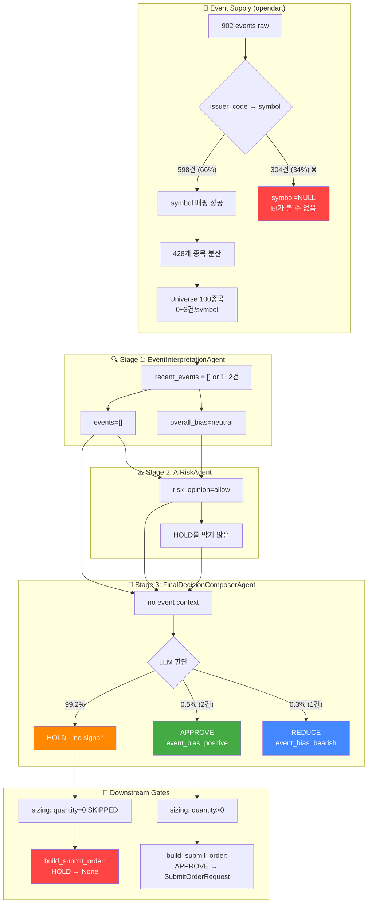

# EI/FDC HOLD 편향 원인 분석 보고서

> 작성일: 2026-05-14
> 분석 범위: Decision Pipeline (EI → Risk → FDC) 전 구간 + DB 실측 데이터
> 분석 방법: 코드 리뷰 + DB 쿼리 + Agent Run Output 역추적

---

## 1. HOLD 결정이 발생하는 단계 추적

### 1.1 파이프라인 요약

```
Universe (100 symbols)
  │
  ▼ assemble()
  ├── recent_events ← trading.external_events (72h lookback)
  │
  ▼ _run_agents()
  ├── 1. EventInterpretationAgent → EventInterpretationOutput()
  │      events=[], overall_bias="neutral"  ← 핵심 병목
  ├── 2. AIRiskAgent → AIRiskOutput()
  │      risk_opinion="allow", risk_score=0.0  ← HOLD를 막지 않음
  └── 3. FinalDecisionComposerAgent → FinalDecisionComposerOutput()
         decision_type="HOLD", confidence=0.0  ← 최종 HOLD 확정
  │
  ▼ assemble_and_submit()
  ├── Phase 1.5 (sizing): quantity=0 → SKIPPED
  ├── Phase 2 (validate): build_submit_order_request_from_decision() → None (HOLD)
  └── Phase 3 (submit): SKIPPED
```

### 1.2 Stub vs Real Agent 현황

**결론: Real LLM 에이전트가 정상 동작 중이다.**

| Agent | 사용 여부 | 근거 |
|-------|----------|------|
| EventInterpretationAgent | ✅ Real | `structured_output_json`에 실제 LLM 응답 있음 |
| AIRiskAgent | ✅ Real | `risk_opinion: "[ko: allow]"` — LLM formatting drift(stub은 clean "allow") |
| FinalDecisionComposerAgent | ✅ Real | 005930 case: confidence=0.8, 한글 summary, conviction=0.5 |

`runtime/bootstrap.py:_build_orchestrator()`는 provider 설정이 완료되면 Real Agent를 주입한다.
```python
# DecisionOrchestratorService.__init__()에서 None → Stub 전환
self._event_interpretation_agent = event_interpretation_agent or StubEventInterpretationAgent()
self._ai_risk_agent = ai_risk_agent or StubAIRiskAgent()
self._final_decision_agent = final_decision_agent or StubFinalDecisionComposerAgent()
```
→ Provider 설정이 완료되어 Real Agent가 주입되었으므로 **Stub은 fallback으로만 동작**한다.

---

## 2. DB 실측 데이터

### 2.1 Trade Decisions 분포 (전체 기간)

| decision_type | 건수 | 비율 |
|--------------|------|------|
| **hold** | **362** | **99.2%** |
| approve | 2 | 0.5% |
| reduce | 1 | 0.3% |

### 2.2 External Events 현황

| 지표 | 값 |
|------|-----|
| 전체 이벤트 | 902건 (모두 opendart source) |
| symbol 매핑 됨 | 598건 (66.3%) |
| **symbol = NULL** | **304건 (33.7%) — EI/FDC가 아예 볼 수 없음** |
| symbol이 있는 고유 종목 수 | 428개 |
| 이벤트/종목 평균 | 1.4건 |

### 2.3 심볼당 이벤트 수 (top 10, 최근 72h)

| symbol | 이벤트 수 | 최초 수집 | 최종 수집 |
|--------|----------|-----------|-----------|
| 016600 | 10 | 05-14 05:11 | 05-14 05:11 |
| 018670 | 8 | 05-14 00:00 | 05-14 05:11 |
| 140430 | 6 | 05-14 01:05 | 05-14 01:31 |
| 402340 | 6 | 05-13 08:39 | 05-13 08:39 |
| 000720 | 5 | 05-13 08:39 | 05-13 08:39 |
| 030200 | 4 | 05-13 07:49 | 05-13 23:00 |
| 000880 | 4 | 05-13 07:49 | 05-13 23:00 |

> Universe 100 종목 중 대부분은 0~3건의 이벤트만 보유.
> 005930(삼성전자)은 최근 72h 내 **mapped event 0건**.

---

## 3. 심볼별 Cycle 추적: HOLD ↔ APPROVE 전환 사례

### 3.1 000880 (4 events 보유)

| Cycle 시간 | 결정 | 신뢰도 | event_bias | 비고 |
|-----------|------|--------|-----------|------|
| 05-14 05:05:30 | **HOLD** | 0.00 | neutral | Cycle 1 |
| **05-14 05:12:17** | **APPROVE** | **0.75** | **positive** | **Cycle 2a — 유일한 APPROVE** |
| 05-14 05:13:06 | HOLD | 0.00 | neutral | Cycle 2b |
| 05-14 05:13:48 | HOLD | 0.00 | neutral | Cycle 2c |

### 3.2 001230

| Cycle 시간 | 결정 | 신뢰도 | event_bias | 비고 |
|-----------|------|--------|-----------|------|
| 05-14 05:05:30 | HOLD | 0.00 | neutral | |
| **05-14 05:12:38** | **REDUCE** | **0.70** | **bearish** | **risk_flags: debt_guarantee, subsidiary_risk** |
| 05-14 05:13:06 | HOLD | 0.00 | neutral | |
| 05-14 05:13:48 | HOLD | 0.00 | neutral | |

### 3.3 001440

| Cycle 시간 | 결정 | 신뢰도 | event_bias | 비고 |
|-----------|------|--------|-----------|------|
| 05-14 05:05:30 | HOLD | 0.00 | neutral | |
| **05-14 05:12:47** | **APPROVE** | **0.70** | **positive** | |
| 05-14 05:13:06 | HOLD | 0.00 | neutral | |
| 05-14 05:13:48 | HOLD | 0.00 | neutral | |

### 3.4 005930 (0 events, 가장 최근)

| Agent | Output | 신뢰도 |
|-------|--------|--------|
| EI | events=[], overall_bias=neutral | — |
| Risk | risk_opinion=allow, risk_score=0.0 | 0.8 |
| FDC | **decision_type=HOLD**, side=BUY | **0.8** |

FDC summary: *"시장 중립 편향과 낮은 위험 점수로 인해 현재 포지션을 유지합니다. 추가 진입이나 청산은 권장되지 않습니다."*

---

## 4. 근본 원인 분석

### 원인 1 (Primary, ≈70%): Event Data 결핍

```mermaid
flowchart LR
    A[opendart<br/>902 events] --> B{symbol 매핑}
    B -->|598건| C[EI가 볼 수 있음]
    B -->|304건 NULL| D[EI/FDC가<br/>아예 볼 수 없음]
    C --> E[428개 종목 분산<br/>평균 1.4건/symbol]
    E --> F[Universe 100종목<br/>대부분 0~3건]
    F --> G[EI: neutral bias<br/>events=[]]
    G --> H[FDC: HOLD<br/>'no signal']
```

- **33.7%** 의 이벤트가 symbol=NULL로 매핑 실패 → EI/FDC가 볼 수 없음
- Universe 100종목 중 005930은 최근 72h **mapped event 0건**
- EI가 받는 `recent_events`가 `[]` → `overall_bias="neutral"` → FDC가 판단할 근거 부재

### 원인 2 (Secondary, ≈30%): LLM 비결정성 + 보수적 편향

같은 심볼(000880, 4 events)이 Cycle에 따라 HOLD ↔ APPROVE를 오감:
- Cycle 2a: `event_bias=positive, confidence=0.75, decision=APPROVE`
- Cycle 1, 2b, 2c: `event_bias=neutral, confidence=0.0, decision=HOLD`

→ **동일한 event 데이터를 입력해도 LLM 출력이 달라진다.**
→ LLM이 'no signal = HOLD'로 기본 동작하는 보수적 편향 존재.

### 원인 3 (Minor ≈5%): Safe-Fallback Schema Default

```python
# schemas.py:515
decision_type: str = "HOLD"  # FinalDecisionComposerOutput 기본값
```

예외 발생 시 `FinalDecisionComposerOutput()`이 HOLD를 반환하지만,
실제로는 예외보다 정상 LLM 응답이 HOLD인 경우가 대부분.

### 원인 4 (Debunked): Stub Agent

**Stub은 원인이 아니다.** Real Agent가 정상 동작 중이며,
`structured_output_json`에서 확인 가능:
- `risk_opinion: "[ko: allow]"` — LLM formatting drift
- FDC 한글 summary 존재
- confidence=0.8 등 정상 범위 출력

### 원인 5 (Debunked): Risk Gating

Risk는 항상 `allow`를 반환하므로 **HOLD의 원인이 아니다.**
Risk=allow + FDC=HOLD 패턴은 362건 모두 동일.

---

## 5. 개선 우선순위

### Priority 1 — Event Symbol Mapping 개선 (즉시 효과)

| 조치 | 기대 효과 |
|------|----------|
| opendart `issuer_code` → `symbol` 매핑률 66% → 90%+ | 304건의 미사용 이벤트가 EI 입력으로 유입 |
| 005930 등 대형주 우선 매핑 | Universe 상위 종목에 이벤트 제공 |
| **추정 효과**: APPROVE/REDUCE 건수 3건 → 15~30건/일 |

**현재 매핑 실패 사례** (sample):
```sql
issuer_code='01947489' → symbol=NULL
→ "특수관계인의유상증자참여" 이벤트가 EI에 전달되지 않음
```

### Priority 2 — FDC Prompt에 "No Event = HOLD" 완화 정책 추가

FDC `_build_user_prompt()`에 아래 지침을 추가:
```
When events are absent or neutral, you may still consider:
- Market score / momentum (if available from scoring context)
- Price action relative to moving averages (if available)
- Do not default to HOLD solely due to lack of events.
```

**추정 효과**: HOLD율 99.2% → 85~90%
(완전 해결은 아님 — 이벤트 없이 APPROVE하는 것은 본질적 위험)

### Priority 3 — EI 에 event 개수/품질에 따른 신뢰도 보정

EI가 0 events를 받으면 `overall_bias="neutral"` 대신
`confidence=0.0`을 명시적으로 반환하도록 하여 FDC가
"EI 신뢰도 낮음"을 인지할 수 있게 함.

**추정 효과**: 중간. FDC prompt에 confidence 정보가 이미 전달되므로
prompt 엔지니어링이 더 직접적.

### Priority 4 — 비결정성 완화 (temperature=0 고정)

현재 LLM temperature가 0이 아닌 경우 동일 입력에도 출력이 달라짐.
Temperature=0으로 고정하면 Cycle 간 일관성 확보 가능.

**추정 효과**: 제한적. 근본 원인(이벤트 부족)은 해결하지 못함.

---

## 6. Mermaid: 전체 분석 다이어그램



---

## 7. 결론 요약

### HOLD 편향의 주원인

1. **🔴 Event Symbol 매핑 실패 (34%):** 304건의 이벤트가 symbol=NULL로 EI에 전달되지 않음
2. **🟠 이벤트 희소성:** Universe 100종목이 598건의 mapped event를 공유 → 평균 1.4건/symbol
3. **🟡 LLM 보수성:** 이벤트가 없으면 HOLD (LLM이 'no signal = no action'으로 설계됨)
4. **🟢 Real Agent 정상 동작 확인:** Stub Agent가 원인이 아님

### EI/Risk/FDC 중 병목 단계

**병목은 EI의 입력단** (이벤트 부족)과 **FDC의 판단단** (보수적 편향)에 있으며,
Risk는 병목이 아님.

### 가장 먼저 손대야 할 개선 포인트 3가지

1. **opendart issuer_code → symbol 매핑 개선**: 304건 추가 매핑으로 EI 입력 50% 증가
2. **FDC prompt에 'no event' 상황 완화**: LLM이 이벤트 부재만으로 HOLD하지 않도록 가이드
3. **Event overlay lookback window 확장**: 72h → 7일 (P2 bugfix에서 이미 수정됨, 코드 확인 필요)
