# EI/FDC HOLD 편향 완화 — 설계 및 구현 계획

## 1. 문제 정의

최근 365개 Trade Decision 중 **362개(99.2%)가 HOLD**.  
핵심 원인: **event 부재/중립 → 무조건 HOLD**로 수렴.

### 1.1 근본 원인

| 원인 | 기여도 | 설명 |
|------|--------|------|
| Event Data 결핍 | ~70% | 902개 OpenDART 이벤트 중 34%가 symbol unmapped, 평균 1.4 events/symbol |
| LLM 보수적 편향 | ~30% | event가 있어도 overall_bias=neutral이면 FDC가 HOLD 선택 |
| safe-fallback 기본값 | 내재적 | `FinalDecisionComposerOutput.decision_type: str = "HOLD"` |

### 1.2 해결 방향 (Two-Axis)

**Axis 1 — EI output 강화**: EI가 evidence quality/quantity를 명확히 전달하도록 필드 추가  
**Axis 2 — FDC no-event 정책 완화**: "no event" ≠ "negative signal", overlay source_type 고려

---

## 2. 변경 상세

### 2.1 [Schema] `AggregateEventView`에 evidence quality 필드 추가

**파일**: `src/agent_trading/services/ai_agents/schemas.py`

```python
@dataclass(slots=True, frozen=True)
class AggregateEventView:
    overall_bias: str = "neutral"
    event_conflict: bool = False
    top_reason_codes: tuple[str, ...] = ()
    opposing_evidence: tuple[str, ...] = ()
    # --- NEW FIELDS (Axis 1) ---
    evidence_strength: str = "none"        # "none" | "weak" | "moderate" | "strong"
    event_count: int = 0                   # 실제 grounding된 event 수
    no_material_events: bool = True        # True = 분석할 material event 없음
```

**`evidence_strength` 분류 기준 (EI prompt에 주입):**

| 값 | 조건 |
|----|------|
| `none` | event_count == 0 |
| `weak` | event_count 1-2, 모두 low/medium importance |
| `moderate` | event_count 2+, high importance 포함 가능 |
| `strong` | event_count 3+, 다수의 high importance, 일관된 방향성 |

### 2.2 [Context] `AssembledContext`에 `source_type` 추가

**파일**: `src/agent_trading/services/decision_orchestrator.py`

```python
@dataclass(slots=True, frozen=True)
class AssembledContext:
    decision_context: DecisionContextEntity
    config_version: ConfigVersionEntity
    recent_events: tuple[ExternalEventEntity, ...]
    score: ScoreResult
    position_snapshot: PositionSnapshotEntity | None = None
    cash_balance_snapshot: CashBalanceSnapshotEntity | None = None
    risk_limit_snapshot: RiskLimitSnapshotEntity | None = None
    # --- NEW FIELD ---
    source_type: str = "core"  # "core" | "held_position" | "event_overlay" | "market_overlay"
```

### 2.3 [Request] `AgentExecutionRequest`에 `source_type` 추가

**파일**: `src/agent_trading/services/ai_agents/base.py`

```python
@dataclass(slots=True, frozen=True)
class AgentExecutionRequest:
    decision_context_id: UUID
    correlation_id: str
    context: AssembledContext
    symbol: str
    market: str
    event_interpretation_output: EventInterpretationOutput | None = None  # from EI
    ai_risk_output: AIRiskOutput | None = None                          # from Risk
    model_id: str = "gpt-4o"
    prompt_id: str | None = None
    # --- NEW FIELD ---
    source_type: str = "core"
```

### 2.4 [Orchestration] `source_type` 전달 경로

**파일**: `src/agent_trading/services/decision_orchestrator.py`

**변경 1**: `assemble()` 메서드 — `SubmitOrderRequest`에서 `source_type` 추출하여 `AssembledContext`에 전달

```python
# assemble() 내부
source_type = getattr(request, "source_type", "core")  # SubmitOrderRequest에 source_type이 있다고 가정
# 또는 request.metadata에서 추출
```

**변경 2**: `_run_agents()` 메서드 — `AssembledContext.source_type` → `AgentExecutionRequest.source_type`으로 전달

```python
# _run_agents() 내부
AgentExecutionRequest(
    ...
    source_type=context.source_type,
)
```

### 2.5 [Decision Loop] `source_type`을 `SubmitOrderRequest.metadata`에 포함

**파일**: `scripts/run_paper_decision_loop.py`

`_run_one_cycle()`에서 `build_submit_order_request_from_decision()` 호출 시 metadata에 source_type 포함:

```python
req = build_submit_order_request_from_decision(
    ...,
    metadata={"source_type": symbol.source_type, ...},
)
```

**파일**: `src/agent_trading/services/decision_orchestrator.py`

`build_submit_order_request_from_decision()`에서 metadata의 source_type을 추출하여 `SubmitOrderRequest`에 포함.

### 2.6 [EI Prompt] evidence_strength 지침 추가

**파일**: `src/agent_trading/services/ai_agents/event_interpretation.py`

**`_build_system_prompt()`** 변경:

```python
def _build_system_prompt(self) -> str:
    return (
        "You are an Event Interpretation Agent. "
        "Your job is to analyze recent events for a given symbol.\n\n"
        "## Evidence Strength Classification\n"
        "Set evidence_strength based on the number and quality of events:\n"
        "- 'none': No material events found for this symbol.\n"
        "- 'weak': 1-2 events available, low or medium importance only.\n"
        "- 'moderate': 2+ events available, may include high importance.\n"
        "- 'strong': 3+ events, multiple high-importance, consistent direction.\n\n"
        "Set no_material_events=True if event_count == 0.\n"
        "Set event_count to the actual count of events provided.\n"
        "IMPORTANT: 'lack of evidence' is NOT the same as 'negative signal'.\n"
        # ... rest of original prompt
    )
```

### 2.7 [FDC Prompt] no-event 정책 완화 + source_type 활용

**파일**: `src/agent_trading/services/ai_agents/final_decision_composer.py`

**`_build_system_prompt()`** 변경:

```python
def _build_system_prompt(self) -> str:
    return (
        "You are a Final Decision Composer Agent. "
        "Your job is to decide the final trading decision.\n\n"
        "## No-Event Policy\n"
        "- 'No material events' is NOT the same as 'negative signal'.\n"
        "- If EI reports no_material_events=True, differentiate:\n"
        "  * evidence_strength=none + source_type=market_overlay: "
        "You may consider WATCH or even APPROVE if price/flow actionability is high.\n"
        "  * evidence_strength=none + source_type=core: "
        "Prefer HOLD when no events, but WATCH is acceptable if risk is low.\n"
        "  * evidence_strength=weak: Consider WATCH instead of HOLD for overlay symbols.\n"
        "- 'negative signal' means EI found events with bearish bias.\n"
        "  In that case, HOLD or REDUCE is appropriate regardless of source_type.\n\n"
        "## Source Type Consideration\n"
        "- core: Conservative — prefer HOLD when no material events.\n"
        "- held_position: Already holding — require clear signal to change.\n"
        "- event_overlay: Added due to recent events — consider the events.\n"
        "- market_overlay: Added due to market flow — no-event is acceptable.\n"
        "  Market overlay symbols CAN be APPROVED or WATCHed even without events.\n"
        # ... rest of original prompt
    )
```

**`_build_user_prompt()`** 변경 — source_type 정보 추가:

```python
def _build_user_prompt(self, request: AgentExecutionRequest) -> str:
    # ... existing code ...
    # ADD:
    parts.append(f"## Symbol Source Type\n{request.source_type}\n\n")
    parts.append(f"## Event Count\n{request.context.recent_events.__len__()}\n\n")
    if request.event_interpretation_output:
        ei = request.event_interpretation_output
        parts.append(f"## Evidence Strength\n{ei.aggregate_view.evidence_strength}\n\n")
        parts.append(f"## No Material Events\n{ei.aggregate_view.no_material_events}\n\n")
    # ... rest ...
```

### 2.8 [Stub Agents] evidence_strength 반영

**파일**: `src/agent_trading/services/ai_agents/event_interpretation.py` — `StubEventInterpretationAgent`

```python
class StubEventInterpretationAgent:
    async def run(self, request: AgentExecutionRequest) -> EventInterpretationOutput:
        events = ()  # stub: no events
        agg = AggregateEventView(
            overall_bias="neutral",
            evidence_strength="none",
            event_count=0,
            no_material_events=True,
        )
        return EventInterpretationOutput(
            symbol=request.symbol,
            market=request.market,
            aggregate_view=agg,
        )
```

---

## 3. Data Flow (변경 후)

```mermaid
flowchart LR
    A[run_paper_decision_loop.py] -->|UniverseSymbol.source_type| B[build_submit_order_request_from_decision]
    B -->|metadata.source_type| C[SubmitOrderRequest]
    C -->|source_type| D[DecisionOrchestratorService.assemble]
    D -->|AssembledContext.source_type| E[_run_agents]
    E -->|AgentExecutionRequest.source_type| F[EI + FDC Agents]
    F -->|prompt에 source_type 전달| G[LLM]
    G -->|evidence_strength / no_material_events| H[Structured Output]
    
    style A fill:#e1f5e1
    style H fill:#fff3e0
```



---

## 4. 변경 파일 목록

| # | 파일 | 변경 내용 | 영향 |
|---|------|-----------|------|
| 1 | `schemas.py` | `AggregateEventView`에 `evidence_strength`, `event_count`, `no_material_events` 추가 | EI output 스키마 확장 |
| 2 | `decision_orchestrator.py` | `AssembledContext`에 `source_type` 추가, `assemble()`/`_run_agents()` 전달 로직 | source_type 파이프라인 전달 |
| 3 | `base.py` | `AgentExecutionRequest`에 `source_type` 추가 | Request에 source_type 포함 |
| 4 | `event_interpretation.py` | `_build_system_prompt()`에 evidence_strength 지침 추가, `StubEventInterpretationAgent`에 새 필드 반영 | EI 프롬프트 개선 |
| 5 | `final_decision_composer.py` | `_build_system_prompt()`에 no-event 정책 + source_type 고려 지침 추가, `_build_user_prompt()`에 source_type/event_count 표시 | FDC 프롬프트 개선 |
| 6 | `run_paper_decision_loop.py` | metadata에 source_type 포함 | source_type 전달 경로 |
| 7 | (test file) | 새 테스트 파일 또는 기존 테스트 확장 | 검증 |

---

## 5. 테스트 계획

### Test 1: EI no-event → evidence_strength=none
- StubEI 사용, events=0 → `AggregateEventView.evidence_strength == "none"`, `no_material_events == True`

### Test 2: FDC no-event vs negative-signal 구분
- FDC stub으로 EI output mock: (a) `no_material_events=True, evidence_strength=none` vs (b) `overall_bias=bearish, evidence_strength=strong`  
- (a)에서 FDC가 HOLD 외의 결정 허용

### Test 3: market_overlay no-event auto-HOLD 방지
- source_type=market_overlay, no_material_events=True → `_build_user_prompt()`에 source_type 정보 포함 확인
- Prompt에 market_overlay 정책 지침 포함 확인

### Test 4: 회귀 테스트
- 기존 `test_decision_submit_pipeline.py` 전체 통과
- 기존 `test_universe_selection.py` 전체 통과
- 새 필드 추가로 인한 기존 테스트 깨짐 없음

---

## 6. 구현 순서

1. **Schema 변경** — `AggregateEventView`에 evidence quality 필드 추가
2. **Context/Request 변경** — `AssembledContext` + `AgentExecutionRequest`에 source_type 추가
3. **Orchestration 변경** — `assemble()` + `_run_agents()`에서 source_type 전달
4. **Decision Loop 변경** — metadata에 source_type 포함
5. **EI Prompt 변경** — evidence_strength 지침 추가
6. **FDC Prompt 변경** — no-event 정책 + source_type 지침 추가
7. **Stub Agent 변경** — 새 필드 반영
8. **테스트 작성** — 4개 테스트
9. **테스트 실행** — pytest
10. **Docker 재빌드/재기동** — health check
