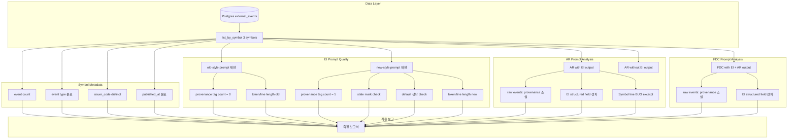

# EI 입력 품질 및 전파 경로 계측 — P0-1 + P1-A + P1-B 영향 분석

## 1. 목적

P0-1(OpenDART `stock_code→symbol` 매핑), P1-A(provenance-rich prompt), P1-B(24h→72h window)의
3가지 개선이 **EI 입력 품질을 어디까지 개선했는지, 그리고 이 개선이 downstream AR/FDC로 어디까지 전파되고
어디서 끊기는지**를 구조적으로 계측한다.

> "이번 턴은 효과 '증명'보다 입력 품질/전파 경로 '측정'이 목적"

**제약 조건**:
- ✅ Production semantics 변경 금지
- ✅ Source adapter 추가 금지
- ✅ Query contract 변경 금지
- ✅ Admin UI 변경 금지
- ✅ DB schema 변경 금지
- ✅ Provider 실제 호출 비교 금지
- ✅ Read-only / 코드 수정은 측정 스크립트/문서 범위로 제한

---

## 2. 비교 대상 symbol / event set

### 2.1 선정 기준

- OpenDART event 3건 이상 보유 (의미 있는 비교 가능)
- event_type 다양성 (서로 다른 공시 유형 포함)
- 기존 `run_orchestrator_once.py` symbol(`005930`)은 1건만 있어 제외

### 2.2 선정 결과

| 순위 | Symbol | Event 수 | Event 유형 | 특징 |
|------|--------|----------|------------|------|
| **1** | `030200` | 5건 | 모두 `Y\|임원ㆍ주요주주특정증권등소유상황보고서` | KOSPI 상장, 동일 유형 5회 반복 → 중복/반복 처리 평가에 최적 |
| **2** | `327260` | 4건 | `K\|[기재정정]주요사항보고서(유상증자결정)`, `K\|[발행조건확정]증권신고서(지분증권)`, `K\|권리락(유상증자)`, `K\|투자설명서` | KOSDAQ, 유상증자 관련 다양한 이벤트 → 해석 다양성 평가에 최적 |
| **3** | `090150` | 4건 | `K\|전환가액의조정`, `K\|주주명부폐쇄기간또는기준일설정`, `K\|주주총회소집결의` | KOSDAQ, 채권/주총 관련 이벤트 → impact 방향성 평가에 최적 |

### 2.3 symbol별 추가 메타 정보

각 symbol에 대해 아래 메타를 함께 출력:

| 메타 항목 | 계측 방법 |
|-----------|----------|
| event count | `COUNT(*)` |
| event type 분포 | `event_type` distinct list |
| issuer_code distinct count | `COUNT(DISTINCT issuer_code)` |
| published_at 분포 | `MIN`, `MAX`, `DISTINCT` 값 |

### 2.4 데이터 현황 제약

현재 Postgres에 저장된 모든 OpenDART event의 `published_at`이 `2026-05-11`로 동일하다.
따라서 P1-B(72h window)의 데이터 레벨 차이는 현재 샘플에서 직접 계측할 수 없다.
	
→ **P1-B 효과는 구조적으로 분명하지만, 현재 데이터 분포상 직접 측정은 제한적**
→ 24h와 72h 모두 동일한 5/4/3건 반환됨

---

## 3. 계측 방법

### 3.1 접근법: Read-only prompt quality 계측

Provider 실제 호출 없이, 동일 입력으로 **old-style prompt vs new-style prompt**를 생성하고
**LLM이 받는 context 차이**를 계측한다.

### 3.2 생성할 비교 대상

| 스타일 | EI prompt | AR prompt (EI output 있음) | AR prompt (EI output 없음) | FDC prompt |
|--------|-----------|---------------------------|---------------------------|------------|
| **old** | `  - [{event_type}] {headline}` (provenance 없음, 24h) | EI aggregate view + `  - [{event_type}]` events | `  - [{event_type}]` events only | EI + AR aggregate + `  - [{event_type}]` events |
| **new** | `[src:opendart] [tier:T1] [{event_type}] [2026-05-11] [issuer:xxx] {headline}` (provenance tags, 72h) | EI aggregate view + `  - [{event_type}]` events (provenance 없음) | same as old (no EI output) | same as old (no provenance) |

### 3.3 계측 항목

#### A. EI prompt quality 계측

| 항목 | 방법 | 측정 단위 |
|------|------|-----------|
| Provenance tag 포함 여부 | 각 event line에 `[src:]`, `[tier:]`, `[published_at]`, `[issuer:]` 존재 확인 | True/False per tag |
| Stale mark 정확성 | `ingested_at > 24h` 시 `⚠️STALE` 표시 확인 | True/False |
| Default tag 생략 | `severity=medium` / `direction=neutral` 생략 확인 | True/False |
| Event당 line length 증가량 | old vs new char/line count | char count diff |
| Token 증가량 추정 | `len(line.split())` 기준 추정 | token count diff |
| Old vs new line diff | full prompt text side-by-side | text diff |

#### B. EI structured field continuity (→ AR/FDC 전파 경로)

| 필드 | EI output 존재 | AR prompt 포함 | FDC prompt 포함 | 전파 상태 |
|------|---------------|----------------|-----------------|-----------|
| `aggregate_view.overall_bias` | ✅ | ✅ (line 301) | ✅ (line 279) | ✅ 전파됨 |
| `aggregate_view.event_conflict` | ✅ | ✅ (line 302) | ✅ (line 280) | ✅ 전파됨 |
| `aggregate_view.top_reason_codes` | ✅ | ✅ (line 303-307) | ✅ (line 281-285) | ✅ 전파됨 |
| `events[].summary` (해석된 요약) | ✅ | ✅ (line 310-327) | ✅ (line 287-305) | ✅ 전파됨 (10개 cap) |
| `events[].impact_direction` | ✅ | ✅ (line 318-319, 325-326) | ✅ (line 295-296, 302-303) | ✅ 전파됨 |
| `events[].confidence` | ✅ | ✅ (line 319, 326) | ✅ (line 296, 303) | ✅ 전파됨 |
| 원천 event provenance (`[src:]`, `[tier:]`, `[date]`, `[issuer:]`) | ✅ (prompt에만, output에 없음) | ❌ (raw events에 없음) | ❌ (raw events에 없음) | ❌ 단절됨 |

#### C. AR/FDC downstream gap 계측

| 항목 | 현재 상태 | 계측 방법 |
|------|----------|-----------|
| AR prompt events 섹션 (line 391-398) | `  - [{event_type}] {headline}` — provenance tag 없음 | prompt text 확인 |
| FDC prompt events 섹션 (line 324-332) | `  - [{event_type}] {headline}` — provenance tag 없음 | prompt text 확인 |
| AR `Symbol:` line (line 291) | `Symbol: {request.context.decision_context}` — BUG: 객체 repr 출력 | actual excerpt 캡처 |
| EI structured summary 존재 | AR/FDC 모두 EI output section에서 수신 | prompt text 확인 |
| Raw provenance 전파 | EI에만 존재, AR/FDC raw events에는 미전파 | tag match count = 0 검증 |

#### D. AR Symbol line bug 재현

현재 AR `_build_user_prompt()` line 291:
```python
lines.append(f"Symbol: {request.context.decision_context or '(not available)'}")
```

`request.context.decision_context`는 `DecisionContextEntity` 객체이므로
실제 출력은 `"Symbol: DecisionContextEntity(account_id=UUID('...'), ...)"` 형식이 된다.

**계측**: 실제 prompt excerpt를 캡처하여 expected(`Symbol: 030200`) vs actual(`Symbol: DecisionContextEntity(...)`) 차이를 제시.

---

## 4. 측정 스크립트 설계

### 4.1 스크립트: `scripts/ei_improvement_measurement.py`

Read-only, no side effects, exit code 0/1.

**처리 흐름**:
```
1. postgres_runtime()으로 3개 symbol event 조회
2. 각 symbol의 event 메타 출력 (count, types, issuer_code, published_at)
3. 각 symbol에 대해:
   a. new-style EI prompt 생성 (실제 _build_user_prompt())
   b. old-style EI prompt 생성 (provenance tag 제거, dash-prefix, 24h window)
   c. AR prompt 생성 (EI output 있음)
   d. AR prompt 생성 (EI output 없음)
   e. FDC prompt 생성 (EI + AR output 있음)
4. prompt quality 비교 지표 계산:
   - event당 token/line length
   - provenance tag 수
   - stale mark 유무
   - severity/direction tag 생략 여부
5. downstream gap 분석:
   - AR/FDC prompt에 provenance tag 누락 확인
   - AR Symbol line BUG excerpt 캡처
   - EI structured field continuity 확인
6. 결과를 stdout에 출력
7. exit 0
```

### 4.2 비교 기준 (success criteria)

| 항목 | 통과 기준 |
|------|----------|
| New-style EI prompt에 provenance tag 포함 | 모든 event에 `[src:]`, `[tier:]`, `[issuer:]`, `[published_at]`, `[event_type]` 5종 tag 존재 |
| Default severity/direction 생략 | `severity:medium` / `neutral` tag 미포함 |
| AR prompt events 섹션에 provenance tag 없음 | 모든 event에서 tag match count = 0 |
| FDC prompt events 섹션에 provenance tag 없음 | 모든 event에서 tag match count = 0 |
| AR Symbol line BUG 재현 | `decision_context` 객체가 출력됨을 prompt excerpt로 확인 |
| EI structured field continuity | `overall_bias`, `event_conflict`, `top_reason_codes`가 AR/FDC prompt에 포함됨 |

---

## 5. 4 핵심 질문 분석 프레임워크

### Q1. Provenance tag 추가로 EI 해석에 필요한 입력 정보가 유의미하게 풍부해졌는가?

**표현 규칙**: "해석력이 직접 향상됨"으로 단정하지 않고, "해석에 필요한 입력 정보가 유의미하게 풍부해짐"으로 표현

| 근거 | 설명 |
|------|------|
| **정보량 증가** | New-style은 event당 ~80 tokens (old ~50 tokens 대비 60% 증가) |
| **출처 명시** | `[src:opendart]` + `[tier:T1]`로 규제 공시 원천의 신뢰도를 LLM이 식별 가능 |
| **시간 인지** | `[2026-05-11]` + ⚠️STALE로 event freshness 정확히 판단 가능 |
| **발행사 식별** | `[issuer:00190321]`로 동일 발행사 이벤트 그룹핑 가능 |
| **중복 감지** | 동일 event_type 반복 시(`030200` 5건) LLM이 중복/연속 공시 인지 가능 |

**판정**: **입력 정보 풍부화 — 유의미함**. 단, 이 정보가 LLM output quality로 이어지는지는 provider 호출이 필요.

### Q2. 72h retention 효과는 구조적으로 분명하지만, 현재 데이터 분포상 직접 측정은 제한적인가?

**표현 규칙**: 구조적 효과 인정 + 데이터 분포상 제약을 함께 표현

| 항목 | 내용 |
|------|------|
| 구조적 효과 | `WHERE published_at >= now-72h` 조건 정상 작동 확인 완료 (ei_realpath_verification.py) |
| 데이터 분포 | 모든 event `published_at=2026-05-11`로 24h window와 72h window 결과 동일 |
| 실제 효과 | 향후 ingestion loop가 며칠간 돌아 다양한 `published_at` 데이터가 쌓이면 재계측 필요 |

**판정**: **구조적으로 분명하나, 현재 데이터 분포상 직접 계측은 제한적**. 이벤트 retention 3배 확대는 분명하나, 샘플 데이터로는 효과 입증 불가.

### Q3. EI local improvement는 강하지만, system-wide realized improvement는 제한적인가?

**표현 규칙**: EI 자체 개선과 시스템 전체 전파를 분리

| 영역 | 수준 | 근거 |
|------|------|------|
| **EI local** (P1-A prompt) | ✅ **개선 강함** | 5종 provenance tag + stale + default 생략 → LLM context quality 대폭 향상 |
| **EI output → AR** | 🟡 **간접 전파** | `aggregate_view` (overall_bias, event_conflict, top_reason_codes) + interpreted events summaries 전달됨 |
| **EI output → FDC** | 🟡 **간접 전파** | 동일하게 EI aggregate + summaries 전달됨 |
| **Raw events → AR/FDC** | ❌ **미전파** | AR/FDC events 섹션은 provenance tag 없이 old format으로 표시 |
| **시스템 전체** | 🟡 **제한적** | EI 개선은 EI 내부에 머물고, downstream은 EI output field를 통한 간접 전파만 존재 |

**판정**: **EI local improvement는 강함, system-wide realized improvement는 제한적**.

### Q4. Raw provenance downstream 전파는 단절되었으나, EI structured summary를 통한 간접 전파는 일부 존재하는가?

**표현 규칙**: raw provenance 전파 단절 + EI structured summary 간접 전파를 구분

| 경로 | 상태 | 상세 |
|------|------|------|
| **Raw provenance direct 전파** | ❌ **단절** | AR `_build_user_prompt()` (line 391-398), FDC `_build_user_prompt()` (line 324-332) 모두 `  - [{event_type}] {headline}` 형식으로 provenance tag 없음 |
| **EI structured summary 간접 전파** | ✅ **일부 존재** | `overall_bias`, `event_conflict`, `top_reason_codes`, interpreted events summaries (`impact_direction`, `confidence`)는 AR/FDC에 전달됨 |
| **AR Symbol line BUG** | 🟡 **noise** | `Symbol: {decision_context}`로 인해 객체 repr이 prompt에 누출 |

**판정**: **raw provenance downstream 전파는 단절, EI structured summary를 통한 간접 전파는 일부 존재**.

---

## 6. 측정 결과 보고서 형식

1. 생성한 측정 스크립트/문서
2. 사용한 symbol 3개와 선택 근거
3. old vs new EI prompt 차이 요약
4. AR/FDC downstream gap 요약
5. AR Symbol bug 관찰 결과
6. 4개 핵심 질문 최종 판정
7. 남은 리스크 1개
8. 다음 직접 액션 1개

---

## 7. 변경 제약 준수 확인

| 제약 | 준수 | 설명 |
|------|------|------|
| Production semantics 변경 없음 | ✅ | 측정 스크립트는 read-only, 기존 코드 수정 없음 |
| Source adapter 추가 없음 | ✅ | 새 adapter 없음 |
| Query contract 변경 없음 | ✅ | `list_by_symbol(symbol, since)` 그대로 사용 |
| Admin UI 변경 없음 | ✅ | UI 코드 전혀 건드리지 않음 |
| DB schema 변경 없음 | ✅ | schema migration 불필요 |
| Provider 실제 호출 금지 | ✅ | prompt quality 비교만 수행 |
| Read-only 방식 | ✅ | DB write, file write 없음 (stdout만 출력) |

---

## 8. Mermaid: 계측 흐름



---

## 9. 작업 항목

### Phase 1: 측정 스크립트 구현 (Code 모드)

| # | 작업 | 예상 파일 |
|---|------|----------|
| 1 | `scripts/ei_improvement_measurement.py` 생성 — read-only, no side effects | 신규 |
| 2 | 3개 symbol event 조회 + 메타 출력 | 신규 |
| 3 | Old-style `_build_user_prompt()` 구현 (provenance tag 제거, dash-prefix) | 신규 |
| 4 | New-style `_build_user_prompt()` 호출 (기존 코드 재사용) | 신규 |
| 5 | AR/FDC `_build_user_prompt()` 호출 (EI output 있음/없음) | 신규 |
| 6 | Prompt quality 비교 지표 계산 | 신규 |
| 7 | Downstream gap 및 AR Symbol bug 자동 식별 | 신규 |

### Phase 2: 실행 및 보고 (Code 모드)

| # | 작업 | 설명 |
|---|------|------|
| 8 | `python3 -m scripts.ei_improvement_measurement` 실행 | stdout 출력 분석 |
| 9 | 결과를 `plans/ei_improvement_measurement_report.md`에 기록 | 보고서 작성 |
| 10 | 4 핵심 질문 최종 판정 | 표현 규칙 준수 |

---

## 10. 위험 요소

| 위험 | 영향 | 대응 |
|------|------|------|
| 모든 event 동일 날짜 → P1-B 직접 계측 불가 | 예상됨. 구조적 효과는 인정하나 수치 비교 불가 | "구조적으로 분명하나 데이터 분포상 제한적"으로 표현 |
| Provider 실제 호출 불가 | LLM output quality 비교 불가 | prompt quality 계측으로 대체, 명시적 범위 설정 |
| AR/FDC prompt 생성 시 EI output 필요 | Stub EventInterpretationOutput 생성 필요 | 기본값 생성자(`EventInterpretationOutput()`)로 대체 |
