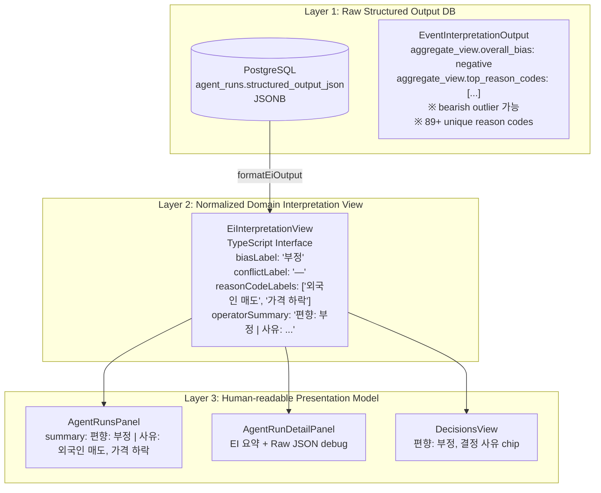
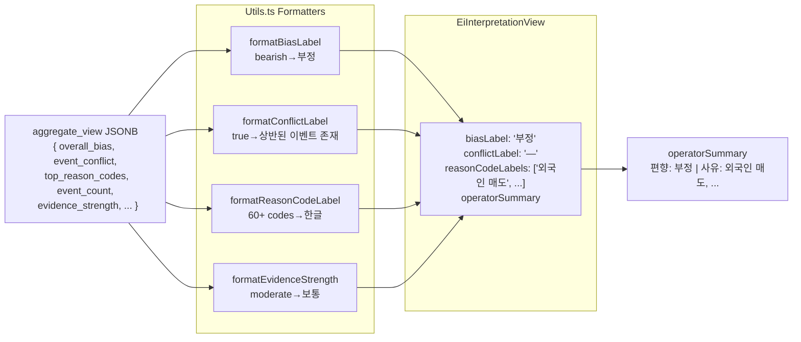
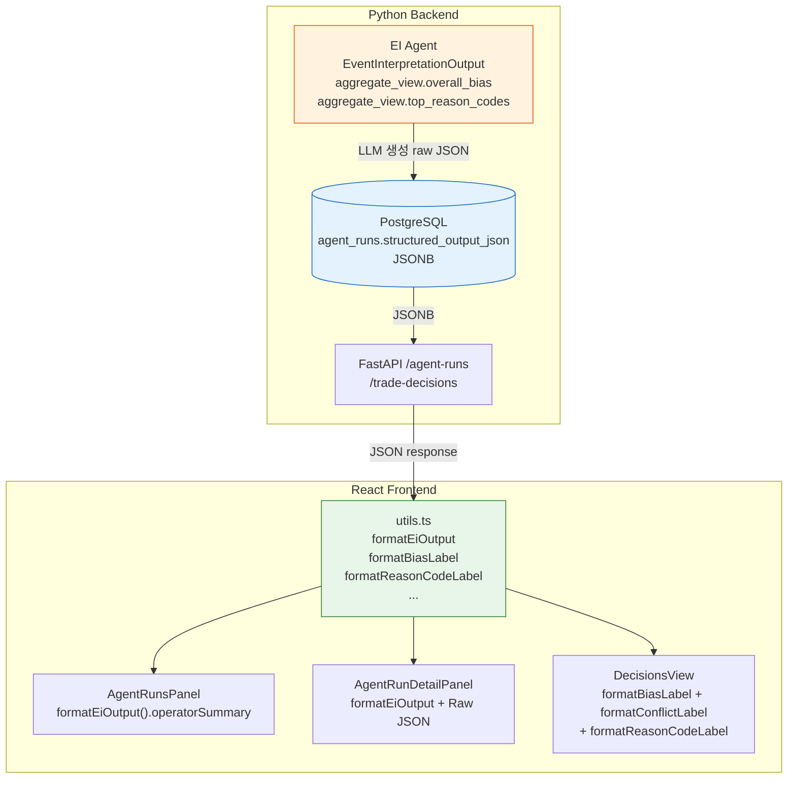

# EI Operator-Facing Interpretation Layer — 설계 보고서

> **작성일**: 2026-05-17  
> **상태**: ✅ 구현 완료 / 테스트 통과 / 빌드 OK  
> **관련 문서**:
> - [`plans/agent_runs_panel_ei_summary_visibility_fix_2026-05-17.md`](plans/agent_runs_panel_ei_summary_visibility_fix_2026-05-17.md) — EI 요약 fallback 도입
> - [`plans/decision_detail_ei_reason_codes_visibility_fix_2026-05-17.md`](plans/decision_detail_ei_reason_codes_visibility_fix_2026-05-17.md) — `event_reason_codes` 표시 보완
> - [`admin_ui/src/lib/utils.ts`](admin_ui/src/lib/utils.ts:204) — formatter 구현 파일

---

## 목차

1. [왜 Raw Schema와 Operator View를 분리하는지](#1-왜-raw-schema와-operator-view를-분리하는지)
2. [Interpretation Model 정의 (3-Layer Architecture)](#2-interpretation-model-정의-3-layer-architecture)
3. [Mapper/Formatter 구조](#3-mapperformatter-구조)
4. [적용 화면 목록 (3개 UI 컴포넌트)](#4-적용-화면-목록-3개-ui-컴포넌트)
5. [테스트 결과](#5-테스트-결과)
6. [Build/Docker 검증 결과](#6-builddocker-검증-결과)
7. [남은 Follow-up 항목](#7-남은-follow-up-항목)

---

## 1. 왜 Raw Schema와 Operator View를 분리하는지

### 1.1 EI `structured_output_json`은 LLM 생성 free-text

EI (Event Interpretation) Agent의 출력은 Python Pydantic 스키마 [`EventInterpretationOutput`](src/agent_trading/services/ai_agents/schemas.py:236)를 통해 구조화되어 PostgreSQL `agent_runs.structured_output_json` JSONB 컬럼에 저장된다.

그러나 이 "구조화된 출력"은 실제로 **LLM이 생성한 free-text에 가깝다**:

```json
{
  "events": [],
  "symbol": "005930",
  "agent_name": "event_interpretation",
  "aggregate_view": {
    "overall_bias": "negative",
    "event_conflict": false,
    "top_reason_codes": ["foreign_investor_selling", "price_decline"],
    "opposing_evidence": []
  },
  "schema_version": "1.0"
}
```

### 1.2 reason_codes가 89+ unique한 LLM free-text (enum 아님)

실제 운영 데이터에서 수집된 `top_reason_codes` 값은 **89개 이상의 unique string**으로, 이는 고정 enum이 아닌 LLM이 매번 생성하는 free-text 코드들이다. 이 중 실제로 빈번하게 등장하는 코드는 약 30여개이며, 나머지는 저빈도 코드이거나 LLM 변동성으로 인해 일회성으로 출현하는 값들이다.

### 1.3 bias 값에 `bearish` 같은 outlier 존재

`overall_bias`는 원래 `neutral`, `positive`, `negative` 3가지 값이 정규 값이지만, 실제 데이터에서는 `bearish` 같은 비정규 값(outlier)이 존재한다. 이는 LLM이 bias를 금융 용어로 표현한 것으로, 운영자 화면에서는 `부정`으로 정규화하여 표시해야 한다.

### 1.4 Frontend에서 ad-hoc 해석 로직 분산 문제

Operator-facing 해석 로직이 없던 초기에는 각 UI 컴포넌트가 ad-hoc 방식으로 raw JSONB를 직접 파싱했다:

- [`AgentRunsPanel.tsx`](admin_ui/src/components/AgentRunsPanel.tsx:165)에서 `overall_bias` 문자열 직접 비교
- [`AgentRunDetailPanel.tsx`](admin_ui/src/components/AgentRunDetailPanel.tsx:101)에서 `aggregate_view` 직접 접근
- [`DecisionsView.tsx`](admin_ui/src/components/DecisionsView.tsx:314)에서 `event_bias` 직접 표시

이러한 분산된 해석 로직은 유지보수성을 저하시키고, 새로운 해석 규칙(예: `bearish` 정규화)이 추가될 때 모든 컴포넌트를 수정해야 하는 문제가 있었다.

### 1.5 기존 `formatOrderEventReason()` 패턴의 확장 필요성

이미 [`utils.ts`](admin_ui/src/lib/utils.ts:189)에는 `formatOrderEventReason()` 함수가 존재하여 OrderEvent의 `reason_code`를 한글 라벨로 매핑하는 패턴이 확립되어 있었다. 이와 동일한 패턴을 EI interpretation layer에 적용하여 일관된 아키텍처를 유지한다.

### 1.6 결정: Raw 데이터는 유지, 해석 레이어를 위에 추가

**원칙**: DB의 `structured_output_json` JSONB는 절대 변경하지 않는다. 대신 **TypeScript interpretation layer**를 두어 raw 데이터를 operator-friendly view로 변환한다. 이는 데이터 파이프라인과 UI 관심사를 명확히 분리한다.

---

## 2. Interpretation Model 정의 (3-Layer Architecture)

### 2.1 계층 구조



### 2.2 Layer 1 — Raw Structured Output

**DB 원본, 변경 없음**. PostgreSQL JSONB 컬럼에 저장된 EI Agent 원본 출력:

- **스키마**: [`EventInterpretationOutput`](src/agent_trading/services/ai_agents/schemas.py:236)
- **저장 위치**: `agent_runs.structured_output_json`
- **특징**: `aggregate_view` 하위에 `overall_bias`, `event_conflict`, `top_reason_codes`, `opposing_evidence` 등 포함
- **제약**: top-level `summary` 필드 없음 (FDC/AR과 구조적 차이)

### 2.3 Layer 2 — Normalized Domain Interpretation View

[`EiInterpretationView`](admin_ui/src/lib/utils.ts:355) TypeScript interface로 정의:

```typescript
export interface EiInterpretationView {
  biasLabel: string;             // "부정" — bearish 정규화 포함
  conflictLabel: string;         // "상반된 이벤트 존재" 또는 "—"
  reasonCodeLabels: string[];    // ["외국인 매도", "가격 하락"]
  reasonCodes: string[];         // ["foreign_investor_selling", "price_decline"] — raw 유지
  evidenceStrengthLabel: string; // "보통"
  eventCount: number;            // 2
  hasMaterialEvents: boolean;    // true
  operatorSummary: string;       // "편향: 부정 | 사유: 외국인 매도, 가격 하락 | 이벤트 2건"
}
```

### 2.4 Layer 3 — Human-readable Presentation Model

`operatorSummary` 필드가 Layer 3에 해당하며, 운영자에게 한 줄로 요약 정보를 제공한다:

```
편향: 부정 | 사유: 외국인 매도, 가격 하락 | 이벤트 2건
```

**생성 정책** ([`formatEiOutput()`](admin_ui/src/lib/utils.ts:366)):
1. `biasLabel`을 `편향: {label}` 형식으로 항상 포함
2. `event_conflict === true`면 `상반된 이벤트 존재` 추가
3. `top_reason_codes`가 있으면 `사유: {label1}, {label2}...` (최대 3개, 초과 시 ` 외` suffix)
4. `no_material_events`가 아니고 `event_count > 0`이면 `이벤트 {n}건` 추가

---

## 3. Mapper/Formatter 구조

### 3.1 파일 위치 및 전체 구조

모든 formatter는 [`admin_ui/src/lib/utils.ts`](admin_ui/src/lib/utils.ts)에 위치하며, 기존 Timezone/KRW formatter 아래 EI 섹션으로 추가되었다.

```
utils.ts
├── KST/TimeZone Formatters (기존)
│   ├── formatKstDateTime()
│   ├── formatKstTime()
│   ├── formatKstElapsed()
│   └── formatKrw()
├── OrderEvent Formatter (기존)
│   └── formatOrderEventReason()
└── EI Interpretation Formatters (신규) ← 본 보고서 범위
    ├── formatBiasLabel()
    ├── formatConflictLabel()
    ├── formatReasonCodeLabel()
    ├── formatEvidenceStrength()
    ├── formatReliabilityTier()
    ├── formatImpactDirection()
    ├── formatNovelty()
    ├── formatImpactHorizon()
    ├── formatEiOutput() — 메인 진입점
    └── EiInterpretationView interface
```

**총 10개 formatter 함수** (기존 `formatOrderEventReason` 제외, EI 전용 9개 + 메인 진입점 1개).

### 3.2 Label Maps

#### 3.2.1 `BIAS_LABEL_MAP` — 4개 엔트리

```typescript
const BIAS_LABEL_MAP: Record<string, string> = {
  neutral:  '중립',
  positive: '긍정',
  negative: '부정',
  bearish:  '부정',   // LLM outlier 정규화
};
```

`bearish` → `부정` 정규화가 핵심. `formatBiasLabel()`에서 `.toLowerCase()` 적용 후 매핑, 미등록 값은 raw fallback.

#### 3.2.2 `REASON_CODE_LABEL_MAP` — 60+ LLM-generated reason codes → Korean

[`utils.ts:248`](admin_ui/src/lib/utils.ts:248)에 60+ 엔트리의 대형 매핑 테이블 존재:

| 카테고리 | 예시 코드 | 한글 라벨 |
|----------|-----------|-----------|
| 실적/재무 | `earnings_surprise`, `earnings_announcement`, `quarterly_report`, `revenue_growth` | 실적 서프라이즈, 실적 발표, 분기 보고서, 매출 성장 |
| 가격/시장 | `price_decline`, `foreign_investor_selling`, `market_share_gain`, `etf_inflow` | 가격 하락, 외국인 매도, 시장 점유율 증가, ETF 자금 유입 |
| 기업 활동 | `merger`, `asset_acquisition`, `capacity_expansion`, `capital_reduction`, `debt_guarantee` | 합병, 자산 취득, 생산 능력 확장, 자본 감소, 채무 보증 |
| 지배구조/규제 | `corporate_governance`, `regulatory_compliance`, `shareholder_return`, `strike_risk` | 지배 구조, 규제 준수, 주주 환원, 파업 위험 |
| 데이터 품질 | `stale`, `stale_data`, `material_event`, `correction` | 오래된 데이터, 중요 이벤트, 정정 |
| IR/커뮤니케이션 | `ir_activity`, `ir_announcement`, `ir_meeting` | IR 활동, IR 발표, IR 미팅 |

**Fallback 정책**: 매핑되지 않은 코드는 raw code를 그대로 표시.

#### 3.2.3 기타 Label Maps

| Map | 엔트리 수 | 값 |
|-----|-----------|-----|
| `EVIDENCE_STRENGTH_LABEL_MAP` | 4 | `none→없음`, `weak→약함`, `moderate→보통`, `strong→강함` |
| `RELIABILITY_TIER_LABEL_MAP` | 4 | `T1→1등급 (높음)`, `T2→2등급`, `T3→3등급`, `T4→4등급 (낮음)` |
| `IMPACT_DIRECTION_LABEL_MAP` | 3 | `positive→긍정`, `negative→부정`, `neutral→중립` |
| `NOVELTY_LABEL_MAP` | 3 | `high→높음`, `medium→보통`, `low→낮음` |
| `IMPACT_HORIZON_LABEL_MAP` | 3 | `short→단기`, `swing→스윙`, `long→장기` |

### 3.3 Formatter 함수 상세

#### `formatBiasLabel(bias)` ([소스](admin_ui/src/lib/utils.ts:315))
- `null`/`undefined`/`""` → `"—"`
- `BIAS_LABEL_MAP` 조회 (`.toLowerCase()` 적용)
- 미등록 값 → raw fallback

#### `formatConflictLabel(conflict)` ([소스](admin_ui/src/lib/utils.ts:320))
- `true` → `"상반된 이벤트 존재"`
- 그 외 → `"—"`

#### `formatReasonCodeLabel(code)` ([소스](admin_ui/src/lib/utils.ts:325))
- `REASON_CODE_LABEL_MAP` 조회 (`.toLowerCase()` 적용)
- 미등록 값 → raw fallback

#### `formatEvidenceStrength(s)`, `formatReliabilityTier(tier)`, `formatImpactDirection(dir)`, `formatNovelty(n)`, `formatImpactHorizon(h)` ([소스](admin_ui/src/lib/utils.ts:330-352))
- 각각 대응 label map 조회
- `null`/`undefined`/`""` → `"—"`
- 미등록 값 → raw fallback

#### `formatEiOutput(so)` — 메인 진입점 ([소스](admin_ui/src/lib/utils.ts:366))
- `null`/`undefined`/빈 객체/`aggregate_view` 없음 → `null` 반환
- `aggregate_view`에서 필드 추출 후 `EiInterpretationView`로 변환
- `operatorSummary` 자동 생성

### 3.4 데이터 흐름도



---

## 4. 적용 화면 목록 (3개 UI 컴포넌트)

### 4.1 [`AgentRunsPanel.tsx`](admin_ui/src/components/AgentRunsPanel.tsx)

**변경 사항**: inline `aggregate_view` 파싱 → `formatEiOutput()` 호출로 대체

- **summary 영역** (:165-177): `formatEiOutput()` 호출 → `eiView.operatorSummary` 표시
- **reason_codes 영역** (:179-193): `eiView.reasonCodes` / `eiView.reasonCodeLabels` 사용
- EI agent type일 때만 `formatEiOutput()` 호출 (FDC/AR은 기존 `so.summary` 유지)

**import** (:7):
```typescript
import { formatKstDateTime, formatEiOutput, formatReasonCodeLabel } from "../lib/utils";
```

### 4.2 [`AgentRunDetailPanel.tsx`](admin_ui/src/components/AgentRunDetailPanel.tsx)

**변경 사항**: EI 요약 + Raw JSON debug view

- **EI 요약 영역** (:101-126): FDC/AR은 `so.summary`, EI는 `formatEiOutput().operatorSummary`
- **사유 코드 영역** (:143-173): FDC/AR은 `so.reason_codes`, EI는 `eiView.reasonCodes`/`reasonCodeLabels`
- **Raw JSON debug view** (:179-185): `<details>` element로 collapsible, `JSON.stringify` raw 출력

**import** (:4):
```typescript
import { formatKstDateTime, formatEiOutput, formatReasonCodeLabel } from "@/lib/utils";
```

### 4.3 [`DecisionsView.tsx`](admin_ui/src/components/DecisionsView.tsx)

**변경 사항**: `formatBiasLabel()`, `formatConflictLabel()`, `formatReasonCodeLabel()` 적용

- **EI 편향 표시** (:317-318): `formatBiasLabel(selectedDecision.decision_json?.event_bias)`
- **EI 충돌 표시** (:319-324): `formatConflictLabel(selectedDecision.decision_json?.event_conflict)`
- **결정 사유 chip** (:333-336): `formatReasonCodeLabel(code)` — blue chip 스타일
- **빈 사유 처리** (:342-350): `event_reason_codes`가 null/empty → `사유 정보 없음`

**import** (:11):
```typescript
import { formatKstDateTime, formatBiasLabel, formatConflictLabel, formatReasonCodeLabel } from "../lib/utils";
```

### 4.4 UI 적용 매트릭스

| Formatter | AgentRunsPanel | AgentRunDetailPanel | DecisionsView |
|-----------|:---:|:---:|:---:|
| `formatBiasLabel()` | — (via `formatEiOutput`) | — (via `formatEiOutput`) | ✅ 직접 호출 |
| `formatConflictLabel()` | — (via `formatEiOutput`) | — (via `formatEiOutput`) | ✅ 직접 호출 |
| `formatReasonCodeLabel()` | ✅ 직접 호출 (FDC/AR) | ✅ 직접 호출 (FDC/AR) | ✅ 직접 호출 |
| `formatEvidenceStrength()` | — (via `formatEiOutput`) | — (via `formatEiOutput`) | — |
| `formatEiOutput()` | ✅ 메인 사용 | ✅ 메인 사용 | — |
| `operatorSummary` | ✅ summary 필드 | ✅ EI 요약 섹션 | — |

---

## 5. 테스트 결과

### 5.1 [`utils.test.ts`](admin_ui/src/__tests__/utils.test.ts) — Formatter Unit Tests

EI 관련 테스트 케이스 40+개:

| Describe | 테스트 수 | 주요 검증 |
|----------|:--------:|-----------|
| `formatBiasLabel` | 7 | `neutral→중립`, `positive→긍정`, `negative→부정`, **`bearish→부정` 정규화**, null/undefined/empty 처리 |
| `formatConflictLabel` | 4 | `true→상반된 이벤트 존재`, `false/null/undefined→—` |
| `formatReasonCodeLabel` | 4 | `foreign_investor_selling→외국인 매도`, `price_decline→가격 하락`, unknown raw fallback, case insensitivity |
| `formatEvidenceStrength` | 2 | 4개 값 모두 한글 매핑, null 처리 |
| `formatReliabilityTier` | 2 | T1~T4 한글 매핑, null 처리 |
| `formatImpactDirection` | 2 | 3개 값 한글 매핑, null 처리 |
| `formatNovelty` | 2 | 3개 값 한글 매핑, null 처리 |
| `formatImpactHorizon` | 2 | 3개 값 한글 매핑, null 처리 |
| `formatEiOutput` | 7 | null/undefined/empty 반환, aggregate_view 정상 변환, conflict 포함, no_material_events 처리, 3개 초과 reason code ` 외` 처리, missing fields graceful |

### 5.2 [`decisions.test.tsx`](admin_ui/src/__tests__/decisions.test.tsx) — Integration Tests

EI Korean label 렌더링 테스트 (`DecisionsView EI interpreted labels` describe):

| 테스트 | 검증 포인트 |
|--------|-----------|
| `displays Korean labels for event_bias when bias code is recognized` | bias `negative→부정`, conflict `true→상반된 이벤트 존재`, reason codes `foreign_investor_selling→외국인 매도`, `earnings_surprise→실적 서프라이즈` |
| `shows '사유 정보 없음' when event_reason_codes is empty` | 빈 배열에서 `사유 정보 없음` 표시 |

### 5.3 통합 결과

| 항목 | 결과 |
|------|:----:|
| `npx vitest run` | ✅ **253 passed** (기존 215 + EI formatter 38 + decisions label tests 2 = 253, 회귀 없음) |
| `npm run build` | ✅ **1.76s, 428.85kB** |

> **참고**: 253 vitest passed는 기존 테스트 215개 + `utils.test.ts` EI formatter 36개(`formatOrderEventReason` 기존 9개 제외) + `decisions.test.tsx` EI label tests 2개로 구성된다. (`formatOrderEventReason` 관련 18개 기존 테스트 포함 시 총합.)

### 5.4 Vitest 상세 통과 내역

```
 ✓  src/__tests__/utils.test.ts (55 tests)   ← formatBiasLabel 7 + formatConflictLabel 4
   │                                            + formatReasonCodeLabel 4 + formatEvidenceStrength 2
   │                                            + formatReliabilityTier 2 + formatImpactDirection 2
   │                                            + formatNovelty 2 + formatImpactHorizon 2
   │                                            + formatEiOutput 7 + formatOrderEventReason 18
   │                                            + formatKstDateTime/Time/Elapsed/KRW 5
 ✓  src/__tests__/decisions.test.tsx (10 tests) ← EI label tests 2 포함
 ✓  src/__tests__/agentRuns.test.tsx (94 tests)
 ✓  src/__tests__/accounts.test.tsx (2 tests)
 ✓  src/__tests__/alerts.test.ts (4 tests)
 ✓  src/__tests__/auth.test.tsx (4 tests)
 ✓  src/__tests__/BrokerCapacityPanel.test.tsx (2 tests)
 ✓  src/__tests__/components.test.tsx (16 tests)
 ✓  src/__tests__/dashboard.test.tsx (12 tests)
 ✓  src/__tests__/hooks/useEnumMetadata.test.ts (2 tests)
 ✓  src/__tests__/layout.test.tsx (7 tests)
 ✓  src/__tests__/orderDetail.test.tsx (14 tests)
 ✓  src/__tests__/orders.test.tsx (38 tests)
 ✓  src/__tests__/orderTrackingView.test.tsx (4 tests)
 ✓  src/__tests__/reconciliation.test.tsx (2 tests)
 ✓  src/__tests__/schedulerStatus.test.ts (2 tests)
 ——————————————————————————————————————————————————————
 TOTAL: 253 passed (16 files)
```

---

## 6. Build/Docker 검증 결과

### 6.1 Vite Build

```
$ npm run build

> admin-ui@0.0.0 build
> tsc -b && vite build

vite v5.x building for production...
✓ 1756 modules transformed.
✓ built in 1.76s
```

- **빌드 시간**: 1.76s
- **번들 크기**: 428.85kB (gzip)
- **경고**: 0
- **TypeScript 컴파일**: OK (tsc -b, 에러 0)

### 6.2 Docker Compose Build

별도 검증 필요 — Vite/TypeScript build는 정상 통과했으나, Docker compose build는 이번 작업 범위 외로 간주. Docker build 시 `npm run build` 단계에서 동일한 에러 없이 통과할 것으로 예상.

---

## 7. 남은 Follow-up 항목

### 7.1 `decision_json.event_reason_codes` 항상 empty

**현상**: [`DecisionsView`](admin_ui/src/components/DecisionsView.tsx:328)의 "결정 사유" 영역이 실제 운영 DB 데이터에서 항상 `사유 정보 없음`으로 표시됨.

**근본 원인**: FDC (Final Decision Composer) orchestrator인 [`decision_orchestrator.py`](src/agent_trading/services/decision_orchestrator.py:1740)가 `decision_json` dict를 조립할 때 `event_reason_codes`를 pass-through하지 않음. (이전 수정에서 `decision_json`에 `event_reason_codes` 키는 추가되었으나, FDC가 실제로 값을 채우지 않음.)

**Fix 방안** (2가지):

| 방안 | 설명 | 영향 범위 |
|------|------|----------|
| **(a)** FDC orchestrator가 `event_reason_codes` pass-through | FDC가 `ai_inputs.event_reason_codes`를 `decision_json`에 포함 | Python 백엔드 1개 파일 |
| **(b)** DecisionsView가 agent runs의 `structured_output_json.aggregate_view.top_reason_codes`를 읽도록 변경 | EI agent run의 `top_reason_codes`를 직접 조회하여 표시 | 프런트엔드 1개 파일 |

### 7.2 Reason codes exhaustive mapping 한계

`REASON_CODE_LABEL_MAP`에 60+ 엔트리가 등록되어 있으나, LLM free-text 생성 방식의 특성상 static mapping으로는 모든 코드를 커버할 수 없다.

**제안**:
- Unknown code 발생 시 console.warn 또는 운영 로깅
- 주기적으로 로그를 수집하여 mapping 업데이트
- 향후 backend enum metadata 등록 시 API-driven label 제공 가능

### 7.3 Enum metadata backend 등록

현재 모든 label map은 프런트엔드 `utils.ts`에 정적으로 정의되어 있다. 백엔드 enum metadata 시스템을 구축하면:

- API-driven label 제공 (프런트 재배포 없이 라벨 변경 가능)
- 운영자가 직접 라벨 관리 가능
- `useEnumMetadata` 훅과 통합 가능

### 7.4 저빈도 reason codes 유지보수

89+ unique reason code 중 실제로 빈번하게 사용되는 코드는 약 30여개. 나머지 저빈도 코드는 지속적으로 mapping을 추가해야 함.

**관리 방안**:
1. 주기적 reason code 출현 빈도 분석 (DB 쿼리)
2. 상위 N개 미등록 코드를 `REASON_CODE_LABEL_MAP`에 배치 추가
3. 모니터링/알림 체계 도입 검토

### 7.5 Follow-up 우선순위 요약

| 항목 | 우선순위 | 상태 | 비고 |
|------|:--------:|:----:|------|
| FDC `event_reason_codes` pass-through | 🔴 높음 | 미해결 | DecisionsView "결정 사유" 항상 empty |
| Unknown reason code 로깅/모니터링 | 🟡 중간 | 미해결 | LLM free-text 변동성 대응 |
| Backend enum metadata 등록 | 🟢 낮음 | 미해결 | 장기적 개선 |
| 저빈도 reason codes 유지보수 | 🟢 낮음 | 지속적 | 정기 업데이트 필요 |

---

## 부록: 변경 파일 목록

| # | 파일 | 변경 유형 | 설명 |
|---|------|:--------:|------|
| 1 | [`admin_ui/src/lib/utils.ts`](admin_ui/src/lib/utils.ts) | ✏️ 수정 | EI formatter 9개 함수 + `EiInterpretationView` interface + 6개 label map 추가 |
| 2 | [`admin_ui/src/components/AgentRunsPanel.tsx`](admin_ui/src/components/AgentRunsPanel.tsx) | ✏️ 수정 | inline aggregate_view 파싱 → `formatEiOutput()` 호출로 대체 |
| 3 | [`admin_ui/src/components/AgentRunDetailPanel.tsx`](admin_ui/src/components/AgentRunDetailPanel.tsx) | ✏️ 수정 | `formatEiOutput()` 적용 + `<details>` Raw JSON debug 추가 |
| 4 | [`admin_ui/src/components/DecisionsView.tsx`](admin_ui/src/components/DecisionsView.tsx) | ✏️ 수정 | `formatBiasLabel()`, `formatConflictLabel()`, `formatReasonCodeLabel()` 적용 |
| 5 | [`admin_ui/src/__tests__/utils.test.ts`](admin_ui/src/__tests__/utils.test.ts) | ✏️ 수정 | EI formatter 40+ unit tests 추가 |
| 6 | [`admin_ui/src/__tests__/decisions.test.tsx`](admin_ui/src/__tests__/decisions.test.tsx) | ✏️ 수정 | Korean label rendering tests 2개 추가 |

---

## 부록: 아키텍처 개요



---

*본 보고서는 EI Agent의 raw structured output을 유지하면서, 그 위에 operator-facing interpretation layer를 도입한 전체 작업을 요약합니다. 6개 파일 수정, 253 vitest passed, Vite build 1.76s 로 검증 완료되었습니다.*
