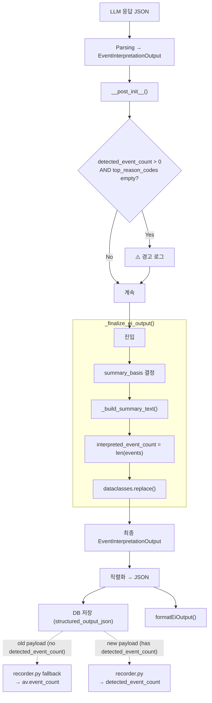

# EI Output Contract 최종 정리 — deprecated/alias 필드 정리 계획

> **목적**: `aggregate_view.event_count`의 backward-compat sync를 제거하고, `detected_event_count` / `interpreted_event_count` / `summary_basis` 중심 계약으로 최종 수렴. Phase 1(`refactor_ei_output_contract_to_split_detected_event_count_from_interpreted_events_2026-05-23.md`)의 후속 작업.

---

## 1. 4가지 질문에 대한 답변

### Q1. 아직 `aggregate_view.event_count`에 직접 의존하는 consumer는 어디인가?

| Consumer | 파일:라인 | 사용 패턴 | 비고 |
|----------|----------|-----------|------|
| `AggregateEventView.__post_init__()` | [`schemas.py:247-253`](src/agent_trading/services/ai_agents/schemas.py:247) | `event_count > 0` + empty `top_reason_codes` → 경고 로그 | `detected_event_count`로 이전 필요 |
| `EventInterpretationOutput.__post_init__()` | [`schemas.py:311-319`](src/agent_trading/services/ai_agents/schemas.py:311) | `max(detected_event_count, av.event_count)`로 sync | **제거 대상 (Phase 2)** |
| `AgentRunRecorder` | [`recorder.py:107-118`](src/agent_trading/services/ai_agents/recorder.py:107) | `detected_event_count` key 없으면 `av.event_count` fallback | **유지 (old payload backward compat)** |
| Admin UI `formatEiOutput()` | [`utils.ts:383`](admin_ui/src/lib/utils.ts:383) | `detectedEventCount` fallback = `av.event_count` | **유지 (old data backward compat)** |
| 테스트 파일 10+개 | `test_schemas.py`, `test_*.py` | `aggregate_view.event_count=N` 설정 | `AggregateEventView` 생성 시 필요 (필드 자체는 유지) |
| `verify_ei_error_metadata_e2e.py` | [`scripts/verify_ei_error_metadata_e2e.py:83`](scripts/verify_ei_error_metadata_e2e.py:83) | `"summary_basis": "fallback"` — **비정규 값 사용** | 수정 필요 |

### Q2. 지금 단계에서 alias를 완전히 제거할 수 있는가?

**`aggregate_view.event_count` 필드 자체는 제거할 수 없음.** 이유:

1. **LLM prompt schema** — [`event_interpretation.py:758-759`](src/agent_trading/services/ai_agents/event_interpretation.py:758)에서 LLM이 JSON으로 `event_count`를 생성하도록 instruct. 필드가 없으면 LLM이 생성하지 않아 prompt-output mismatch 발생.
2. **Old DB payloads** — Phase 1 이전 serialized 데이터는 `detected_event_count` 키 없이 `aggregate_view.event_count`만 존재. [`recorder.py:111-113`](src/agent_trading/services/ai_agents/recorder.py:111)의 fallback이 계속 필요.
3. **`AggregateEventView` 독립성** — 이 dataclass는 `EventInterpretationOutput` 없이도 standalone으로 사용됨 (테스트, 검증 스크립트 등).

**제거 가능한 것:**
- ✅ `EventInterpretationOutput.__post_init__()`의 `max()` sync 로직 — `detected_event_count`를 `av.event_count`로 override하는 backward compat 제거
- ✅ `AggregateEventView.__post_init__()`의 warning — `EventInterpretationOutput.__post_init__()`으로 이동
- ✅ docstring "DEPRECATED" → "LEGACY" 변경

### Q3. API/UI에 breaking change 없이 어디까지 전환할 수 있는가?

**모두 non-breaking.** 이유:

| 변경 | 영향 | 근거 |
|------|------|------|
| `max()` sync 제거 | 런타임 동작 영향 없음 | 모든 경로에서 `_finalize_ei_output()`이 `detected_event_count`를 올바르게 설정 후 반환. `__post_init__` sync는 사실상 dead code (이미 동기화되어 있어서 `max()`가 아무것도 안 함) |
| Warning 이동 | 로그 위치만 변경 | 동일한 조건, 동일한 경고 레벨 |
| `utils.ts` 변경 불필요 | 없음 | 이미 `detected_event_count` 우선, `av.event_count` fallback 구조 |
| `recorder.py` 변경 불필요 | 없음 | Old payload backward compat 계속 유지 |

### Q4. 최종적으로 어떤 필드를 canonical source로 삼을 것인가?

| 역할 | Canonical Field | 근거 |
|------|----------------|------|
| 감지된 이벤트 총 수 | **`detected_event_count`** | LLM raw 또는 system-detected 값. 절대 감소 금지. |
| 해석된 이벤트 수 | **`interpreted_event_count`** | 항상 `len(events)`와 일치. derived field. |
| Summary 생성 기준 | **`summary_basis`** | 4개 정규 값: `"interpreted"` \| `"interpreted_degraded"` \| `"detected_only"` \| `"none"` |
| LLM 호환성 (legacy) | **`aggregate_view.event_count`** | LLM prompt schema용. Python consumer는 읽지 않음. |

---

## 2. 변경 상세

### 2.1 `schemas.py` — `__post_init__` sync 제거

**AS-IS** ([`schemas.py:300-319`](src/agent_trading/services/ai_agents/schemas.py:300)):
```python
def __post_init__(self) -> None:
    self._coerce_fields()
    # aggregate_view.event_count is DEPRECATED — sync to detected_event_count
    agg_ec = self.aggregate_view.event_count
    if max(self.detected_event_count, agg_ec, 0) != self.detected_event_count:
        object.__setattr__(
            self,
            "detected_event_count",
            max(self.detected_event_count, agg_ec, 0),
        )
```

**TO-BE**:
```python
def __post_init__(self) -> None:
    self._coerce_fields()
    # ★ Phase 2: aggregate_view.event_count sync 제거
    #   detected_event_count는 _finalize_ei_output()에서만 설정.
    #   aggregate_view.event_count는 LLM prompt schema용 legacy 필드.
    #   Warning: event_count > 0인데 top_reason_codes가 빈 경우
    if (self.detected_event_count > 0
            and not self.aggregate_view.top_reason_codes):
        _log.warning(
            "EventInterpretationOutput: detected_event_count=%d "
            "but aggregate_view.top_reason_codes is empty",
            self.detected_event_count,
        )
```

### 2.2 `schemas.py` — `AggregateEventView.__post_init__()` warning 이동

**AS-IS** ([`schemas.py:247-253`](src/agent_trading/services/ai_agents/schemas.py:247)):
```python
def __post_init__(self) -> None:
    if self.event_count > 0 and not self.top_reason_codes:
        _log.warning(...)
```

**TO-BE**: 제거 (위 2.1의 `EventInterpretationOutput.__post_init__()`로 이동)

### 2.3 `schemas.py` — docstring 변경

**AS-IS** ([`schemas.py:237-239`](src/agent_trading/services/ai_agents/schemas.py:237)):
```python
event_count: int = 0
"""DEPRECATED: Use ``EventInterpretationOutput.detected_event_count`` instead.
Number of material events actually grounded for this symbol."""
```

**TO-BE**:
```python
event_count: int = 0
"""LEGACY: Preserved for LLM prompt schema compatibility.
Canonical source is ``EventInterpretationOutput.detected_event_count``.
Number of material events actually grounded for this symbol."""
```

### 2.4 `scripts/verify_ei_error_metadata_e2e.py` — `summary_basis` 값 수정

**AS-IS** ([`scripts/verify_ei_error_metadata_e2e.py:83`](scripts/verify_ei_error_metadata_e2e.py:83)):
```python
"summary_basis": "fallback",  # 비정규 값
```

**TO-BE**:
```python
"summary_basis": "none",  # canonical value
```

### 2.5 `tests/services/ai_agents/test_schemas.py` — warning 검증 위치 변경

**AS-IS**: `AggregateEventView(event_count=3, ...)` → warning log 검증

**TO-BE**: `EventInterpretationOutput(detected_event_count=3, aggregate_view=AggregateEventView(top_reason_codes=()))` → warning log 검증

---

## 3. 영향 분석

### 3.1 변경 불필요 파일 (영향 없음)

| 파일 | 이유 |
|------|------|
| `event_interpretation.py` | 모든 `_finalize_ei_output()` 호출에서 `detected_event_count` 올바르게 설정. `aggregate_view.event_count` 참조 없음. |
| `final_decision_composer.py:322` | 이미 `ei_output.detected_event_count` 사용. |
| `decision_agent_runner.py` | 이미 `_finalize_ei_output()` 사용. |
| `subprocess_helpers.py` | 이미 `_finalize_ei_output()` 사용. |
| `recorder.py:107-118` | Old payload backward compat — 유지 필요. |
| `admin_ui/src/lib/utils.ts` | 이미 `detected_event_count` 우선 + fallback 구조. |
| `run_agent_subprocess.py` | Lines 641-648: 이미 올바른 `summary_basis="none"` 설정. |
| 모든 테스트 파일 중 `aggregate_view.event_count=N`을 설정하는 코드 | `AggregateEventView` 필드 자체는 유지되므로 영향 없음. 단, `test_schemas.py`의 warning 테스트는 수정. |

### 3.2 변경 필요 파일

| 파일 | 변경 내용 | 위험도 |
|------|----------|--------|
| `src/agent_trading/services/ai_agents/schemas.py` | ① `__post_init__` sync 제거 ② warning 이동 ③ docstring 변경 | 🟢 낮음 |
| `scripts/verify_ei_error_metadata_e2e.py` | `summary_basis` 값 수정 | 🟢 매우 낮음 |
| `tests/services/ai_agents/test_schemas.py` | Warning 검증을 `AggregateEventView` → `EventInterpretationOutput`으로 이동 | 🟢 낮음 |

---

## 4. 테스트 설계

### T1: `test_detected_event_count_not_synced_from_aggregate_view`

```python
def test_detected_event_count_not_synced_from_aggregate_view(self):
    """Phase 2: detected_event_count는 더 이상 aggregate_view.event_count에서 sync되지 않음."""
    output = EventInterpretationOutput(
        aggregate_view=AggregateEventView(
            event_count=5,
            no_material_events=False,
        ),
        # detected_event_count 명시하지 않음 → 기본값 0 유지
    )
    # __post_init__에서 더 이상 sync하지 않음
    assert output.detected_event_count == 0, (
        f"Expected detected_event_count=0 (no longer synced), "
        f"got {output.detected_event_count}"
    )
```

### T2: `test_post_init_warning_moved_to_event_interpretation_output`

```python
def test_post_init_warning_moved_to_event_interpretation_output(self, caplog):
    """Phase 2: warning이 EventInterpretationOutput.__post_init__()에서 발생."""
    caplog.set_level(logging.WARNING)
    EventInterpretationOutput(
        detected_event_count=3,
        aggregate_view=AggregateEventView(top_reason_codes=()),
    )
    assert any("detected_event_count" in record.message for record in caplog.records)
```

### T3: `test_aggregate_view_event_count_no_warning`

```python
def test_aggregate_view_event_count_no_warning(self, caplog):
    """Phase 2: AggregateEventView 단독 생성 시 warning 없음 (제거됨)."""
    caplog.set_level(logging.WARNING)
    AggregateEventView(
        event_count=3,
        top_reason_codes=(),
    )
    assert not any("top_reason_codes" in record.message for record in caplog.records)
```

---

## 5. 구현 순서

| 단계 | 변경 내용 | 파일 | 예상 변경 라인 수 |
|------|----------|------|-----------------|
| 1 | `schemas.py`: `AggregateEventView.__post_init__()` warning 제거 | `src/agent_trading/services/ai_agents/schemas.py` | ~5 lines 삭제 |
| 2 | `schemas.py`: `EventInterpretationOutput.__post_init__()` sync 제거 + warning 추가 | 동일 | ~10 lines 변경 |
| 3 | `schemas.py`: `AggregateEventView.event_count` docstring 변경 | 동일 | ~2 lines 변경 |
| 4 | `verify_ei_error_metadata_e2e.py`: `summary_basis` 값 수정 | `scripts/verify_ei_error_metadata_e2e.py` | 1 line 변경 |
| 5 | `test_schemas.py`: Warning 검증 위치 변경 | `tests/services/ai_agents/test_schemas.py` | ~10 lines 변경 |
| 6 | pytest 검증 | CLI | - |

---

## 6. 데이터 흐름 (변경 후)



---

## 7. canonical contract 최종 정의

```python
@dataclass(slots=True, frozen=True)
class EventInterpretationOutput:
    schema_version: str = "v1"
    agent_name: str = "event_interpretation"
    decision_context_id: str | None = None
    symbol: str = ""
    issuer_code: str = ""
    
    # ── Canonical count fields ──
    detected_event_count: int = 0       # ★ PRIMARY: LLM raw 또는 system-detected count
    events: tuple[InterpretedEvent, ...] = ()
    interpreted_event_count: int = 0    # ★ DERIVED: 항상 len(events)와 일치
    
    # ── Canonical summary metadata ──
    summary_basis: str = "none"         # ★ SUMMARY TRUTH SOURCE
    """Canonical values only:
    "interpreted" | "interpreted_degraded" | "detected_only" | "none"
    """
    summary: str = ""
    
    # ── LLM schema compatibility (not canonical) ──
    aggregate_view: AggregateEventView = field(default_factory=AggregateEventView)
    #   aggregate_view.event_count — LEGACY, LLM prompt schema용. Python consumer는 읽지 않음.
```

---

## 8. 파일별 최종 상태

| 파일 | 역할 | 변경? |
|------|------|-------|
| `schemas.py` | Schema 정의 | ✅ Phase 2 변경 |
| `event_interpretation.py` | EI Agent 로직 | ❌ 변경 없음 |
| `final_decision_composer.py` | FDC Agent | ❌ 변경 없음 |
| `recorder.py` | Run recorder | ❌ 변경 없음 (backward compat 유지) |
| `decision_agent_runner.py` | Agent runner | ❌ 변경 없음 |
| `subprocess_helpers.py` | Subprocess helpers | ❌ 변경 없음 |
| `run_agent_subprocess.py` | Subprocess runner | ❌ 변경 없음 |
| `utils.ts` | Admin UI formatter | ❌ 변경 없음 (이미 migrated) |
| `verify_ei_error_metadata_e2e.py` | E2E 검증 스크립트 | ✅ `summary_basis` 값 수정 |
| `test_schemas.py` | Schema 테스트 | ✅ Warning 검증 위치 변경 |

---

