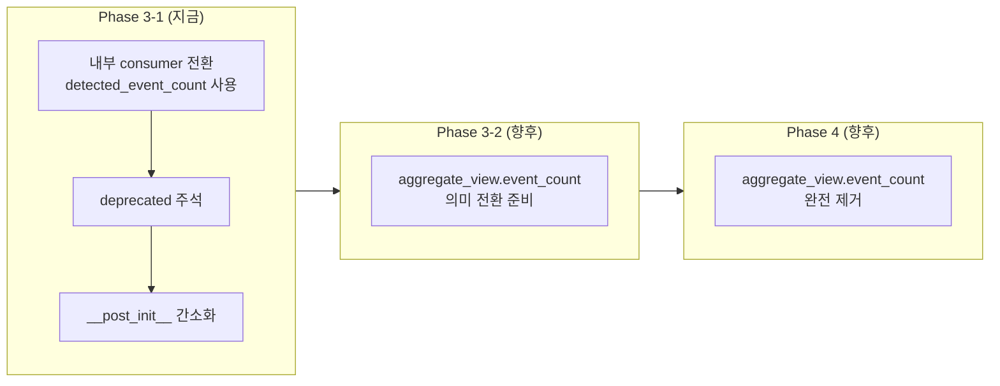
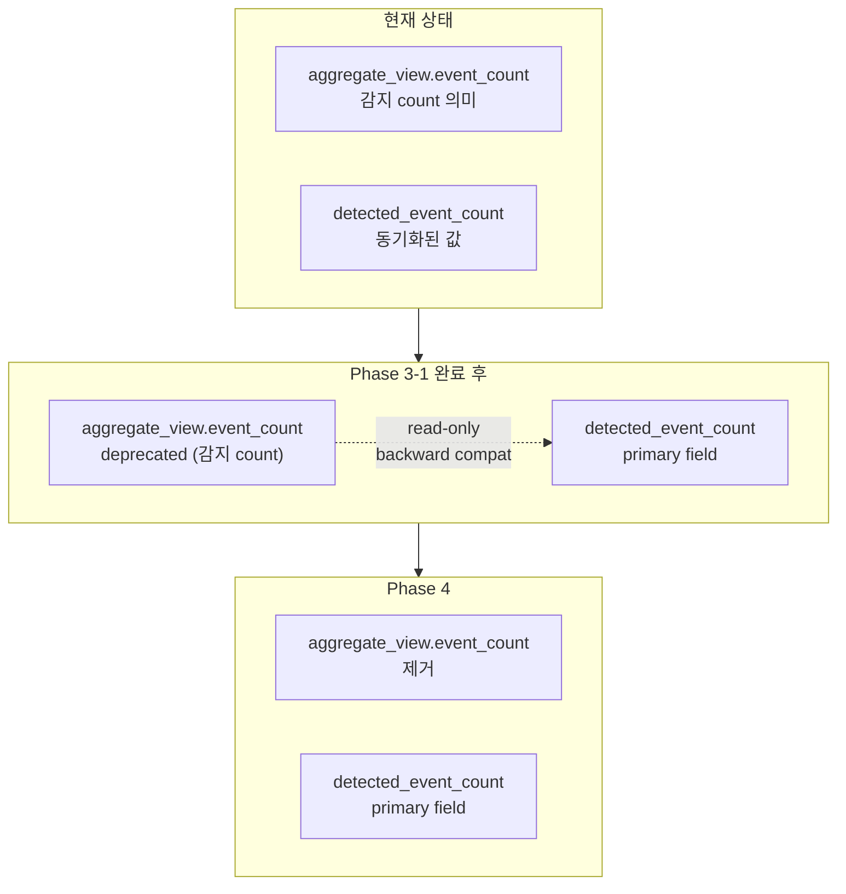

# EI Output Contract Phase 3 — `aggregate_view.event_count` Alias 전환 설계

**작성일**: 2026-05-23  
**목적**: `aggregate_view.event_count`의 의미를 `detected_event_count` alias 방향으로 정리하는 안전한 전환 전략 설계  
**범위**: Phase 3-1 — Python consumer 전환 + deprecated 선언 + 문서화 (완전 제거는 Phase 4)

---

## 1. Consumer Inventory (총 13개, 검증 완료)

아래 표는 모든 `aggregate_view.event_count` consumer를 코드 검증 기준으로 정리한 것입니다.

| # | Consumer | 파일 | 라인 | 현재 코드 | 의미 | 분류 |
|---|----------|------|------|-----------|------|------|
| A | `AggregateEventView.__post_init__` (동기화) | [`schemas.py:243`](../../src/agent_trading/services/ai_agents/schemas.py:243) | `self.event_count` — 필드 자체 | 감지 | **필드 유지** (deprecated) |
| B | `EventInterpretationOutput.__post_init__` (detected_event_count 동기화) | [`schemas.py:303`](../../src/agent_trading/services/ai_agents/schemas.py:303) | `self.aggregate_view.event_count > 0` 조건 → `detected_event_count` 초기화 | 감지 | **간소화** |
| C | `_build_summary_text()` summary 생성 | [`event_interpretation.py:86`](../../src/agent_trading/services/ai_agents/event_interpretation.py:86) | `_event_count = av.event_count` (LLM 신뢰) | 감지 | **전환** → `output.detected_event_count` |
| D | 정상 경로 detected_event_count 할당 | [`event_interpretation.py:471`](../../src/agent_trading/services/ai_agents/event_interpretation.py:471) | `detected_event_count=result.aggregate_view.event_count` | 감지 | **전환** → `result.detected_event_count` |
| E | Self-contradiction guard | [`event_interpretation.py:477`](../../src/agent_trading/services/ai_agents/event_interpretation.py:477) | `result.aggregate_view.event_count == 0` 조건 체크 | 감지 | **전환** → `result.detected_event_count == 0` |
| F | Exception fallback | [`event_interpretation.py:574`](../../src/agent_trading/services/ai_agents/event_interpretation.py:574) | `event_count=input_event_count` | 감지 | **전환** → `detected_event_count` 에만 설정 |
| G | 진단 로깅 | [`event_interpretation.py:512-540`](../../src/agent_trading/services/ai_agents/event_interpretation.py:512) | 5개 로깅에서 `aggregate_view.event_count` 참조 | 감지 | **전환** → `result.detected_event_count` |
| H | FDC prompt | [`final_decision_composer.py:312`](../../src/agent_trading/services/ai_agents/final_decision_composer.py:312) | `ei_output.aggregate_view.event_count` → 문자열 | 감지 | **전환** → `ei_output.detected_event_count` |
| I | top_reason_codes empty detection | [`decision_orchestrator.py:2443`](../../src/agent_trading/services/decision_orchestrator.py:2443) | `event_output.aggregate_view.event_count > 0` | 감지 | **전환** → `event_output.detected_event_count` |
| J | orchestrator 로깅 | [`decision_orchestrator.py:3106`](../../src/agent_trading/services/decision_orchestrator.py:3106) | `event_output.aggregate_view.event_count` | 감지 | **전환** → `event_output.detected_event_count` |
| K | recorder normalizer | [`recorder.py:108`](../../src/agent_trading/services/ai_agents/recorder.py:108) | `av.get("event_count", 0)` — dict 접근 | 감지 | **전환** → `output_dict.get("detected_event_count")` (None fallback → `av.get("event_count", 0)`) |
| L | admin_ui `formatEiOutput()` | [`utils.ts:383`](../../admin_ui/src/lib/utils.ts:383) | `av.event_count` → `interpretedEventCount`로 변환 | 해석 | **변경 불필요** (이미 전환됨) |
| M | subprocess 로깅 | [`run_agent_subprocess.py:587`](../../scripts/run_agent_subprocess.py:587) | `event_output.aggregate_view.event_count` | 감지 | **전환** → `event_output.detected_event_count` |

### 1.1 핵심 발견

모든 Python consumer(13개 중 12개)가 `aggregate_view.event_count`를 **감지 count**(= `detected_event_count`와 동일 의미)로 사용합니다. Frontend [`formatEiOutput()`](../../admin_ui/src/lib/utils.ts:383)만 유일하게 해석 count(`interpretedEventCount`)로 변환 중입니다.

### 1.2 현재 동기화 로직 (schemas.py:298-305)

```python
# __post_init__에서:
if self.detected_event_count == 0 and self.aggregate_view.event_count > 0:
    object.__setattr__(self, "detected_event_count", self.aggregate_view.event_count)
```

`detected_event_count`가 0이고 `aggregate_view.event_count > 0`인 경우에만 동기화 → `detected_event_count >= aggregate_view.event_count` 항상 보장.

---

## 2. 전환 전략 (3단계)



### Phase 3-1 (이번 작업) — 내부 consumer를 `detected_event_count`로 마이그레이션

- 모든 Python 내부 consumer에서 `aggregate_view.event_count` → `detected_event_count`로 변경
- `aggregate_view.event_count`는 deprecated 주석으로 표시
- `__post_init__` 동기화 로직 간소화: `detected_event_count`만 truth anchor로
- `aggregate_view.event_count`는 serialization/compat layer에서만 유지 (DB 호환성)

### Phase 3-2 (향후) — `aggregate_view.event_count` 의미 전환 준비

- 감지 count consumer가 더 이상 없으므로 필드 의미를 변경할 수 있음
- `interpreted_event_count`로 의미 변경 가능

### Phase 4 (향후) — 완전 제거

- 모든 consumer가 `detected_event_count` 또는 `interpreted_event_count`로 전환된 후 제거
- 하위호환성 깨짐에 유의 (DB stored structured_output_json)

---

## 3. 이번 작업 (Phase 3-1) 상세 변경 계획

### 3.1 `schemas.py` — AggregateEventView.event_count deprecated 선언

**파일**: [`src/agent_trading/services/ai_agents/schemas.py`](../../src/agent_trading/services/ai_agents/schemas.py)

#### 변경 A: `event_count` 필드 docstring에 deprecated 주석 추가 (L234)

```python
event_count: int = 0
"""DEPRECATED: Use ``EventInterpretationOutput.detected_event_count`` instead.
Number of material events actually grounded for this symbol."""
```

#### 변경 B: `__post_init__` 동기화 로직 간소화 (L298-305)

```python
# BEFORE:
if self.detected_event_count == 0 and self.aggregate_view.event_count > 0:
    object.__setattr__(self, "detected_event_count", self.aggregate_view.event_count)

# AFTER:
# aggregate_view.event_count is DEPRECATED — sync to detected_event_count for backward compat
object.__setattr__(
    self,
    "detected_event_count",
    max(self.detected_event_count, self.aggregate_view.event_count, 0),
)
```

**변경 이유**: deprecated 필드에 대한 의존성을 줄이기 위해, 항상 `max()`로 동기화하여 `detected_event_count`가 항상 우선하도록 함.

### 3.2 `event_interpretation.py` — 6개 consumer 전환

**파일**: [`src/agent_trading/services/ai_agents/event_interpretation.py`](../../src/agent_trading/services/ai_agents/event_interpretation.py)

#### 변경 C: `_build_summary_text()` — `agg.event_count` → `output.detected_event_count` (L86)

```python
# BEFORE:
_event_count = av.event_count  # LLM 응답 (신뢰)

# AFTER:
_event_count = output.detected_event_count  # LLM raw detected count
```

**참고**: `_build_summary_text()`의 Case 3, 4, 5, 6, 7에서 `_event_count`만 사용하므로 변경 1곳으로 충분.

#### 변경 D: 정상 경로 detected_event_count 할당 (L471)

```python
# BEFORE:
detected_event_count=result.aggregate_view.event_count,

# AFTER:
detected_event_count=result.detected_event_count,
```

**참고**: `result.detected_event_count`는 `__post_init__`에서 이미 동기화되었으므로 `result.aggregate_view.event_count`와 동일함.

#### 변경 E: Self-contradiction guard 조건 (L477)

```python
# BEFORE:
if input_event_count > 0 and result.aggregate_view.event_count == 0:

# AFTER:
if input_event_count > 0 and result.detected_event_count == 0:
```

**참고**: Self-contradiction guard의 `corrected_av` 생성 시 `event_count`를 설정하는 부분(L493)은 `AggregateEventView` 생성자이므로 필드 유지 필요. 이는 Phase 3-1 이후에도 `aggregate_view.event_count` 필드 자체가 제거되지 않음을 의미.

#### 변경 F: Exception fallback (L568-582)

```python
# BEFORE:
fallback_av = AggregateEventView(
    ...
    event_count=input_event_count,      # ★ input_event_count 보존
    ...
)
fallback = EventInterpretationOutput(
    ...
    aggregate_view=fallback_av,
    detected_event_count=input_event_count,
)

# AFTER:
fallback_av = AggregateEventView(
    ...
    # event_count is DEPRECATED — set for backward compat
    event_count=input_event_count,
    ...
)
fallback = EventInterpretationOutput(
    ...
    aggregate_view=fallback_av,
    detected_event_count=input_event_count,  # primary field
)
```

**변경 없음**: 이미 `detected_event_count`가 올바르게 설정되어 있음. 주석만 추가.

#### 변경 G: 진단 로깅 (L512-540)

5개 로깅 지점에서 `aggregate_view.event_count` → `detected_event_count`로 변경:

1. L513: `if result.aggregate_view.event_count == 0:` → `if result.detected_event_count == 0:`
2. L519: 로그 메시지 내 `aggregate_view.event_count=0` → `detected_event_count=0`
3. L535: `"aggregate_view.event_count=%s"` → `"detected_event_count=%s"`
4. L540: `result.aggregate_view.event_count` → `result.detected_event_count`

### 3.3 `final_decision_composer.py` — FDC prompt

**파일**: [`src/agent_trading/services/ai_agents/final_decision_composer.py`](../../src/agent_trading/services/ai_agents/final_decision_composer.py)

#### 변경 H: FDC prompt의 event_count → detected_event_count (L312)

```python
# BEFORE:
lines.append(f"Event count: {ei_output.aggregate_view.event_count}")

# AFTER:
lines.append(f"Event count: {ei_output.detected_event_count}")
```

**참고**: FDC prompt는 `event_count`를 감지 count로 사용하므로 의미 변화 없음.

### 3.4 `decision_orchestrator.py` — 2개 consumer 전환

**파일**: [`src/agent_trading/services/decision_orchestrator.py`](../../src/agent_trading/services/decision_orchestrator.py)

#### 변경 I: top_reason_codes empty detection (L2443-2447)

```python
# BEFORE:
if (event_output.aggregate_view
        and not event_output.aggregate_view.top_reason_codes
        and event_output.aggregate_view.event_count > 0):
    logger.warning(
        "EI top_reason_codes is empty but event_count=%d "
        "(symbol=%s) — LLM may have omitted the field in aggregation",
        event_output.aggregate_view.event_count, symbol,
    )

# AFTER:
if (event_output.aggregate_view
        and not event_output.aggregate_view.top_reason_codes
        and event_output.detected_event_count > 0):
    logger.warning(
        "EI top_reason_codes is empty but detected_event_count=%d "
        "(symbol=%s) — LLM may have omitted the field in aggregation",
        event_output.detected_event_count, symbol,
    )
```

#### 변경 J: orchestrator 로깅 (L3106-3111)

```python
# BEFORE:
logger.info(
    "_deserialize_agent_output: symbol=%s "
    "event_output.events=%d event_output.aggregate_view.no_material_events=%s "
    "event_output.aggregate_view.event_count=%s",
    composer_output.symbol,
    len(event_output.events),
    event_output.aggregate_view.no_material_events,
    event_output.aggregate_view.event_count,
)

# AFTER:
logger.info(
    "_deserialize_agent_output: symbol=%s "
    "event_output.events=%d event_output.aggregate_view.no_material_events=%s "
    "event_output.detected_event_count=%s",
    composer_output.symbol,
    len(event_output.events),
    event_output.aggregate_view.no_material_events,
    event_output.detected_event_count,
)
```

### 3.5 `recorder.py` — recorder normalizer

**파일**: [`src/agent_trading/services/ai_agents/recorder.py`](../../src/agent_trading/services/ai_agents/recorder.py)

**주의사항**: 신규 런타임 저장 경로의 truth를 바꾸지 말 것. `detected_event_count`가 존재하면 그것을 truth로 사용하고, 존재하지 않을 때만 `aggregate_view.event_count`로 fallback (backward compatibility only).

#### 변경 K: dict 접근 key 변경 (L108) — fallback semantics 주의

```python
# BEFORE:
ec = av.get("event_count", 0)
if not trc and ec is not None and ec > 0:
    logger.warning(
        "EI top_reason_codes is empty after normalization "
        "(event_count=%d) — LLM may have omitted the field",
        ec,
    )

# AFTER:
# detected_event_count가 최우선, 없으면 aggregate_view.event_count로 fallback (DB 하위호환)
ec = output_dict.get("detected_event_count")  # None if old serialized data
if ec is None:
    ec = av.get("event_count", 0)  # deprecated fallback
if not trc and ec is not None and ec > 0:
    logger.warning(
        "EI top_reason_codes is empty after normalization "
        "(detected_event_count=%d) — LLM may have omitted the field",
        ec,
    )
```

**Fallback semantics 분석**:

`output_dict`는 `structured_output` dict에서 생성되며, `EventInterpretationOutput`의 dict 표현입니다.

| 시나리오 | `detected_event_count` 키 존재? | 값 | fallback 동작 |
|----------|-------------------------------|-----|--------------|
| Phase 3-1 이후 새 출력 | ✅ 예 (int) | `>= 0` | `ec = detected_event_count` 직접 사용 |
| Phase 1/2 출력 (이미 `detected_event_count` 있음) | ✅ 예 (int) | `>= 0` | `ec = detected_event_count` 직접 사용 |
| Phase 0 이전 출력 (DB stored, `detected_event_count` 없음) | ❌ 없음 | `None` | `ec = av.get("event_count", 0)` fallback |

**`or` 사용 시 문제점**:
```python
# 잘못된 코드:
ec = output_dict.get("detected_event_count") or av.get("event_count", 0)
# detected_event_count=0 (legitimate zero) → or로 fallback → 잘못된 ec 값
```

`detected_event_count=0`인 경우 `0 or ...`에서 `or` 연산자가 우변으로 fallback하므로, 실제로는 0이 맞는데 `aggregate_view.event_count` 값으로 오염됨. 따라서 **`is None` 체크가 필수**입니다.

### 3.6 `run_agent_subprocess.py` — subprocess 로깅

**파일**: [`scripts/run_agent_subprocess.py`](../../scripts/run_agent_subprocess.py)

#### 변경 M: subprocess 로깅 (L587-598)

```python
# BEFORE:
_diag(
    f"EventInterpretationAgent completed: symbol={event_output.symbol} "
    f"input_events={input_event_count} "
    f"output_events={len(event_output.events)} "
    f"event_count={event_output.aggregate_view.event_count} "
    f"no_material_events={event_output.aggregate_view.no_material_events}"
)
logger.info(
    "EventInterpretationAgent completed: symbol=%s "
    "input_events=%d output_events=%d event_count=%s no_material_events=%s",
    event_output.symbol,
    input_event_count,
    len(event_output.events),
    event_output.aggregate_view.event_count,
    event_output.aggregate_view.no_material_events,
)

# AFTER:
_diag(
    f"EventInterpretationAgent completed: symbol={event_output.symbol} "
    f"input_events={input_event_count} "
    f"output_events={len(event_output.events)} "
    f"detected_event_count={event_output.detected_event_count} "
    f"no_material_events={event_output.aggregate_view.no_material_events}"
)
logger.info(
    "EventInterpretationAgent completed: symbol=%s "
    "input_events=%d output_events=%d detected_event_count=%s no_material_events=%s",
    event_output.symbol,
    input_event_count,
    len(event_output.events),
    event_output.detected_event_count,
    event_output.aggregate_view.no_material_events,
)
```

---

## 4. 변경 불필요 파일 및 이유

| 파일 | 이유 |
|------|------|
| [`admin_ui/src/lib/utils.ts`](../../admin_ui/src/lib/utils.ts) | `formatEiOutput()`는 이미 `interpretedEventCount`를 `eventCount`로 사용 중. `detectedEventCount`도 Phase 1에서 추가됨. Frontend 변경 불필요. |
| [`tests/services/test_hold_bias_mitigation.py`](../../tests/services/test_hold_bias_mitigation.py) | `AggregateEventView()` 기본값 테스트 — 필드 자체가 유지되므로 변경 불필요. `event_count`가 deprecated라는 주석 외에 테스트 변경 불필요. |
| `_build_summary_text()` 시그니처 | `output: EventInterpretationOutput`을 이미 받고 있으므로 `output.detected_event_count`로 직접 접근 가능. 시그니처 변경 불필요. |

---

## 5. 테스트 전략

### 5.1 변경이 필요한 테스트

| 테스트 파일 | 테스트 | 변경 사항 |
|------------|--------|----------|
| [`tests/services/ai_agents/test_event_interpretation.py`](../../tests/services/ai_agents/test_event_interpretation.py) | `test_finalize_aggregate_view_event_count_synced` (L292) | `__post_init__` 변경에 따라 `detected_event_count` 동기화 테스트 조건 확인. 현재 `aggregate_view.event_count=3` → `detected_event_count=3` 기대. 변경 후에도 동일하게 동작해야 함. |
| [`tests/services/test_decision_submit_pipeline.py`](../../tests/services/test_decision_submit_pipeline.py) | `test_self_contradiction_guard` (L1496) | `result.aggregate_view.event_count == 0` → `result.detected_event_count == 0`으로 변경해도 의미 동일. 테스트의 assert 대상도 `detected_event_count`로 변경 가능하나, `aggregate_view.event_count`가 여전히 존재하므로 변경 불필요. 단, self-contradiction guard 조건이 `detected_event_count`로 변경되면 테스트의 `aggregate_view.event_count` 참조도 `detected_event_count`로 변경하는 것이 일관성 유지에 좋음. |
| 동일 파일 | `test_guard_does_not_correct_when_input_events_zero` (L1582) | 위와 동일 |
| 동일 파일 | `test_guard_preserves_llm_events_when_output_has_events` (L1679) | `aggregate_view.event_count == 1` → `detected_event_count == 1` |
| 동일 파일 | `test_exception_fallback_sets_degraded_flags_with_input` (L1761) | `aggregate_view.event_count == 1` → `detected_event_count == 1` |
| 동일 파일 | `test_exception_fallback_sets_degraded_flags_no_input` (L1839) | `aggregate_view.event_count == 0` → `detected_event_count == 0` |

### 5.2 변경 불필요 테스트

- `TestEvidenceStrengthDefaults` ([`test_hold_bias_mitigation.py`](../../tests/services/test_hold_bias_mitigation.py)): `AggregateEventView()` 기본값 테스트 — 필드가 유지되므로 변경 불필요.

### 5.3 테스트 원칙

1. `aggregate_view.event_count`를 검증하는 기존 테스트는 **`detected_event_count`로 전환** (의미 동일)
2. 일부 테스트는 `aggregate_view.event_count`를 계속 검증해도 무방 (deprecated 필드는 여전히 존재)
3. 새로 작성할 테스트에서는 `detected_event_count`만 사용
4. `_finalize_ei_output()` 관련 테스트는 `detected_event_count` 우선 동작 확인

---

## 6. 변경 파일 요약

| 파일 | 변경 유형 | 설명 |
|------|----------|------|
| `src/agent_trading/services/ai_agents/schemas.py` | 수정 | `event_count` deprecated 주석 + `__post_init__` 간소화 |
| `src/agent_trading/services/ai_agents/event_interpretation.py` | 수정 | C, D, E, F, G — 6개 consumer 전환 |
| `src/agent_trading/services/ai_agents/final_decision_composer.py` | 수정 | H — FDC prompt event_count 전환 |
| `src/agent_trading/services/decision_orchestrator.py` | 수정 | I, J — orchestrator 2개 consumer 전환 |
| `src/agent_trading/services/ai_agents/recorder.py` | 수정 | K — dict key 변경 + fallback |
| `scripts/run_agent_subprocess.py` | 수정 | M — subprocess 로깅 전환 |
| `tests/services/ai_agents/test_event_interpretation.py` | 수정 | T6 테스트 검증 |
| `tests/services/test_decision_submit_pipeline.py` | 수정 | 5개 테스트 assert 전환 |
| `admin_ui/src/lib/utils.ts` | **변경 불필요** | 이미 Phase 1에서 처리됨 |

---

## 7. 향후 제거를 위한 Migration Path (Phase 4)



### 7.1 Phase 4 제거 조건

1. 모든 Python consumer가 `detected_event_count`로 완전 전환됨 (Phase 3-1 완료)
2. DB에 저장된 structured_output_json을 읽을 때 fallback 처리 완료
3. `aggregate_view.event_count`를 읽는 외부 consumer가 없음
4. Frontend `formatEiOutput()`가 `detectedEventCount`로 완전 전환됨

### 7.2 Phase 4 제거 절차

1. `AggregateEventView`에서 `event_count` 필드 제거
2. `__post_init__` 동기화 로직 제거 (`detected_event_count`가 primary이므로 불필요)
3. `_finalize_ei_output()`에서 `aggregate_view.event_count` 참조 제거 확인
4. DB 마이그레이션: 기존 structured_output_json에 `aggregate_view.event_count`가 포함되어 있으므로 읽기 호환성 검증

### 7.3 DB 호환성

DB에 저장된 `structured_output_json`은 `aggregate_view.event_count`를 포함한 전체 JSON blob입니다. `aggregate_view.event_count`를 제거해도 JSON deserialization에는 영향을 주지 않습니다:
- `AggregateEventView(**data["aggregate_view"])` → 알 수 없는 키는 무시됨
- 새로 생성되는 출력에는 `event_count`가 포함되지 않음
- 이전 출력은 계속 읽을 수 있음 (deprecated 필드가 JSON에 남아있더라도)

---

## 8. 위험 요소 및 고려 사항

### 8.1 Serialization 호환성

`aggregate_view.event_count`는 `structured_output_json`에 JSON 필드로 저장됩니다. Phase 3-1 이후에도 필드가 유지되므로 serialization 호환성에 영향 없음.

### 8.2 역직렬화 호환성

`_dict_to_dataclass()`와 `_coerce_fields()`는 JSON에서 `AggregateEventView`로 변환할 때 알 수 없는 필드를 무시함. 따라서 향후 Phase 4에서 `event_count`를 제거해도 기존 DB 데이터 읽기 가능.

### 8.3 Self-contradiction guard에서의 `corrected_av` 생성

Self-contradiction guard (event_interpretation.py:487-497)는 `AggregateEventView()` 생성자에 `event_count`를 명시적으로 전달. 이는 deprecated 필드지만 생성자에서는 여전히 필요. Phase 3-1에서는 유지.

### 8.4 Fallback `AggregateEventView` 생성

Exception fallback (event_interpretation.py:568-578)에서도 `event_count`를 명시적으로 설정. Phase 3-1에서는 유지.

---

## 9. 변경 순서 (실행 순서)

1. **`schemas.py`** — deprecated 주석 추가 + `__post_init__` 간소화
2. **`event_interpretation.py`** — C, D, E, G consumer 전환 (F는 주석만)
3. **`final_decision_composer.py`** — H consumer 전환
4. **`decision_orchestrator.py`** — I, J consumer 전환
5. **`recorder.py`** — K consumer 전환
6. **`run_agent_subprocess.py`** — M consumer 전환
7. **테스트 파일** — assert문 전환
8. **전체 테스트 실행** — `pytest tests/ -v`로 회귀 검증

---

## 10. 검증 기준

변경 후 다음 조건을 만족해야 합니다:

| # | 검증 항목 | 방법 |
|---|----------|------|
| 1 | 기존 테스트 모두 통과 | `pytest tests/ -v` |
| 2 | `aggregate_view.event_count` 참조가 `detected_event_count`로 변경됨 | `grep -r "aggregate_view\.event_count" src/` (deprecated 주석과 AggregateEventView 생성자 제외) |
| 3 | `__post_init__` 동기화가 `max()` 방식으로 변경됨 | 코드 리뷰 |
| 4 | DB serialization 호환성 유지 | `aggregate_view.event_count` 필드가 JSON에 남아있는지 확인 |
| 5 | Frontend `formatEiOutput()`에 영향 없음 | `utils.ts` 코드 리뷰 |
