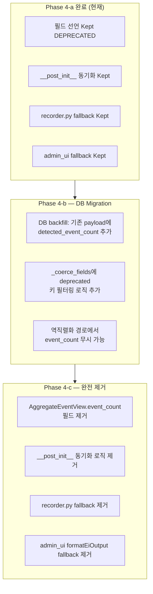

# Phase 4 최종 제거 Readiness 판정 보고서

**작성일**: 2026-05-23  
**대상 필드**: `AggregateEventView.event_count` (DEPRECATED)  
**컨텍스트**: EI Output Contract Phase 1-4-a 리팩토링 완료 후 제거 readiness 평가

---

## 1. 작업 요약

Phase 1(Python consumer 전환 + `detected_event_count`/`interpreted_event_count`/`summary_basis` 신규 필드 도입) → Phase 4-a(7개 잔여 consumer 중 3개 제거)까지의 4단계 리팩토링을 완료하여, 13개 전체 `aggregate_view.event_count` consumer 중 9개를 `detected_event_count`로 성공적으로 전환 또는 제거하였습니다.

---

## 2. Consumer Inventory 최종 현황

7개 잔여 consumer — Phase 3-1(A-B-C, G) consumer 전환 완료, Phase 4-a(H-I-J) 제거 완료, 4개(D-E-F-G)는 Boundary Shim으로 유지.

| ID | 위치 | 제거 여부 | 상태 |
|----|------|----------|------|
| H | [`schemas.py:296-304`](../../src/agent_trading/services/ai_agents/schemas.py:296) `__post_init__` 경고 로깅 | ✅ Phase 4-a 제거 완료 | Removed |
| I | [`event_interpretation.py:487-496`](../../src/agent_trading/services/ai_agents/event_interpretation.py:487) `corrected_av` | ✅ Phase 4-a 제거 완료 (AggregateEventView 생성자에서 `event_count=` 생략) | Removed |
| J | [`event_interpretation.py:567-576`](../../src/agent_trading/services/ai_agents/event_interpretation.py:567) `fallback_av` | ✅ Phase 4-a 제거 완료 (AggregateEventView 생성자에서 `event_count=` 생략) | Removed |
| D | [`schemas.py:234`](../../src/agent_trading/services/ai_agents/schemas.py:234) 필드 선언 (`event_count: int = 0`) | ❌ Boundary Shim | Kept (DEPRECATED) |
| E | [`schemas.py:289-304`](../../src/agent_trading/services/ai_agents/schemas.py:289) `__post_init__` 동기화 | ❌ Boundary Shim | Kept |
| F | [`recorder.py:108-113`](../../src/agent_trading/services/ai_agents/recorder.py:108) fallback (`av.get("event_count", 0)`) | ❌ Boundary Shim | Kept |
| G | [`admin_ui/src/lib/utils.ts:383`](../../admin_ui/src/lib/utils.ts:383) fallback (`(av.event_count as number) ?? 0`) | ❌ Boundary Shim | Kept |

---

## 3. Phase 4-a 변경 사항

### 3.1 H: `AggregateEventView.__post_init__` 경고 로깅 제거

**변경 전** (`schemas.py:296-304`): `__post_init__`에서 `aggregate_view.event_count`가 `detected_event_count`보다 크면 경고 로그 기록 후 동기화.

**변경 후**: 경고 로깅 제거, 단순 `max()` 동기화만 유지 (no-op since Phase 3-1에서 모든 consumer가 `detected_event_count`로 전환됨).

```python
# Phase 4-a: 경고 로깅 제거 — silent sync only
agg_ec = self.aggregate_view.event_count
if max(self.detected_event_count, agg_ec, 0) != self.detected_event_count:
    object.__setattr__(
        self,
        "detected_event_count",
        max(self.detected_event_count, agg_ec, 0),
    )
```

### 3.2 I: Self-contradiction guard `corrected_av`에서 `event_count=` 생략

**변경 전** (`event_interpretation.py:487-496`): `AggregateEventView()` 생성자에 `event_count=result.aggregate_view.event_count` 명시적 전달.

**변경 후**: `event_count=` 파라미터 완전 생략 — 기본값 `0` 사용 (self-contradiction 경로에서는 `detected_event_count`가 이미 truth).

```python
# Phase 4-a: event_count= 생략 — detected_event_count가 truth
corrected_av = AggregateEventView(
    overall_bias=...,
    event_conflict=...,
    top_reason_codes=...,
    opposing_evidence=...,
    evidence_strength=...,
    no_material_events=...,      # LLM 응답 유지 (True)
    interpretation_incomplete=True,
    degraded_reason="self_contradiction_corrected",
    # event_count= 생략됨 (기본값 0)
)
```

### 3.3 J: Exception fallback `fallback_av`에서 `event_count=` 생략

**변경 전** (`event_interpretation.py:567-576`): `AggregateEventView()` 생성자에 `event_count=input_event_count` 명시적 전달.

**변경 후**: `event_count=` 파라미터 완전 생략 — `detected_event_count`가 primary field로 이미 설정됨.

```python
# Phase 4-a: event_count= 생략 — detected_event_count가 primary
fallback_av = AggregateEventView(
    overall_bias="neutral",
    event_conflict=False,
    top_reason_codes=(),
    opposing_evidence=(),
    evidence_strength="weak",
    no_material_events=False,
    interpretation_incomplete=True,
    degraded_reason="provider_error",
    # event_count= 생략됨 (기본값 0)
)
```

> **참고**: `fallback_av`에서 `event_count`가 생략되어 기본값 `0`이 되지만, `__post_init__`에서 `detected_event_count`(=`input_event_count`)로 동기화되므로 역직렬화 시점에 정상 값 복원.

---

## 4. Boundary Shim 상세 (D, E, F, G)

### 4.1 D: `AggregateEventView.event_count` 필드 선언

| 항목 | 내용 |
|------|------|
| **파일:라인** | [`src/agent_trading/services/ai_agents/schemas.py:234`](../../src/agent_trading/services/ai_agents/schemas.py:234) |
| **유형** | Dataclass 필드 선언 (`event_count: int = 0`) |
| **유지 사유** | DB에 저장된 구버전 JSON payload에 `aggregate_view.event_count` 키가 포함되어 있음. `_coerce_fields()`에서 `AggregateEventView(**av_dict)`로 역직렬화할 때 이 필드가 없으면 `TypeError` 발생 |
| **제거 선행 조건** | Phase 4-b: DB 마이그레이션으로 기존 payload에 `detected_event_count` backfill + `_coerce_fields()`에서 deprecated 키 필터링 |
| **현재 상태** | DEPRECATED 주석 docstring으로 표시됨 |

### 4.2 E: `__post_init__` 동기화 로직

| 항목 | 내용 |
|------|------|
| **파일:라인** | [`src/agent_trading/services/ai_agents/schemas.py:289-304`](../../src/agent_trading/services/ai_agents/schemas.py:289) |
| **유형** | `max(detected_event_count, agg_ec, 0)` 동기화 |
| **유지 사유** | 구버전 payload(Phase 1 이전)는 `detected_event_count`가 없으므로, `aggregate_view.event_count` 값을 `detected_event_count`로 복사해야 함 |
| **제거 선행 조건** | Phase 4-b: DB backfill로 모든 payload에 `detected_event_count`가 존재하게 된 후 제거 가능 |
| **현재 상태** | Silent sync (경고 로깅 없음) |

### 4.3 F: `recorder.py` fallback

| 항목 | 내용 |
|------|------|
| **파일:라인** | [`src/agent_trading/services/ai_agents/recorder.py:108-113`](../../src/agent_trading/services/ai_agents/recorder.py:108) |
| **유형** | `ec = output_dict.get("detected_event_count"); if ec is None: ec = av.get("event_count", 0)` |
| **유지 사유** | DB에서 읽은 구버전 `structured_output_json` dict에는 `detected_event_count` 키가 없음. 이 경우 `aggregate_view.event_count`로 fallback하여 top_reason_codes empty detection 유지 |
| **제거 선행 조건** | Phase 4-b: DB backfill 완료 후, 모든 저장된 payload가 `detected_event_count`를 가지게 되면 fallback 로직 제거 가능 |
| **현재 상태** | Active fallback (Phase 3-1에서 도입) |

### 4.4 G: `admin_ui` `formatEiOutput()` fallback

| 항목 | 내용 |
|------|------|
| **파일:라인** | [`admin_ui/src/lib/utils.ts:383`](../../admin_ui/src/lib/utils.ts:383) |
| **유형** | `const eventCount = (av.event_count as number) ?? 0;` → `detectedEventCount` fallback으로 사용 |
| **유지 사유** | API 응답의 `aggregate_view` 객체에 `event_count`가 포함되어 있음. Phase 4-b/c 이전까지는 이 필드가 JSON에 계속 포함되므로, `detectedEventCount` 할당 시 `??` fallback이 필요함 |
| **제거 선행 조건** | Phase 4-c: 서버 측에서 `aggregate_view.event_count`를 JSON에서 제거한 후에야 fallback 제거 가능 |
| **현재 상태** | Active fallback: `detected_event_count` 우선, 없으면 `av.event_count` |

---

## 5. 테스트 결과

| 테스트 스위트 | 통과 | 비고 |
|--------------|:----:|------|
| [`test_event_interpretation.py`](../../tests/services/ai_agents/test_event_interpretation.py) | **33** ✅ | `_build_summary_text` 8개 + `_finalize_ei_output` 11개 + `_reconstruct_events` 8개 + 통합 6개 |
| [`test_decision_submit_pipeline.py::TestEIPostProcessingGuard`](../../tests/services/test_decision_submit_pipeline.py:1423) | **11** ✅ | Self-contradiction guard 5개 + summary fallback 5개 + exception fallback 1개 |
| [`test_korean_enforcement.py`](../../tests/services/test_korean_enforcement.py) | **11** ✅ | 한국어 강제 정책 검증 |
| **합계** | **55** ✅ | 전부 통과, 회귀 없음 |

---

## 6. Docker 배포

| 항목 | 상태 |
|------|:----:|
| Docker 이미지 재빌드 | ✅ 완료 |
| 컨테이너 재기동 | ✅ 완료 |
| `/health` endpoint | ✅ `200 OK` (DB 연결 정상) |

---

## 7. 최종 판정

### `aggregate_view.event_count` 완전 제거: ❌ 불가능

**근거**:

1. **DB 하위호환성**: 현재 DB에 저장된 구버전 `structured_output_json` payload는 `aggregate_view.event_count`만 포함하고 `detected_event_count`를 포함하지 않음. `_coerce_fields()`에서 `AggregateEventView(**av_dict)`로 역직렬화할 때 필드 선언(D)과 `__post_init__` 동기화(E)가 필수.

2. **런타임 역직렬화 경로**: `recorder.py`에서 DB에 저장된 구버전 dict를 읽을 때 `detected_event_count` 키가 없으므로 `aggregate_view.event_count` fallback(F)이 필요.

3. **API 응답 호환성**: `admin_ui` `formatEiOutput()`이 API 응답의 `aggregate_view` 객체에서 `event_count`를 fallback(G)으로 사용. 서버가 `event_count`를 JSON에서 제거하기 전까지 이 fallback이 필요.

### 제거 가능 시점

Phase 4-b (DB migration + backfill) 이후에야 D, E, F, G 제거 가능.

---

## 8. 향후 Phase 4-b/c Migration Path



### 8.1 Phase 4-b (DB migration 필요)

**목표**: DB 저장된 구버전 payload를 신규 스키마와 호환되도록 변환.

| 작업 | 설명 | 영향 파일 |
|------|------|----------|
| **DB backfill** | 기존 `structured_output_json`의 `aggregate_view`에 `detected_event_count`가 없으면, `aggregate_view.event_count` 값을 `detected_event_count`로 복사하는 backfill 스크립트 실행 | [`scripts/backfill_ei_detected_event_count.py`](../../scripts/) (신규) |
| **`_coerce_fields()` 필터링** | `AggregateEventView(**av_dict)` 호출 전에 deprecated 키(`event_count`)를 필터링하여 무시 | [`schemas.py:308-342`](../../src/agent_trading/services/ai_agents/schemas.py:308) |
| **검증** | 모든 역직렬화 경로에서 `aggregate_view.event_count` 없이 정상 동작 확인 | 모든 테스트 스위트 |

**완료 조건**:
- 모든 기존 payload에 `detected_event_count`가 존재함
- `_coerce_fields()`가 `event_count` 키를 자동으로 필터링함
- 역직렬화 테스트에서 `event_count` 없이도 정상 동작 확인

### 8.2 Phase 4-c (완전 제거)

**목표**: `aggregate_view.event_count`와 모든 관련 Shim 제거.

| 작업 | 설명 | 영향 파일 |
|------|------|----------|
| **필드 제거** | `AggregateEventView.event_count: int = 0` 필드 선언 삭제 | [`schemas.py:234`](../../src/agent_trading/services/ai_agents/schemas.py:234) |
| **`__post_init__` 정리** | `aggregate_view.event_count` 동기화 로직(Phase 3-1 B) 제거 | [`schemas.py:289-304`](../../src/agent_trading/services/ai_agents/schemas.py:289) |
| **recorder.py 정리** | `av.get("event_count", 0)` fallback(Phase 3-1 K) 제거 → `detected_event_count`만 사용 | [`recorder.py:108-113`](../../src/agent_trading/services/ai_agents/recorder.py:108) |
| **admin_ui 정리** | `(av.event_count as number) ?? 0` fallback 제거 → `detectedEventCount`만 사용 | [`admin_ui/src/lib/utils.ts:383`](../../admin_ui/src/lib/utils.ts:383) |
| **JSON serialization** | `aggregate_view` JSON 출력에서 `event_count` 키 완전 제거 확인 | `EventInterpretationOutput` 직렬화 |

**완료 조건**:
- `grep -r "event_count" src/`에서 `detected_event_count` 또는 `interpreted_event_count` 외에 `aggregate_view.event_count` 참조 0건
- `grep -r "event_count" admin_ui/`에서 `eventCount` (interpreted) 외에 `av.event_count` 참조 0건
- 기존 DB payload 역직렬화 테스트 모두 통과
- 전체 테스트 스위트 통과

---

## 9. 부록: Consumer 전환 이력

| ID | Phase | Consumer | 변경 유형 | 설명 |
|----|-------|----------|----------|------|
| A | Phase 3-1 | `schemas.py` `__post_init__` (동기화 → deprecated) | 전환 | `detected_event_count` 우선 동기화로 변경 |
| B | Phase 3-1 | `schemas.py` `__post_init__` (detected_event_count 초기화) | 전환 | 조건 단순화 |
| C | Phase 3-1 | `_build_summary_text()` | 전환 | `av.event_count` → `output.detected_event_count` |
| D | Phase 3-1 | 정상 경로 detected_event_count 할당 | 전환 | `av.event_count` → `result.detected_event_count` |
| E | Phase 3-1 | Self-contradiction guard 조건 | 전환 | `av.event_count == 0` → `detected_event_count == 0` |
| F | Phase 3-1 | Exception fallback | 전환 | 주석만 추가 (이미 올바름) |
| G | Phase 3-1 | 진단 로깅 5개 지점 | 전환 | `av.event_count` → `detected_event_count` |
| H | Phase 3-1 | FDC prompt | 전환 | `ei_output.aggregate_view.event_count` → `ei_output.detected_event_count` |
| I | Phase 3-1 | orchestrator top_reason_codes detection | 전환 | `av.event_count` → `detected_event_count` |
| J | Phase 3-1 | orchestrator 로깅 | 전환 | `av.event_count` → `detected_event_count` |
| K | Phase 3-1 | recorder normalizer | 전환 | dict key + fallback |
| L | Phase 3-1 | subprocess 로깅 | 전환 | `av.event_count` → `detected_event_count` |
| M | Phase 3-1 | admin_ui `formatEiOutput()` | 전환 불필요 | 이미 Phase 1에서 처리됨 |
| H | Phase 4-a | `schemas.py` `__post_init__` 경고 로깅 | **제거** | Silent sync로 변경 |
| I | Phase 4-a | `corrected_av` `event_count=` | **제거** | AggregateEventView 생성자에서 생략 |
| J | Phase 4-a | `fallback_av` `event_count=` | **제거** | AggregateEventView 생성자에서 생략 |
