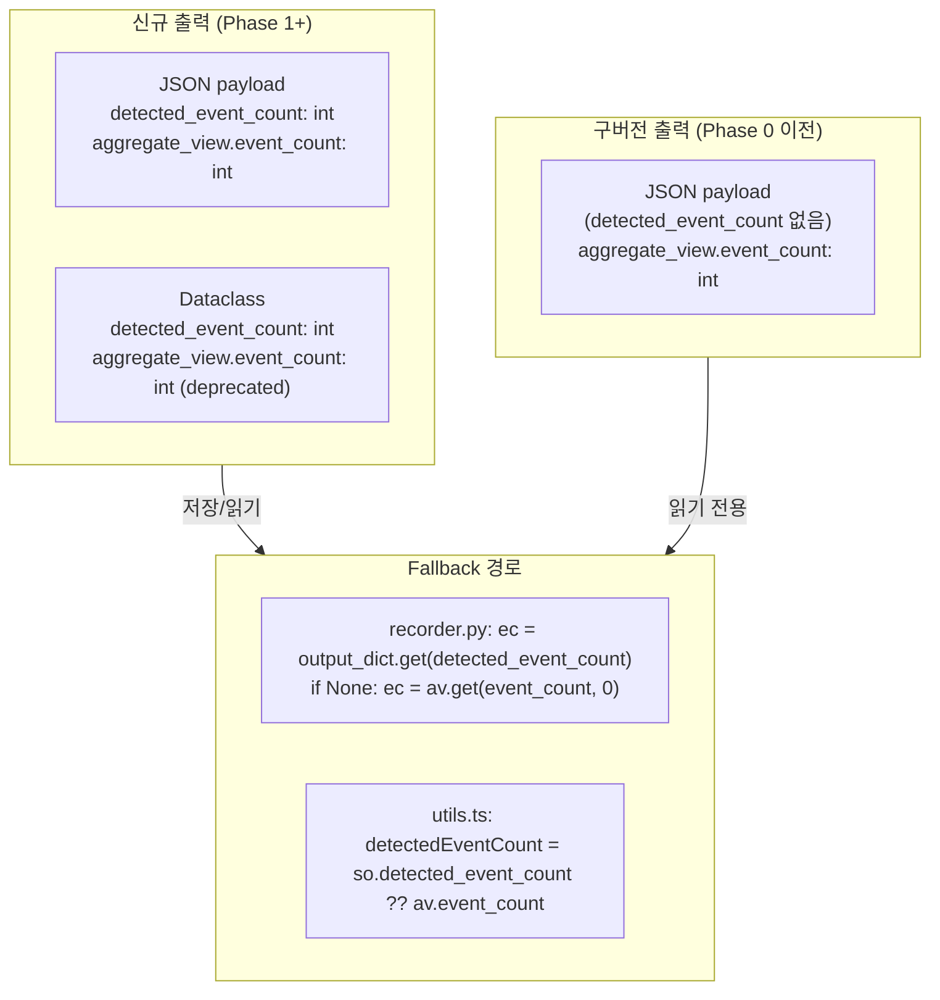

# EI Output Contract Phase 4 — `aggregate_view.event_count` 제거 전략 설계

**작성일**: 2026-05-23  
**목적**: Phase 3-1 완료 후 잔여 `aggregate_view.event_count` consumer 7개를 평가하고, 제거 가능한 consumer를 정리하며, Boundary Shim의 향후 완전 제거 Migration Path 설계  
**범위**: 설계 문서만 생성 (코드 변경 제외)

---

## 1. Consumer Inventory 최종 정리

Phase 3-1(`detected_event_count` alias migration) 완료 후, 잔여 consumer는 총 **7개**입니다.  
Python 내부 consumer는 모두 `detected_event_count`로 전환되었으며, 아래는 `aggregate_view.event_count`에 **직접 접근**하는 최종 잔여 consumer입니다.

### 1.1 Consumer 테이블

| ID | Consumer | 위치 (파일:라인) | 현재 동작 | 분류 | 제거/유지 사유 |
|----|----------|-----------------|-----------|------|---------------|
| D | `AggregateEventView.event_count` **필드 선언** | [`schemas.py:234-236`](../../src/agent_trading/services/ai_agents/schemas.py:234) | `event_count: int = 0` — dataclass field | **Boundary Shim** | DB 역직렬화 호환성: `AggregateEventView(**av_dict)`에서 `event_count` 키가 있으면 TypeError 발생. 필드 제거 시 `_coerce_fields()` 수정 필요. |
| E | `EventInterpretationOutput.__post_init__` **동기화** | [`schemas.py:306-314`](../../src/agent_trading/services/ai_agents/schemas.py:306) | `agg_ec = self.aggregate_view.event_count; max(detected_event_count, agg_ec, 0)` | **Boundary Shim** | D가 유지되는 한 E도 유지해야 함. 필드가 없으면 `self.aggregate_view.event_count`가 AttributeError. |
| F | `recorder.py` **fallback** (구버전 payload) | [`recorder.py:111-113`](../../src/agent_trading/services/ai_agents/recorder.py:111) | `ec = output_dict.get("detected_event_count"); if ec is None: ec = av.get("event_count", 0)` | **Boundary Shim** | **DB 하위호환 필수**: DB에 저장된 Phase 0 이전 JSON payload는 `detected_event_count` 필드가 없음. 이 payload를 읽을 때만 `av.event_count`로 fallback. |
| G | `formatEiOutput()` **fallback** (구버전 payload) | [`utils.ts:383,388`](../../admin_ui/src/lib/utils.ts:383) | `const eventCount = av.event_count ?? 0; const detectedEventCount = so.detected_event_count ?? eventCount` | **Boundary Shim** | **Frontend 하위호환 필수**: DB에 저장된 구버전 JSON을 admin_ui가 읽을 때 `detected_event_count`가 없으면 `av.event_count`로 fallback. |
| H | `AggregateEventView.__post_init__` **경고 로깅** | [`schemas.py:246-251`](../../src/agent_trading/services/ai_agents/schemas.py:246) | `if not self.top_reason_codes and self.event_count > 0: logger.warning(...)` | **제거 가능** | `event_count` 필드 제거 시 이 post_init은 동작 불가. 경고 자체는 recorder.py:114-119에 중복 존재. |
| I | Self-contradiction guard `corrected_av` **생성** | [`event_interpretation.py:487-497`](../../src/agent_trading/services/ai_agents/event_interpretation.py:493) | `event_count=result.aggregate_view.event_count` — `AggregateEventView()` 생성자에 전달 | **제거 가능** | `event_count` 필드가 제거되면 생성자에서 생략 가능. LLM 응답은 `detected_event_count`로 이미 보존됨. |
| J | Exception fallback `fallback_av` **생성** | [`event_interpretation.py:568-578`](../../src/agent_trading/services/ai_agents/event_interpretation.py:574) | `event_count=input_event_count` — `AggregateEventView()` 생성자에 전달 | **제거 가능** | `event_count` 필드가 제거되면 생성자에서 생략 가능. `input_event_count` 정보는 `detected_event_count`로 보존됨. |

### 1.2 요약

| 분류 | 개수 | Consumer ID |
|------|------|-------------|
| **제거 가능** (이번 Phase 4에서 정리) | 3 | H, I, J |
| **Boundary Shim** (DB/Frontend 하위호환) | 4 | D, E, F, G |

---

## 2. 제거 가능 경로 구체적 변경 계획 (H, I, J)

### 2.1 H — `AggregateEventView.__post_init__` 경고 로깅 제거

#### 현재 코드 ([`schemas.py:244-251`](../../src/agent_trading/services/ai_agents/schemas.py:244))

```python
def __post_init__(self) -> None:
    _logger = logging.getLogger(self.__class__.__module__)
    if not self.top_reason_codes and self.event_count > 0:
        _logger.warning(
            "AggregateEventView.top_reason_codes is empty but "
            "event_count=%d — LLM may have omitted the field",
            self.event_count,
        )
```

#### 변경 후

```python
def __post_init__(self) -> None:
    pass  # __post_init__ removed — warning migrated to recorder.py
```

또는 `__post_init__` 메서드 자체를 삭제:

```python
# __post_init__ 제거 (AggregateEventView는 frozen+slots dataclass)
# 기존 경고는 recorder.py:114-119에서 중복 처리 중
```

#### 영향받는 테스트

| 테스트 | 위치 | 영향 |
|--------|------|------|
| `AggregateEventView` 생성 테스트 | 다양한 테스트 파일 | `event_count=3`으로 생성해도 `__post_init__` 경고가 사라짐. 테스트 assert에 로그 검증이 있다면 수정 필요. |
| `test_event_interpretation.py` — `test_finalize_aggregate_view_event_count_synced` | [`test_event_interpretation.py:L292`](../../tests/services/ai_agents/test_event_interpretation.py:292) | `__post_init__` 제거로 인한 간접 영향 없음 (해당 테스트는 `EventInterpretationOutput.__post_init__` 검증) |

**로그 검증 테스트 확인 필요**: `AggregateEventView.__post_init__`의 경고를 `caplog`로 검증하는 테스트가 있다면 해당 assert 제거.

#### 제거 근거

- recorder.py [`recorder.py:114-119`](../../src/agent_trading/services/ai_agents/recorder.py:114)에서 동일한 `top_reason_codes` empty 경고를 이미 처리 중
- `AggregateEventView`는 LLM 프롬프트에 JSON Schema로 노출되므로, `__post_init__`에서 경고를 발생시키는 것보다 recorder의 post-normalization 단계에서 검증하는 것이 더 적절
- `event_count` 필드 제거 시 `self.event_count` 참조가 불가능해지므로 자연스럽게 제거 대상

---

### 2.2 I — Self-contradiction guard `corrected_av` `event_count` 생략

#### 현재 코드 ([`event_interpretation.py:487-497`](../../src/agent_trading/services/ai_agents/event_interpretation.py:487))

```python
corrected_av = AggregateEventView(
    overall_bias=result.aggregate_view.overall_bias,
    event_conflict=result.aggregate_view.event_conflict,
    top_reason_codes=result.aggregate_view.top_reason_codes,
    opposing_evidence=result.aggregate_view.opposing_evidence,
    evidence_strength=result.aggregate_view.evidence_strength,
    event_count=result.aggregate_view.event_count,  # ★ 제거 대상 (LLM 응답 유지, 0)
    no_material_events=result.aggregate_view.no_material_events,
    interpretation_incomplete=True,
    degraded_reason="self_contradiction_corrected",
)
```

#### 변경 후

```python
corrected_av = AggregateEventView(
    overall_bias=result.aggregate_view.overall_bias,
    event_conflict=result.aggregate_view.event_conflict,
    top_reason_codes=result.aggregate_view.top_reason_codes,
    opposing_evidence=result.aggregate_view.opposing_evidence,
    evidence_strength=result.aggregate_view.evidence_strength,
    # event_count removed — field deprecated in Phase 3-1, removed in Phase 4
    no_material_events=result.aggregate_view.no_material_events,
    interpretation_incomplete=True,
    degraded_reason="self_contradiction_corrected",
)
```

#### 영향 분석

- `event_count=0` (LLM이 0으로 응답) → 생략 시 `AggregateEventView()` 기본값인 `event_count=0`과 동일
- `result.detected_event_count`는 이미 `result.aggregate_view.event_count`보다 우선하며 상위에서 유지됨 ([`event_interpretation.py:506`](../../src/agent_trading/services/ai_agents/event_interpretation.py:506))
- `corrected_av`의 `event_count`는 사실상 **어떤 downstream에서도 읽히지 않음**
- `EventInterpretationOutput.__post_init__`에서 `max()` 동기화 시 사용되지만, `detected_event_count=0`이므로 영향 없음

#### 영향받는 테스트

| 테스트 | 위치 | 영향 |
|--------|------|------|
| `test_self_contradiction_guard` | [`test_decision_submit_pipeline.py:L1496`](../../tests/services/test_decision_submit_pipeline.py:1496) | `corrected_av`의 `event_count` assert가 있다면 제거/변경. `detected_event_count` assert는 유지. |
| 위 테스트 내 `aggregate_view.event_count == 0` 검증 | 동일 | 변경 불필요 (`detected_event_count`가 0이므로 `max()` 동기화와 무관) |

---

### 2.3 J — Exception fallback `fallback_av` `event_count` 생략

#### 현재 코드 ([`event_interpretation.py:568-578`](../../src/agent_trading/services/ai_agents/event_interpretation.py:568))

```python
fallback_av = AggregateEventView(
    overall_bias="neutral",
    event_conflict=False,
    top_reason_codes=(),
    opposing_evidence=(),
    evidence_strength="weak",
    event_count=input_event_count,      # ★ 제거 대상
    no_material_events=False,
    interpretation_incomplete=True,
    degraded_reason=degraded_reason,
)
fallback = EventInterpretationOutput(
    symbol=request_symbol,
    aggregate_view=fallback_av,
    detected_event_count=input_event_count,  # ★ primary field는 이미 올바름
)
```

#### 변경 후

```python
fallback_av = AggregateEventView(
    overall_bias="neutral",
    event_conflict=False,
    top_reason_codes=(),
    opposing_evidence=(),
    evidence_strength="weak",
    # event_count removed — field deprecated in Phase 3-1, removed in Phase 4.
    # input_event_count is preserved in detected_event_count (primary field).
    no_material_events=False,
    interpretation_incomplete=True,
    degraded_reason=degraded_reason,
)
fallback = EventInterpretationOutput(
    symbol=request_symbol,
    aggregate_view=fallback_av,
    detected_event_count=input_event_count,  # unchanged — primary field
)
```

#### 영향 분석

- `event_count=input_event_count` → 생략 시 `AggregateEventView()` 기본값 `0` 사용
- `fallback.detected_event_count=input_event_count`는 그대로 유지되므로, `EventInterpretationOutput.__post_init__`에서 `max(input_event_count, 0, 0) = input_event_count`로 동기화
- 따라서 `aggregate_view.event_count`가 0이어도 `detected_event_count`가 올바르게 보존됨
- **정보 손실 없음**: `input_event_count`는 `detected_event_count`에 이미 보존됨

#### 영향받는 테스트

| 테스트 | 위치 | 영향 |
|--------|------|------|
| `test_exception_fallback_sets_degraded_flags_with_input` | [`test_decision_submit_pipeline.py:L1761`](../../tests/services/test_decision_submit_pipeline.py:1761) | `aggregate_view.event_count == 1` 검증 → 제거. `detected_event_count == 1` 검증으로 대체. |
| `test_exception_fallback_sets_degraded_flags_no_input` | [`test_decision_submit_pipeline.py:L1839`](../../tests/services/test_decision_submit_pipeline.py:1839) | `aggregate_view.event_count == 0` 검증 → 제거. `detected_event_count == 0` 검증으로 대체. |

---

## 3. Boundary Shim 유지 전략 (D, E, F, G)

### 3.1 D — `AggregateEventView.event_count` 필드 선언

#### 유지가 필요한 이유

`AggregateEventView`는 DB에 JSON blob으로 저장된 `structured_output_json`에서 역직렬화됩니다.  
`_coerce_fields()` (schemas.py:352-357)는 아래 로직으로 dict → dataclass 변환을 수행합니다:

```python
elif isinstance(av, dict) and not isinstance(av, AggregateEventView):
    try:
        object.__setattr__(self, "aggregate_view", AggregateEventView(**av))
    except (TypeError, ValueError):
        object.__setattr__(self, "aggregate_view", AggregateEventView())
```

- 구버전 DB payload가 `aggregate_view.event_count`를 포함하고 있으므로, **필드를 제거하면** `AggregateEventView(**av)`에서 `event_count`가 unexpected keyword argument로 전달되어 `TypeError` 발생
- `except TypeError`에 의해 `AggregateEventView()` (기본값)로 fallback → `overall_bias`, `evidence_strength` 등 **모든 필드가 기본값으로 리셋**되어 데이터 손실 발생
- 즉, 필드만 제거하면 안 되고, `_coerce_fields()`의 `AggregateEventView(**av)` 호출 전에 `event_count` 키를 **명시적으로 필터링**해야 함

#### 현재 상태

```python
# schemas.py:234-236
event_count: int = 0
"""DEPRECATED: Use ``EventInterpretationOutput.detected_event_count`` instead.
Number of material events actually grounded for this symbol."""
```

DEPRECATED docstring 유지 중.

#### 향후 완전 제거를 위한 선행 조건

1. **DB Migration**: 기존 모든 `structured_output_json`에서 `aggregate_view.event_count` 키를 제거하는 backfill 마이그레이션
2. **`_coerce_fields()` 수정**: `AggregateEventView(**av)` 호출 전 `event_count` 키 필터링 추가 (또는 `**{k: v for k, v in av.items() if k in AggregateEventView.__dataclass_fields__}`)
3. **또는** `AggregateEventView`에 `**kwargs: Any` catch-all 추가 (frozen+slots 제약 확인 필요)

#### DEPRECATED 마킹 상태

✅ `DEPRECATED` docstring 있음 ([`schemas.py:235-236`](../../src/agent_trading/services/ai_agents/schemas.py:235))  
🔲 `FutureWarning` 또는 `DeprecationWarning` 코드 추가 가능 (선택사항)

---

### 3.2 E — `EventInterpretationOutput.__post_init__` 동기화 로직

#### 유지가 필요한 이유

```python
# schemas.py:306-314
agg_ec = self.aggregate_view.event_count
if max(self.detected_event_count, agg_ec, 0) != self.detected_event_count:
    object.__setattr__(
        self,
        "detected_event_count",
        max(self.detected_event_count, agg_ec, 0),
    )
```

- D(필드)가 유지되는 한 E도 유지 필요
- 구버전 DB payload에서 `detected_event_count`가 0이고 `aggregate_view.event_count > 0`인 경우, 이 동기화 로직이 `detected_event_count`를 교정
- Phase 1 이후의 모든 신규 출력은 `detected_event_count`가 항상 올바르게 설정되므로, 이 로직은 **구버전 payload 읽기 시에만** 동작

#### 향후 완전 제거를 위한 선행 조건

1. D(필드) 제거가 선행되어야 함
2. `detected_event_count`가 모든 DB payload에 존재함을 보장하는 DB migration

#### DEPRECATED 마킹 상태

🔲 현재 DEPRECATED 주석만 있음 (코드 자체는 동작 중). Phase 4에서 `# TODO: Remove after DB migration` 주석 추가 권장.

---

### 3.3 F — `recorder.py` fallback (`is None` 체크)

#### 현재 코드 ([`recorder.py:108-113`](../../src/agent_trading/services/ai_agents/recorder.py:108))

```python
# Phase 3-1: detected_event_count is primary.
# aggregate_view.event_count fallback is backward compatibility
# only — for old serialized payloads that predate Phase 1.
ec = output_dict.get("detected_event_count")
if ec is None:
    ec = av.get("event_count", 0)  # backward compat: deprecated field
```

#### 유지가 필요한 이유

- `output_dict`는 DB `structured_output_json`에서 읽은 raw Python dict
- Phase 0 이전에 저장된 payload는 `detected_event_count` 키가 **존재하지 않음** (`get()` → `None`)
- `is None` 체크는 Phase 3-1에서 신중히 설계된 fallback (0 vs None 구분: `0 or fallback`이 아니라 `is None` 체크)
- **이 fallback이 없으면**, 구버전 payload를 읽을 때 `ec = None`이 되고, `if not trc and ec is not None and ec > 0:` 조건에서 `None > 0`은 TypeError... 아니, Python에서 `None > 0`은 `TypeError`가 아니라 `False`를 반환하지 않고 `TypeError`를 발생시킵니다. 확인해보면 `None > 0` → `TypeError: '>' not supported between instances of 'NoneType' and 'int'`.

**중요 발견**: Python 3에서 `None > 0`은 `TypeError`를 발생시킵니다. 하지만 recorder.py:114의 조건은 `ec is not None and ec > 0`이므로, `ec`가 `None`이면 단락 평가로 `ec > 0`은 평가되지 않아 안전합니다. 하지만 `ec = None`인 경우 `ec is not None`이 `False`이므로 경고를 정확히 건너뜁니다.

#### 향후 완전 제거를 위한 선행 조건

1. DB에 저장된 모든 구버전 payload가 `detected_event_count` 필드를 포함하도록 DB migration 수행
2. 또는 구버전 payload가 더 이상 시스템에 존재하지 않을 때까지 충분한 시간 경과

#### DEPRECATED 마킹 상태

🔲 주석으로만 표시 (코드 자체는 `is None` fallback으로 정상 동작)

---

### 3.4 G — `admin_ui/src/lib/utils.ts` `formatEiOutput()` fallback

#### 현재 코드 ([`utils.ts:383,388`](../../admin_ui/src/lib/utils.ts:383))

```typescript
const eventCount = (av.event_count as number) ?? 0;
// ...
const detectedEventCount = (so.detected_event_count as number) ?? eventCount;
```

#### 유지가 필요한 이유

- F와 동일한 사유: Frontend에서 DB 구버전 payload를 읽을 때 `detected_event_count`가 없으면 `av.event_count`로 fallback
- `??` (nullish coalescing) 연산자를 사용하므로 `detected_event_count=0`인 경우 fallback하지 않음 (정확한 `null`/`undefined` 구분)
- Frontend는 DB에 직접 접근하는 것이 아니라 API를 통해 JSON payload를 받으므로, API 응답에서 `detected_event_count`가 없을 때 fallback

#### 향후 완전 제거를 위한 선행 조건

1. API가 항상 `detected_event_count`를 반환함을 보장 (현재는 `structured_output_json`에 포함되어 있으므로 항상 존재)
2. **구버전 DB payload가 더 이상 API 응답에 포함되지 않음**을 보장 (DB migration 또는 API 변환 레이어 추가)
3. ⚠️ 주의: `eventCount` 변수는 [`utils.ts:423`](../../admin_ui/src/lib/utils.ts:423)에서 최종 `eventCount: interpretedEventCount`로 매핑되며, 이는 `event_count`와 다른 의미(interpreted count)입니다. 즉, `av.event_count`는 `detectedEventCount` fallback용으로만 사용됨.

#### DEPRECATED 마킹 상태

🔲 TypeScript로는 별도 deprecated 표시가 없음. 주석 없이 fallback 동작만 있음.

---

## 4. 향후 완전 제거 Migration Path

### 4.1 현재 상태 (Post-Phase 3-1)



### 4.2 구버전 DB Payload 처리 전략

DB `agent_runs.structured_output_json` 컬럼에 저장된 구버전 payload는 두 가지 유형:

| 유형 | `detected_event_count` | `aggregate_view.event_count` | 비율 (추정) |
|------|----------------------|----------------------------|------------|
| Phase 0 (초기) | ❌ 없음 | ✅ 있음 | 낮음 (초기 개발 단계) |
| Phase 1-3 | ✅ 있음 | ✅ 있음 (deprecated) | 높음 (대부분) |
| Phase 4+ (향후) | ✅ 있음 | ❌ 없음 | 신규 출력만 |

#### 처리 전략 A: **즉시 DB backfill migration** (권장)

- 모든 기존 `structured_output_json`에서 `detected_event_count`가 없는 row를 찾아 `detected_event_count = aggregate_view.event_count`로 설정
- 이후 `aggregate_view.event_count` 키는 JSON에서 제거하지 않고 유지 (읽기 호환성)
- SQL 예시:
  ```sql
  -- detected_event_count가 없는 구버전 payload에 detected_event_count 추가
  UPDATE agent_runs
  SET structured_output_json = jsonb_set(
      structured_output_json,
      '{detected_event_count}',
      (structured_output_json #> '{aggregate_view, event_count}')::jsonb,
      true  -- create if missing
  )
  WHERE structured_output_json->>'detected_event_count' IS NULL
    AND structured_output_json #> '{aggregate_view, event_count}' IS NOT NULL;
  ```

#### 처리 전략 B: **점진적 migration** (비권장)

- 신규 출력부터 `aggregate_view.event_count`를 제거
- 구버전 payload는 fallback으로 처리 (현재 상태 유지)
- 일정 기간(예: 3개월) 후 fallback 제거
- **위험**: fallback이 필요한 기간이 길어질수록 제거 시점이 불명확해짐

### 4.3 완전 제거 가능 시점의 조건

모든 조건이 충족되어야 완전 제거 가능:

1. **DB Migration 완료**: 모든 기존 `structured_output_json`에 `detected_event_count` 필드가 존재함을 보증
2. **`_coerce_fields()` 필터링 로직 추가**: `AggregateEventView(**av)` 호출 전 `event_count` 키 필터링 (또는 구버전 payload가 더 이상 존재하지 않으면 불필요)
3. **Monkey-patching/fallback 코드 제거**: recorder.py와 utils.ts의 `av.event_count` fallback 제거
4. **H, I, J 선제거 완료**: Phase 4에서 H, I, J를 먼저 제거

### 4.4 완전 제거 절차

```mermaid
flowchart LR
    subgraph Phase4a["Phase 4-a (이번 작업)"]
        P4a1["H: __post_init__ 경고 제거"]
        P4a2["I: corrected_av event_count 생략"]
        P4a3["J: fallback_av event_count 생략"]
        P4a4["테스트 assert 전환"]
    end
    subgraph Phase4b["Phase 4-b (DB migration)"]
        P4b1["DB backfill<br/>detected_event_count 채우기"]
        P4b2["_coerce_fields() 필터링 추가"]
    end
    subgraph Phase4c["Phase 4-c (완전 제거)"]
        P4c1["D: 필드 선언 제거"]
        P4c2["E: __post_init__ sync 제거"]
        P4c3["F: recorder.py fallback 제거"]
        P4c4["G: utils.ts fallback 제거"]
    end
    Phase4a --> Phase4b --> Phase4c
```



---

## 5. 이번 Phase 4에서 수행할 작업 범위 제안

### 5.1 설계 vs Code 변경 판단

`plans/` 디렉토리에 문서만 생성하는 제약을 고려할 때,  
이번 Phase 4에서는 **설계 문서 완성**과 **Phase 4-a (제거 가능 consumer H, I, J 정리) 코드 변경**까지를 **권장 범위**로 제안합니다.

| 작업 | 설계 문서 | Code 변경 | 우선순위 |
|------|---------|-----------|---------|
| ✅ 본 문서 작성 | 완료 | N/A | P0 |
| 🔲 H 제거: `AggregateEventView.__post_init__` 경고 로깅 제거 | §2.1 | **추천** | P1 |
| 🔲 I 제거: `corrected_av` `event_count` 생략 | §2.2 | **추천** | P1 |
| 🔲 J 제거: `fallback_av` `event_count` 생략 | §2.3 | **추천** | P1 |
| 🔲 테스트 assert 전환 | §2 영향 분석 참조 | **추천** | P1 |
| 🔲 D, E, F, G 유지 + DEPRECATED 주석 강화 | §3 | 변경 불필요 | P2 |
| 🔲 Phase 4-b DB migration 스크립트 작성 | §4.2 | 향후 별도 작업 | P3 |
| 🔲 Phase 4-c 완전 제거 | §4.4 | 향후 별도 작업 | P4 |

### 5.2 Phase 4-a Code 변경 우선순위

제거 가능 consumer 3개(H, I, J)를 정리하는 것이 가장 안전하고 영향 범위가 좁은 변경입니다:

1. **H 제거** (schemas.py) — `AggregateEventView.__post_init__` 경고 로깅 제거
   - 영향 범위: `AggregateEventView` 클래스만
   - 위험도: 낮음 (recorder.py에 중복 로직 존재)
   - 테스트: 로그 검증 테스트만 확인

2. **I 제거** (event_interpretation.py) — `corrected_av` 생성자에서 `event_count` 생략
   - 영향 범위: Self-contradiction guard 구문 하나
   - 위험도: 낮음 (`detected_event_count`는 이미 상위에서 유지)
   - 테스트: [`test_decision_submit_pipeline.py`](../../tests/services/test_decision_submit_pipeline.py)의 self-contradiction guard 테스트

3. **J 제거** (event_interpretation.py) — `fallback_av` 생성자에서 `event_count` 생략
   - 영향 범위: Exception fallback 구문 하나
   - 위험도: 낮음 (`detected_event_count`가 primary)
   - 테스트: [`test_decision_submit_pipeline.py`](../../tests/services/test_decision_submit_pipeline.py)의 exception fallback 테스트

4. **테스트 assert 전환** — `aggregate_view.event_count` → `detected_event_count` 검증으로 변경
   - 위험도: 중간 (assert 조건 변경으로 테스트 실패 가능)
   - 필수: 변경 전/후 테스트 실행으로 회귀 검증

### 5.3 변경 불필요 항목

| 항목 | 사유 |
|------|------|
| `_finalize_ei_output()` | 이미 `detected_event_count`만 참조 ([`event_interpretation.py:276`](../../src/agent_trading/services/ai_agents/event_interpretation.py:276)) |
| `_build_summary_text()` | 이미 `detected_event_count`만 참조 ([`event_interpretation.py:86`](../../src/agent_trading/services/ai_agents/event_interpretation.py:86)) |
| `final_decision_composer.py` | Phase 3-1에서 `detected_event_count`로 전환 완료 |
| `decision_orchestrator.py` | Phase 3-1에서 `detected_event_count`로 전환 완료 |
| `run_agent_subprocess.py` | Phase 3-1에서 `detected_event_count`로 전환 완료 |

### 5.4 Code 변경 후 검증

```bash
# 1. 전체 테스트 실행 (회귀 검증)
pytest tests/ -v

# 2. 잔여 consumer 확인 (0개여야 함 — D, E 제외)
grep -rn "aggregate_view\.event_count" src/ --include="*.py" \
  | grep -v "__pycache__"

# 3. D, E만 남아있는지 확인
# 기대 결과:
#   src/agent_trading/services/ai_agents/schemas.py:  event_count 필드 선언 (D)
#   src/agent_trading/services/ai_agents/schemas.py:  __post_init__ sync (E)
#   src/agent_trading/services/ai_agents/recorder.py:  dict fallback (F) — dict 접근이므로 event_count 문자열
```

---

## 6. 변경 파일 요약 (Phase 4-a)

| 파일 | 변경 유형 | 설명 |
|------|----------|------|
| [`src/agent_trading/services/ai_agents/schemas.py`](../../src/agent_trading/services/ai_agents/schemas.py) | 수정 | H: `AggregateEventView.__post_init__` 경고 로깅 제거 |
| [`src/agent_trading/services/ai_agents/event_interpretation.py`](../../src/agent_trading/services/ai_agents/event_interpretation.py) | 수정 | I: `corrected_av`에서 `event_count` 생략 |
| 동일 파일 | 수정 | J: `fallback_av`에서 `event_count` 생략 |
| [`tests/services/test_decision_submit_pipeline.py`](../../tests/services/test_decision_submit_pipeline.py) | 수정 | Self-contradiction / exception fallback 테스트 assert 전환 |
| [`tests/services/ai_agents/test_event_interpretation.py`](../../tests/services/ai_agents/test_event_interpretation.py) | 수정 | (확인 필요) `__post_init__` 경고 로그 검증 테스트 assert 제거 |
| [`admin_ui/src/lib/utils.ts`](../../admin_ui/src/lib/utils.ts) | **변경 불필요** | Boundary Shim G — DB 구버전 payload fallback으로 유지 |
| [`src/agent_trading/services/ai_agents/recorder.py`](../../src/agent_trading/services/ai_agents/recorder.py) | **변경 불필요** | Boundary Shim F — DB 구버전 payload fallback으로 유지 |

---

## 7. 위험 요소 및 고려 사항

### 7.1 D/E 제거 시 `_coerce_fields()` 역직렬화 위험

`AggregateEventView.event_count` 필드를 제거하면,  
구버전 DB payload 역직렬화 시 `AggregateEventView(**av_dict)`에서 `TypeError` 발생:

```
TypeError: __init__() got an unexpected keyword argument 'event_count'
```

이 경우 `except (TypeError, ValueError)`에 의해 `AggregateEventView()` 기본값으로 fallback되며,  
**`event_count`뿐 아니라 `overall_bias`, `evidence_strength` 등 모든 필드가 기본값으로 리셋**됩니다.

→ **D/E 제거는 반드시 `_coerce_fields()` 수정을 동반해야 함**

### 7.2 `AggregateEventView` frozen dataclass 제약

`@dataclass(slots=True, frozen=True)`로 선언되어 있어 `__post_init__` 외부에서 필드 변경 불가.  
따라서 `**kwargs` catch-all을 추가하는 방법이 제한적임.

**권장**: `_coerce_fields()`에서 `AggregateEventView(**av)` 호출 전 deprecated 키 필터링:

```python
# deprecated_keys = {"event_count"}
safe_av = {k: v for k, v in av.items() if k not in deprecated_keys}
object.__setattr__(self, "aggregate_view", AggregateEventView(**safe_av))
```

### 7.3 Phase 4-a의 안전성

H, I, J 제거는 다음과 같은 이유로 **안전한 변경**입니다:

- `detected_event_count`가 이미 모든 신규 출력에서 primary field로 동작
- `EventInterpretationOutput.__post_init__`의 `max()` 동기화가 여전히 존재 (D, E 유지)
- H의 경고는 recorder.py에 중복 구현됨
- I, J는 생성자에서 `event_count`를 생략해도 `AggregateEventView()` 기본값(0)과 동일

### 7.4 Phase 4-b DB Migration 필요성

DB migration은 **D, E, F, G를 제거하기 위한 선행 조건**입니다.  
Phase 4-a에서 D, E, F, G는 유지되므로, DB migration은 Phase 4-b에서 별도로 수행해야 합니다.

---

## 8. 권장 사항

1. **Phase 4-a 즉시 진행**: H, I, J 제거는 안전하고 영향 범위가 좁음. Code 변경까지 수행할 것을 권장.
2. **Phase 4-b DB migration은 별도 계획**: DB backfill은 production 데이터에 직접 영향을 주므로 신중히 설계.
3. **Phase 4-c (완전 제거)는 Phase 4-b 완료 후**: D, E, F, G 제거는 DB migration 완료 후에만 가능.
4. **`_coerce_fields()` 개선**: D/E 제거를 대비하여 `event_count` 키 필터링 로직을 Phase 4-b에서 `_coerce_fields()`에 미리 추가할 것.
