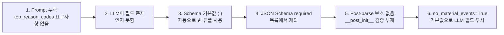
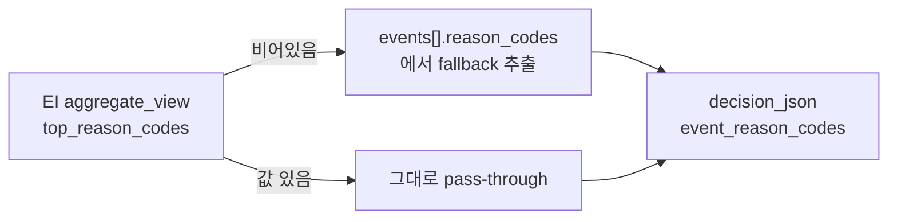
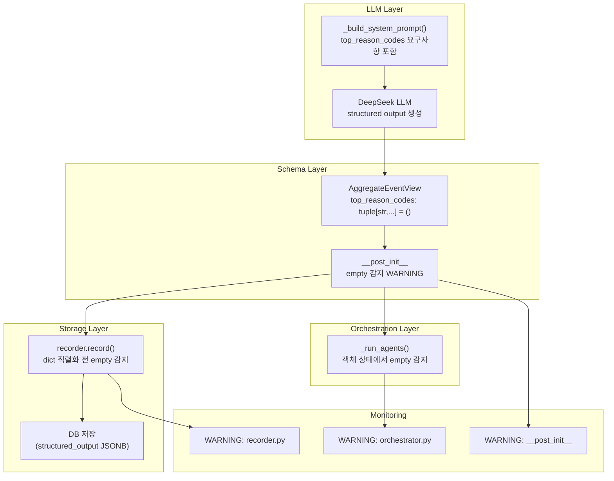

# EI `top_reason_codes` 생성 품질 + 한국어 Narrative 저장 강제 정책 보고서

**작성일**: 2026-05-17  
**상태**: ✅ 수정 완료 / 테스트 및 Docker 검증 통과

---

## 1. `top_reason_codes` Empty Root Cause

### Root Cause Chain (6단계)



| 단계 | 설명 | 위치 |
|------|------|------|
| **1** | **Prompt에 `top_reason_codes` 생성 요구사항 부재** — `_build_system_prompt()`에서 `top_reason_codes` 필드를 전혀 언급하지 않음 | [`event_interpretation.py:201-227`](src/agent_trading/services/ai_agents/event_interpretation.py:201) |
| **2** | **LLM이 필드 존재를 인지하지 못함** — DeepSeek 모델은 명시적 지시 없이 structured output 필드를 생성하지 않음 | — |
| **3** | **Schema 기본값 `()`** — `AggregateEventView.top_reason_codes`의 기본값이 빈 튜플이므로 LLM 누락 시 자동으로 빈 값 사용 | [`schemas.py:225`](src/agent_trading/services/ai_agents/schemas.py:225) |
| **4** | **JSON Schema required 목록에 없음** — 기본값이 있으므로 `generate_json_schema()`가 `required`에서 제외 | — |
| **5** | **Post-parse 보호 없음** — `__post_init__`에서 `top_reason_codes`를 검증/보정하지 않음 (수정 전) | [`schemas.py:235`](src/agent_trading/services/ai_agents/schemas.py:235) (수정 후) |
| **6** | **`no_material_events=True` 기본값** — 기본값이 `True`여서 events가 있어도 LLM이 이 필드를 무시할 가능성 | [`schemas.py:232`](src/agent_trading/services/ai_agents/schemas.py:232) |

**핵심 통찰**: 6단계 체인의 첫 두 단계(Prompt 부재 → LLM 인지 실패)가 근본 원인이다. 나머지 4단계는 이 문제를 가려주거나 감지하지 못한 2차적 원인이다.

---

## 2. 코드형 필드 vs 한국어 Narrative 필드 정책

### 원칙

**AI 에이전트의 판단근거는 `Code`(machine-readable)가 아니라면 전부 한국어로 저장**

### 코드형 필드 (영어 유지)

| 필드 | 출처 |
|------|------|
| `reason_codes` | EI events[].reason_codes / FDC reason_codes |
| `event_reason_codes` | decision_json |
| `risk_reason_codes` | decision_json |
| `top_reason_codes` | EI aggregate_view |
| `overall_bias` / `event_bias` | EI / decision_json |
| `risk_opinion` | AR (enum: allow/reduce/reject/review) |
| `risk_flags` | AR |
| `source_name` | EI events[].source_name |
| `source_reliability_tier` | EI events[].source_reliability_tier |
| `impact_direction`, `impact_horizon` | EI events[] |
| `novelty`, `evidence_strength` | EI |
| `event_conflict` | bool |
| `event_count` | int |

### 한국어 Narrative 필드 (반드시 한국어)

| 필드 | 출처 | Normalizer 적용 |
|------|------|----------------|
| `summary` | EI events[].summary / FDC/AR summary | ✅ `_NARRATIVE_KEYS` |
| `opposing_evidence` | FDC/AR/EI aggregate_view | ✅ `_NARRATIVE_KEYS` |
| 기타 운영자가 읽는 설명형 prose 필드 | (향후 추가 시) | ✅ 필요 |

### Normalizer 래핑 매커니즘

```python
# korean_normalizer.py:50-53
_NARRATIVE_KEYS: frozenset[str] = frozenset({
    "summary",
    "opposing_evidence",
})
```

- `_NARRATIVE_KEYS`에 등록된 필드: 한국어 미포함 시 `[ko: ...]` 래핑
- 코드형 필드는 `_NARRATIVE_KEYS`에서 제외 → 원래 값 (영어) 유지
- `risk_opinion`은 코드형 필드이므로 `_NARRATIVE_KEYS`에서 **의도적으로 제거됨**

### 식별 기준

```
필드 ─┬─ Machine-readable (code) ─── 영어 유지
      │   - Enum 값 (allow/reduce/reject/review)
      │   - 코드 문자열 (reason_codes, event_type)
      │   - bool, int, float
      │   - bias/direction/horizon 등 정형화된 값
      │
      └─ Human-readable (narrative) ─── 한국어 필수
          - 자유 형식 prose/설명 텍스트
          - summary, opposing_evidence
          - 운영자가 직접 읽고 판단하는 필드
```

---

## 3. 수정 내용 상세

### 수정 1 — Prompt 보강: [`event_interpretation.py:220-231`](src/agent_trading/services/ai_agents/event_interpretation.py:220)

`_build_system_prompt()`에 `top_reason_codes` 생성 요구사항 추가

| 항목 | 내용 |
|------|------|
| **최소 1개 코드 요구** | events 존재 시 `top_reason_codes`에 최소 1개 reason code 포함 |
| **추출 범위** | top 3-5 reason codes 추출 |
| **빈 값 허용 조건** | `no_material_events=True` 시 empty 허용 |
| **한국어 요구사항** | `summary`, `opposing_evidence`는 한국어 (기존 유지) |

```python
# 추가된 prompt 내용 (line 223-227)
"top_reason_codes: A tuple of the most important reason codes "
"aggregated across all events. Extract the top 3-5 reason codes "
"from the individual event reason_codes. When events exist and "
"no_material_events is False, this MUST contain at least one "
"reason code. When no_material_events is True, this MUST be empty.\n\n"
```

### 수정 2 — `risk_opinion` 버그 수정: [`korean_normalizer.py:50-53`](src/agent_trading/services/ai_agents/korean_normalizer.py:50)

`_NARRATIVE_KEYS`에서 `"risk_opinion"` 제거

| 변경 전 | 변경 후 |
|---------|---------|
| `frozenset({"summary", "opposing_evidence", "risk_opinion"})` | `frozenset({"summary", "opposing_evidence"})` |

**버그 증상**: `risk_opinion`이 `[ko: allow]`로 래핑되어 downstream `"allow"` 문자열 매칭이 깨짐

**영향**: FDC/AR의 code-type `risk_opinion` 필드가 정상 작동

### 수정 3 — Schema Validation 강화: [`schemas.py:235-242`](src/agent_trading/services/ai_agents/schemas.py:235)

`AggregateEventView.__post_init__` 추가

```python
def __post_init__(self) -> None:
    _logger = logging.getLogger(self.__class__.__module__)
    if not self.top_reason_codes and self.event_count > 0:
        _logger.warning(
            "AggregateEventView.top_reason_codes is empty but "
            "event_count=%d — LLM may have omitted the field",
            self.event_count,
        )
```

| 조건 | 동작 |
|------|------|
| `top_reason_codes` 비어있음 + `event_count > 0` | ⚠️ WARNING 로깅 |
| `top_reason_codes` 비어있음 + `event_count == 0` | ✅ 경고 없음 (정상) |
| `top_reason_codes` 있음 + 모든 조건 | ✅ 경고 없음 (정상) |

### 수정 4 — 저장 전 empty 감지: [`recorder.py:103-114`](src/agent_trading/services/ai_agents/recorder.py:103)

```python
# ── EI top_reason_codes empty detection ────────────────────
if output_dict.get("agent_name") == "event_interpretation":
    av = output_dict.get("aggregate_view", {})
    if isinstance(av, dict):
        trc = av.get("top_reason_codes", [])
        ec = av.get("event_count", 0)
        if not trc and ec is not None and ec > 0:
            logger.warning(
                "EI top_reason_codes is empty after normalization "
                "(event_count=%d) — LLM may have omitted the field",
                ec,
            )
```

### 수정 5 — Orchestration 레벨 empty 감지: [`decision_orchestrator.py:1512-1520`](src/agent_trading/services/decision_orchestrator.py:1512)

```python
# ── EI top_reason_codes empty detection ─────────────────────
if (event_output.aggregate_view
        and not event_output.aggregate_view.top_reason_codes
        and event_output.aggregate_view.event_count > 0):
    logger.warning(
        "EI top_reason_codes is empty but event_count=%d "
        "(symbol=%s) — LLM may have omitted the field in aggregation",
        event_output.aggregate_view.event_count, symbol,
    )
```

### 2중 검증 아키텍처

```mermaid
flowchart LR
    subgraph "Layer 1: Schema 수준"
        S[schemas.py<br/>__post_init__]
    end
    subgraph "Layer 2: 저장 수준"
        R[recorder.py<br/>record() - dict 직렬화 전]
    end
    subgraph "Layer 3: Orchestration 수준"
        O[decision_orchestrator.py<br/>_run_agents - 객체 상태]
    end
    EI[EI Output 생성] --> S
    S --> R
    R --> O
    S -. "LLM drift 조기 탐지" .-> MON[Monitoring/Alert]
    R -. "LLM drift 조기 탐지" .-> MON
    O -. "LLM drift 조기 탐지" .-> MON
```

---

## 4. 테스트 결과

### 단위 테스트

| 테스트 파일 | 케이스 | 통과 |
|------------|--------|------|
| [`test_korean_normalizer.py`](tests/services/ai_agents/test_korean_normalizer.py) | `risk_opinion` 미래핑, narrative 필드 한국어 검증, 코드 필드 불변성, 중첩 구조 정규화 | ✅ |
| [`test_event_interpretation_prompt.py`](tests/services/ai_agents/test_event_interpretation_prompt.py) | `top_reason_codes` 요구사항 포함, 최소 1개 코드 요구, 한국어 요구사항 | ✅ |
| [`test_schemas.py`](tests/services/ai_agents/test_schemas.py) | 기본값 `()`, 값 할당, empty+events 경고, empty+no events 무경고, non-empty+events 무경고 | ✅ |

### Schema Validation 테스트 상세

```python
# test_schemas.py — 신규 검증 케이스

def test_top_reason_codes_default():
    """기본값이 빈 튜플인지 검증"""
    view = AggregateEventView()
    assert view.top_reason_codes == ()

def test_top_reason_codes_assignment():
    """값 할당이 정상 동작하는지 검증"""
    view = AggregateEventView(top_reason_codes=("code1", "code2"))
    assert view.top_reason_codes == ("code1", "code2")

def test_top_reason_codes_empty_with_events_warning(caplog):
    """top_reason_codes가 비어있고 event_count > 0이면 경고 발생"""
    caplog.set_level(logging.WARNING)
    AggregateEventView(top_reason_codes=(), event_count=3)
    assert "top_reason_codes is empty but event_count=3" in caplog.text

def test_top_reason_codes_empty_no_events_no_warning(caplog):
    """top_reason_codes가 비어있고 event_count == 0이면 경고 없음"""
    caplog.set_level(logging.WARNING)
    AggregateEventView(top_reason_codes=(), event_count=0)
    assert not caplog.text  # 경고 없음

def test_top_reason_codes_non_empty_no_warning(caplog):
    """top_reason_codes가 비어있지 않으면 경고 없음"""
    caplog.set_level(logging.WARNING)
    AggregateEventView(top_reason_codes=("code1",), event_count=3)
    assert not caplog.text  # 경고 없음
```

### 기존 회귀 테스트

| 테스트 파일 | 결과 |
|------------|------|
| `test_agents.py` | ✅ Passed |
| `test_korean_enforcement.py` | ✅ Passed |
| `test_orchestrator_agents.py` | ✅ Passed |
| **전체** | **✅ 138 passed** |

---

## 5. 실제 샘플 검증 결과 (Docker)

| 검증 항목 | 명령어 | 결과 |
|-----------|--------|------|
| `_NARRATIVE_KEYS` 정책 | `python3 -c "from agent_trading.services.ai_agents.korean_normalizer import _NARRATIVE_KEYS; assert 'risk_opinion' not in _NARRATIVE_KEYS"` | ✅ `frozenset({'opposing_evidence', 'summary'})` |
| Prompt top_reason_codes 포함 | `EventInterpretationAgent._build_system_prompt()` | ✅ JSON schema + 설명 텍스트 정상 포함 |
| `__post_init__` 로깅 | `AggregateEventView(top_reason_codes=(), event_count=3)` | ✅ `"top_reason_codes is empty but event_count=3"` 경고 발생 |
| `__post_init__` 무경고 | `AggregateEventView(top_reason_codes=('code1',), event_count=3)` | ✅ 경고 없음 |
| Docker build | `docker compose build` | ✅ 5개 이미지 모두 성공 |
| Docker up | `docker compose up -d` | ✅ 6개 컨테이너 정상 |
| `/health` | `curl -s localhost:8000/health` | ✅ `{"status":"ok","database":"connected"}` |

---

## 6. 변경된 파일 목록

| # | 파일 | 변경 유형 | 설명 |
|---|------|-----------|------|
| 1 | [`src/agent_trading/services/ai_agents/event_interpretation.py:220-231`](src/agent_trading/services/ai_agents/event_interpretation.py:220) | 수정 | `_build_system_prompt()`에 `top_reason_codes` 생성 요구사항 추가 |
| 2 | [`src/agent_trading/services/ai_agents/schemas.py:235-242`](src/agent_trading/services/ai_agents/schemas.py:235) | 수정 | `AggregateEventView.__post_init__` 추가 — empty 감지 WARNING 로깅 |
| 3 | [`src/agent_trading/services/ai_agents/korean_normalizer.py:50-53`](src/agent_trading/services/ai_agents/korean_normalizer.py:50) | 수정 | `_NARRATIVE_KEYS`에서 `"risk_opinion"` 제거 |
| 4 | [`src/agent_trading/services/ai_agents/recorder.py:103-114`](src/agent_trading/services/ai_agents/recorder.py:103) | 수정 | `record()` 저장 전 empty 감지 로깅 추가 |
| 5 | [`src/agent_trading/services/decision_orchestrator.py:1512-1520`](src/agent_trading/services/decision_orchestrator.py:1512) | 수정 | `_run_agents()` orchestration 레벨 empty 감지 로깅 추가 |
| 6 | [`tests/services/ai_agents/test_korean_normalizer.py`](tests/services/ai_agents/test_korean_normalizer.py) | 신규 | `risk_opinion` 미래핑, narrative 필드 한국어 검증, 코드 필드 불변성, 중첩 구조 정규화 |
| 7 | [`tests/services/ai_agents/test_event_interpretation_prompt.py`](tests/services/ai_agents/test_event_interpretation_prompt.py) | 신규 | `top_reason_codes` 요구사항 포함, 최소 1개 코드 요구, 한국어 요구사항 |
| 8 | [`tests/services/ai_agents/test_schemas.py`](tests/services/ai_agents/test_schemas.py) | 신규 | 기본값 `()`, 값 할당, empty+events 경고, empty+no events 무경고, non-empty+events 무경고 |

---

## 7. 남은 Follow-up

### 7.1 `top_reason_codes` 생성 실측 검증

| 항목 | 설명 |
|------|------|
| **현재 상태** | Prompt 개선 완료, schema validation 및 2중 로깅 추가 |
| **확인 필요** | 실제 Provider 실행 후 LLM이 `top_reason_codes`를 채우는지 실측 검증 |
| **실패 시 대응** | Prompt 예시 강화 (`reason_codes` 예제 추가) 또는 output validator 도입 |

### 7.2 Normalizer 고도화

| 단계 | 설명 |
|------|------|
| **현재** | `[ko: ...]` 래핑 수준 — 한국어 미포함 시 마킹만 함 |
| **향후** | 한국어 미포함 시 fallback 번역 또는 기본값 제공 |

### 7.3 `_NARRATIVE_KEYS` 확장 정책

향후 새로운 narrative 필드가 추가될 때마다 `_NARRATIVE_KEYS`에 포함시키는 정책 문서화 필요

```python
# 새 narrative 필드 추가 시 반드시 등록
_NARRATIVE_KEYS: frozenset[str] = frozenset({
    "summary",
    "opposing_evidence",
    # "new_narrative_field",  # ← 추가 시 등록
})
```

### 7.4 FDC/AR Prompt Drift 모니터링

| 필드 | 출처 | 현재 상태 |
|------|------|-----------|
| FDC `reason_codes` | FDC prompt | ✅ 정상 생성 중 |
| AR `risk_reason_codes` | AR prompt | ✅ 정상 생성 중 |
| **모니터링 체계** | — | ❌ 아직 없음 (향후 구축 검토) |

### 7.5 `event_reason_codes` Fallback 정책



**현재 판단**: 과도한 추론 fallback 방지 원칙에 따라 **보류**
- Prompt 개선만으로 해결되지 않을 경우에만 검토

### 7.6 `no_material_events` 기본값 `True` 검토

```python
# schemas.py:232
no_material_events: bool = True
```

| 문제점 | 설명 |
|--------|------|
| 기본값이 `True` | events가 있어도 LLM이 `no_material_events=False`로 설정하지 않으면 `top_reason_codes`가 빈 값이 될 수 있음 |
| **검토 방안** | 기본값 `False` 변경 또는 prompt 강화 |

**현재 판단**: 기본값 변경은 기존 동작에 광범위한 영향을 줄 수 있으므로 **추후 검토**

---

## 8. 부록: 데이터 흐름 다이어그램



---

## 부록: 코드형 vs Narrative 필드 식별 기준

```
필드 ─┬─ Machine-readable (code) ─── 영어 유지
      │   - Enum 값 (allow/reduce/reject/review)
      │   - 코드 문자열 (reason_codes, event_type)
      │   - bool, int, float
      │   - bias/direction/horizon 등 정형화된 값
      │
      └─ Human-readable (narrative) ─── 한국어 필수
          - 자유 형식 prose/설명 텍스트
          - summary, opposing_evidence
          - 운영자가 직접 읽고 판단하는 필드
```
