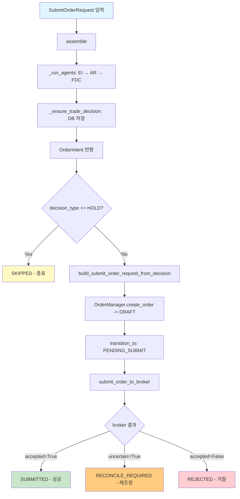

# Gap 1: AI Decision → Order Submit 실행 경로 연결

## 목표

FDC (Final Decision Composer) 출력 → TradeDecisionEntity 저장 → deterministic backend translation → OrderManager.create_order() → OrderManager.submit_order_to_broker() 파이프라인을 완성한다.

## 현재 상태 (분석 완료)

### 이미 구현된 것

1. **DecisionOrchestratorService.assemble()** (`src/agent_trading/services/decision_orchestrator.py`)
   - DecisionContext 생성/확인 (`_ensure_or_create_decision_context`)
   - EI → AR → FDC 3개 에이전트 순차 실행 (`_run_agents`)
   - TradeDecisionEntity 생성/저장 (`_ensure_trade_decision`)
   - SubmitOrderRequest 조립
   - OrderIntent 반환

2. **OrderManager** (`src/agent_trading/services/order_manager.py`)
   - `create_order()`: 검증, Account/Instrument 참조 해결, idempotency, DRAFT 저장
   - `submit_order_to_broker()`: Blocking lock check → broker submit → 결과 처리 (SUBMITTED / RECONCILE_REQUIRED / REJECTED)
   - `transition_to()`: 상태 전이 머신 + 낙관적 잠금

3. **Runtime wiring** (`src/agent_trading/runtime/bootstrap.py`)
   - KIS broker adapter, orchestrator, polling workers 조립
   - Provider agent 실전/Stub 분기

4. **Entrypoint** (`scripts/run_orchestrator_once.py`)
   - Prerequisite seed → assemble() → DB 출력 — **broker submit 없이 종료**

### 연결되지 않은 부분 (이번 작업 범위)

1. `assemble()`이 반환한 `OrderIntent` → `OrderManager.create_order()` 호출이 **전혀 연결되어 있지 않음**
2. `OrderIntent.request` (SubmitOrderRequest)에 `decision_id`, `decision_context_id`, `order_intent_id`가 채워져 있지만, **`client_order_id`, `strategy_id` 등 필수 필드 검증이 부족**
3. `OrderManager.submit_order_to_broker()`는 브로커 어댑터를 인자로 받지만, 누가 브로커를 결정하고 전달할지 정의되지 않음
4. Failure handling: AI 실패 / 변환 실패 / OrderManager 실패 / broker 실패가 **구분되지 않음**

## 설계 결정

### 핵심 원칙

1. **AI = 판단만, Backend = 실행만**: `assemble()`은 AI 판단을 OrderIntent로 정리. 그 이후의 `create_order → submit`은 순수 deterministic backend 책임.
2. **기존 경계 변경 금지**: `SubmitOrderRequest`, `OrderManager`, `BrokerAdapter` 시맨틱은 변경하지 않음.
3. **Canary/Live 구분 없음**: Paper 전용. Live credential 없이 paper broker adapter로만 검증.
4. **Admin UI 변경 없음**: API/프론트엔드 수정 없음.

### 새로운 함수/메서드

```python
# 1. 결정 → 주문 요청 변환 (순수 함수, stateless)
def build_submit_order_request_from_decision(
    intent: OrderIntent,
    client_order_id: str | None = None,
) -> SubmitOrderRequest
# - intent.request를 기반으로 client_order_id 자동 생성 (없으면)
# - side가 HOLD/NO_ORDER면 None 반환 (=skip)
# - quantity/price 검증

# 2. Orchestrator에 submit 파이프라인 통합 메서드
class DecisionOrchestratorService:
    async def assemble_and_submit(
        self,
        request: SubmitOrderRequest,
        *,
        order_manager: OrderManager,
        broker: BrokerAdapter,
        decision_context_id: UUID | None = None,
        order_intent_id: UUID | None = None,
        actor_type: str = "system",
        actor_id: str = "decision_orchestrator",
    ) -> SubmitResult
    # - assemble() 호출
    # - intent 검증 (decision_type != HOLD, quantity > 0)
    # - OrderManager.create_order() 호출
    # - OrderManager.transition_to(PENDING_SUBMIT)
    # - OrderManager.submit_order_to_broker() 호출
    # - 결과 반환

# 3. 결과 타입 (Failure handling 명시)
@dataclass
class SubmitResult:
    status: str  # "SUBMITTED" | "SKIPPED" | "REJECTED" | "RECONCILE_REQUIRED" | "FAILED"
    intent: OrderIntent | None
    order: OrderRequestEntity | None
    error_phase: str | None = None  # "ai" | "decision_save" | "translation" | "order_create" | "order_submit"
    error_message: str | None = None
    trade_decision_id: UUID | None = None
```

## 구현 단계

### Step 1: `build_submit_order_request_from_decision()` 함수

**파일**: `src/agent_trading/services/decision_orchestrator.py` (파일 하단에 추가)

- `intent.ai_backend_inputs.decision_type`이 HOLD/WATCH면 `None` 반환 (skip)
- `client_order_id` 자동 생성: `"dc-{decision_context_id_short}-{timestamp}"` 형식
- `SubmitOrderRequest`의 `decision_id`를 `intent.request.decision_id` (이미 TradeDecisionEntity ID로 설정됨) 유지
- `order_intent_id` 설정 보존
- `quantity` <= 0 체크

### Step 2: `SubmitResult` + `SubmitError` 타입 정의

**파일**: `src/agent_trading/services/decision_orchestrator.py` (상단에 추가)

```python
from dataclasses import dataclass
from uuid import UUID

@dataclass(slots=True, frozen=True)
class SubmitResult:
    """Result of the full assemble → submit pipeline."""
    status: str  # "SUBMITTED" | "SKIPPED" | "REJECTED" | "RECONCILE_REQUIRED" | "FAILED" | "ERROR"
    intent: OrderIntent | None = None
    order: OrderRequestEntity | None = None
    error_phase: str | None = None
    error_message: str | None = None
    trade_decision_id: UUID | None = None
```

### Step 3: `DecisionOrchestratorService.assemble_and_submit()` 메서드

**파일**: `src/agent_trading/services/decision_orchestrator.py`

```python
async def assemble_and_submit(
    self,
    request: SubmitOrderRequest,
    *,
    order_manager: OrderManager,
    broker: BrokerAdapter,
    decision_context_id: UUID | None = None,
    order_intent_id: UUID | None = None,
    actor_type: str = "system",
    actor_id: str = "decision_orchestrator",
) -> SubmitResult:
    """Full pipeline: assemble → validate → create_order → submit_order."""
```

내부 로직:
1. `assemble()` 호출 → intent 획득
2. Intent 검증: `ai_backend_inputs.decision_type`이 HOLD/HOLD외?
   - HOLD → `SubmitResult(status="SKIPPED", intent=intent)` 반환
3. `build_submit_order_request_from_decision(intent)` 호출
   - 실패/None → `SubmitResult(status="FAILED", error_phase="translation")`
4. `order_manager.create_order(request)` 호출
   - 예외 → `SubmitResult(status="ERROR", error_phase="order_create", error_message=...)`
5. `order_manager.transition_to(order, PENDING_SUBMIT)` 호출
   - 예외 → `SubmitResult(status="ERROR", error_phase="order_create")`
6. `order_manager.submit_order_to_broker(order, broker, request)` 호출
   - 예외 → `SubmitResult(status="ERROR", error_phase="order_submit")`
   - 정상 → intent + order 포함하여 결과 반환

### Step 4: Runtime bootstrap에 OrderManager + broker wiring

**파일**: `src/agent_trading/runtime/bootstrap.py`

- `build_default_runtime()`과 `build_postgres_runtime()`에 `order_manager` 키 추가
- `ReconciliationService`도 생성하여 `OrderManager`에 주입
- `assemble_and_submit()` 호출 경로 준비 (runtime 소비자가 선택적으로 사용)

### Step 5: `scripts/run_orchestrator_once.py` 확장

- 기존 `assemble()` 호출 유지 (디버깅용)
- 새로운 CLI 옵션 `--submit` 추가 (기본값: False)
- `--submit` 모드: `assemble_and_submit()` 호출 → 결과 출력
- `OrderManager` + `broker` + `ReconciliationService` 구성

### Step 6: Failure handling 로깅 강화

- 각 단계별로 명확한 로그 메시지 (phase 포함)
- TradeDecisionEntity 저장 성공 여부를 SubmitResult에 포함
- Audit log는 OrderManager가 담당 (중복 기록 금지)

### Step 7: 테스트

**새 파일**: `tests/services/test_decision_submit_pipeline.py`

테스트 케이스:
1. `build_submit_order_request_from_decision()` - 정상 변환
2. `build_submit_order_request_from_decision()` - HOLD → None 반환
3. `build_submit_order_request_from_decision()` - quantity 0 → None 반환
4. `assemble_and_submit()` - Happy path (mock broker)
5. `assemble_and_submit()` - Broker reject
6. `assemble_and_submit()` - Broker uncertain → RECONCILE_REQUIRED
7. `assemble_and_submit()` - Translation failure (FDC output incomplete)
8. `assemble_and_submit()` - OrderManager.create_order 실패

## 데이터 흐름 다이어그램



## 변경 파일 목록

| 파일 | 변경 사항 |
|------|----------|
| `src/agent_trading/services/decision_orchestrator.py` | `SubmitResult` dataclass, `build_submit_order_request_from_decision()`, `assemble_and_submit()` 메서드 추가 |
| `src/agent_trading/runtime/bootstrap.py` | `OrderManager` + `ReconciliationService` wiring, runtime dict에 추가 |
| `scripts/run_orchestrator_once.py` | `--submit` 모드 추가, `assemble_and_submit()` 호출 경로 |
| `tests/services/test_decision_submit_pipeline.py` | 신규: 파이프라인 전체 테스트 |
| `plans/[BACKLOG] backlog.md` | Gap 1 해결 반영 |

## 제외 사항

- Admin UI 변경 없음
- Broker core 시맨틱 변경 없음
- Live credential 사용 금지 (Paper 전용)
- Reconciliation 자동화는 Gap 5 범위 (여기서는 기존 reconcile_required 경로만 활용)
- Hard guardrail engine 호출은 이번 범위에서 제외 (별도 Backlog 항목)
