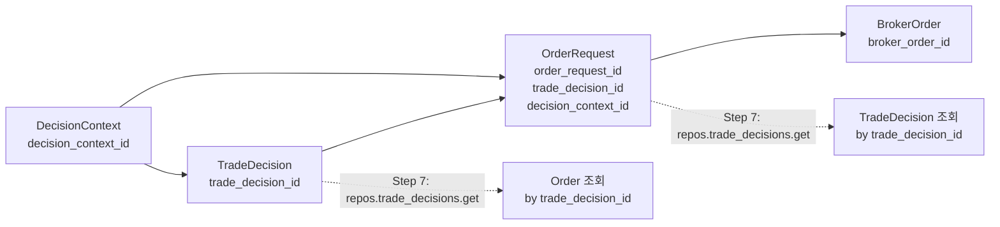

# Gap 2: Decision ↔ Order 추적성 강화

## 목표

`decision_context_id`, `trade_decision_id`, `order_request_id` 간 양방향 추적을 운영/디버깅 관점에서 보강한다.

## 현재 상태 (분석 완료)

### Trace Field Inventory

| Trace Field | TradeDecisionEntity | OrderRequestEntity | SubmitOrderRequest | DB order_requests | DB trade_decisions |
|---|---|---|---|---|---|
| `decision_context_id` | ✅ PK ref | ✅ Has field (line 249) | ✅ Has field | ✅ Column exists (mig 0005) | ✅ PK ref |
| `trade_decision_id` | ✅ PK | ✅ Has field (line 247) | ✅ as `decision_id` | ✅ Column exists (mig 0001) | ✅ PK |
| `order_request_id` | ❌ Missing | ✅ PK | ✅ as `order_intent_id` | ✅ PK | ❌ Missing |
| `client_order_id` | - | ✅ Has | ✅ Has | ✅ Column | - |
| `correlation_id` | - | ✅ Has | ✅ Has | ✅ Column | - |

### 발견된 Gap (3가지 Critical)

1. **`OrderManager.create_order()`** (order_manager.py:277-306) — [`decision_context_id`](src/agent_trading/services/order_manager.py:287)가 `SubmitOrderRequest` → `OrderRequestEntity` 생성자에 전달되지 않음. Entity field는 존재하지만 값이 `None`으로 유지됨.

2. **`PostgresOrderRepository.add()`** (postgres/orders.py:31-70) — [`INSERT SQL`](src/agent_trading/repositories/postgres/orders.py:35)에 `decision_context_id` 컬럼이 없음. DB column은 migration 0005로 존재하지만 INSERT에서 생략됨.

3. **`TradeDecisionRepository`** (contracts.py:226-234) — [`get()` by PK](src/agent_trading/repositories/contracts.py:232) 메서드가 없어, order가 가진 `trade_decision_id`로 decision을 조회할 방법이 없음.

### 추가 발견된 Gap (4가지 Operational)

4. **`OrderQuery`** (filters.py:19-27) — [`trade_decision_id`](src/agent_trading/repositories/filters.py:19)와 `decision_context_id` 필터가 없음.

5. **`OrderSummary`** (schemas.py:44-62) — [`decision_context_id`](src/agent_trading/api/schemas.py:44) 필드가 없음. API 응답에서 누락.

6. **`GET /orders`** (routes/orders.py:54) — [`list_orders()`](src/agent_trading/api/routes/orders.py:54)에 `trade_decision_id`, `decision_context_id` query param 없음.

7. **`SubmitResult`** (decision_orchestrator.py:222-261) — [`decision_context_id`](src/agent_trading/services/decision_orchestrator.py:222) 필드가 없어 호출자가 바로 접근 불가.

## 변경 원칙

- **Additive only**: 기존 컬럼/테이블 구조 변경 금지, 기존 semantics 유지
- **Store + Query**: 저장 구조 보강 + 조회 경로 보강 모두 포함
- **DB migration 불필요**: `order_requests.decision_context_id` 컬럼은 이미 migration 0005로 존재. `trade_decisions` 테이블 변경도 없음.

## 상세 구현 계획 (10 Steps)

---

### Step 1: `OrderManager.create_order()` — `decision_context_id` 전파

**파일**: [`src/agent_trading/services/order_manager.py`](src/agent_trading/services/order_manager.py)

**변경 위치**: lines 277-306 (`create_order()` 메서드 내부)

```python
# After trade_decision_id resolution (line 283), add:
decision_context_id: UUID | None = None
if request.decision_context_id is not None:
    try:
        decision_context_id = UUID(request.decision_context_id)
    except (ValueError, AttributeError):
        pass

# Then add to OrderRequestEntity constructor (line 287):
order = OrderRequestEntity(
    ...
    trade_decision_id=trade_decision_id,
    decision_context_id=decision_context_id,  # ← NEW
    ...
)
```

**검증**: `decision_context_id`가 `SubmitOrderRequest` → `OrderRequestEntity`로 정상 전달됨.

---

### Step 2: `PostgresOrderRepository.add()` — SQL INSERT 보강

**파일**: [`src/agent_trading/repositories/postgres/orders.py`](src/agent_trading/repositories/postgres/orders.py)

**변경 위치**: lines 35-61

**INSERT 컬럼 리스트** (기존 16개 columns → 17개):
```sql
INSERT INTO trading.order_requests
    (order_request_id, account_id, instrument_id,
     client_order_id, idempotency_key, correlation_id,
     side, order_type, time_in_force,
     requested_price, requested_quantity,
     status, status_reason_code, status_reason_message,
     trade_decision_id, decision_context_id, submitted_at)
VALUES ($1, $2, $3, $4, $5, $6, $7, $8, $9, $10, $11, $12, $13, $14, $15, $16, $17)
```

**VALUES** (기존 $1-$16 → $1-$17):
- `order.decision_context_id` → `$16` (기존 `submitted_at`이 `$17`)

**검증**: DB INSERT 후 `decision_context_id`가 정상 저장됨.

---

### Step 3: `OrderQuery` trace field 필터 추가

**파일**: [`src/agent_trading/repositories/filters.py`](src/agent_trading/repositories/filters.py)

**변경 위치**: lines 19-27

```python
@dataclass(slots=True, frozen=True)
class OrderQuery:
    account_id: UUID | None = None
    client_order_id: str | None = None
    correlation_id: str | None = None
    status: str | None = None
    trade_decision_id: UUID | None = None       # ← NEW
    decision_context_id: UUID | None = None      # ← NEW
    submitted_from: datetime | None = None
    submitted_to: datetime | None = None
    limit: int = 100
```

**검증**: `OrderQuery`가 새로운 필드를 정상적으로 받음.

---

### Step 4: Repository `list()` 메서드 필터 조건 추가

**4a. `PostgresOrderRepository.list()`**

**파일**: [`src/agent_trading/repositories/postgres/orders.py`](src/agent_trading/repositories/postgres/orders.py)

**변경 위치**: lines 86-121

현재 WHERE 절이 동적으로 구성. 아래 조건 추가:
```python
if query.trade_decision_id is not None:
    conditions.append(f"trade_decision_id = ${param_idx}")
    params.append(query.trade_decision_id)
    param_idx += 1

if query.decision_context_id is not None:
    conditions.append(f"decision_context_id = ${param_idx}")
    params.append(query.decision_context_id)
    param_idx += 1
```

**4b. `InMemoryOrderRepository.list()`**

**파일**: [`src/agent_trading/repositories/memory.py`](src/agent_trading/repositories/memory.py)

**변경 위치**: lines 320-338

```python
if query.trade_decision_id is not None and item.trade_decision_id != query.trade_decision_id:
    continue
if query.decision_context_id is not None and item.decision_context_id != query.decision_context_id:
    continue
```

**검증**: 두 Repository 모두 trace field로 필터링 가능.

---

### Step 5: `OrderSummary` 스키마 + `_order_to_summary()` — `decision_context_id` 노출

**5a. 스키마**

**파일**: [`src/agent_trading/api/schemas.py`](src/agent_trading/api/schemas.py)

**변경 위치**: line 44 (OrderSummary 클래스)

```python
class OrderSummary(BaseModel):
    ...
    correlation_id: str
    trade_decision_id: str | None = None
    decision_context_id: str | None = None    # ← NEW
    created_at: datetime | None = None
```

**5b. 변환 함수**

**파일**: [`src/agent_trading/api/routes/orders.py`](src/agent_trading/api/routes/orders.py)

**변경 위치**: line 21 (`_order_to_summary()`)

```python
decision_context_id=str(order.decision_context_id) if order.decision_context_id is not None else None,
```

**검증**: API 응답에 `decision_context_id`가 포함됨.

---

### Step 6: `GET /orders` API — trace field query param 추가

**파일**: [`src/agent_trading/api/routes/orders.py`](src/agent_trading/api/routes/orders.py)

**변경 위치**: line 54 (`list_orders()`)

```python
@router.get("", response_model=list[OrderSummary])
async def list_orders(
    account_id: str | None = Query(None),
    client_order_id: str | None = Query(None),
    status: str | None = Query(None),
    trade_decision_id: str | None = Query(None),        # ← NEW
    decision_context_id: str | None = Query(None),       # ← NEW
    limit: int = Query(100, ge=1, le=1000),
    repos: RepositoryContainer = Depends(get_repos),
) -> list[OrderSummary]:
    query = OrderQuery(
        account_id=UUID(account_id) if account_id else None,
        client_order_id=client_order_id,
        status=status,
        trade_decision_id=UUID(trade_decision_id) if trade_decision_id else None,   # ← NEW
        decision_context_id=UUID(decision_context_id) if decision_context_id else None,  # ← NEW
        limit=limit,
    )
```

**운영 시나리오**:
- `GET /orders?trade_decision_id={uuid}` — 특정 decision에서 생성된 모든 주문 조회
- `GET /orders?decision_context_id={uuid}` — 특정 decision context의 모든 주문 조회

**검증**: curl/FastAPI docs에서 trace field 필터링 동작 확인.

---

### Step 7: `TradeDecisionRepository.get(trade_decision_id)` — PK 조회 메서드 추가

**7a. Contract (Protocol)**

**파일**: [`src/agent_trading/repositories/contracts.py`](src/agent_trading/repositories/contracts.py)

**변경 위치**: line 226 (`TradeDecisionRepository`)

```python
class TradeDecisionRepository(Protocol):
    async def add(self, decision: TradeDecisionEntity) -> TradeDecisionEntity: ...
    async def get(self, trade_decision_id: UUID) -> TradeDecisionEntity | None: ...  # ← NEW
    async def get_by_context(self, decision_context_id: UUID) -> TradeDecisionEntity | None: ...
    async def list_all(self) -> list[TradeDecisionEntity]: ...
```

**7b. Postgres 구현**

**파일**: [`src/agent_trading/repositories/postgres/trade_decisions.py`](src/agent_trading/repositories/postgres/trade_decisions.py)

```python
async def get(self, trade_decision_id: UUID) -> TradeDecisionEntity | None:
    row = await self._tx.connection.fetchrow(
        "SELECT * FROM trading.trade_decisions WHERE trade_decision_id = $1",
        trade_decision_id,
    )
    if row is None:
        return None
    return row_to_entity(row, TradeDecisionEntity)
```

**7c. In-memory 구현**

**파일**: [`src/agent_trading/repositories/memory.py`](src/agent_trading/repositories/memory.py)

```python
async def get(self, trade_decision_id: UUID) -> TradeDecisionEntity | None:
    return self._items.get(trade_decision_id)
```

**검증**: `repos.trade_decisions.get(trade_decision_id)`로 단일 decision 조회 가능.

---

### Step 8: `SubmitResult`에 `decision_context_id` 필드 추가 + `assemble_and_submit()` 전파

**파일**: [`src/agent_trading/services/decision_orchestrator.py`](src/agent_trading/services/decision_orchestrator.py)

**8a. SubmitResult dataclass** (line 222):

```python
@dataclass(slots=True, frozen=True)
class SubmitResult:
    status: str
    intent: OrderIntent | None = None
    order: OrderRequestEntity | None = None
    error_phase: str | None = None
    error_message: str | None = None
    trade_decision_id: UUID | None = None
    decision_context_id: UUID | None = None     # ← NEW
```

**8b. 모든 return site에 `decision_context_id=` 추가**:

1. **Phase 1 ERROR** (line 638): `decision_context_id=decision_context_id`
2. **Phase 2 SKIPPED** (line 668): `decision_context_id=intent.decision_context_id`
3. **Phase 3 order_create ERROR** (line 697): `decision_context_id=decision_context_id` (from line 646 resolution)
4. **Phase 4a VALIDATED ERROR** (line 723): `decision_context_id=decision_context_id`
5. **Phase 4b PENDING_SUBMIT ERROR** (line 750): `decision_context_id=decision_context_id`
6. **Phase 5 submit ERROR** (line 778): `decision_context_id=decision_context_id`
7. **Final SUCCESS** (line 804): `decision_context_id=intent.decision_context_id`

**검증**: `SubmitResult`에서 바로 `decision_context_id` 접근 가능.

---

### Step 9: 테스트 보강

**파일**: [`tests/services/test_decision_submit_pipeline.py`](tests/services/test_decision_submit_pipeline.py)

**9a. `test_happy_path_submitted`** — `decision_context_id` 전파 검증:
- `SubmitResult`의 `decision_context_id`가 `intent.decision_context_id`와 일치하는지 확인
- `OrderRequestEntity`의 `decision_context_id`가 `None`이 아닌지 확인

**9b. 신규 테스트**: `test_decision_context_id_propagated_to_order`:
- `assemble_and_submit()` → create_order() 경로에서 `decision_context_id`가 entity에 전파되는지 검증

**9c. `OrderQuery` trace filter 테스트** (옵션):
- `OrderQuery(trade_decision_id=...)` 필터로 올바른 order만 반환되는지 검증
- `OrderQuery(decision_context_id=...)` 필터로 올바른 order만 반환되는지 검증

**9d. `TradeDecisionRepository.get()` 테스트** (옵션):
- 기존 `test_postgres_trade_decisions.py`에 `get()` 테스트 케이스 추가

**검증**: 34/34 tests all passing → 36+/36+ tests all passing.

---

### Step 10: [BACKLOG] backlog.md 업데이트 및 완료 보고

**파일**: [`plans/[BACKLOG] backlog.md`](plans/[BACKLOG]%20backlog.md)

- 승격 기록 섹션에 Gap 2 완료 기록 추가
- 완료 보고서를 attempt_completion으로 전달

---

## 변경 파일 요약

| # | File | 변경 유형 | 설명 |
|---|------|----------|------|
| 1 | `src/agent_trading/services/order_manager.py` | 수정 | `decision_context_id` 전파 (create_order) |
| 2 | `src/agent_trading/repositories/postgres/orders.py` | 수정 | INSERT SQL + list() 필터 |
| 3 | `src/agent_trading/repositories/filters.py` | 수정 | OrderQuery trace field 추가 |
| 4 | `src/agent_trading/repositories/memory.py` | 수정 | InMemoryOrderRepository.list() 필터 + InMemoryTradeDecisionRepository.get() |
| 5 | `src/agent_trading/api/schemas.py` | 수정 | OrderSummary.decision_context_id 추가 |
| 6 | `src/agent_trading/api/routes/orders.py` | 수정 | _order_to_summary() + list_orders() query params |
| 7 | `src/agent_trading/repositories/contracts.py` | 수정 | TradeDecisionRepository.get() protocol |
| 8 | `src/agent_trading/repositories/postgres/trade_decisions.py` | 수정 | get() 메서드 구현 |
| 9 | `src/agent_trading/services/decision_orchestrator.py` | 수정 | SubmitResult.decision_context_id + 모든 return site |
| 10 | `tests/services/test_decision_submit_pipeline.py` | 수정 | trace field 검증 추가 |

**총 10개 파일 변경, DB migration 불필요.**

## 추적 흐름 다이어그램



## 검증 기준

1. **Order create 후 DB 조회**: `order_requests` 테이블의 `decision_context_id`가 정상 저장됨
2. **API 필터링**: `GET /orders?trade_decision_id=...`가 정확히 해당 decision의 order만 반환
3. **양방향 추적**:
   - Decision → Order: GET /orders?trade_decision_id={td_id}
   - Order → Decision: repos.trade_decisions.get(order.trade_decision_id)
4. **기존 테스트**: 34/34 기존 테스트 모두 통과 유지
5. **신규 assertions**: `SubmitResult.decision_context_id`가 `intent.decision_context_id`와 일치
