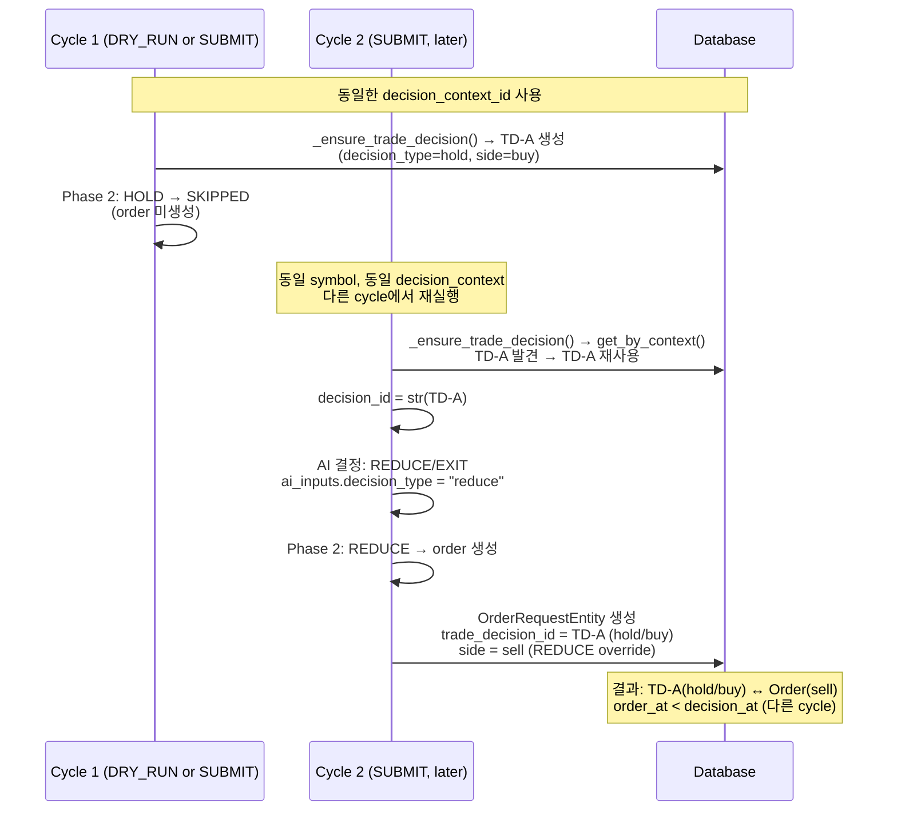
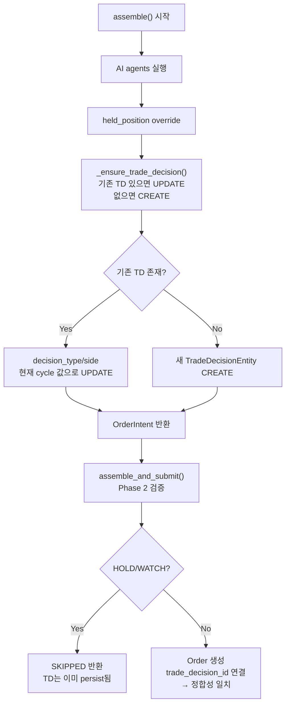

# Held_position Sell Budget 판정 조건 축소 + Decision/Order 정합성 분석 및 설계

**작성일**: 2026-05-20  
**작성자**: Roo (automated analysis)  
**관련 선행 작업**: [`staged_submit_budget_relaxation_for_risk_reducing_orders_2026-05-20.md`](plans/staged_submit_budget_relaxation_for_risk_reducing_orders_2026-05-20.md)

---

## 목차

1. [현황 분석](#1-현황-분석)
2. [DB 이상 사례](#2-db-이상-사례)
3. [근본 원인 분석](#3-근본-원인-분석)
4. [설계 A — Lane 판정 조건 축소](#4-설계-a--lane-판정-조건-축소)
5. [설계 B — Decision/Order 정합성 복구](#5-설계-b--decisionorder-정합성-복구)
6. [Todo List](#6-todo-list)

---

## 1. 현황 분석

### 1.1 소스 파일별 조건 현황

#### 1.1.1 `run_near_real_ops_scheduler.py`

**`_is_held_position_sell_result()`** (line 300–312)

```python
def _is_held_position_sell_result(result: CommandResult) -> bool:
    if not result.ok:
        return False
    for obj in _extract_json_objects(result.stdout):
        source_type = str(obj.get("source_type", "")).lower()
        if source_type == "held_position":
            return True
    return False
```

- **문제**: stdout JSON의 `source_type` 필드만 확인. `decision_type`이나 `side`는 전혀 검사하지 않음.
- **영향**: `held_position` source_type의 BUY 주문이나 HOLD/WATCH 결정도 special lane budget을 소비함.

**`_run_intraday_due_tasks()`** (line 801–886)

```python
# line 844-846
general_budget_ok = effective_submit_count < max_submit_per_day
hp_sell_budget_ok = effective_hp_sell_count < held_position_sell_max_per_day
dry_run = not general_budget_ok and not hp_sell_budget_ok
```

- budget 판정은 일반 budget과 held_position sell budget의 OR 조건
- held_position sell budget은 `_is_held_position_sell_result()`로 판정하므로 위와 동일한 문제

**`_get_db_held_position_sell_count()`** (line 409–466)

```sql
SELECT COUNT(*) AS cnt
FROM trading.order_requests o
JOIN trading.trade_decisions td ON o.trade_decision_id = td.trade_decision_id
WHERE o.created_at >= $1
  AND o.created_at < $2
  AND o.status = ANY($3::text[])
  AND td.source_type = 'held_position'
```

- DB 쿼리도 `source_type`만 필터링. `decision_type`이나 `side` 조건 없음.
- 따라서 DB에서 카운트되는 held_position sell count에는 BUY나 HOLD도 포함될 수 있음.

#### 1.1.2 `run_paper_decision_loop.py`

**`_process_one()`** — budget 분기 (line 1097–1113)

```python
async def _process_one(item: object) -> dict[str, object]:
    nonlocal submit_budget_consumed
    nonlocal held_position_sell_budget_consumed
    async with sem:
        async with _submit_lock:
            is_held_position_sell = (
                getattr(item, "source_type", "core") == "held_position"
            )
            if is_held_position_sell:
                symbol_submit = submit and not dry_run and not held_position_sell_budget_consumed
            else:
                symbol_submit = submit and not dry_run and not submit_budget_consumed
```

- `item.source_type`만 확인. `decision_type`/`side` 확인 없음.
- 같은 문제: BUY order도 held_position_sell budget 소비.

**`_serialize_cycle_result()`** (line 501–594)

```python
data: dict[str, object] = {
    "cycle": cycle,
    "symbol": symbol,
    "market": market,
    "source_type": source_type,
    "started_at": started_at,
    "completed_at": completed_at,
    "duration_seconds": round(duration, 3),
}
```

- `source_type`은 포함되지만 `decision_type`과 `side`는 stdout JSON에 **포함되지 않음**.
- DRY_RUN이나 SUBMIT 결과에 따라 `data["decision_type"]`이 설정되지만, 항상 포함되는 것은 아님.
- scheduler가 `_is_held_position_sell_result()`에서 `decision_type`/`side`를 확인할 수 없는 근본 원인.

**`_process_one()`** — budget 소비 판정 (line 1138–1147)

```python
status = result.get("status", "UNKNOWN")
if status in ("SUBMITTED", "RECONCILE_REQUIRED"):
    async with _submit_lock:
        is_held_position_sell = (
            getattr(item, "source_type", "core") == "held_position"
        )
        if is_held_position_sell:
            held_position_sell_budget_consumed = True
        else:
            submit_budget_consumed = True
```

- 여기서도 `source_type`만 확인. BUY 주문이어도 held_position이면 special budget 소비.

#### 1.1.3 `decision_orchestrator.py`

**`_ensure_trade_decision()`** (line 2277–2389)

```python
existing = await self._repos.trade_decisions.get_by_context(decision_context_id)
if existing is not None:
    return existing.trade_decision_id
# ... 새 TradeDecisionEntity 생성
```

- `decision_context_id` 기준으로 기존 trade_decision 재사용
- **핵심 문제**: 기존 decision의 `decision_type`/`side`가 현재 cycle의 AI 결정과 무관하게 그대로 사용됨
- 새로 생성 시 (`_resolve_decision_type`, `_resolve_order_side`) 값 저장

**`assemble()`** (line 520–874)

- `source_type` 추출: `request.metadata.get("source_type", "core")` (line 671–676)
- `_ensure_trade_decision()` 호출 위치: line 818 (ai_inputs가 override된 이후)
- `decision_id = str(trade_decision_id)` (line 829) — order request에 전달

**`assemble_and_submit()`** — Phase 2 (line 1090–1115)

```python
_dt = intent.ai_backend_inputs.decision_type
submit_request = build_submit_order_request_from_decision(intent)
if submit_request is None:
    # HOLD/WATCH → SKIPPED, order 미생성
    return SubmitResult(status="SKIPPED", ...)
```

- Phase 2는 `ai_backend_inputs.decision_type`을 사용 — 이 값은 `_ensure_trade_decision()`이 저장한 값과 다를 수 있음.

#### 1.1.4 `order_manager.py` (line 289–320)

```python
trade_decision_id: UUID | None = None
if request.decision_id is not None:
    try:
        trade_decision_id = UUID(request.decision_id)
    except (ValueError, AttributeError):
        pass
```

- `request.decision_id` → `UUID` 파싱 → `OrderRequestEntity.trade_decision_id`에 저장
- 단순 연결, 검증 로직 없음

---

## 2. DB 이상 사례

### 2.1 이상 사례 1: HOLD decision에 order_request가 연결된 경우 (4건)

| trade_decision_id | decision_type | decision_side | order_side | order_status |
|---|---|---|---|---|
| `365cb6d2-...` | hold | buy | sell | expired |
| `ec5a99a4-...` | hold | buy | sell | expired |
| `aa3c9847-...` | hold | buy | sell | pending_submit |
| `bdc1708a-...` | hold | buy | sell | pending_submit |

- HOLD 결정이므로 order가 존재하면 안 되지만, 4건 모두 order 존재
- 모든 케이스에서 `decision_side=buy` vs `order_side=sell`로 불일치

### 2.2 이상 사례 2: order_at < decision_at (음수 lag) (7건)

| trade_decision_id | decision_type | decision_at | order_at | lag(초) |
|---|---|---|---|---|
| `c435c4f7-...` | reduce | 05:09:22 | 05:07:16 | -126.5 |
| `af01441a-...` | reduce | 05:09:22 | 05:08:31 | -50.2 |
| `365cb6d2-...` | hold | 05:04:59 | 05:00:41 | -258.5 |
| ... (4건 더) | | | | |

- FK 제약조건(`order_requests_trade_decision_id_fkey`)이 존재하므로 trade_decision이 먼저 생성되어야 함
- `client_order_id` 타임스탬프(`dc-bb914b49-0504596969` → `05:04:59`)와 `td_created_at`(`05:04:59.658`)이 일치
- `order.created_at`이 `td.created_at`보다 빠른 것은 서로 다른 cycle에서 생성된 레코드가 동일한 `trade_decision_id`로 연결되었기 때문

### 2.3 이상 사례 3: decision side != order side (4건)

| trade_decision_id | decision_type | decision_side | order_side |
|---|---|---|---|
| `365cb6d2-...` | hold | buy | sell |
| `ec5a99a4-...` | hold | buy | sell |
| `aa3c9847-...` | hold | buy | sell |
| `bdc1708a-...` | hold | buy | sell |

- 4건 모두 `decision_side=buy` vs `order_side=sell`로 일관된 패턴

---

## 3. 근본 원인 분석

### 3.1 이상 사례 발생 시퀀스 (추정)



### 3.2 핵심 원인

1. **`_ensure_trade_decision()`의 무조건적 재사용**
   - 동일 `decision_context_id`에 대해 기존 trade_decision을 **항상 재사용**하고, 업데이트하지 않음
   - 이전 cycle에서 HOLD로 생성된 trade_decision이 이후 cycle에서 REDUCE/EXIT로 결정되어도 그대로 사용됨
   - order의 `decision_id`가 이전 cycle의 HOLD trade_decision을 가리키게 됨

2. **`build_submit_order_request_from_decision()`의 `decision_type` 검증**
   - Phase 2에서는 `ai_backend_inputs.decision_type` (현재 cycle의 AI 출력)을 사용하여 HOLD를 SKIP
   - 하지만 이미 `_ensure_trade_decision()`이 호출된 이후이므로 trade_decision은 HOLD로 생성됨
   - 이후 cycle에서 동일 context로 REDUCE 결정 시, 이 HOLD trade_decision이 재사용됨

3. **`_serialize_cycle_result()`에 `decision_type`/`side` 누락**
   - stdout JSON에 `source_type`만 포함되고 `decision_type`, `side`는 조건부로만 포함
   - scheduler가 판정할 수 있는 정보가 불충분

### 3.3 제약 조건 확인

- **FK 제약조건 존재**: `order_requests_trade_decision_id_fkey` — trade_decisions 테이블 참조
- **생성 시점 불일치**: `order_at < decision_at` 현상은 FK 위반이 아닌, trade_decision은 이전 cycle에 생성되었으나 order는 현재 cycle에 생성된 결과

---

## 4. 설계 A — Lane 판정 조건 축소

### 4.1 목표

Special lane이 다음 **3가지 조건을 모두 만족**할 때만 열리도록 수정:

1. `source_type == "held_position"`
2. `decision_type in ("reduce", "exit")`
3. `side == "sell"`

### 4.2 변경 대상 및 상세 설계

#### 4.2.1 `run_paper_decision_loop.py` — `_serialize_cycle_result()`

**stdout JSON에 `decision_type`과 `side` 항상 포함**

```python
data: dict[str, object] = {
    "cycle": cycle,
    "symbol": symbol,
    "market": market,
    "source_type": source_type,
    "decision_type": ...,      # ★ 추가
    "side": ...,                # ★ 추가
    "started_at": started_at,
    "completed_at": completed_at,
    "duration_seconds": round(duration, 3),
}
```

- `result.ai_backend_inputs.decision_type`과 `result.ai_backend_inputs.side` 사용
- `result`가 `None`이거나 `intent`가 없을 경우 fallback: `decision_type=None`, `side=None`

**변경 예시:**

```python
# _serialize_cycle_result() 내부
if error:
    data["status"] = "ERROR"
    data["error"] = error
elif dry_run:
    data["status"] = "DRY_RUN"
    if result is not None and result.intent is not None:
        data["decision_type"] = result.intent.ai_backend_inputs.decision_type
        data["side"] = result.intent.ai_backend_inputs.side  # ★ 추가
        # ...
elif result is not None:
    data["status"] = result.status
    if result.intent is not None:
        data["decision_type"] = result.intent.ai_backend_inputs.decision_type
        data["side"] = result.intent.ai_backend_inputs.side  # ★ 추가
        # ...
else:
    data["status"] = "UNKNOWN"
    data["decision_type"] = None  # ★ 추가
    data["side"] = None           # ★ 추가
```

#### 4.2.2 `run_near_real_ops_scheduler.py` — `_is_held_position_sell_result()`

**3중 조건 검사로 변경**

```python
def _is_held_position_sell_result(result: CommandResult) -> bool:
    """Check if the submitted result was a held_position REDUCE/EXIT sell.

    다음 3가지 조건을 모두 만족해야 special lane budget을 소비한다:
    1. source_type == "held_position"
    2. decision_type in ("reduce", "exit")
    3. side == "sell"
    """
    if not result.ok:
        return False
    for obj in _extract_json_objects(result.stdout):
        source_type = str(obj.get("source_type", "")).lower()
        if source_type != "held_position":
            continue
        decision_type = str(obj.get("decision_type", "")).lower()
        if decision_type not in ("reduce", "exit"):
            continue
        side = str(obj.get("side", "")).lower()
        if side != "sell":
            continue
        return True
    return False
```

#### 4.2.3 `run_paper_decision_loop.py` — `_process_one()` budget 분기

**source_type + decision_type + side 3중 조건으로 변경**

```python
async with _submit_lock:
    # ★ 3중 조건으로 변경
    result_decision_type = str(result.get("decision_type", "")).lower()
    result_side = str(result.get("side", "")).lower()
    is_held_position_sell = (
        getattr(item, "source_type", "core") == "held_position"
        and result_decision_type in ("reduce", "exit")
        and result_side == "sell"
    )
    if is_held_position_sell:
        symbol_submit = submit and not dry_run and not held_position_sell_budget_consumed
    else:
        symbol_submit = submit and not dry_run and not submit_budget_consumed
```

#### 4.2.4 `run_paper_decision_loop.py` — `_process_one()` budget 소비 판정

```python
status = result.get("status", "UNKNOWN")
if status in ("SUBMITTED", "RECONCILE_REQUIRED"):
    async with _submit_lock:
        # ★ 3중 조건 적용
        result_dt = str(result.get("decision_type", "")).lower()
        result_side = str(result.get("side", "")).lower()
        is_held_position_sell = (
            getattr(item, "source_type", "core") == "held_position"
            and result_dt in ("reduce", "exit")
            and result_side == "sell"
        )
        if is_held_position_sell:
            held_position_sell_budget_consumed = True
        else:
            submit_budget_consumed = True
```

#### 4.2.5 `run_near_real_ops_scheduler.py` — `_get_db_held_position_sell_count()`

**DB 쿼리에 `decision_type`/`side` 조건 추가**

```sql
SELECT COUNT(*) AS cnt
FROM trading.order_requests o
JOIN trading.trade_decisions td ON o.trade_decision_id = td.trade_decision_id
WHERE o.created_at >= $1
  AND o.created_at < $2
  AND o.status = ANY($3::text[])
  AND td.source_type = 'held_position'
  AND td.decision_type IN ('reduce', 'exit')
  AND td.side = 'sell'
```

- `td.decision_type IN ('reduce', 'exit')` 조건 추가
- `td.side = 'sell'` 조건 추가

#### 4.2.6 변경 영향 범위 요약

| 파일 | 함수 | 변경 내용 | 영향 |
|---|---|---|---|
| `run_paper_decision_loop.py` | `_serialize_cycle_result()` | stdout JSON에 `decision_type`, `side` 항상 포함 | Paper loop 출력 확장 |
| `run_near_real_ops_scheduler.py` | `_is_held_position_sell_result()` | 3중 조건 검사로 변경 | Scheduler budget 판정 강화 |
| `run_paper_decision_loop.py` | `_process_one()` budget 분기 | `decision_type`/`side` 조건 추가 | Paper loop budget 분기 강화 |
| `run_paper_decision_loop.py` | `_process_one()` budget 소비 판정 | `decision_type`/`side` 조건 추가 | Budget 소비 조건 강화 |
| `run_near_real_ops_scheduler.py` | `_get_db_held_position_sell_count()` | SQL 쿼리에 `decision_type`/`side` 조건 추가 | Crash-safe budget 조회 정확도 향상 |

---

## 5. 설계 B — Decision/Order 정합성 복구

### 5.1 문제 재정의

`_ensure_trade_decision()`이 동일 `decision_context_id`에 대해 **기존 trade_decision을 무조건 재사용**하면서 발생하는 문제:

- 기존 trade_decision의 `decision_type`/`side`가 현재 cycle의 AI 결정과 무관함
- `HOLD`로 생성된 trade_decision이 `REDUCE/EXIT` order와 연결됨
- `side=buy` trade_decision에 `side=sell` order가 연결됨

### 5.2 복구 방안 비교

| 방안 | 설명 | 장점 | 단점 | 복잡도 |
|---|---|---|---|---|
| **B-1**: trade_decision 재사용 시 업데이트 | `_ensure_trade_decision()`에서 기존 trade_decision 발견 시 `decision_type`, `side` 등 갱신 | 데이터 일관성 완벽 보장, HOLD/WATCH persistence 유지 | UPDATE 부하, audit trail 손실 가능성 | 중 |
| **B-2**: HOLD/WATCH decision에 `trade_decision_id` 연결 금지 | `build_submit_order_request_from_decision()`에서 HOLD/WATCH 시 `decision_id` 제거 | 구현 간단 | order/decision 연결 끊김, 추적성 저하 | 낮음 |
| **B-3**: `decision_context_id` 재사용 조건 재검토 | 각 cycle마다 새로운 `decision_context_id` 생성 | 근본적 분리 | 기존 로직 대규모 변경, 성능 영향 | 높음 |
| **B-4**: `assemble()` 내 `_ensure_trade_decision()` 호출을 Phase 2 이후로 이동 | HOLD/WATCH 결정 시 trade_decision 미리 생성하지 않음 | 불필요한 trade_decision 생성 방지 | HOLD/WATCH persistence 상실, dry_run 추적 불가 | 중 |

### 5.3 권장 방안: B-1 단독 적용 (HOLD/WATCH persistence 유지)

**결정 사항**:
- `assemble()` 내 `_ensure_trade_decision()` 호출 **위치 유지** (B-4 미적용)
- HOLD/WATCH 결정도 trade_decision에 **계속 persist** (추적성 유지)
- 기존 trade_decision 재사용 시 `decision_type`/`side`를 **현재 cycle 값으로 업데이트** (B-1)



#### B-1: 기존 trade_decision 재사용 시 업데이트

`_ensure_trade_decision()`에서 기존 trade_decision 발견 시 `decision_type`과 `side`를 **현재 cycle의 AI 결정값으로 갱신**:

```python
if existing is not None:
    # ★ 기존 trade_decision 업데이트
    try:
        update_data = TradeDecisionUpdate(
            decision_type=_resolve_decision_type(composer_output.decision_type),
            side=_resolve_order_side(composer_output.side, request.side),
            # 필요 시 다른 필드도 업데이트
        )
        await self._repos.trade_decisions.update(existing.trade_decision_id, update_data)
    except Exception:
        logger.warning("...")
    return existing.trade_decision_id
```

**Trade-off**: UPDATE 연산이 추가되지만, decision/order 간 일관성이 유지됨. HOLD/WATCH persistence는 유지되므로 dry_run 및 추적성에 영향 없음.

### 5.4 B-1 단독 설계 (변경 최소화)

#### `_ensure_trade_decision()` 수정 (B-1)

`assemble()`에서 호출되는 기존 `_ensure_trade_decision()` 메서드 내부에 **기존 trade_decision 업데이트 로직을 추가**:

```python
async def _ensure_trade_decision(
    self,
    *,
    request: SubmitOrderRequest,
    assembled_context: AssembledContext,
    agent_bundle: AgentExecutionBundle,
    decision_context_id: UUID | None,
    fdc_run_id: UUID | None = None,
) -> UUID | None:
    """Persist or **update** a TradeDecisionEntity.
    
    기존 trade_decision이 있으면 decision_type/side를 현재 cycle 값으로 갱신한다.
    HOLD/WATCH 결정도 계속 persist되어 추적성을 유지한다.
    """
    if decision_context_id is None:
        return None
    
    composer_output = agent_bundle.composer_output
    ai_inputs = agent_bundle.ai_inputs
    
    try:
        existing = await self._repos.trade_decisions.get_by_context(decision_context_id)
    except Exception:
        logger.warning("Failed to query existing trade_decision", exc_info=True)
        return None
    
    if existing is not None:
        # ★ B-1: 기존 trade_decision 업데이트
        new_decision_type = _resolve_decision_type(composer_output.decision_type)
        new_side = _resolve_order_side(composer_output.side, request.side)
        
        if (existing.decision_type != new_decision_type or existing.side != new_side):
            try:
                await self._repos.trade_decisions.update_decision(
                    trade_decision_id=existing.trade_decision_id,
                    decision_type=new_decision_type,
                    side=new_side,
                )
                logger.info(
                    "Trade decision UPDATED: id=%s old=(%s,%s) new=(%s,%s)",
                    existing.trade_decision_id,
                    existing.decision_type, existing.side,
                    new_decision_type, new_side,
                )
            except Exception:
                logger.warning("Trade decision update failed", exc_info=True)
        return existing.trade_decision_id
    
    # --- Create new trade_decision (기존 로직 동일) ---
    # ...
```

```python
async def _ensure_trade_decision_with_update(
    self,
    *,
    request: SubmitOrderRequest,
    assembled_context: AssembledContext,
    agent_bundle: AgentExecutionBundle,
    decision_context_id: UUID | None,
    fdc_run_id: UUID | None = None,
) -> UUID | None:
    """Persist or **update** a TradeDecisionEntity.
    
    기존 trade_decision이 있으면 decision_type/side를 현재 값으로 갱신한다.
    """
    if decision_context_id is None:
        return None
    
    composer_output = agent_bundle.composer_output
    ai_inputs = agent_bundle.ai_inputs
    
    try:
        existing = await self._repos.trade_decisions.get_by_context(decision_context_id)
    except Exception:
        logger.warning("...")
        return None
    
    if existing is not None:
        # ★ B-1: 기존 trade_decision 업데이트
        new_decision_type = _resolve_decision_type(composer_output.decision_type)
        new_side = _resolve_order_side(composer_output.side, request.side)
        
        if (existing.decision_type != new_decision_type or existing.side != new_side):
            try:
                await self._repos.trade_decisions.update_decision(
                    trade_decision_id=existing.trade_decision_id,
                    decision_type=new_decision_type,
                    side=new_side,
                )
                logger.info(
                    "Trade decision UPDATED: id=%s old=(%s,%s) new=(%s,%s)",
                    existing.trade_decision_id,
                    existing.decision_type, existing.side,
                    new_decision_type, new_side,
                )
            except Exception:
                logger.warning("Trade decision update failed", exc_info=True)
        return existing.trade_decision_id
    
    # ... (새 trade_decision 생성 로직, 기존과 동일)
```

### 5.5 복구 방안 적용 후 기대 효과

| 이상 사례 | 현재 상태 | B-1 적용 후 |
|---|---|---|
| HOLD decision + order 존재 | 4건 발생 | **영향 없음** — HOLD/WATCH persistence 유지, 단 decision_type/side가 정합적으로 업데이트되므로 HOLD order는 원천 차단 |
| decision_side(buy) ≠ order_side(sell) | 4건 발생 | REDUCE/EXIT 결정 시 trade_decision의 side가 'sell'로 업데이트 → 정합성 회복 |
| order_at < decision_at (음수 lag) | 7건 발생 | 기존 TD 업데이트로 인한 영향은 없으나, 신규 cycle에서는 정합적 생성 순서 보장 |
| Budget 오판정 | BUY도 special lane 소비 | Phase 1(3중 조건)으로 해결, Phase 2와 독립적 |

### 5.6 Data Migration

이미 존재하는 이상 데이터는 주기적으로 정리:

```sql
-- HOLD/WATCH decision에 연결된 order의 trade_decision_id를 NULL로 설정
UPDATE trading.order_requests o
SET trade_decision_id = NULL
FROM trading.trade_decisions td
WHERE o.trade_decision_id = td.trade_decision_id
  AND td.source_type = 'held_position'
  AND td.decision_type IN ('hold', 'watch');
```

---

## 6. Todo List

### Phase 1: Lane 판정 조건 축소 (설계 A)

- [ ] **A-1**: `_serialize_cycle_result()` 수정 — stdout JSON에 `decision_type`, `side` 항상 포함
- [ ] **A-2**: `_is_held_position_sell_result()` 수정 — 3중 조건(`source_type` + `decision_type` + `side`) 검사
- [ ] **A-3**: `_process_one()` budget 분기 조건 수정 — `result`의 `decision_type`, `side` 확인
- [ ] **A-4**: `_process_one()` budget 소비 판정 조건 수정 — `decision_type`, `side` 확인
- [ ] **A-5**: `_get_db_held_position_sell_count()` SQL 쿼리에 `decision_type`/`side` 조건 추가
- [ ] **A-6**: 단위 테스트 추가 — 3중 조건 각각 True/False 케이스 검증

### Phase 2: Decision/Order 정합성 복구 (설계 B — B-1 단독)

- [ ] **B-1a**: `_ensure_trade_decision()` 수정 — 기존 TD 발견 시 `decision_type`/`side`를 현재 cycle 값으로 업데이트
- [ ] **B-1b**: `TradeDecisionRepository.update_decision()` 추가 (decision_type, side 필드만 업데이트)
- [ ] **B-1c**: Postgres `TradeDecisionRepository`에 `update_decision()` 구현
- [ ] **B-1d**: 기존 이상 데이터 정리 마이그레이션 SQL
- [ ] **B-1e**: 통합 테스트 — HOLD→REDUCE 전환 시 TD 업데이트 검증

### Phase 3: 검증

- [ ] Paper decision loop dry_run 테스트 — 3중 조건 로깅 확인
- [ ] Scheduler budget 소비 로깅 확인 — BUY는 general, REDUCE/EXIT sell은 special
- [ ] DB 쿼리 재실행 — 이상 사례 0건 확인

---

## 부록: 발견된 주요 코드 라인

| 파일 | 함수 | 라인 | 설명 |
|---|---|---|---|
| `run_near_real_ops_scheduler.py` | `_is_held_position_sell_result()` | 300–312 | source_type만 확인 |
| `run_near_real_ops_scheduler.py` | `_run_intraday_due_tasks()` | 844–846 | dry_run 판정 로직 |
| `run_near_real_ops_scheduler.py` | `_run_intraday_due_tasks()` | 864–885 | budget 소비 판정 |
| `run_near_real_ops_scheduler.py` | `_get_db_held_position_sell_count()` | 409–466 | DB count 쿼리 |
| `run_paper_decision_loop.py` | `_process_one()` | 1097–1113 | budget 분기 조건 |
| `run_paper_decision_loop.py` | `_serialize_cycle_result()` | 501–594 | stdout JSON 직렬화 |
| `run_paper_decision_loop.py` | `_process_one()` | 1138–1147 | budget 소비 판정 |
| `decision_orchestrator.py` | `_ensure_trade_decision()` | 2277–2389 | trade_decision 생성/재사용 |
| `decision_orchestrator.py` | `assemble()` | 817–824 | _ensure_trade_decision() 호출 위치 |
| `decision_orchestrator.py` | `assemble_and_submit()` | 1090–1115 | Phase 2 (HOLD/WATCH skip) |
| `decision_orchestrator.py` | `build_submit_order_request_from_decision()` | 2771–2866 | decision_type 기반 order 생성 |
| `order_manager.py` | `create_order()` | 289–295 | trade_decision_id 연결 |
