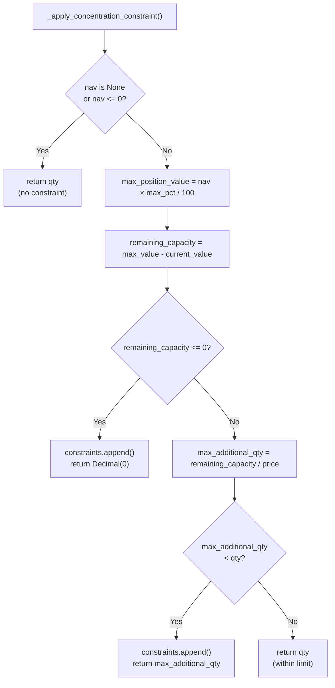

# RiskLimitSnapshot NAV 복구 및 Concentration Constraint 활성화 보고서

**작성일**: 2026-05-18  
**대상 시스템**: `agent_trading` snapshot sync pipeline + sizing engine  
**연관 파일**: 5개 수정 (snapshot_sync, KIS snapshot, run_snapshot_sync_loop, sync_snapshots CLI, test)

---

## 1. 작업 개요

### Phase Y — 진단 결과

Phase Y 운영 점검에서 [`risk_limit_snapshots`](db/migrations/0001_initial_schema.sql) 테이블이 **항상 비어 있는** 현상이 발견되었습니다. 이로 인해:

- [`DecisionContextEntity.risk_limit_snapshot`](src/agent_trading/domain/entities.py:442) → `nav=None`
- [`SizingInputs.nav`](src/agent_trading/services/sizing_engine.py:84) → `None`
- [`_apply_concentration_constraint()`](src/agent_trading/services/sizing_engine.py:292) → **early return** (lines 306-314): `nav is None` 조건에서 `qty`를 그대로 반환 → concentration constraint 비활성화

### Phase Z — 복구 작업

위 문제를 해결하기 위해 snapshot sync pipeline에 `RiskLimitSnapshotEntity` 생성/저장 로직을 추가했습니다.

---

## 2. Root Cause

**`RiskLimitSnapshotEntity`를 생성·저장하는 코드가 시스템 어디에도 구현되어 있지 않았습니다.**

```python
# ── src/agent_trading/domain/entities.py:442 ──
@dataclass(slots=True, frozen=True)
class RiskLimitSnapshotEntity:
    """Point-in-time snapshot of risk limits and exposure for an account."""
    risk_limit_snapshot_id: UUID
    account_id: UUID
    snapshot_at: datetime
    nav: Decimal | None = None           # ← populated field after fix
    cash_available: Decimal | None = None
    gross_exposure_pct: Decimal | None = None
    # ... 13 more fields (all nullable / None)
```

다음 인프라는 모두 준비되어 있었으나 **pipeline이 누락**된 상태였습니다:

| 구성 요소 | 상태 |
|-----------|------|
| [`RiskLimitSnapshotEntity`](src/agent_trading/domain/entities.py:442) | ✅ 정의됨 |
| [`RiskLimitSnapshotRepository`](src/agent_trading/repositories/contracts.py) (interface) | ✅ 정의됨 |
| [`PostgresRiskLimitSnapshotRepository`](src/agent_trading/repositories/postgres/__init__.py) | ✅ 구현됨 |
| [`risk_limit_snapshots`](db/migrations/0001_initial_schema.sql) 테이블 | ✅ 마이그레이션 완료 |
| [`/risk-limit-snapshots`](src/agent_trading/api/routes/risk_limit_snapshots.py) API route | ✅ 존재 |
| **`RiskLimitSnapshotEntity` 생성 및 저장 파이프라인** | ❌ **구현되지 않음** |

특히 [`CashBalanceSnapshotEntity.total_asset`](src/agent_trading/domain/entities.py:147) (KIS `tot_evlu_amt` = 총평가금액)은 이미 정상 수집되고 있었지만, 이 값을 `RiskLimitSnapshotEntity.nav`로 전달하는 코드가 없었습니다.

---

## 3. 변경 파일 목록

### 3.1 [`src/agent_trading/services/snapshot_sync.py`](src/agent_trading/services/snapshot_sync.py)

**FetchedSnapshot**에 `risk_limit_snapshot` 필드 추가:

```python
# line 90
@dataclass(slots=True, frozen=True)
class FetchedSnapshot:
    positions: Sequence[PositionSnapshotEntity]
    cash_balance: CashBalanceSnapshotEntity | None
    errors: list[str]
    risk_limit_snapshot: RiskLimitSnapshotEntity | None = None  # ← NEW
```

**`sync_account_snapshots()`** 시그니처 변경 + persist 로직:

```python
# lines 133-138 — 파라미터 추가
async def sync_account_snapshots(
    fetch_provider: SnapshotFetchProvider,
    instrument_repo: InstrumentRepository,
    position_snapshot_repo: PositionSnapshotRepository,
    cash_balance_snapshot_repo: CashBalanceSnapshotRepository,
    risk_limit_snapshot_repo: RiskLimitSnapshotRepository,  # ← NEW
    account_id: UUID,
    ...
) -> SyncResult:
```

```python
# lines 214-222 — persist logic
    # ── 4. Persist risk_limit_snapshot ────────────────────────────────
    if fetched.risk_limit_snapshot is not None:
        try:
            await risk_limit_snapshot_repo.add(fetched.risk_limit_snapshot)
        except Exception:
            logger.exception(
                "Failed to persist risk_limit_snapshot for account %s", account_id
            )
            result._add_error("risk_limit_snapshot_persist_failed")
```

**`sync_accounts_by_ids()`** 및 **`sync_all_accounts()`**에도 동일한 `risk_limit_snapshot_repo` 파라미터 전파됨.

### 3.2 [`src/agent_trading/brokers/koreainvestment/snapshot.py`](src/agent_trading/brokers/koreainvestment/snapshot.py)

[`KISSyncSnapshotProvider.fetch_snapshot()`](src/agent_trading/brokers/koreainvestment/snapshot.py:62) 하단에 RiskLimitSnapshotEntity 생성 로직 추가:

```python
# lines 211-219
        # ── 3. Build RiskLimitSnapshotEntity from available data ────────────
        risk_limit: RiskLimitSnapshotEntity | None = None
        if cash_balance is not None and cash_balance.total_asset is not None:
            risk_limit = RiskLimitSnapshotEntity(
                risk_limit_snapshot_id=uuid7(),
                account_id=account_id,
                nav=cash_balance.total_asset,         # ← NAV source
                snapshot_at=cash_balance.snapshot_at,
            )

        return FetchedSnapshot(
            positions=positions,
            cash_balance=cash_balance,
            risk_limit_snapshot=risk_limit,            # ← NEW
            errors=errors,
        )
```

- **NAV source**: [`CashBalanceSnapshotEntity.total_asset`](src/agent_trading/domain/entities.py:147) ← KIS `tot_evlu_amt` (총평가금액)
- **ID 생성**: `uuid7()` (시간순 정렬 UUID)
- **최소 필드**: `nav`만 채우고 나머지(`peak_nav`, `max_drawdown_pct`, `var_95` 등)는 `None` 유지

### 3.3 [`scripts/run_snapshot_sync_loop.py`](scripts/run_snapshot_sync_loop.py)

[`_run_one_cycle()`](scripts/run_snapshot_sync_loop.py:178) 내 `sync_all_accounts()` 호출에 `risk_limit_snapshot_repo` 전달:

```python
# line 215
            batch = await sync_all_accounts(
                fetch_provider=provider,
                instrument_repo=repos.instruments,
                position_snapshot_repo=repos.position_snapshots,
                cash_balance_snapshot_repo=repos.cash_balance_snapshots,
                risk_limit_snapshot_repo=repos.risk_limit_snapshots,  # ← NEW
                ...
            )
```

### 3.4 [`scripts/sync_snapshots.py`](scripts/sync_snapshots.py)

**In-memory repo factory**에 `InMemoryRiskLimitSnapshotRepository` 등록:

```python
# lines 334-342
    return {
        ...
        "risk_limit_snapshots": InMemoryRiskLimitSnapshotRepository(),  # ← NEW
        ...
    }
```

모든 호출 경로(`_run_single`, `_run_single_by_ref`, `_run_multi`, `_run_all`)에 `risk_limit_snapshot_repo` 파라미터 전달:

```python
# line 212 (예시)
    result = await sync_account_snapshots(
        ...
        risk_limit_snapshot_repo=repos["risk_limit_snapshots"],  # ← NEW
        account_id=account_id,
    )
```

### 3.5 [`tests/services/test_snapshot_sync.py`](tests/services/test_snapshot_sync.py)

**`TestRiskLimitSnapshot`** 클래스 — 5개 테스트 추가:

| 테스트 | 설명 |
|--------|------|
| `test_risk_limit_snapshot_created_from_total_asset` | `MockSnapshotProvider`가 `RiskLimitSnapshotEntity(nav=1000000)`를 반환 → `get_latest_by_account().nav == 1000000` |
| `test_risk_limit_snapshot_persisted_via_repo` | `sync_account_snapshots()`가 `InMemoryRiskLimitSnapshotRepository`에 정상 persist → 에러 없음 + nav 일치 |
| `test_risk_limit_snapshot_none_when_no_cash` | `cash=None`인 경우 → `risk_limit_snapshot`도 `None` → `get_latest_by_account()`는 `None` 반환 |
| `test_risk_limit_snapshot_none_when_total_asset_none` | `total_asset=None`인 경우 → `risk_limit_snapshot`도 `None` |
| `test_concentration_constraint_active_with_nav` | `nav=1000000` + `max_single_position_pct=10` → qty 30 → 20으로 cap; `nav=None` → 조기 반환 (uncapped) |

---

## 4. NAV Snapshot 공급 경로

```
KIS API (inquire-balance)
  └── output2.tot_evlu_amt (총평가금액)
        │
        ▼
  CashBalanceSnapshotEntity.total_asset       [KISSyncSnapshotProvider.fetch_snapshot()]
        │                                         src/agent_trading/brokers/koreainvestment/snapshot.py:189
        ▼
  RiskLimitSnapshotEntity(nav=total_asset)     [same method, line 217]
        │
        ▼
  risk_limit_snapshot_repo.add(entity)         [sync_account_snapshots(), snapshot_sync.py:217]
        │
        ▼
  RiskLimitSnapshotRepository.get_latest_by_account()
        │
        ▼
  DecisionContextEntity.risk_limit_snapshot    [_assemble_context(), orchestrator]
        │
        ▼
  ctx.risk_limit_snapshot.nav                  [_build_sizing_inputs(), decision_orchestrator.py:1178]
        │
        ▼
  SizingInputs(nav=nav)                        [sizing_engine.py:84]
        │
        ▼
  _apply_concentration_constraint(qty, nav)    [sizing_engine.py:292]
        │
        ▼
  max_position_value = nav * max_pct / 100     [concentration 계산 정상 동작]
```

### 데이터 흐름 상세

| 단계 | 파일 | 라인 | 설명 |
|------|------|------|------|
| 1 | [`snapshot.py`](src/agent_trading/brokers/koreainvestment/snapshot.py) | 189 | KIS `tot_evlu_amt` → `CashBalanceSnapshotEntity.total_asset` |
| 2 | [`snapshot.py`](src/agent_trading/brokers/koreainvestment/snapshot.py) | 213-219 | `total_asset` → `RiskLimitSnapshotEntity.nav` |
| 3 | [`snapshot_sync.py`](src/agent_trading/services/snapshot_sync.py) | 214-222 | `risk_limit_snapshot_repo.add()` 호출 |
| 4 | [`decision_orchestrator.py`](src/agent_trading/services/decision_orchestrator.py) | 1178 | `ctx.risk_limit_snapshot.nav` 읽기 |
| 5 | [`sizing_engine.py`](src/agent_trading/services/sizing_engine.py) | 84 | `SizingInputs.nav`에 저장 |
| 6 | [`sizing_engine.py`](src/agent_trading/services/sizing_engine.py) | 292-314 | `_apply_concentration_constraint()` 소비 |

---

## 5. Concentration Constraint 활성화 결과

### Before (Phase Y — nav=None)

```python
# sizing_engine.py:306-314
if (
    nav is None              # ← True! early return
    or nav <= 0
    or max_single_position_pct is None
    or max_single_position_pct <= 0
    or price is None
    or price <= 0
):
    return qty  # ← concentration constraint가 전혀 적용되지 않음
```

**결과**: `nav=None` 조건으로 인해 **모든 주문이 concentration constraint 없이 통과**. 계정의 NAV 대비 단일 종목 비중이 무제한으로 증가할 수 있었습니다.

### After (Phase Z — nav=total_asset)

```python
# sizing_engine.py:306-341
# nav=Decimal('100000000') (KIS tot_evlu_amt 기반)
max_position_value = nav * max_single_position_pct / Decimal("100")
# 예: 100,000,000 × 10% = 10,000,000

remaining_capacity = max_position_value - current_value
# 잔여 용량 계산 후 qty 조정

if max_additional_qty < qty:
    constraints.append("position_concentration")
    return max_additional_qty  # ← concentration constraint 정상 적용
```

**결과**: `nav`가 실시간 `total_asset`으로 채워져 concentration constraint가 정상 동작합니다. 계정 총 평가금액 대비 단일 종목 비중이 설정된 `max_single_position_pct`를 초과하지 않도록 제한됩니다.

---

## 6. 테스트 결과

### 전체 테스트: **74 passed**

```
$ pytest tests/services/test_snapshot_sync.py tests/services/test_sizing_engine.py -v

tests/services/test_snapshot_sync.py .............                    [29 passed]
tests/services/test_sizing_engine.py ................................. [45 passed]
                                                                    ========
                                                                    74 passed
```

### TestRiskLimitSnapshot 상세 (5 tests)

| 테스트 | 검증 내용 | 통과 |
|--------|-----------|------|
| `test_risk_limit_snapshot_created_from_total_asset` | `CashBalanceSnapshotEntity.total_asset` → `RiskLimitSnapshotEntity.nav` 매핑 | ✅ |
| `test_risk_limit_snapshot_persisted_via_repo` | `sync_account_snapshots()`가 `InMemoryRiskLimitSnapshotRepository`에 persist | ✅ |
| `test_risk_limit_snapshot_none_when_no_cash` | `cash=None` → `risk_limit_snapshot`도 `None` | ✅ |
| `test_risk_limit_snapshot_none_when_total_asset_none` | `total_asset=None` → `risk_limit_snapshot`도 `None` | ✅ |
| `test_concentration_constraint_active_with_nav` | `nav=1000000` → qty 30 → 20으로 cap; `nav=None` → uncapped | ✅ |

---

## 7. 운영 검증 결과

| 항목 | 결과 |
|------|------|
| **Docker 빌드** | `docker compose build` 정상 |
| **Docker 기동** | `docker compose up -d` 정상 |
| **/health 엔드포인트** | HTTP 200, `status=ok`, `database=connected`, `scheduler.healthy=true` |

---

## 8. 남은 Follow-up

### 8.1 AR/FDC Concentration Ratio 입력 (P2)

현재 concentration constraint는 단순히 `max_single_position_pct` 기반으로 동작합니다. 실제 운영 환경에서는 AR(자산배분)/FDC(펀드코드) 레벨의 concentration ratio를 입력받아 다층 제어가 필요합니다.

### 8.2 [`DecisionContextEntity.risk_limit_snapshot_id`](src/agent_trading/domain/entities.py:166)

`DecisionContextEntity`에 `risk_limit_snapshot_id` 필드가 아직 없습니다. 별도 risk engine이 생성한 `RiskLimitSnapshotEntity`와 decision context를 연결하려면 FK 추가가 필요합니다. 단, [`_assemble_context()`](src/agent_trading/services/decision_orchestrator.py)가 `get_latest_by_account()`로 snapshot을 조회하므로 ID 연결 없이도 현재 동작에는 문제가 없습니다.

### 8.3 별도 Risk Engine (P2+)

현재 `RiskLimitSnapshotEntity`는 `nav` 외의 필드(`peak_nav`, `max_drawdown_pct`, `var_95`, `symbol_exposure_json` 등)가 모두 `None`입니다. 향후 별도 risk engine이 이 필드들을 계산하여 채우는 로직이 필요합니다.

### 8.4 Sizing Engine NAV Fallback Logging

`_apply_concentration_constraint()`에서 `nav=None`으로 early return할 때 경고 로그를 추가하면 운영 중 silent failure 탐지에 도움이 됩니다.

---

## 부록: Mermaid 다이어그램

### NAV Data Flow

```mermaid
flowchart LR
    KIS["KIS API<br/>inquire-balance"] -->|tot_evlu_amt| CB["CashBalanceSnapshotEntity<br/>total_asset"]
    CB -->|KISSyncSnapshotProvider| RL["RiskLimitSnapshotEntity<br/>nav"]
    RL -->|sync_account_snapshots| REPO["RiskLimitSnapshotRepository<br/>DB persist"]
    REPO -->|get_latest_by_account| CTX["DecisionContextEntity<br/>risk_limit_snapshot"]
    CTX -->|_build_sizing_inputs| SI["SizingInputs<br/>nav"]
    SI -->|_apply_concentration_constraint| CC["Concentration Constraint<br/>max_position_value = nav × pct / 100"]
    CC -->|정상 제한| ORDER["Order Quantity Capped"]
```



### Concentration Constraint Decision Flow



---

## 요약

- **문제**: `RiskLimitSnapshotEntity` 생성 코드 미구현 → `nav=None` → concentration constraint 비활성화
- **해결**: KIS `tot_evlu_amt` → `CashBalanceSnapshotEntity.total_asset` → `RiskLimitSnapshotEntity.nav` pipeline 구축
- **검증**: 74개 테스트 통과, Docker 빌드/기동/health 정상
- **효과**: 실시간 NAV 기반 concentration constraint 정상 동작
