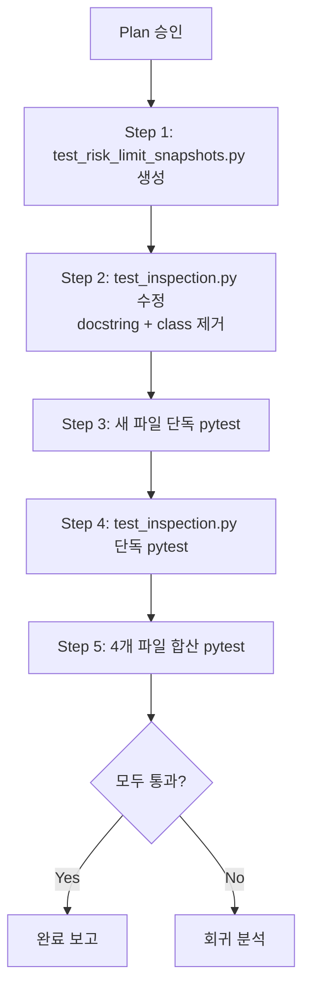

# test_inspection.py → TestRiskLimitSnapshots 분리 계획

> **구현 전 고정사항 (사용자 승인 반영)**
> 1. **새 파일 경로**: `tests/api/test_risk_limit_snapshots.py` (고정)
> 2. **Helper 형태**: `_get_account_id` → class method 유지 (module-level 변경 없음)
> 3. **Docstring 수정 범위**: `/risk-limit-snapshots`만 제거 (최소 범위)
> 4. **합산 테스트 집계 범위**: 5개 파일 기준
>    - `test_risk_limit_snapshots.py` (4)
>    - `test_agent_runs.py` (8)
>    - `test_inspection.py` (41)
>    - `test_performance_metrics.py` (3)
>    - `test_performance_benchmark_history.py` (12)
>    - **합계 = 68**

## 1. 3개 후보 분석

### `TestBrokerOrders` (3 tests, lines 398-425)
| 항목 | 내용 |
|------|------|
| Endpoint | `GET /orders/{id}/broker-orders` |
| Local helper | 없음 |
| Fixture | `client` only |
| Cross-domain dep | orders → order_id (낮음) |
| Split effect | **작음** (3 tests) |
| 평가 | 분리 효과가 가장 작아 우선순위 낮음 |

### `TestGuardrailEvaluations` (4 tests, lines 427-487)
| 항목 | 내용 |
|------|------|
| Endpoint | `GET /guardrail-evaluations`, `GET /guardrail-evaluations/{id}` |
| Local helper | 없음 |
| Fixture | `client` only |
| Cross-domain dep | **agent-runs → decision_context_id** (중간) — `/agent-runs` API에 의존 |
| Split effect | 중간 (4 tests) |
| 평가 | agent-runs 데이터 의존성이 있어, 향후 agent-runs 테스트 파일 구조 변경 시 fragile해질 가능성 |

### `TestRiskLimitSnapshots` (4 tests, lines 490-549) ← **선정**
| 항목 | 내용 |
|------|------|
| Endpoint | `GET /risk-limit-snapshots`, `GET /risk-limit-snapshots/latest` |
| Local helper | `_get_account_id(self, client)` — class method로 클라이언트/계좌 발견 |
| Fixture | `client` only |
| Cross-domain dep | clients/accounts → account_id (낮음, read-only discovery) |
| Split effect | 중간 (4 tests) |
| 평가 | **4 tests + 명확한 도메인 경계 + helper 간단 이전 가능** |

### 선택: `TestRiskLimitSnapshots`

**이유**:
1. **4 tests** — TestBrokerOrders(3)보다 분리 효과 큼
2. **TestGuardrailEvaluations은 agent-runs 데이터 의존** — `/agent-runs` API를 직접 호출해 decision_context_id를 조회. 이 의존성이 다른 파일로 분리된 테스트에 남아있으면 향후 유지보수 부담. TestRiskLimitSnapshots는 `_get_account_id` helper가 `/clients`와 `/accounts`만 사용하므로 의존성이 더 낮고 안정적.
3. **도메인 경계 명확** — risk-limit-snapshots는 kill-switch / risk limit과 관련된 독립적 개념
4. **기존 분리 파일 패턴과 동일** — `client` fixture 하나만 필요

---

## 2. Pre-implementation Decisions

### 2.1 선정 클래스
`TestRiskLimitSnapshots` (4 tests)

### 2.2 Local helper 처리
`_get_account_id(self, client)`를 새 파일 내 class method로 **그대로 유지**.
- 외부 모듈/파일 변경 없음
- helper 호출 경로는 `self._get_account_id(client)`로 동일

### 2.3 test_inspection.py docstring 수정 여부
**필요**. 현재 docstring (line 8)에 `/risk-limit-snapshots`가 명시되어 있음.
```
Covers: ... ``GET /risk-limit-snapshots``.
```
→ 분리 후 이 파일에서 더 이상 커버하지 않으므로 제거 필요.

### 2.4 Fixture import 스타일
기존 분리 파일과 동일:
```python
from tests.api.conftest import client  # noqa: F401
```

---

## 3. 새 파일: [`tests/api/test_risk_limit_snapshots.py`](../tests/api/test_risk_limit_snapshots.py)

### 3.1 Import
```python
from __future__ import annotations

from fastapi.testclient import TestClient

from tests.api.conftest import client  # noqa: F401
```

### 3.2 TestRiskLimitSnapshots (4 tests)

```python
class TestRiskLimitSnapshots:
    """Risk limit snapshot inspection endpoints."""

    def _get_account_id(self, client: TestClient) -> str:
        """Helper: get the seeded account_id via /clients then /accounts."""
        clients_resp = client.get("/clients")
        clients = clients_resp.json()
        assert len(clients) >= 1
        cid = clients[0]["client_id"]

        acct_resp = client.get(f"/accounts?client_id={cid}")
        accounts = acct_resp.json()
        assert len(accounts) >= 1
        return accounts[0]["account_id"]

    def test_list_risk_limit_snapshots(
        self, client: TestClient,
    ) -> None:
        """``GET /risk-limit-snapshots?account_id=...`` returns snapshots."""
        acct_id = self._get_account_id(client)

        response = client.get(
            f"/risk-limit-snapshots?account_id={acct_id}"
        )
        assert response.status_code == 200
        data = response.json()
        assert len(data) >= 1
        assert data[0]["nav"] is not None
        assert data[0]["kill_switch_active"] is False

    def test_list_risk_limit_snapshots_requires_account(
        self, client: TestClient,
    ) -> None:
        """``GET /risk-limit-snapshots`` returns 422 without account_id."""
        response = client.get("/risk-limit-snapshots")
        assert response.status_code == 422

    def test_get_latest_risk_limit_snapshot(
        self, client: TestClient,
    ) -> None:
        """``GET /risk-limit-snapshots/latest?account_id=...`` returns latest."""
        acct_id = self._get_account_id(client)

        response = client.get(
            f"/risk-limit-snapshots/latest?account_id={acct_id}"
        )
        assert response.status_code == 200
        data = response.json()
        assert data["account_id"] == acct_id
        assert data["nav"] is not None

    def test_get_latest_risk_limit_snapshot_not_found(
        self, client: TestClient,
    ) -> None:
        """``GET /risk-limit-snapshots/latest`` returns 404 for unknown account."""
        response = client.get(
            "/risk-limit-snapshots/latest"
            "?account_id=00000000-0000-0000-0000-000000000000"
        )
        assert response.status_code == 404
```

**모든 assertion은 원본과 완전 동일** (line 490-549).

---

## 4. [`test_inspection.py`](../tests/api/test_inspection.py) 변경 사항

### 4.1 Docstring 수정 (line 8)
**Before:**
```python
"""Inspection API endpoint tests.

Covers: ``GET /orders``, ``GET /orders/{id}``, ``GET /orders/{id}/events``,
``GET /audit-logs``, ``GET /reconciliation/runs``, ``GET /reconciliation/locks``,
``GET /accounts``, ``GET /accounts/{id}``, ``GET /instruments/{id}``,
``GET /positions``, ``GET /cash-balances``, ``GET /clients/{id}``,
``GET /orders/{id}/broker-orders``,
``GET /guardrail-evaluations``, ``GET /risk-limit-snapshots``.
"""
```

**After:**
```python
"""Inspection API endpoint tests.

Covers: ``GET /orders``, ``GET /orders/{id}``, ``GET /orders/{id}/events``,
``GET /audit-logs``, ``GET /reconciliation/runs``, ``GET /reconciliation/locks``,
``GET /accounts``, ``GET /accounts/{id}``, ``GET /instruments/{id}``,
``GET /positions``, ``GET /cash-balances``, ``GET /clients/{id}``,
``GET /orders/{id}/broker-orders``,
``GET /guardrail-evaluations``.
"""
```

### 4.2 `TestRiskLimitSnapshots` 클래스 제거
Lines 490-549 (59 lines) 완전 제거.

---

## 5. 실행 단계



### Step 1: 새 파일 생성
- [`tests/api/test_risk_limit_snapshots.py`](../tests/api/test_risk_limit_snapshots.py) 작성
- Docstring: 4 tests
- Import: `TestClient`, `client` fixture
- `TestRiskLimitSnapshots` class: `_get_account_id` helper + 4 tests

### Step 2: test_inspection.py 수정
- Docstring: `/risk-limit-snapshots` 제거
- `TestRiskLimitSnapshots` class (lines 490-549) 제거

### Step 3: 새 파일 단독 테스트
```bash
python3 -m pytest tests/api/test_risk_limit_snapshots.py -q
```
Expected: **4 passed**

### Step 4: test_inspection.py 단독 테스트
```bash
python3 -m pytest tests/api/test_inspection.py -q
```
Expected: **41 passed** (45 - 4)

### Step 5: 4개 파일 합산 테스트
```bash
python3 -m pytest tests/api/test_risk_limit_snapshots.py tests/api/test_agent_runs.py tests/api/test_inspection.py tests/api/test_performance_metrics.py tests/api/test_performance_benchmark_history.py -q
```
Expected: **68 passed** (4 + 8 + 41 + 3 + 12)

---

## 6. 이번 분리 범위 기준 전체 테스트 분포

| 파일 | 테스트 수 |
|------|----------|
| `test_risk_limit_snapshots.py` | **4** (신규) |
| `test_agent_runs.py` | 8 |
| `test_inspection.py` | **41** (45→41) |
| `test_performance_metrics.py` | 3 |
| `test_performance_benchmark_history.py` | 12 |
| **합계** | **68** |

---

## 7. 제약 조건 점검

| 조건 | 상태 |
|------|------|
| assertion 변경 금지 | ✅ 모든 assertion 동일 |
| endpoint 구현 변경 금지 | ✅ 해당 없음 |
| schema 변경 금지 | ✅ 해당 없음 |
| service 변경 금지 | ✅ 해당 없음 |
| DB migration 금지 | ✅ 해당 없음 |
| 과도한 리팩터링 금지 | ✅ file split only |
| fixture import 스타일 일관성 | ✅ 기존 패턴과 동일 |
| helper 호출 경로 유지 | ✅ `self._get_account_id(client)` 그대로 |
| docstring 수정 최소화 | ✅ 해당 endpoint만 제거 |
