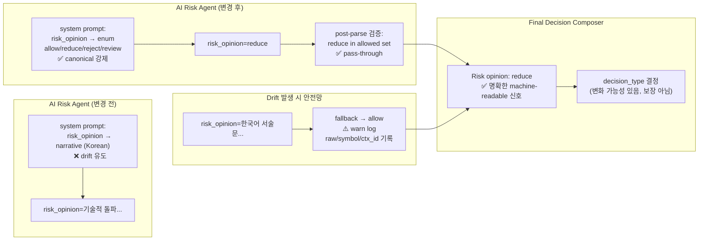

# `risk_opinion` Machine-Readable Contract 정렬 — 설계 문서

## 1. 문제 정의

[`AIRiskAgent._build_system_prompt()`](src/agent_trading/services/ai_agents/ai_risk.py:212)에서 `risk_opinion`을 **"narrative field"**로 분류해 **한국어 서술문**을 요구하고 있음.

### 증거: Dry-run 로그 (2026-05-11)

```
AIRiskAgent succeeded: symbol=005930
risk_opinion=기술적 돌파 신호가 있으나 신뢰도가 낮고 시장 데이터 기반이 아니므로 위험을 높게 평가합니다.
risk_score=0.70
```

### 설계 문서와의 불일치

[`08_ai_decision_policy.md:338-342`](plan_docs/detailed_design/08_ai_decision_policy.md:338) 명세:

| 값 | 의미 | 필드 성격 |
|----|------|-----------|
| `allow` | 진입 허용, 조정 불필요 | **machine-readable enum** |
| `reduce` | 진입 가능하나 사이징/가격 보수적 조정 필요 | **machine-readable enum** |
| `reject` | 진입 차단 | **machine-readable enum** |
| `review` | 운영자 검토 필요 | **machine-readable enum** |

그러나 현재 prompt는:
```python
# ai_risk.py:224-226 — 현재 (잘못됨)
"Language requirement: All human-readable narrative fields "
"(risk_opinion, summary, opposing_evidence) MUST be written in Korean."
```

`risk_opinion`이 `summary`, `opposing_evidence`와 함께 "narrative field"로 분류되어 있음.

### 영향 체인

```
AIRiskAgent prompt 오류
  → AI가 risk_opinion을 한국어 서술문으로 출력 (drift)
    → FDC user prompt에 "Risk opinion: 기술적 돌파 신호가 있으나..." 가 포함됨
      → FDC가 명확한 risk 신호를 받지 못함
        → FDC의 decision quality에 영향을 줄 가능성 있음
```

---

## 2. 필드 분류 재정의 (Machine-readable vs Narrative)

[`AIRiskOutput`](src/agent_trading/services/ai_agents/schemas.py:321) 필드 중:

### Machine-readable (canonical enum / English code)

| 필드 | 허용값 | 현재 상태 |
|------|--------|-----------|
| `risk_opinion` | `allow`, `reduce`, `reject`, `review` | ❌ 한국어 서술문 drift |
| `proposed_side` | `BUY`, `SELL` | ✅ (prompt에서 English 유지) |
| `risk_flags` | machine-readable English codes | ✅ |
| `reason_codes` | machine-readable English codes | ✅ |
| `max_holding_horizon` | `short`, `swing`, `long` | ✅ |
| `size_adjustment_factor` | float 0.0-1.0 | ✅ |

### Narrative (Korean)

| 필드 | 용도 |
|------|------|
| `summary` | 리스크 평가 요약 (한국어 서술) |
| `opposing_evidence` | 반대 증거 (한국어 서술) |

**핵심 문제**: `risk_opinion`이 `summary`, `opposing_evidence`와 같은 narrative 필드로 잘못 분류됨.

---

## 3. 권장 접근법: A안 + B안 조합

### A안 (Prompt 강화) — 예방적

**대상**: [`AIRiskAgent._build_system_prompt()`](src/agent_trading/services/ai_agents/ai_risk.py:212)

**변경**: `risk_opinion`을 narrative 필드 목록에서 제거하고, 필드 단위로 machine-readable vs narrative를 명확히 분리.

```python
def _build_system_prompt(self) -> str:
    schema_json = json.dumps(
        generate_json_schema(AIRiskOutput), indent=2
    )
    return (
        "You are an AI Risk Agent for a trading system. "
        "Assess the risk of the proposed trade based on the current "
        "trading context. Consider market conditions, recent events, "
        "and any available scoring information.\n\n"
        "Output must be valid JSON matching this schema:\n"
        f"{schema_json}\n\n"
        "IMPORTANT — Machine-readable fields (English enum values):\n"
        "- risk_opinion: one of allow, reduce, reject, review\n"
        "- proposed_side: BUY or SELL\n"
        "- max_holding_horizon: short, swing, long\n"
        "- risk_flags: machine-readable English codes\n"
        "- reason_codes: machine-readable English codes\n\n"
        "Narrative fields (Korean only):\n"
        "- summary: Korean narrative summary\n"
        "- opposing_evidence: Korean narrative list\n\n"
        "Machine-readable fields MUST contain ONLY canonical English values. "
        "Narrative fields MUST be written in Korean."
    )
```

**변경 전/후 비교**:

| 항목 | 변경 전 | 변경 후 |
|------|---------|---------|
| `risk_opinion` 분류 | ❌ narrative (Korean)로 오분류 | ✅ machine-readable enum으로 재분류 |
| 허용값 명시 | ❌ 없음 | ✅ `allow, reduce, reject, review` |
| `summary` 분류 | ✅ narrative (Korean) | ✅ 유지 |
| `opposing_evidence` 분류 | ✅ narrative (Korean) | ✅ 유지 |
| 필드 구분 | ❌ 모호한 그룹핑 | ✅ machine-readable / narrative 명확히 분리 |

---

### B안 (Post-parse Normalization) — 최소 안전망

**대상**: [`AIRiskAgent.run()`](src/agent_trading/services/ai_agents/ai_risk.py:129)

**변경**: LLM 응답 수신 후 `risk_opinion`이 canonical 4값 중 하나인지 검증. canonical이 아니면 `"allow"`로 fallback + 경고 로그.

**중요 원칙**: canonical 4값(`allow`, `reduce`, `reject`, `review`) 외의 모든 drift 값은 **의미 해석 없이** `"allow"`로만 fallback. 한국어 서술문을 억지로 `reduce`/`reject`로 분류하지 않음.

```python
# _ALLOWED_RISK_OPINIONS (module-level constant)
_ALLOWED_RISK_OPINIONS = frozenset({"allow", "reduce", "reject", "review"})

# In run(), after line ~173 where result is constructed:
# --- risk_opinion canonical validation ---
risk_opinion_raw = result.risk_opinion.strip().lower()
if risk_opinion_raw not in _ALLOWED_RISK_OPINIONS:
    logger.warning(
        "risk_opinion drift detected — falling back to 'allow'. "
        "raw=%r symbol=%s decision_context_id=%s",
        result.risk_opinion,
        result.symbol,
        result.decision_context_id,
    )
    result = AIRiskOutput(
        schema_version=result.schema_version,
        agent_name=result.agent_name,
        decision_context_id=result.decision_context_id,
        symbol=result.symbol,
        proposed_side=result.proposed_side,
        risk_opinion="allow",  # ← 최소 fallback, 의미 해석 없음
        risk_score=result.risk_score,
        confidence=result.confidence,
        size_adjustment_factor=result.size_adjustment_factor,
        max_holding_horizon=result.max_holding_horizon,
        risk_flags=result.risk_flags,
        reason_codes=result.reason_codes,
        opposing_evidence=result.opposing_evidence,
        summary=result.summary,
    )
```

#### `allow` fallback 선택 근거

| 근거 | 설명 |
|------|------|
| **기존 기본값과 일관성** | `AIRiskOutput()` 기본 생성자의 `risk_opinion` 기본값이 `"allow"`. Stub agent도 `"allow"` 반환. |
| **safe-order-path semantics** | 현재 시스템에서 `review`는 운영자 검토 필요를 의미하며, 이는 pipeline 지연/차단을 초래. drift가 단순 출력 오류일 가능성이 높은 상황에서 `review`는 과도한 차단. |
| **downstream autonomy** | FDC가 최종 판단을 내리는 구조. `allow`는 FDC가 자체적으로 결정을 내릴 수 있는 여지를 줌. `review`로 fallback하면 FDC가 아닌 운영자 검토에 의존. |
| **최소 파괴 원칙** | drift가 발생해도 pipeline이 중단되지 않고 정상 진행되어야 함. `allow`가 이 원칙에 가장 부합. |

---

## 4. 정규화 상세 규칙

### 4.1 대소문자 처리

모든 입력값에 `strip().lower()` 적용 후 canonical set과 비교:

| AI 출력 | `strip().lower()` 결과 | canonical? | 최종 결과 |
|---------|------------------------|------------|-----------|
| `"allow"` | `"allow"` | ✅ | `"allow"` |
| `"ALLOW"` | `"allow"` | ✅ | `"allow"` |
| `"Allow"` | `"allow"` | ✅ | `"allow"` |
| `"  ALLOW  "` | `"allow"` | ✅ | `"allow"` |
| `"REDUCE"` | `"reduce"` | ✅ | `"reduce"` |
| `"REJECT"` | `"reject"` | ✅ | `"reject"` |
| `"REVIEW"` | `"review"` | ✅ | `"review"` |

### 4.2 Drift 처리 원칙 (매우 중요)

**의미 해석 절대 금지**. canonical 4값 외의 모든 drift는 무조건 `"allow"`로 fallback:

| AI 출력 | strip().lower() | 처리 방식 | 최종 결과 |
|---------|-----------------|-----------|-----------|
| `"기술적 돌파 신호가..."` | 그대로 | ❌ 의미 해석 금지 → `allow` fallback | `"allow"` |
| `"high_risk"` | `"high_risk"` | ❌ canonical 아님 → `allow` fallback | `"allow"` |
| `"uncertain"` | `"uncertain"` | ❌ canonical 아님 → `allow` fallback | `"allow"` |
| `""` (빈 문자열) | `""` | ❌ canonical 아님 → `allow` fallback | `"allow"` |

### 4.3 Drift Warning Log 형식

```python
logger.warning(
    "risk_opinion drift detected — falling back to 'allow'. "
    "raw=%r symbol=%s decision_context_id=%s",
    result.risk_opinion,       # 원본 값 (한국어 서술문 등)
    result.symbol,             # 종목 코드
    result.decision_context_id, # 결정 컨텍스트 ID
)
```

출력 예:
```
WARNING risk_opinion drift detected — falling back to 'allow'.
raw='기술적 돌파 신호가 있으나...' symbol='005930' decision_context_id='2c1a0527-...'
```

---

## 5. `decision_type` 현황 재확인 (이번 턴 변경 불필요)

[`FinalDecisionComposerAgent._build_system_prompt()`](src/agent_trading/services/ai_agents/final_decision_composer.py:216)는 이전 task에서 이미 수정 완료:
- `decision_type`: `APPROVE, REJECT, HOLD, WATCH, EXIT, REDUCE`
- `side`: `BUY or SELL`
- `entry_style`: `LIMIT, MARKET, VWAP, TWAP`
- `time_horizon`: `short, swing, long`

[`_normalize_decision_type()`](src/agent_trading/services/decision_orchestrator.py:1655)도 추가 완료.

**이번 작업에서 `final_decision_composer.py`는 직접 수정하지 않음.** dry-run에서 `risk_opinion` 수정 후 FDC 입력/결과 변화는 관찰 대상.

---

## 6. 변경 파일 목록

### 6.1 [`src/agent_trading/services/ai_agents/ai_risk.py`](src/agent_trading/services/ai_agents/ai_risk.py)

**A안**: `_build_system_prompt()` (lines 217-228)
- `risk_opinion`을 narrative 필드 목록에서 제거
- 필드 단위로 machine-readable vs narrative 명확히 분리
- 허용 canonical 값 명시: `allow`, `reduce`, `reject`, `review`

**B안**: `run()` (line 173 근처) — post-parse canonical validation
- `_ALLOWED_RISK_OPINIONS` module-level 상수 추가
- `strip().lower()` 후 canonical set 비교
- drift 감지 시 `"allow"`로 fallback + 경고 로그 (raw 값, symbol, decision_context_id 포함)

### 6.2 [`tests/services/ai_agents/test_agents.py`](tests/services/ai_agents/test_agents.py)

`TestAIRiskAgent` 클래스 내 신규 테스트:

| 테스트 | 검증 내용 |
|--------|-----------|
| `test_risk_opinion_drift_detected` | 한국어 서술문 입력 → `"allow"` fallback + warning 로그 |
| `test_risk_opinion_canonical_allow` | `risk_opinion="allow"` → pass-through |
| `test_risk_opinion_canonical_reduce` | `risk_opinion="reduce"` → pass-through |
| `test_risk_opinion_canonical_reject` | `risk_opinion="reject"` → pass-through |
| `test_risk_opinion_canonical_review` | `risk_opinion="review"` → pass-through |
| `test_risk_opinion_uppercase_normalized` | `"ALLOW"` → `"allow"` (strip+lower 후 canonical) |
| `test_risk_opinion_empty_fallback` | `risk_opinion=""` → `"allow"` fallback |
| `test_risk_opinion_system_prompt_contains_allowed_values` | system prompt에 `allow`, `reduce`, `reject`, `review` 포함 확인 |

### 6.3 변경 제외 대상 (명시적 비변경)

- [`DecisionType`](src/agent_trading/domain/enums.py:106) enum — 확장 금지
- [`actionable_types`](src/agent_trading/services/decision_orchestrator.py:1738) 집합 — 변경 금지
- [`build_submit_order_request_from_decision()`](src/agent_trading/services/decision_orchestrator.py:1755) — 변경 금지
- [`decision_orchestrator.py`](src/agent_trading/services/decision_orchestrator.py) — 이번 작업에서 변경 불필요
- [`final_decision_composer.py`](src/agent_trading/services/ai_agents/final_decision_composer.py) — 이번 작업에서 변경 불필요
- [`schemas.py`](src/agent_trading/services/ai_agents/schemas.py) — dataclass 그대로 유지 (post-parse는 ai_risk.py에서 처리)
- `broker submit semantics` — 변경 금지
- `hard guardrail / reconciliation` 경계 — 변경 금지
- `admin UI` — 변경 금지

---

## 7. Migration 필요 여부

**불필요.** 이유:
- 변경은 Python logic에만 국한됨 (DB schema, migration script, data format 변경 없음)
- agent run record는 raw 값을 기록하므로 drift 값도 보존됨 (감사 목적)
- normalization은 runtime downstream consumer만 보호

---

## 8. 검증 계획

### 8.1 단위 테스트

```bash
# 신규 risk_opinion 정규화 테스트
pytest tests/services/ai_agents/test_agents.py -k "test_risk_opinion" -v --no-header

# 기존 회귀 테스트 (전체)
pytest tests/services/ai_agents/test_agents.py -v --no-header
```

### 8.2 Dry-run 성공 기준

| # | 기준 | 검증 방법 |
|---|------|-----------|
| 1 | `risk_opinion`이 canonical 값 중 하나 | dry-run 로그에서 `risk_opinion=allow|reduce|reject|review` 확인 |
| 2 | 한국어 서술문이 `risk_opinion`에 더 이상 나타나지 않음 | 로그에 `risk_opinion drift detected` 미출력 확인 |
| 3 | `decision_type`이 canonical 값 유지 | dry-run 로그에서 `composer=APPROVE|HOLD|...` 확인 |
| 4 | FDC 입력의 `risk_opinion` 값이 canonical | FDC user prompt에 "Risk opinion: allow|reduce|reject|review" 표시 |
| 5 | narrative 필드(`summary`, `opposing_evidence`)는 한국어 유지 | 필요시 로그 확인 |

```bash
cd /workspace/agent_trading && . /tmp/env_export.sh && python3 scripts/run_orchestrator_once.py --dry-run
```

---

## 9. Mermaid: 변경 후 데이터 흐름



---

## 10. Drift 처리 규칙 요약

### `risk_opinion`

| AI 출력 | `strip().lower()` | canonical? | 최종 결과 | 로그 |
|---------|-------------------|------------|-----------|------|
| `"allow"` | `"allow"` | ✅ | `"allow"` | 없음 |
| `"ALLOW"` | `"allow"` | ✅ | `"allow"` | 없음 |
| `"reduce"` | `"reduce"` | ✅ | `"reduce"` | 없음 |
| `"REDUCE"` | `"reduce"` | ✅ | `"reduce"` | 없음 |
| `"reject"` | `"reject"` | ✅ | `"reject"` | 없음 |
| `"review"` | `"review"` | ✅ | `"review"` | 없음 |
| 한국어 서술문 | (그대로) | ❌ | `"allow"` | ⚠️ drift detected |
| `"high_risk"` | `"high_risk"` | ❌ | `"allow"` | ⚠️ drift detected |
| `""` | `""` | ❌ | `"allow"` | ⚠️ drift detected |
| 그 외 모든 unknown | (whatever) | ❌ | `"allow"` | ⚠️ drift detected |

### `decision_type` (기존 유지, 이번 작업 변경 없음)

| AI 출력 | 정규화 결과 | 근거 |
|---------|------------|------|
| `APPROVE` / `HOLD` / etc. | **그대로** | canonical pass-through |
| `entry` | `APPROVE` | known drift |
| `no_action` / `no_trade` / `none` | `HOLD` | known drift |
| 그 외 unknown | `HOLD` | safe fallback |

---

## 11. 성공 기준 요약

| # | 기준 | 측정 방법 |
|---|------|-----------|
| 1 | `risk_opinion` canonical 정렬 완료 | dry-run 로그에서 canonical 값 확인 |
| 2 | 한국어 서술문 drift 재발 없음 | `risk_opinion drift detected` 로그 미출력 |
| 3 | 기존 테스트 회귀 없음 | `pytest tests/services/ai_agents/` 통과 |
| 4 | 신규 정규화 테스트 통과 | 8개 신규 테스트 통과 |
| 5 | `decision_type` contract 유지 | dry-run 로그에서 canonical 값 확인 |

---

## 12. 기대 효과 (가능성 — 보장 아님)

- `risk_opinion`이 canonical 값으로 출력되면 FDC가 더 명확한 machine-readable risk 신호를 입력받을 수 있음
- 이는 FDC의 decision quality 향상에 **기여할 가능성**이 있음
- 그러나 `APPROVE` 출력을 **보장하지는 않음** — FDC 판단은 여러 입력(데이터 풍부도, AI 모델, prompt 등)에 종속적
- `risk_opinion` 정렬만으로 broker submit 경로 진입이 해결되지 않을 수 있음
