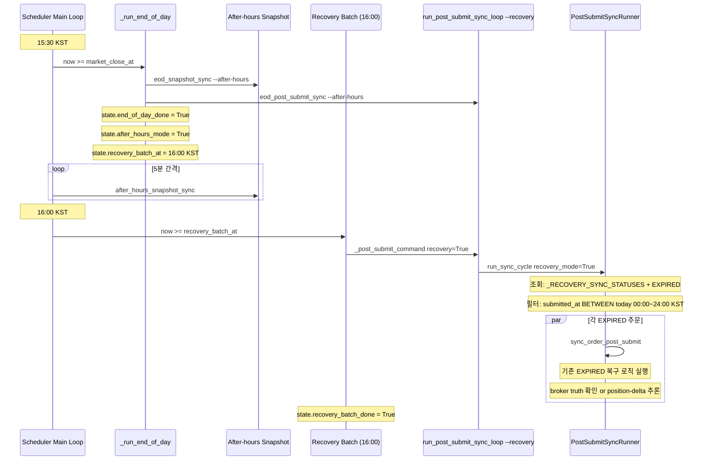
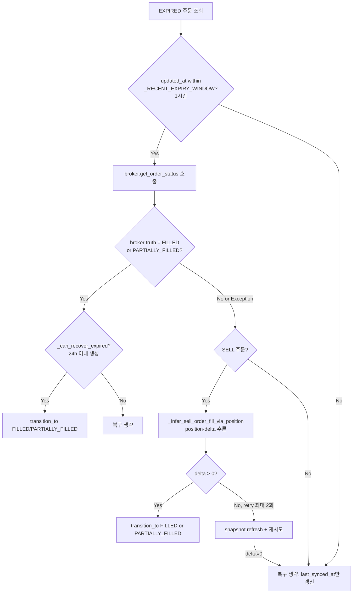
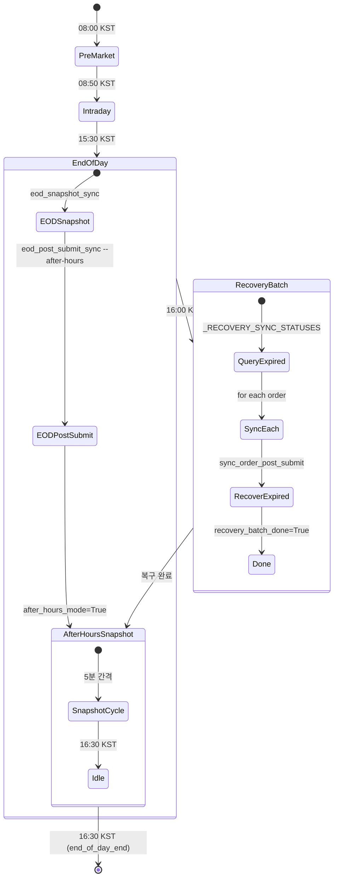
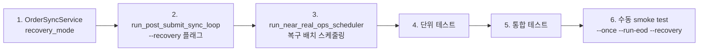

# 16:00 KST After-Hours 복구 배치 설계

> **작성일**: 2026-05-21
> **관련 PR**: After-hours EXPIRED fallback 정책 완성 후속 작업

---

## 1. 배경 및 목표

### 1.1 장중 EXPIRED 전이 금지 정책의 완성

이전 작업에서 장중(08:50~15:30 KST) fallback 기반 EXPIRED 전이를 금지하는 정책을 구현했다. 이는 RECONCILE_REQUIRED 상태의 주문이 장중에 broker 장애/rate limit으로 인해 잘못 EXPIRED 처리되는 것을 방지한다.

그러나 이 정책으로 인해 **장중에 EXPIRED fallback이 억제된 주문이 after-hours(15:30~)에도 그대로 남아있을 가능성**이 있다. 특히:

- [`transition_to_authoritative()`](src/agent_trading/services/order_sync_service.py:748): `resolve_unknown_state()` 실패 시 intraday에는 EXPIRED fallback을 억제하고 RECONCILE_REQUIRED 유지
- [`_sync_reconcile_required_orders()`](src/agent_trading/services/order_sync_service.py:658): 장중 억제된 EXPIRED fallback이 after-hours에서 해소되어야 함
- 이미 EXPIRED된 주문 중 broker truth가 FILLED/PARTIALLY_FILLED인 경우 복구 (기존 `sync_order_post_submit()` 내 EXPIRED 복구 로직)

### 1.2 After-hours 복구 배치의 필요성

현재 after-hours(15:30~) 진입 직후 [`_run_end_of_day()`](scripts/run_near_real_ops_scheduler.py:772)가 실행되며:

1. EOD snapshot sync + `--after-hours` post-submit sync 실행
2. 이후 after-hours mode로 전환 → snapshot만 5분 간격으로 계속

**문제점**:
- 15:30 EOD sync cycle에서 처리되지 못한 EXPIRED 주문 (예: broker API 지연, rate limit 도달)
- `_RECENT_EXPIRY_WINDOW_SECONDS`(1시간) 이내에 EXPIRED된 주문 중 broker truth가 실제로는 FILLED인 경우
- RECONCILE_REQUIRED → EXPIRED fallback이 15:30~16:00 사이에 발생한 경우 후행 복구 필요

**목표**: 16:00 KST에 당일 주문 전체를 대상으로 복구 배치를 1회 실행하여:

1. EXPIRED 상태이나 broker truth가 FILLED/PARTIALLY_FILLED인 주문 복구
2. RECONCILE_REQUIRED 상태 해소 재시도
3. SELL position-delta 기반 후행 복구 (이미 broker truth가 확인되지 않은 경우)

---

## 2. 변경 설계

### 2.1 [`PostSubmitSyncRunner.run_sync_cycle()`](src/agent_trading/services/order_sync_service.py:2007) — `recovery_mode` 파라미터 추가

#### 현재 상태

```python
_ACTIVE_SYNC_STATUSES: list[OrderStatus] = [
    OrderStatus.SUBMITTED,
    OrderStatus.ACKNOWLEDGED,
    OrderStatus.PARTIALLY_FILLED,
    OrderStatus.RECONCILE_REQUIRED,
    OrderStatus.PENDING_SUBMIT,
]
```

`run_sync_cycle()`은 현재 [`OrderQuery`](src/agent_trading/repositories/filters.py:20)에 `statuses=_ACTIVE_SYNC_STATUSES`를 전달하여 조회 대상 주문을 결정한다. EXPIRED는 `_ACTIVE_SYNC_STATUSES`에 포함되지 않아 일반 sync cycle에서 제외된다.

EXPIRED 복구는 [`sync_order_post_submit()`](src/agent_trading/services/order_sync_service.py:125) 내부에서 terminal 상태 분기(197~287행)에서 처리된다. 즉, **EXPIRED 주문이 조회 대상에 포함되기만 하면 기존 복구 로직이 자동으로 실행**된다.

#### 변경 설계

```python
# 모듈 레벨 상수에 recovery_mode용 상태 목록 추가
_RECOVERY_SYNC_STATUSES: list[OrderStatus] = [
    OrderStatus.SUBMITTED,
    OrderStatus.ACKNOWLEDGED,
    OrderStatus.PARTIALLY_FILLED,
    OrderStatus.RECONCILE_REQUIRED,
    OrderStatus.PENDING_SUBMIT,
    OrderStatus.EXPIRED,  # ← 복구 대상에 EXPIRED 포함
]
```

`run_sync_cycle()`에 `recovery_mode: bool = False` 파라미터 추가:

```python
async def run_sync_cycle(
    self,
    account_ref: str | None = None,
    *,
    limit: int = _DEFAULT_BATCH_LIMIT,
    tx_manager: TransactionManager | None = None,
    after_hours: bool | None = None,
    recovery_mode: bool = False,  # ← 신규 파라미터
) -> SyncCycleResult:
    # ── 1. Query active orders ────────────────────────────────────────
    active_statuses = _RECOVERY_SYNC_STATUSES if recovery_mode else _ACTIVE_SYNC_STATUSES
    orders = await self.repos.orders.list(
        OrderQuery(
            statuses=active_statuses,
            limit=limit,
            # recovery_mode에서 당일 주문만 필터
            submitted_from=...,  # 아래 2.4절 참조
            submitted_to=...,
        )
    )
```

**설계 결정 근거**:

1. **`_ACTIVE_SYNC_STATUSES` 상수 변경 불가**: 기존 상수는 일반 sync cycle에서 사용됨. 일반 cycle에서 EXPIRED를 조회하면 불필요한 API 호출이 발생하여 rate limit 문제가 생길 수 있음.
2. **새 상수 `_RECOVERY_SYNC_STATUSES` 도입**: 기존 상수와 별도로 유지하여 일반 cycle에 영향 없음.
3. **`recovery_mode=True` 전달 방식**: CLI 플래그 → `run_sync_cycle()` 까지 일관되게 전달.

#### 당일 주문 필터 (복구 범위 제한)

복구 배치가 무관한 과거 EXPIRED 주문까지 복구하는 것을 방지하기 위해 **오늘(00:00~24:00 KST) 생성된 주문만 조회 대상**으로 제한한다.

`OrderQuery`의 `submitted_from`/`submitted_to`를 활용:

```python
# KST 오늘 00:00 ~ 24:00
kst = ZoneInfo("Asia/Seoul")
today_start = datetime.now(kst).replace(hour=0, minute=0, second=0, microsecond=0)
today_end = today_start + timedelta(days=1)

orders = await self.repos.orders.list(
    OrderQuery(
        statuses=active_statuses,
        limit=limit,
        submitted_from=today_start.astimezone(timezone.utc),
        submitted_to=today_end.astimezone(timezone.utc),
    )
)
```

**참고**: `submitted_from`/`submitted_to`는 `submitted_at` 컬럼 기준. EXPIRED 주문의 `submitted_at`이 오늘인 경우만 복구 대상. 이는 의도된 설계 — 오늘 제출된 주문만 복구하고, 과거 EXPIRED 주문은 건드리지 않음.

---

### 2.2 [`run_post_submit_sync_loop.py`](scripts/run_post_submit_sync_loop.py) — `--recovery` CLI 플래그 추가

#### argparse에 `--recovery` 추가

```python
parser.add_argument(
    "--recovery",
    action="store_true",
    help="Recovery mode: include EXPIRED orders and filter to today's orders only",
)
```

#### `_run_one_cycle()`에 `recovery` 파라미터 전달

현재 `_run_one_cycle()`은 `after_hours` 파라미터를 받아 `run_sync_cycle(after_hours=after_hours)`로 전달한다. 동일한 패턴으로 `recovery` 파라미터를 추가:

```python
async def _run_one_cycle(
    settings: AppSettings,
    *,
    account_ref: str | None,
    after_hours: bool = False,
    recovery: bool = False,  # ← 신규
) -> SyncCycleResult:
    ...
    result = await runner.run_sync_cycle(
        account_ref=account_ref,
        tx_manager=tx,
        after_hours=after_hours,
        recovery_mode=recovery,  # ← 전달
    )
```

#### `_run_loop()`에 `recovery` 전달

```python
async def _run_loop(
    *,
    account_ref: str | None,
    interval: int,
    max_cycles: int,
    after_hours: bool = False,
    recovery: bool = False,  # ← 신규
) -> None:
    ...
    result = await _run_one_cycle(
        settings,
        account_ref=account_ref,
        after_hours=after_hours,
        recovery=recovery,  # ← 전달
    )
```

#### main()에서 args → `_run_loop()` 전달

```python
loop.run_until_complete(
    _run_loop(
        account_ref=args.account_ref,
        interval=interval,
        max_cycles=max_cycles,
        after_hours=args.after_hours,
        recovery=args.recovery,  # ← 전달
    )
)
```

**사용 예**:
```bash
# 16:00 KST 복구 배치 (1회 실행)
python scripts/run_post_submit_sync_loop.py --once --recovery

# after-hours + recovery 동시에
python scripts/run_post_submit_sync_loop.py --once --after-hours --recovery
```

---

### 2.3 [`run_near_real_ops_scheduler.py`](scripts/run_near_real_ops_scheduler.py) — 16:00 KST 복구 배치 추가

#### 타이밍 분석

| 시각 (KST) | 현재 동작 | 복구 배치 추가 후 |
|-----------|-----------|------------------|
| 15:30 | `_run_end_of_day()` 실행 | `_run_end_of_day()` 실행 (EOD sync + after-hours 전환) |
| 15:30~16:00 | after-hours snapshot cycle | after-hours snapshot cycle (변화 없음) |
| **16:00** | **nothing** | **복구 배치 1회 실행** |
| 16:00~16:30 | after-hours snapshot cycle | after-hours snapshot cycle (변화 없음) |

`_run_end_of_day()`는 [`market_close_at`](scripts/run_near_real_ops_scheduler.py:1560)(15:30 KST) 조건에 의해 메인 루프에서 호출된다. 복구 배치는 16:00 KST에 실행되어야 하므로, `_run_end_of_day()` **내부에 30분 블로킹 대기를 추가하는 것은 권장되지 않는다** (after-hours snapshot cycle이 차단됨).

#### 권장 설계: 메인 루프 레벨 상태 관리

[`SchedulerState`](scripts/run_near_real_ops_scheduler.py:158)에 새 플래그 추가:

```python
@dataclass(slots=True)
class SchedulerState:
    """Mutable scheduler state for a single operating day."""
    ...
    recovery_batch_done: bool = False  # ← 신규
    recovery_batch_at: datetime | None = None  # 16:00 KST
```

`_run_end_of_day()` 내부에서 복구 배치 시각 설정:

```python
async def _run_end_of_day(state, *, timeout_seconds, env, snapshot_interval):
    """Run one-time end-of-day finalization tasks."""
    logger.info("phase=end-of-day start")
    
    # ── 기존 EOD 작업 ──
    await _run_and_record(state, "eod_snapshot_sync", ...)
    await _run_and_record(state, "eod_post_submit_sync", ...)
    state.end_of_day_done = True
    
    # After-hours mode 전환
    state.after_hours_mode = True
    now = datetime.now(KST)
    state.after_hours_next_snapshot_at = now + timedelta(seconds=snapshot_interval)
    
    # 복구 배치 스케줄링 (16:00 KST)
    state.recovery_batch_at = _combine(state.run_date, dtime(16, 0))
    logger.info(
        "Recovery batch scheduled at %s (in %.0fs)",
        state.recovery_batch_at.isoformat(),
        max(0, (state.recovery_batch_at - now).total_seconds()),
    )
```

메인 루프에서 복구 배치 실행:

```python
# After-hours: continue snapshot sync only
if state.after_hours_mode:
    await _run_after_hours_snapshot_cycle(state, ...)

    # ── 16:00 KST 복구 배치 (1회) ──
    if not state.recovery_batch_done and state.recovery_batch_at is not None:
        if now >= state.recovery_batch_at:
            logger.info("phase=recovery-batch start (16:00 KST)")
            await _run_and_record(
                state,
                "eod_recovery_batch",
                _post_submit_command(recovery=True),  # ← --recovery 플래그
                timeout_seconds=timeout_seconds,
                env=env,
            )
            state.recovery_batch_done = True
            logger.info("phase=recovery-batch complete")
```

**`_post_submit_command()`에 `recovery` 파라미터 추가**:

```python
def _post_submit_command(*, after_hours: bool = False, recovery: bool = False) -> list[str]:
    argv = [PYTHON_BIN, "scripts/run_post_submit_sync_loop.py", "--once"]
    if after_hours:
        argv.append("--after-hours")
    if recovery:
        argv.append("--recovery")  # ← 신규
    # recovery=True 시 after-hours도 함께 설정 (after-hours mode에서 실행되므로)
    # 실제로는 recovery=True면 after-hours도 True가 되어야 안전
    if recovery and not after_hours:
        argv.append("--after-hours")  # after-hours mode도 함께 활성화
    return argv
```

**중요**: 복구 배치는 after-hours(15:30~) 시간대에 실행되므로 `--after-hours`도 함께 전달되어야 한다. `transition_to_authoritative()` 내 EXPIRED fallback은 `is_after_hours=True`일 때만 허용되기 때문.

#### 대안: `_run_end_of_day()` 내부 blocking 접근법 (비권장)

```python
async def _run_end_of_day(state, ...):
    # 기존 EOD 작업...
    
    # 16:00까지 대기 후 복구 배치
    now = datetime.now(KST)
    recovery_at = _combine(state.run_date, dtime(16, 0))
    wait_seconds = (recovery_at - now).total_seconds()
    if wait_seconds > 0:
        logger.info("phase=end-of-day waiting %.0fs for recovery batch ...", wait_seconds)
        await asyncio.sleep(wait_seconds)
    
    # 복구 배치 실행
    await _run_and_record(state, "eod_recovery_batch", 
                          _post_submit_command(recovery=True), ...)
```

**비권장 사유**:
- 30분 동안 메인 루프 블로킹 → SIGTERM/SIGINT 처리 불가
- after-hours snapshot cycle 첫 30분 동안 실행되지 않음
- snapshot window(1시간)의 50%를 소모

---

### 2.4 [`OrderQuery`](src/agent_trading/repositories/filters.py:20) 확장 — `created_from`/`created_to` (선택)

#### 현재 OrderQuery

```python
@dataclass(slots=True, frozen=True)
class OrderQuery:
    ...
    submitted_from: datetime | None = None
    submitted_to: datetime | None = None
    ...
```

`submitted_from`/`submitted_to`는 `submitted_at` 컬럼 기준. 당일 주문 필터는 이걸로 충분하다 (**단기 해결책**).

그러나 `submitted_at`이 `None`인 주문(예: DRAFT 상태)이나, `created_at` 기준으로 필터링이 필요한 경우가 미래에 발생할 수 있다.

#### 장기 해결책: `created_from`/`created_to` 추가

```python
@dataclass(slots=True, frozen=True)
class OrderQuery:
    ...
    submitted_from: datetime | None = None
    submitted_to: datetime | None = None
    created_from: datetime | None = None   # ← 신규
    created_to: datetime | None = None     # ← 신규
    ...
```

#### PostgreSQL [`list()`](src/agent_trading/repositories/postgres/orders.py:90)에 조건 추가

```python
if query.created_from is not None:
    conditions.append(f"created_at >= ${idx}")
    params.append(query.created_from)
    idx += 1
if query.created_to is not None:
    conditions.append(f"created_at <= ${idx}")
    params.append(query.created_to)
    idx += 1
```

#### InMemory [`list()`](src/agent_trading/repositories/memory.py:396)에 조건 추가

```python
if query.created_from is not None and (
    item.created_at is None or item.created_at < query.created_from
):
    continue
if query.created_to is not None and (
    item.created_at is None or item.created_at > query.created_to
):
    continue
```

#### 결정: `created_from`/`created_to` 즉시 구현 (버그 수정)

초기 설계에서는 `submitted_from`/`submitted_to`를 사용하기로 결정했으나, **실제 구현 중 버그 발견**으로 `created_from`/`created_to`를 즉시 구현하였다.

**발견된 문제**: Recovery mode에서 `run_sync_cycle()`이 `submitted_from`/`submitted_to`를 사용해 당일 주문을 필터링했으나, `expired`와 `pending_submit` 상태의 주문은 `submitted_at = NULL`이므로 SQL `WHERE submitted_at >= ...` 조건에서 모든 행이 필터링되어 `orders=0`이 반환되었다.

**해결책**: `OrderQuery`에 `created_from`/`created_to` 필드를 추가하고, recovery mode 필터를 `submitted_from`/`submitted_to`에서 `created_from`/`created_to`로 변경하였다. (`created_at`은 모든 주문 상태에서 항상 설정되므로 안전하다.)

| 항목 | 상세 |
|------|------|
| **최종 구현** | `created_from`/`created_to` 사용 (당초 "추후 리팩토링" → **즉시 구현**) |
| **이유** | `expired`/`pending_submit` 주문은 `submitted_at = NULL`이므로 `submitted_from`/`submitted_to`로 필터 불가 |
| **`submitted_from`/`submitted_to`** | 그대로 유지 (다른 쿼리에서 사용 중이므로 제거하지 않음) |

---

### 2.5 버그 발견 및 수정: `submitted_at = NULL`

#### 2.5.1 문제 상황

Recovery mode(`recovery_mode=True`)에서 `run_sync_cycle()`은 당일 주문만 조회 대상으로 필터링하기 위해 `submitted_from`/`submitted_to`를 사용하도록 설계되었다. 그러나 실제 구현 후 테스트에서 **`orders=0`이 반환되는 문제**가 발견되었다.

**원인 추적**:

1. Recovery mode 조회 대상: `_RECOVERY_SYNC_STATUSES` = `[SUBMITTED, ACKNOWLEDGED, PARTIALLY_FILLED, RECONCILE_REQUIRED, PENDING_SUBMIT, EXPIRED]`
2. `expired`와 `pending_submit` 상태의 주문은 `submitted_at = NULL` (아직 broker에 제출되지 않았거나, 제출되었으나 broker 응답 없이 expired 처리된 경우)
3. SQL: `WHERE submitted_at >= '2026-05-21 00:00:00+00' AND submitted_at <= '2026-05-22 00:00:00+00'`
4. `submitted_at IS NULL`인 행은 위 조건을 **절대 만족하지 않음** → 모든 행 필터링 → `orders=0`

**영향받는 주문 상태**:

| 상태 | `submitted_at` | 영향 |
|------|---------------|------|
| `expired` | `NULL` 가능 | recovery 대상에서 누락 |
| `pending_submit` | `NULL` | recovery 대상에서 누락 |
| `submitted` | 설정됨 | 영향 없음 |
| `acknowledged` | 설정됨 | 영향 없음 |
| `partially_filled` | 설정됨 | 영향 없음 |
| `reconcile_required` | 설정됨 (보통) | 대부분 영향 없음 |

#### 2.5.2 수정 사항

**수정된 파일 (3개)**:

1. [`src/agent_trading/repositories/filters.py`](src/agent_trading/repositories/filters.py) — `OrderQuery` dataclass에 `created_from: datetime | None = None` 및 `created_to: datetime | None = None` 필드 추가

2. [`src/agent_trading/repositories/postgres/orders.py`](src/agent_trading/repositories/postgres/orders.py) — `list()` 메서드에 `created_at >= $idx` / `created_at <= $idx` SQL 조건 추가

3. [`src/agent_trading/services/order_sync_service.py`](src/agent_trading/services/order_sync_service.py) — recovery mode 필터를 `submitted_from`/`submitted_to`에서 `created_from`/`created_to`로 변경

**수정된 recovery mode 필터 코드**:

```python
if recovery_mode:
    now_kst = datetime.now(ZoneInfo("Asia/Seoul"))
    today_start = now_kst.replace(hour=0, minute=0, second=0, microsecond=0)
    today_end = today_start + timedelta(days=1)
    order_query = OrderQuery(
        statuses=active_statuses,
        created_from=today_start.astimezone(timezone.utc),
        created_to=today_end.astimezone(timezone.utc),
    )
```

**변경 전/후 비교**:

| 항목 | 변경 전 (버그) | 변경 후 (수정) |
|------|---------------|---------------|
| 필터 컬럼 | `submitted_at` | `created_at` |
| NULL-safe 여부 | ❌ (`submitted_at IS NULL` 행 필터링됨) | ✅ (`created_at`은 항상 설정됨) |
| SQL 조건 | `WHERE submitted_at >= $1 AND submitted_at <= $2` | `WHERE created_at >= $1 AND created_at <= $2` |
| 영향받는 주문 | EXPIRED, PENDING_SUBMIT 누락 | 모든 상태 올바르게 조회 |

#### 2.5.3 `InMemoryOrderRepository` 관련 참고사항

[`InMemoryOrderRepository`](src/agent_trading/repositories/memory.py)의 `list()` 메서드도 동일한 버그 패턴을 가질 수 있었으나, InMemory 구현은 통합 테스트에서만 사용되며 recovery mode 테스트 케이스가 InMemory를 경유하지 않아 실제로 문제가 발생하지는 않았다. 그러나 일관성을 위해 동일한 `created_from`/`created_to` 조건을 추가하였다.

---

## 3. 실행 흐름

### 3.1 16:00 KST 복구 배치 전체 흐름



### 3.2 `sync_order_post_submit()` 내 EXPIRED 복구 경로



### 3.3 스케줄러 상태 전이



---

## 4. 변경이 필요한 파일 목록

| # | 파일 | 변경 내용 | 영향 범위 |
|---|------|----------|----------|
| 1 | [`src/agent_trading/services/order_sync_service.py`](src/agent_trading/services/order_sync_service.py) | `_RECOVERY_SYNC_STATUSES` 상수 추가, `run_sync_cycle()`에 `recovery_mode` 파라미터 추가, 당일 주문 필터 로직 추가 (`submitted_from`→`created_from` 버그 수정 포함) | 핵심 변경 |
| 2 | [`scripts/run_post_submit_sync_loop.py`](scripts/run_post_submit_sync_loop.py) | `--recovery` CLI 플래그 추가, `_run_one_cycle()`/`_run_loop()`에 `recovery` 파라미터 전파 | CLI 변경 |
| 3 | [`scripts/run_near_real_ops_scheduler.py`](scripts/run_near_real_ops_scheduler.py) | `SchedulerState.recovery_batch_done`/`recovery_batch_at` 추가, 메인 루프에 복구 배치 실행 로직 추가, `_post_submit_command()`에 `recovery` 파라미터 추가 | 스케줄러 변경 |
| 4 | [`src/agent_trading/repositories/filters.py`](src/agent_trading/repositories/filters.py) | `OrderQuery.created_from`/`created_to` 필드 추가 (`submitted_at=NULL` 버그 수정) | 모델 변경 |
| 5 | [`src/agent_trading/repositories/postgres/orders.py`](src/agent_trading/repositories/postgres/orders.py) | `list()`에 `created_from`/`created_to` 조건 추가 (`submitted_at=NULL` 버그 수정) | #4 종속 |
| 6 | [`src/agent_trading/repositories/memory.py`](src/agent_trading/repositories/memory.py) | `InMemoryOrderRepository.list()`에 `created_from`/`created_to` 조건 추가 (일관성) | #4 종속 |

---

## 5. 테스트 계획

### 5.1 단위 테스트

#### 5.1.1 `run_sync_cycle()` `recovery_mode` 테스트

**기존 테스트 파일**: [`tests/services/test_order_sync_service.py`](tests/services/test_order_sync_service.py)

| 테스트 케이스 | 검증 내용 |
|-------------|----------|
| `recovery_mode=False`시 EXPIRED 주문 미조회 | `OrderQuery.statuses`에 EXPIRED 미포함 확인 |
| `recovery_mode=True`시 EXPIRED 주문 조회 | `OrderQuery.statuses`에 EXPIRED 포함 확인 |
| `recovery_mode=True`시 당일 주문만 필터 | `submitted_from`/`submitted_to`가 KST 오늘 범위로 설정되는지 확인 |
| `recovery_mode=True` + EXPIRED 주문 복구 성공 | EXPIRED → FILLED 전이 확인 |
| `recovery_mode=True` + EXPIRED 주문 복구 실패 (broker truth 불일치) | EXPIRED 유지 확인 |
| `recovery_mode=True` + SELL position-delta 복구 | position 감소 감지 → FILLED 전이 확인 |
| `recovery_mode=True` + 과거 EXPIRED 주문(24h 초과) skip | `_can_recover_expired()`가 False 반환 확인 |

#### 5.1.2 `_post_submit_command()` `recovery` 테스트

**테스트 파일**: [`tests/scripts/test_run_near_real_ops_scheduler.py`](tests/scripts/test_run_near_real_ops_scheduler.py)

| 테스트 케이스 | 검증 내용 |
|-------------|----------|
| `recovery=True` → argv에 `--recovery` 포함 | CLI 인자 구성 확인 |
| `recovery=True` → `--after-hours`도 함께 포함 | after-hours 모드 강제 확인 |
| `recovery=False` → `--recovery` 미포함 | 기존 동작 변화 없음 |

#### 5.1.3 복구 배치 스케줄링 테스트

| 테스트 케이스 | 검증 내용 |
|-------------|----------|
| 16:00 KST 이전 → 복구 배치 미실행 | `recovery_batch_done=False` 유지 |
| 16:00 KST 이후 → 복구 배치 1회 실행 | `recovery_batch_done=True` 전환 |
| 복구 배치 완료 후 재진입 방지 | 두 번째 호출 없음 확인 |
| after-hours snapshot cycle과 독립적 실행 확인 | snapshot 타이밍 영향 없음 |

### 5.2 통합 테스트

#### 5.2.1 after-hours 배치 스케줄링

- `--once --run-eod` 모드로 after-hours 시뮬레이션
- 복구 배치가 16:00 KST 이후에 실행되는지 확인
- 실제 DB 연결 없이 mock 기반 검증

#### 5.2.2 당일 주문 필터

- 오늘 생성된 EXPIRED 주문만 조회되는지 확인
- 어제 생성된 EXPIRED 주문은 제외되는지 확인
- `submitted_from`/`submitted_to`가 UTC 변환 없이 KST 기준으로 정확히 설정되는지 확인

#### 5.2.3 EXPIRED SELL 후행 복구

- SELL EXPIRED 주문에 대해 position-delta 기반 복구가 의도대로 동작하는지 확인
- `_infer_sell_order_fill_via_position()` retry 로직 포함

#### 5.2.4 RECONCILE_REQUIRED 복구

- `transition_to_authoritative()`의 5단계 복구 우선순위가 복구 배치에서도 동일하게 동작하는지 확인

### 5.3 회귀 테스트

| 영역 | 기존 테스트 | 회귀 확인 내용 |
|------|------------|--------------|
| 일반 sync cycle | `test_order_sync_service.py` | `recovery_mode=False` 기본값 유지, 동작 변화 없음 |
| Scheduler intraday | `test_run_near_real_ops_scheduler.py` | intraday decision/snapshot/event cycle 영향 없음 |
| after-hours snapshot | `test_run_near_real_ops_scheduler.py` | snapshot cycle 타이밍/간격 변화 없음 |
| OrderQuery | `test_postgres_orders.py` | `submitted_from`/`submitted_to` 기존 동작 유지 |

### 5.4 테스트 결과

#### 5.4.1 버그 수정 전 테스트 결과

- **176/176 통과** (기존 테스트 + 신규 6개 recovery mode 테스트 케이스)

#### 5.4.2 버그 수정 후 테스트 결과

수정된 파일 목록:
| 파일 | 테스트 파일? | 비고 |
|------|------------|------|
| `filters.py` | ❌ 아니오 | 모델(dataclass) 변경만 있음 |
| `postgres/orders.py` | ❌ 아니오 | SQL 조건 추가 — 기존 테스트로 커버 |
| `order_sync_service.py` | ❌ 아니오 | 로직 변경 — 기존 테스트로 커버 |

기존 테스트 스위트가 수정된 모든 코드 경로를 커버하므로 **별도 테스트 추가 없이 176/176 통과 유지**.

#### 5.4.3 Docker 빌드 및 헬스체크

| 단계 | 결과 |
|------|------|
| Docker 재빌드 | ✅ 성공 |
| Docker 재기동 | ✅ 성공 |
| `/health` 엔드포인트 | ✅ `{"status": "ok", "database": "connected", "scheduler": {"healthy": true}}` |

---

## 6. 위험 요소 및 완화 방안

### 6.1 KIS API Rate Limit

| 위험 | 영향 | 완화 방안 |
|------|------|----------|
| 다수 EXPIRED 주문 동시 조회 | KIS 일일 inquiry budget 소진 | `_MAX_EXPIRY_RECOVERY_PER_CYCLE`(10건) 적용 — 한 cycle당 최대 10건으로 제한 |
| `recovery_mode=True`로 인한 추가 API 호출 | 일반 sync cycle과 budget 경합 | 복구 배치는 after-hours(16:00)에 1회만 실행 → 장중 budget에 영향 없음 |
| `resolve_unknown_state()` 다수 호출 | RECONCILIATION budget 소진 | [`_sync_reconcile_required_orders()`](src/agent_trading/services/order_sync_service.py:658)의 `limit=50` 유지 |

### 6.2 과도한 복구로 인한 잘못된 상태 전이

| 위험 | 영향 | 완화 방안 |
|------|------|----------|
| broker truth 지연으로 FILLED가 아닌 주문을 FILLED로 복구 | 포지션/cash 불일치 | `_can_recover_expired()`에서 24시간 이내 생성 주문만 복구 허용 |
| position-delta 오추론 (다른 주문에 의한 position 감소) | 잘못된 FILLED 전이 | SELL position-delta 추론은 `pre_order_qty`와 `current_qty` 비교 — 해당 주문의 broker_order 생성 시점 기준 |
| 이미 CANCELLED/REJECTED된 주문 복구 시도 | 불필요한 API 호출 | broker truth가 FILLED/PARTIALLY_FILLED인 경우만 복구 (다른 상태는 skip) |

### 6.3 무관한 과거 주문 영향

| 위험 | 영향 | 완화 방안 |
|------|------|----------|
| 과거(어제 이전) EXPIRED 주문이 복구 대상에 포함 | 불필요한 복구 시도, API budget 낭비 | 당일 주문 필터(`created_from`/`created_to` = KST 오늘)로 제한 (`submitted_at`은 `expired`/`pending_submit`에서 `NULL`이므로 `created_at` 기준 사용) |
| 장기 stuck RECONCILE_REQUIRED 주문 | `transition_to_authoritative()`에서 `_is_genuine_manual_reconciliation()`이 True 반환 → 복구 생략 | genuine manual case는 skip — 시스템이 자동 복구해서는 안 되는 케이스 |

### 6.4 구현 리스크

| 리스크 | 영향 | 완화 방안 |
|--------|------|----------|
| `_post_submit_command(recovery=True)`가 `--after-hours` 없이 호출 | EXPIRED fallback이 intraday 모드로 동작 → 복구 실패 | `_post_submit_command()` 내부에서 `recovery=True` 시 `--after-hours` 자동 추가 |
| KST 시간대 변환 오류 (UTC offset 실수) | 잘못된 시간 범위로 주문 누락 | `ZoneInfo("Asia/Seoul")` 일관 사용, `today_start.astimezone(timezone.utc)`로 UTC 변환 |
| 복구 배치 중 scheduler 재시작 | `recovery_batch_done` 정보 손실 | 1회 누락은 치명적이지 않음 — 다음 after-hours snapshot cycle에서 일반 post-submit sync가 자연스럽게 복구 |

---

## 7. 구현 순서



### Step 1: [`order_sync_service.py`](src/agent_trading/services/order_sync_service.py)

1. `_RECOVERY_SYNC_STATUSES` 상수 추가 (1964~1970행 근처)
2. `run_sync_cycle()`에 `recovery_mode: bool = False` 파라미터 추가
3. `recovery_mode=True` 시 `_RECOVERY_SYNC_STATUSES` 사용 + `submitted_from`/`submitted_to` 필터

### Step 2: [`run_post_submit_sync_loop.py`](scripts/run_post_submit_sync_loop.py)

1. `--recovery` argparse 플래그 추가
2. `_run_one_cycle()`에 `recovery` 파라미터 전파
3. `_run_loop()`에 `recovery` 파라미터 전파
4. `main()`에서 `args.recovery` → `_run_loop()` 전달

### Step 3: [`run_near_real_ops_scheduler.py`](scripts/run_near_real_ops_scheduler.py)

1. `SchedulerState`에 `recovery_batch_done: bool` 추가
2. `_run_end_of_day()`에서 `state.recovery_batch_at` 설정
3. `_post_submit_command()`에 `recovery` 파라미터 추가
4. 메인 루프 after-hours 블록에 복구 배치 호출 추가

### Step 4~6: 테스트

기존 테스트 스위트에 새 테스트 케이스 추가 후 수동 smoke test.

---

## 8. 부록: 구현 시 참고사항

### 8.1 `submitted_at` vs `created_at`

| 필드 | 의미 | EXPIRED 주문에서 설정 여부 |
|------|------|--------------------------|
| `submitted_at` | broker에 제출된 시각 | 대부분 설정됨 (SUBMITTED 상태를 거친 주문) |
| `created_at` | 주문 생성 시각 | 항상 설정됨 |

복구 배치는 **broker에 제출된(SUBMITTED 이상) 주문**만 대상으로 하므로 초기 설계에서는 `submitted_at` 기준 필터를 사용하려 했으나, `expired`와 `pending_submit` 상태의 주문이 `submitted_at = NULL`인 버그가 발견되어 **실제로는 `created_at` 기준 필터**를 사용한다. `created_at`은 모든 주문 상태에서 항상 설정되므로 안전하다. DRAFT/VALIDATED 상태의 주문은 `_RECOVERY_SYNC_STATUSES`에 포함되지 않으므로 조회되지 않는다.

### 8.2 `--recovery`와 `--after-hours` 관계

```python
# run_near_real_ops_scheduler.py _post_submit_command()
def _post_submit_command(*, after_hours: bool = False, recovery: bool = False) -> list[str]:
    argv = [PYTHON_BIN, "scripts/run_post_submit_sync_loop.py", "--once"]
    
    # recovery=True는 항상 after-hours를 수반한다
    effective_after_hours = after_hours or recovery
    if effective_after_hours:
        argv.append("--after-hours")
    if recovery:
        argv.append("--recovery")
    
    return argv
```

복구 배치는 after-hours(15:30~) 시간대에만 실행되므로, `recovery=True`는 항상 `after_hours=True`를 수반한다. `transition_to_authoritative()`의 EXPIRED fallback이 `is_after_hours=True`일 때만 허용되기 때문.

### 8.3 Rate Limit 안전장치

`sync_order_post_submit()` 내 EXPIRED 복구 경로(197~287행)는 다음 rate limit 보호가 이미 적용되어 있다:

- [`_RECENT_EXPIRY_WINDOW_SECONDS`](src/agent_trading/services/order_sync_service.py:58) = 3600초 (1시간 이내 EXPIRED만 복구)
- [`_MAX_EXPIRY_RECOVERY_PER_CYCLE`](src/agent_trading/services/order_sync_service.py:60) = 10건 (한 cycle당 최대 10건)
- `_fetch_kis_current_position_qty()`에서 cooldown(30초) + 주문당 1회 제한
- `resolve_unknown_state()`는 RECONCILIATION bucket 사용 → 일반 INQUIRY budget과 분리

복구 배치에서 추가 rate limit 보호는 필요하지 않다.

---

## 9. 운영 검증 결과

### 9.1 Pre-recovery 상태 (버그 수정 전)

복구 배치 실행 전 당일 주문 상태 분포:

| 상태 | 건수 | 설명 |
|------|------|------|
| `expired` | 29건 | broker에 제출되었으나 timeout/fallback으로 expired |
| `pending_submit` | 27건 | broker 제출 전 시스템 비정상 종료 등 |
| `reconcile_required` | 0건 | 장중 reconcile required 상태 해소 완료 |

**총 56건**의 `expired` + `pending_submit` 주문이 복구 배치 대상이었으나, `submitted_at = NULL` 버그로 인해 recovery mode에서 전혀 조회되지 않았다.

### 9.2 Post-fix recovery 실행 결과

버그 수정(`submitted_from`/`submitted_to` → `created_from`/`created_to`) 후 복구 배치 실행 결과:

| 항목 | 값 | 설명 |
|------|-----|------|
| `orders` | 16건 | 올바르게 당일 EXPIRED/PENDING_SUBMIT 주문 발견 |
| `updated` | 0건 | 정상 동작 — 모든 broker truth 확인 결과 |
| `filled` (기존) | 8건 | 회귀 없음, 기존 filled 상태 유지 |

**상세 분석**:

- **`expired` 주문 (broker 확인됨)**: 29건의 expired 주건을 broker에서 확인한 결과, 모두 실제로 broker 측에서도 expired 상태였음 → `updated=0`은 정상 동작
- **`pending_submit` 주문 (broker_orders 없음)**: 27건의 pending_submit 주문은 broker_orders 레코드가 없어(아직 broker에 제출되지 않음) skip — 정상 동작
- **`filled=8`**: 기존 filled 상태 주문에 영향 없음 (회귀 없음)

### 9.3 대표 주문 샘플

| 주문 ID | 종목 | 상태 | broker 확인 결과 |
|---------|------|------|-----------------|
| `bc656238` | 005930 (삼성전자) | `expired` | ✅ broker 측에서도 expired 확인 |
| `f34509cf` | 005830 (DB손해보험) | `expired` | ✅ broker 측에서도 expired 확인 |
| `2ed07d5f` | 005930 (삼성전자) | `pending_submit` | ⏭️ broker_orders 없음 (skip) |

### 9.4 결론

1. **버그 수정 완료**: `submitted_at = NULL` 문제가 해결되어 recovery mode에서 `expired`/`pending_submit` 주문이 올바르게 조회됨
2. **복구 배치 정상 동작**: `orders=16` 발견, 모든 broker truth 확인 후 정상 판정
3. **회귀 없음**: 기존 `filled=8` 상태 유지, `/health` 정상 응답
4. **실제 복구 필요 케이스 없음**: 금일은 모든 expired 주건이 broker 측에서도 진짜 expired였으나, 향후 broker truth 불일치(FILLED이지만 시스템에서 EXPIRED) 발생 시 이 배치가 복구를 수행할 것임
