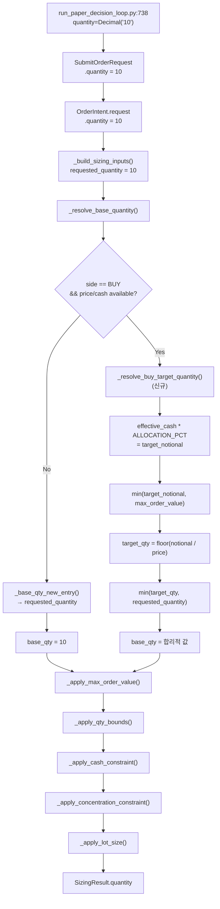
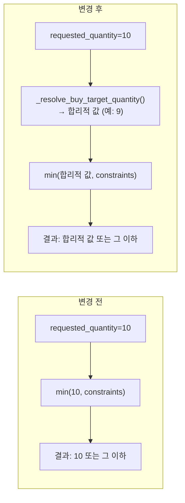

# BUY 기본 수량 10주 고정 문제 분석 + 새로운 baseline 설계 방안

> 분석일: 2026-05-21  
> 대상 파일: [`sizing_engine.py`](src/agent_trading/services/sizing_engine.py), [`decision_orchestrator.py`](src/agent_trading/services/decision_orchestrator.py), [`run_paper_decision_loop.py`](scripts/run_paper_decision_loop.py), [`test_sizing_engine.py`](tests/services/test_sizing_engine.py)

---

## 1. 10주 고정 Root Cause — 모든 경로

### 1.1 1차 출발점: [`run_paper_decision_loop.py:738`](scripts/run_paper_decision_loop.py:738)

```python
request = SubmitOrderRequest(
    ...
    quantity=Decimal("10"),   # ← 하드코딩
    ...
)
```

`run_paper_decision_loop.py`는 paper trading loop의 진입점이다. 여기서 `SubmitOrderRequest.quantity`가 `Decimal("10")`으로 고정되어 있다.

### 1.2 전달 경로: [`decision_orchestrator.py`](src/agent_trading/services/decision_orchestrator.py)

**`assemble()` (line 834-856)**: `SubmitOrderRequest`를 그대로 `OrderIntent.request`에 전달한다.

```python
assembled_request = SubmitOrderRequest(
    ...
    quantity=request.quantity,   # ← 10이 그대로 유지됨
    ...
)
```

**`_build_sizing_inputs()` (line 1595-1612)**: `OrderIntent.request.quantity`를 `SizingInputs.requested_quantity`로 직접 매핑한다.

```python
return SizingInputs(
    ...
    requested_quantity=req.quantity,   # ← 여전히 10
    ...
)
```

### 1.3 최종 도달: [`sizing_engine.py`](src/agent_trading/services/sizing_engine.py)

**`_resolve_base_quantity()` (line 243-268)**: BUY/APPROVE + BUY는 `_base_qty_new_entry()`를 호출한다.

```python
def _base_qty_new_entry(inputs: SizingInputs) -> Decimal:
    base = inputs.requested_quantity   # ← 10
    return _apply_ai_size_hint(base, inputs.sizing_hint)
```

**`calculate_sizing()` (line 461-565)**: `_resolve_base_quantity()` 이후 constraint들이 `min(qty, max_by_xxx)` 형태로만 동작한다.

```python
qty = _resolve_base_quantity(inputs)   # ← 10
qty = _apply_max_order_value(qty, ...)  # 10 * price > max_order_value면 줄임
qty = _apply_qty_bounds(qty, ...)       # max_order_qty/min_order_qty
qty = _apply_cash_constraint(qty, ...)  # cash 부족하면 줄임
qty = _apply_concentration_constraint(qty, ...)  # concentration 초과면 줄임
```

### 1.4 경로 요약

```
run_paper_decision_loop.py:738  quantity=Decimal("10")
        │
        ▼
SubmitOrderRequest.quantity = 10
        │
        ▼
OrderIntent.request.quantity = 10   (assemble() line 843)
        │
        ▼
SizingInputs.requested_quantity = 10  (_build_sizing_inputs() line 1598)
        │
        ▼
_base_qty_new_entry() → base = 10    (sizing_engine.py line 202)
        │
        ▼
constraints: min(10, max_by_cash), min(10, max_by_concentration), ...
```

**핵심**: `requested_quantity=10`이라는 baseline 자체가 고가주에서는 너무 크다. constraint들은 **이미 들어온 값을 줄이기만 할 뿐**, 합리적인 시작 수량을 계산하지 않는다.

---

## 2. Sizing이 "줄이기만" 하고 "합리적인 시작 수량"을 계산하지 못하는 이유

### 2.1 [`_resolve_base_quantity()`](src/agent_trading/services/sizing_engine.py:243) 구조

```python
def _resolve_base_quantity(inputs: SizingInputs) -> Decimal:
    ...
    # BUY or APPROVE + BUY → new entry
    return _base_qty_new_entry(inputs)
```

```python
def _base_qty_new_entry(inputs: SizingInputs) -> Decimal:
    base = inputs.requested_quantity   # caller가 정한 값을 그대로 사용
    return _apply_ai_size_hint(base, inputs.sizing_hint)
```

- `_base_qty_new_entry()`는 `requested_quantity`를 그대로 반환한다.
- AI sizing hint가 있으면 증감하지만, hint가 없으면 (=대부분의 경우) `requested_quantity`가 그대로 baseline이 된다.
- **현금/가격/NAV 정보를 전혀 고려하지 않는다.**

### 2.2 Constraint 호출 순서 ([`calculate_sizing()`](src/agent_trading/services/sizing_engine.py:461))

```
1. _resolve_base_quantity()     → 10 (고정)
2. _apply_max_order_value()     → min(10, max_value/price) — 줄이기만
3. _apply_qty_bounds()          → min(10, max_order_qty) — 줄이기만
4. _apply_cash_constraint()     → min(10, cash/price) — 줄이기만 (BUY only)
5. _apply_concentration_constraint() → min(10, remaining/price) — 줄이기만
6. _apply_lot_size()            → rounding only
```

모든 constraint는 `min(qty, limit)` 형태로 **기존 수량을 줄이기만** 한다. `requested_quantity`가 이미 합리적인 값이어야 하는 구조다.

### 2.3 문제 상황

| 시나리오 | requested_quantity | price | cash | cash_constraint 결과 | 문제 |
|----------|-------------------|-------|------|---------------------|------|
| SK하이닉스 MARKET | 10 | 200,000 | 9,000,000 | min(10, 9M\*0.95/200K=42) = **10** | cash constraint 통과, 200만원 주문 |
| 두산 MARKET | 10 | 150,000 | 9,000,000 | min(10, 9M\*0.95/150K=57) = **10** | cash constraint 통과, 150만원 주문 |
| 저가주(1,000원) | 10 | 1,000 | 100,000 | min(10, 100K/1K=100) = **10** | 1만원 주문, 적절 |

**고가주에서 10주는 cash constraint를 통과하지만, 단일 주문으로 너무 큰 금액이 나간다.**

---

## 3. BUY Baseline 계산 옵션 비교

### Option A: `target_notional = orderable_amount * ALLOCATION_PCT`

```python
def _resolve_buy_base_quantity(inputs: SizingInputs) -> Decimal:
    price = inputs.requested_price or inputs.reference_price
    if price is None or price <= 0:
        return inputs.requested_quantity

    effective_cash = inputs.orderable_amount or inputs.available_cash
    if effective_cash is None or effective_cash <= 0:
        return inputs.requested_quantity

    ALLOCATION_PCT = Decimal("0.2")  # configurable
    target_notional = effective_cash * ALLOCATION_PCT

    if inputs.max_order_value is not None and inputs.max_order_value > 0:
        target_notional = min(target_notional, inputs.max_order_value)

    target_qty = int(target_notional / price)
    if target_qty < 1:
        target_qty = 1

    return min(Decimal(str(target_qty)), inputs.requested_quantity)
```

**장점:**
- 현금 기반으로 합리적인 시작 수량 계산
- 고가주/저가주 모두 대응 가능
- `max_order_value`와 자연스럽게 연동

**단점:**
- `ALLOCATION_PCT` 상수 도입 필요
- `requested_quantity`가 무시될 수 있음 (상한으로만 사용)

### Option B: `max_order_value`를 1회 주문 상한으로 사용

```python
def _resolve_buy_base_quantity(inputs: SizingInputs) -> Decimal:
    price = inputs.requested_price or inputs.reference_price
    if price is None or price <= 0:
        return inputs.requested_quantity

    if inputs.max_order_value is not None and inputs.max_order_value > 0:
        target_qty = int(inputs.max_order_value / price)
        if target_qty < 1:
            target_qty = 1
        return min(Decimal(str(target_qty)), inputs.requested_quantity)

    return inputs.requested_quantity
```

**장점:**
- config 기반이므로 운영자가 제어 가능
- `max_order_value`가 이미 존재하는 설정

**단점:**
- `max_order_value`가 설정되지 않은 환경에서는 동작하지 않음
- 현금 잔고를 고려하지 않음

### Option C: `_resolve_buy_target_quantity()` 메서드 추가 (권장)

```python
def _resolve_base_quantity(inputs: SizingInputs) -> Decimal:
    dt = inputs.decision_type
    side = inputs.side

    if dt in _SKIP_DECISION_TYPES:
        return Decimal("0")
    if dt == "REDUCE":
        return _base_qty_reduce(inputs)
    if dt == "EXIT":
        return _base_qty_exit(inputs)
    if dt == "SELL" or (dt == "APPROVE" and side == OrderSide.SELL):
        return _base_qty_exit(inputs)

    # BUY or APPROVE + BUY → new entry
    if side == OrderSide.BUY:
        return _resolve_buy_target_quantity(inputs)  # ← BUY 전용
    return _base_qty_new_entry(inputs)
```

```python
def _resolve_buy_target_quantity(inputs: SizingInputs) -> Decimal:
    """BUY 주문의 합리적인 시작 수량을 계산한다.

    전략:
    1. requested_quantity가 이미 작으면(≤ threshold) 그대로 사용
    2. orderable_amount 또는 available_cash 기반으로 target_notional 계산
    3. max_order_value가 있으면 target_notional 상한 적용
    4. reference_price 또는 requested_price로 나누어 target_qty 산출
    5. requested_quantity를 상한으로 적용
    """
    price = inputs.requested_price or inputs.reference_price

    # 가격 정보가 없으면 fallback
    if price is None or price <= 0:
        return inputs.requested_quantity

    # 현금 정보가 없으면 fallback
    effective_cash = inputs.orderable_amount or inputs.available_cash
    if effective_cash is None or effective_cash <= 0:
        return inputs.requested_quantity

    # 1회 주문에 할당할 현금 비율 (config-driven)
    ALLOCATION_PCT = Decimal("0.2")  # 20%
    target_notional = effective_cash * ALLOCATION_PCT

    # max_order_value가 있으면 상한 적용
    if inputs.max_order_value is not None and inputs.max_order_value > 0:
        target_notional = min(target_notional, inputs.max_order_value)

    # 최소 1주 보장
    target_qty = (target_notional / price).to_integral_value(rounding=ROUND_DOWN)
    if target_qty < 1:
        target_qty = Decimal("1")

    # requested_quantity를 절대 상한으로 사용
    return min(target_qty, inputs.requested_quantity)
```

**장점:**
- 기존 `_resolve_base_quantity()` 분기 구조를 유지하면서 BUY만 특별 처리
- `requested_quantity`를 절대 상한으로 유지 (caller의 의도 존중)
- `ALLOCATION_PCT`를 config에서 읽거나 상수로 관리 가능
- `max_order_value`와 자연스럽게 연동

**단점:**
- `ALLOCATION_PCT` 상수 도입 필요
- `_resolve_buy_target_quantity()`가 `_apply_cash_constraint()`와 중복될 가능성
  - 하지만 `_resolve_buy_target_quantity()`는 **시작 수량**을 계산하고, `_apply_cash_constraint()`는 **최종 제약**을 가하므로 역할이 다름

### 옵션 비교표

| 기준 | Option A | Option B | Option C |
|------|----------|----------|----------|
| 현금 기반 계산 | ✅ | ❌ | ✅ |
| max_order_value 연동 | ✅ | ✅ | ✅ |
| config-driven | ✅ (ALLOCATION_PCT) | ✅ (max_order_value) | ✅ (ALLOCATION_PCT) |
| 기존 구조 변경 최소화 | 중간 | 중간 | **최소** |
| 고가주 대응 | ✅ | 조건부 | ✅ |
| 저가주 대응 | ✅ | 조건부 | ✅ |
| requested_quantity 존중 | 상한으로만 | 상한으로만 | 상한으로만 |
| cash constraint와 중복 | 가능 | 없음 | 가능 (의도적) |

**권장: Option C** — 기존 구조를 가장 적게 변경하면서 목적 달성 가능.

---

## 4. 고가주/저가주 사례 계산표

### 가정
- `orderable_amount` = 9,000,000원 (900만원)
- `ALLOCATION_PCT` = 20% (0.2)
- `max_order_value` = 5,000,000원 (설정된 경우)

### Option C 적용 시

| 종목 | 가격 | requested_qty | target_notional | target_qty | 최종 (min) | 주문금액 |
|------|------|--------------|----------------|-----------|-----------|---------|
| SK하이닉스 | 200,000 | 10 | 9M \* 0.2 = 1.8M | 1.8M/200K = **9** | min(9, 10) = **9** | 180만원 |
| 두산 | 150,000 | 10 | 9M \* 0.2 = 1.8M | 1.8M/150K = **12** | min(12, 10) = **10** | 150만원 |
| 삼성전자 | 80,000 | 10 | 9M \* 0.2 = 1.8M | 1.8M/80K = **22** | min(22, 10) = **10** | 80만원 |
| 저가주A | 5,000 | 10 | 9M \* 0.2 = 1.8M | 1.8M/5K = **360** | min(360, 10) = **10** | 5만원 |
| 저가주B | 1,000 | 10 | 9M \* 0.2 = 1.8M | 1.8M/1K = **1800** | min(1800, 10) = **10** | 1만원 |

### Option C + max_order_value=5,000,000 적용 시

| 종목 | 가격 | target_notional (cash) | max_order_value | 최종 notional | target_qty | 최종 |
|------|------|----------------------|----------------|--------------|-----------|------|
| SK하이닉스 | 200,000 | 1.8M | 5M | 1.8M | 9 | **9** |
| 두산 | 150,000 | 1.8M | 5M | 1.8M | 12 | **10** (capped) |
| 고가주X | 500,000 | 1.8M | 5M | 1.8M | 3 | **3** |

### Option C + ALLOCATION_PCT=10% 적용 시 (보수적)

| 종목 | 가격 | target_notional | target_qty | 최종 | 주문금액 |
|------|------|----------------|-----------|------|---------|
| SK하이닉스 | 200,000 | 9M \* 0.1 = 0.9M | 0.9M/200K = **4** | **4** | 80만원 |
| 두산 | 150,000 | 9M \* 0.1 = 0.9M | 0.9M/150K = **6** | **6** | 90만원 |
| 삼성전자 | 80,000 | 9M \* 0.1 = 0.9M | 0.9M/80K = **11** | **10** (capped) | 80만원 |

### 관찰

1. **고가주(SK하이닉스 20만원)**: 10% 할당 시 4주, 20% 할당 시 9주 — 10주보다 작거나 비슷
2. **중가주(삼성전자 8만원)**: requested_quantity=10이 상한으로 작용
3. **저가주(5,000원 이하)**: requested_quantity=10이 상한으로 작용, 문제 없음
4. **`ALLOCATION_PCT=20%`가 적절**: 고가주에서 10주를 넘지 않으면서 저가주에서 충분한 수량 확보

---

## 5. 권장 변경 범위

### 최소 변경: [`sizing_engine.py`](src/agent_trading/services/sizing_engine.py)만 수정

**변경할 부분:**

1. **`_resolve_buy_target_quantity()` 함수 추가** (신규)
   - `_base_qty_new_entry()`와 유사한 위치에 추가
   - `ALLOCATION_PCT` 상수 도입 (또는 config에서 읽도록)

2. **`_resolve_base_quantity()` 분기 수정**
   - BUY side일 때 `_resolve_buy_target_quantity()` 호출

3. **`calculate_sizing()` 파이프라인 순서 변경** (선택)
   - 현재: `_resolve_base_quantity()` → `_apply_max_order_value()` → `_apply_cash_constraint()`
   - `_resolve_buy_target_quantity()`에서 이미 `max_order_value`와 cash를 고려하므로, constraint 순서는 그대로 둬도 무방
   - 단, `_apply_cash_constraint()`가 `_resolve_buy_target_quantity()`보다 더 보수적일 수 있으므로 둘 다 유지

### 변경하지 않아도 되는 부분

- [`run_paper_decision_loop.py`](scripts/run_paper_decision_loop.py): `quantity=Decimal("10")`은 그대로 둬도 됨. sizing engine이 알아서 조정
- [`decision_orchestrator.py`](src/agent_trading/services/decision_orchestrator.py): `_build_sizing_inputs()`는 수정 불필요. `requested_quantity` 전달 구조는 그대로

### 변경 영향도

| 파일 | 변경 | 영향 |
|------|------|------|
| [`sizing_engine.py`](src/agent_trading/services/sizing_engine.py) | `_resolve_buy_target_quantity()` 추가 + `_resolve_base_quantity()` 분기 수정 | **중간** — 새로운 함수 추가, 기존 분기에 조건 하나 추가 |
| [`test_sizing_engine.py`](tests/services/test_sizing_engine.py) | BUY baseline 계산 테스트 추가 | **중간** — 새로운 테스트 클래스 필요 |
| [`run_paper_decision_loop.py`](scripts/run_paper_decision_loop.py) | 변경 없음 | **없음** |
| [`decision_orchestrator.py`](src/agent_trading/services/decision_orchestrator.py) | 변경 없음 | **없음** |

---

## 6. 영향 받는 테스트 분석

### 기존 테스트 중 변경 영향 받는 것

| 테스트 | 현재 동작 | 변경 후 예상 | 영향 |
|--------|----------|-------------|------|
| [`test_buy_pass_through`](tests/services/test_sizing_engine.py:108) | requested=100 → qty=100 | requested=100, cash=None → fallback → qty=100 | **없음** (cash 없으면 fallback) |
| [`test_cash_shortage_caps_qty`](tests/services/test_sizing_engine.py:132) | cash=500, price=10 → qty=50 | cash=500, ALLOCATION=20% → target=100 → cash constraint가 50으로 cap | **없음** (cash constraint이 더 작음) |
| [`test_cash_sufficient_no_cap`](tests/services/test_sizing_engine.py:147) | cash=2000, price=10 → qty=100 | cash=2000, ALLOCATION=20% → target=400 → min(400, 100)=100 | **없음** |
| [`test_all_none_pass_through`](tests/services/test_sizing_engine.py:623) | 모든 필드 None → qty=100 | cash=None → fallback → qty=100 | **없음** |
| [`test_market_buy_cash_constraint_with_reference_price`](tests/services/test_sizing_engine.py:1151) | ref_price=60000, cash=9M → qty=142 | cash=9M, ALLOCATION=20% → target=1.8M → target_qty=30 → min(30, 1000)=30 → cash constraint 142 → **30** | **변경** (baseline이 30으로 줄어듦) |

### 신규 테스트 필요 항목

1. **BUY + cash + price → 합리적인 target_qty 계산**
   - `orderable_amount=9,000,000`, `reference_price=200,000` → target_qty=9
   - `orderable_amount=9,000,000`, `reference_price=150,000` → target_qty=12 → capped to 10

2. **BUY + cash 없음 → fallback to requested_quantity**
   - `available_cash=None`, `orderable_amount=None` → `requested_quantity` 그대로

3. **BUY + price 없음 → fallback to requested_quantity**
   - `requested_price=None`, `reference_price=None` → `requested_quantity` 그대로

4. **BUY + max_order_value 적용**
   - `max_order_value=1,000,000`, `reference_price=200,000` → target_qty=5

5. **BUY + ALLOCATION_PCT=10%**
   - `orderable_amount=9,000,000`, `reference_price=200,000` → target_qty=4

---

## 7. 데이터 흐름 다이어그램





---

## 8. 결론 및 권장 사항

### 핵심 문제

1. **`run_paper_decision_loop.py:738`**에서 `quantity=Decimal("10")` 하드코딩
2. **sizing engine의 `_resolve_base_quantity()`**가 `requested_quantity`를 그대로 반환
3. **모든 constraint가 "줄이기만"** 하므로, 고가주에서 10주가 너무 큰 문제를 해결하지 못함

### 권장 변경

**Option C** — `_resolve_buy_target_quantity()` 메서드를 [`sizing_engine.py`](src/agent_trading/services/sizing_engine.py)에 추가:

- `ALLOCATION_PCT = 0.2` (20%)를 기본값으로 사용
- `orderable_amount` 또는 `available_cash` 기반으로 target notional 계산
- `max_order_value`가 있으면 상한 적용
- `requested_quantity`를 절대 상한으로 유지
- `_resolve_base_quantity()`에서 BUY side일 때만 호출

### 변경 범위

| 파일 | 변경 필요 | 이유 |
|------|----------|------|
| [`sizing_engine.py`](src/agent_trading/services/sizing_engine.py) | **✅ 필요** | `_resolve_buy_target_quantity()` 추가 + 분기 수정 |
| [`test_sizing_engine.py`](tests/services/test_sizing_engine.py) | **✅ 필요** | BUY baseline 계산 테스트 추가 |
| [`run_paper_decision_loop.py`](scripts/run_paper_decision_loop.py) | ❌ 불필요 | sizing engine이 알아서 처리 |
| [`decision_orchestrator.py`](src/agent_trading/services/decision_orchestrator.py) | ❌ 불필요 | `_build_sizing_inputs()` 구조 변경 없음 |

### 기대 효과

- **고가주(SK하이닉스 20만원)**: 10주 → 4~9주 (ALLOCATION_PCT에 따라)
- **중가주(삼성전자 8만원)**: 10주 유지 (requested_quantity 상한)
- **저가주(5,000원 이하)**: 10주 유지 (requested_quantity 상한)
- **cash constraint와 중복**: 의도적 — `_resolve_buy_target_quantity()`는 시작 수량을 낮추고, `_apply_cash_constraint()`는 최종 안전장치 역할
