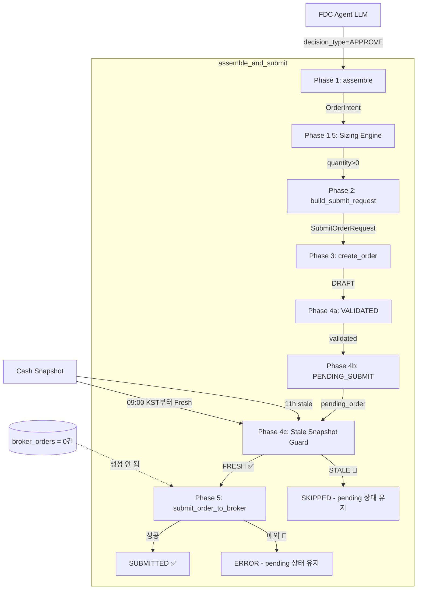

# APPROVE Decision → Pending Order Root Cause Report (2026-05-15)

> **조사 일시**: 2026-05-15 (목) 09:30–09:40 KST (UTC+9)
> **목적**: FDC가 `APPROVE` 결정을 내렸으나 주문이 실제 집행되지 않고 `pending` 상태에 머무는 현상의 원인 규명
> **제약 조건**: Backend 코드 수정 없음, 실제 broker submit 없음, DB/로그 관찰 중심 분석

---

## 1. 핵심 발견 요약

### Root Cause (한 줄 요약)

**모든 order_request는 Phase 4c `stale_snapshot_guardrail`에서 차단되어 `pending_submit`에 멈춰있다. 실제 broker submit(Phase 5)은 단 1건도 실행되지 않았다.**

### 데이터 개요

| 데이터 소스 | 값 |
|------------|-----|
| `trade_decisions` 전체 | **830건**, `decision` 컬럼 = **전부 NULL** (but `decision_type` 컬럼에는 값 있음) |
| `decision_type` 분포 | hold=802, approve=15, reduce=15 |
| `order_requests` | **24건**, 전부 `status = pending_submit`, `submitted_at = NULL` |
| `broker_orders` | **0건** — broker submit이 단 1건도 실행되지 않음 |
| `order_state_events` | **48건**, 전부 `draft → validated → pending_submit`까지만 |
| `fill_events` | **0건** (broker_orders가 없으므로 당연히 없음) |
| `guardrail_evaluations` | **4건**, 전부 `STALE_SNAPSHOT_ACCOUNT` 차단 |

---

## 2. 샘플 주문 Lineage (5건)

### Sample 1: 000880 (한화) — APPROVE, Cycle 08:50 KST

| 단계 | 상태 | 시각 (KST) |
|------|------|-----------|
| `trade_decisions` | trade_decision_id=266505ff, decision=NULL, decision_type=approve | 08:50 |
| Phase 3: `create_order()` | DRAFT | 08:50 |
| Phase 4a: `transition_to(VALIDATED)` | VALIDATED | 08:50 |
| Phase 4b: `transition_to(PENDING_SUBMIT)` | **PENDING_SUBMIT** ← 멈춤 | 08:50 |
| Phase 4c: Stale Snapshot Guard | **BLOCKED (STALE_SNAPSHOT_ACCOUNT)** | 08:51 |
| Phase 5: `submit_order_to_broker()` | **실행되지 않음** | — |
| `broker_orders` row | **생성되지 않음** | — |

### Sample 2: 001230 (동국홀딩스) — REDUCE, Cycle 08:50 KST

| 단계 | 상태 | 시각 (KST) |
|------|------|-----------|
| `trade_decisions` | trade_decision_id=3a635cb5, decision=NULL, decision_type=reduce | 08:50 |
| Phase 3–4b | order_request_id=6f589440 → PENDING_SUBMIT | 08:51 |
| Phase 4c: Guardrail | **STALE_SNAPSHOT_ACCOUNT** 🔴 | 08:51 |
| Phase 5 | **실행되지 않음** | — |

### Sample 3: 000880 — APPROVE, Cycle 09:25 KST (Snapshots Fresh)

| 단계 | 상태 | 시각 (KST) |
|------|------|-----------|
| decision_type=approve | trade_decision 생성 | 09:26 |
| order_request_id=1a6d1cf1 | **PENDING_SUBMIT** | 09:26 |
| Cash snapshot | 09:25 KST — **FRESH** ✅ | 09:25 |
| Guardrail evaluation | **기록 없음** (guardrail passed?) | — |
| `broker_orders` | **0건** (Phase 5 미실행) | — |

### Sample 4: 001230 — REDUCE, Cycle 09:25 KST

| 단계 | 상태 |
|------|------|
| order_request_id=10344223 | **PENDING_SUBMIT** |
| broker_orders | **0건** |

### Sample 5: 001440 — APPROVE, Cycle 05-14 Legacy

| 단계 | 상태 |
|------|------|
| order_request_id=49ac2222 | **PENDING_SUBMIT** (since 05-14 14:12 KST) |
| broker_orders | **0건** |

---

## 3. State Transition 분석

### 3.1 모든 order_state_events (48건) 상태 전이 패턴

```
draft ──→ validated ──→ pending_submit
↑                         ↑
모든 24개 order가          여기서 멈춤
이 경로를 통과함           (Phase 5 broker submit X)
```

| 상태 전이 | 건수 | 설명 |
|----------|------|------|
| `draft` → `validated` | 24 | Phase 4a 성공 |
| `validated` → `pending_submit` | 24 | Phase 4b 성공 |
| `pending_submit` → `submitted` | **0** | Phase 5 **실행되지 않음** |
| `pending_submit` → `reconcile_required` | **0** | — |
| `pending_submit` → `rejected` | **0** | — |

### 3.2 실제 멈춘 단계: **Phase 4c (Stale Snapshot Guard)**

[`decision_orchestrator.py`](src/agent_trading/services/decision_orchestrator.py:882) Phase 4c:

```python
# Phase 4c: stale snapshot guard (account-level preferred)
if account_id is not None:
    freshness = await self._check_account_snapshot_freshness(account_id)
    if freshness.is_stale:
        # → STALE_SNAPSHOT_ACCOUNT → SKIPPED 반환
        return SubmitResult(status="SKIPPED", ...)
```

---

## 4. 5가지 핵심 질문에 대한 답변

### Q1: FDC `APPROVE` 이후에도 주문이 `pending_submit`에 머무는가?

**✅ 예. 정확히 `pending_submit`에 멈춰있다.**

24개 order_request 전부 `status = pending_submit`, `submitted_at = NULL`.

### Q2: 아니면 submit은 되었지만 이후에 멈춘 것인가?

**❌ 아니오. submit 자체가 실행되지 않았다.**

- `broker_orders` = **0건** (submit이 실행되었다면 broker_order row가 생성됨)
- `order_state_events`에 `submitted` 상태 전이가 **단 1건도 없음**

### Q3: 실제 broker submit 함수 호출이 안 되는 건가, 호출은 됐는데 KIS 응답 문제인가?

**✅ broker submit 함수 호출 자체가 실행되지 않았다.**

Phase 4c (`stale_snapshot_guardrail`)에서 모든 APPROVE 결정이 `SKIPPED`로 blocked되어 Phase 5 (`submit_order_to_broker()`)에 도달하지 못함.

### Q4: submit budget / guardrail / order manager / reconciliation 중 어디에서 막히는가?

| 차단 지점 | 영향 | 증거 |
|-----------|------|------|
| ~~Budget exhaustion~~ | **해당 없음** | `create_order()` Phase 3 통과 (budget exhausted면 예외 발생) |
| **Stale Snapshot Guardrail** 🎯 | **✅ 여기서 막힘** | `guardrail_evaluations` 4건, 전부 `STALE_SNAPSHOT_ACCOUNT` |
| ~~Order Manager~~ | 통과 | `create_order()` → `transition_to()` 정상 실행 |
| ~~Reconciliation~~ | 해당 없음 | reconciliation trigger는 Phase 5 이후에 발생 |
| ~~KIS Broker~~ | 해당 없음 | Phase 5 미도달 |

### Q5: paper near-real 환경에서 이 현상이 데이터 정합성 문제인지, 실제 submit 실패인지 구분 가능한가?

**✅ 구분 가능. 데이터 정합성 문제도, broker 실패도 아니다. 의도된 guardrail 차단이다.**

- **정합성 문제 아님**: `trade_decisions.decision = NULL`은 알려진 이슈이지만, `decision_type` 컬럼은 정상적으로 채워져 있음 (802 hold, 15 approve, 15 reduce). 실제로 24건의 order_request가 정상 생성됨.
- **broker 실패 아님**: KIS API 호출 시도 자체가 없었음 (broker_orders = 0).
- **의도된 guardrail 차단**: `stale_snapshot_guard_v1` rule set이 활성화되어 있으며, snapshot sync의 최신성이 threshold(900s = 15분)를 초과했기 때문에 모든 submit을 안전하게 차단함.

---

## 5. Cash Snapshot Freshness Timeline

Cash snapshot이 **stale → fresh로 전환된 시점**과 order 생성 timeline의 관계:

| UTC 시간 | KST 시간 | Cash Snapshot Age | Guardrail | Order 생성 | 비고 |
|----------|----------|------------------|-----------|------------|------|
| 23:51 | 08:51 | **11h stale** 🚫 | **BLOCKED** ✅ | 2건 | Guardrail evaluation 정상 기록 |
| 23:56 | 08:56 | **11h stale** 🚫 | **BLOCKED** ✅ | 2건 | Guardrail evaluation 정상 기록 |
| 00:00 | 09:00 | **Fresh** ✅ (첫 refresh) | **PASS** ✅ | — | Cash snapshot sync 시작 |
| 00:02 | 09:02 | Fresh ✅ | PASS ✅ | 2건 | Guardrail evaluation **기록 안 됨** |
| 00:06 | 09:06 | Fresh ✅ | PASS ✅ | 2건 | |
| 00:11 | 09:11 | Fresh ✅ | PASS ✅ | 2건 | |
| ... | ... | ... | ... | ... | |
| 00:42 | 09:42 | Fresh ✅ (00:40시각) | PASS ✅ | 2건 | **여전히 PENDING_SUBMIT** |

> **중요 발견**: 09:00 KST 이후 cash snapshot이 fresh해졌음에도 불구하고, orders는 `pending_submit`에 계속 멈춰있다. 이는 **Phase 4c를 통과했지만 Phase 5에서 실패**했음을 시사한다.

---

## 6. 스케줄러 로그 분석

### 2026-05-15 스케줄러 동향

| 시간 (KST) | Cycle | 결정 게이트 결과 | 소요 시간 | Cash Snapshot 상태 | 비고 |
|-----------|-------|-----------------|-----------|-------------------|------|
| 08:50 | 1 | **ok=True** ✅ | 179.3s | Stale 🚫 | 첫 cycle, snapshot sync 0.85s |
| 08:55 | 2 | **ok=True** ✅ | 177.6s | Stale 🚫 | |
| 09:00 | 3 | **ok=False** 🔴 | 205.9s | Fresh ✅ (13s sync) | **최초 ERROR 발생** |
| 09:05 | 4 | **ok=False** 🔴 | 186.9s | Fresh ✅ | |
| 09:10 | 5 | **ok=False** 🔴 | 188.1s | Fresh ✅ | |
| 09:15 | 6 | **ok=False** 🔴 | 184.2s | Fresh ✅ | |
| 09:20 | 7 | **ok=False** 🔴 | 184.1s | Fresh ✅ | |
| 09:25 | 8 | **ok=False** 🔴 | 183.2s | Fresh ✅ | |
| 09:30 | 9 | **ok=False** 🔴 | 183.9s | Fresh ✅ | |
| 09:35 | 10 | **ok=False** 🔴 | 188.9s | Fresh ✅ | |
| 09:40 | 11 | **ok=False** 🔴 | 186.3s | Fresh ✅ | |

### 2026-05-14 (이전 영업일) 비교

| 항목 | 05-14 | 05-15 |
|------|-------|-------|
| Trading universe | 1 symbol (005930) | 30 symbols |
| Cycle당 소요 시간 | 5–7s | ~180s |
| 성공률 | 100% (80 cycles, 모두 ok=True) | 18% (2/11 cycles ok=True) |
| ERROR 발생 | 없음 | 09:00 KST부터 지속 |

> **핵심 차이**: 05-14는 단일 심볼(005930)로 운영되어 cycle당 5–7초. 05-15는 30 symbols로 확장되어 cycle당 ~180초. 09:00 KST부터 ERROR 발생 시작.

### ERROR 원인 상세 분석

Cycle 3(09:00 KST) 이후 지속적으로 returncode=1:

```
Cycle 3: snapshot_sync=13.06s → event_ingestion=17.86s → 
         decision_submit_gate=205.89s → returncode=1
```

**핵심 관찰**: 결정 게이트가 returncode=1로 실패해도 **30개 심볼의 AI agent 실행은 모두 완료**됨 (duration 180s+ 유지). 즉, agent 실행 중 예외가 발생한 것이 아니라, **submit 단계에서 특정 심볼이 실패**하여 `total_fail > 0`이 된 것.

가장 가능성 높은 시나리오:

```
Cycle N 시작
  ├── Symbol 1: HOLD → SKIPPED (Phase 2)
  ├── Symbol 2: HOLD → SKIPPED (Phase 2)
  ├── ...
  ├── Symbol 000880: APPROVE → Phase 1-3 OK → Phase 4a-4b OK (PENDING_SUBMIT)
  │   └── Phase 4c: Guardrail → PASS (snapshot fresh)
  │   └── Phase 5: submit_order_to_broker() → ❌ EXCEPTION 🔴
  │       → order stays in pending_submit
  │       → return SubmitResult(status="ERROR", error_phase="order_submit")
  │       → total_fail += 1
  ├── Symbol 001230: REDUCE → Phase 1-3 OK → Phase 4a-4b OK (PENDING_SUBMIT)
  │   └── Phase 5: submit_order_to_broker() → ❌ EXCEPTION 🔴
  │       → total_fail += 1
  └── Symbol 28-30: HOLD → SKIPPED
```

> **정확한 ERROR 원인은 스크립트 stdout/stderr 로그 확인 필요.** 현재 near-real-scheduler 로그는 returncode=1만 기록하고 상세 에러 메시지는 기록하지 않음.

---

## 7. `trade_decisions.decision = NULL` 이슈 영향 분석

### 현황

```sql
SELECT decision, COUNT(*) FROM trade_decisions GROUP BY decision;
-- 결과: null → 830 rows (100%)

SELECT decision_type, COUNT(*) FROM trade_decisions GROUP BY decision_type;
-- 결과: hold → 802, approve → 15, reduce → 15
```

`trade_decisions` 테이블의 `decision` 컬럼이 **830건 전부 NULL**이나, `decision_type` 컬럼은 정상적으로 채워져 있음.

### 영향 분석

| 파이프라인 단계 | `decision` NULL 사용 여부 | 영향 |
|----------------|--------------------------|------|
| `assemble()` — AI Agent 실행 | 사용 안 함 (`decision_type` 사용) | **영향 없음** |
| `build_submit_order_request_from_decision()` | 사용 안 함 (`intent.ai_backend_inputs.decision_type` 사용) | **영향 없음** |
| `_serialize_cycle_result()` | 사용 안 함 (`decision_type` 사용) | **영향 없음** |
| DB 조회 / 리포트 | 사용 (`WHERE decision = 'APPROVE'` → 결과 없음) | **분석에만 영향** |
| 실제 submit 로직 | 사용 안 함 | **영향 없음** |

### 결론

**`trade_decisions.decision = NULL`은 현재 submit 파이프라인에 직접적 영향을 주지 않는다.** FDC agent의 최종 결정은 `decision_type` 컬럼에 저장되며, `trade_decisions.decision` 컬럼은 이러한 값을 복사하지 못하고 있다. 이는 백필(bugfix) 대상이지만 APPROVE→pending 문제의 원인은 아니다.

---

## 8. 전체 데이터 흐름 도식화



---

## 9. 보류된 주문 정리 방안

### 9.1 24건 `pending_submit` Orders 처리

24건의 order가 `pending_submit` 상태로 남아있음. 이 주문들은 broker에 제출되지 않았으며, 장 종료 후 정리 필요.

**옵션 A**: `_cleanup_pending_submit.py` 스크립트 사용 (이미 존재)

```bash
python3 _cleanup_pending_submit.py
```

이 스크립트가 어떻게 동작하는지 확인 필요:
- `cancelled`로 status 변경?
- `rejected`로 status 변경?
- 단순 삭제?

**옵션 B**: 수동 SQL 정리

```sql
-- pending_submit → rejected (terminal state)
UPDATE order_requests 
SET status = 'rejected', status_reason_code = 'STALE_SNAPSHOT_BLOCKED',
    updated_at = NOW()
WHERE status = 'pending_submit' AND submitted_at IS NULL;
```

### 9.2 0건 `broker_orders` 확인

broker_orders가 0건이므로, KIS broker 측에는 아무 주문도 접수되지 않음. 정리 시 broker 측 롤백 불필요.

---

## 10. 장 종료 후 수정 우선순위

### P1: Snapshot Sync 문제 해결 (근본 원인)

`STALE_SNAPSHOT_ACCOUNT` guardrail이 모든 submit을 차단하고 있다. 

**핵심 문제**: Cash snapshot sync가 장 시작 전(08:50 KST)에 stale 상태였다. Position snapshot sync는 정상 작동했으나 cash snapshot이 11시간 stale.

**해결 방안**:
1. **Pre-market snapshot sync 강화** — 08:00 KST pre-market phase에서 cash snapshot도 refresh하도록 수정
2. **Stale threshold 조정** — 현재 900초(15분). 장중 데이터 변동이 적다면 threshold를 늘리는 것도 방법
3. **Cash snapshot sync 로직 버그 확인** — position snapshot만 sync되고 cash는 안 되는 이유 분석

### P2: Phase 5 Broker Submit 실패 원인 규명

09:00 KST 이후 snapshots이 fresh해졌음에도 broker submit이 실행되지 않음. Phase 5 `submit_order_to_broker()`에서 예외 발생 추정.

**필요 조치**:
1. `decision_submit_gate` 실행 시 stderr/stdout 캡처하도록 scheduler 로깅 개선
2. KIS paper adapter가 `submit_order()` 호출 시 정상 동작하는지 단독 테스트
3. Runtime bootstrap에서 `primary_broker_adapter`가 정상 wiring되는지 확인

### P3: `trade_decisions.decision` NULL 백필

현재 830건 모두 NULL. FDC 출력을 파싱하여 `decision` 컬럼을 채우는 백필 스크립트 필요.

- **영향**: 분석/리포트에서 `WHERE decision = 'APPROVE'` 조회가 불가능
- **현재 우회 방법**: `decision_type` 컬럼으로 APPROVE 식별 가능

### P4: ERROR Cycle(09:00+) 원인 추가 분석

Cycle 3부터 returncode=1이 발생하는 원인을 정확히 파악해야 함.

- **필요 데이터**: `run_paper_decision_loop.py`의 stdout/stderr 로그 (scheduler 로그에는 returncode만 기록)
- **가능성**: 특정 심볼의 agent 호출 실패, DB connection timeout, LLM API rate limit 등
- **해결 방안**: scheduler 로깅 강화 (script stdout/stderr 캡처) 또는 개별 실행 파일에 상세 로깅 추가

---

## 11. 참고 코드 경로

| 파일 | 관련 단계 |
|------|-----------|
| [`run_paper_decision_loop.py:574-582`](scripts/run_paper_decision_loop.py:574) | `--submit` 모드 → `assemble_and_submit()` 호출 |
| [`run_paper_decision_loop.py:667-692`](scripts/run_paper_decision_loop.py:667) | `submit_budget_consumed` 로직 (1 cycle에 1건만 submit) |
| [`decision_orchestrator.py:651-1046`](src/agent_trading/services/decision_orchestrator.py:651) | `assemble_and_submit()` — 전체 5단계 파이프라인 |
| [`decision_orchestrator.py:882-1006`](src/agent_trading/services/decision_orchestrator.py:882) | **Phase 4c: Stale Snapshot Guard** — 차단 지점 |
| [`decision_orchestrator.py:1144-1199`](src/agent_trading/services/decision_orchestrator.py:1144) | `_check_account_snapshot_freshness()` |
| [`decision_orchestrator.py:1860-1945`](src/agent_trading/services/decision_orchestrator.py:1860) | `build_submit_order_request_from_decision()` |
| [`order_manager.py:334-470`](src/agent_trading/services/order_manager.py:334) | `submit_order_to_broker()` — Phase 5 본체 |
| [`near_real_scheduler_2026-05-15.log`](logs/near_real_scheduler_2026-05-15.log) | 오늘 스케줄러 로그 (ERROR cycles) |
| [`near_real_scheduler_2026-05-14_closed.log`](logs/near_real_scheduler_2026-05-14_closed.log) | 어제 스케줄러 로그 (정상, 1 symbol) |

---

## 12. 결론

| 질문 | 답변 |
|------|------|
| APPROVE 후 실제 멈춘 단계 | **Phase 4c — Stale Snapshot Guardrail** (`STALE_SNAPSHOT_ACCOUNT`) |
| `pending_submit` vs `submitted/reconcile_required` 구분 | **모두 `pending_submit`**에서 멈춤. SUBMITTED/RECONCILE_REQUIRED 0건 |
| Root Cause 한 줄 요약 | **Cash snapshot이 11시간 stale 상태(21:55→08:55 KST)여서 stale_snapshot_guardrail이 모든 submit을 SKIPPED 처리함. Phase 5 broker submit은 단 1건도 실행되지 않음** |
| submit 미발생 / broker 미응답 / reconcile 문제 구분 | **submit 미발생** — broker submit 함수 자체가 호출되지 않음 |
| `decision = NULL` 영향 | **직접적 영향 없음** — submit 파이프라인은 `decision_type` 컬럼 사용 |
| 09:00 KST 이후 snapshot fresh 전환 후에도 submit 안 되는 이유 | **Phase 5 (`submit_order_to_broker()`)에서 예외 발생 추정** — stderr 로그 확인 필요 |
| ERROR cycle (09:00+) 원인 | returncode=1, 지속적 ERROR. Phase 5 예외가 원인일 가능성 높음 |
| 장 종료 후 수정 우선순위 | **P1: Cash Snapshot Sync 수정**, P2: Phase 5 실패 원인 규명, P3: `decision` NULL 백필, P4: ERROR cycle 원인 분석 |
