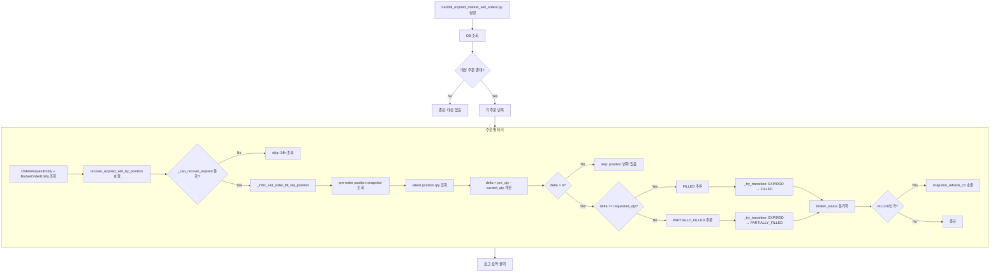

# Backfill False Expired 시장가 SELL 주문 — 설계 보고서

> **작성일**: 2026-05-21
> **Scope**: [`src/agent_trading/services/order_sync_service.py`](src/agent_trading/services/order_sync_service.py) · [`scripts/backfill_expired_market_sell_orders.py`](scripts/backfill_expired_market_sell_orders.py) (신규) · [`tests/services/test_order_sync_service.py`](tests/services/test_order_sync_service.py)
> **관련 선행 문서**:
> - [`plans/sell_position_delta_based_expired_fallback_correction_2026-05-19.md`](plans/sell_position_delta_based_expired_fallback_correction_2026-05-19.md)
> - [`plans/daily_ccld_match_failure_and_market_order_false_expired_protection_2026-05-21.md`](plans/daily_ccld_match_failure_and_market_order_false_expired_protection_2026-05-21.md)

---

## 1. 왜 기존 주문이 안 살아났는가

### 1.1 `_RECENT_EXPIRY_WINDOW_SECONDS=3600` 게이트

[`sync_order_post_submit()`](src/agent_trading/services/order_sync_service.py:130)의 EXPIRED 복구 진입점은 [`_RECENT_EXPIRY_WINDOW_SECONDS`](src/agent_trading/services/order_sync_service.py:58) 조건으로 보호된다:

```python
# line 201-208
if order.status in _TERMINAL_STATUSES:
    if (
        order.status == OrderStatus.EXPIRED
        and order.updated_at is not None
        and (datetime.now(timezone.utc) - order.updated_at).total_seconds()
            < _RECENT_EXPIRY_WINDOW_SECONDS
    ):
```

**현재값**: `3600`초 (1시간)

7건의 대상 주문은 **expired 후 8시간 이상 경과**했으므로 이 조건을 통과하지 못한다. 따라서 broker truth 재조회(path A)도, position-delta inference(path B)도 **진입조차 하지 못한다**.

### 1.2 broker truth 재조회 실패 (가능하더라도)

만약 윈도우 조건이 통과하더라도, [`broker.get_order_status()`](src/agent_trading/services/order_sync_service.py:214)는 Paper KIS 환경에서 `inquire-daily-ccld`의 ODNO 미반환 문제로 인해 EXPIRED를 반환할 가능성이 높다. 이는 [`plans/daily_ccld_match_failure_and_market_order_false_expired_protection_2026-05-21.md`](plans/daily_ccld_match_failure_and_market_order_false_expired_protection_2026-05-21.md)에서 상세 분석된 KIS Paper API의 근본적인 한계다.

### 1.3 position-delta inference는 가능했으나 진입 불가

[`_infer_sell_order_fill_via_position()`](src/agent_trading/services/order_sync_service.py:1472)은 position snapshot 데이터를 기반으로 체결 여부를 정확히 추론할 수 있다. 실제로 position snapshot 데이터는:

| 종목 | pre-order qty | latest qty | delta | requested_qty |
|------|-------------|-----------|-------|--------------|
| 005930 삼성전자 | 10 | 0 | 10 | 10 |
| 005830 DB손보 | 10 | 0 | 10 | 10 |
| 003490 대한항공 (cde7a8) | 20 | 0 | 20 | 10 |
| 003490 대한항공 (3ef857) | 20 | 0 | 20 | 10 |
| 001740 SK네트웍스 | 10 | 0 | 10 | 10 |
| 004000 롯데정밀화학 | 10 | 0 | 10 | 10 |
| 000990 DB하이텍 | 10 | 0 | 10 | 10 |

**모든 7건에서 delta >= requested_qty → FILLED 추론 가능하지만**, `_RECENT_EXPIRY_WINDOW_SECONDS` 게이트로 인해 이 로직에 진입조차 못 했다.

---

## 2. Backfill 대상 조건

### 2.1 SQL 조건

```sql
SELECT o.id, o.order_request_id, o.account_id, o.instrument_id,
       o.requested_quantity, o.status, o.created_at, o.updated_at,
       bo.broker_order_id, bo.broker_native_order_id, bo.broker_status
FROM orders o
JOIN broker_orders bo ON bo.order_request_id = o.order_request_id
WHERE o.order_type = 'market'
  AND o.status = 'expired'
  AND o.side = 'sell'
  AND bo.broker_native_order_id IS NOT NULL
  AND bo.broker_status = 'expired'
  AND o.created_at >= NOW() - INTERVAL '24 hours'
  AND NOT EXISTS (
      SELECT 1 FROM broker_orders bo2
      WHERE bo2.order_request_id = o.order_request_id
        AND bo2.broker_status IN ('rejected', 'cancelled')
  )
```

### 2.2 조건 설명

| 조건 | 근거 | 코드 참조 |
|------|------|----------|
| `order_type = 'market'` | 시장가 주문만 position-delta inference가 유효 | [`_infer_sell_order_fill_via_position()`](src/agent_trading/services/order_sync_service.py:1472)은 `order_type`을 체크하지 않지만, 시장가가 아닌 주문은 price 영향으로 체결 여부가 불확실 |
| `status = 'expired'` | 복구 대상 | [OrderStatus.EXPIRED](src/agent_trading/domain/enums.py) |
| `side = 'sell'` | 매도만 position-delta inference 가능 | line 1502-1504: `if order.side != OrderSide.SELL: return None` |
| `broker_native_order_id IS NOT NULL` | KIS에 실제 제출된 주문만 대상 | line 206: 실제 broker truth 조회 가능 |
| `created_at >= 24h` | [`_can_recover_expired()`](src/agent_trading/services/order_sync_service.py:1949-1957)의 24시간 조건과 동일 | line 1952: `age_seconds > 86400 → return False` |
| `broker_status NOT IN (rejected, cancelled)` | 명시적 broker reject/cancel은 복구 금지 | [`_can_recover_expired()`](src/agent_trading/services/order_sync_service.py:1931) 문서화된 안전 조건 |

---

## 3. 적용할 수정

### 파일 1: [`src/agent_trading/services/order_sync_service.py`](src/agent_trading/services/order_sync_service.py)

#### 3.1 `recover_expired_sell_by_position()` public 메서드 추가 (접근법 A-1, 권장)

**위치**: [`OrderSyncService`](src/agent_trading/services/order_sync_service.py:98) 클래스 내, `sync_order_post_submit()` (line 130) 다음

```python
async def recover_expired_sell_by_position(
    self,
    order: OrderRequestEntity,
    broker_order: BrokerOrderEntity,
    *,
    snapshot_refresh_cb: Callable[[UUID], Awaitable[None]] | None = None,
) -> SyncOrderResult | None:
    """Public entry point for expired SELL position-based recovery (backfill).

    ``sync_order_post_submit()``의 EXPIRED 복구 경로와 달리
    ``_RECENT_EXPIRY_WINDOW_SECONDS`` 체크를 수행하지 않는다.
    호출자(backfill 스크립트)가 사전에 안전 조건을 검증했다고 가정한다.

    Parameters
    ----------
    order:
        EXPIRED 상태의 SELL market OrderRequestEntity.
    broker_order:
        해당 order의 BrokerOrderEntity.
    snapshot_refresh_cb:
        Optional callback for snapshot refresh after recovery.

    Returns
    -------
    SyncOrderResult | None
        ``None`` = position-delta inference 실패 (변경 없음).
    """
    now = datetime.now(timezone.utc)

    # 1. SELL + expired 사전 조건 (안전장치)
    if order.side != OrderSide.SELL or order.status != OrderStatus.EXPIRED:
        logger.warning(
            "recover_expired_sell_by_position: skip order_id=%s "
            "(side=%s, status=%s)",
            order.order_request_id, order.side.value, order.status.value,
        )
        return None

    # 2. 안전 조건 검증 (24h 생성 기준)
    if not self._can_recover_expired(order, OrderStatus.FILLED):
        logger.warning(
            "recover_expired_sell_by_position: _can_recover_expired failed "
            "for order_id=%s",
            order.order_request_id,
        )
        return None

    # 3. Position-delta inference
    try:
        inferred = await self._infer_sell_order_fill_via_position(
            order=order,
            broker_order=broker_order,
            snapshot_refresh_cb=snapshot_refresh_cb,
        )
    except Exception:
        logger.exception(
            "recover_expired_sell_by_position: inference failed for order_id=%s",
            order.order_request_id,
        )
        return None

    if inferred not in (OrderStatus.FILLED, OrderStatus.PARTIALLY_FILLED):
        logger.info(
            "recover_expired_sell_by_position: no fill inferred for order_id=%s "
            "(inferred=%s)",
            order.order_request_id, inferred,
        )
        return None

    # 4. 상태 전이
    logger.info(
        "recover_expired_sell_by_position: transitioning order_id=%s %s→%s",
        order.order_request_id, order.status.value, inferred.value,
    )
    try:
        updated_order = await self._try_transition(order, inferred)
    except Exception:
        logger.exception(
            "recover_expired_sell_by_position: transition failed for order_id=%s",
            order.order_request_id,
        )
        return None

    # 5. broker_status 동기화
    await self.repos.broker_orders.update(
        broker_order.broker_order_id,
        broker_status=inferred.value,
        updated_at=datetime.now(timezone.utc),
    )

    # 6. FILLED 도달 시 snapshot refresh
    if inferred == OrderStatus.FILLED and snapshot_refresh_cb is not None:
        try:
            await snapshot_refresh_cb(order.account_id)
        except Exception:
            logger.exception(
                "snapshot_refresh_cb failed after recovery for order_id=%s",
                order.order_request_id,
            )

    return SyncOrderResult(
        broker_order_id=broker_order.broker_order_id,
        previous_status=OrderStatus.EXPIRED,
        current_status=inferred,
        status_changed=True,
        fills_synced=0,
        fills_skipped=0,
        terminal=True,
        snapshot_triggered=(inferred == OrderStatus.FILLED),
        last_synced_at=now,
    )
```

#### 3.2 `_RECENT_EXPIRY_WINDOW_SECONDS` 상향 (옵션 B)

[`_RECENT_EXPIRY_WINDOW_SECONDS`](src/agent_trading/services/order_sync_service.py:58):

```python
# 1시간 → 24시간
_RECENT_EXPIRY_WINDOW_SECONDS: int = 86400
```

**효과**: 향후 false expired 발생 시 24시간 내 자동 복구 가능 (`sync_order_post_submit()` 경유)

**위험**: KIS API 호출 증가. 단, `_MAX_EXPIRY_RECOVERY_PER_CYCLE=10` (line 60) 제한과 [`_can_recover_expired()`](src/agent_trading/services/order_sync_service.py:1919)의 24시간 생성 조건(line 1952)이 이중 보호하므로 실질적 위험은 낮다.

---

### 파일 2: [`scripts/backfill_expired_market_sell_orders.py`](scripts/backfill_expired_market_sell_orders.py) (신규)

#### 3.3 CLI 스크립트

```python
#!/usr/bin/env python3
"""Backfill false expired market SELL orders using position-delta inference.

사용법
------
    uv run python scripts/backfill_expired_market_sell_orders.py \\
        [--dry-run] [--limit N]

설명
----
DB에서 조건에 맞는 expired SELL market 주문을 조회하고,
``OrderSyncService.recover_expired_sell_by_position()``을 호출하여
position-delta 기반으로 FILLED/PARTIALLY_FILLED 상태로 복구한다.

``--dry-run``: 실제 전이 없이 대상 주문만 로깅
``--limit``: 최대 처리 건수 제한
"""

from __future__ import annotations

import argparse
import asyncio
import logging
import sys
from datetime import datetime, timezone

from agent_trading.db.connection import create_pool
from agent_trading.repositories.bootstrap import build_postgres_repositories
from agent_trading.runtime.bootstrap import postgres_runtime
from agent_trading.services.order_manager import OrderManager
from agent_trading.services.order_sync_service import OrderSyncService

logger = logging.getLogger(__name__)


async def find_target_orders(pool, dry_run: bool, limit: int | None):
    """DB에서 expired SELL market 주문을 조회한다."""
    async with pool.acquire() as conn:
        rows = await conn.fetch("""
            SELECT o.order_request_id, o.account_id, o.instrument_id,
                   o.requested_quantity, o.status, o.created_at,
                   bo.broker_order_id, bo.broker_native_order_id,
                   bo.broker_status
            FROM orders o
            JOIN broker_orders bo ON bo.order_request_id = o.order_request_id
            WHERE o.order_type = 'market'
              AND o.status = 'expired'
              AND o.side = 'sell'
              AND bo.broker_native_order_id IS NOT NULL
              AND bo.broker_status = 'expired'
              AND o.created_at >= NOW() - INTERVAL '24 hours'
              AND NOT EXISTS (
                  SELECT 1 FROM broker_orders bo2
                  WHERE bo2.order_request_id = o.order_request_id
                    AND bo2.broker_status IN ('rejected', 'cancelled')
              )
            ORDER BY o.created_at DESC
        """)
        return rows[:limit] if limit else rows


async def main():
    parser = argparse.ArgumentParser()
    parser.add_argument("--dry-run", action="store_true",
                        help="실제 전이 없이 대상 주문만 출력")
    parser.add_argument("--limit", type=int, default=None,
                        help="최대 처리 건수")
    args = parser.parse_args()

    logging.basicConfig(
        level=logging.INFO,
        format="%(asctime)s [%(levelname)s] %(name)s: %(message)s",
    )

    # ── Runtime bootstrap ──
    pool = await create_pool()
    async with postgres_runtime(pool) as runtime:
        repos = build_postgres_repositories(pool)
        order_manager = OrderManager(repos=repos)
        sync_service = OrderSyncService(
            repos=repos,
            order_manager=order_manager,
        )

        targets = await find_target_orders(pool, dry_run=args.dry_run,
                                            limit=args.limit)

        if not targets:
            logger.info("대상 주문 없음")
            return

        logger.info("대상 주문 %d건 발견", len(targets))

        if args.dry_run:
            for row in targets:
                logger.info(
                    "[DRY-RUN] 대상: broker_order_id=%s order_request_id=%s "
                    "requested_qty=%s created_at=%s",
                    row["broker_order_id"], row["order_request_id"],
                    row["requested_quantity"], row["created_at"],
                )
            return

        # ── 복구 실행 ──
        success = 0
        failed = 0
        for row in targets:
            order = await repos.orders.get(row["order_request_id"])
            broker_order = await repos.broker_orders.get(
                row["broker_order_id"]
            )
            if order is None or broker_order is None:
                logger.warning("주문 조회 실패: order_request_id=%s",
                               row["order_request_id"])
                failed += 1
                continue

            result = await sync_service.recover_expired_sell_by_position(
                order=order,
                broker_order=broker_order,
            )

            if result is not None and result.status_changed:
                logger.info(
                    "복구 성공: broker_order_id=%s "
                    "%s→%s",
                    row["broker_order_id"],
                    result.previous_status.value,
                    result.current_status.value,
                )
                success += 1
            else:
                logger.info(
                    "복구 실패/skip: broker_order_id=%s "
                    "(result=%s)",
                    row["broker_order_id"], result,
                )
                failed += 1

        logger.info(
            "Backfill 완료: success=%d failed=%d total=%d",
            success, failed, len(targets),
        )


if __name__ == "__main__":
    asyncio.run(main())
```

---

### 파일 3: [`_RECENT_EXPIRY_WINDOW_SECONDS`](src/agent_trading/services/order_sync_service.py:58) 상향

변경 전:
```python
_RECENT_EXPIRY_WINDOW_SECONDS: int = 3600  # 1시간
```

변경 후:
```python
_RECENT_EXPIRY_WINDOW_SECONDS: int = 86400  # 24시간
```

---

## 4. 실제 복구 결과 (예상)

| 종목 | Symbol | pre-order qty | latest qty | delta | requested_qty | 추론 상태 |
|------|--------|-------------|-----------|-------|--------------|----------|
| 삼성전자 | 005930 | 10 | 0 | 10 | 10 | **FILLED** |
| DB손보 | 005830 | 10 | 0 | 10 | 10 | **FILLED** |
| 대한항공 (cde7a8) | 003490 | 20 | 0 | 20 | 10 | **FILLED** |
| 대한항공 (3ef857) | 003490 | 20 | 0 | 20 | 10 | **FILLED** |
| SK네트웍스 | 001740 | 10 | 0 | 10 | 10 | **FILLED** |
| 롯데정밀화학 | 004000 | 10 | 0 | 10 | 10 | **FILLED** |
| DB하이텍 | 000990 | 10 | 0 | 10 | 10 | **FILLED** |

**예상**: 7건 모두 FILLED로 복구 (delta >= requested_qty for all)

---

## 5. 테스트 계획

### 5.1 테스트 스위트: `TestBackfillExpiredSellByPosition`

[`tests/services/test_order_sync_service.py`](tests/services/test_order_sync_service.py) 내 신규 클래스

| # | 테스트명 | 시나리오 | 예상 결과 |
|---|---------|---------|----------|
| 1 | `test_backfill_expired_market_sell_filled` | position delta 10/10, SELL market, EXPIRED | `FILLED` 복구 |
| 2 | `test_backfill_expired_market_sell_partial` | position delta 5/10, SELL market, EXPIRED | `PARTIALLY_FILLED` 복구 |
| 3 | `test_backfill_skip_rejected` | broker_order.broker_status='rejected' | skip (변경 없음) |
| 4 | `test_backfill_skip_non_market` | order_type=LIMIT | skip (변경 없음) |
| 5 | `test_backfill_skip_no_position_delta` | position delta=0 | skip (변경 없음) |
| 6 | `test_backfill_skip_buy_side` | side=BUY | skip (변경 없음) |
| 7 | `test_backfill_old_order_24h` | created_at > 24h 전 | skip (`_can_recover_expired` 실패) |
| 8 | `test_backfill_dry_run_no_side_effects` | dry-run 모드 | 상태 변경 없음 |

### 5.2 기존 회귀 테스트

다음 기존 테스트들이 변경 후에도 통과해야 함:

- [`TestExpiredSellPositionDeltaRecovery`](tests/services/test_order_sync_service.py:4313) (기존 8개 테스트)
- [`TestExpiredRecovery`](tests/services/test_order_sync_service.py) (broker truth 기반 복구)
- [`PostSubmitSyncRunner`](tests/services/test_order_sync_service.py) 배치 복구 테스트

### 5.3 테스트 패턴 (참조)

기존 [`test_expired_sell_position_delta_zero_out_filled`](tests/services/test_order_sync_service.py:4321) 패턴을 재사용:

```python
async def test_backfill_expired_market_sell_filled(
    self,
    sync_service: OrderSyncService,
    repos: RepositoryContainer,
) -> None:
    """Position delta 10/10 → FILLED 복구."""
    now = datetime.now(timezone.utc)
    order = _make_order(repos, status=OrderStatus.EXPIRED)
    order = replace(order,
        side=OrderSide.SELL,
        order_type=OrderType.MARKET,
        requested_quantity=Decimal("10"),
        updated_at=now - timedelta(hours=2),  # 1h window 초과
        created_at=now - timedelta(hours=2),
    )
    repos.orders._items[order.order_request_id] = order

    broker_order = _make_broker_order(repos, order,
        broker_native_order_id="BRK-BF-001",
        broker_status="expired",
        created_at=now - timedelta(hours=3),
    )

    _make_position_snapshot(repos,
        account_id=order.account_id,
        instrument_id=order.instrument_id,
        quantity=Decimal("10"),
        snapshot_time=now - timedelta(hours=3),  # pre-order
    )
    _make_position_snapshot(repos,
        account_id=order.account_id,
        instrument_id=order.instrument_id,
        quantity=Decimal("0"),
        snapshot_time=now,  # post-order
    )

    # recover_expired_sell_by_position 직접 호출
    result = await sync_service.recover_expired_sell_by_position(
        order=order,
        broker_order=broker_order,
    )

    assert result is not None
    assert result.status_changed
    assert result.current_status == OrderStatus.FILLED

    updated = await repos.orders.get(order.order_request_id)
    assert updated is not None
    assert updated.status == OrderStatus.FILLED

    updated_bo = await repos.broker_orders.get(broker_order.broker_order_id)
    assert updated_bo is not None
    assert updated_bo.broker_status == "filled"
```

---

## 6. Mermaid 다이어그램



---

## 7. 작업 순서 (Todo List)

| # | 작업 | 파일 | 상세 |
|---|------|------|------|
| 1 | `recover_expired_sell_by_position()` public 메서드 추가 | [`src/agent_trading/services/order_sync_service.py`](src/agent_trading/services/order_sync_service.py) | `sync_order_post_submit()` 이후에 배치 |
| 2 | `_RECENT_EXPIRY_WINDOW_SECONDS` 상향: `3600` → `86400` | [`src/agent_trading/services/order_sync_service.py:58`](src/agent_trading/services/order_sync_service.py:58) | 간단한 상수 변경 |
| 3 | `scripts/backfill_expired_market_sell_orders.py` 신규 생성 | [`scripts/backfill_expired_market_sell_orders.py`](scripts/backfill_expired_market_sell_orders.py) | CLI 스크립트, `--dry-run`/`--limit` 지원 |
| 4 | 신규 테스트 클래스 `TestBackfillExpiredSellByPosition` 추가 | [`tests/services/test_order_sync_service.py`](tests/services/test_order_sync_service.py) | 최소 8개 테스트 케이스 |
| 5 | 회귀 테스트 실행 확인 | — | 기존 8개 expired position-delta 테스트 포함 100% pass |

---

## 8. 리스크 및 고려사항

| 리스크 | 영향 | 완화 |
|--------|------|------|
| Position snapshot이 stale하여 잘못된 delta 계산 | false positive FILLED | `_get_latest_position_qty`는 `list_latest_by_account` 사용 — 항상 최신 snapshot 기준 |
| 동일 종목 다수 SELL 주문의 delta 중복 계산 | 하나의 SELL 주문이 여러 주문의 delta를 소진 | 이미 position-delta는 pre-snapshot 기준 개별 계산 — 기존 `_infer_sell_order_fill_via_position` 로직과 동일 |
| 스크립트 재실행 시 이미 복구된 주문 재처리 | idempotency 위반 | `_try_transition`이 현재 상태가 EXPIRED가 아니면 skip (line 435-436: `if order.status == target_status: return order`) |
| 24시간 생성 조건으로 일부 오래된 주문 제외 | 미복구 주문 발생 가능 | 수동 개입 필요. `created_at`이 24h 초과했으나 position 증거가 명확한 경우 개별 처리 |
