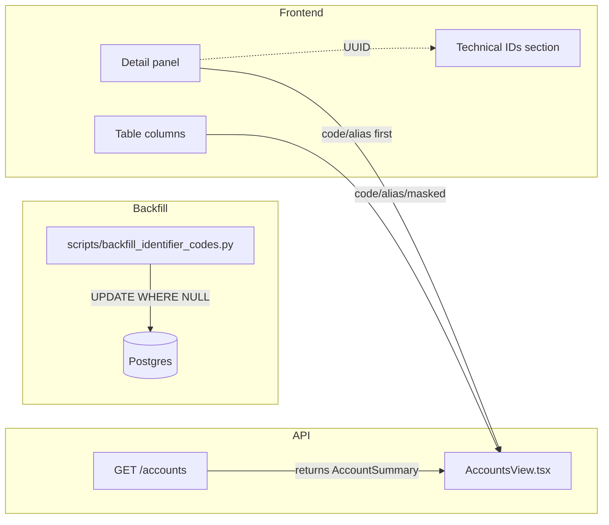
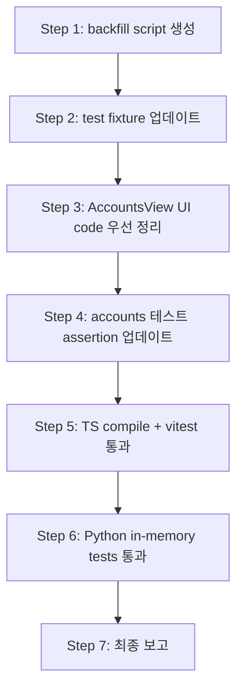

# Identifier Code Backfill + UI 정리 Plan

## 1. 배경

- `broker_account_code` / `account_code` 컬럼은 [`0010_add_identifier_codes.sql`](../db/migrations/0010_add_identifier_codes.sql)에서 nullable로 추가됨
- 기존 DB row는 NULL → Admin UI에서 code 필드가 `—`로 표시됨
- 또한 detail panel에서 UUID가 기본 노출되어 code 중심 표시 원칙에 어긋남

## 2. 두 가지 작업

| # | 작업 | 설명 |
|---|------|------|
| A | Backfill | 기존 row에 `broker_account_code`, `account_code` 채우기 |
| B | UI 정리 | Accounts 화면에서 UUID 기본 노출 제거, code/alias/masked 중심으로 변경 |

---

## 작업 A: Backfill

### 방식: One-off Python Script

[`scripts/backfill_identifier_codes.py`](../scripts/backfill_identifier_codes.py)

- `--dry-run` 지원 (영향 row 수만 출력, UPDATE 없음)
- `WHERE ... IS NULL` 조건으로 idempotent 보장
- 기존 [`scripts/sync_kis_snapshots.py`](../scripts/sync_kis_snapshots.py) 패턴 따름

### broker_account_code 규칙

```
{BROKER_SHORT}-{ENV}-****{ACCOUNT_REF_LAST4}
```

명시적 broker short-code 매핑:

| broker_name | short_code |
|-------------|-----------|
| `KoreaInvestment` | `KIS` |
| `kis` | `KIS` |
| 그 외 | `broker_name[:4].upper()` fallback |

**SQL 로직 (예외 처리 포함):**
```sql
UPDATE trading.broker_accounts
SET broker_account_code =
    CASE
        WHEN LOWER(broker_name) = 'koreainvestment' THEN 'KIS'
        ELSE UPPER(LEFT(broker_name, 4))
    END
    || '-' || UPPER(environment)
    || '-****' ||
    CASE
        WHEN LENGTH(account_ref) >= 4 THEN RIGHT(account_ref, 4)
        ELSE LPAD(account_ref, 4, '0')  -- 4자리 미만이면 왼쪽 0패딩
    END
WHERE broker_account_code IS NULL;
```

### account_code 규칙

```
{CLIENT_CODE}-{ENV}-{ALIAS_FIRST_WORD}
```

**SQL 로직:**
```sql
UPDATE trading.accounts a
SET account_code =
    c.client_code || '-'
    || UPPER(a.environment) || '-'
    || UPPER(SPLIT_PART(REGEXP_REPLACE(a.account_alias, '[^a-zA-Z가-힣 ]', '', 'g'), ' ', 1))
FROM trading.clients c
WHERE a.client_id = c.client_id
  AND a.account_code IS NULL;
```

> `REGEXP_REPLACE`로 특수문자/숫자 prefix 제거 후 첫 단어 추출

### 충돌/예외 처리

**broker_account_code 충돌:** 동일 broker_name + environment + account_ref_last4 조합은 본질적으로 동일 계정이므로 충돌 가능성 낮음.

**account_code 충돌:** 동일 `client_code` + `environment` 내에서 `account_alias` 첫 단어가 중복될 가능성 존재. 해결 방안:
- 중복 시 suffix로 `account_alias` 두 번째 단어 첫 글자 추가 (예: `CLIENT1-PAPER-MY-A`, `CLIENT1-PAPER-MY-B`)
- SQL UPDATE는 `CASE WHEN` 또는 서브쿼리로 처리 가능하나, 복잡도 증가
- **대안: SQL UPDATE에서는 단순 규칙 적용 후, 중복 시 application/seed 레벨에서 수동 조정**
- 현재 seed/test 데이터에서는 중복 없음

### Script 상세

```python
# scripts/backfill_identifier_codes.py
# Usage:
#   python scripts/backfill_identifier_codes.py          # 실제 실행
#   python scripts/backfill_identifier_codes.py --dry-run # 미리보기

async def backfill_broker_account_codes(tx, dry_run: bool) -> int
async def backfill_account_codes(tx, dry_run: bool) -> int

async def main():
    parser = argparse.ArgumentParser()
    parser.add_argument("--dry-run", action="store_true")
    args = parser.parse_args()

    async with transaction() as tx:
        broker_count = await backfill_broker_account_codes(tx, args.dry_run)
        account_count = await backfill_account_codes(tx, args.dry_run)
        if not args.dry_run:
            await tx.commit()
        logger.info("Broker accounts: %d updated", broker_count)
        logger.info("Accounts: %d updated", account_count)
```

---

## 작업 B: UI 정리

### 현재 상태 (`AccountsView.tsx`)

**Table columns (기본 목록):**
1. Account — `account_alias` (tooltip: `account_masked`)
2. Account # — `broker_account_ref` or `account_masked`
3. Env
4. Status

**Detail panel (Account Metadata 섹션):**
1. Account # — `broker_account_ref` or `account_masked`
2. Alias — `account_alias`
3. Environment
4. Status
5. Broker Ref — `broker_account_ref`
6. Broker Code — `broker_account_code` (NEW)
7. Account Code — `account_code` (NEW)
8. Account ID — `truncateUuid(account_id)` ← UUID 기본 노출

### 변경 후 레이아웃

**Table columns 변경:**
1. Account — `account_code \| account_alias \| account_masked` (code 우선)
2. Account # — `broker_account_code \| broker_account_ref` (code 우선)
3. Env
4. Status

**Detail panel 변경 (code/alias/masked 우선):**
```html
<dl class="grid grid-cols-2 gap-4">
  <!-- 상단: 사람이 읽는 정보 -->
  <div> Account Code </div>     <!-- account_code (primary) -->
  <div> Alias </div>            <!-- account_alias -->
  <div> Account # </div>        <!-- account_masked -->
  <div> Broker Code </div>      <!-- broker_account_code -->
  <div> Broker Ref </div>       <!-- broker_account_ref (원본 ref) -->
  <div> Environment </div>
  <div> Status </div>
</dl>

<!-- 하단: Technical IDs 섹션 (축소/회색/작은 글씨) -->
<div class="mt-6 pt-4 border-t border-[#e2e8f0]">
  <h4 class="text-xs font-medium text-[#94a3b8] uppercase tracking-wider mb-2">
    Technical IDs
  </h4>
  <dl class="grid grid-cols-3 gap-3">
    <div> Account ID — truncated UUID </div>
    <div> Broker Account ID — truncated UUID </div>
    <div> Client ID — truncated UUID </div>
  </dl>
</div>
```

### 변경이 필요한 테스트 파일

기존 테스트 (accounts.test.tsx)에서 UUID 표시 여부를 검증하는 assertion이 있다면 변경 필요. 다음 항목 확인:
- `accounts.test.tsx` — detail panel에서 UUID truncation 검증하는 부분
- `AccountsView.test.tsx` — 전체 assertion

---

## 3. 전체 변경 파일 목록

| # | 파일 | 변경 내용 |
|---|------|----------|
| 1 | [`scripts/backfill_identifier_codes.py`](../scripts/backfill_identifier_codes.py) | **신규** — backfill one-off script |
| 2 | [`admin_ui/src/components/AccountsView.tsx`](../admin_ui/src/components/AccountsView.tsx) | table columns + detail panel code 우선, UUID Technical IDs 섹션 분리 |
| 3 | [`tests/conftest.py`](../tests/conftest.py) | `seeded_postgres_data`에 broker_account_code 추가 |
| 4 | [`tests/repositories/test_postgres_broker_accounts.py`](../tests/repositories/test_postgres_broker_accounts.py) | `sample_broker_account` 외 4곳에 broker_account_code 추가 |
| 5 | [`tests/repositories/test_postgres_decision_contexts.py`](../tests/repositories/test_postgres_decision_contexts.py) | `seeded_decision_context_deps`에 broker_account_code 추가 |
| 6 | [`tests/integration/test_long_path_e2e.py`](../tests/integration/test_long_path_e2e.py) | broker_account seed에 broker_account_code 추가 |
| 7 | [`tests/integration/test_orchestrator_entrypoint.py`](../tests/integration/test_orchestrator_entrypoint.py) | 확인 후 broker_account_code 추가 |
| 8 | [`tests/smoke/test_paper_loop_postgres.py`](../tests/smoke/test_paper_loop_postgres.py) | 확인 후 broker_account_code 추가 |
| 9 | [`admin_ui/src/__tests__/accounts.test.tsx`](../admin_ui/src/__tests__/accounts.test.tsx) | UI 변경 반영 (UUID 관련 assertion 변경) |

---

## 4. Mermaid: Data Flow



---

## 5. 위험 평가

| 위험 | 완화 |
|------|------|
| Script broker_name 매핑 누락 | `CASE WHEN` + `UPPER(LEFT(...))` fallback; dry-run 검증 |
| account_alias 첫 단어 추출 오류 | `REGEXP_REPLACE`로 특수문자 제거 후 `SPLIT_PART` |
| UI 변경으로 기존 테스트 실패 | 사전 확인 후 assertion 업데이트 |
| UUID 완전 제거로 디버깅 어려움 | Technical IDs 섹션에서 truncated UUID + tooltip 전체 UUID로 보존 |

---

## 6. TODO


