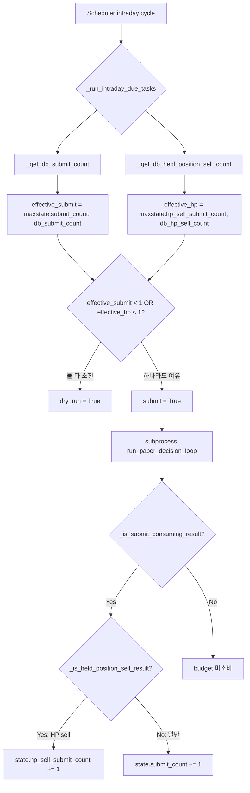

# BUY 보수 유지 + Held_position REDUCE/EXIT sell 우선 허용 — Submit Budget 재설계

- **작성일**: 2026-05-20
- **상태**: 초안 (Architect 분석 완료, 구현 전)
- **관련 문서**:
  - [`scripts/run_near_real_ops_scheduler.py`](../../scripts/run_near_real_ops_scheduler.py)
  - [`scripts/run_paper_decision_loop.py`](../../scripts/run_paper_decision_loop.py)
  - [`tests/scripts/test_run_near_real_ops_scheduler.py`](../../tests/scripts/test_run_near_real_ops_scheduler.py)
  - [`tests/scripts/test_run_paper_decision_loop.py`](../../tests/scripts/test_run_paper_decision_loop.py)
  - [`db/migrations/0004_expand_trade_decision.sql`](../../db/migrations/0004_expand_trade_decision.sql)
  - [`db/migrations/0013_add_source_type_to_trade_decisions.sql`](../../db/migrations/0013_add_source_type_to_trade_decisions.sql)

---

## 1. 분석

### 1.1 현재 budget 정책

| 항목 | 상수 | 값 | 사용처 |
|------|------|-----|--------|
| 일반 submit (BUY 포함) | `DEFAULT_MAX_SUBMIT_PER_DAY` | 1 | [`run_near_real_ops_scheduler.py:90`](../../scripts/run_near_real_ops_scheduler.py:90) |
| held_position sell | `HELD_POSITION_SELL_MAX_PER_DAY` | 1 | [`run_near_real_ops_scheduler.py:93`](../../scripts/run_near_real_ops_scheduler.py:93) |

### 1.2 현재 budget 흐름도



### 1.3 현재 budget 정책의 한계

1. **held_position sell이 일반 BUY와 동일한 1건/일로 제한**: 위험 축소 목적의 REDUCE/EXIT sell이 BUY와 동일한 예산을 공유하거나, 별도 budget이 1건으로 너무 적음.
2. **scheduler와 decision loop 간 budget 정책 이중화**: scheduler는 `_run_intraday_due_tasks`에서 budget을 관리하고, decision loop는 `_process_one`에서 `submit_budget_consumed` / `held_position_sell_budget_consumed` 플래그로 관리.
   - Scheduler: 일당 예산(max_per_day)만 체크
   - Decision loop: cycle당 budget 소비 플래그 (1회만 허용) — 단, 현재는 두 곳 모두 1건으로 동일
3. **같은 종목 중복 held_position sell 방지 없음**: 동일 종목에 대해 여러 cycle에서 중복으로 REDUCE/EXIT submit이 발생할 수 있음.
4. **cycle당 cap 부재**: scheduler `_run_intraday_due_tasks`는 cycle 단위로 실행되지만 budget 소비 후에도 1회 submit이 발생함. cycle당 2건 이상이 필요한 경우 고려되지 않음.

### 1.4 최근 decision/order 분포 (추정)

Phase 1에서 held_position sell lane 조건이 3중 조건(source_type + decision_type + side)으로 축소 완료됨.
현재 운영 중인 포지션 수와 daily AI decision 결과에 따라 held_position sell 건수는 변동적.
BUY는 보수적 1건/일 유지가 적절.

---

## 2. 설계

### 2.1 정책 요약

```python
# ── 신규 진입 (BUY): 보수적 유지 ──
DEFAULT_MAX_SUBMIT_PER_DAY = 1       # 변경 없음

# ── 위험 축소 (held_position REDUCE/EXIT sell): 확장 ──
HELD_POSITION_SELL_MAX_PER_DAY = 5   # 1 → 5
HELD_POSITION_SELL_MAX_PER_CYCLE = 2 # 신규: cycle당 최대 2건
```

### 2.2 상세 정책 매트릭스

| 구분 | BUY (신규 진입) | held_position REDUCE/EXIT sell |
|------|----------------|-------------------------------|
| 일당 최대 건수 | 1 (현행 유지) | 5 (확장) |
| cycle당 최대 건수 | 1 (암묵적) | 2 (신규) |
| 같은 종목 중복 금지 | 해당 없음 (1건) | 적용 (DB 기반 dedupe) |
| crash-safe | DB 기반 카운트 유지 | DB 기반 카운트 유지 |
| 예산 실패 fallback | `DEFAULT_MAX_SUBMIT_PER_DAY` 반환 | 0 반환 (변경 없음) |
| budget 소비 판정 | status=SUBMITTED | 3중 조건 + status=SUBMITTED |

### 2.3 설계 흐름도

```mermaid
flowchart TD
    subgraph "Scheduler _run_intraday_due_tasks"
        A[cycle 시작] --> B[_get_db_submit_count]
        A --> C[_get_db_held_position_sell_count]
        B --> D[effective_submit = maxstate.submit_count, db_submit]
        C --> E[effective_hp = maxstate.hp_sell_count, db_hp_sell]
        D --> F{effective_submit < 1?}
        E --> G{effective_hp < 5?}
        F -->|No| H[일반 budget 소진]
        G -->|No| I[HP sell budget 소진]
        H --> J{HP sell 여유?}
        I --> K{일반 여유?}
        J -->|Yes| L[submit mode: HP sell 전용]
        J -->|No| M[dry_run]
        K -->|Yes| N[submit mode: 일반 전용]
        K -->|No| M
        F -->|Yes| G
        L --> O[subprocess 실행]
        N --> O
        O --> P{_is_submit_consuming_result?}
        P -->|Yes| Q{_is_held_position_sell_result?}
        Q -->|Yes| R[hp_sell count += 1]
        Q -->|No| S[일반 count += 1]
        P -->|No| T[budget 미소비]
    end

    subgraph "Decision Loop _process_one"
        U[symbol item] --> V{source_type == held_position?}
        V -->|Yes| W{hp_sell_budget_consumed < 2?}
        V -->|No| X{submit_budget_consumed?}
        W -->|Yes| Y[symbol_submit = True]
        W -->|No| Z[symbol_dry_run]
        X -->|Yes| Y
        X -->|No| Z
        Y --> AA[실행 -> 결과]
        AA --> AB{SUBMITTED + HP sell?}
        AB -->|Yes| AC[hp_sell_count += 1]
        AB -->|No, 일반| AD[submit_budget_consumed = True]
    end
```



### 2.4 주요 설계 결정

#### 2.4.1 cycle당 cap 구현 방식

**결정**: `SchedulerState`에 `held_position_sell_cycle_submit_count` 필드 추가
- `_run_intraday_due_tasks`가 호출될 때마다 cycle 단위로 실행되므로, cycle 시작 시 `hp_sell_cycle_count = 0`으로 초기화
- 같은 cycle 내에서 submit 결과가 HP sell이면 `hp_sell_cycle_count += 1`
- `hp_sell_cycle_count >= HELD_POSITION_SELL_MAX_PER_CYCLE`이면 같은 cycle에서 추가 HP sell 차단

**대안 검토**: Decision loop에서 cycle당 cap을 관리하는 방식
- Decision loop `_process_one`은 `asyncio.gather`로 병렬 실행되므로 순서 제어가 어려움
- scheduler가 subprocess를 호출하는 구조이므로, decision loop 내 cap은 의미가 없음 (scheduler가 cycle당 1회만 subprocess 호출)

**최종 결론**: Scheduler에서 cycle당 cap 관리. 단, scheduler의 cycle은 intraday task 1회 실행 단위이므로, subprocess가 여러 건의 HP sell을 반환할 수 있음 → subprocess stdout에서 HP sell 건수를 파싱하여 cycle cap 적용.

#### 2.4.2 symbol dedupe 구현 방식

**결정**: DB 쿼리 `_get_db_held_position_sell_count`에 symbol DISTINCT 카운트 추가
- 현재 쿼리는 COUNT(*)로 단순 합계를 반환
- `COUNT(DISTINCT td.symbol)`로 중복 제거된 종목 수를 함께 반환
- Scheduler의 budget 분기에서: `total_count < 5 AND distinct_symbol_count < len(held_positions)` 조건으로 판별

**또는 (단순화된 대안)**: DB 쿼리는 변경하지 않고, symbol dedupe은 decision loop의 `_process_one`에서 이미 `source_type == held_position` 항목에 대해 한 cycle에 1건만 허용하므로, 일중 중복은 scheduler 차원에서만 방지하면 됨.

**최종 결론**: 
- DB 쿼리: `COUNT(*)` → `COUNT(*) AS total, COUNT(DISTINCT td.symbol) AS distinct_symbols`로 변경
- Scheduler의 `_run_intraday_due_tasks`: `effective_hp < 5` AND (distinct_symbols가 전체 held_position 종목 수 미만) 조건으로 symbol 중복 submit 차단
- 단, 순수하게 per-day total만 5건으로 제한하고 symbol dedupe은 DB 쿼리에서 이미 JOIN으로 해결된 부분이 있으므로, **가장 단순한 접근**: DB 쿼리에서 `COUNT(DISTINCT td.symbol)`로 distinct symbol 수를 반환하고, budget 소비 시점에 이미 submit된 symbol 목록을 추적

#### 2.4.3 crash/restart safety

- `_get_db_held_position_sell_count`는 이미 crash-safe: crash 후 재시작 시 DB에서 오늘의 HP sell count를 조회
- 새로 추가되는 `held_position_sell_cycle_submit_count`는 in-memory이므로 crash 시 소멸 → crash 후 재시작 시 DB 조회로 복원
- cycle당 cap은 crash 후 재시작되는 cycle에서 초기화되므로 안전

---

## 3. 구현 계획

### 3.1 변경할 상수

**파일**: [`scripts/run_near_real_ops_scheduler.py`](../../scripts/run_near_real_ops_scheduler.py)

```python
# 93번째 줄: 1 → 5
HELD_POSITION_SELL_MAX_PER_DAY = 5

# 신규 추가 (LINE 94 부근)
HELD_POSITION_SELL_MAX_PER_CYCLE = 2
```

### 3.2 SchedulerState 확장

**파일**: [`scripts/run_near_real_ops_scheduler.py`](../../scripts/run_near_real_ops_scheduler.py), `SchedulerState` 클래스 (LINE 151)

```python
# 신규 필드 추가
held_position_sell_cycle_submit_count: int = 0  # cycle당 HP sell 건수
```

### 3.3 `_run_intraday_due_tasks` 수정

**파일**: [`scripts/run_near_real_ops_scheduler.py`](../../scripts/run_near_real_ops_scheduler.py), LINE 818

변경 사항:
1. cycle 시작 시 `state.held_position_sell_cycle_submit_count = 0`으로 초기화 (또는 함수 진입 시점)
2. `_get_db_held_position_sell_count` 반환값을 `(total_count, distinct_symbol_count)` 튜플로 변경
3. budget 분기 로직에 cycle당 cap 조건 추가: `effective_hp_sell_cycle < HELD_POSITION_SELL_MAX_PER_CYCLE`
4. budget 소비 후 cycle count 증가: `state.held_position_sell_cycle_submit_count += 1`

**변경 후 budget 분기 로직 (Pseudocode)**:

```python
# cycle 시작 시 초기화
state.held_position_sell_cycle_submit_count = 0

# ... (snapshot, event task 실행) ...

if tasks["decision"].due(now):
    db_submit_count = await _get_db_submit_count(state.run_date)
    effective_submit_count = max(state.submit_count, db_submit_count)
    
    # HP sell: total + distinct symbol + cycle cap
    db_hp_sell_total, db_hp_sell_distinct = await _get_db_held_position_sell_count(state.run_date)
    effective_hp_sell_total = max(state.held_position_sell_submit_count, db_hp_sell_total)
    
    general_budget_ok = effective_submit_count < DEFAULT_MAX_SUBMIT_PER_DAY  # 1
    hp_sell_budget_ok = (
        effective_hp_sell_total < HELD_POSITION_SELL_MAX_PER_DAY  # 5
        and state.held_position_sell_cycle_submit_count < HELD_POSITION_SELL_MAX_PER_CYCLE  # 2
    )
    dry_run = not general_budget_ok and not hp_sell_budget_ok
    
    # ... submit 실행 ...
    
    if not dry_run and _is_submit_consuming_result(result):
        if _is_held_position_sell_result(result):
            state.held_position_sell_submit_count += 1
            state.held_position_sell_cycle_submit_count += 1
        else:
            state.submit_count += 1
```

### 3.4 `_get_db_held_position_sell_count` 수정

**파일**: [`scripts/run_near_real_ops_scheduler.py`](../../scripts/run_near_real_ops_scheduler.py), LINE 420

```python
# 변경 전
row = await conn.fetchrow("""
    SELECT COUNT(*) AS cnt
    FROM ...
""")
count: int = row["cnt"] if row else 0

# 변경 후
row = await conn.fetchrow("""
    SELECT COUNT(*) AS total, COUNT(DISTINCT td.symbol) AS distinct_symbols
    FROM trading.order_requests o
    JOIN trading.trade_decisions td ON o.trade_decision_id = td.trade_decision_id
    WHERE o.created_at >= $1
      AND o.created_at < $2
      AND o.status = ANY($3::text[])
      AND td.source_type = 'held_position'
      AND td.decision_type IN ('reduce', 'exit')
      AND td.side = 'sell'
""")
total: int = row["total"] if row else 0
distinct_symbols: int = row["distinct_symbols"] if row else 0
return (total, distinct_symbols)  # 튜플 반환
```

**영향**: 이 함수를 호출하는 모든 곳에서 반환값 처리 방식 변경 필요.

- `_run_intraday_due_tasks`: `db_hp_sell_total, db_hp_sell_distinct = await _get_db_held_position_sell_count(...)`
- `test_db_hp_sell_count_failure_returns_zero`: 실패 시 `(0, 0)` 반환 확인
- `test_effective_hp_sell_count_logic`: 튜플 언패킹 적용

### 3.5 decision loop `_process_one` 수정

**파일**: [`scripts/run_paper_decision_loop.py`](../../scripts/run_paper_decision_loop.py), LINE 1107

변경 사항:
1. `held_position_sell_budget_consumed` → `held_position_sell_budget_consumed_count: int = 0` (boolean → integer)
2. HP sell lane 조건: `held_position_sell_budget_consumed_count < HELD_POSITION_SELL_MAX_PER_CYCLE`
3. budget 소비 시: `held_position_sell_budget_consumed_count += 1`

**참고**: Decision loop의 `HELD_POSITION_SELL_MAX_PER_CYCLE`은 scheduler의 것과 동일한 값을 사용. 중복 상수 선언보다는 scheduler의 상수를 import하거나, 별도 상수로 관리.

```python
# 변경 전
held_position_sell_budget_consumed = False
# ...
if is_held_position_item:
    symbol_submit = submit and not dry_run and not held_position_sell_budget_consumed
# ...
held_position_sell_budget_consumed = True

# 변경 후
_HELD_POSITION_SELL_MAX_PER_CYCLE = 2  # scheduler 상수와 동기화
held_position_sell_budget_consumed_count = 0
# ...
if is_held_position_item:
    symbol_submit = (
        submit and not dry_run
        and held_position_sell_budget_consumed_count < _HELD_POSITION_SELL_MAX_PER_CYCLE
    )
# ...
held_position_sell_budget_consumed_count += 1
```

### 3.6 로그 explainability 개선

**파일**: [`scripts/run_near_real_ops_scheduler.py`](../../scripts/run_near_real_ops_scheduler.py), LINE 818-903 (`_run_intraday_due_tasks`)

```python
# 변경 전
logger.warning(
    "held_position sell submit budget consumed: "
    "hp_sell_count=%d db_hp_sell_count=%d "
    "effective_hp=%d max_hp=%d",
    state.held_position_sell_submit_count,
    db_hp_sell_count,
    effective_hp_sell_count,
    held_position_sell_max_per_day,
)

# 변경 후
logger.warning(
    "held_position sell submit budget consumed: "
    "hp_sell_count=%d db_hp_sell_total=%d db_hp_sell_distinct=%d "
    "effective_hp=%d max_hp=%d cycle_count=%d max_cycle=%d",
    state.held_position_sell_submit_count,
    db_hp_sell_total,
    db_hp_sell_distinct,
    effective_hp_sell_total,
    held_position_sell_max_per_day,
    state.held_position_sell_cycle_submit_count,
    HELD_POSITION_SELL_MAX_PER_CYCLE,
)
```

**추가 로그**: cycle 시작 시 budget 상태 로그

```python
logger.info(
    "Intraday budget status: general=%d/%d hp_sell=%d/%d (cycle=%d/%d, distinct_symbols=%d)",
    effective_submit_count, DEFAULT_MAX_SUBMIT_PER_DAY,
    effective_hp_sell_total, HELD_POSITION_SELL_MAX_PER_DAY,
    state.held_position_sell_cycle_submit_count, HELD_POSITION_SELL_MAX_PER_CYCLE,
    db_hp_sell_distinct,
)
```

### 3.7 CLI 인자

**파일**: [`scripts/run_near_real_ops_scheduler.py`](../../scripts/run_near_real_ops_scheduler.py), LINE 1637-1643

```python
# --max-submit-per-day (변경 없음)
parser.add_argument("--max-submit-per-day", type=int, default=1)

# --held-position-sell-max-per-day (기본값 1 → 5)
parser.add_argument(
    "--held-position-sell-max-per-day",
    type=int,
    default=HELD_POSITION_SELL_MAX_PER_DAY,  # 5
    help="Max held_position REDUCE/EXIT sell submits per day (별도 budget).",
)

# 신규: --held-position-sell-max-per-cycle
parser.add_argument(
    "--held-position-sell-max-per-cycle",
    type=int,
    default=HELD_POSITION_SELL_MAX_PER_CYCLE,  # 2
    help="Max held_position REDUCE/EXIT sell submits per scheduler cycle.",
)
```

### 3.8 `_log_summary` 업데이트

**파일**: [`scripts/run_near_real_ops_scheduler.py`](../../scripts/run_near_real_ops_scheduler.py), LINE 933

```python
# 추가 로그 필드
logger.info("  hp_sell_cycle_count  : %d", state.held_position_sell_cycle_submit_count)
```

---

## 4. 안전장치

### 4.1 과잉 매도 방지 대책

| 안전장치 | 설명 | 구현 위치 |
|----------|------|-----------|
| 일당 최대 5건 | 하루에 최대 5건의 HP sell만 허용 | `_run_intraday_due_tasks` |
| cycle당 최대 2건 | 한 cycle에서 최대 2건의 HP sell만 허용 | `_run_intraday_due_tasks` + `_process_one` |
| 같은 종목 중복 금지 | 이미 submit된 종목에 대해 추가 submit 차단 | DB 쿼리 `COUNT(DISTINCT td.symbol)` |
| DB 기반 crash-safe | crash 후 재시작 시 DB 조회로 상태 복원 | `_get_db_held_position_sell_count` |
| fallback: 실패 시 0 반환 | DB 조회 실패 시 budget을 소비하지 않은 것으로 간주 | `_get_db_held_position_sell_count` exception handler |
| dry-run 모드 | budget 소진 시 자동 dry-run 전환 | `_run_intraday_due_tasks` dry_run flag |

### 4.2 이상 징후 감지 로그

- budget 소진 시점에 WARNING 로그 (이미 구현됨)
- cycle당 HP sell cap 초과 시도 감지 로그 추가
- symbol dedupe 충돌 시 감지 로그 추가

---

## 5. 테스트 계획

### 5.1 기존 테스트 유지/수정

| 테스트 클래스 | 변경 사항 |
|---------------|-----------|
| `TestHeldPositionSellBudget.test_held_position_sell_max_per_day_constant` | 단언문 `== 1` → `== 5` |
| `TestHeldPositionSellBudget.test_parse_args_hp_sell_max_per_day_custom` | 변경 없음 (커스텀 값 테스트이므로) |
| `TestHeldPositionSellBudget.test_effective_hp_sell_count_logic` | 튜플 반환에 맞게 수정 |
| `TestHeldPositionSellBudget.test_db_hp_sell_count_failure_returns_zero` | `count == 0` → `count == (0, 0)` |
| `TestHeldPositionSellBudget.test_general_and_hp_sell_budget_independent` | max_hp = 5로 변경하여 시나리오 재조정 |

### 5.2 신규 테스트

#### `test_run_near_real_ops_scheduler.py`新增

1. **`test_held_position_sell_max_per_cycle_constant`**: `HELD_POSITION_SELL_MAX_PER_CYCLE == 2` 확인
2. **`test_scheduler_state_has_hp_sell_cycle_count`**: `SchedulerState.held_position_sell_cycle_submit_count` 필드 존재 및 초기값 0 확인
3. **`test_hp_sell_cycle_cap_enforced`**: Mock subprocess 결과로 3건의 HP sell을 반환했을 때 cycle cap(2)이 적용되는지 검증
4. **`test_db_hp_sell_distinct_symbol_count`**: `_get_db_held_position_sell_count`가 `(total, distinct)` 튜플 반환 확인
5. **`test_hp_sell_symbol_dedupe`**: 같은 symbol로 중복 HP sell submit 시도 시 차단되는지 검증
6. **`test_parse_args_hp_sell_max_per_cycle`**: `--held-position-sell-max-per-cycle` CLI 인자 파싱 검증
7. **`test_intraday_budget_status_log`**: budget 상태 로그에 cycle cap 정보 포함 확인
8. **`test_general_and_hp_sell_budget_independent_with_cycle_cap`**: 일반 budget 소진 + HP sell cycle cap 도달 등 복합 시나리오 검증

#### `test_run_paper_decision_loop.py`新增

1. **`test_hp_sell_budget_cycle_count`**: Decision loop `_process_one`에서 `held_position_sell_budget_consumed_count`가 integer로 증가하는지 검증
2. **`test_hp_sell_max_per_cycle_in_decision_loop`**: 동일 cycle 내 3개 held_position 항목 중 2개만 submit되는지 검증
3. **`test_general_submit_and_hp_sell_mixed_cycle`**: 일반 submit 1건 + HP sell 2건이 동시에 발생할 수 있는지 검증

### 5.3 통합 테스트

1. **Cycle rollover 시 cycle count 초기화**: 새 cycle에서 `held_position_sell_cycle_submit_count`가 0으로 리셋되는지 검증
2. **Crash 후 재시작 시 DB 복원**: `_get_db_held_position_sell_count`가 DB에서 올바른 total/distinct를 반환하는지 검증
3. **Symbol dedupe boundary test**: 5개 다른 종목의 HP sell + 6번째 종목 시도 시 차단 확인

---

## 6. Todo (실행 계획)

### Phase 0: 분석 (완료 ✅)

- [x] `DEFAULT_MAX_SUBMIT_PER_DAY` 상수 분석
- [x] `HELD_POSITION_SELL_MAX_PER_DAY` 상수 분석
- [x] `SchedulerState` budget 카운터 필드 분석
- [x] `_run_intraday_due_tasks` budget 분기 로직 분석
- [x] `_get_db_submit_count` / `_get_db_held_position_sell_count` DB 쿼리 분석
- [x] `_process_one` decision loop budget 로직 분석
- [x] 테스트 현황 분석

### Phase 1: 구현

- [ ] `HELD_POSITION_SELL_MAX_PER_DAY` = 1 → 5 변경
- [ ] `HELD_POSITION_SELL_MAX_PER_CYCLE = 2` 상수 신규 추가
- [ ] `SchedulerState`에 `held_position_sell_cycle_submit_count` 필드 추가
- [ ] `_get_db_held_position_sell_count` → `(total, distinct_symbols)` 튜플 반환으로 변경
- [ ] `_run_intraday_due_tasks` budget 분기 로직에 cycle당 cap 조건 추가
- [ ] Decision loop `_process_one` → `held_position_sell_budget_consumed` boolean → integer 카운터로 변경
- [ ] CLI `--held-position-sell-max-per-cycle` 인자 추가
- [ ] `_log_summary`에 cycle count 로그 추가
- [ ] Budget 상태 로그 explainability 개선

### Phase 2: 테스트

- [ ] 기존 테스트 단언문 업데이트 (max_hp 1→5, 튜플 반환)
- [ ] cycle cap 관련 신규 테스트 추가
- [ ] symbol dedupe 관련 테스트 추가
- [ ] decision loop budget 테스트 추가
- [ ] 통합 테스트 추가

### Phase 3: 배포/검증

- [ ] `--once` 모드 smoke test
- [ ] 운영 환경 배포 전 코드 리뷰
- [ ] 로그 모니터링으로 budget 정책 정상 작동 확인

### Phase 4: 보고서

- [ ] 정책 변경 영향도 요약
- [ ] 모니터링 메트릭 정의
- [ ] 필요시 rollback 계획 수립

---

## 부록: DB 쿼리 최적화 참고

현재 `_get_db_held_position_sell_count`는 `COUNT(DISTINCT td.symbol)`을 추가해도 실행 계획에 큰 영향을 주지 않음.
`trade_decisions` 테이블에는 이미 `idx_trade_decisions_strategy_symbol` 인덱스가 존재하므로 symbol DISTINCT는 인덱스 범위 스캔으로 처리 가능.

```sql
EXPLAIN ANALYZE
SELECT COUNT(*) AS total, COUNT(DISTINCT td.symbol) AS distinct_symbols
FROM trading.order_requests o
JOIN trading.trade_decisions td ON o.trade_decision_id = td.trade_decision_id
WHERE o.created_at >= $1
  AND o.created_at < $2
  AND o.status = ANY($3::text[])
  AND td.source_type = 'held_position'
  AND td.decision_type IN ('reduce', 'exit')
  AND td.side = 'sell';
```
