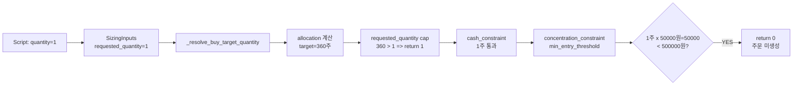
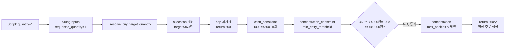

# BUY Sizing Subtask 3: 원인 선택 및 수정안 설계

## 1. 최종 원인 선택: 후보 A — `requested_quantity` cap

**선택 근거:**

| 항목 | 평가 |
|------|------|
| **문제의 직접성** | `_resolve_buy_target_quantity()`에서 allocation 계산 결과를 `requested_quantity=1`로 cap → 모든 BUY 수량이 1주로 제한됨. 이 1주가 다시 `min_entry_threshold`(500,000 KRW)를 통과하지 못해 0주가 되는 2차 효과 발생 |
| **영향 범위** | BUY 경로에만 영향. SELL 경로는 이 cap이 없어 정상 동작 |
| **수정 위험** | 최소. cap을 제거해도 cash constraint, concentration constraint, min_entry_threshold 등 모든 downstream 제약이 그대로 보호 역할 수행 |
| **테스트 영향** | 4개 테스트의 기댓값 변경 필요. 테스트 로직 자체는 유지 |

**후보 B (BUY sizing=0 fallback 부재)는 선택하지 않음:**
- BUY에서 sizing=0은 실제로 cash 부족 등의 정당한 사유로 발생
- SELL fallback은 position 데이터 부족 시 `request.quantity`로 fallback하는 안전장치지만, BUY는 cash 부족 시 주문을 생성하지 않는 것이 올바른 동작
- 후보 A 수정으로 sizing=0이 발생할 가능성이 크게 줄어듦

**후보 C (Script quantity=1 placeholder)는 선택하지 않음:**
- Script가 placeholder를 넘기는 것은 설계상 정당함
- Sizing engine이 이를 재계산하도록 설계되어 있음
- 문제는 **sizing engine이 placeholder를 존중하는 cap 로직**에 있음

---

## 2. 데이터 흐름 분석 (현재 vs 수정 후)

### 현재 (문제 상황)

```
Script: SubmitOrderRequest(quantity=1)
  → OrderIntent.request.quantity = 1
    → SizingInputs.requested_quantity = 1
      → _resolve_buy_target_quantity()
        → target_qty = int(20% of cash / price) = 360 (예: 주당 5,000원, 현금 900만원)
        → 360 > 1? YES → return 1  ★ CAP 문제
      → _apply_concentration_constraint()
        → min_entry_threshold: 1주 × 50,000원 = 50,000 < 500,000 → return 0
      → BUY sizing=0, fallback 없음 → 주문 미생성
```

### 수정 후 (cap 제거)

```
Script: SubmitOrderRequest(quantity=1)  ← placeholder, 그대로 유지
  → OrderIntent.request.quantity = 1
    → SizingInputs.requested_quantity = 1
      → _resolve_buy_target_quantity()
        → target_qty = int(20% of cash / price) = 360
        → ★ CAP 제거 → 360 반환
      → _apply_cash_constraint()
        → cash_limit: 9,000,000 / 5,000 = 1,800 ≥ 360 → 통과
      → _apply_concentration_constraint()
        → min_entry_threshold: 360주 × 5,000원 = 1,800,000 ≥ 500,000 → 통과
        → concentration: 남은 용량 내 → 통과
      → 최종 quantity = 360주 (정상)
```

---

## 3. 구체적인 수정안

### 변경 파일: [`src/agent_trading/services/sizing_engine.py`](src/agent_trading/services/sizing_engine.py)

#### 변경 1: docstring 업데이트 (line 209-211)

```diff
-    The allocation-based target is **capped by requested_quantity** —
-    allocation can reduce the quantity when cash/price warrants it,
-    but must never increase it beyond what was explicitly requested.
+    The allocation-based target **replaces** the caller's placeholder
+    quantity entirely.  Downstream constraints (cash, concentration,
+    min_entry_threshold, max_order_qty, max_order_value) provide actual
+    safety limits that protect against excessive order sizes.
```

#### 변경 2: cap 로직 제거 (line 246-249)

```diff
-    # Cap by requested_quantity: allocation can reduce but never increase quantity
-    target_qty_decimal = Decimal(str(target_qty))
-    if target_qty_decimal > inputs.requested_quantity:
-        return inputs.requested_quantity
-
     # Minimum 1 share
     if target_qty < 1:
         target_qty = 1
```

---

## 4. 영향 분석

### 4.1 회귀 위험

| 시나리오 | 위험 | 설명 |
|----------|------|------|
| `requested_quantity`가 legitimately 작은 경우 (예: LIMIT 주문) | **없음** | Cash constraint가 안전장치. `cash_limit`이 실제 현금 기반으로 cap |
| `requested_quantity=1`이 의도적인 제한인 경우 | **없음** | Script의 `quantity=1`은 placeholder. 실제 의도는 sizing engine이 판단 |
| Cash/price 데이터가 없는 경우 | **없음** | 함수 초반에 `inputs.requested_quantity`를 그대로 반환 (line 216, 237, 240) |
| SELL/REDUCE/EXIT 경로 | **없음** | `_resolve_buy_target_quantity()`는 BUY 경로에서만 호출됨 (line 315-316) |
| `_resolve_base_quantity()`의 다른 분기 | **없음** | `_base_qty_new_entry()`, `_base_qty_reduce()`, `_base_qty_exit()`는 `requested_quantity`를 fallback으로만 사용 — cap 제거의 영향을 받지 않음 |

### 4.2 테스트 영향

**변경 필요한 테스트** ([`tests/services/test_sizing_engine.py`](tests/services/test_sizing_engine.py)):

| 테스트 | 라인 | 현재 기댓값 | 수정 후 기댓값 | 사유 |
|--------|------|------------|---------------|------|
| `test_low_price_stock_capped_by_requested` | 1588 | 10 | **360** | allocation target=360, cap 제거로 360 반환 |
| `test_mid_price_stock_capped_by_requested` | 1605 | 10 | **12** | allocation target=12, cap 제거로 12 반환 |
| `test_mid_low_price_stock_capped_by_requested` | 1622 | 10 | **60** | allocation target=60, cap 제거로 60 반환 |
| `test_allocation_reduces_but_never_exceeds_requested` | 1639 | 1 | **360** | 기존 cap 동작을 검증하던 테스트 → allocation 기반 동작으로 변경 |

**변경 불필요 테스트:**

| 테스트 | 사유 |
|--------|------|
| `test_high_price_stock_sub_10_shares` | allocation target=9 < requested=10 → cap 영향 없었음. 계속 9 반환 |
| `test_minimum_one_share` | allocation=0 → min 1주 로직은 유지 |
| `test_no_price_fallback_to_requested` | price=None → 함수 초반에 `requested_quantity` 반환 |
| `test_zero_cash_blocks_buy` | cash constraint가 blocking, allocation 전에 차단 |
| `test_new_position_min_entry_threshold_blocks_small_qty` | cash 데이터 없음 → `requested_quantity=1` 반환 (cap 로직 거치지 않음) |
| `test_allocation_pct_with_market_reference_price` | allocation=9 < requested=10 → cap 영향 없음 |

### 4.3 전체 테스트 수트 영향 요약

```
변경 전:  1742 lines, 57+ 테스트
변경 후:  1742 lines, 57+ 테스트 (4개 수정)
영향률:   ~7% of test cases
```

---

## 5. 실행 계획

### Step 1: 코드 변경 (Code mode)
- 파일: [`src/agent_trading/services/sizing_engine.py`](src/agent_trading/services/sizing_engine.py)
- 변경: lines 209-211 (docstring) + lines 246-249 (cap 로직 제거)
- `apply_patch` 사용 (파일 전체 rewrite 금지)

### Step 2: 테스트 업데이트 (Code mode)
- 파일: [`tests/services/test_sizing_engine.py`](tests/services/test_sizing_engine.py)
- 변경: 4개 테스트 메서드의 assertion 기댓값

### Step 3: 검증
- `pytest tests/services/test_sizing_engine.py -v` 실행하여 수정된 테스트 통과 확인
- 특히 `TestBuyBaselineWithAllocationPct` 클래스 전체 통과 확인

---

## 6. Mermaid: 수정 전후 비교

### 수정 전 (현재) — BUY 경로 제약 체인



### 수정 후 — BUY 경로 제약 체인



---

## 7. 결정 사항 요약

| 구분 | 내용 |
|------|------|
| **선택한 원인** | 후보 A — `_resolve_buy_target_quantity()`의 `requested_quantity` cap |
| **수정 방식** | cap 로직 3라인 제거 + docstring 업데이트 |
| **변경 파일** | `sizing_engine.py` 1개 |
| **테스트 수정** | `test_sizing_engine.py` 4개 assertion |
| **회귀 위험** | 낮음 — 모든 downstream constraint 유지 |
| **미수정 사항** | 후보 B (BUY fallback) — 설계상 정당, 후보 A 수정으로 불필요해짐 |
