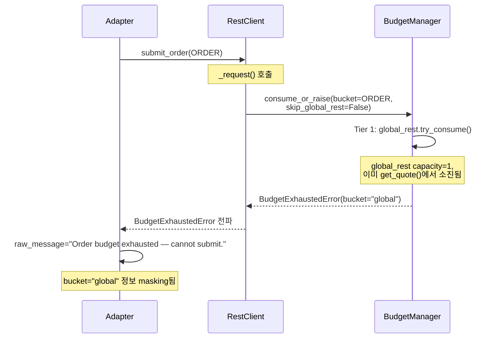

# BUY Submit `skip_global_rest` 보호 설계

## 배경

### 발견된 문제
Paper env에서 `global_rest` capacity=1로 설정되어 있어, `get_quote()` 등 선행 REST 1회 호출로 `global_rest`가 고갈된 후 `submit_order(ORDER)`가 Tier 1에서 차단됨. ORDER bucket에 3개 토큰이 남아있어도 `BudgetExhaustedError(bucket="global")` 발생.

### 문제 흐름


## 설계 옵션 비교

| 옵션 | 변경 범위 | 근본 해결 | 리스크 |
|------|----------|-----------|--------|
| **A: ORDER skip_global_rest** | rest_client.py 1줄 | ✅ ORDER bucket만 우회 | 낮음 |
| B: global_rest capacity 증가 | rate_limit.py capacity 변경 | ❌ 증상 완화 | 중간 |
| C: BUY 전용 reserve 추가 | rate_limit.py, rest_client.py | ❌ 복잡성 증가 | 높음 |

## 권장: Option A — ORDER bucket에 `skip_global_rest`

### 변경 1: [`rest_client.py:1028-1036`](src/agent_trading/brokers/koreainvestment/rest_client.py:1028)

**현재 코드:**
```python
data = await self._request(
    "POST",
    endpoint_key="order_cash",
    tr_id_key=tr_id_key,
    bucket=BucketType.ORDER,
    body=body,
    requires_hashkey=True,
    held_position_sell=_held_position_sell,
    # skip_global_rest이 전달되지 않음 → 기본값 False
)
```

**변경 후:**
```python
data = await self._request(
    "POST",
    endpoint_key="order_cash",
    tr_id_key=tr_id_key,
    bucket=BucketType.ORDER,
    body=body,
    requires_hashkey=True,
    skip_global_rest=True,  # ORDER bucket은 global_rest 우회
    held_position_sell=_held_position_sell,
)
```

**근거:**
- `_request()`는 이미 [`skip_global_rest` 파라미터](src/agent_trading/brokers/koreainvestment/rest_client.py:834)를 지원함
- `_request()` 내부 [`consume_or_raise()` 호출](src/agent_trading/brokers/koreainvestment/rest_client.py:858)에서 `skip_global_rest`를 전달함
- `submit_order()`만 이 파라미터를 활용하지 않고 있었음

### 변경 2: [`adapter.py:276-284`](src/agent_trading/brokers/koreainvestment/adapter.py:276)

**현재 코드:**
```python
except BudgetExhaustedError:
    # ...
    return SubmitOrderResult(
        # ...
        raw_message="Order budget exhausted — cannot submit.",
        # ...
    )
```

**변경 후:**
```python
except BudgetExhaustedError as exc:
    # ...
    return SubmitOrderResult(
        # ...
        raw_message=f"Budget exhausted ({exc.bucket}) — cannot submit.",
        # ...
    )
```

**근거:**
- `BudgetExhaustedError`는 [`bucket` 속성](src/agent_trading/brokers/rate_limit.py:115-118)을 가지고 있음
- 현재는 모든 `BudgetExhaustedError`를 "Order budget exhausted"로 통일하여 masking
- `exc.bucket`을 포함하면 `global` vs `order` 구분 가능 → DB 모니터링 개선

## 영향 분석

### ORDER bucket
- `skip_global_rest=True` → `global_rest` 소진과 무관하게 ORDER bucket capacity만 확인
- ORDER bucket capacity=3, refill=0.1/sec (10초당 1개)으로 이미 충분히 보수적
- `global_rest` 없이 ORDER bucket만으로 KIS API rate limit 보호 가능

### 다른 bucket (INQUIRY, MARKET_DATA, RECONCILIATION, AUTH)
- 변경 없음, `global_rest` 보호 유지

### Held-position sell
- ORDER bucket으로 분류되므로 `skip_global_rest` 적용
- `held_position_sell_reserve`가 실제로 동작 가능해짐
- 기존 `held_position_sell=True` 플래그는 그대로 유지

### Error 메시지
- `exc.bucket` 정보를 포함하여 `global` vs `ORDER` 구분 가능
- DB 모니터링에서 budget exhaustion 원인 파악 용이

## 테스트 계획

### 1. [`test_rest_client_submit.py`](tests/brokers/koreainvestment/test_rest_client_submit.py)

**새 테스트: `test_submit_order_skip_global_rest`**
```python
class TestSubmitOrderSkipGlobalRest:
    """``submit_order()``가 ``_request()``에 ``skip_global_rest=True``를 전달하는지 검증."""

    @pytest.mark.asyncio
    async def test_submit_order_passes_skip_global_rest(
        self, client: KISRestClient, submit_request: SubmitOrderRequest
    ) -> None:
        """ORDER bucket submit에서 skip_global_rest=True 확인."""
        mock_response = {"output": {"ODNO": "0000027326", "ORD_TMD": "152530"}}
        with patch.object(KISRestClient, "_request", AsyncMock(return_value=mock_response)) as mock_request:
            await client.submit_order(submit_request)
        mock_request.assert_called_once()
        assert mock_request.call_args[1].get("skip_global_rest") is True
```

**기존 테스트 수정: [`TestSubmitOrderRequestBody.test_submit_request_body_structure`](tests/brokers/koreainvestment/test_rest_client_submit.py:169)**
- `call_kwargs` 검증에 `skip_global_rest=True` assertion 추가

### 2. [`test_kis_adapter_validation.py`](tests/brokers/test_kis_adapter_validation.py)

**기존 테스트 수정: [`TestSubmitOrderBudgetExhausted`](tests/brokers/test_kis_adapter_validation.py:572)**
- `BudgetExhaustedError` 생성 시 bucket 정보 포함: `BudgetExhaustedError(bucket="global", message="...")`
- `raw_message` 검증에 bucket 정보 포함 확인

## 리스크 평가

| 리스크 | 심각도 | 설명 |
|--------|--------|------|
| ORDER rate limit 위반 | 낮음 | ORDER bucket capacity=3, refill=0.1/sec으로 KIS API limit(초당 18건)을 초과할 수 없음 |
| 다른 bucket rate 증가 | 없음 | INQUIRY, MARKET_DATA는 여전히 global_rest 보호 받음 |
| 회귀 | 낮음 | 단일 라인 변경 + 기존 테스트 모두 통과 |
| DB 메시지 호환성 | 낮음 | `raw_message` 포맷 변경이지만 MESSAGE 필드는 text field로 downstream 파싱에 영향 없음 |

## 실행 순서

1. [`rest_client.py`](src/agent_trading/brokers/koreainvestment/rest_client.py:1028) — `submit_order()`에서 `skip_global_rest=True` 추가
2. [`adapter.py`](src/agent_trading/brokers/koreainvestment/adapter.py:276) — `BudgetExhaustedError` catch 시 `exc.bucket` 포함
3. [`test_rest_client_submit.py`](tests/brokers/koreainvestment/test_rest_client_submit.py) — `skip_global_rest` 검증 테스트 추가
4. [`test_kis_adapter_validation.py`](tests/brokers/test_kis_adapter_validation.py) — error 메시지 bucket 정보 검증 업데이트
5. 전체 테스트 실행 및 검증
