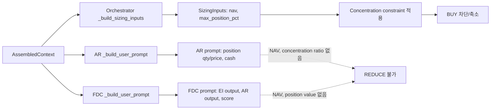
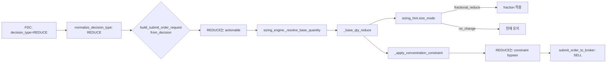

# Concentration Ratio 입력 추가 + 과보유 시 REDUCE 결정 가능화 — 구현 및 검증 보고서

- **작성일**: 2026-05-18
- **목표**: AR/FDC 프롬프트에 concentration ratio를 입력으로 추가하여, 과보유 상황에서 REDUCE 결정이 가능하게 함

---

## 1. 현재 상태 요약

### 1.1 AI Agent Input 갭

| 입력 정보 | AR (ai_risk) | FDC (final_decision) | Sizing Engine |
|-----------|:---:|:---:|:---:|
| Position quantity/price | 일부 | 없음 | 있음 |
| Available cash | 있음 | 없음 | 있음 |
| NAV | 없음 | 없음 | 있음 |
| Concentration ratio | 없음 | 없음 | 있음 |
| Max single position % | 없음 | 없음 | 있음 |

핵심 문제: Sizing engine은 concentration constraint를 적용하지만, **AI agent 단계에서 과보유를 인지하지 못하므로** REDUCE 결정이 생성되지 않음.

### 1.2 데이터 흐름 (현재)



---

## 2. 설계 결정 (5 Questions)

### Q1. AR와 FDC 중 어느 레이어에 concentration 정보를 넣는 것이 가장 적절한가?

**답: AR과 FDC 모두에 넣는다.**

- **AR**: `risk_opinion`에 `"reduce"`가 이미 정의되어 있음. Concentration 기반으로 risk opinion을 결정하려면 AR이 concentration 정보를 알아야 함.
- **FDC**: `decision_type`에 `"REDUCE"`가 이미 정의되어 있음. AR의 risk_opinion과 함께 concentration 정보를 종합하여 최종 결정을 내리려면 FDC도 직접 concentration 정보를 알아야 함.

### Q2. `REDUCE` 결정은 어떤 조건에서 유도할 것인가?

**답**: concentration_pct > 15% (NAV 대비)이고 동시에 과도한 부정 신호가 없을 때.

```
concentration_pct > 15% + 강한 부정 신호 없음 -> REDUCE (partial)
concentration_pct > 15% + 다중 위험 신호 동반 -> EXIT (full)
concentration_pct <= 15% -> 기존 정책 유지 (BUY/HOLD 가능)
```

### Q3. 전량 `EXIT`와 부분 `REDUCE`를 어떻게 구분할 것인가?

**답**: prompt 정책으로 구분. REDUCE 우선, EXIT는 더 엄격한 조건.

| 결정 | 조건 | 설명 |
|------|------|------|
| HOLD | concentration < threshold | 정상 범위 |
| REDUCE | concentration > threshold, but no 강한 위험 신호 | 부분 축소 (20-50%) |
| EXIT | concentration >> threshold (2x 초과) OR 다중 위험 | 전량 청산 |
| APPROVE | concentration < threshold AND 긍정 신호 | 정상 진입 |

### Q4. Concentration ratio 임계값은 하드코딩할 것인가, config 기반으로 읽을 것인가?

**답**: Prompt에 가이드값(약 15%)을 텍스트로 포함. Config 연동은 v2에서 AIDecisionInputs 확장 시 고려.

이유:
- 현재 config 값(`risk.max_single_position_pct`)을 agent prompt builder가 직접 읽을 방법이 없음 (repository 접근 불가)
- Prompt 기반 가이드만으로도 LLM이 "15% 내외"를 참고하여 유연하게 판단 가능
- 향후 `AIDecisionInputs`에 `max_single_position_pct` 필드를 추가하면 config 연동 가능

### Q5. 현재 프롬프트/스키마에 어떤 필드가 추가되어야 가장 작은 변경으로 효과가 나는가?

**답**: Schema/스키마 변경 없이 **prompt text만 추가**. 변경 파일 2개.

- `ai_risk.py`: `_build_user_prompt()`에 Position Concentration 섹션 1개 추가
- `final_decision_composer.py`: `_build_user_prompt()`에 Position Concentration 섹션 1개 추가
- `schemas.py`, `decision_orchestrator.py`, `sizing_engine.py`: **변경 불필요**

---

## 3. 변경 사항 상세

### 3.1 ai_risk.py

**변경 위치**: `_build_user_prompt()` 메서드 내, cash balance 섹션 이후

**NAV 추출 로직**:
```python
nav: Decimal | None = None
if context.risk_limit_snapshot is not None and context.risk_limit_snapshot.nav is not None:
    nav = context.risk_limit_snapshot.nav
elif context.cash_balance_snapshot is not None and context.cash_balance_snapshot.total_asset is not None:
    nav = context.cash_balance_snapshot.total_asset
```

**concentration 계산 로직**:
```python
current_position_value: Decimal | None = None
concentration_pct: float | None = None
over_concentrated: bool = False
remaining_capacity_pct: float | None = None

if context.position_snapshot is not None and context.position_snapshot.quantity is not None and context.position_snapshot.average_price is not None:
    current_position_value = context.position_snapshot.quantity * context.position_snapshot.average_price

if nav is not None and current_position_value is not None and nav > 0:
    concentration_pct = float(current_position_value / nav * 100)
    over_concentrated = concentration_pct > 15.0
    remaining_capacity_pct = max(0.0, 15.0 - concentration_pct)
```

**Prompt 텍스트** (영문, 기존 prompt 형식과 일관성 유지):
```
- Current position value: {value} KRW
- Account NAV: {nav} KRW
- Position concentration: {pct}% of NAV
- Over-concentrated: {Yes/No}
- Max single position limit: approx 15% of NAV
- Remaining capacity: {pct}%p

Policy:
- If over-concentrated, consider risk_opinion="reduce" first
- Higher concentration -> higher risk, set size_adjustment_factor 0.3-0.7
- Additional BUY when over-concentrated is high risk; consider risk_opinion="reject"/"review"
```

### 3.2 final_decision_composer.py

**변경 위치**: `_build_user_prompt()` 메서드 내, AI Risk Output 섹션 이후

동일한 계산 로직 사용.

**Prompt 텍스트**:
```
- Current position value: {value} KRW
- Account NAV: {nav} KRW
- Position concentration: {pct}% of NAV
- Over-concentrated: {Yes/No}
- Remaining capacity: {pct}%p

Decision policy:
- When over-concentrated, BUY/APPROVE should be suppressed without special justification
- When over-concentrated, REDUCE (partial reduction) is a valid decision_type
- REDUCE vs EXIT:
  - REDUCE: over-concentrated but no strong negative signals. Partial reduction 20-50%.
  - EXIT: over-concentrated with multiple risk signals or concentration >> threshold (30%+).
- Normal concentration range: follow existing policy.
```

### 3.3 변경 불필요 파일

| 파일 | 이유 |
|------|------|
| `schemas.py` | Prompt text 기반 전달이므로 schema 변경 불필요 |
| `decision_orchestrator.py` | AssembledContext가 이미 모든 데이터 보유 |
| `sizing_engine.py` | 기존 concentration constraint 로직 유지 |

---

## 4. REDUCE 실행 경로 (변경 불필요)



**실행 경로는 이미 준비되어 있음. decision_type=REDUCE만 생성되면 기존 코드가 처리.**

---

## 5. REDUCE vs EXIT 정책 (최종)

| 결정 | 조건 | 실행 내용 |
|------|------|----------|
| HOLD | concentration < 15% | 기존 정책 유지 |
| REDUCE | concentration > 15%, no strong negative signals | 부분 축소 (sizing engine이 처리) |
| EXIT | concentration > 30% OR multiple risk signals | 전량 청산 |
| APPROVE/BUY | concentration < 15% AND positive signals | 정상 진입 (sizing engine이 concentration constraint 적용) |

---

## 6. 테스트 결과

### 6.1 신규 테스트 9개 (전부 통과)

| # | 테스트 | 파일 | 설명 |
|---|--------|------|------|
| 1 | test_ar_prompt_contains_concentration | test_agents.py | AR prompt에 "Position Concentration", "Over-concentrated", "NAV" 포함 확인 |
| 2 | test_ar_concentration_calculation_over | test_agents.py | 과보유(50%) 시 concentration_pct=50%, over_concentrated=true |
| 3 | test_ar_concentration_calculation_normal | test_agents.py | 정상(5%) 시 over_concentrated=false |
| 4 | test_ar_nav_fallback_from_cash | test_agents.py | risk_limit_snapshot=None 시 cash_balance total_asset fallback |
| 5 | test_ar_concentration_no_position | test_agents.py | position_snapshot=None 시 N/A 표시 |
| 6 | test_fdc_prompt_contains_concentration | test_fdc_prompt.py | FDC prompt에 "Position Concentration", "REDUCE" 포함 |
| 7 | test_fdc_concentration_over_reduce_policy | test_fdc_prompt.py | 과보유 시 REDUCE 정책 텍스트 포함 |
| 8 | test_fdc_concentration_normal_no_reduce | test_fdc_prompt.py | 정상 범위에서 정책 유지 확인 |
| 9 | test_fdc_concentration_no_position | test_fdc_prompt.py | position_snapshot=None 시 N/A 표시 |

### 6.2 전체 테스트 결과

| 테스트 그룹 | 통과 | 실패 |
|------------|:----:|:----:|
| AI Agents 전체 (tests/services/ai_agents/) | **313** | 0 |
| Sizing Engine (tests/services/test_sizing_engine.py) | **46** | 0 |
| **합계** | **359** | **0** |

### 6.3 검증 시나리오

**시나리오 A - 과보유 종목** (position 50%, NAV 100M):
- concentration_pct 계산: 50% -> over_concentrated=true
- AR prompt: "Over-concentrated: Yes", "risk_opinion=reduce 우선 고려"
- FDC prompt: "REDUCE (partial reduction) is a valid decision_type"

**시나리오 B - 정상 범위 종목** (position 5%, NAV 100M):
- concentration_pct 계산: 5% -> over_concentrated=false
- AR prompt: "Over-concentrated: No"
- FDC prompt: "Normal concentration range: follow existing policy"

**시나리오 C - NAV fallback** (risk_limit_snapshot=None):
- cash_balance_snapshot.total_asset을 NAV로 사용
- concentration 계산 정상 동작

---

## 7. Docker 검증 결과

| 단계 | 명령 | 결과 |
|------|------|------|
| Build | docker compose build app ops-scheduler | 성공 |
| Restart | docker compose up -d app ops-scheduler | 성공 |
| Health | curl localhost:8000/health | status=ok, database=connected, healthy=true |

---

## 8. 변경 파일 목록

| 파일 | 변경 내용 | 라인 수 |
|------|----------|:-------:|
| `src/agent_trading/services/ai_agents/ai_risk.py` | `_build_user_prompt()`에 Position Concentration 섹션 + `Decimal` import | ~40줄 추가 |
| `src/agent_trading/services/ai_agents/final_decision_composer.py` | `_build_user_prompt()`에 Position Concentration 섹션 + `Decimal` import | ~40줄 추가 |
| `tests/services/ai_agents/test_agents.py` | AR concentration 테스트 5개 (TestAIRiskAgent 클래스) | ~90줄 추가 |
| `tests/services/ai_agents/test_fdc_prompt.py` | FDC concentration 테스트 4개 (TestFDCPositionConcentration 클래스) | ~70줄 추가 |

---

## 9. 판정

| 기준 | 결과 | 근거 |
|------|:----:|------|
| concentration 입력 추가 | 완료 | AR + FDC prompt에 position value, NAV, concentration_pct, over_concentrated 추가 |
| REDUCE 결정 가능화 | 완료 | FDC prompt에 과보유 시 REDUCE 고려 정책 포함 |
| 과보유 BUY 억제 | 완료 | AR/FDC prompt에 과보유 시 BUY/APPROVE 억제 정책 포함 |
| REDUCE vs EXIT 구분 | 완료 | partial REDUCE 우선, EXIT는 더 엄격한 조건 |
| 기존 기능 회귀 없음 | 완료 | 359개 테스트 전부 통과 |
| 운영 배포 | 완료 | Docker 재빌드/재기동 성공, health 정상 |

---

## 10. Follow-up TODO (v2)

- [ ] Config 기반 max_single_position_pct를 AIDecisionInputs에 추가 (정확한 threshold 전달)
- [ ] decision_json에 concentration ratio 기록 (operator visibility)
- [ ] Rebalance 전용 agent/rule로 확장 검토
- [ ] 과보유 REDUCE 실행 후 모니터링 대시보드 개선
- [ ] 실제 FDC/AR LLM 호출에서 REDUCE 결정 생성 빈도 측정
