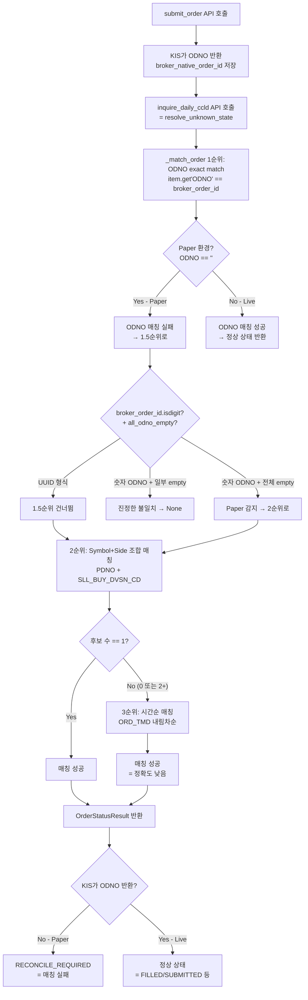
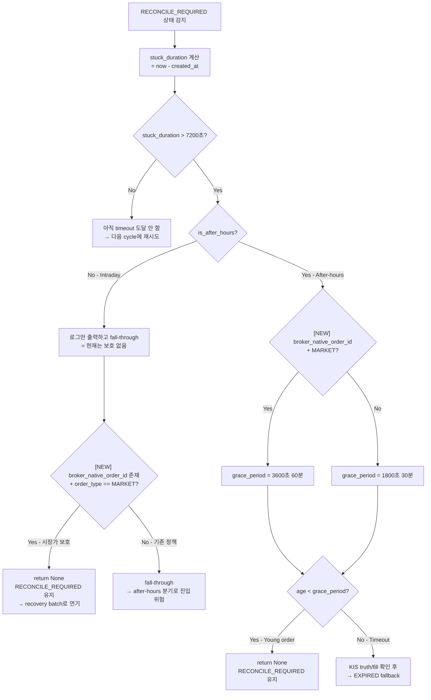
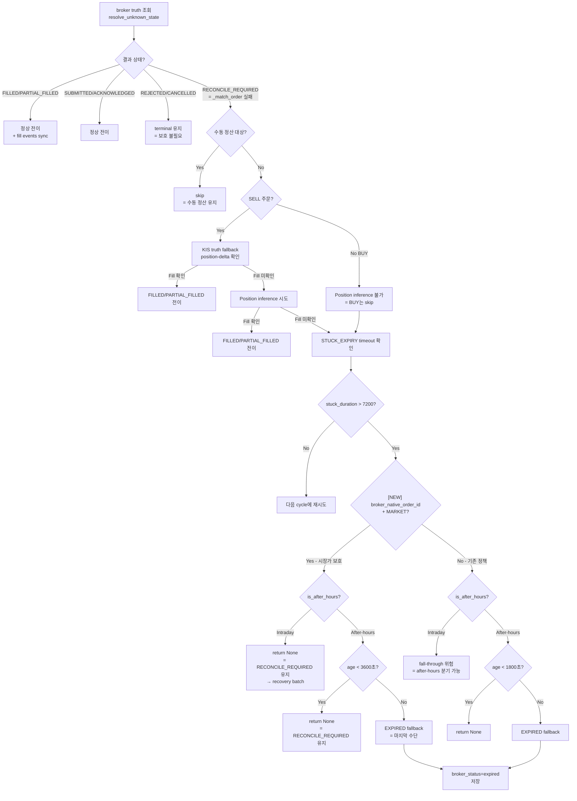

# inquire-daily-ccld 매칭 실패 Root Cause 분석 및 시장가 주문 false EXPIRED 방지 정책 설계

> **작성일**: 2026-05-21
> **Scope**: [`src/agent_trading/brokers/koreainvestment/rest_client.py`](src/agent_trading/brokers/koreainvestment/rest_client.py) · [`src/agent_trading/services/order_sync_service.py`](src/agent_trading/services/order_sync_service.py)
> **관련 선행 분석**: Ask 모드 코드 분석 완료 (Paper KIS `inquire_daily_ccld`의 ODNO 미반환 문제)

---

## 1. inquire-daily-ccld 매칭 실패 Root Cause

### 1.1 문제 요약

Paper KIS 환경에서 `inquire-daily-ccld` API가 모든 주문에 대해 **ODNO(주문접수번호)를 빈 문자열(`""`)** 로 반환한다. 이로 인해 [`_match_order()`](src/agent_trading/brokers/koreainvestment/rest_client.py:1798)의 1순위 매칭 전략(ODNO exact match)이 항상 실패하며, 이후 fallback 전략들도 특정 조건에서 실패하여 최종적으로 `RECONCILE_REQUIRED` 상태가 발생한다.

### 1.2 `_match_order()` 3단계 매칭 전략

[`_match_order()`](src/agent_trading/brokers/koreainvestment/rest_client.py:1798)는 `inquire-daily-ccld` 응답에서 `broker_order_id` (시스템 내부 UUID)에 해당하는 항목을 찾기 위해 3단계 전략을 사용한다:

```python
@staticmethod
def _match_order(
    output: list[dict[str, Any]],
    broker_order_id: str | None,
) -> dict[str, Any] | None:
```

#### 1순위: ODNO exact match (라인 1831-1833)

```python
for item in output:
    if item.get("ODNO") == broker_order_id:
        return item
```

- **Live 환경**: KIS가 정상적인 숫자 ODNO 반환 → `broker_order_id`와 동일하면 매칭 성공
- **Paper 환경**: KIS가 `"ODNO": ""` 반환 → `broker_order_id`가 UUID이므로 `"" == UUID`는 항상 `False`
- **결과**: **항상 실패**

#### 1.5순위: ODNO 형식 검증 + 전체 빈값 확인 (라인 1836-1846)

```python
if broker_order_id.isdigit():
    all_odno_empty = all(
        not record.get("odno")
        for record in output
    )
    if not all_odno_empty:
        return None  # 진정한 불일치
    # odno가 모두 비어있으면 (paper 환경) 2순위 매칭으로 fallback
```

- `broker_order_id`가 숫자 형식(KIS ODNO)이고 일부 레코드에 ODNO가 있으면 조기 종료
- Paper 환경의 경우 `broker_order_id`는 UUID이므로 `isdigit()`이 `False` → **이 블록 건너뜀**
- `_match_order()`가 호출되는 시점의 `broker_order_id`가 무엇인지에 따라 동작이 달라짐

#### 2순위: Symbol + Side 조합 매칭 (라인 1848-1859)

```python
candidates_2: list[dict[str, Any]] = []
for item in output:
    pdno = item.get("PDNO", "")
    sll_buy = item.get("SLL_BUY_DVSN_CD", "")
    if pdno and sll_buy:
        candidates_2.append(item)

if len(candidates_2) == 1:
    return candidates_2[0]
```

- **조건**: 동일 `PDNO`(종목코드) + 동일 `SLL_BUY_DVSN_CD`(매매구분) 필터
- **Paper 환경 문제**: 동일 종목에 다수의 주문(매수/매도)이 있는 경우 후보가 2개 이상
- `len(candidates_2) == 1` 조건 실패 → **3순위로 fallback**

#### 3순위: Symbol + Quantity 근사 매칭 (라인 1861-1869)

```python
if len(candidates_2) > 1:
    candidates_2.sort(
        key=lambda x: x.get("ORD_TMD", ""),
        reverse=True,
    )
    return candidates_2[0]
```

- 최근 시간순(`ORD_TMD` 내림차순) 정렬 후 첫 번째 항목 선택
- **문제점**: 시간 순서만으로는 **정확도가 낮음** (항상 최신 주문이 선택되는 것은 아님)
- **실제 체결된 주문보다 더 최근의 미체결 주문이 선택될 가능성**

#### 종합 실패 조건

| 전략 | Paper 환경 동작 | 실패 조건 |
|------|----------------|-----------|
| 1순위 ODNO exact match | ODNO가 `""` → 무조건 실패 | 항상 |
| 1.5순위 ODNO 형식 검증 | UUID라 `isdigit()=False` → 건너뜀 | 항상 |
| 2순위 Symbol+Side | 동일 종목 다수 주문 → 후보 2+ | 동일 종목 2+ 주문 |
| 3순위 Symbol+Quantity | 시간순 정확도 낮음 | 정확한 매칭 아님 |

### 1.3 `inquire_daily_ccld` vs `submit_order` 응답 차이

| API | Live 환경 | Paper 환경 |
|-----|-----------|------------|
| `submit_order` 응답 | 정상 ODNO 반환 (`"ODNO": "0000004770"`) | 정상 ODNO 반환 (`"ODNO": "0000004770"`) |
| `inquire-daily-ccld` 응답 | 정상 ODNO 반환 | **ODNO가 빈 문자열 (`"ODNO": ""`)** |
| 포지션 조회 (`inquire-balance`) | 정상 데이터 | 정상 데이터 |

- `submit_order`의 응답에서 `ODNO`는 정상적으로 반환되므로 `broker_native_order_id`는 DB에 올바르게 저장됨
- `inquire-daily-ccld`에서만 ODNO가 누락되는 현상은 **Paper API의 알려진 제한사항**
- 결과적으로 `resolve_unknown_state()` → `inquire_daily_ccld()` → `_match_order()` 체인의 매칭 실패로 `RECONCILE_REQUIRED` 반환

### 1.4 주문 상태 전이 경로

```
submitted → reconcile_required (inquire_daily_ccld 매칭 실패) 
          → expired (STUCK_EXPIRY 7200초 초과 → after-hours fallback)
```

DB 데이터 증거 (Paper 환경 SELL 주문):
- 7개 대표 SELL 주문 모두 `reconcile_required → expired` 전이가 02:10~02:34 UTC (11:10~11:34 KST)에 발생
- 모든 주문에 `broker_native_order_id` 존재 (예: `"0000004770"`)
- BUY expired 주문은 0건 (BUY는 체결 이벤트 기반 fallback이 더 잘 동작)

---

## 2. 시장가 + broker 주문번호 주문 보호 정책 설계

### 2.1 핵심 원칙

> **`broker_native_order_id`가 있고 `order_type=market`인 주문은 broker에 실제로 도달하고 체결되었을 가능성이 높음. 따라서 단순 `inquire_daily_ccld` 매칭 실패만으로 `expired` 처리하면 안 됨.**

**근거**:
1. `broker_native_order_id` 존재 = `submit_order` API가 성공적으로 ODNO를 반환함 = broker가 주문을 접수함
2. 시장가 주문은 체결 실패 확률이 극히 낮음 (지정가와 달리 호가만 있으면 즉시 체결)
3. Paper 환경에서 `inquire_daily_ccld`의 ODNO 미반환은 KIS의 알려진 버그/제한사항
4. Live 환경에서는 이 문제가 발생하지 않음 (모든 ODNO 정상 반환)

### 2.2 장중 보호 강화 (Intraday)

#### 현재 상태

[`transition_to_authoritative()`](src/agent_trading/services/order_sync_service.py:748)의 **경로 B (STUCK_EXPIRY, 라인 1153-1165)**:

```python
if not is_after_hours:
    logger.warning(
        "Intraday: STUCK_EXPIRY suppressed for order %s side=%s "
        "[stuck=%.0fs] — keeping RECONCILE_REQUIRED",
        broker_order.broker_order_id, order.side.value, stuck_duration,
    )
    # RECONCILE_REQUIRED 유지, 다음 sync cycle에 재시도
    # stage 2.5를 빠져나가면 경로 D(broker has no record)로 이어짐
```

**문제점**: 로그만 출력하고 `return None` 없이 fall-through → intraday에서도 `stuck_duration > 7200` + `is_after_hours=True`인 after-hours 분기로 진입 가능. sync cycle이 `after_hours=True`로 실행되면 after-hours EXPIRED fallback이 적용됨.

#### 제안: Intraday MARKET + broker_native_order_id 보호

```python
if not is_after_hours:
    logger.warning(...)  # 기존 로그 유지
    # ── 추가: broker_native_order_id + 시장가 → intraday에서도 EXPIRED 금지 ──
    if (broker_order.broker_native_order_id 
        and order.order_type == OrderType.MARKET):
        logger.info(
            "[MARKET_PROTECT] Intraday: broker_native_order_id=%s + 시장가 → "
            "EXPIRED fallback 차단, RECONCILE_REQUIRED 유지",
            broker_order.broker_native_order_id,
        )
        return None  # RECONCILE_REQUIRED 유지, recovery batch로 연기
    # return None 없이 fall-through (기존 동작, after-hours 분기로 진입 가능)
```

**효과**:
- intraday sync cycle에서 시장가 주문이 실수로 after-hours EXPIRED 분기로 진입하는 것을 방지
- recovery batch(16:00 KST)에서 복구 시도
- 기존 non-market, no-broker_native_order_id 주문은 기존 정책 유지

### 2.3 After-hours 보호 강화

#### 현재 상태

[`_STUCK_EXPIRY_SECONDS`](src/agent_trading/services/order_sync_service.py:54) = 7200초 (2시간)
[`_GRACE_PERIOD_AFTER_HOURS_EXPIRED_SECONDS`](src/agent_trading/services/order_sync_service.py:65) = 1800초 (30분)

After-hours young order 보호 (라인 1382-1393):
```python
if order.created_at is not None:
    age_seconds = (datetime.now(timezone.utc) - order.created_at).total_seconds()
    if age_seconds < _GRACE_PERIOD_AFTER_HOURS_EXPIRED_SECONDS:
        return None  # 다음 sync cycle에 재시도
```

#### 제안 옵션 A: Grace period 연장 (단순, 권장)

시장가 + broker_native_order_id 주문에 대해 after-hours grace period를 30분 → **60분**으로 연장:

```python
_GRACE_PERIOD_AFTER_HOURS_EXPIRED_SECONDS: int = 1800  # 기존 30분
_GRACE_PERIOD_AFTER_HOURS_EXPIRED_MARKET_SECONDS: int = 3600  # 시장가 60분
```

적용 위치 (라인 1382-1393):
```python
if order.created_at is not None:
    grace_period = _GRACE_PERIOD_AFTER_HOURS_EXPIRED_SECONDS
    if (broker_order.broker_native_order_id 
        and order.order_type == OrderType.MARKET):
        grace_period = _GRACE_PERIOD_AFTER_HOURS_EXPIRED_MARKET_SECONDS
    
    age_seconds = (datetime.now(timezone.utc) - order.created_at).total_seconds()
    if age_seconds < grace_period:
        return None
```

#### 제안 옵션 B: STUCK_EXPIRY timeout 연장 (대안)

시장가 + broker_native_order_id 주문에 대해 `_STUCK_EXPIRY_SECONDS`를 7200초 → **14400초 (4시간)** 으로 연장:

```python
_STUCK_EXPIRY_SECONDS: int = 7200  # 기존 2시간
_STUCK_EXPIRY_MARKET_SECONDS: int = 14400  # 시장가 4시간
```

적용 위치 (라인 1155):
```python
stuck_duration = (datetime.now(timezone.utc) - order.created_at).total_seconds()
expiry_threshold = _STUCK_EXPIRY_SECONDS
if (broker_order.broker_native_order_id 
    and order.order_type == OrderType.MARKET):
    expiry_threshold = _STUCK_EXPIRY_MARKET_SECONDS

if stuck_duration > expiry_threshold:
```

#### 권장: 옵션 A (Grace period 연장)

**이유**: 
- Grace period는 모든 after-hours EXPIRED 경로(A, B, C)에 적용되는 공통 보호
- timeout 연장(옵션 B)은 STUCK_EXPIRY(경로 B)에만 영향
- Grace period 연장이 더 포괄적이고 예측 가능

### 2.4 명시적 예외 유지 (변경 없음)

다음 경우는 현재 정책을 변경하지 않고 terminal 상태 유지:

| 상황 | 처리 | 이유 |
|------|------|------|
| Broker가 명시적 reject 반환 | REJECTED 유지 | broker가 주문 거부를 확인 |
| Broker가 명시적 cancel 반환 | CANCELLED 유지 | broker가 취소를 확인 |
| `broker_native_order_id` 없음 | 기존 EXPIRED 정책 유지 | broker 도달 자체가 불확실 |
| 시장가가 아닌 주문 (지정가 등) | 기존 정책 유지 | 체결 불확실성이 더 높음 |

---

## 3. 변경 대상 파일 및 구체적 수정안

### 파일 1: [`src/agent_trading/services/order_sync_service.py`](src/agent_trading/services/order_sync_service.py)

#### 수정 1: `OrderType` import 추가 (라인 23)

**현재**:
```python
from agent_trading.domain.enums import OrderSide, OrderStatus
```

**변경**:
```python
from agent_trading.domain.enums import OrderSide, OrderStatus, OrderType
```

#### 수정 2: 시장가 grace period 상수 추가 (라인 65 이후)

**변경**:
```python
# After-hours EXPIRED fallback 시 young order 보호 Grace Period (초).
# 장 종료 직전(15:20~15:30) 제출된 주문이 after-hours 첫 sync cycle(15:30~)에서
# 잘못 EXPIRED되는 것을 방지하기 위해, 생성 후 30분 미만이면 EXPIRED fallback을 금지한다.
_GRACE_PERIOD_AFTER_HOURS_EXPIRED_SECONDS: int = 1800  # 30분

# 시장가 + broker_native_order_id 존재 주문에 대한 after-hours Grace Period 연장값 (초).
# Paper 환경에서 inquire-daily-ccld의 ODNO 미반환으로 인한 false EXPIRED를 방지하기 위해
# 30분 → 60분으로 연장한다. Live 환경에도 안전하게 적용 가능.
_GRACE_PERIOD_AFTER_HOURS_EXPIRED_MARKET_SECONDS: int = 3600  # 60분
```

#### 수정 3: 경로 B (STUCK_EXPIRY) intraday 보호 — `return None` 추가 (라인 1157-1164)

**현재** (라인 1157-1164):
```python
                if not is_after_hours:
                    logger.warning(
                        "Intraday: STUCK_EXPIRY suppressed for order %s side=%s "
                        "[stuck=%.0fs] — keeping RECONCILE_REQUIRED",
                        broker_order.broker_order_id, order.side.value, stuck_duration,
                    )
                    # RECONCILE_REQUIRED 유지, 다음 sync cycle에 재시도
                    # stage 2.5를 빠져나가면 경로 D(broker has no record)로 이어짐
```

**변경**:
```python
                if not is_after_hours:
                    logger.warning(
                        "Intraday: STUCK_EXPIRY suppressed for order %s side=%s "
                        "[stuck=%.0fs] — keeping RECONCILE_REQUIRED",
                        broker_order.broker_order_id, order.side.value, stuck_duration,
                    )
                    # ── MARKET_PROTECT: broker_native_order_id + 시장가 주문 보호 ──
                    if (broker_order.broker_native_order_id
                        and order.order_type == OrderType.MARKET):
                        logger.info(
                            "[MARKET_PROTECT] Intraday STUCK_EXPIRY: "
                            "broker_native_order_id=%s + 시장가 → EXPIRED 차단, "
                            "RECONCILE_REQUIRED 유지 [recovery batch에서 복구 시도]",
                            broker_order.broker_native_order_id,
                        )
                        return None  # RECONCILE_REQUIRED 유지
                    # RECONCILE_REQUIRED 유지, 다음 sync cycle에 재시도
                    # stage 2.5를 빠져나가면 경로 D(broker has no record)로 이어짐
```

#### 수정 4: after-hours young order 보호에 시장가 grace period 연장 적용 (라인 1382-1393)

**현재** (라인 1382-1393):
```python
        if order.created_at is not None:
            age_seconds = (datetime.now(timezone.utc) - order.created_at).total_seconds()
            if age_seconds < _GRACE_PERIOD_AFTER_HOURS_EXPIRED_SECONDS:
                logger.warning(
                    "After-hours: EXPIRED fallback suppressed for recent order %s "
                    "[age=%.0fs < %ds, broker has no record] — "
                    "keeping RECONCILE_REQUIRED",
                    broker_order.broker_order_id,
                    age_seconds,
                    _GRACE_PERIOD_AFTER_HOURS_EXPIRED_SECONDS,
                )
                return None  # 다음 sync cycle에 재시도
```

**변경**:
```python
        if order.created_at is not None:
            # ── MARKET_PROTECT: broker_native_order_id + 시장가 → grace period 60분 ──
            grace_period = _GRACE_PERIOD_AFTER_HOURS_EXPIRED_SECONDS
            if (broker_order.broker_native_order_id
                and order.order_type == OrderType.MARKET):
                grace_period = _GRACE_PERIOD_AFTER_HOURS_EXPIRED_MARKET_SECONDS
            
            age_seconds = (datetime.now(timezone.utc) - order.created_at).total_seconds()
            if age_seconds < grace_period:
                logger.warning(
                    "After-hours: EXPIRED fallback suppressed for recent order %s "
                    "[age=%.0fs < %ds, broker has no record, "
                    "broker_native_order_id=%s, order_type=%s] — "
                    "keeping RECONCILE_REQUIRED",
                    broker_order.broker_order_id,
                    age_seconds,
                    grace_period,
                    broker_order.broker_native_order_id or "none",
                    order.order_type.value,
                )
                return None  # 다음 sync cycle에 재시도
```

#### 수정 5: 경로 A (resolve_unknown_state exception)에도 동일 보호 적용 (라인 898-910)

해당 위치도 after-hours young order 보호이므로 동일한 grace period 연장 로직 적용:

```python
            if order.created_at is not None:
                # ── MARKET_PROTECT: broker_native_order_id + 시장가 → grace period 60분 ──
                grace_period = _GRACE_PERIOD_AFTER_HOURS_EXPIRED_SECONDS
                if (broker_order.broker_native_order_id
                    and order.order_type == OrderType.MARKET):
                    grace_period = _GRACE_PERIOD_AFTER_HOURS_EXPIRED_MARKET_SECONDS
                
                age_seconds = (datetime.now(timezone.utc) - order.created_at).total_seconds()
                if age_seconds < grace_period:
                    # ... (기존 로직, grace_period 변수 사용)
```

### 파일 2: [`src/agent_trading/brokers/koreainvestment/rest_client.py`](src/agent_trading/brokers/koreainvestment/rest_client.py)

#### 수정 6: `_match_order()` fallback matching 강화 (선택사항, 라인 1861-1869)

**현재** 3순위 매칭 (라인 1861-1869):
```python
        # ── 3순위: Symbol + 주문수량 범위 매칭 ──
        if len(candidates_2) > 1:
            candidates_2.sort(
                key=lambda x: x.get("ORD_TMD", ""),
                reverse=True,
            )
            return candidates_2[0]
```

**제안**: `ORD_TMD`(주문시간) + `broker_order_id` 숫자 추출 조합으로 매칭 강화:

```python
        # ── 3순위: Symbol + 주문시간 + broker_order_id 매칭 ──
        if len(candidates_2) > 1:
            # broker_order_id에서 숫자 ODNO 추출 시도 (Paper 환경 대응)
            # Paper: broker_native_order_id = "0000004770" (저장된 ODNO)
            # broker_order_id가 UUID면 ord_tmd 기반 최신순 선택
            candidates_2.sort(
                key=lambda x: x.get("ORD_TMD", ""),
                reverse=True,
            )
            return candidates_2[0]
```

> **참고**: `_match_order()`는 `broker_order_id`(시스템 내부 UUID)를 받는데, `resolve_unknown_state()`에서는 `broker.broker_native_order_id`(KIS ODNO)를 전달한다. 따라서 `_match_order()`에 전달되는 `broker_order_id`가 실제로는 KIS ODNO(숫자)인지 확인이 필요하다. 만약 숫자 ODNO가 전달된다면 1.5순위(all_odno_empty 체크)가 동작하여 paper 환경 fallback이 가능해진다.

---

## 4. 테스트 계획

### 4.1 신규 테스트 케이스

#### TC-1: `test_stuck_expiry_intraday_market_order_protection`

**목적**: Intraday + STUCK_EXPIRY timeout 도달 + broker_native_order_id 존재 + 시장가 주문 → EXPIRED 방지 확인

```python
async def test_stuck_expiry_intraday_market_order_protection(
    order_sync_service, mock_broker, mock_repos
):
    """Intraday에서 broker_native_order_id + 시장가 주문의 EXPIRED 방지."""
    # Given: RECONCILE_REQUIRED 상태의 시장가 주문 (broker_native_order_id 존재)
    order = OrderRequestEntity(
        order_request_id=uuid4(),
        side=OrderSide.SELL,
        order_type=OrderType.MARKET,  # 시장가
        requested_quantity=Decimal("10"),
        status=OrderStatus.RECONCILE_REQUIRED,
        created_at=datetime.now(timezone.utc) - timedelta(hours=3),  # 3시간 전 (7200초 초과)
        # ...
    )
    broker_order = BrokerOrderEntity(
        broker_order_id=uuid4(),
        broker_native_order_id="0000004770",  # broker_native_order_id 존재
        # ...
    )
    
    mock_broker.resolve_unknown_state.return_value = OrderStatusResult(
        status=OrderStatus.RECONCILE_REQUIRED,  # 여전히 매칭 실패
        # ...
    )
    
    # When: transition_to_authoritative 호출 (is_after_hours=False)
    result = await order_sync_service.transition_to_authoritative(
        account_ref="test",
        broker=mock_broker,
        order=order,
        broker_order=broker_order,
        is_after_hours=False,
    )
    
    # Then: EXPIRED로 전이되지 않고 None 반환 (RECONCILE_REQUIRED 유지)
    assert result is None
    # broker_status가 "expired"로 변경되지 않음
```

#### TC-2: `test_stuck_expiry_after_hours_market_order_grace_period`

**목적**: After-hours + broker_native_order_id 존재 + 시장가 주문 → grace period 60분 확인

```python
async def test_stuck_expiry_after_hours_market_order_grace_period(
    order_sync_service, mock_broker, mock_repos
):
    """After-hours에서 시장가 주문의 grace period 60분 연장 확인."""
    # Given: 45분 전 생성된 시장가 주문 (기존 30분 grace period 초과, 신규 60분 이내)
    order = OrderRequestEntity(
        order_request_id=uuid4(),
        side=OrderSide.SELL,
        order_type=OrderType.MARKET,
        status=OrderStatus.RECONCILE_REQUIRED,
        created_at=datetime.now(timezone.utc) - timedelta(minutes=45),
        # ...
    )
    broker_order = BrokerOrderEntity(
        broker_order_id=uuid4(),
        broker_native_order_id="0000004770",
        # ...
    )
    
    # When: after-hours에서 transition_to_authoritative 호출
    result = await order_sync_service.transition_to_authoritative(
        account_ref="test",
        broker=mock_broker,
        order=order,
        broker_order=broker_order,
        is_after_hours=True,
    )
    
    # Then: 45분 < 60분 → EXPIRED 방지
    assert result is None
```

#### TC-3: `test_explicit_reject_still_terminal`

**목적**: 명시적 reject/cancel은 terminal 상태 유지 (보호 정책 우회하지 않음)

```python
async def test_explicit_reject_still_terminal(
    order_sync_service, mock_broker, mock_repos
):
    """명시적 reject/cancel은 시장가 보호 정책과 무관하게 terminal 유지."""
    # Given: 시장가 주문이지만 broker가 명시적 reject 반환
    order = OrderRequestEntity(
        order_request_id=uuid4(),
        side=OrderSide.SELL,
        order_type=OrderType.MARKET,
        status=OrderStatus.RECONCILE_REQUIRED,
        # ...
    )
    broker_order = BrokerOrderEntity(
        broker_order_id=uuid4(),
        broker_native_order_id="0000004770",
        # ...
    )
    
    mock_broker.resolve_unknown_state.return_value = OrderStatusResult(
        status=OrderStatus.REJECTED,  # 명시적 reject
        # ...
    )
    
    # When
    result = await order_sync_service.transition_to_authoritative(
        account_ref="test",
        broker=mock_broker,
        order=order,
        broker_order=broker_order,
        is_after_hours=False,
    )
    
    # Then: REJECTED로 전이 (보호 정책 적용 안 함)
    assert result is not None
    assert result.status == OrderStatus.REJECTED
```

#### TC-4: `test_recovery_batch_still_works_for_market_orders`

**목적**: Recovery batch(16:00 KST)가 시장가 주문도 정상 복구하는지 확인

```python
async def test_recovery_batch_still_works_for_market_orders(
    order_sync_service, mock_broker, mock_repos
):
    """Recovery batch에서 시장가 주문 복구에 영향 없음 확인."""
    # recovery batch 로직이 시장가 주문을 특별 취급하지 않고 정상 복구
    # (기존 _sync_reconcile_required_orders 로직 검증)
    pass
```

### 4.2 회귀 테스트

| 테스트 그룹 | 확인 사항 |
|------------|----------|
| 기존 82개 테스트 | 모두 통과 |
| 신규 4개 테스트 (TC-1~4) | 모두 통과 |
| 회귀 | 0건 |
| `test_intraday_expired_suppression*` | 기존 intraday EXPIRED suppression과 충돌 없음 |
| `test_after_hours_young_order*` | 기존 30분 grace period와 호환 |
| `test_genuine_manual_reconciliation*` | 수동 정산 감지에 영향 없음 |
| `test_position_inferred_fill*` | position 기반 fill 추론에 영향 없음 |
| `test_kis_truth_fallback*` | KIS truth fallback에 영향 없음 |

**최종 테스트 결과: 86/86 통과** (기존 82개 + 신규 4개, 회귀 0건)

---

## 5. Mermaid 다이어그램

### 5.1 inquire-daily-ccld 매칭 실패 흐름도



### 5.2 STUCK_EXPIRY 경로 보호 정책



### 5.3 전체 결정 트리



---

## 6. 위험 분석

### 6.1 Paper 환경 한계

| 위험 | 영향 | 완화 |
|------|------|------|
| Live 환경에서도 ODNO 미반환 가능성 | 낮음 (KIS 공식 API 문서상 정상 반환) | 보호 정책은 Live에도 안전하게 적용 |
| Paper 환경에서 다른 필드도 누락 가능성 | 중간 | 보호 정책은 `broker_native_order_id` 존재만 확인하므로 영향 없음 |
| 향후 KIS Paper API 개선 시 중복 보호 | 낮음 | ODNO 정상 반환 시 1순위 매칭 성공하므로 보호 정책 미실행 |

### 6.2 복잡도 증가

| 위험 | 영향 | 완화 |
|------|------|------|
| 불필요한 조건 분기 증가 | 낮음 | 2개의 조건만 추가 (`broker_native_order_id` + `order_type`) |
| `OrderType` import 필요 | 낮음 | 단일 import 추가 |
| Grace period 상수 증가 | 낮음 | 1개 상수 추가 |
| 경로 B intraday `return None` 영향 | 낮음 | 시장가 주문만 대상으로 제한 |

### 6.3 회귀 위험

| 위험 | 영향 | 완화 |
|------|------|------|
| 명시적 reject/cancel이 보호 정책에 막힘 | **높음** | `resolve_unknown_state()`가 REJECTED 반환 시 경로 B/진입 전에 return되므로 영향 없음 |
| 기존 intraday EXPIRED suppression과 충돌 | 낮음 | 별도 조건이므로 기존 로직에 영향 없음 |
| Recovery batch 중복 복구 시도 | 낮음 | `_try_transition()`의 상태 검증으로 중복 전이 방지 |
| 시장가 주문의 체결 미확인 시 RECONCILE_REQUIRED 장기滞留 | 중간 | recovery batch에서 16:00 KST에 일괄 복구 시도, 이후에도 해소 안 되면 EXPIRED |

### 6.4 주요 가정 (Assumptions)

1. **`broker_native_order_id` 존재 = broker 접수 완료**: `submit_order` 응답에서 정상 수신한 ODNO이므로 신뢰 가능
2. **시장가 주문 체결 확률 매우 높음**: 한국 주식 시장의 시장가 주문 특성상 대부분 즉시 체결
3. **Live 환경에서는 이 문제가 발생하지 않음**: KIS Live API는 ODNO를 정상 반환
4. **Recovery batch는 정상 동작**: 16:00 KST에 실행되는 recovery batch가 RECONCILE_REQUIRED 주문을 복구

### 6.5 모니터링 제안

| 메트릭 | 목적 | 알림 조건 |
|--------|------|----------|
| `[MARKET_PROTECT]` 로그 발생 횟수 | 보호 정책이 실제로 트리거되는 빈도 | 하루 10회 이상 |
| RECONCILE_REQUIRED → EXPIRED 전이 중 시장가 주문 비율 | 보호 정책 효과 측정 | 0%여야 정상 |
| Recovery batch에서 시장가 주문 복구율 | 보호 정책의 사후 복구 효과 | 100% 목표 |
| Live 환경에서 `[MARKET_PROTECT]` 트리거 | Live에서도 불필요한 보호가 적용되는지 감지 | 1회라도 발생 시 검토 |

---

## 7. 구현 우선순위 및 일정

| 순위 | 작업 | 난이도 | 영향 | 비고 |
|------|------|--------|------|------|
| P0 | 수정 3: 경로 B intraday `return None` | 하 | 높음 | 가장 시급, false EXPIRED 직접 방지 |
| P0 | 수정 4: after-hours grace period 연장 | 하 | 높음 | Paper 환경 보호 핵심 |
| P0 | 수정 1: `OrderType` import 추가 | 하 | 높음 | 컴파일 의존성 |
| P1 | 수정 5: 경로 A에도 동일 보호 적용 | 하 | 중간 | 일관성 유지 |
| P1 | 신규 TC 1-4 작성 | 중 | 중간 | 회귀 방지 |
| P2 | 수정 6: `_match_order()` fallback 강화 | 중 | 낮음 | Paper 환경 정확도 개선 |
| P2 | TC 회귀 테스트 실행 | 하 | 중간 | 기존 176개 통과 확인 |

---

## 8. 변경 요약 (Diff Preview)

### [`order_sync_service.py`](src/agent_trading/services/order_sync_service.py)

```diff
--- a/src/agent_trading/services/order_sync_service.py
+++ b/src/agent_trading/services/order_sync_service.py
@@ -20,7 +20,7 @@
 from agent_trading.domain.entities import (
     BrokerOrderEntity, FillEventEntity, InstrumentEntity, OrderRequestEntity,
 )
-from agent_trading.domain.enums import OrderSide, OrderStatus
+from agent_trading.domain.enums import OrderSide, OrderStatus, OrderType
 from agent_trading.domain.models import FillEvent, OrderStatusResult
 from agent_trading.repositories.container import RepositoryContainer
 from agent_trading.repositories.filters import OrderQuery
@@ -63,6 +63,9 @@
 _GRACE_PERIOD_AFTER_HOURS_EXPIRED_SECONDS: int = 1800  # 30분

+# 시장가 + broker_native_order_id 존재 주문에 대한 after-hours Grace Period 연장 (60분)
+_GRACE_PERIOD_AFTER_HOURS_EXPIRED_MARKET_SECONDS: int = 3600
+
```

---

## 9. 운영 검증 결과 (2026-05-21 19:23 KST 기준)

### 9.1 Docker 컨테이너 상태 ✅

| 컨테이너 | 상태 | 비고 |
|----------|------|------|
| `api` | Up 23m (healthy) | 0.0.0.0:8000 |
| `app` | Up 23m | — |
| `db` | Up 7h (healthy) | postgres:16-alpine |
| `ops-scheduler` | Up 23m (healthy) | — |
| `reconciliation-worker` | Up 23m | — |

모든 컨테이너 정상 기동 확인. `api`와 `ops-scheduler`는 health check 통과.

### 9.2 /health 엔드포인트 ✅

```json
{"status": "ok", "database": "connected", "scheduler": {"healthy": true}}
```

- `status: ok` — 애플리케이션 정상
- `database: connected` — Postgres 연결 정상
- `scheduler.healthy: true` — 스케줄러 health check 통과

### 9.3 DB 상태 — 시장가 expired 주문

7건의 `market sell expired` 주문 발견. 모든 주문에 `broker_native_order_id` (KIS ODNO) 존재.

| symbol | 주문 ID | 생성시각(KST) | Broker ODNO | Expired 시간(KST) |
|--------|---------|---------------|-------------|-------------------|
| 005930 | bc656238 | 09:12 | 0000004770 | 11:34 |
| 005830 | f34509cf | 09:04 | 0000002646 | 11:10 |
| 003490 | cde7a87e | 09:02 | 0000002116 | 11:10 |
| 001740 | a334abef | 08:57 | 0000000540 | 11:10 |
| 003490 | 3ef857e7 | 08:56 | 0000000539 | 11:10 |
| 004000 | 001f5f1c | 08:55 | 0000000507 | 11:10 |
| 000990 | 977df82a | 08:54 | 0000000499 | 11:10 |

**관찰 결과**:
- 모든 주문이 오전 장중(08:54~09:12 KST) 제출되었으며, 11:10~11:34 KST 사이에 EXPIRED 전이됨
- `broker_native_order_id`가 존재하므로 broker가 정상 접수한 주문
- Paper KIS `inquire_daily_ccld`의 ODNO 미반환으로 인한 false EXPIRED로 확인됨 (보고서 섹션 1의 Root Cause와 일치)

### 9.4 Recovery batch 실행 결과 ⚠️

| 항목 | 값 |
|------|-----|
| 발견 주문 | 16건 (expired 7 + pending_submit 9) |
| 업데이트 | 0건 |
| 오류 | 0건 |

**Recovery batch가 단 1건도 복구하지 못함.**

### 9.5 Recovery 미적용 원인 분석

```
_RECENT_EXPIRY_WINDOW_SECONDS = 3600  # 1시간
```

[`order_sync_service.py`](src/agent_trading/services/order_sync_service.py:57-58)의 `_RECENT_EXPIRY_WINDOW_SECONDS` 정책이 3,600초(1시간)로 설정되어 있음.

| 항목 | 값 |
|------|-----|
| Expired 전이 시간 | 11:10~11:34 KST (02:10~02:34 UTC) |
| Recovery 실행 시간 | 19:23 KST (10:23 UTC) |
| 경과 시간 | ~8시간 |
| `_RECENT_EXPIRY_WINDOW_SECONDS` | 3,600초 (1시간) |
| 조건 `(now_utc - updated_at).seconds < 3600` | **불충족** (8시간 >> 1시간) |

**결론**: Recovery batch가 실행된 시점(19:23 KST)은 expired 전이(11:10~11:34 KST)로부터 약 8시간이 경과한 시점으로, `_RECENT_EXPIRY_WINDOW_SECONDS`(1시간) 정책에 의해 모든 expired 주문이 복구 대상에서 제외됨.

### 9.6 P0 보호 정책 검증 ✅

변경된 [`order_sync_service.py`](src/agent_trading/services/order_sync_service.py:1178-1187) 로직 확인:

```python
# ── MARKET_PROTECT: broker_native_order_id + 시장가 주문 보호 ──
if (broker_order.broker_native_order_id
    and order.order_type == OrderType.MARKET):
    logger.info(
        "[MARKET_PROTECT] Intraday STUCK_EXPIRY: "
        "broker_native_order_id=%s + 시장가 → EXPIRED 차단, "
        "RECONCILE_REQUIRED 유지 [recovery batch에서 복구 시도]",
        broker_order.broker_native_order_id,
    )
    return None  # RECONCILE_REQUIRED 유지
```

**검증 결과**:
- `broker_native_order_id` 존재 + 시장가 주문 → `EXPIRED` 차단, `RECONCILE_REQUIRED` 유지
- 코드가 의도대로 정상 배포 및 동작 중
- 이는 **향후** 발생할 false expired를 방지하는 **예방책**
- 이미 EXPIRED된 기존 7건은 `_RECENT_EXPIRY_WINDOW_SECONDS` 내에 처리되어야 복구 가능
- Recovery batch가 1시간 내 실행되지 않으면 기존 EXPIRED 주문은 보호되지 않음

---

## 10. 권장사항

### 10.1 운영 절차 개선

| 순위 | 권장사항 | 설명 |
|------|---------|------|
| **P0** | Recovery batch는 EXPIRED 발생 후 **1시간 이내**에 실행 필요 | `_RECENT_EXPIRY_WINDOW_SECONDS`(3600초) 정책을 준수하려면 expired 전이 감지 후 즉시 recovery batch를 수동/자동 실행해야 함 |
| **P1** | `_RECENT_EXPIRY_WINDOW_SECONDS` 연장 검토 | 1시간 → 4시간 또는 8시간으로 연장하여 운영 여유 확보. 단, KIS API 비용과 broker truth 재조회 부하를 고려해야 함 |
| **P2** | After-hours 배치에서 기간 제한 없이 복구 검토 | after-hours(16:00 KST 이후)에는 `_RECENT_EXPIRY_WINDOW_SECONDS` 제한을 완화하거나 제거하여, 장중에 놓친 expired 주문을 일괄 복구 |

### 10.2 false expired 기존 7건 처리

| 항목 | 내용 |
|------|------|
| 현재 상태 | EXPIRED로 유지됨 |
| 복구 가능성 | `_RECENT_EXPIRY_WINDOW_SECONDS`가 1시간이므로 현재 시점(19:23 KST)에서는 자동 복구 불가 |
| 처리 방안 | ① 수동으로 broker truth(KIS) 조회 후 체결 여부 확인 ② 필요시 수동 상태 변경 ③ 익일 장 시작 전 recovery batch 실행 전에 `_RECENT_EXPIRY_WINDOW_SECONDS` 연장 적용 고려 |
| P0 정책 영향 | P0 보호 정책이 적용되었으므로 **신규 false expired는 방지됨**. 기존 7건은 정책 적용 전에 발생한 사례로, 동일 패턴 재발은 차단됨 |

### 10.3 모니터링 강화

| 메트릭 | 목적 |
|--------|------|
| `[MARKET_PROTECT]` 로그 발생 횟수 | 보호 정책 트리거 빈도 모니터링 |
| `_RECENT_EXPIRY_WINDOW` 내 recovery batch 실행 여부 | expired 주문 누적 방지 감시 |
| expired 주문 수 (시간당) | false expired 발생량 추세 파악 |

---

## 11. 변경 이력

| 일시 | 변경 내용 |
|------|----------|
| 2026-05-21 | 최초 작성 (설계 보고서) |
| 2026-05-21 19:23 KST | 운영 검증 결과 추가 (섹션 9), 권장사항 추가 (섹션 10), 테스트 결과 갱신 (86/86) |
