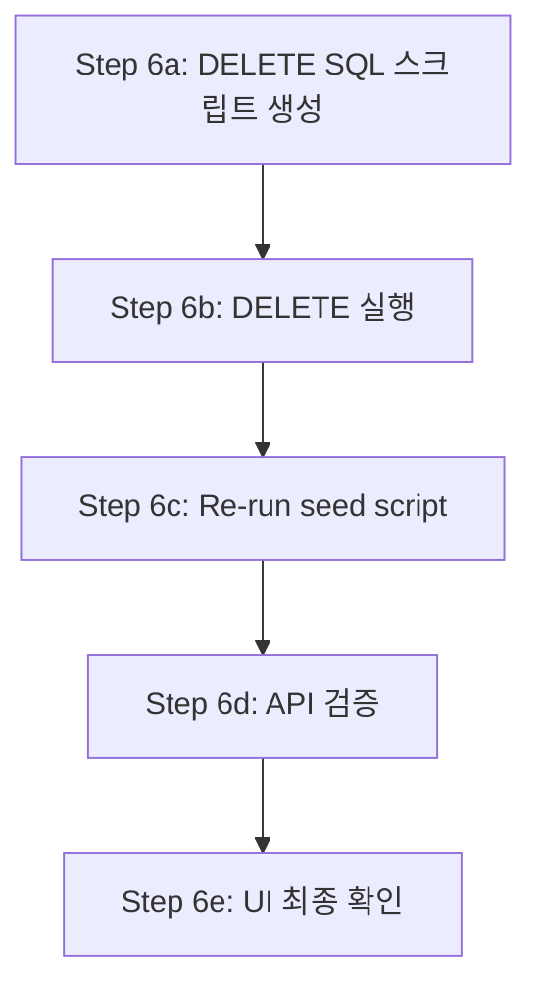

# 개발 DB Seed 재정렬 — 더미 UUID → 새 UUID 정책

## 목적

현재 개발 DB에 남아 있는 과거 더미 UUID 데이터 (`1111...`, `2222...` 등)를 정리하고, 이미 코드에 반영된 uuid5 기반 실제 UUID 형식으로 재시드한다.

## 현재 DB 상태 요약

| 테이블 | PK (현재 더미 UUID) | 내용 | 새 UUID (uuid5) |
|--------|---------------------|------|-----------------|
| `clients` | `11111111-1111-1111-1111-111111111111` | Entrypoint Client | `301961b4-75d9-533c-92b7-69a306cdd435` |
| `broker_accounts` | `22222222-2222-2222-2222-222222222222` | KIS Paper | `7f39fc04-346a-5484-90ab-80e8a1d04a15` |
| `accounts` | `33333333-3333-3333-3333-333333333333` | Entrypoint Paper | `a44a02d1-7f32-5a62-99f7-235abeb58284` |
| `strategies` | `44444444-4444-4444-4444-444444444444` | Entrypoint Strategy | `30a1d26b-8230-51fc-8548-30920effff0c` |
| `config_versions` | `55555555-5555-5555-5555-555555555555` | v1.0 | `529ab376-183a-53df-b4ab-73d948c1404c` |

**FK 종속 데이터**: 4 decision_contexts → 4 trade_decisions → 12 agent_runs, 6 cash_balance_snapshots

모든 FK 제약 조건은 `ON DELETE NO ACTION`이므로, DELETE 시 FK-safe 순서를 엄격히 따라야 한다.

## 접근 방식

**선택: DELETE → Re-seed**

FK 연쇄 UPDATE보다 FK-safe DELETE 후 재시드가 더 안전하다. 근거:
1. `scripts/run_orchestrator_once.py`는 이미 uuid5 기반 실제 UUID로 업데이트됨
2. `_seed_if_empty()`는 `repos.clients.get(NEW_CLIENT_ID)`가 None을 반환하므로, DELETE 후 정상적으로 재시드됨
3. cash_balance_snapshots는 snapshot-sync scheduler가 자동 재생성
4. decision_contexts → trade_decisions → agent_runs 체인은 long path E2E 테스트 등에서 재생성 가능

## 작업 순서



### Step 6a: DELETE SQL 스크립트 생성

FK-safe 순서로 DELETE하는 SQL 스크립트 생성. 실행 순서는 leaf 테이블부터 root 테이블 방향:

```sql
-- Level 0: 가장 깊은 FK 종속 (agent_runs → decision_contexts → accounts/strategies/config_versions)
DELETE FROM trading.risk_decisions
WHERE decision_context_id IN (
    SELECT decision_context_id FROM trading.decision_contexts
    WHERE account_id = '33333333-3333-3333-3333-333333333333'
);

DELETE FROM trading.compliance_decisions
WHERE decision_context_id IN (
    SELECT decision_context_id FROM trading.decision_contexts
    WHERE account_id = '33333333-3333-3333-3333-333333333333'
);

DELETE FROM trading.guardrail_evaluations
WHERE decision_context_id IN (
    SELECT decision_context_id FROM trading.decision_contexts
    WHERE account_id = '33333333-3333-3333-3333-333333333333'
);

DELETE FROM trading.replay_bundles
WHERE decision_context_id IN (
    SELECT decision_context_id FROM trading.decision_contexts
    WHERE account_id = '33333333-3333-3333-3333-333333333333'
);

DELETE FROM trading.agent_runs
WHERE decision_context_id IN (
    SELECT decision_context_id FROM trading.decision_contexts
    WHERE account_id = '33333333-3333-3333-3333-333333333333'
);

DELETE FROM trading.trade_decisions
WHERE decision_context_id IN (
    SELECT decision_context_id FROM trading.decision_contexts
    WHERE account_id = '33333333-3333-3333-3333-333333333333'
);

-- Level 1: decision_contexts (references accounts, strategies, config_versions)
DELETE FROM trading.decision_contexts
WHERE account_id = '33333333-3333-3333-3333-333333333333';

-- Level 2: cash_balance_snapshots (references accounts)
DELETE FROM trading.cash_balance_snapshots
WHERE account_id = '33333333-3333-3333-3333-333333333333';

-- Level 3: accounts (references clients, broker_accounts)
DELETE FROM trading.accounts
WHERE account_id = '33333333-3333-3333-3333-333333333333';

-- Level 4: strategies, config_versions (reference clients)
DELETE FROM trading.strategies
WHERE strategy_id = '44444444-4444-4444-4444-444444444444';

DELETE FROM trading.config_versions
WHERE config_version_id = '55555555-5555-5555-5555-555555555555';

-- Level 5: broker_accounts, clients (root tables)
DELETE FROM trading.broker_accounts
WHERE broker_account_id = '22222222-2222-2222-2222-222222222222';

DELETE FROM trading.clients
WHERE client_id = '11111111-1111-1111-1111-111111111111';
```

### Step 6b: DELETE 실행

```bash
docker compose exec -T db psql -U trading -d trading \
  -f /dev/stdin <<< "(Step 6a SQL)"
```

### Step 6c: Re-run seed script

```bash
docker compose exec app python3 scripts/run_orchestrator_once.py
```

### Step 6d: API 검증

```bash
# /clients 응답 확인
curl -s -H "Authorization: Bearer dev-token-123" \
  http://localhost:8000/admin/api/clients

# /accounts 응답 확인
curl -s -H "Authorization: Bearer dev-token-123" \
  http://localhost:8000/admin/api/accounts
```

예상 응답:
```json
{
  "client_id": "301961b4-75d9-533c-92b7-69a306cdd435",
  "client_code": "EPC001",
  "name": "Entrypoint Client"
}
```

### Step 6e: UI 확인

- Admin UI Accounts 화면에서 더미 UUID (`1111...`, `2222...`) 패턴이 보이지 않는지 확인
- Broker Account ID, Account ID 등이 새 UUID 형식으로 표시되는지 확인

## 완료 보고 형식

1. 정리 방식: FK-safe DELETE → 재시드
2. 정리된 데이터 범위: 5개 root 테이블 + 7개 FK 종속 테이블 (총 ~32 rows)
3. 재시드 결과: `scripts/run_orchestrator_once.py` 성공 여부
4. API 응답 변화: `/clients`, `/accounts` 응답의 UUID 변화
5. UI에서 더미 UUID 제거 여부
