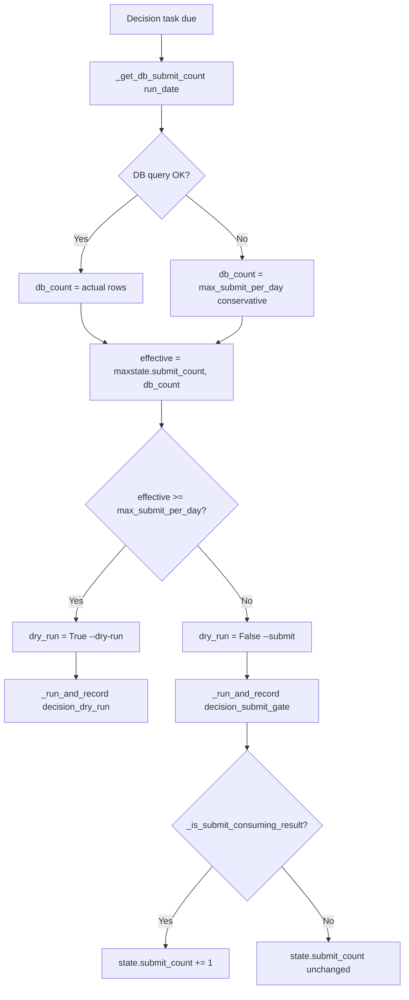
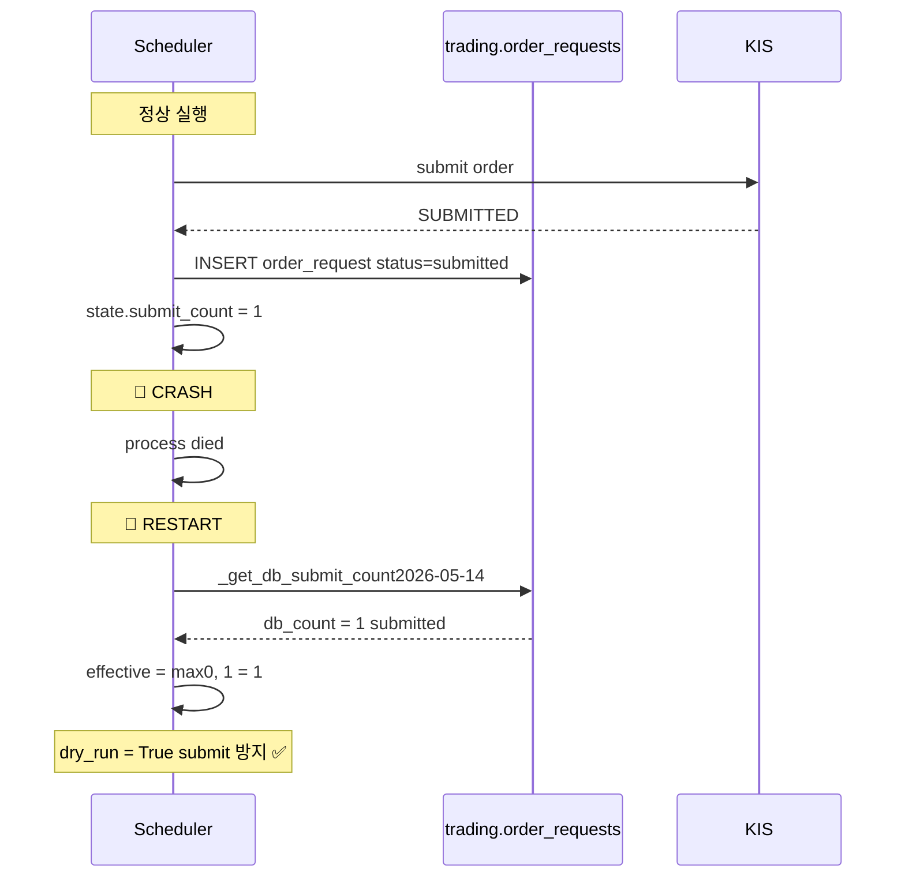

# DB 기반 Submit Budget Safeguard — 설계 문서

## 목적

현재 `scripts/run_near_real_ops_scheduler.py`의 [`SchedulerState.submit_count`](scripts/run_near_real_ops_scheduler.py:95)는 **인메모리** 변수이므로, 스케줄러 프로세스가 crash/restart 되면 `submit_count=0`으로 초기화되어 이미 submit한 날에도 다시 submit을 시도하게 된다.

이 문서는 `trading.order_requests` 테이블의 실제 DB 상태를 조회하여, 프로세스 재시작 후에도 당일 submit 제한이 유지되도록 하는 안전장치를 설계한다.

---

## 1. 요구사항 정리

### 1.1 구현 요구사항 (10가지)

| # | 요구사항 | 상세 |
|---|---------|------|
| 1 | DB submit budget 조회 함수 | 스케줄러 내부에 `_get_db_submit_count()` async 함수 추가 |
| 2 | KST 영업일 기준 | KST 당일 `00:00:00 ~ 23:59:59` scope로 조회 |
| 3 | Budget 소비 상태 목록 | `submitted`, `acknowledged`, `partially_filled`, `filled`, `reconcile_required` |
| 4 | 비소비 상태 목록 | `draft`, `pending_submit`, `rejected`, `cancelled` (참고: `error` 상태는 `OrderStatus` enum에 없음 — 향후 추가 시 포함) |
| 5 | 호출 시점 | Decision cycle 실행 **전**에 DB 조회 |
| 6 | 최종 dry-run 판정 | `max(state.submit_count, db_submit_count) >= max_submit_per_day` → `--dry-run` |
| 7 | DB 실패 시 fallback | DB 쿼리 실패 → conservative하게 `max_submit_per_day`와 동일값 반환 (dry-run) |
| 8 | asyncpg + python-dotenv | Python 내에서 직접 asyncpg 사용 (shell 명령어 아님) |
| 9 | DSN 해결 | `DATABASE_DSN` 또는 `DATABASE_HOST/PORT/USER/PASSWORD/NAME` 조합 지원 |
| 10 | 실제 스키마 | `trading.order_requests` 스키마 사용 |

### 1.2 테스트 요구사항 (5가지)

| # | 요구사항 |
|---|---------|
| T1 | KST 당일 midnight 계산이 올바른지 (UTC→KST 변환, 날짜 경계) |
| T2 | Budget 소비 상태 집합에 모든 5개 상태가 포함되었는지 |
| T3 | DB 조회 실패 시 `max_submit_per_day` 반환 (conservative fallback) |
| T4 | DB 조회 성공 시 실제 count 반환 |
| T5 | `effective_submit_count = max(state.submit_count, db_count)` 로직 검증 |

### 1.3 문서 업데이트 요구사항 (3가지)

| # | 문서 |
|---|------|
| D1 | [`plans/near_real_internal_scheduler_p0.md`](plans/near_real_internal_scheduler_p0.md) — "P0 한계" 테이블에서 `submit_count 인메모리` 항목을 "DB 기반으로 해결"로 업데이트 |
| D2 | [`plans/near_real_scheduler_runbook_2026-05-14.md`](plans/near_real_scheduler_runbook_2026-05-14.md) — "5.3 프로세스 비정상 종료 후 재시작" 리스크 downgrade, "6. P0 한계" #2 해결 표시, "8.1 비정상 종료" 재시작 절차 간소화 |
| D3 | 본 설계 문서 |

---

## 2. 상세 설계

### 2.1 새 함수: `_get_db_submit_count()`

```python
_BUDGET_CONSUMING_STATUSES: frozenset[str] = frozenset({
    "submitted",
    "acknowledged",
    "partially_filled",
    "filled",
    "reconcile_required",
})


async def _get_db_submit_count(run_date: date) -> int:
    """Query ``trading.order_requests`` for today's submit budget consumption.

    Returns the count of orders whose status is in the budget-consuming set
    and whose ``created_at`` falls on the KST operating date.

    On any failure (connection error, query error, etc.), returns
    ``max_submit_per_day`` (conservative dry-run fallback).
    """
    import asyncpg
    from dotenv import load_dotenv

    load_dotenv()  # ensure .env loaded (idempotent)

    dsn = os.getenv("DATABASE_DSN")
    if dsn is None:
        host = os.getenv("DATABASE_HOST") or os.getenv("DB_HOST") or "localhost"
        port = os.getenv("DATABASE_PORT") or os.getenv("DB_PORT") or "5432"
        user = os.getenv("DATABASE_USER") or os.getenv("DB_USER") or "trading"
        password = os.getenv("DATABASE_PASSWORD") or os.getenv("DB_PASSWORD") or "trading"
        database = os.getenv("DATABASE_NAME") or os.getenv("DB_NAME") or "trading"
        dsn = f"postgresql://{user}:{password}@{host}:{port}/{database}"

    try:
        conn = await asyncpg.connect(dsn=dsn)
        try:
            # KST 날짜 경계 계산
            # run_date KST 00:00:00 → UTC 이전 날
            kst_midnight = datetime.combine(run_date, time(0, 0, 0), tzinfo=KST)
            kst_end_of_day = kst_midnight + timedelta(days=1)  # KST next day 00:00

            row = await conn.fetchrow(
                """
                SELECT COUNT(*) AS cnt
                FROM trading.order_requests
                WHERE created_at >= $1
                  AND created_at < $2
                  AND status = ANY($3::text[])
                """,
                kst_midnight,
                kst_end_of_day,
                list(_BUDGET_CONSUMING_STATUSES),
            )
            count: int = row["cnt"] if row else 0
            logger.info(
                "db_submit_count=%d run_date=%s statuses=%s",
                count,
                run_date.isoformat(),
                sorted(_BUDGET_CONSUMING_STATUSES),
            )
            return count
        finally:
            await conn.close()
    except Exception:
        logger.exception(
            "db_submit_count query failed — conservative dry-run fallback"
        )
        return DEFAULT_MAX_SUBMIT_PER_DAY  # = 1, conservative
```

### 2.2 Decision 분기 로직 변경

**현재** ([`_run_intraday_due_tasks()`](scripts/run_near_real_ops_scheduler.py:365-381)):

```python
if tasks["decision"].due(now):
    dry_run = state.submit_count >= max_submit_per_day
    result = await _run_and_record(...)
    if not dry_run and _is_submit_consuming_result(result):
        state.submit_count += 1
```

**변경 후**:

```python
if tasks["decision"].due(now):
    # DB 기반 submit budget 조회 (프로세스 재시작 survivable)
    db_submit_count = await _get_db_submit_count(state.run_date)
    effective_submit_count = max(state.submit_count, db_submit_count)
    dry_run = effective_submit_count >= max_submit_per_day

    result = await _run_and_record(...)

    if not dry_run and _is_submit_consuming_result(result):
        state.submit_count += 1
        logger.warning(
            "submit budget consumed: submit_count=%d db_submit_count=%d "
            "effective=%d max=%d",
            state.submit_count,
            db_submit_count,
            effective_submit_count,
            max_submit_per_day,
        )
```

### 2.3 상태 전이 시나리오

| 시나리오 | `state.submit_count` | `db_submit_count` | `effective` | 결과 |
|----------|:---:|:---:|:---:|------|
| 최초 실행 (submit 없음) | 0 | 0 | 0 | `--submit` 모드 |
| 1회 submit 성공 후 | 1 | 1 | 1 | `--dry-run` (budget 소진) |
| Crash 후 재시작 | 0 | 1 | 1 | `--dry-run` ✅ (budget 보존) |
| DB 장애 (fallback) | 0 | 1(default) | 1 | `--dry-run` ✅ (conservative) |
| DB 장애 + 이미 submit | 1 | 1(default) | 1 | `--dry-run` ✅ |
| 다음 날 재시작 (다른 run_date) | 0 | 0 | 0 | `--submit` 모드 (신규 운영일) |

### 2.4 상수 및 임포트 변경

```python
# 새 상수
DEFAULT_MAX_SUBMIT_PER_DAY = 1  # --max-submit-per-day 기본값과 동일

# _BUDGET_CONSUMING_STATUSES는 모듈 레벨 상수 (테스트에서 import 가능)
```

현재 임포트에 추가 `os`는 이미 있음. `datetime`의 `time`, `timedelta`도 이미 있음. `ZoneInfo("Asia/Seoul")` → `KST`도 이미 있음.

새로 필요한 임포트: 없음 (`asyncpg`는 `_get_db_submit_count()` 내부에서 lazy import).

---

## 3. 수정할 코드

### 3.1 [`scripts/run_near_real_ops_scheduler.py`](scripts/run_near_real_ops_scheduler.py)

| 위치 | 변경 내용 |
|------|----------|
| Line 46 (`PYTHON_BIN`) 직후 | `DEFAULT_MAX_SUBMIT_PER_DAY = 1` 상수 추가 |
| Line 47 (상수 영역) | `_BUDGET_CONSUMING_STATUSES: frozenset[str]` 모듈 레벨 상수 추가 |
| Lines 149-157 (`_is_submit_consuming_result` 직후) | `_get_db_submit_count(run_date) -> int` async 함수 추가 |
| Line 365 (`_run_intraday_due_tasks`) | `dry_run = state.submit_count >= max_submit_per_day` → `effective_submit_count` 로직으로 변경 |
| Line 375-380 (budget consumed 로깅) | 로그 메시지에 `db_submit_count`, `effective` 추가 |

**변경량**: 약 60줄 추가 (함수 45줄 + 상수 3줄 + 분기 로직 10줄 + 로그 수정 2줄)

### 3.2 [`tests/scripts/test_run_near_real_ops_scheduler.py`](tests/scripts/test_run_near_real_ops_scheduler.py)

| 위치 | 변경 내용 |
|------|----------|
| 새 클래스 `TestDbSubmitBudget` | 5개 테스트 케이스 (T1~T5) |

---

## 4. 테스트 설계

### 4.1 테스트 구조

```python
class TestDbSubmitBudget:
    """DB-based submit budget query and integration with decision logic."""

    def test_budget_consuming_statuses_are_complete(self):
        """T2: 5개 budget 소비 상태가 모두 포함되었는지"""
        from scripts.run_near_real_ops_scheduler import _BUDGET_CONSUMING_STATUSES
        assert _BUDGET_CONSUMING_STATUSES == {
            "submitted", "acknowledged", "partially_filled",
            "filled", "reconcile_required",
        }

    def test_kst_midnight_calculation(self):
        """T1: KST midnight이 UTC로 올바르게 변환되는지"""
        from scripts.run_near_real_ops_scheduler import KST, _get_db_submit_count
        run_date = date(2026, 5, 14)
        kst_midnight = datetime.combine(run_date, time(0, 0, 0), tzinfo=KST)
        # KST 2026-05-14 00:00:00+09:00 → UTC 2026-05-13 15:00:00+00:00
        assert kst_midnight.utcoffset() == timedelta(hours=9)
        assert kst_midnight.hour == 0
        assert kst_midnight.minute == 0

    # T3, T4, T5는 mock/patch 기반 통합 테스트로 분리
    # (실제 DB 연결 없이 _get_db_submit_count의 로직 검증)
```

### 4.2 Mock 기반 테스트 (선택사항)

실제 DB 연결 없이 `_get_db_submit_count`의 동작을 검증하려면 `asyncpg.connect`를 mock 처리:

```python
@pytest.mark.asyncio
async def test_db_failure_fallback(self, mocker):
    """T3: DB 조회 실패 시 max_submit_per_day 반환"""
    mocker.patch("asyncpg.connect", side_effect=Exception("connection refused"))
    from scripts.run_near_real_ops_scheduler import _get_db_submit_count
    count = await _get_db_submit_count(date(2026, 5, 14))
    assert count == 1  # conservative fallback
```

---

## 5. 문서 업데이트 계획

### 5.1 [`plans/near_real_internal_scheduler_p0.md`](plans/near_real_internal_scheduler_p0.md)

**변경 사항**:

1. "P0 한계" 테이블에서 `| DB 기반 scheduler run table | 미구현 |` 유지 (별도 작업)
2. **`| submit_count 인메모리 | 미구현 |` → `| submit_count 인메모리 | ✅ DB 기반 해결 |`**
3. "Submit 안전장치" 섹션에 DB budget 조회 설명 추가

### 5.2 [`plans/near_real_scheduler_runbook_2026-05-14.md`](plans/near_real_scheduler_runbook_2026-05-14.md)

**변경 사항**:

1. **3.3 Decision 분기 로직** — `effective_submit_count` 로직으로 업데이트
2. **5.3 프로세스 비정상 종료 후 재시작** — `submit_count` 초기화 리스크를 🟢 낮음으로 downgrade
3. **6. P0 한계 #2** — `submit_count 인메모리` → "✅ DB 기반 해결 (2026-05-13)" 로 표시
4. **8.1 스케줄러 비정상 종료** — 재시작 절차 간소화 (`--max-submit-per-day 0` 불필요)

---

## 6. Mermaid: 데이터 흐름



---

## 7. Mermaid: Crash/Restart 시나리오



---

## 8. 실행 계획

### Step 1: 설계 문서 작성 ✅ (본 문서)

### Step 2: 코드 변경
- [ ] `scripts/run_near_real_ops_scheduler.py`에 `_get_db_submit_count()` 추가
- [ ] `_run_intraday_due_tasks()` 분기 로직 변경
- [ ] 상수 및 로깅 업데이트

### Step 3: 테스트 추가
- [ ] `test_run_near_real_ops_scheduler.py`에 `TestDbSubmitBudget` 클래스 추가

### Step 4: 문서 업데이트
- [ ] `near_real_internal_scheduler_p0.md` 업데이트
- [ ] `near_real_scheduler_runbook_2026-05-14.md` 업데이트

### Step 5: Smoke 검증
- [ ] `--once --skip-pre-market` 실행하여 DB budget 정상 동작 확인
- [ ] 로그에서 `db_submit_count=0 effective=0` 확인
- [ ] DB에 `status=submitted` 행 삽입 후 재실행하여 `db_submit_count=1 effective=1 dry_run=True` 확인
