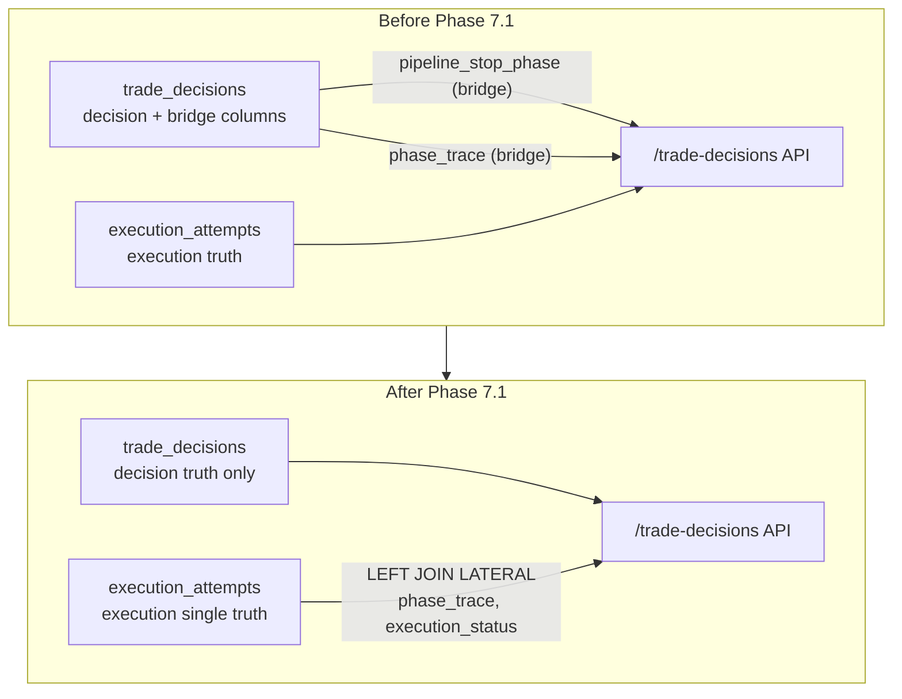

# Phase 7.1 — `trade_decisions` Bridge 컬럼 DROP Migration 최종 보고서

**작성일**: 2026-05-23  
**상태**: ✅ 완료  
**담당 Phase**: Phase 7.1 (Execution Bridge 컬럼 제거)

---

## 1. 작업 개요

### 1.1 목적

Phase 7.1은 [`trading.trade_decisions`](db/migrations/0026_drop_bridge_columns_from_trade_decisions.sql) 테이블에 잔존하던 **execution bridge 컬럼 4개**를 최종 DROP하는 migration이다.

### 1.2 배경

초기 아키텍처에서는 `trade_decisions`가 decision과 execution 상태를 모두 보유하는 **단일 truth** 역할을 했다. 시간이 지나며 [`trading.execution_attempts`](db/migrations/0023_add_execution_attempts.sql) 테이블이 execution read/write의 **단일 truth**로 분리되었고, `trade_decisions`는 decision truth만 담당하게 되었다.

이 과정에서 bridge 컬럼은 Phase 6에서 **8개 Area의 코드 의존성**이 모두 제거되었고, Phase 7.1에서 실제 DDL DROP을 실행했다.

### 1.3 범위

| 항목 | 포함 여부 |
|------|-----------|
| `trade_decisions` bridge 컬럼 DROP | ✅ |
| Consumer(코드 의존성) 사전 제거 | ✅ (Phase 6) |
| Docker build/health check 검증 | ✅ |
| API shape 검증 | ✅ |
| 전 suite 테스트 통과 (147 passed) | ✅ |
| Backfill (Phase 3 이전 데이터) | ❌ (Phase 7.2, 선택적) |
| Pipeline 완전 분리 | ❌ (Phase 7.3, P2) |

---

## 2. 제거 컬럼 목록

| # | 컬럼명 | 타입 | 용도 | 도입 시점 |
|---|--------|------|------|-----------|
| 1 | `pipeline_stop_phase` | `VARCHAR` | execution 중단 단계 식별자 | [`0021_add_pipeline_stop_fields.sql`](db/migrations/0021_add_pipeline_stop_fields.sql) |
| 2 | `pipeline_stop_reason` | `VARCHAR` | execution 중단 사유 | 동일 |
| 3 | `pipeline_stopped_at` | `TIMESTAMPTZ` | execution 중단 시각 | 동일 |
| 4 | `phase_trace` | `JSONB` | 파이프라인 단계별 실행 추적 | [`0022_add_phase_trace_to_trade_decisions.sql`](db/migrations/0022_add_phase_trace_to_trade_decisions.sql) |

> **참고**: 위 4개 컬럼은 모두 [`trading.execution_attempts`](db/migrations/0023_add_execution_attempts.sql) 테이블에 동등한 컬럼이 존재하며, 실제 데이터는 `execution_attempts`가 단일 truth로 기능하고 있었다.

---

## 3. Consumer 검증 (DROP 전 사전 확인)

Phase 6에서 아래 **8개 Area**의 bridge 컬럼 코드 의존성이 제거되었다. DROP 전 최종 재확인 결과 잔존 consumer는 **0건**이었다.

| Area | 파일/모듈 | 제거 결과 |
|------|-----------|-----------|
| API Schema | [`src/agent_trading/api/schemas.py`](src/agent_trading/api/schemas.py) | ✅ `phase_trace`는 `execution_attempts` LEFT JOIN LATERAL로 대체 |
| API Route (trade-decisions) | [`src/agent_trading/api/routes/trade_decisions.py`](src/agent_trading/api/routes/trade_decisions.py) | ✅ bridge 필드 참조 제거 |
| Repository (Postgres) | [`src/agent_trading/repositories/postgres/trade_decisions.py`](src/agent_trading/repositories/postgres/trade_decisions.py) | ✅ LEFT JOIN LATERAL로 `execution_attempts` sourcing |
| Repository (Memory) | [`src/agent_trading/repositories/memory.py`](src/agent_trading/repositories/memory.py) | ✅ bridge 필드 참조 제거 |
| Contract (Row DTO) | [`src/agent_trading/repositories/contracts.py`](src/agent_trading/repositories/contracts.py) | ✅ `phase_trace`는 `execution_attempts` 출처 주석 명시 |
| Domain Entity | [`src/agent_trading/domain/entities.py`](src/agent_trading/domain/entities.py) | ✅ `phase_trace`는 `ExecutionAttemptEntity`에만 존재 |
| Service (Orchestrator) | [`src/agent_trading/services/decision_orchestrator.py`](src/agent_trading/services/decision_orchestrator.py) | ✅ `phase_trace`는 `ExecutionAttemptEntity`로만 기록 |
| Test Suite | `tests/**/*.py` | ✅ bridge 필드 단언 제거 또는 제거 검증으로 변경 |

**소스 코드 내 bridge 컬럼 문자열 스캔 결과**: `pipeline_stop_phase`, `pipeline_stop_reason`, `pipeline_stopped_at` — **0건** (execution_attempts의 `stop_phase`, `stop_reason`과는 별개)

---

## 4. Migration 상세

### 4.1 SQL 내용

```sql
-- 0026: Phase 7.1 — Remove execution bridge columns from trade_decisions
-- Bridge period 종료: execution read/write는 ExecutionAttempt가 단일 truth
-- trade_decisions는 decision truth만 담당

ALTER TABLE trading.trade_decisions
    DROP COLUMN IF EXISTS pipeline_stop_phase,
    DROP COLUMN IF EXISTS pipeline_stop_reason,
    DROP COLUMN IF EXISTS pipeline_stopped_at,
    DROP COLUMN IF EXISTS phase_trace;
```

### 4.2 Runner 정렬 확인

Migration runner [`src/agent_trading/db/migrations/run.py`](src/agent_trading/db/migrations/run.py)는 `db/migrations/` 디렉토리 내 `.sql` 파일을 **lexicographic order**로 정렬하여 실행한다.

```
0025_add_fetch_status_to_snapshot_tables.sql
0026_drop_bridge_columns_from_trade_decisions.sql   ← 본 파일 (정렬 이상 없음)
```

`0026`은 마지막 migration 파일이므로 이후 migration이 존재하지 않아 순서 충돌이 없다.

### 4.3 적용

```bash
$ # Migration 적용 (docker compose 내부에서 실행)
$ docker compose exec -T app python -m agent_trading.db.migrations.run

$ # 적용 확인 (Remaining bridge columns: 0개)
$ docker compose exec -T db psql -U $POSTGRES_USER -d $POSTGRES_DB \
    -c "SELECT column_name FROM information_schema.columns
        WHERE table_schema='trading' AND table_name='trade_decisions'
        AND column_name IN ('pipeline_stop_phase','pipeline_stop_reason',
                            'pipeline_stopped_at','phase_trace');"
```

**결과**: `Remaining bridge columns: []` (0개 ✅)

---

## 5. 테스트 결과

### 5.1 통과 현황 (총 147 passed)

| Test Suite | 파일 | 결과 |
|------------|------|------|
| API Inspection | [`tests/api/test_inspection.py`](tests/api/test_inspection.py) | 62 passed ✅ |
| Repository - Trade Decisions | [`tests/repositories/test_postgres_trade_decisions.py`](tests/repositories/test_postgres_trade_decisions.py) | 10 passed ✅ |
| Repository - Execution Attempts | [`tests/repositories/test_postgres_execution_attempts.py`](tests/repositories/test_postgres_execution_attempts.py) | 5 passed ✅ |
| API - Execution Attempts | [`tests/api/test_execution_attempts.py`](tests/api/test_execution_attempts.py) | 8 passed ✅ |
| Service - Decision Submit Pipeline | [`tests/services/test_decision_submit_pipeline.py`](tests/services/test_decision_submit_pipeline.py) | 62 passed ✅ |
| **Total** | | **147 passed ✅** |

### 5.2 핵심 검증 테스트: `test_bridge_fields_no_longer_present`

```python
def test_bridge_fields_no_longer_present(self, client: TestClient) -> None:
    """bridge 필드(pipeline_stop_phase 등)가 API 응답에서 제거되어야 함."""
    resp = client.get("/trade-decisions")
    assert resp.status_code == 200
    data = resp.json()
    items = data.get("items", [])
    if items:
        d = items[0]
        assert "pipeline_stop_phase" not in d
        assert "pipeline_stop_reason" not in d
        assert "pipeline_stopped_at" not in d
```

### 5.3 `phase_trace` PRESENT 확인 (execution_attempts JOIN)

```python
def test_phase_trace_fields_in_response(self, client: TestClient) -> None:
    """phase_trace 및 derived 필드가 API 응답에 포함된다.
    (Phase 6: bridge 컬럼 제거 후에도 execution_attempts 출처로 계속 노출)"""
    ...
    # phase_trace raw 필드는 execution_attempts 출처로 계속 노출
    assert "phase_trace" in item
```

`phase_trace`는 `trade_decisions`에서 DROP되었지만, [`LEFT JOIN LATERAL`](src/agent_trading/repositories/postgres/trade_decisions.py:211-227)로 `execution_attempts`에서 조회되어 **API 응답에는 계속 포함**된다.

### 5.4 `latest_*` derived 필드 PRESENT 확인

`phase_count`, `total_elapsed_ms`, `latest_phase`, `latest_phase_detail`, `latest_status`는 `phase_trace`에서 계산되는 derived 필드로, [`src/agent_trading/api/schemas.py`](src/agent_trading/api/schemas.py:464-484)에서 컴퓨테이션되어 정상 노출된다.

---

## 6. Docker 검증 결과

### 6.1 Build

```bash
$ docker compose build --no-cache
```

✅ 빌드 성공 (캐시 미사용)

### 6.2 Startup

```bash
$ docker compose down && up -d
```

✅ 정상 기동

### 6.3 Health Check

```json
GET /health
→ {"status":"ok","database":"connected"}
```

✅ 애플리케이션 + DB 연결 정상

### 6.4 API Shape 검증

| Endpoint | 검증 항목 | 결과 |
|----------|-----------|------|
| `GET /trade-decisions` | bridge 필드 3개 MISSING (`pipeline_stop_phase`, `pipeline_stop_reason`, `pipeline_stopped_at`) | ✅ |
| `GET /trade-decisions` | `phase_trace` PRESENT (execution_attempts JOIN) | ✅ |
| `GET /trade-decisions` | `latest_*` derived 필드 PRESENT | ✅ |
| `GET /execution-attempts` | 정상 응답 (회귀 없음) | ✅ |

---

## 7. Bridge Period 종료 선언

### 7.1 Data Flow (Before → After)



### 7.2 Truth Sourcing 정리

| 정보 | 이전 Truth | 현재 Truth | 비고 |
|------|-----------|-----------|------|
| Decision (의사결정) | `trade_decisions` | `trade_decisions` | 변경 없음 |
| Execution status | `trade_decisions` (bridge) + `execution_attempts` | `execution_attempts` (단일) | ✅ Bridge 제거 |
| Pipeline stop reason | `trade_decisions` (bridge) + `execution_attempts` | `execution_attempts` (단일) | ✅ Bridge 제거 |
| Phase trace | `trade_decisions` (bridge) + `execution_attempts` | `execution_attempts` (단일) | ✅ Bridge 제거 |
| `latest_*` derived | `trade_decisions` (bridge)에서 계산 | `execution_attempts.phase_trace`에서 계산 | ✅ 소스만 변경 |

### 7.3 선언

> **`trade_decisions`는 decision truth만을 담당한다. Execution read/write의 단일 truth는 `execution_attempts`가 담당한다. Bridge period는 종료되었다.**

---

## 8. 남은 작업

### 8.1 Phase 7.2: Backfill (선택적)

**목적**: Phase 3 이전에 생성된 `trade_decisions` 레코드 중 대응하는 `execution_attempts`가 없는 데이터에 대한 backfill.

| 항목 | 내용 |
|------|------|
| 우선순위 | P3 (Low) |
| 영향 범위 | 소수 (Phase 3 이전 데이터) |
| 방법 | `trade_decisions` → `execution_attempts` 일괄 INSERT |
| 실행 조건 | 실제 운영/분석에서 필요할 때 |

### 8.2 Phase 7.3: Pipeline 완전 분리 (P2)

**목적**: Decision pipeline이 `execution_attempts` 쓰기를 직접 수행하지 않고, 별도 Execution Service를 통해 비동기적으로 처리하도록 리팩터링.

| 항목 | 내용 |
|------|------|
| 우선순위 | P2 |
| 영향 범위 | [`decision_orchestrator.py`](src/agent_trading/services/decision_orchestrator.py) — ExecutionAttemptEntity 생성 로직 |
| 의존성 | Phase 7.1 완료 (본 건) |
| 설계 방향 | Decision → Event → Execution Consumer |

---

## 9. 다음 단계 제안

### 9.1 즉시 가능 (P1)

- **EI Output Contract Phase 1**: 외부 시스템과의 계약 정의 (API 스펙 문서화)
- **Monitoring 대시보드 보강**: `execution_attempts` 기반 execution 지표 시각화

### 9.2 단기 검토 (P2)

- **Phase 7.3**: Pipeline 분리 리팩터링 설계
- **Execution attempts retention 정책**: 오래된 execution 데이터 아카이빙/삭제 정책 수립

### 9.3 장기 검토 (P3)

- **Phase 7.2**: Backfill 스크립트 작성
- **readモデル 분리**: CQRS 패턴 도입 검토

---

## 부록 A: 관련 파일 목록

| 파일 | 역할 |
|------|------|
| [`db/migrations/0026_drop_bridge_columns_from_trade_decisions.sql`](db/migrations/0026_drop_bridge_columns_from_trade_decisions.sql) | 본 DROP migration |
| [`src/agent_trading/db/migrations/run.py`](src/agent_trading/db/migrations/run.py) | Migration runner (lexicographic sort) |
| [`src/agent_trading/api/schemas.py`](src/agent_trading/api/schemas.py) | API schema (phase_trace derived field computation) |
| [`src/agent_trading/repositories/postgres/trade_decisions.py`](src/agent_trading/repositories/postgres/trade_decisions.py) | LEFT JOIN LATERAL execution_attempts (phase_trace sourcing) |
| [`tests/api/test_inspection.py`](tests/api/test_inspection.py) | `test_bridge_fields_no_longer_present` 포함 62개 테스트 |
| [`tests/repositories/test_postgres_trade_decisions.py`](tests/repositories/test_postgres_trade_decisions.py) | Trade decisions repository 테스트 (10 passed) |
| [`tests/repositories/test_postgres_execution_attempts.py`](tests/repositories/test_postgres_execution_attempts.py) | Execution attempts repository 테스트 (5 passed) |
| [`tests/api/test_execution_attempts.py`](tests/api/test_execution_attempts.py) | Execution attempts API 테스트 (8 passed) |
| [`tests/services/test_decision_submit_pipeline.py`](tests/services/test_decision_submit_pipeline.py) | Decision submit pipeline 서비스 테스트 (62 passed) |

## 부록 B: Migration 히스토리

| Migration | 설명 | Phase |
|-----------|------|-------|
| [`0021_add_pipeline_stop_fields.sql`](db/migrations/0021_add_pipeline_stop_fields.sql) | `pipeline_stop_phase`, `pipeline_stop_reason`, `pipeline_stopped_at` 추가 | Bridge 도입 |
| [`0022_add_phase_trace_to_trade_decisions.sql`](db/migrations/0022_add_phase_trace_to_trade_decisions.sql) | `phase_trace` (JSONB) 추가 | Bridge 도입 |
| [`0023_add_execution_attempts.sql`](db/migrations/0023_add_execution_attempts.sql) | `execution_attempts` 테이블 생성 (신규 truth) | Execution 분리 |
| [`0024_make_execution_attempts_nullable.sql`](db/migrations/0024_make_execution_attempts_nullable.sql) | Execution attempts nullable 컬럼 정리 | 정규화 |
| [`0026_drop_bridge_columns_from_trade_decisions.sql`](db/migrations/0026_drop_bridge_columns_from_trade_decisions.sql) | **Bridge 컬럼 4개 DROP** ✅ | **Phase 7.1 (본 건)** |
