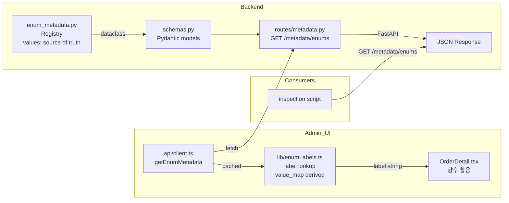

# Enum Field Metadata Registry — 설계 및 구현 계획

> **목표**: Admin UI와 inspection consumer가 내부 enum canonical 값을 한국어 표시명으로 안정적으로 렌더링할 수 있도록, 백엔드에 재사용 가능한 enum metadata 구조를 등록하고 API로 노출한다.

---

## 1. 설계 결정

### 1-A. Metadata 노출 방식: **A안 — 별도 metadata endpoint**

`GET /metadata/enums` — 모든 enum field metadata를 한 번에 반환

| 항목 | A안: 별도 endpoint | B안: detail payload 내 포함 |
|------|-------------------|---------------------------|
| 재사용성 | ✅ 한 번 fetch로 모든 필드 사용 | ❌ 각 response마다 중복 |
| 기존 API 변경 | ❌ 없음 | ⚠️ schema 확장 필요 |
| Payload 크기 | ✅ 작음 (필요시에만 fetch) | ❌ 모든 list/detail 응답에 포함 |
| Admin UI 구현 | fetch 1회 + lookup map | 매핑 즉시 가능 |

**선택 근거**: 재사용성이 가장 중요. 향후 다른 enum 필드로 확장해도 consumer 변경만으로 대응 가능.

### 1-B. Metadata 스키마

```json
{
  "field": "order_type",
  "type": "enum",
  "values": [
    {
      "value": "limit",
      "label": "지정가",
      "description": null,
      "broker_code": "00",
      "supported": true
    },
    {
      "value": "market",
      "label": "시장가",
      "description": null,
      "broker_code": "01",
      "supported": true
    }
  ]
}
```

### 1-C. Source of Truth

**중앙 registry**: [`src/agent_trading/api/enum_metadata.py`](src/agent_trading/api/enum_metadata.py) — 유일한 metadata 정의 장소

- Python tuple 기반 (DB 의존성 없음)
- `values`만 source of truth
- `value_map`은 파생값 (별도 유지 금지)
- domain enum 값을 key로 사용
- canonical 값 변경 금지 (domain enum 그대로 유지)

### 1-D. `broker_code` 정책

| 구분 | source of truth | 용도 |
|------|----------------|------|
| Submit 로직 | [`rest_client._map_order_type()`](src/agent_trading/brokers/koreainvestment/rest_client.py:1225) | KIS `ORD_DVSN` 실제 전송값 |
| Enum metadata의 `broker_code` | [`enum_metadata.py`](src/agent_trading/api/enum_metadata.py) | **UI/inspection 표시용 참고값** |

> `broker_code`는 metadata에서 display reference로 제공되나, 실제 submit 시 authoritative mapping은 `rest_client._map_order_type()`이므로 submit semantics와 무관하다.

### 1-E. 이번 턴 P0 범위

| 필드 | 상태 | 비고 |
|------|------|------|
| `order_type` | **P0 — 실제 등록 + 테스트** | 이번 턨 집중 대상 |
| `order_status` | 구조만 확장 가능, 등록 안 함 | 후속 턴 |
| `side` | 구조만 확장 가능, 등록 안 함 | 후속 턴 |
| `decision_type` | 구조만 확장 가능, 등록 안 함 | 후속 턴 |
| `entry_style` | 구조만 확장 가능, 등록 안 함 | 후속 턴 |

---

## 2. `order_type` Metadata 상세

### 2-A. 등록 값

| Value | Label | Broker Code | Supported | Description |
|-------|-------|-------------|-----------|-------------|
| `limit` | `지정가` | `00` | `true` | |
| `market` | `시장가` | `01` | `true` | |
| `stop` | `조건부지정가` | `02` | `false` | `KIS adapter currently unsupported` |
| `stop_limit` | `조건부지정가` | `03` | `false` | `KIS adapter currently unsupported` |

> `stop`, `stop_limit`은 KIS adapter의 [`supported_order_types`](src/agent_trading/brokers/koreainvestment/adapter.py:96)에 포함되지 않음. `supported=false`로 표시하여 UI에서 구분 가능.

---

## 3. `value_map` 파생 정책

**원칙**: `values`만 source of truth. `value_map`은 별도 필드로 보관하지 않고, 필요 시 helper/`@property`로 파생.

```python
@dataclass(frozen=True)
class EnumFieldMetadata:
    field: str
    type: str = "enum"
    values: tuple[EnumValueMetadata, ...] = ()

    @property
    def value_map(self) -> dict[str, EnumValueMetadata]:
        """Derived O(1) lookup — not stored separately."""
        return {v.value: v for v in self.values}
```

---

## 4. 변경 파일 목록

| # | 파일 | 변경 유형 | 내용 |
|---|------|-----------|------|
| 1 | [`src/agent_trading/api/enum_metadata.py`](src/agent_trading/api/enum_metadata.py) | **신규 생성** | 중앙 registry — `EnumValueMetadata`, `EnumFieldMetadata` dataclass + `ENUM_METADATA` dict |
| 2 | [`src/agent_trading/api/schemas.py`](src/agent_trading/api/schemas.py) | **수정** | `EnumValueMetadataSchema`, `EnumFieldMetadataSchema`, `EnumMetadataListResponse` Pydantic model 추가 |
| 3 | [`src/agent_trading/api/routes/metadata.py`](src/agent_trading/api/routes/metadata.py) | **신규 생성** | `GET /metadata/enums`, `GET /metadata/enums/{field}` |
| 4 | [`src/agent_trading/api/app.py`](src/agent_trading/api/app.py) | **수정** | metadata router 등록 (protected) |
| 5 | [`tests/api/test_enum_metadata.py`](tests/api/test_enum_metadata.py) | **신규 생성** | endpoint 응답 shape, `order_type` 값/label/broker_code/supported 검증 |
| 6 | [`admin_ui/src/types/api.ts`](admin_ui/src/types/api.ts) | **수정** (경로 확인 후) | `EnumMetadataResponse` TypeScript 타입 추가 |
| 7 | [`admin_ui/src/api/client.ts`](admin_ui/src/api/client.ts) | **수정** (경로 확인 후) | `getEnumMetadata()` fetch 함수 추가 |

**변경 제외 (명시적)**:
- [`enums.py`](src/agent_trading/domain/enums.py) — canonical 값 변경 금지
- 기존 API response schema — `order_type` 필드는 계속 `str` (canonical value)
- broker submit semantics — 변경 금지
- Admin UI의 OrderDetail.tsx/OrdersView.tsx — 대규모 개편 금지
- 기존 테스트 — 회귀 없음 확인만

---

## 5. 구현 상세

### 5-1. `enum_metadata.py` 구조

```python
"""Central registry for enum field metadata.

Every enum field that appears in API responses should have its metadata
registered here so that consumers (Admin UI, inspection scripts) can
resolve canonical values to human-readable labels without hardcoding.

Usage::

    from agent_trading.api.enum_metadata import ENUM_METADATA

    metadata = ENUM_METADATA["order_type"]
    label = metadata.value_map["limit"].label  # "지정가"
"""

from __future__ import annotations

from dataclasses import dataclass, field
from typing import Mapping


@dataclass(frozen=True)
class EnumValueMetadata:
    """Metadata for a single enum value."""
    value: str
    label: str
    description: str | None = None
    broker_code: str | None = None
    supported: bool = True


@dataclass(frozen=True)
class EnumFieldMetadata:
    """Metadata for an entire enum field."""
    field: str
    type: str = "enum"
    values: tuple[EnumValueMetadata, ...] = ()

    @property
    def value_map(self) -> dict[str, EnumValueMetadata]:
        """Derived O(1) lookup — not stored separately."""
        return {v.value: v for v in self.values}


# ── Registry ──────────────────────────────────────────────────────────
# P0: order_type — 실제 등록 + 테스트 완료
# P1: order_status, side, decision_type, entry_style — 구조만 확장 가능

ENUM_METADATA: dict[str, EnumFieldMetadata] = {
    "order_type": EnumFieldMetadata(
        field="order_type",
        values=(
            EnumValueMetadata(
                value="limit",
                label="지정가",
                broker_code="00",
                supported=True,
            ),
            EnumValueMetadata(
                value="market",
                label="시장가",
                broker_code="01",
                supported=True,
            ),
            EnumValueMetadata(
                value="stop",
                label="조건부지정가",
                broker_code="02",
                supported=False,
                description="KIS adapter currently unsupported",
            ),
            EnumValueMetadata(
                value="stop_limit",
                label="조건부지정가",
                broker_code="03",
                supported=False,
                description="KIS adapter currently unsupported",
            ),
        ),
    ),
}


def get_enum_field(field: str) -> EnumFieldMetadata | None:
    """Look up a single field by name. Returns ``None`` if not found."""
    return ENUM_METADATA.get(field)
```

### 5-2. API Endpoints

```python
# GET /metadata/enums
# Response: {
#   "fields": [
#     {"field": "order_type", "type": "enum", "values": [...]}
#   ]
# }

# GET /metadata/enums/{field}
# Response: single EnumFieldMetadataSchema
# 404: {"detail": "Enum metadata not found: {field}"}
```

### 5-3. Schema (schemas.py 추가)

```python
class EnumValueMetadataSchema(BaseModel):
    value: str
    label: str
    description: str | None = None
    broker_code: str | None = None
    supported: bool = True


class EnumFieldMetadataSchema(BaseModel):
    field: str
    type: str = "enum"
    values: list[EnumValueMetadataSchema]


class EnumMetadataListResponse(BaseModel):
    fields: list[EnumFieldMetadataSchema]
```

### 5-4. Router (routes/metadata.py)

```python
router = APIRouter(prefix="/metadata", tags=["metadata"])


@router.get("/enums", response_model=EnumMetadataListResponse)
async def list_enum_metadata() -> EnumMetadataListResponse:
    """List metadata for all registered enum fields."""
    from agent_trading.api.enum_metadata import ENUM_METADATA

    return EnumMetadataListResponse(
        fields=[
            EnumFieldMetadataSchema(
                field=meta.field,
                type=meta.type,
                values=[
                    EnumValueMetadataSchema(
                        value=v.value,
                        label=v.label,
                        description=v.description,
                        broker_code=v.broker_code,
                        supported=v.supported,
                    )
                    for v in meta.values
                ],
            )
            for meta in ENUM_METADATA.values()
        ]
    )


@router.get("/enums/{field}", response_model=EnumFieldMetadataSchema)
async def get_enum_field(field: str) -> EnumFieldMetadataSchema:
    """Get metadata for a single enum field."""
    from agent_trading.api.enum_metadata import get_enum_field

    meta = get_enum_field(field)
    if meta is None:
        raise HTTPException(
            status_code=404,
            detail=f"Enum metadata not found: {field}",
        )
    # ... serialize
```

### 5-5. Router 등록 (app.py)

기존 protected router 등록 패턴과 동일:

```python
from agent_trading.api.routes.metadata import router as metadata_router
protected_routers.append(metadata_router)
```

---

## 6. 테스트 계획

| # | 테스트 | 검증 내용 |
|---|--------|-----------|
| 1 | `test_list_all_fields` | `GET /metadata/enums` → 200, `fields` list, `order_type` 포함 |
| 2 | `test_get_order_type_field` | `GET /metadata/enums/order_type` → 200, field=order_type |
| 3 | `test_order_type_values_count` | `order_type`에 4개 값 (limit, market, stop, stop_limit) |
| 4 | `test_order_type_limit_label` | limit → label=지정가, broker_code=00, supported=true |
| 5 | `test_order_type_market_label` | market → label=시장가, broker_code=01, supported=true |
| 6 | `test_order_type_stop_unsupported` | stop → supported=false, description에 "unsupported" 포함 |
| 7 | `test_order_type_stop_limit_unsupported` | stop_limit → supported=false |
| 8 | `test_field_not_found` | 존재하지 않는 필드 → 404, `detail` message 포함 |
| 9 | `test_existing_api_regression` | 기존 `GET /orders` 정상 응답 확인 |

---

## 7. Admin UI 경로 확인

실제 존재하는 파일 경로:

- [`admin_ui/src/types/api.ts`](admin_ui/src/types/api.ts) — ✅ 존재 (확인 완료)
- [`admin_ui/src/api/client.ts`](admin_ui/src/api/client.ts) — ✅ 존재 (확인 완료)

이번 턴 변경 범위:
- TypeScript 타입 추가 (`EnumValueMetadataSchema`, `EnumFieldMetadataSchema`, `EnumMetadataListResponse`)
- fetch 함수 추가 (`getEnumMetadata()`)
- **OrderDetail.tsx/OrdersView.tsx 렌더링 로직 변경 없음** (UI 하드코딩 제거는 후속 턴)

### 활용 예시 (향후)

```typescript
// admin_ui/src/lib/enumLabels.ts
import { getEnumMetadata } from "../api/client";

let _cache: EnumMetadataResponse | null = null;

export async function getEnumLabel(field: string, value: string): Promise<string> {
  if (!_cache) _cache = await getEnumMetadata();
  const fieldMeta = _cache.fields.find(f => f.field === field);
  return fieldMeta?.values.find(v => v.value === value)?.label ?? value;
}

// OrderDetail.tsx 사용 예:
// const label = await getEnumLabel("order_type", order.order_type);
// → "지정가" (canonical "limit" 유지)
```

---

## 8. 작업 제약 준수 확인

| 제약 | 상태 |
|------|------|
| live 주문 금지 | ✅ 해당 없음 |
| broker submit semantics 변경 금지 | ✅ [`rest_client.py`](src/agent_trading/brokers/koreainvestment/rest_client.py) 변경 없음 |
| hard guardrail / reconciliation 경계 변경 금지 | ✅ 해당 없음 |
| admin UI 대규모 개편 금지 | ✅ api.ts + client.ts만 최소 변경, 렌더링 로직 변경 없음 |
| domain enum 값 변경 금지 | ✅ [`enums.py`](src/agent_trading/domain/enums.py) 변경 없음 |
| 과도한 abstraction 금지 | ✅ dataclass + dict + property, 단순 구조 |
| 기존 API response에 display label 직접 주입 금지 | ✅ metadata endpoint 분리 |

---

## 9. Mermaid: 전체 데이터 흐름



---

## 10. Migrations

**DB migration 불필요** — metadata는 Python 코드 레벨에서만 관리.

---

## 11. 작업 순서

1. [`src/agent_trading/api/enum_metadata.py`](src/agent_trading/api/enum_metadata.py) 신규 생성 — `order_type`만 등록, `value_map`은 `@property` 파생
2. [`src/agent_trading/api/schemas.py`](src/agent_trading/api/schemas.py) 수정 — Pydantic schema 3개 추가 (EnumValueMetadataSchema, EnumFieldMetadataSchema, EnumMetadataListResponse)
3. [`src/agent_trading/api/routes/metadata.py`](src/agent_trading/api/routes/metadata.py) 신규 생성 — 2개 endpoint, 404는 `detail="Enum metadata not found: {field}"`
4. [`src/agent_trading/api/app.py`](src/agent_trading/api/app.py) 수정 — metadata router 등록 (protected)
5. [`tests/api/test_enum_metadata.py`](tests/api/test_enum_metadata.py) 신규 생성 — 9개 테스트, `order_type` 집중
6. 기존 테스트 전체 통과 확인 (최소 1개 regression check)
7. [`admin_ui/src/types/api.ts`](admin_ui/src/types/api.ts) 수정 — TypeScript 타입 추가
8. [`admin_ui/src/api/client.ts`](admin_ui/src/api/client.ts) 수정 — `getEnumMetadata()` 함수 추가
