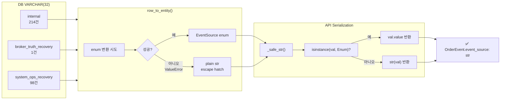

# EventSource 타입 정책 문서

> **작성일**: 2026-05-15 (장 마감 후 설계/정책 정리)
>
> **관련 incident**: GET /orders/{id}/events 500 — `event_source`가 `str`인 DB row에서 `.value` 호출 시 `AttributeError`
>
> **장중 hotfix**: [`_safe_str()`](../src/agent_trading/api/routes/orders.py:24) defensive helper 도입으로 500 방어. **본 문서는 장후 정책 정리**.

---

## 1. 현재 문제 재정의

### 1.1 증상

[`OrderStateEventEntity.event_source`](../src/agent_trading/domain/entities.py:377)는 Python 타입 애노테이션상 [`EventSource`](../src/agent_trading/domain/enums.py:80) enum으로 선언되어 있다. 그러나:

1. DB에는 `VARCHAR(32)` 제약만 존재하고 **CHECK 제약이 없어** enum 멤버가 아닌 문자열도 저장 가능하다.
2. [`row_to_entity()`](../src/agent_trading/db/row_mapper.py:58)는 enum 변환 실패 시 `ValueError`를 조용히 무시하고 **plain `str`을 그대로 통과**시킨다.
3. API 계층이 `.value`로 직렬화를 시도할 때, plain `str`에는 `.value` 속성이 없어 `AttributeError` 발생.

### 1.2 근본 원인

| 계층 | 타입 | 문제 |
|------|------|------|
| DB column | `VARCHAR(32)` | CHECK 제약 없음, 모든 문자열 허용 |
| DB COMMENT | 5개 enum 값 명시 | COMMENT는 강제성 없음, 신규 값 추가 시 갱신 누락 |
| `row_to_entity()` | `EventSource` 시도 → 실패 시 `str` | **silent downgrade** — 호출자가 enum인지 str인지 알 수 없음 |
| Entity | `EventSource` (enum) | 타입 애노테이션과 실제 값이 불일치할 수 있음 |
| Repository (WRITE) | `event.event_source.value` | ENUM이면 항상 안전, str이면 `AttributeError` |
| API schema | `event_source: str` | schema는 str이지만, `OrderEvent` 생성 시 `.value` 호출 → crash |

---

## 2. DB 값 분포 (실제 현황)

```sql
SELECT event_source, COUNT(*) AS cnt
FROM trading.order_state_events
GROUP BY event_source
ORDER BY cnt DESC;
```

| event_source | 건수 | EventSource enum 멤버? | 출처 |
|---|---|---|---|
| `internal` | 214 | ✅ `INTERNAL` | 정상 application code 경로 |
| `system_ops_recovery` | 98 | ❌ 없음 | stale_cleanup batch (raw SQL) |
| `broker_truth_recovery` | 1 | ❌ 없음 | 수동 복구 스크립트 (raw SQL) |
| **합계** | **313** | — | — |

**비정규 값 비율**: 99 / 313 = **31.6%** — 단순 "드문 케이스"가 아님.

### 2.1 비정규 값 발생 경로 (raw SQL 직접 INSERT)

두 값 모두 Python application 코드를 **완전히 우회**하여 raw SQL로 직접 INSERT되었다:

| 값 | 스크립트 | 문서 |
|---|---|---|
| `broker_truth_recovery` | 수동 실행 SQL | [`plans/recover_000880_broker_truth_order_2026-05-15.md`](recover_000880_broker_truth_order_2026-05-15.md) |
| `system_ops_recovery` | `_cleanup_pending_submit.py` 등 | near_real_ops_scheduler stale cleanup |

**중요**: `broker_truth_recovery`와 `system_ops_recovery` 문자열은 `src/agent_trading/` 디렉토리 내 어떤 Python 파일에도 **단 한 번도 등장하지 않는다**. 오직 `_*.py` (루트 임시 스크립트)와 recovery plan 문서에만 존재한다.

---

## 3. 옵션 비교

### 옵션 A: Enum 멤버 확장 (closed set 유지)

`EventSource` enum에 `BROKER_TRUTH_RECOVERY`와 `SYSTEM_OPS_RECOVERY`를 추가하고, 기존 99건은 DB `UPDATE`로 정규화한다.

```python
class EventSource(str, Enum):
    INTERNAL = "internal"
    BROKER_REST = "broker_rest"
    BROKER_WS = "broker_ws"
    RECONCILIATION = "reconciliation"
    OPERATOR = "operator"
    BROKER_TRUTH_RECOVERY = "broker_truth_recovery"   # 추가
    SYSTEM_OPS_RECOVERY = "system_ops_recovery"        # 추가
```

**장점:**
- `EventSource` 타입이 실제 가능한 모든 값을 coverage — 타입 계약이 완전함
- `.value` 호출이 모든 값에 대해 안전 → `_safe_str()` 불필요
- `row_to_entity`의 silent downgrade가 발생하지 않음
- IDE 자동완성, 정적 분석, enum metadata API 모두 정상 동작
- 새로운 recovery 유형이 추가될 때 enum 확장을 강제하므로 추적성 확보

**단점:**
- `broker_truth_recovery`와 `system_ops_recovery`는 **운영 복구/정리 도메인**의 값 — core 도메인 enum이 운영 artifact를 알아야 함
- recovery 값이 늘어날 때마다 enum 수정 + DB backfill 필요
- `EventSource` enum이 점점 비대해질 위험 (core 5개 vs ops recovery N개)
- DB COMMENT도 함께 갱신 필요 (VARCHAR(32) 길이 제한 확인 필요)

### 옵션 B: String Canonical (enum 폐기, str 사용)

`EventSource` enum을 폐기하고 `event_source`를 모든 계층에서 `str`로 통일한다.

**변경 범위:**
- [`enums.py`](../src/agent_trading/domain/enums.py:80): `EventSource` enum 삭제
- [`entities.py`](../src/agent_trading/domain/entities.py:377): `event_source: str`로 변경
- [`row_mapper.py`](../src/agent_trading/db/row_mapper.py:86): `event_source`용 enum 변환 로직 제거
- API schema: 이미 `str`이므로 변경 불필요
- Repository WRITE: `event.event_source` (직접 str 사용, `.value` 불필요)
- 기존 `EventSource.INTERNAL.value` → `"internal"` 리터럴로 대체

**장점:**
- enum/str hybrid 문제가 근본적으로 사라짐
- raw SQL로 어떤 값이 들어와도 crash 없음
- 운영 스크립트가 enum import 없이 자유롭게 값 선택 가능
- DB ALERT / COMMENT만으로 값 범위 관리

**단점:**
- **도메인 의미 손실**: `EventSource`는 단순 문자열이 아니라 이벤트 출처의 **의미적 분류** — enum이 제공하는 타입 안전성과 추적성을 잃음
- 코드 전반에 "magic string"이 퍼짐 — 오타, 일관성 없는 네이밍 위험
- IDE 리팩토링 불가 (`internal` 문자열 직접 변경 어려움)
- enum metadata API (`GET /enums/EventSource`)가 동작 불가
- 미래에 `EventSource`에 행동(메서드)을 추가할 수 없음
- `_safe_str()`은 불필요해지지만, 기존 enum 의존 코드 전면 수정 필요

### 옵션 C: Enum + Escape Hatch (현재 패턴 공식화, 권장)

**현재 암묵적 패턴을 명시적 정책으로 승격**한다:

1. **Entity 타입은 `EventSource` enum 그대로 유지**
2. **`row_to_entity()`의 silent downgrade를 명시적 계약으로 문서화** — "enum 변환 실패 시 원본 str 유지"
3. **모든 `.value` 접근을 `_safe_str()` 또는 `_val()` 패턴으로 방어**
4. **공통 유틸리티 함수로 추출**하고, **`row_mapper` 계층에서 자동 직렬 변환 support** 추가

**장점:**
- 이미 장중 hotfix로 적용된 패턴 — 추가 변경 최소
- enum의 도메인 의미와 타입 안전성 유지
- raw SQL 긴급 복구가 필요할 때 enum 확장 없이도 값 삽입 가능
- `_safe_str()` 하나만으로 모든 계층 방어 가능
- DB 기존 99건 데이터 마이그레이션 불필요

**단점:**
- 정적 타입 검사가 enum이라고 보장하지 못함 (런타임에 str일 수 있음)
- 모든 `.value` 호출자가 방어 패턴을 기억해야 함 → 실수 가능성
- `mypy`나 IDE가 str/enum 혼합 상태를 감지 못함
- 정책 문서화 + 코드 리뷰 규칙으로 보완 필요

---

## 4. 권장: 옵션 C (Enum + Escape Hatch, 공식화)

### 4.1 권장 근거

| 기준 | 옵션 A | 옵션 B | 옵션 C |
|------|--------|--------|--------|
| 장중 hotfix와 호환 | 부분적 | 저 | **최고** |
| 도메인 의미 보존 | ✅ | ❌ | ✅ |
| 긴급 raw SQL 복구 가능 | 제한적 (사전 enum 확장 필요) | ✅ | ✅ |
| 변경 범위 | 중간 (enum + backfill) | 큼 (전면 수정) | **최소** |
| 타입 안전성 | 높음 | 낮음 | 중간 (방어 패턴으로 보완) |
| 운영 부담 (recovery 증가 시) | enum 확장마다 필요 | 없음 | 없음 |
| 정적 분석 이점 | 최대 | 최소 | 중간 |

**핵심 판단**: `broker_truth_recovery`와 `system_ops_recovery`는 **core 도메인의 이벤트 출처 분류가 아니라 운영 artifact**다. 이 값들을 `EventSource` enum에 영구 편입시키는 것은 타입 계약을 오염시킨다. 반면, core 도메인 enum을 포기하는 것은 과도한 후퇴다.

따라서 **Enum + Escape Hatch**가 현실적이고 지속 가능한 정책이다.

### 4.2 Escape Hatch의 의미

"Enum + Escape Hatch"는 다음을 의미한다:

1. **정상 경로는 항상 enum을 사용**한다 — application code에서 `EventSource` enum 멤버로 이벤트를 생성
2. **비상 경로(raw SQL)로 들어온 값은 str로 남지만 시스템이 crash하지 않음**
3. **운영 복구가 완료된 후에는 해당 값을 정규화(`UPDATE .. SET event_source = 'operator'`)할 수 있음**
4. **Escape hatch는 "있을 수 있다"는 인정이지 "권장한다"는 의미가 아님**

---

## 5. 계층별 적용 방안

### 5.1 공통 유틸리티: `_safe_str()` / `_val()`

이미 두 가지 유사 패턴이 공존한다:

| 위치 | 함수 | 방식 |
|------|------|------|
| [`orders.py:24`](../src/agent_trading/api/routes/orders.py:24) | `_safe_str(val)` | `isinstance(val, Enum)` |
| [`order_manager.py:806`](../src/agent_trading/services/order_manager.py:806) | `_val(v)` | `hasattr(v, "value")` |

**권장**: 두 함수 모두 유효하지만, 향후에는 `_safe_str()`의 `isinstance(val, Enum)` 방식을 표준으로 통일한다 (`hasattr`는 duck typing에 의존하므로 덜 명시적). 단, 현재 상태에서는 둘 중 하나를 강제로 통일할 필요는 없음 — 각각 로컬 스코프에서만 사용.

### 5.2 DB 계층

| 항목 | 현재 | 권장 |
|------|------|------|
| 컬럼 타입 | `VARCHAR(32)` | 유지 (변경 불필요) |
| CHECK 제약 | 없음 | **추가 검토 대상** (`event_source IN (...)`으로 enum 값만 허용) |
| DB COMMENT | 5개 enum 값만 문서화 | **6개 또는 7개로 갱신** + "운영 복구 값도 허용" 명시 |
| `row_to_entity()` | silent downgrade | **현상 유지 + 문서화 강화** (주석에 "escape hatch" 명시) |

**CHECK 제약 추가는 별도 논의 필요**: CHECK 제약을 걸면 raw SQL 긴급 복구가 막히므로, 운영 유연성이 중요한 현재 단계에서는 **보류**한다. 만약 enum에 recovery 값까지 포함(옵션 A)한다면 CHECK 제약을 추가해도 무방.

### 5.3 Entity 계층

```python
@dataclass(slots=True, frozen=True)
class OrderStateEventEntity:
    order_state_event_id: UUID
    order_request_id: UUID
    new_status: OrderStatus
    event_source: EventSource  # ← 타입 그대로 유지
    # NOTE: 런타임에는 row_to_entity의 escape hatch로 인해
    #       EventSource 멤버가 아닌 plain str이 들어올 수 있음.
    #       .value 접근 전 반드시 _safe_str() 사용.
    ...
```

타입 애노테이션은 `EventSource` enum 그대로 유지하되, **주석으로 escape hatch 존재를 명시**한다.

### 5.4 Repository 계층

[`order_state_events.py:38`](../src/agent_trading/repositories/postgres/order_state_events.py:38):
```python
event.event_source.value,  # ← WRITE path
```

**WRITE path는 항상 안전**하다 — `OrderStateEventEntity`가 Python 코드에서 enum으로만 생성되기 때문. escape hatch는 READ path에서만 발생.

단, 만약 `row_to_entity`를 거치지 않고 entity를 직접 생성해서 WRITE하는 코드가 있다면? 검증 결과 **모든 WRITE는 `_record_order_state_event()`에서 `EventSource.INTERNAL`로만 생성**되므로 안전.

**권장**: `event.event_source.value` 유지 (변경 불필요). 단, 향후 다른 EventSource 값이 WRITE에 사용될 경우를 대비해 `_safe_str()`로 변경하는 것도 고려.

### 5.5 API Schema 계층

[`schemas.py:133`](../src/agent_trading/api/schemas.py:133):
```python
event_source: str  # ← 이미 str. 변경 불필요.
```

Pydantic v2는 `EventSource` enum을 직접 field type으로 사용하면 `model_dump()`에서 `.value`로 자동 직렬화하지만, plain str이 들어오면 그대로 통과시킨다. 따라서 **schema 타입을 `str`로 유지**하는 것이 안전하다.

### 5.6 API Route 계층 (이미 수정 완료)

[`orders.py:179-180`](../src/agent_trading/api/routes/orders.py:179):
```python
new_status=_safe_str(e.new_status),
event_source=_safe_str(e.event_source),
```

**장중 hotfix 완료**. 추가 변경 불필요.

### 5.7 Admin UI

**영향 없음** — admin_ui TypeScript 코드에는 `event_source` 참조가 전혀 없음.

### 5.8 Enum Metadata API

[`GET /enums/EventSource`](../src/agent_trading/api/enum_metadata.py:73)는 `EventSource` enum 멤버만 반환한다. `broker_truth_recovery`와 `system_ops_recovery`는 enum 멤버가 아니므로 **metadata API에 나타나지 않음**. 이는 의도된 동작이다 — 운영 artifact가 enum metadata에 노출되지 않음.

---

## 6. 유사 리스크가 있는 다른 필드

`row_to_entity()`의 silent downgrade는 **모든 enum 필드**에 동일하게 적용된다. 즉, 다른 enum 필드에도 DB에 비정규 값이 있다면 같은 문제가 발생할 수 있다.

### 6.1 조사 결과

| Entity | Enum 필드 | DB 비정규 값 존재? | 위험 |
|--------|-----------|-------------------|------|
| `OrderStateEventEntity` | `event_source: EventSource` | ✅ (99건) | **실제 발생** |
| `OrderStateEventEntity` | `new_status: OrderStatus` | ❌ (미확인) | 낮음 |
| `OrderStateEventEntity` | `previous_status: OrderStatus` | ❌ (미확인) | 낮음 |
| `OrderRequestEntity` | `status: OrderStatus` | ❌ (미확인) | 낮음 |
| `OrderRequestEntity` | `side: OrderSide` | ❌ | 낮음 |
| `OrderRequestEntity` | `order_type: OrderType` | ❌ | 낮음 |
| 기타 entity | `Environment`, `BrokerName` 등 | ❌ | 낮음 |

**결론**: `EventSource`가 유일하게 실제 문제가 발생한 필드이다. 다른 enum 필드는 application code로만 값이 들어가므로 비정규 값 가능성이 낮다.

### 6.2 향후 예방

모든 `row_to_entity()` READ 경로에서 enum이 아닌 값이 반환될 수 있다는 점을 인지하고, **새로운 API route나 serialization 코드 작성 시 `_safe_str()` 사용을 원칙**으로 한다. `_val()` 패턴(`hasattr(v, "value")`)을 이미 사용 중인 [`order_manager.py:806`](../src/agent_trading/services/order_manager.py:806)는 좋은 선례.

---

## 7. 향후 Recovery Event 증가 시 고려사항

운영 복구 스크립트가 증가하면서 새로운 `event_source` 값이 생길 수 있다:

| 잠재적 값 | 시나리오 |
|-----------|----------|
| `position_truth_recovery` | Position snapshot 기반 position 정정 |
| `fill_gap_recovery` | 누락 fill 채우기 |
| `manual_operator_intervention` | 운영자 직접 조작 |
| `scheduler_cleanup` | 스케줄러 기반 정리 작업 |

**정책**: 새로운 recovery event_source 값이 필요하면:

1. **P0**: 해당 값을 raw SQL에 사용해도 **시스템이 crash하지 않음** (`_safe_str()` 방어)
2. **P1**: 복구 완료 후 **DB 값을 enum 멤버로 정규화** 검토 (`UPDATE ... SET event_source = 'operator'`)
3. **P2**: 동일한 유형의 복구가 **반복되어 표준 패턴이 되면** `EventSource` enum 확장 검토

---

## 8. 권장 실행 계획

### P0 (장중 hotfix — 완료)

- [x] `_safe_str()` helper 도입 ([`orders.py:24`](../src/agent_trading/api/routes/orders.py:24))
- [x] `get_order_events()`에서 `.value` → `_safe_str()` 대체 ([`orders.py:179-180`](../src/agent_trading/api/routes/orders.py:179))
- [x] Regression test 추가 ([`test_inspection.py`](../tests/api/test_inspection.py:22))
- [x] Docker rebuild & deploy

### P1 (장후 — 본 문서 범위)

- [ ] **DB COMMENT 갱신**: [`0003_add_safe_order_path_tables.sql:40-41`](../db/migrations/0003_add_safe_order_path_tables.sql:40)의 COMMENT에 `broker_truth_recovery`, `system_ops_recovery`가 **escape hatch로 존재**함을 명시
- [ ] **Entity 주석 추가**: [`entities.py:377`](../src/agent_trading/domain/entities.py:377)에 "런타임에 str일 수 있음" 주석 추가
- [ ] **`row_to_entity()` 주석 강화**: [`row_mapper.py:86-91`](../src/agent_trading/db/row_mapper.py:86)에 "escape hatch — enum 변환 실패 시 str 유지" 명시적 문서화
- [ ] **통합 테스트 보강**: `_safe_str()`이 다른 API route에서도 필요할 경우를 대비한 테스트 추가 검토

### P2 (향후 — 필요 시)

- [ ] **DB CHECK 제약 추가 검토**: 운영 안정성 단계에서 `event_source`에 CHECK 제약 도입
- [ ] **`row_to_entity()`에 WARNING 로그 추가**: enum 변환 실패 시 `logger.warning()` 출력으로 비정규 값 탐지
- [ ] **DB 정규화 백필**: 기존 99건 비정규 값을 정규 값(`operator` 또는 enum 멤버)으로 `UPDATE`하는 시점 결정
  - 단, `broker_truth_recovery` (1건)는 **증적 보존을 위해 유지** — 복구 이력 식별에 의미 있음
  - `system_ops_recovery` (98건)도 증적으로 유지하거나, `cleanup_rejected` 등의 값으로 대체 가능
- [ ] **공통 `_safe_str()` 모듈화**: 모든 API route에서 재사용할 수 있도록 공유 유틸리티 함수로 추출

---

## 9. 최종 상태 요약



**최종 결정**: **Enum + Escape Hatch (옵션 C)** 유지.

- `EventSource` enum은 도메인 의미를 위해 존속
- `row_to_entity()`의 silent downgrade는 **명시적 정책**으로 공식화
- 모든 API serialization은 `_safe_str()` 패턴으로 방어
- 기존 99건 비정규 값은 **증적으로 유지** (DB 정규화는 P2에서 결정)
- 운영 복구 스크립트에서 새 값 도입 시 enum 확장 불필요 — 단, 복구 완료 후 정규화 검토
