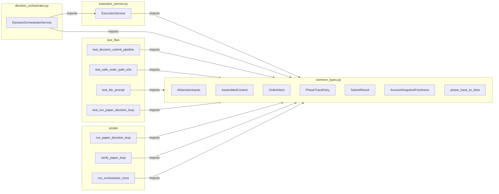

# Execution Pipeline Separation — Phase 3 설계 문서

## 1. 개요

Phase 1 (`translation.py` 추출)과 Phase 2 (`common_types.py` 통합) 완료 후,
`execution_service.py`에 남아 있는 공유 dataclass 3개와 static 함수 2개를
`common_types.py`로 이동한다.

## 2. 현재 상태 분석

### 2.1 이동 대상

| 대상 | 현재 위치 | 종류 |
|------|-----------|------|
| `PhaseTraceEntry` | `execution_service.py:80` | `@dataclass(slots=True, frozen=True)` |
| `SubmitResult` | `execution_service.py:100` | `@dataclass(slots=True, frozen=True)` |
| `AccountSnapshotFreshness` | `execution_service.py:146` | `@dataclass(slots=True, frozen=True)` |
| `_phase_trace_to_dicts()` | `execution_service.py:204` | `@staticmethod` on `ExecutionService` |
| `_build_submit_result()` | `execution_service.py:273` | `@staticmethod` on `ExecutionService` |

### 2.2 실제 코드 (설계 반영 필수)

> **주의**: 사용자 요구사항에 명시된 필드 시그니처는 draft 버전입니다.
> 아래는 현재 코드베이스의 실제 시그니처입니다.

#### `PhaseTraceEntry` ([`execution_service.py:80`](../src/agent_trading/services/execution_service.py:80))

```python
@dataclass(slots=True, frozen=True)
class PhaseTraceEntry:
    phase: str
    elapsed_ms: int
    status: str
```

#### `SubmitResult` ([`execution_service.py:100`](../src/agent_trading/services/execution_service.py:100))

```python
@dataclass(slots=True, frozen=True)
class SubmitResult:
    status: str
    intent: OrderIntent | None = None
    order: OrderRequestEntity | None = None
    error_phase: str | None = None
    error_message: str | None = None
    trade_decision_id: UUID | None = None
    decision_context_id: UUID | None = None
    phase_trace: tuple[PhaseTraceEntry, ...] = ()
```

#### `AccountSnapshotFreshness` ([`execution_service.py:146`](../src/agent_trading/services/execution_service.py:146))

```python
@dataclass(slots=True, frozen=True)
class AccountSnapshotFreshness:
    account_id: UUID
    latest_cash_snapshot_at: datetime | None
    latest_position_snapshot_at: datetime | None
    is_cash_stale: bool
    is_position_stale: bool
    is_stale: bool
```

#### `_phase_trace_to_dicts()` ([`execution_service.py:204`](../src/agent_trading/services/execution_service.py:204))

```python
@staticmethod
def _phase_trace_to_dicts(phase_trace: list[PhaseTraceEntry]) -> list[dict[str, object]]:
    return [
        {"phase": e.phase, "elapsed_ms": e.elapsed_ms, "status": e.status}
        for e in phase_trace
    ]
```

#### `_build_submit_result()` ([`execution_service.py:273`](../src/agent_trading/services/execution_service.py:273))

```python
@staticmethod
def _build_submit_result(
    status: str,
    *,
    intent: OrderIntent | None = None,
    order: OrderRequestEntity | None = None,
    error_phase: str | None = None,
    error_message: str | None = None,
    trade_decision_id: UUID | None = None,
    decision_context_id: UUID | None = None,
    phase_trace: list[PhaseTraceEntry] | None = None,
) -> SubmitResult:
    return SubmitResult(
        status=status,
        intent=intent,
        order=order,
        error_phase=error_phase,
        error_message=error_message,
        trade_decision_id=trade_decision_id,
        decision_context_id=decision_context_id,
        phase_trace=tuple(phase_trace) if phase_trace else (),
    )
```

### 2.3 현재 `common_types.py` 상태 ([`common_types.py`](../src/agent_trading/services/common_types.py))

- `from __future__ import annotations`
- Import: `dataclass`, `field`, `Decimal`, `UUID`
- Import: 6개 domain entities (`CashBalanceSnapshotEntity` 등)
- Import: `SubmitOrderRequest` from `domain.models`
- Import: `ExecutionPreferences`, `SizingHint` from `ai_agents/schemas`
- **`__all__` 없음** (필요시 추가 가능)

### 2.4 `execution_service.py` `__all__` ([`execution_service.py:158`](../src/agent_trading/services/execution_service.py:158))

```python
__all__: list[str] = [
    "AccountSnapshotFreshness",
    "ExecutionService",
    "PhaseTraceEntry",
    "SubmitResult",
]
```

### 2.5 현재 import 체인 (8개 파일)

| # | 파일 | 현재 import 출처 | 대상 타입 |
|---|------|-----------------|-----------|
| 1 | `decision_orchestrator.py:57-62` | `execution_service` | `AccountSnapshotFreshness`, `ExecutionService`, `PhaseTraceEntry`, `SubmitResult` |
| 2 | `test_decision_submit_pipeline.py:39-49` | `decision_orchestrator` | `SubmitResult`, `PhaseTraceEntry` |
| 3 | `test_safe_order_path_e2e.py:299` | `decision_orchestrator` (local import) | `SubmitResult` |
| 4 | `test_fdc_prompt.py:342` | `decision_orchestrator` (local import) | `SubmitResult` |
| 5 | `test_run_paper_decision_loop.py:52-56` | `decision_orchestrator` | `SubmitResult` |
| 6 | `run_paper_decision_loop.py:74` | `decision_orchestrator` | `SubmitResult` |
| 7 | `verify_paper_loop.py:54,177` | `decision_orchestrator` | `SubmitResult` |
| 8 | `run_orchestrator_once.py:53` | `decision_orchestrator` | `SubmitResult` |

## 3. 설계 결정

### 3.1 `PhaseTraceEntry` → `common_types.py`로 이동

- Pure dataclass, no logic, no side effects
- 추가 import 불필요 (`str`, `int`만 사용)
- `common_types.py` 하단에 추가 (기존 dataclass 다음)

### 3.2 `SubmitResult` → `common_types.py`로 이동

- `OrderIntent`를 필드로 가짐 → 이미 `common_types.py`에 정의되어 있으므로 `TYPE_CHECKING` 불필요
- `OrderRequestEntity`를 필드로 가짐 → `agent_trading.domain.entities`에서 import 필요
- `PhaseTraceEntry`를 필드로 가짐 → 같은 파일 내 정의
- `AccountSnapshotFreshness`를 사용하지 않음 → 영향 없음

### 3.3 `AccountSnapshotFreshness` → `common_types.py`로 이동

- `UUID`, `datetime` → 이미 `common_types.py`에 import되어 있음 (`UUID`), `datetime`은 `from __future__ import annotations` 하에서 type annotation만 사용
- `from datetime import datetime` 추가 필요

### 3.4 `_phase_trace_to_dicts()` → `common_types.py` module-level 함수로 이동

```python
def phase_trace_to_dicts(phase_trace: list[PhaseTraceEntry]) -> list[dict[str, object]]:
    """``list[PhaseTraceEntry]`` → ``list[dict]`` (JSONB 저장용)."""
    return [
        {"phase": e.phase, "elapsed_ms": e.elapsed_ms, "status": e.status}
        for e in phase_trace
    ]
```

- `@staticmethod` 데코레이터 제거 → module-level function
- 이름에서 underscore 제거: `_phase_trace_to_dicts` → `phase_trace_to_dicts` (공개 API)
- 구현: `dataclasses.asdict()` 대신 **manual dict construction 유지** (실제 코드 기준)

### 3.5 `_build_submit_result()` → `SubmitResult.build()` classmethod로 이동

```python
@classmethod
def build(
    cls,
    status: str,
    *,
    intent: OrderIntent | None = None,
    order: OrderRequestEntity | None = None,
    error_phase: str | None = None,
    error_message: str | None = None,
    trade_decision_id: UUID | None = None,
    decision_context_id: UUID | None = None,
    phase_trace: list[PhaseTraceEntry] | None = None,
) -> SubmitResult:
    """Factory method for ``SubmitResult``."""
    return cls(
        status=status,
        intent=intent,
        order=order,
        error_phase=error_phase,
        error_message=error_message,
        trade_decision_id=trade_decision_id,
        decision_context_id=decision_context_id,
        phase_trace=tuple(phase_trace) if phase_trace else (),
    )
```

- `SubmitResult` dataclass에 `@classmethod`로 포함 → Factory 성격 유지
- `OrderRequestEntity` import 필요

### 3.6 `common_types.py` 변경 요약

```python
# 추가 import
from datetime import datetime
from agent_trading.domain.entities import OrderRequestEntity

# 추가 dataclass (기존 OrderIntent 다음)
@dataclass(slots=True, frozen=True)
class PhaseTraceEntry:
    ...

@dataclass(slots=True, frozen=True)
class SubmitResult:
    ...

@dataclass(slots=True, frozen=True)
class AccountSnapshotFreshness:
    ...

# 추가 module-level function
def phase_trace_to_dicts(...):
    ...
```

### 3.7 `execution_service.py` 변경 요약

1. 3개 dataclass 정의 **제거** (lines 80-155)
2. `_phase_trace_to_dicts()` 메서드 **제거** (lines 204-215)
3. `_build_submit_result()` 메서드 **제거** (lines 273-299)
4. `__all__`에서 `AccountSnapshotFreshness`, `PhaseTraceEntry`, `SubmitResult` **제거** → `ExecutionService`만 남김
5. Import 추가:
   ```python
   from agent_trading.services.common_types import (
       PhaseTraceEntry,
       SubmitResult,
       AccountSnapshotFreshness,
       phase_trace_to_dicts,
   )
   ```
6. `self._phase_trace_to_dicts(...)` 호출을 `phase_trace_to_dicts(...)`로 변경 (3곳: lines 258, 259 → `_finalize_attempt` 내부, 총 1곳)
7. `self._build_submit_result(...)` 호출을 `SubmitResult.build(...)`로 변경 (10곳)

### 3.8 호출부 변경 (execution_service.py 내부)

- `self._phase_trace_to_dicts(phase_trace)` → `phase_trace_to_dicts(phase_trace)` (1곳, `_finalize_attempt` 메서드 내부)
- `self._build_submit_result(...)` → `SubmitResult.build(...)` (10곳, `run_execution_pipeline` 전체)

### 3.9 Import 경로 변경 (8개 파일)

| # | 파일 | 변경 전 | 변경 후 |
|---|------|---------|---------|
| 1 | `decision_orchestrator.py:57-62` | `from ...execution_service import AccountSnapshotFreshness, ExecutionService, PhaseTraceEntry, SubmitResult` | `from ...common_types import AccountSnapshotFreshness, PhaseTraceEntry, SubmitResult` (별도 라인) + `from ...execution_service import ExecutionService` |
| 2 | `test_decision_submit_pipeline.py:39-49` | `from ...decision_orchestrator import ..., SubmitResult, PhaseTraceEntry, ...` | `from ...common_types import SubmitResult, PhaseTraceEntry` (별도 라인) |
| 3 | `test_safe_order_path_e2e.py:299` | `from agent_trading.services.decision_orchestrator import SubmitResult` | `from agent_trading.services.common_types import SubmitResult` |
| 4 | `test_fdc_prompt.py:342` | `from agent_trading.services.decision_orchestrator import SubmitResult` | `from agent_trading.services.common_types import SubmitResult` |
| 5 | `test_run_paper_decision_loop.py:52-56` | `from ...decision_orchestrator import ..., SubmitResult` | `from ...common_types import SubmitResult` (별도 라인) + 기존 `decision_orchestrator` import에서 `SubmitResult` 제거 |
| 6 | `run_paper_decision_loop.py:74` | `from ...decision_orchestrator import SubmitResult` | `from ...common_types import SubmitResult` |
| 7 | `verify_paper_loop.py:54,177` | `from ...decision_orchestrator import SubmitResult` | `from ...common_types import SubmitResult` |
| 8 | `run_orchestrator_once.py:53` | `from ...decision_orchestrator import SubmitResult` | `from ...common_types import SubmitResult` |

## 4. 실행 계획 (Subtask 분해)

### Subtask 1/3: `common_types.py`에 추가

**변경 파일**: [`src/agent_trading/services/common_types.py`](../src/agent_trading/services/common_types.py)

**작업 내용**:
1. `from datetime import datetime` import 추가
2. `from agent_trading.domain.entities import OrderRequestEntity` import 추가 (기존 entity import 라인에 추가)
3. `PhaseTraceEntry` dataclass 추가 (기존 `OrderIntent` 다음)
4. `SubmitResult` dataclass + `build()` classmethod 추가
5. `AccountSnapshotFreshness` dataclass 추가
6. `phase_trace_to_dicts()` module-level 함수 추가

**주의사항**:
- `SubmitResult`의 `phase_trace` 필드는 `tuple[PhaseTraceEntry, ...]` 유지 (list 변경 금지)
- `SubmitResult.build()`의 `phase_trace` 파라미터는 `list[PhaseTraceEntry] | None = None` 유지
- `phase_trace_to_dicts()`는 manual dict construction 유지

### Subtask 2/3: `execution_service.py`에서 제거 + import로 대체

**변경 파일**: [`src/agent_trading/services/execution_service.py`](../src/agent_trading/services/execution_service.py)

**작업 내용**:
1. 3개 dataclass 정의 블록 (lines 74-163) 제거 → `__all__` 업데이트
2. `_phase_trace_to_dicts()` 메서드 (lines 200-215) 제거
3. `_build_submit_result()` 메서드 (lines 269-299) 제거
4. Import 추가:
   ```python
   from agent_trading.services.common_types import (
       PhaseTraceEntry,
       SubmitResult,
       AccountSnapshotFreshness,
       phase_trace_to_dicts,
   )
   ```
5. `self._phase_trace_to_dicts(phase_trace)` → `phase_trace_to_dicts(phase_trace)` (1곳)
6. `self._build_submit_result(...)` → `SubmitResult.build(...)` (10곳)
7. `__all__`에서 `AccountSnapshotFreshness`, `PhaseTraceEntry`, `SubmitResult` 제거

**호출부 변경 위치** (`self._build_submit_result` → `SubmitResult.build`):
- Line 771: `return self._build_submit_result("SKIPPED", ...)`
- Line 855: `return self._build_submit_result("SKIPPED", ...)`
- Line 935: `return self._build_submit_result("SKIPPED", ...)`
- Line 981: `return self._build_submit_result("ERROR", ...)`
- Line 1017: `return self._build_submit_result("ERROR", ...)`
- Line 1054: `return self._build_submit_result("ERROR", ...)`
- Line 1171: `return self._build_submit_result("SKIPPED", ...)`
- Line 1255: `return self._build_submit_result("SKIPPED", ...)`
- Line 1357: `return self._build_submit_result("ERROR", ...)`
- Line 1437: `return self._build_submit_result(result_status, ...)`

### Subtask 3/3: 8개 파일 import 경로 업데이트

| # | 파일 | 변경 내용 |
|---|------|-----------|
| 1 | `decision_orchestrator.py` | `common_types`에서 `AccountSnapshotFreshness`, `PhaseTraceEntry`, `SubmitResult` import; `execution_service`에서 `ExecutionService`만 import |
| 2 | `test_decision_submit_pipeline.py` | `common_types`에서 `SubmitResult`, `PhaseTraceEntry` import |
| 3 | `test_safe_order_path_e2e.py` | `common_types`에서 `SubmitResult` local import |
| 4 | `test_fdc_prompt.py` | `common_types`에서 `SubmitResult` local import |
| 5 | `test_run_paper_decision_loop.py` | `common_types`에서 `SubmitResult` import; `decision_orchestrator` import에서 `SubmitResult` 제거 |
| 6 | `run_paper_decision_loop.py` | `common_types`에서 `SubmitResult` import |
| 7 | `verify_paper_loop.py` | `common_types`에서 `SubmitResult` import (2곳) |
| 8 | `run_orchestrator_once.py` | `common_types`에서 `SubmitResult` import |

## 5. 변경 후 최종 상태 다이어그램



## 6. 검증 계획

### 6.1 pytest 실행

```bash
cd /workspace/agent_trading && python3 -m pytest tests/services/test_decision_submit_pipeline.py -x -v 2>&1 | tail -30
cd /workspace/agent_trading && python3 -m pytest tests/services/test_decision_replay.py -x -v 2>&1 | tail -30
cd /workspace/agent_trading && python3 -m pytest tests/services/test_safe_order_path_e2e.py -x -v 2>&1 | tail -30
cd /workspace/agent_trading && python3 -m pytest tests/services/ai_agents/test_fdc_prompt.py -x -v 2>&1 | tail -30
cd /workspace/agent_trading && python3 -m pytest tests/scripts/test_run_paper_decision_loop.py -x -v 2>&1 | tail -30
```

### 6.2 전체 테스트 (선택)

```bash
cd /workspace/agent_trading && python3 -m pytest tests/ -x --ignore=tests/brokers --ignore=tests/integration -v 2>&1 | tail -50
```

### 6.3 Docker rebuild 확인

```bash
cd /workspace/agent_trading && docker compose build 2>&1 | tail -20
```

## 7. 제약 조건

- `python3`만 사용
- `/bin/bash` 기준
- `.env` 수정 금지
- `SizingResult`는 `sizing_engine.py`에 유지 (이동 불필요)
- `AccountSnapshotFreshness`는 `execution_service.py` 내부에서만 사용 (import 없음) → 이동해도 영향 없음
- `decision_orchestrator.py`에는 `__all__`이 없으므로 re-export 문제 없음
