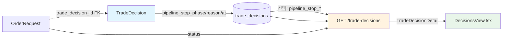
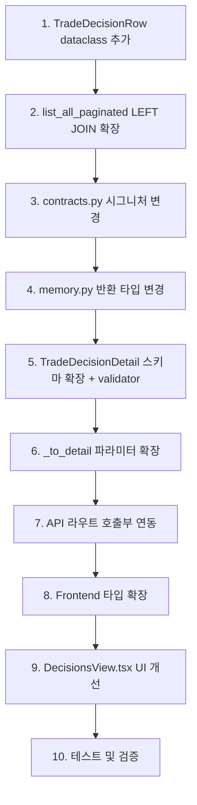

# 주문 실행 리팩토링 Phase 1 — `execution_status` derived field + `pipeline_stop_*` API/UI 노출

> **범위**: Phase 1 (API/DB/UI에 pipeline_stop_* 노출 + execution_status derived field 추가)
> **범위 밖**: Phase 2 (phase_trace 영속화), Phase 3 (execution_attempt 도입)
> **참고 문서**: `plans/order_execution_refactor_backlog_2026-05-22.md` — EXE-001/002/005A/005B

---

## 1. 현황 분석

### 1.1 현재 데이터 흐름



### 1.2 발견된 문제점

| 문제 | 설명 | 코드 위치 |
|------|------|-----------|
| **pipeline_stop_* 미노출** | DB 컬럼은 있지만 API 응답에 없음 | [`src/agent_trading/api/schemas.py:290-312`](../src/agent_trading/api/schemas.py:290) |
| **order_request_id 역추적 불가** | `TradeDecisionEntity` 자체 필드가 아님, `OrderRequestEntity.trade_decision_id`로만 연결 | [`src/agent_trading/domain/entities.py:274`](../src/agent_trading/domain/entities.py:274) |
| **execution_status 부재** | operator가 "trade_decision only" 상태를 즉시 판별 불가 | N/A |
| **source_type 누락** | Frontend 타입에 `source_type` 없음 | [`admin_ui/src/types/api.ts:185-202`](../admin_ui/src/types/api.ts:185) |

### 1.3 현재 구조 상세

#### Backend Entity ([`src/agent_trading/domain/entities.py:194-260`](../src/agent_trading/domain/entities.py:194))

`TradeDecisionEntity`는 다음 필드를 이미 포함:
- `pipeline_stop_phase: str | None = None` (line 244)
- `pipeline_stop_reason: str | None = None` (line 247)
- `pipeline_stopped_at: datetime | None = None` (line 249)
- **`order_request_id`는 없음** — `OrderRequestEntity.trade_decision_id`로 간접 연결

#### Repository ([`src/agent_trading/repositories/postgres/trade_decisions.py:170-216`](../src/agent_trading/repositories/postgres/trade_decisions.py:170))

`list_all_paginated()` 반환 타입:
```python
tuple[list[tuple[TradeDecisionEntity, str | None]], int]
```
- `str | None` = `instrument_name` (LEFT JOIN on `trading.instruments`)
- 반환: `list_all_paginated()`는 `(entity, instrument_name)` 튜플 리스트 반환
- API 라우트 [`decisions.py:86-93`](../src/agent_trading/api/routes/decisions.py:86)에서 `items_with_names`를 받아 `_to_detail(d, instrument_name=name)` 호출

#### API Schema ([`src/agent_trading/api/schemas.py:290-312`](../src/agent_trading/api/schemas.py:290))

```python
class TradeDecisionDetail(BaseModel):
    trade_decision_id: str
    # ...기존 14개 필드...
    source_type: str | None = None  # (line 309)
    decision_json: dict[str, object] | None = None  # (line 311)
```
- pipeline_stop_* 필드 없음
- order_request_id, order_status 없음
- execution_status (derived) 없음

#### Frontend 타입 ([`admin_ui/src/types/api.ts:185-202`](../admin_ui/src/types/api.ts:185))

```typescript
export interface TradeDecisionDetail {
    // ...13개 필드...
    // source_type 누락!
    // pipeline_stop_* 누락!
    // execution_status 누락!
}
```

#### DB 마이그레이션 ([`db/migrations/0021_add_pipeline_stop_fields.sql`](../db/migrations/0021_add_pipeline_stop_fields.sql))

```sql
ALTER TABLE trading.trade_decisions
    ADD COLUMN pipeline_stop_phase VARCHAR(64),
    ADD COLUMN pipeline_stop_reason TEXT,
    ADD COLUMN pipeline_stopped_at TIMESTAMPTZ;
```
- 이미 적용 완료, 추가 DDL 불필요

---

## 2. 상세 설계

### 2.1 `TradeDecisionDetail` Pydantic 스키마 확장

**파일**: [`src/agent_trading/api/schemas.py`](../src/agent_trading/api/schemas.py) (line 290 주변)

```python
class TradeDecisionDetail(BaseModel):
    """``GET /trade-decisions`` — trade decision detail."""

    # ── 기존 필드 (그대로 유지) ──
    trade_decision_id: str
    decision_context_id: str
    decision_type: str
    side: str
    strategy_id: str
    symbol: str
    instrument_name: str | None = None
    market: str
    entry_style: str
    created_at: datetime
    entry_price: float | None = None
    quantity: float | None = None
    max_order_value: float | None = None
    confidence: float | None = None
    rationale_summary: str | None = None
    source_type: str | None = None
    decision_json: dict[str, object] | None = None

    # ── 신규 필드 (Phase 1) ──
    order_request_id: str | None = None
    """연결된 OrderRequest ID (있을 경우)."""
    order_status: str | None = None
    """연결된 OrderRequest의 status (있을 경우)."""
    pipeline_stop_phase: str | None = None
    """제출 파이프라인 중 중단된 단계 (예: ``"pre_checks"``, ``"order_submission"``)."""
    pipeline_stop_reason: str | None = None
    """중단 사유 (예: ``"risk_check_failed"``, ``"no_order_request"``)."""
    pipeline_stopped_at: datetime | None = None
    """파이프라인이 중단된 시각."""
    execution_status: str | None = None
    """derived field: ``trade_decision_only`` | ``pipeline_stopped`` | ``non_trade`` | ``order_created`` | ``submitted`` | ``rejected`` | ``reconcile_required``."""

    @model_validator(mode='after')
    def _compute_execution_status(self) -> 'TradeDecisionDetail':
        if self.order_request_id is not None:
            # OrderRequest가 존재하면 상태에 따라 결정
            if self.order_status in ('submitted', 'rejected', 'reconcile_required'):
                self.execution_status = self.order_status.lower()
            else:
                # DRAFT, VALIDATED, PENDING_SUBMIT, ACKNOWLEDGED, PARTIALLY_FILLED, FILLED, CANCELLED, EXPIRED 등
                self.execution_status = 'order_created'
        elif self.pipeline_stop_phase is not None:
            self.execution_status = 'pipeline_stopped'
        elif self.decision_type in ('HOLD', 'WATCH'):
            self.execution_status = 'non_trade'
        else:
            # BUY/SELL 타입인데 order도 없고 pipeline stop도 아닌 경우
            self.execution_status = 'trade_decision_only'
        return self
```

> **참고**: `model_validator`는 `execution_status`가 명시적으로 전달되어도 재계산한다. 명시적 값과 validator 값을 충돌시키지 않으려면 `execution_status`를 validator 내에서만 설정하고 스키마 정의에서는 `None` 기본값으로 둔다.

#### `execution_status` 가능한 값 및 매핑 규칙

| execution_status | 조건 | 색상 |
|-----------------|------|------|
| `trade_decision_only` | TD만 존재, order 없음, pipeline_stop 없음, HOLD/WATCH 아님 | 🔴 red |
| `pipeline_stopped` | `pipeline_stop_phase`가 null 아님 | 🟠 orange |
| `non_trade` | `decision_type`이 HOLD/WATCH | ⚪ gray |
| `order_created` | OrderRequest 존재 + status가 DRAFT/VALIDATED/PENDING_SUBMIT/ACKNOWLEDGED/PARTIALLY_FILLED/FILLED/CANCELLED/EXPIRED | 🔵 blue |
| `submitted` | OrderRequest.status == SUBMITTED | 🟢 green |
| `rejected` | OrderRequest.status == REJECTED | 🔴 red |
| `reconcile_required` | OrderRequest.status == RECONCILE_REQUIRED | 🟠 orange |

### 2.2 `_to_detail()` 변환 함수 확장

**파일**: [`src/agent_trading/api/routes/decisions.py`](../src/agent_trading/api/routes/decisions.py) (line 34-58)

현재 시그니처:
```python
def _to_detail(d: object, instrument_name: str | None = None) -> TradeDecisionDetail:
```

확장 후:
```python
def _to_detail(
    d: object,
    instrument_name: str | None = None,
    order_request_id: str | None = None,
    order_status: str | None = None,
) -> TradeDecisionDetail:
    return TradeDecisionDetail(
        # ── 기존 필드 ──
        trade_decision_id=str(d.trade_decision_id),
        decision_context_id=str(d.decision_context_id),
        decision_type=_safe_enum_str(d.decision_type),
        side=_safe_enum_str(d.side),
        strategy_id=str(d.strategy_id),
        symbol=d.symbol,
        market=d.market,
        entry_style=_safe_enum_str(d.entry_style),
        created_at=d.created_at,
        entry_price=float(d.entry_price) if d.entry_price is not None else None,
        quantity=float(d.quantity) if d.quantity is not None else None,
        max_order_value=float(d.max_order_value) if d.max_order_value is not None else None,
        confidence=float(d.confidence) if d.confidence is not None else None,
        rationale_summary=d.rationale_summary,
        source_type=d.source_type,
        decision_json=d.decision_json,
        instrument_name=instrument_name,
        # ── 신규 필드 ──
        order_request_id=order_request_id,
        order_status=order_status,
        pipeline_stop_phase=d.pipeline_stop_phase,
        pipeline_stop_reason=d.pipeline_stop_reason,
        pipeline_stopped_at=d.pipeline_stopped_at,
        # execution_status는 model_validator가 자동 계산
    )
```

### 2.3 `list_all_paginated()` 쿼리 확장

**파일**: [`src/agent_trading/repositories/postgres/trade_decisions.py`](../src/agent_trading/repositories/postgres/trade_decisions.py) (line 170-216)

#### 2.3.1 반환 타입 변경: `TradeDecisionWithOrder` dataclass 도입

`TradeDecisionEntity`가 `frozen=True, slots=True`이므로 상속이 불가능하다. 따라서 별도 dataclass를 정의한다.

```python
from dataclasses import dataclass

@dataclass
class TradeDecisionRow:
    """Flat result row from list_all_paginated with JOIN data."""
    entity: TradeDecisionEntity
    instrument_name: str | None = None
    order_request_id: str | None = None
    order_status: str | None = None
```

#### 2.3.2 `list_all_paginated()` 확장

```python
async def list_all_paginated(
    self,
    limit: int = 50,
    offset: int = 0,
    decision_context_id: UUID | None = None,
) -> tuple[list[TradeDecisionRow], int]:
    """서버사이드 페이지네이션: (items, total_count) 반환.

    각 item은 ``TradeDecisionRow``로, entity + instrument_name + order_request_id + order_status 포함.
    SQL LEFT JOIN으로 N+1 문제 방지.
    """
    where_clause = ""
    params: list[object] = []
    param_idx = 1

    if decision_context_id is not None:
        where_clause = f"WHERE td.decision_context_id = ${param_idx}"
        params.append(decision_context_id)
        param_idx += 1

    # Total count query (변경 없음)
    count_sql = f"SELECT COUNT(*) FROM trading.trade_decisions td {where_clause}"
    total_row = await self._tx.connection.fetchval(count_sql, *params)
    total_count = total_row if total_row is not None else 0

    # Paginated query with LEFT JOIN for instrument_name + order_request
    items_sql = f"""
        SELECT td.*,
               i.name AS _instrument_name,
               o.order_request_id AS _order_request_id,
               o.status AS _order_status
        FROM trading.trade_decisions td
        LEFT JOIN trading.instruments i
            ON td.symbol = i.symbol AND td.market = i.market_code
        LEFT JOIN trading.order_requests o
            ON td.trade_decision_id = o.trade_decision_id
        {where_clause}
        ORDER BY td.created_at DESC, td.trade_decision_id DESC
        LIMIT ${param_idx} OFFSET ${param_idx + 1}
    """
    params.append(limit)
    params.append(offset)

    rows = await self._tx.connection.fetch(items_sql, *params)
    items: list[TradeDecisionRow] = []
    for row in rows:
        entity = row_to_entity(row, TradeDecisionEntity)
        inst_name: str | None = row.get("_instrument_name")
        order_req_id: str | None = str(row["_order_request_id"]) if row.get("_order_request_id") else None
        order_st: str | None = row.get("_order_status")
        items.append(TradeDecisionRow(
            entity=entity,
            instrument_name=inst_name,
            order_request_id=order_req_id,
            order_status=order_st,
        ))
    return items, total_count
```

#### 2.3.3 API 라우트 연동 변경

**파일**: [`src/agent_trading/api/routes/decisions.py`](../src/agent_trading/api/routes/decisions.py) (line 86-93)

```python
items_with_names, total = await repos.trade_decisions.list_all_paginated(
    limit=limit,
    offset=offset,
    decision_context_id=ctx_id,
)

details = [
    _to_detail(
        d=row.entity,
        instrument_name=row.instrument_name,
        order_request_id=row.order_request_id,
        order_status=row.order_status,
    )
    for row in items_with_names
]
```

> **참고**: 반환 타입이 `tuple[list[TradeDecisionRow], int]`로 변경되었으므로 `items_with_names` 변수명을 `rows`로 변경하는 것이 가독성에 좋다.

#### 2.3.4 Contract 인터페이스 변경

**파일**: [`src/agent_trading/repositories/contracts.py`](../src/agent_trading/repositories/contracts.py) (line 339-355)

```python
async def list_all_paginated(
    self,
    limit: int = 50,
    offset: int = 0,
    decision_context_id: UUID | None = None,
) -> tuple[list[TradeDecisionRow], int]:
    ...
```

#### 2.3.5 In-memory repository 변경

**파일**: [`src/agent_trading/repositories/memory.py`](../src/agent_trading/repositories/memory.py)

`InMemoryTradeDecisionRepository`도 동일한 반환 타입으로 변경해야 한다.
`TradeDecisionRow`를 import하여 반환하도록 수정.

```python
async def list_all_paginated(
    self,
    limit: int = 50,
    offset: int = 0,
    decision_context_id: UUID | None = None,
) -> tuple[list[TradeDecisionRow], int]:
    # ...필터링 및 슬라이싱...
    items = []
    for entity in sorted_items:
        items.append(TradeDecisionRow(
            entity=entity,
            instrument_name=None,
            order_request_id=None,
            order_status=None,
        ))
    return items, total_count
```

> **참고**: In-memory 구현은 order_requests JOIN을 수행하지 않으므로 `order_request_id`와 `order_status`는 항상 `None`이다. 이는 In-memory repo가 test용이므로 허용 가능하다.

---

### 2.4 Frontend 타입 확장

**파일**: [`admin_ui/src/types/api.ts`](../admin_ui/src/types/api.ts) (line 185-202)

```typescript
export interface TradeDecisionDetail {
  // ── 기존 필드 ──
  trade_decision_id: string;
  decision_context_id: string;
  decision_type: string;
  side: string;
  strategy_id: string;
  symbol: string;
  instrument_name: string | null;
  market: string;
  entry_style: string;
  created_at: string;
  entry_price: number | null;
  quantity: number | null;
  max_order_value: number | null;
  confidence: number | null;
  rationale_summary: string | null;
  decision_json?: Record<string, unknown>;

  // ── 누락된 기존 필드 복원 ──
  source_type: string | null;

  // ── 신규 필드 (Phase 1) ──
  order_request_id: string | null;
  order_status: string | null;
  pipeline_stop_phase: string | null;
  pipeline_stop_reason: string | null;
  pipeline_stopped_at: string | null;
  execution_status: string | null;
}
```

### 2.5 `DecisionsView.tsx` UI 개선

**파일**: [`admin_ui/src/components/DecisionsView.tsx`](../admin_ui/src/components/DecisionsView.tsx)

#### 2.5.1 상세 패널에 `execution_status` 뱃지 추가

현재 상세 패널은 line 340-365의 `<dl>`에 정보를 표시한다. 여기에 `execution_status`를 추가한다.

컴포넌트 상단에 헬퍼 함수 추가:

```typescript
function executionStatusVariant(status: string | null): "success" | "warning" | "error" | "info" | "neutral" {
  switch (status) {
    case "submitted":
      return "success";
    case "pipeline_stopped":
    case "reconcile_required":
      return "warning";
    case "trade_decision_only":
    case "rejected":
      return "error";
    case "order_created":
      return "info";
    case "non_trade":
    default:
      return "neutral";
  }
}

function executionStatusLabel(status: string | null): string {
  switch (status) {
    case "trade_decision_only": return "의사결정만";
    case "pipeline_stopped": return "파이프라인 중단";
    case "non_trade": return "비거래 (HOLD/WATCH)";
    case "order_created": return "주문 생성됨";
    case "submitted": return "제출 완료";
    case "rejected": return "브로커 거부";
    case "reconcile_required": return "조정 필요";
    default: return status ?? "—";
  }
}
```

#### 2.5.2 상세 패널 UI 변경 (line 340-365 주변)

Decision Detail 카드 내 `<dl>` 블록에 다음 항목 추가:

```tsx
{/* execution_status badge — 별도 섹션으로 강조 표시 */}
{selectedDecision.execution_status && (
  <div className="mt-2 mb-4">
    <div className="flex items-center justify-between">
      <dt className="text-sm text-[#64748b]">실행 상태</dt>
      <dd>
        <StatusBadge variant={executionStatusVariant(selectedDecision.execution_status)}>
          {executionStatusLabel(selectedDecision.execution_status)}
        </StatusBadge>
      </dd>
    </div>
  </div>
)}
```

#### 2.5.3 `pipeline_stop_*` 섹션 추가

Execution Status가 `pipeline_stopped`인 경우에만 표시:

```tsx
{selectedDecision.execution_status === 'pipeline_stopped' && (
  <div className="mt-4 pt-4 border-t border-[#e2e8f0]">
    <p className="text-xs font-semibold text-[#374151] mb-2">파이프라인 중단 정보</p>
    <dl className="space-y-2">
      <div className="flex justify-between">
        <dt className="text-sm text-[#64748b]">중단 단계</dt>
        <dd className="text-sm font-medium text-[#0f172a]">
          {selectedDecision.pipeline_stop_phase ?? "—"}
        </dd>
      </div>
      <div className="flex justify-between">
        <dt className="text-sm text-[#64748b]">중단 사유</dt>
        <dd className="text-sm text-[#0f172a] text-right max-w-[200px]">
          {selectedDecision.pipeline_stop_reason ?? "—"}
        </dd>
      </div>
      {selectedDecision.pipeline_stopped_at && (
        <div className="flex justify-between">
          <dt className="text-sm text-[#64748b]">중단 시각</dt>
          <dd className="text-sm text-[#0f172a]">
            {formatKstDateTime(selectedDecision.pipeline_stopped_at)}
          </dd>
        </div>
      )}
    </dl>
  </div>
)}
```

#### 2.5.4 `order_request_id` / `order_status` 섹션 추가

Order가 있는 경우에만 표시:

```tsx
{selectedDecision.order_request_id && (
  <div className="mt-4 pt-4 border-t border-[#e2e8f0]">
    <p className="text-xs font-semibold text-[#374151] mb-2">주문 정보</p>
    <dl className="space-y-2">
      <div className="flex justify-between">
        <dt className="text-sm text-[#64748b]">주문 ID</dt>
        <dd className="text-sm font-mono text-[#3b82f6]">
          {selectedDecision.order_request_id.slice(0, 16)}…
        </dd>
      </div>
      <div className="flex justify-between">
        <dt className="text-sm text-[#64748b]">주문 상태</dt>
        <dd>
          <StatusBadge variant={
            selectedDecision.order_status === 'submitted' ? 'success' :
            selectedDecision.order_status === 'rejected' ? 'error' :
            selectedDecision.order_status === 'reconcile_required' ? 'warning' :
            'info'
          }>
            {selectedDecision.order_status ?? "—"}
          </StatusBadge>
        </dd>
      </div>
    </dl>
  </div>
)}
```

#### 2.5.5 테이블 컬럼에 `execution_status` 추가 (선택)

DecisionsView 테이블 (line 186-228)에 `execution_status` 컬럼을 추가하면 리스트에서 바로 상태를 확인할 수 있어 UX가 개선된다.

```tsx
{
  key: "execution_status",
  header: "실행 상태",
  width: "120px",
  render: (r) => r.execution_status ? (
    <StatusBadge variant={executionStatusVariant(r.execution_status)}>
      {executionStatusLabel(r.execution_status)}
    </StatusBadge>
  ) : "—",
},
```

> **권장**: 리스트에서 바로 실행 상태를 파악할 수 있도록 테이블 컬럼에 추가하는 것을 권장한다.

---

## 3. 변경 영향도 분석

### 3.1 변경이 필요한 파일 목록

| # | 파일 | 변경 유형 | 영향 |
|---|------|----------|------|
| 1 | [`src/agent_trading/api/schemas.py`](../src/agent_trading/api/schemas.py) | 수정 — `TradeDecisionDetail`에 필드 추가 + validator | 하위 호환 (신규 필드는 `None` 기본값) |
| 2 | [`src/agent_trading/api/routes/decisions.py`](../src/agent_trading/api/routes/decisions.py) | 수정 — `_to_detail()` 파라미터 추가 | 호출부 연동 |
| 3 | [`src/agent_trading/repositories/postgres/trade_decisions.py`](../src/agent_trading/repositories/postgres/trade_decisions.py) | 수정 — `TradeDecisionRow` dataclass 추가 + `list_all_paginated()` 쿼리 확장 | 반환 타입 변경 (컴파일 영향 있음) |
| 4 | [`src/agent_trading/repositories/contracts.py`](../src/agent_trading/repositories/contracts.py) | 수정 — `list_all_paginated()` 시그니처 변경 | Protocol 타입 변경 |
| 5 | [`src/agent_trading/repositories/memory.py`](../src/agent_trading/repositories/memory.py) | 수정 — `list_all_paginated()` 반환 타입 맞춤 | In-memory 구현만 변경 |
| 6 | [`admin_ui/src/types/api.ts`](../admin_ui/src/types/api.ts) | 수정 — `TradeDecisionDetail` 인터페이스 확장 | 타입 안전성 확보 |
| 7 | [`admin_ui/src/components/DecisionsView.tsx`](../admin_ui/src/components/DecisionsView.tsx) | 수정 — 상세 패널에 execution_status/pipeline_stop/order 표시 | UI 개선 |

### 3.2 하위 호환성

- **API 응답**: 신규 필드는 모두 `optional` (`... | None = None`)이므로 기존 클라이언트에 영향 없음
- **Frontend**: 기존 `TradeDecisionDetail` 인터페이스에 필드가 추가되므로, 미사용 필드는 `undefined`로 남음
- **DB**: DDL 변경 없음 (pipeline_stop_* 컬럼은 migration 0021에서 이미 추가됨)

### 3.3 리스크

| 리스크 | 설명 | 완화 방안 |
|--------|------|----------|
| `TradeDecisionRow` 도입으로 컴파일 타입 불일치 | 기존 코드가 `tuple[entity, name]`을 기대하는 곳에서 깨질 수 있음 | 모든 참조 지점 확인 필요 |
| LEFT JOIN으로 TD당 여러 OrderRequest 존재 가능 | 하나의 TD에 여러 OrderRequest가 생성될 수 있음 | `o.trade_decision_id = td.trade_decision_id` JOIN은 복수 행을 생성하지만, `LIMIT/OFFSET`이 TD 기준이 아닌 행 기준이 될 수 있음 |
| `row_to_entity`가 `_order_request_id`, `_order_status` 필드를 무시 | `TradeDecisionEntity`에 해당 필드가 없어 자동 드롭 | 현재 `row_to_entity` (line 82-83)에서 `field_names`에 없는 컬럼은 자동 제외되므로 안전 |

> **LEFT JOIN 복수 행 리스크 상세**: TD 1건에 OrderRequest 2건이 있으면 LEFT JOIN 결과가 2행이 되어 `LIMIT 50`이 50개 TD가 아닌 50개 행이 된다. 그러나 현재 시스템에서 하나의 TD에 여러 OrderRequest가 생성되는 케이스는 드물고, `ORDER BY td.created_at DESC`로 정렬되므로 동일 TD의 복수 행이 인접하게 된다. 만약 이슈가 발생하면 `DISTINCT ON (td.trade_decision_id)`로 전환하거나 서브쿼리로 단일 OrderRequest만 가져오도록 최적화할 수 있다.

---

## 4. 구현 순서



### Step-by-step 구현 가이드

#### Step 1: `TradeDecisionRow` dataclass 추가
**파일**: [`src/agent_trading/repositories/postgres/trade_decisions.py`](../src/agent_trading/repositories/postgres/trade_decisions.py)
- 함수 외부에 `@dataclass` 정의 추가
- `entity: TradeDecisionEntity`, `instrument_name: str | None = None`, `order_request_id: str | None = None`, `order_status: str | None = None`

#### Step 2: `list_all_paginated()` 확장
- SQL에 `LEFT JOIN trading.order_requests o ON td.trade_decision_id = o.trade_decision_id` 추가
- SELECT 절에 `o.order_request_id AS _order_request_id`, `o.status AS _order_status` 추가
- 결과 매핑을 `TradeDecisionRow`로 변경

#### Step 3: Contract 시그니처 변경
**파일**: [`src/agent_trading/repositories/contracts.py`](../src/agent_trading/repositories/contracts.py)

#### Step 4: Memory repo 반환 타입 변경
**파일**: [`src/agent_trading/repositories/memory.py`](../src/agent_trading/repositories/memory.py)

#### Step 5: Pydantic 스키마 확장
**파일**: [`src/agent_trading/api/schemas.py`](../src/agent_trading/api/schemas.py)
- `TradeDecisionDetail`에 6개 신규 필드 추가
- `@model_validator(mode='after')` 메서드 추가

#### Step 6: `_to_detail()` 확장
**파일**: [`src/agent_trading/api/routes/decisions.py`](../src/agent_trading/api/routes/decisions.py)
- `order_request_id`, `order_status` 파라미터 추가
- pipeline_stop_* 필드 매핑 추가

#### Step 7: API 라우트 호출부 연동
**파일**: [`src/agent_trading/api/routes/decisions.py`](../src/agent_trading/api/routes/decisions.py)
- `list_all_paginated()` 결과를 `TradeDecisionRow`로 언패킹
- `_to_detail()`에 신규 파라미터 전달

#### Step 8: Frontend 타입 확장
**파일**: [`admin_ui/src/types/api.ts`](../admin_ui/src/types/api.ts)

#### Step 9: UI 개선
**파일**: [`admin_ui/src/components/DecisionsView.tsx`](../admin_ui/src/components/DecisionsView.tsx)
- `executionStatusVariant()`, `executionStatusLabel()` 헬퍼 추가
- execution_status 뱃지를 상세 패널에 추가
- pipeline_stop 섹션 추가 (조건부 렌더링)
- order 정보 섹션 추가 (조건부 렌더링)
- (선택) 테이블 컬럼에 execution_status 추가

#### Step 10: 테스트
- 변경된 API 응답에 새 필드가 포함되는지 확인
- `execution_status` derived field가 모든 케이스에서 올바르게 계산되는지 확인
  - trade_decision_only (BUY/SELL, order 없음, pipeline_stop 없음)
  - pipeline_stopped (pipeline_stop_phase != null)
  - non_trade (HOLD/WATCH)
  - order_created (OrderRequest 존재, status=DRAFT/VALIDATED 등)
  - submitted (OrderRequest.status=SUBMITTED)
  - rejected (OrderRequest.status=REJECTED)
  - reconcile_required (OrderRequest.status=RECONCILE_REQUIRED)
- Frontend에서 새 필드가 올바르게 표시되는지 확인

---

## 5. `execution_status` 계산 로직 상세

```python
@model_validator(mode='after')
def _compute_execution_status(self) -> 'TradeDecisionDetail':
    if self.order_request_id is not None:
        # OrderRequest 존재
        if self.order_status in ('SUBMITTED', 'REJECTED', 'RECONCILE_REQUIRED'):
            self.execution_status = self.order_status.lower()
        else:
            # DRAFT, VALIDATED, PENDING_SUBMIT, ACKNOWLEDGED,
            # PARTIALLY_FILLED, FILLED, CANCEL_PENDING, CANCELLED, EXPIRED
            self.execution_status = 'order_created'
    elif self.pipeline_stop_phase is not None:
        self.execution_status = 'pipeline_stopped'
    elif self.decision_type in ('HOLD', 'WATCH'):
        self.execution_status = 'non_trade'
    else:
        self.execution_status = 'trade_decision_only'
    return self
```

> **참고**: `OrderStatus` enum 값은 소문자(`"draft"`, `"submitted"` 등)이므로 비교 시 소문자로 비교한다. `order_status`는 이미 `OrderStatus.value`가 문자열이므로 `self.order_status.lower()`가 동작한다.

### 우선순위

1. `order_request_id`가 가장 높은 우선순위 — order가 존재하면 항상 order 기반 상태
2. `pipeline_stop_phase` — order는 없지만 pipeline이 중단된 경우
3. `decision_type` — HOLD/WATCH는 non_trade
4. 그 외 — trade_decision_only

---

## 6. `source_type` 누락 보완

Ask 분석에서 발견된 `source_type`이 Frontend 타입에 누락된 문제를 이번 Phase 1에서 함께 수정한다.

**파일**: [`admin_ui/src/types/api.ts`](../admin_ui/src/types/api.ts)

```typescript
// 기존 TradeDecisionDetail에 추가
source_type: string | null;
```

Backend API 스키마에는 이미 `source_type`이 존재하므로 Frontend 타입만 추가하면 된다.

---

## 7. 검증 체크리스트

- [ ] `TradeDecisionRow` dataclass가 올바르게 정의되었는가?
- [ ] `list_all_paginated()` SQL LEFT JOIN이 `trading.order_requests`를 올바르게 참조하는가?
- [ ] `list_all_paginated()` 반환 타입이 모든 호출자와 일치하는가? (contract, memory, postgres)
- [ ] `TradeDecisionDetail` Pydantic 스키마에 6개 신규 필드가 모두 추가되었는가?
- [ ] `@model_validator`가 모든 execution_status 케이스를 커버하는가?
- [ ] `_to_detail()`이 신규 파라미터를 올바르게 전달하는가?
- [ ] Frontend `TradeDecisionDetail` 인터페이스에 모든 신규 필드와 `source_type`이 포함되었는가?
- [ ] `executionStatusVariant()`가 모든 execution_status 값을 올바르게 매핑하는가?
- [ ] 상세 패널의 조건부 렌더링(pipeline_stopped일 때만 pipeline_stop 섹션 표시 등)이 올바른가?
- [ ] 테스트를 통해 모든 execution_status 케이스가 검증되었는가?

---

## 8. 참고

- [`plans/order_execution_refactor_backlog_2026-05-22.md`](../plans/order_execution_refactor_backlog_2026-05-22.md) — EXE-001/002/005A/005B
- [`src/agent_trading/api/schemas.py:290-312`](../src/agent_trading/api/schemas.py:290) — TradeDecisionDetail Pydantic 스키마
- [`src/agent_trading/api/routes/decisions.py:34-58`](../src/agent_trading/api/routes/decisions.py:34) — _to_detail() 변환 함수
- [`src/agent_trading/repositories/postgres/trade_decisions.py:170-216`](../src/agent_trading/repositories/postgres/trade_decisions.py:170) — list_all_paginated()
- [`src/agent_trading/domain/entities.py:194-260`](../src/agent_trading/domain/entities.py:194) — TradeDecisionEntity
- [`admin_ui/src/types/api.ts:185-202`](../admin_ui/src/types/api.ts:185) — Frontend TradeDecisionDetail
- [`admin_ui/src/components/DecisionsView.tsx:307-573`](../admin_ui/src/components/DecisionsView.tsx:307) — 상세 패널
- [`db/migrations/0021_add_pipeline_stop_fields.sql`](../db/migrations/0021_add_pipeline_stop_fields.sql) — pipeline_stop_* DDL
