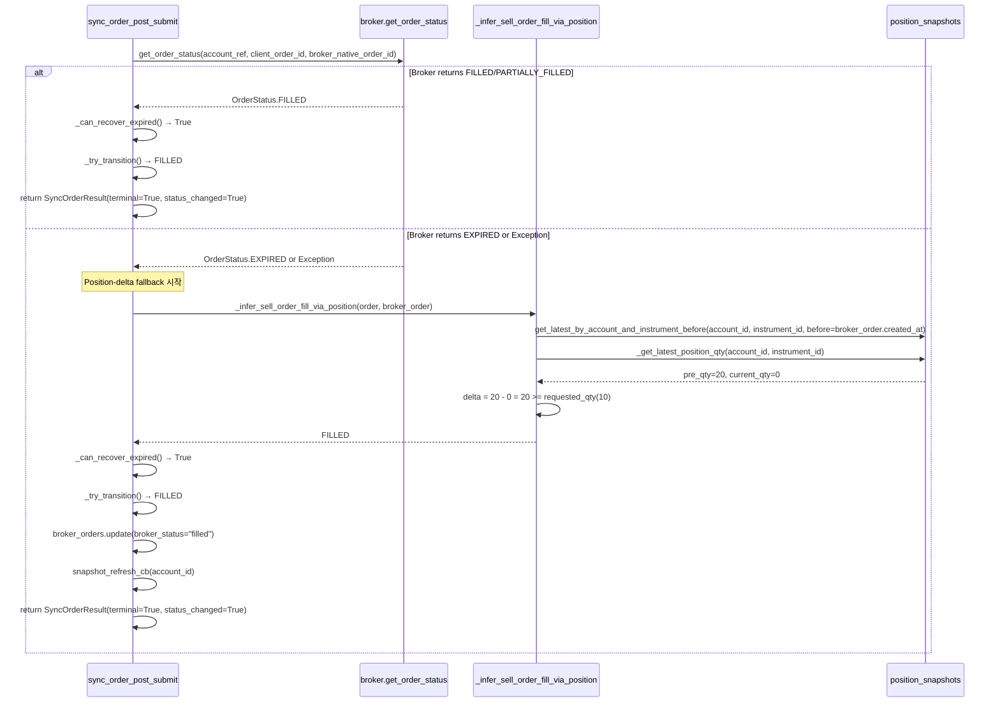

# EXPIRED SELL 주문 Position-Delta 기반 후행 복구 설계

> **작성일:** 2026-05-21  
> **상태:** 설계 검토 대기  
> **관련 파일:** [`order_sync_service.py`](src/agent_trading/services/order_sync_service.py), [`order_manager.py`](src/agent_trading/services/order_manager.py), [`test_order_sync_service.py`](tests/services/test_order_sync_service.py)

---

## 1. 배경 및 문제 정의

### 1.1 현재 상태

- `_ALLOWED_TRANSITIONS`에 `EXPIRED → FILLED/PARTIALLY_FILLED` 이미 허용됨 ([`order_manager.py:112`](src/agent_trading/services/order_manager.py:112))
- [`sync_order_post_submit()`](src/agent_trading/services/order_sync_service.py:120)에 EXPIRED 복구 경로 구현됨 (lines 192-222)
- Broker truth 재조회(`get_order_status`)가 `FILLED`/`PARTIALLY_FILLED` 반환 시 `_can_recover_expired()` 검증 후 `_try_transition()`으로 복구

### 1.2 문제: Paper broker 환경

Paper broker는 `get_order_status()` 호출 시 `EXPIRED`를 반환 (이미 expired 처리됨). 따라서:

```
broker_recovered in (FILLED, PARTIALLY_FILLED) → False → 복구 불가
```

결과:
- Position snapshot이 `quantity=0`으로 정상 수집되었어도
- `sync_order_post_submit()`은 EXPIRED 상태를 유지하고 `SyncOrderResult(terminal=True)` 반환
- 주문이 영원히 EXPIRED 상태에 갇힘

### 1.3 해결 방향

`sync_order_post_submit()` EXPIRED 복구 경로에 **SELL position-delta fallback** 추가:
1. `broker.get_order_status()`가 `FILLED`/`PARTIALLY_FILLED`를 반환하지 못하면
2. SELL 주문에 한해 `_infer_sell_order_fill_via_position()`으로 position snapshot delta 확인
3. `delta > 0`이면 `FILLED`/`PARTIALLY_FILLED`로 복구

---

## 2. 현재 코드 분석

### 2.1 `sync_order_post_submit()` EXPIRED 복구 경로 (lines 192-236)

```python
# ── Skip if already terminal or not syncable ──
if order.status in _TERMINAL_STATUSES:
    # EXPIRED 복구: 최근 1시간 이내 EXPIRED 주문
    if (
        order.status == OrderStatus.EXPIRED
        and order.updated_at is not None
        and (datetime.now(timezone.utc) - order.updated_at).total_seconds()
            < _RECENT_EXPIRY_WINDOW_SECONDS  # 3600초
    ):
        try:
            status_result = await broker.get_order_status(
                account_ref,
                client_order_id=order.client_order_id or "",
                broker_order_id=broker_order.broker_native_order_id,
            )
            broker_recovered: OrderStatus = status_result.status
            if (
                broker_recovered in (OrderStatus.FILLED, OrderStatus.PARTIALLY_FILLED)
                and self._can_recover_expired(order, broker_recovered)  # 24h age check
            ):
                order = await self._try_transition(order, broker_recovered)
                previous_status = order.status  # 갱신
        except Exception:
            logger.debug(...)

    # Still update last_synced_at for record-keeping.
    await self._update_last_synced_at(broker_order_id, now)
    return SyncOrderResult(
        ...
        previous_status=previous_status,  # 갱신된 상태 (복구 성공 시)
        current_status=previous_status,
        status_changed=False,  # ⚠️ 복구 성공 시에도 False
        terminal=True,
        ...
    )
```

### 2.2 `_infer_sell_order_fill_via_position()` (line 1353)

```python
async def _infer_sell_order_fill_via_position(
    self,
    order: OrderRequestEntity,        # ✅ sync_order_post_submit에서 사용 가능
    broker_order: BrokerOrderEntity,   # ✅ sync_order_post_submit에서 사용 가능
    *,
    snapshot_refresh_cb: Callable[[UUID], Awaitable[None]] | None = None,  # ✅ 전달됨
) -> OrderStatus | None:
```

**내부 로직:**
1. `order.side != SELL` → `return None` (SELL-only)
2. Pre-order snapshot 조회 (`position_snapshots.get_latest_by_account_and_instrument_before`)
3. Current snapshot 조회 (`_get_latest_position_qty`)
4. `position_delta = pre_qty - current_qty`
5. `delta > 0` → `_infer_status_from_delta()` → `FILLED`/`PARTIALLY_FILLED`
6. `delta = 0` → `snapshot_refresh_cb`로 최대 2회 재시도 (callback 없어도 로컬 snapshot으로 진행)

→ **`snapshot_refresh_cb` 필수 아님.** Sync cycle 내 snapshot이 이미 최신이면 재시도 없이 `None` 반환.

### 2.3 `_infer_status_from_delta()` (line 1520)

```python
def _infer_status_from_delta(self, order, broker_order,
                              pre_order_qty, current_qty, position_delta) -> OrderStatus | None:
    if position_delta >= order.requested_quantity:    return OrderStatus.FILLED
    if position_delta > Decimal("0"):                 return OrderStatus.PARTIALLY_FILLED
    return None
```

### 2.4 `_can_recover_expired()` (line 1800)

```python
@staticmethod
def _can_recover_expired(order: OrderRequestEntity, target_status: OrderStatus) -> bool:
    # 24시간 초과 주문 복구 거부
    if order.created_at and age > 86400:
        return False
    return True
```

→ **수정 불필요.** 24h age check는 broker truth 기반 복구와 position-delta 기반 복구 모두에 유효.  
→ 문서상 "broker truth 확인 가정"은 있으나 position-delta도 충분한 후행 증거.

### 2.5 `_ALLOWED_TRANSITIONS` (`order_manager.py:112`)

```python
OrderStatus.EXPIRED: {
    OrderStatus.FILLED,
    OrderStatus.PARTIALLY_FILLED,
},
```

→ **수정 불필요.** 이미 허용됨.

### 2.6 `transition_to_authoritative()`의 Position-Delta 사용 패턴 (참고)

`transition_to_authoritative()`에는 position-delta fallback이 **두 군데** 구현되어 있음:

| 경로 | 위치 | 조건 | 동작 |
|------|------|------|------|
| Path A | line 759 | `resolve_unknown_state` 예외 + SELL | `_infer_sell_order_fill_via_position()` → `_try_transition()` → `broker_status="filled"` → `snapshot_refresh_cb` |
| Path B | line 1004 | `resolve_unknown_state` → `RECONCILE_REQUIRED` + SELL | 동일 |

→ 이 패턴을 `sync_order_post_submit()`에도 동일하게 적용.

---

## 3. 변경 설계

### 3.1 수정 사항 요약

| # | 파일 | 변경 내용 |
|---|------|----------|
| 1 | [`order_sync_service.py`](src/agent_trading/services/order_sync_service.py) | `sync_order_post_submit()` EXPIRED 복구 블록에 SELL position-delta fallback 추가 |
| 2 | [`test_order_sync_service.py`](tests/services/test_order_sync_service.py) | 새 position-delta fallback 경로 테스트 케이스 추가 |

### 3.2 상세 Diff: `order_sync_service.py`

**변경 위치:** `sync_order_post_submit()` — EXPIRED 복구 블록 (현재 lines 200-222)

**변경 1:** Exception handler 메시지 개선 (복구 시도 의도 명확화)

```diff
                 except Exception:
                     logger.debug(
-                        "EXPIRED 복구 재조회 실패: broker_order=%s — 기존 terminal 유지",
+                        "EXPIRED 복구 재조회 실패: broker_order=%s — position-delta fallback 시도",
                         broker_order_id, exc_info=True,
                     )
```

**변경 2:** Exception 블록 직후, `_update_last_synced_at` 호출 전에 SELL position-delta fallback 추가

```diff
                 except Exception:
                     logger.debug(
                         "EXPIRED 복구 재조회 실패: broker_order=%s — position-delta fallback 시도",
                         broker_order_id, exc_info=True,
                     )
+
+                # ── SELL position-delta fallback ──
+                # broker.get_order_status()가 FILLED/PARTIALLY_FILLED를 반환하지 못한 경우
+                # (paper broker 한계), position snapshot delta로 fill 추론.
+                # recovery_allowed 플래그로 broker_status/snapshot_refresh_cb 제어.
+                _recovery_via_delta: bool = False
+                if (
+                    order.status == OrderStatus.EXPIRED
+                    and order.side == OrderSide.SELL
+                ):
+                    inferred = await self._infer_sell_order_fill_via_position(
+                        order, broker_order,
+                        snapshot_refresh_cb=snapshot_refresh_cb,
+                    )
+                    if (
+                        inferred is not None
+                        and inferred in (OrderStatus.FILLED, OrderStatus.PARTIALLY_FILLED)
+                        and self._can_recover_expired(order, inferred)
+                    ):
+                        logger.info(
+                            "EXPIRED position-delta 복구: order_id=%s inferred=%s "
+                            "(broker truth unavailable)",
+                            order.order_request_id, inferred.value,
+                        )
+                        try:
+                            order = await self._try_transition(order, inferred)
+                            if order.status != OrderStatus.EXPIRED:
+                                previous_status = order.status
+                                _recovery_via_delta = True
+                        except Exception as trans_exc:
+                            logger.error(
+                                "Position-delta transition failed for EXPIRED "
+                                "order_id=%s: %s",
+                                order.order_request_id, trans_exc,
+                                exc_info=True,
+                            )
+
+                # broker_status 동기화 및 snapshot refresh (position-delta 복구 성공 시)
+                if _recovery_via_delta and inferred == OrderStatus.FILLED:
+                    await self.repos.broker_orders.update(
+                        broker_order_id,
+                        broker_status="filled",
+                        updated_at=now,
+                    )
+                    if snapshot_refresh_cb is not None:
+                        try:
+                            await snapshot_refresh_cb(order.account_id)
+                            _snapshot_triggered = True
+                        except Exception:
+                            logger.exception(
+                                "snapshot_refresh_cb failed after position-delta recovery "
+                                "for order_id=%s",
+                                order.order_request_id,
+                            )
```

**변경 3:** `SyncOrderResult` 생성 시 `status_changed`와 `snapshot_triggered` 정확히 반영

```diff
     await self._update_last_synced_at(broker_order_id, now)
+    _current_status = order.status
+    _status_changed = previous_status != _current_status
     return SyncOrderResult(
         broker_order_id=broker_order_id,
-        previous_status=previous_status,
-        current_status=previous_status,
-        status_changed=False,
+        previous_status=previous_status,  # 초기 상태 (line 189)
+        current_status=_current_status,
+        status_changed=_status_changed,
         fills_synced=0,
         fills_skipped=0,
         terminal=True,
-        snapshot_triggered=False,
+        snapshot_triggered=_snapshot_triggered,
         last_synced_at=now,
     )
```

**변경 4:** `_snapshot_triggered` 변수 선언 추가 (scope 고려)

```diff
     previous_status = order.status
+    # Position-delta recovery 시 snapshot refresh 여부
+    _snapshot_triggered: bool = False
 
     # ── Skip if already terminal or not syncable ──
```

### 3.3 종합 Diff

전체 변경 diff는 아래와 같습니다:

**파일:** [`src/agent_trading/services/order_sync_service.py`](src/agent_trading/services/order_sync_service.py)

```diff
--- a/src/agent_trading/services/order_sync_service.py
+++ b/src/agent_trading/services/order_sync_service.py
@@ -1,3 +1,4 @@
+
         previous_status = order.status
+        _snapshot_triggered: bool = False
 
         # ── Skip if already terminal or not syncable ──
@@ -209,11 +210,63 @@
                 except Exception:
                     logger.debug(
-                        "EXPIRED 복구 재조회 실패: broker_order=%s — 기존 terminal 유지",
+                        "EXPIRED 복구 재조회 실패: broker_order=%s — position-delta fallback 시도",
                         broker_order_id, exc_info=True,
                     )
 
+                # ── SELL position-delta fallback ──
+                _recovery_via_delta: bool = False
+                if (
+                    order.status == OrderStatus.EXPIRED
+                    and order.side == OrderSide.SELL
+                ):
+                    inferred = await self._infer_sell_order_fill_via_position(
+                        order, broker_order,
+                        snapshot_refresh_cb=snapshot_refresh_cb,
+                    )
+                    if (
+                        inferred is not None
+                        and inferred in (OrderStatus.FILLED, OrderStatus.PARTIALLY_FILLED)
+                        and self._can_recover_expired(order, inferred)
+                    ):
+                        logger.info(
+                            "EXPIRED position-delta 복구: order_id=%s inferred=%s "
+                            "(broker truth unavailable)",
+                            order.order_request_id, inferred.value,
+                        )
+                        try:
+                            order = await self._try_transition(order, inferred)
+                            if order.status != OrderStatus.EXPIRED:
+                                previous_status = order.status
+                                _recovery_via_delta = True
+                        except Exception as trans_exc:
+                            logger.error(
+                                "Position-delta transition failed for EXPIRED "
+                                "order_id=%s: %s",
+                                order.order_request_id, trans_exc,
+                                exc_info=True,
+                            )
+
+                # broker_status 동기화 + snapshot refresh (position-delta FILLED 복구 시)
+                if _recovery_via_delta and inferred == OrderStatus.FILLED:
+                    await self.repos.broker_orders.update(
+                        broker_order_id,
+                        broker_status="filled",
+                        updated_at=now,
+                    )
+                    if snapshot_refresh_cb is not None:
+                        try:
+                            await snapshot_refresh_cb(order.account_id)
+                            _snapshot_triggered = True
+                        except Exception:
+                            logger.exception(
+                                "snapshot_refresh_cb failed after position-delta recovery "
+                                "for order_id=%s",
+                                order.order_request_id,
+                            )
+
             # Still update last_synced_at for record-keeping.
             await self._update_last_synced_at(broker_order_id, now)
+            _current_status = order.status
+            _status_changed = previous_status != _current_status
             return SyncOrderResult(
                 broker_order_id=broker_order_id,
-                previous_status=previous_status,
-                current_status=previous_status,
-                status_changed=False,
+                previous_status=previous_status,
+                current_status=_current_status,
+                status_changed=_status_changed,
                 fills_synced=0,
                 fills_skipped=0,
                 terminal=True,
-                snapshot_triggered=False,
+                snapshot_triggered=_snapshot_triggered,
                 last_synced_at=now,
             )
```

---

## 4. 동작 흐름 (Sequence Diagram)



---

## 5. 기존 테스트 영향 분석

### 5.1 영향 받는 테스트

| 테스트 클래스/함수 | 영향 | 설명 |
|-------------------|------|------|
| [`TestInferSellOrderFillViaPosition`](tests/services/test_order_sync_service.py:1743) | ❌ 없음 | `_infer_sell_order_fill_via_position` 단위 테스트, 직접 호출 |
| [`TestInferSellFillRetry`](tests/services/test_order_sync_service.py:2724) | ❌ 없음 | Retry 로직 테스트, 직접 호출 |
| [`TestInferSellOrderFillViaPositionWithRefreshCb`](tests/services/test_order_sync_service.py:3527) | ❌ 없음 | Refresh callback 테스트, 직접 호출 |
| `TestSyncOrderPostSubmit` (가칭) | ⚠️ **기존 EXPIRED 복구 테스트 검토 필요** | 새 position-delta fallback이 추가되므로 기존 broker-truth-only 테스트가 여전히 통과하는지 확인 |

### 5.2 추가해야 할 테스트

**신규 테스트 클래스:** `TestExpiredSellPositionDeltaRecovery`

| # | 테스트 케이스 | 설명 |
|---|-------------|------|
| 1 | `test_expired_sell_delta_gte_requested_filled` | EXPIRED SELL, delta >= requested_qty → FILLED 복구 |
| 2 | `test_expired_sell_delta_positive_partial` | EXPIRED SELL, 0 < delta < requested_qty → PARTIALLY_FILLED 복구 |
| 3 | `test_expired_sell_delta_zero_no_recovery` | EXPIRED SELL, delta=0 → 복구 안 함, EXPIRED 유지 |
| 4 | `test_expired_sell_no_pre_snapshot_no_recovery` | EXPIRED SELL, pre-snapshot 없음 → 복구 안 함 |
| 5 | `test_expired_buy_no_position_delta` | EXPIRED BUY → position-delta fallback 실행 안 함 |
| 6 | `test_expired_sell_broker_truth_wins` | Broker가 FILLED 반환 → broker truth 우선 (position-delta 미실행) |
| 7 | `test_expired_sell_old_order_no_recovery` | 24h 초과 EXPIRED SELL → `_can_recover_expired` 차단 |
| 8 | `test_expired_sell_delta_filled_triggers_snapshot_refresh` | FILLED 복구 시 `snapshot_refresh_cb` 호출 확인 |
| 9 | `test_expired_sell_delta_partial_no_snapshot_refresh` | PARTIALLY_FILLED 복구 시 `snapshot_refresh_cb` 미호출 확인 |
| 10 | `test_expired_sell_delta_filled_updates_broker_status` | FILLED 복구 시 `broker_status="filled"` 업데이트 확인 |

### 5.3 Mock 설정 가이드

각 테스트는 아래 설정 필요:

```python
# 1. EXPIRED 상태 OrderRequestEntity 생성
order = _make_order(repos, status=OrderStatus.EXPIRED, ...)
order = replace(order, side=OrderSide.SELL, requested_quantity=Decimal("10"))
repos.orders._items[order.order_request_id] = order

# 2. BrokerOrderEntity 생성
broker_order = _make_broker_order(repos, order, ...)

# 3. Broker mock: get_order_status가 EXPIRED 반환
broker = AsyncMock(spec=BrokerAdapter)
broker.get_order_status = AsyncMock(
    return_value=OrderStatusResult(
        ..., status=OrderStatus.EXPIRED, ...
    )
)

# 4. Position snapshot 생성
_make_position_snapshot(repos, account_id, instrument_id,
    quantity=Decimal("10"),  # pre_qty
    snapshot_time=broker_order.created_at - timedelta(hours=1),
)
_make_position_snapshot(repos, account_id, instrument_id,
    quantity=Decimal("0"),   # current_qty (zero-out)
    snapshot_time=broker_order.created_at + timedelta(seconds=1),
)

# 5. sync_order_post_submit 호출
result = await sync_service.sync_order_post_submit(
    account_ref="test-account",
    broker=broker,
    broker_order_id=broker_order.broker_order_id,
    snapshot_refresh_cb=snapshot_refresh_cb,
)

# 6. 검증
assert result.status_changed is True
assert result.current_status == OrderStatus.FILLED
assert result.snapshot_triggered is True
updated_order = await repos.orders.get(order.order_request_id)
assert updated_order.status == OrderStatus.FILLED
```

---

## 6. 리스크 및 고려사항

### 6.1 잘못된 양성 (False Positive) 리스크

Position-delta 기반 추론은 **SELL 주문에 한정**되므로, BUY 주문의 position 감소를 SELL fill로 오인할 가능성은 없음.  
다만 아래 시나리오에서 false positive 가능성 존재:

| 시나리오 | 영향 | 대응 |
|---------|------|------|
| 여러 SELL 주문 동시 존재 | delta가 특정 주문의 fill인지 불확실 | `pre_order_snapshot`이 `broker_order.created_at` 기준이므로 다른 주문보다 먼저 생성된 주문은 pre_qty에 반영됨. 동시 주문은 기존 `transition_to_authoritative` 경로와 동일한 한계 |
| 수동 포지션 정리 | delta가 실제 fill이 아님 | `_can_recover_expired` 24h 조건으로 완화 |
| Position snapshot 누락 | delta=0으로 추론 실패 | retry로 일부 보완 |

### 6.2 broker truth 우선 순서

Broker truth 재조회가 성공하면 position-delta fallback보다 **항상 우선**됨:
- Broker가 `FILLED` 반환 → broker truth 경로로 복구, position-delta 미실행
- Broker가 `EXPIRED` 반환 또는 예외 → position-delta fallback 실행

→ 기존 broker-truth 우선 정책 유지.

### 6.3 `status_changed` 반영

기존 코드는 `SyncOrderResult(status_changed=False)`를 하드코딩해서 반환함.  
이를 수정하여 broker truth 복구와 position-delta 복구 모두에서 `status_changed=True`가 정확히 반영되도록 함.

---

## 7. 구현 순서

| 단계 | 작업 | 예상 파일 |
|------|------|----------|
| 1 | `_snapshot_triggered` 변수 선언 추가 (scope) | `order_sync_service.py` |
| 2 | SELL position-delta fallback 블록 추가 | `order_sync_service.py` |
| 3 | broker_status 동기화 + snapshot refresh 로직 추가 | `order_sync_service.py` |
| 4 | `SyncOrderResult` `status_changed`/`snapshot_triggered` 정확히 반영 | `order_sync_service.py` |
| 5 | 기존 EXPIRED 복구 테스트가 여전히 통과하는지 확인 | `test_order_sync_service.py` |
| 6 | 신규 position-delta fallback 테스트 10개 추가 | `test_order_sync_service.py` |
| 7 | 전체 테스트 실행 및 회귀 검증 | pytest |
