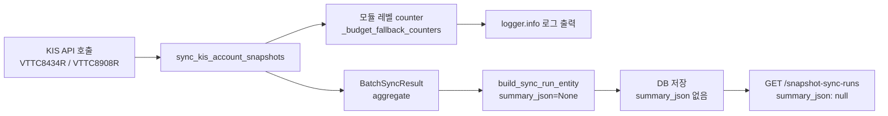
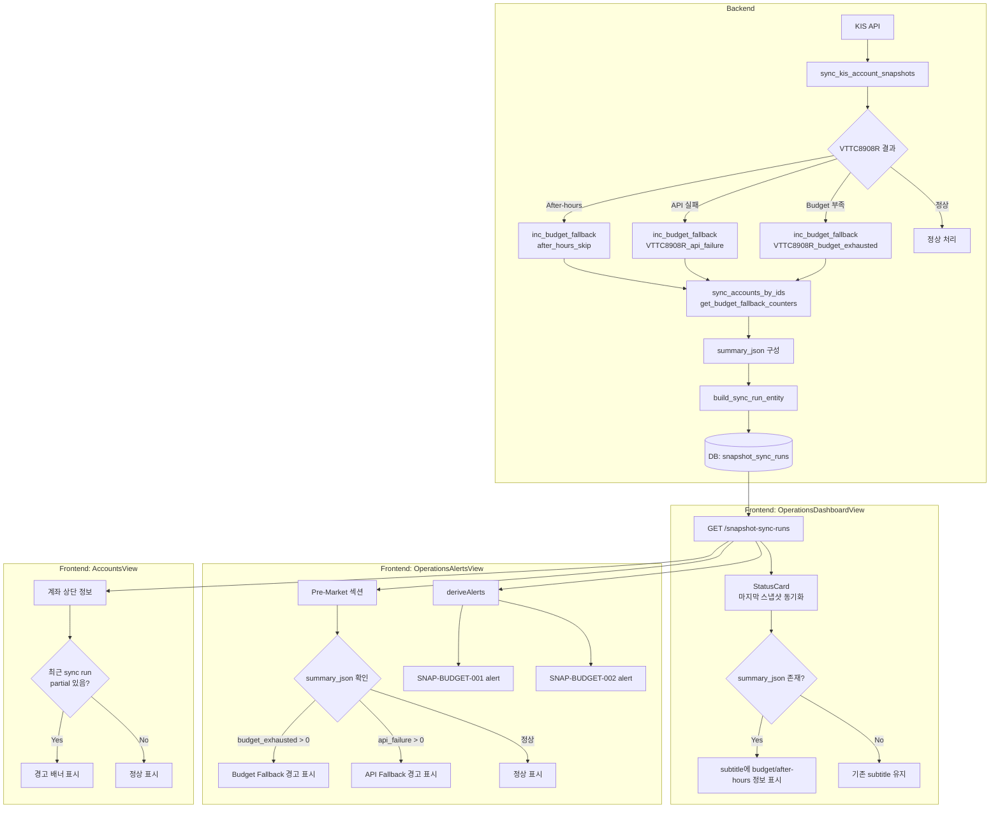

# Snapshot Partial/Budget Fallback 상태 UI 가시화 — 현황 분석 및 변경 계획

> 작성일: 2026-05-23  
> 관련 PR/작업: KIS snapshot-sync budget fallback counter, `CashAndPositionsResult`, VTTC8908R fallback/after-hours skip

---

## 1. 현재 가시성 문제

### 1.1 누락된 정보

| 정보 | 백엔드 상태 | UI 노출 여부 |
|------|------------|-------------|
| budget fallback counter (`VTTC8908R_pre_check`) | 모듈 레벨 메모리 변수, 로그만 출력 | ❌ 없음 |
| budget fallback counter (`VTTC8908R_budget_exhausted`) | 모듈 레벨 메모리 변수, 로그만 출력 | ❌ 없음 |
| budget fallback counter (`VTTC8908R_api_failure`) | 모듈 레벨 메모리 변수, 로그만 출력 | ❌ 없음 |
| after-hours skip counter (`after_hours_skip`) | 모듈 레벨 메모리 변수, 로그만 출력 | ❌ 없음 |
| partial snapshot 상세 원인 | `partial_accounts` 개수만 저장 | partial이지만 왜 partial인지 알 수 없음 |
| 계좌별 snapshot sync 결과 | 계좌 레벨 저장 없음, run 레벨 aggregate만 | ❌ 없음 |
| `summary_json` | DB 컬럼 존재하지만 `build_sync_run_entity()` 호출 시 `None`으로 전달됨 | 데이터 없음 |

### 1.2 Operator가 알 수 없는 상태

1. **VTTC8908R budget이 소진되어 fallback했는지** — 로그만 확인 가능, UI에서는 볼 수 없음
2. **after-hours여서 VTTC8908R이 skip되었는지** — `after_hours` boolean만 있고 skip된 계좌 수는 없음
3. **partial sync가 budget 문제 때문인지, API 실패 때문인지** — `partial_accounts` 개수만 있고 원인 구분 불가
4. **특정 계좌가 최근 snapshot sync에서 어떤 상태였는지** — 계좌 화면에서 sync run 이력 확인 불가

---

## 2. 데이터 흐름 분석

### 2.1 현재 흐름



### 2.2 변경 후 흐름

```mermaid
flowchart LR
    A[KIS API 호출\nVTTC8434R / VTTC8908R] --> B[sync_kis_account_snapshots]
    B --> C[모듈 레벨 counter\n_budget_fallback_counters]
    C --> D[sync_accounts_by_ids\nget_budget_fallback_counters]
    D --> E[summary_json 구성\nbudget + after_hours counters]
    E --> F[build_sync_run_entity\nsummary_json=budget_summary]
    F --> G[DB 저장\nsummary_json 포함]
    G --> H[GET /snapshot-sync-runs\nsummary_json: budget info]
    H --> I[Frontend 표시\nStatusCard + badge + tooltip]
```



---

## 3. 변경 계획

### 3.1 Backend: `summary_json`에 budget fallback 정보 저장

#### 수정 파일: [`src/agent_trading/services/snapshot_sync.py`](src/agent_trading/services/snapshot_sync.py)

`sync_accounts_by_ids()`와 `sync_all_accounts()`가 `build_sync_run_entity()` 호출 시 budget fallback counter를 `summary_json`에 포함하도록 수정.

**변경 내용:**
```python
# 각 sync 함수 내, batch 완료 후
cnt = get_budget_fallback_counters()
summary = {
    "budget_fallbacks": {
        "VTTC8908R_pre_check": cnt.get("VTTC8908R_pre_check", 0),
        "VTTC8908R_budget_exhausted": cnt.get("VTTC8908R_budget_exhausted", 0),
        "VTTC8908R_api_failure": cnt.get("VTTC8908R_api_failure", 0),
        "after_hours_skip": cnt.get("after_hours_skip", 0),
    },
    "accounts_with_errors": batch.errors[:20] if batch.errors else [],
}

run_entity = build_sync_run_entity(
    batch,
    trigger_type=...,
    scope=...,
    summary_json=summary,  # ← 기존 None 대신 summary dict
    ...
)
```

#### 수정 파일: [`scripts/run_snapshot_sync_loop.py`](scripts/run_snapshot_sync_loop.py)

`_run_one_cycle()`이 `build_sync_run_entity()` 호출 시 budget fallback counter를 `summary_json`에 포함하도록 수정.

**변경 내용:** `summary_json=None` 대신 `get_budget_fallback_counters()` 결과를 dict로 구성.

### 3.2 Backend: `GET /snapshot-sync-runs/{id}` 응답에 budget fallback 정보 추가 (선택)

`summary_json`에 budget counter가 포함되면 자동으로 API 응답에 포함되므로 별도 schema 변경 불필요.

### 3.3 Backend: `SnapshotSyncRunSummary` 스키마 — 신규 필드 추가 (선택)

`summary_json`을 파싱하지 않고 직접 필드로 노출할 수도 있지만, 현재로는 `summary_json` 내부에 budget counter를 포함하는 방식이 변경 최소화에 유리.

**의사결정:** `summary_json`에 포함 (별도 필드 추가 ❌)

### 3.4 Frontend: [`admin_ui/src/types/api.ts`](admin_ui/src/types/api.ts)

변경 불필요. `summary_json: Record<string, unknown> | null`이 이미 존재하며 budget fallback 데이터를 포함하게 됨.

### 3.5 Frontend: [`admin_ui/src/components/OperationsDashboardView.tsx`](admin_ui/src/components/OperationsDashboardView.tsx)

**StatusCard 개선 — "마지막 스냅샷 동기화"**

```typescript
// budget fallback 정보 추출
const summary = syncRun?.summary_json as {
  budget_fallbacks?: Record<string, number>;
  accounts_with_errors?: string[];
} | null;

const hasBudgetExhausted = summary?.budget_fallbacks?.VTTC8908R_budget_exhausted ?? 0 > 0;
const hasApiFallback = summary?.budget_fallbacks?.VTTC8908R_api_failure ?? 0 > 0;
const hasAfterHoursSkip = summary?.budget_fallbacks?.after_hours_skip ?? 0 > 0;

// subtitle에 budget fallback 정보 추가
snapshotSubtitle = budgetInfo
  ? `${snapshotTimeStr} | 예산초과 ${budgetInfo.VTTC8908R_budget_exhausted} / API fallback ${budgetInfo.VTTC8908R_api_failure} / 장후skip ${budgetInfo.after_hours_skip}`
  : snapshotSubtitle;
```

**시각적 표시:**
- budget exhausted 발생 → StatusCard에 `badgeLabel="예산초과"` 및 `variant="warning"` (partial 상태와 무관하게)
- partial + budget exhausted 동시 표시 가능하도록 subtitle 구성

### 3.6 Frontend: [`admin_ui/src/components/OperationsAlertsView.tsx`](admin_ui/src/components/OperationsAlertsView.tsx)

**Pre-Market 섹션 개선:** budget fallback 정보를 포함한 요약 표시

```typescript
// snapshotSyncRun.summary_json에서 budget fallback 추출
const summary = snapshotSyncRun?.summary_json as {...} | null;
const budgetInfo = summary?.budget_fallbacks;

// budget fallback이 있는 경우 추가 정보 표시
{budgetInfo && (budgetInfo.VTTC8908R_budget_exhausted > 0 || budgetInfo.VTTC8908R_api_failure > 0) && (
  <div className="mt-2 text-xs text-[#92400e] bg-[#fef3c7] rounded p-2">
    ⚠ VTTC8908R fallback: 예산초과 {budgetInfo.VTTC8908R_budget_exhausted} /
    API 실패 {budgetInfo.VTTC8908R_api_failure}
  </div>
)}
```

### 3.7 Frontend: [`admin_ui/src/lib/alerts.ts`](admin_ui/src/lib/alerts.ts)

**신규 Alert Rule: `SNAP-BUDGET-001` — Budget fallback 발생 (주의)**

```typescript
// budget fallback alert
const summary = input.snapshotSyncRun?.summary_json as {
  budget_fallbacks?: Record<string, number>;
} | null;
const budgetExhausted = summary?.budget_fallbacks?.VTTC8908R_budget_exhausted ?? 0;
if (budgetExhausted > 0) {
  alerts.push({
    id: "SNAP-BUDGET-001",
    level: "주의",
    title: "VTTC8908R Budget Fallback 발생",
    description: `${budgetExhausted}개 계좌에서 budget 초과로 orderable_cash를 fallback했습니다.`,
    time: now,
    status: "OPEN",
  });
}

const apiFallback = summary?.budget_fallbacks?.VTTC8908R_api_failure ?? 0;
if (apiFallback > 0) {
  alerts.push({
    id: "SNAP-BUDGET-002",
    level: "주의",
    title: "VTTC8908R API Fallback 발생",
    description: `${apiFallback}개 계좌에서 API 실패로 orderable_cash를 fallback했습니다.`,
    time: now,
    status: "OPEN",
  });
}
```

### 3.8 Frontend: [`admin_ui/src/components/AccountsView.tsx`](admin_ui/src/components/AccountsView.tsx)

**계좌 상세에 최근 snapshot sync run 상태 표시**

계좌별 snapshot sync 상태를 표시하려면 backend API가 필요하지만, 현재 API는 계좌별 필터를 지원하지 않음. 대신 두 가지 접근:

1. **간이 접근 (Phase 1):** 최근 snapshot sync run의 partial_accounts가 0보다 크면 경고 뱃지를 계좌 화면 상단에 표시
2. **본격 접근 (Phase 2):** `GET /snapshot-sync-runs?account_id=...` 지원 (backend route 추가 필요)

**Phase 1 (우선):**
```typescript
// AccountsView 상단에 최근 sync run 정보가져오기
const [latestSyncRun, setLatestSyncRun] = useState<SnapshotSyncRunSummary | null>(null);
// useEffect에서 getSnapshotSyncRuns(1) 호출
// partial_accounts > 0이면 경고 배너
```

---

## 4. 구체적인 UI 설계

### 4.1 StatusCard 상태 정의

| 시나리오 | Badge | Badge 색상 | StatusCard variant |
|---------|-------|-----------|-------------------|
| 정상 (completed) | — | — | `healthy` (green) |
| Partial (budget 문제 아님) | `부분` | Orange | `warning` |
| Partial + budget exhausted | `예산초과` | Yellow/Orange | `warning` |
| Failed | `실패` | Red | `error` |
| After-hours skip 있음 | `장후skip` | Blue/Info | `info` |

### 4.2 Tooltip 텍스트

```
마지막 스냅샷 동기화
상태: 주의 (부분 성공)
- 총 5계좌 중 4계좌 성공, 1계좌 부분
- VTTC8908R budget 초과: 2계좌 (fallback → available_cash 사용)
- VTTC8908R API 실패: 1계좌 (fallback → available_cash 사용)
- After-hours skip: 3계좌 (VTTC8908R 미호출)
```

### 4.3 Alert Rule 추가 요약

| ID | 수준 | 제목 | 트리거 | 설명 |
|----|------|------|--------|------|
| `SNAP-BUDGET-001` | 주의 | VTTC8908R Budget Fallback | `budget_exhausted > 0` | N계좌에서 budget 초과 fallback |
| `SNAP-BUDGET-002` | 주의 | VTTC8908R API Fallback | `api_failure > 0` | N계좌에서 API 실패 fallback |

---

## 5. 변경 파일 목록

### Backend (3 files)

| 파일 | 변경 내용 | 영향 범위 |
|------|----------|----------|
| [`src/agent_trading/services/snapshot_sync.py`](src/agent_trading/services/snapshot_sync.py) | `sync_accounts_by_ids()`와 `sync_all_accounts()`에서 `build_sync_run_entity()` 호출 시 `summary_json`에 budget fallback counter 포함 | 핵심 로직 |
| [`src/agent_trading/services/kis_snapshot_sync.py`](src/agent_trading/services/kis_snapshot_sync.py) | `build_sync_run_entity()` — 변경 불필요 (이미 `summary_json` 파라미터 지원) | 없음 |
| [`scripts/run_snapshot_sync_loop.py`](scripts/run_snapshot_sync_loop.py) | `_run_one_cycle()`에서 `summary_json`에 budget fallback counter 포함 | 실행 스크립트 |

### Frontend (4 files)

| 파일 | 변경 내용 |
|------|----------|
| [`admin_ui/src/components/OperationsDashboardView.tsx`](admin_ui/src/components/OperationsDashboardView.tsx) | StatusCard subtitle에 budget fallback 정보 표시, after-hours skip badge |
| [`admin_ui/src/components/OperationsAlertsView.tsx`](admin_ui/src/components/OperationsAlertsView.tsx) | Pre-Market 섹션에 budget fallback 정보, 신규 alert rule 추가 |
| [`admin_ui/src/components/AccountsView.tsx`](admin_ui/src/components/AccountsView.tsx) | 최근 snapshot sync run 결과 요약 표시 (Phase 1: 간이) |
| [`admin_ui/src/lib/alerts.ts`](admin_ui/src/lib/alerts.ts) | `SNAP-BUDGET-001`, `SNAP-BUDGET-002` alert rule 추가 |

### Test (2 files)

| 파일 | 변경 내용 |
|------|----------|
| [`tests/api/test_snapshot_sync_runs.py`](tests/api/test_snapshot_sync_runs.py) | `summary_json`이 budget fallback counter를 포함하는지 검증 (백엔드 테스트) |
| [`admin_ui/src/__tests__/`](admin_ui/src/__tests__/) | 신규 alert rule 테스트 추가 |

---

## 6. Mermaid: 변경된 UI 구조



---

## 7. 우선순위 및 구현 단계

### Phase 1 (Backend core + Dashboard 우선)
1. [`src/agent_trading/services/snapshot_sync.py`](src/agent_trading/services/snapshot_sync.py): budget fallback counter를 `summary_json`에 포함
2. [`scripts/run_snapshot_sync_loop.py`](scripts/run_snapshot_sync_loop.py): 동일하게 반영
3. [`admin_ui/src/components/OperationsDashboardView.tsx`](admin_ui/src/components/OperationsDashboardView.tsx): StatusCard 개선

### Phase 2 (Alerts + AlertsView)
4. [`admin_ui/src/lib/alerts.ts`](admin_ui/src/lib/alerts.ts): `SNAP-BUDGET-001`, `SNAP-BUDGET-002` 추가
5. [`admin_ui/src/components/OperationsAlertsView.tsx`](admin_ui/src/components/OperationsAlertsView.tsx): budget fallback 정보 표시

### Phase 3 (AccountsView)
6. [`admin_ui/src/components/AccountsView.tsx`](admin_ui/src/components/AccountsView.tsx): 간이 sync run 요약 추가

### Phase 4 (Test)
7. [`tests/api/test_snapshot_sync_runs.py`](tests/api/test_snapshot_sync_runs.py): `summary_json` 검증
8. [`admin_ui/src/__tests__/`](admin_ui/src/__tests__/): alert rule 테스트

---

## 8. 리스크 및 고려사항

1. **모듈 레벨 카운터 리셋 시점**: `reset_budget_fallback_counters()`는 각 sync cycle 시작 시 호출됨. cycle 간에 counter가 누적되지 않도록 설계되어 있음.
2. **`summary_json` 호환성**: 기존 `summary_json=None` 데이터와 신규 `summary_json={...}` 데이터가 혼재. Frontend에서는 `summary_json`이 null일 경우 graceful fallback 필요.
3. **로그 중복**: Budget fallback 정보가 로그와 `summary_json`에 이중 기록됨 — 이는 의도된 것이며, 로그는 실시간 디버깅용, `summary_json`은 UI 가시화용.
