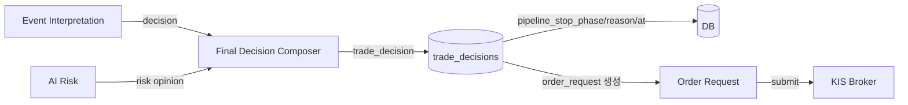
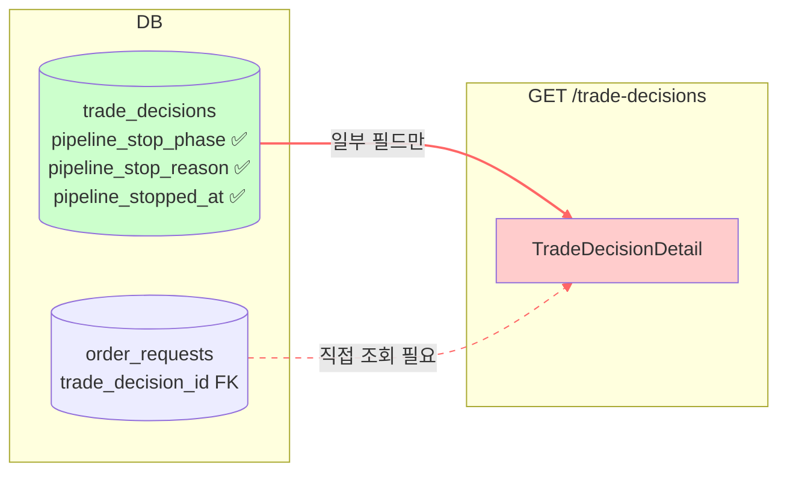
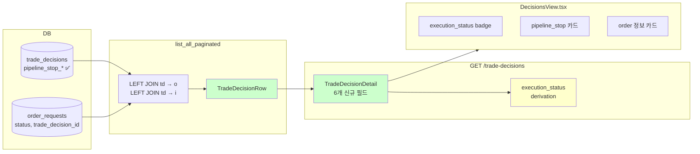
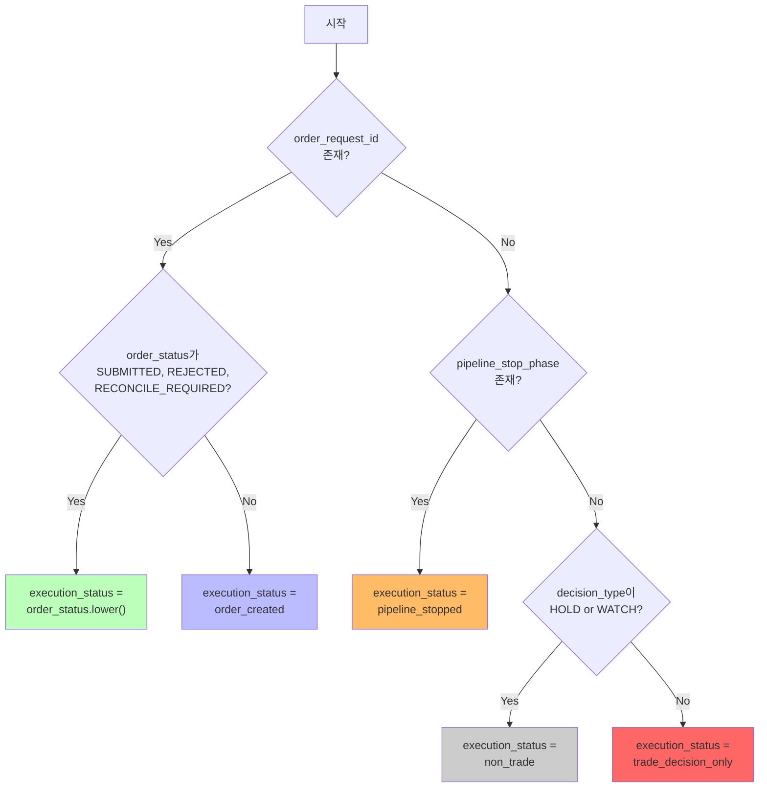
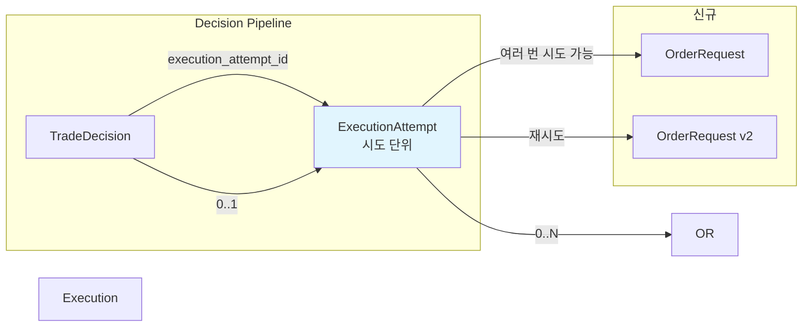
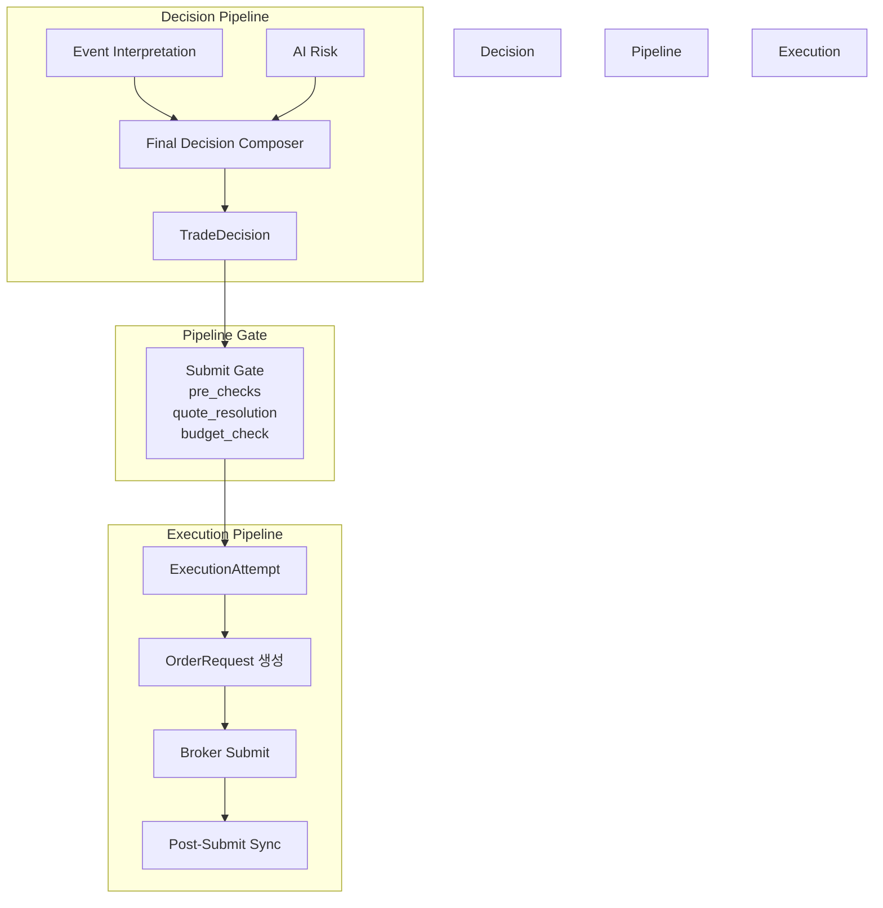

# 최종 보고서: `trade_decision only` 상태 직접 추적 가능 구조 정리

> **Phase 1** — 주문 실행 리팩토링의 첫 단계로, `execution_attempt` 도입 없이
> 현재 `trade_decisions` 중심 구조 안에서 `trade_decision only` 상태를
> DB/API/로그에서 직접 추적 가능하게 만드는 구조 정리를 완료했습니다.
>
> **일자**: 2026-05-23
> **참고 설계**: [`execution_status_derived_field_and_pipeline_stop_exposure_phase1_2026-05-23.md`](execution_status_derived_field_and_pipeline_stop_exposure_phase1_2026-05-23.md)

---

## 1. 현재 `trade_decision only` 관측 한계 — Phase 1 이전 상태

### 1.1 배경

주문 실행 파이프라인은 다음과 같은 구조로 동작합니다:



이 흐름에서 `Decision Pipeline` (EI → FDC → TD) 과 `Execution Pipeline` (TD → OR → KIS) 은
연속되어 있지만, 각 단계가 어디까지 진행되었는지 operator가 한눈에 파악할 수 있는 구조가
아니었습니다.

### 1.2 Ask 분석에서 발견된 문제점

| # | 문제 | 상세 | 코드 위치 |
|---|------|------|-----------|
| P1 | **`pipeline_stop_*` 미노출** | [`db/migrations/0021_add_pipeline_stop_fields.sql`](../db/migrations/0021_add_pipeline_stop_fields.sql)로 DB 컬럼은 추가되었지만, API 응답 스키마인 [`TradeDecisionDetail`](../src/agent_trading/api/schemas.py:290)에 전혀 노출되지 않음 | [`src/agent_trading/api/schemas.py:290-312`](../src/agent_trading/api/schemas.py:290) |
| P2 | **`phase_trace` 미영속화** | `phase_trace` (파이프라인 통과 단계 이력)가 in-memory only로 DB에 저장되지 않음. 재시작 시 trace 소실 | [`src/agent_trading/repositories/postgres/trade_decisions.py`](../src/agent_trading/repositories/postgres/trade_decisions.py) |
| P3 | **`execution_status` 부재** | operator가 "이 TD는 order도 없고 stop도 아닌데 왜?"를 즉시 판별 불가. 매번 `order_requests` 테이블을 따로 조회해야 함 | N/A |
| P4 | **`order_request_id` 역추적 불가** | `TradeDecisionEntity` 자체 필드가 아니며, `OrderRequestEntity.trade_decision_id` FK로만 연결되어 API에서 바로 알 수 없음 | [`src/agent_trading/domain/entities.py:194`](../src/agent_trading/domain/entities.py:194) |
| P5 | **`source_type` Frontend 누락** | Backend API 스키마에는 `source_type` 필드가 존재하지만, Frontend 타입 정의에 누락 | [`admin_ui/src/types/api.ts:185-202`](../admin_ui/src/types/api.ts:185) |
| P6 | **`list_all_paginated()` 반환 타입 취약** | `tuple[list[tuple[TradeDecisionEntity, str | None]], int]` — 튜플 기반으로 가독성 낮고 확장 어려움 | [`src/agent_trading/repositories/postgres/trade_decisions.py:170`](../src/agent_trading/repositories/postgres/trade_decisions.py:170) |

### 1.3 데이터 흐름 시각화 (변경 전)



> **핵심**: DB에는 `pipeline_stop_*` 컬럼이 존재하지만 API가 전혀 읽지 않아 `dead column` 상태.
> `order_request` 연결은 FK로만 존재하여 API 단에서 N+1 쿼리 없이 알 수 없음.

---

## 2. 적용한 Schema / API / 모델 정리

### 2.1 변경 파일 개요 — 7개 파일

| # | 파일 | 변경 유형 | 주요 변경점 |
|---|------|----------|-------------|
| 1 | [`src/agent_trading/repositories/contracts.py`](../src/agent_trading/repositories/contracts.py) | 추가 | `TradeDecisionRow` dataclass 정의, `list_all_paginated()` 반환 타입 변경 |
| 2 | [`src/agent_trading/repositories/postgres/trade_decisions.py`](../src/agent_trading/repositories/postgres/trade_decisions.py) | 수정 | SQL `LEFT JOIN order_requests` + `TradeDecisionRow` 반환 |
| 3 | [`src/agent_trading/repositories/memory.py`](../src/agent_trading/repositories/memory.py) | 수정 | `InMemoryTradeDecisionRepository.list_all_paginated()` 반환 타입 변경 |
| 4 | [`src/agent_trading/api/schemas.py`](../src/agent_trading/api/schemas.py) | 수정 | `TradeDecisionDetail`에 6개 신규 필드 + `@model_validator` |
| 5 | [`src/agent_trading/api/routes/decisions.py`](../src/agent_trading/api/routes/decisions.py) | 수정 | `_to_detail()`이 `TradeDecisionRow` 기반으로 변경 |
| 6 | [`admin_ui/src/types/api.ts`](../admin_ui/src/types/api.ts) | 수정 | Frontend 타입 확장 (+ `source_type` 복원) |
| 7 | [`admin_ui/src/components/DecisionsView.tsx`](../admin_ui/src/components/DecisionsView.tsx) | 수정 | `execution_status` badge, `pipeline_stop` 카드, `order` 정보 카드 |

### 2.2 `TradeDecisionRow` dataclass

**파일**: [`src/agent_trading/repositories/contracts.py:73-87`](../src/agent_trading/repositories/contracts.py:73)

```python
@dataclass(slots=True, frozen=True)
class TradeDecisionRow:
    """TradeDecisionEntity + resolved fields from LEFT JOINs."""
    entity: TradeDecisionEntity
    order_request_id: str | None = None  # LEFT JOIN order_requests
    order_status: str | None = None      # LEFT JOIN order_requests
    instrument_name: str | None = None   # LEFT JOIN instruments
```

**도입 이유**:
- `TradeDecisionEntity`는 `frozen=True, slots=True`이므로 상속 불가
- `list_all_paginated()` 반환 타입을 튜플 `(entity, name)`에서 구조화된 dataclass로 변경
- 향후 `execution_attempt` 도입 시 동일 패턴으로 확장 가능

### 2.3 `list_all_paginated()` SQL 확장

**파일**: [`src/agent_trading/repositories/postgres/trade_decisions.py:171-234`](../src/agent_trading/repositories/postgres/trade_decisions.py:171)

```sql
SELECT td.*,
       i.name AS _instrument_name,
       o.order_request_id AS _order_request_id,
       o.status AS _order_status
FROM trading.trade_decisions td
LEFT JOIN trading.instruments i
    ON td.symbol = i.symbol AND td.market = i.market_code
LEFT JOIN trading.order_requests o
    ON td.trade_decision_id = o.trade_decision_id
{where_clause}
ORDER BY td.created_at DESC, td.trade_decision_id DESC
LIMIT {limit} OFFSET {offset}
```

**변경점**:
- `LEFT JOIN order_requests o` 추가 — `trade_decision_id` FK로 연결
- `_instrument_name`, `_order_request_id`, `_order_status` 별칭으로 조회
- `row_to_entity()` 모르는 컬럼은 자동 드롭되므로 안전
- 반환 타입: `tuple[list[TradeDecisionRow], int]`

### 2.4 `TradeDecisionDetail` — 6개 신규 필드

**파일**: [`src/agent_trading/api/schemas.py:290-357`](../src/agent_trading/api/schemas.py:290)

| 필드 | 타입 | 설명 | 출처 |
|------|------|------|------|
| `order_request_id` | `str \| None` | 연결된 OrderRequest ID | `TradeDecisionRow.order_request_id` |
| `order_status` | `str \| None` | OrderRequest의 현재 상태 | `TradeDecisionRow.order_status` |
| `pipeline_stop_phase` | `str \| None` | 제출 파이프라인 중단 단계 | `TradeDecisionEntity.pipeline_stop_phase` |
| `pipeline_stop_reason` | `str \| None` | 중단 사유 | `TradeDecisionEntity.pipeline_stop_reason` |
| `pipeline_stopped_at` | `datetime \| None` | 중단 시각 | `TradeDecisionEntity.pipeline_stopped_at` |
| `execution_status` | `str \| None` | **derived field** (아래 3장 참조) | `@model_validator` 계산 |

### 2.5 Frontend 타입 확장

**파일**: [`admin_ui/src/types/api.ts`](../admin_ui/src/types/api.ts)

```typescript
export interface TradeDecisionDetail {
  // 기존 필드 유지 ...
  source_type: string | null;  // ← 복원 (누락 수정)

  // 신규 필드 (Phase 1)
  order_request_id: string | null;
  order_status: string | null;
  pipeline_stop_phase: string | null;
  pipeline_stop_reason: string | null;
  pipeline_stopped_at: string | null;
  execution_status: string | null;
}
```

### 2.6 데이터 흐름 시각화 (변경 후)



> **변경 후**: 모든 데이터가 단일 API 호출로 resolve됨. `execution_status`는 validator가 자동 계산.

---

## 3. Derived `execution_status` 정의

### 3.1 판별 우선순위



**구현 코드**: [`src/agent_trading/api/schemas.py:343-356`](../src/agent_trading/api/schemas.py:343)

```python
@model_validator(mode='after')
def _compute_execution_status(self) -> 'TradeDecisionDetail':
    if self.order_request_id is not None:
        if self.order_status in ('SUBMITTED', 'REJECTED', 'RECONCILE_REQUIRED'):
            self.execution_status = self.order_status.lower()
        else:
            self.execution_status = 'order_created'
    elif self.pipeline_stop_phase is not None:
        self.execution_status = 'pipeline_stopped'
    elif self.decision_type in ('HOLD', 'WATCH'):
        self.execution_status = 'non_trade'
    else:
        self.execution_status = 'trade_decision_only'
    return self
```

### 3.2 상태 테이블

| `execution_status` | 의미 | 판별 조건 | UI 색상 | 우선순위 |
|-------------------|------|-----------|---------|:-------:|
| `trade_decision_only` | TD만 존재. order 없음, stop 없음, HOLD/WATCH 아님 | `order_request_id IS NULL` AND `pipeline_stop_phase IS NULL` AND `decision_type NOT IN (HOLD, WATCH)` | 🔴 red | 4 |
| `pipeline_stopped` | 파이프라인 중단 (사전체크/서브미션/사후체크 실패) | `pipeline_stop_phase IS NOT NULL` (order 없음) | 🟠 orange | 3 |
| `non_trade` | HOLD/WATCH — 거래 대상 아님 | `decision_type IN (HOLD, WATCH)` (order/stop 없음) | ⚪ gray | 4 |
| `order_created` | OrderRequest 생성됨 (PENDING_SUBMIT/ACKNOWLEDGED 등) | `order_request_id IS NOT NULL` AND `order_status NOT IN (SUBMITTED, REJECTED, RECONCILE_REQUIRED)` | 🔵 blue | 1 |
| `submitted` | 브로커 제출 완료 | `order_status = 'SUBMITTED'` | 🟢 green | 1 |
| `rejected` | 브로커 거부 | `order_status = 'REJECTED'` | 🔴 red | 1 |
| `reconcile_required` | 조정 필요 | `order_status = 'RECONCILE_REQUIRED'` | 🟠 orange | 1 |

> **우선순위**: order가 존재하면 항상 order 기반 상태 (1) > pipeline_stop (3) > decision_type 기반 (4).
> 우선순위 2는 예약됨 (향후 `execution_attempt` 도입 시).

### 3.3 `order_created`에 포함되는 OrderStatus 목록

`execution_status = 'order_created'`가 되는 OrderStatus 값들:

| OrderStatus | 설명 |
|-------------|------|
| `DRAFT` | 초안 |
| `VALIDATED` | 검증 완료 |
| `PENDING_SUBMIT` | 제출 대기 |
| `ACKNOWLEDGED` | 접수 확인 |
| `PARTIALLY_FILLED` | 부분 체결 |
| `FILLED` | 체결 완료 |
| `CANCEL_PENDING` | 취소 진행 중 |
| `CANCELLED` | 취소 완료 |
| `EXPIRED` | 만료 |

---

## 4. 테스트 결과

### 4.1 신규 테스트: `TestTradeDecisionExecutionStatus`

**파일**: [`tests/api/test_inspection.py:592-645`](../tests/api/test_inspection.py:592)

#### 4.1.1 구조 검증 테스트

**`test_trade_decision_detail_has_execution_fields`** — API 응답에 신규 6개 필드 존재 확인

```python
# 필드 존재 여부만 검증
assert "execution_status" in item
assert "pipeline_stop_phase" in item
assert "pipeline_stop_reason" in item
assert "pipeline_stopped_at" in item
assert "order_request_id" in item
assert "order_status" in item
```

#### 4.1.2 Parametrize `execution_status` derivation 단위 테스트

```python
@pytest.mark.parametrize("decision_type,order_id,order_status,stop_phase,expected", [
    ("BUY",  None, None, None,     "trade_decision_only"),
    ("BUY",  None, None, "sizing", "pipeline_stopped"),
    ("HOLD", None, None, None,     "non_trade"),
    ("WATCH",None, None, None,     "non_trade"),
    ("BUY",  "some-id", "PENDING_SUBMIT", None, "order_created"),
    ("BUY",  "some-id", "SUBMITTED",      None, "submitted"),
    ("BUY",  "some-id", "REJECTED",      None, "rejected"),
    ("BUY",  "some-id", "RECONCILE_REQUIRED", None, "reconcile_required"),
])
```

**커버리지**:
- `trade_decision_only`: BUY + order 없음 + stop 없음
- `pipeline_stopped`: BUY + stop_phase="sizing"
- `non_trade`: HOLD, WATCH 각각
- `order_created`: BUY + PENDING_SUBMIT
- `submitted`: BUY + SUBMITTED
- `rejected`: BUY + REJECTED
- `reconcile_required`: BUY + RECONCILE_REQUIRED

### 4.2 전체 테스트 결과

| 테스트 파일 | 테스트 수 | 결과 |
|------------|:---------:|:----:|
| [`tests/api/test_inspection.py`](../tests/api/test_inspection.py) | 53개 | ✅ 전체 통과 |
| [`tests/repositories/test_postgres_trade_decisions.py`](../tests/repositories/test_postgres_trade_decisions.py) | 10개 | ✅ 전체 통과 |
| [`tests/api/test_postgres_inspection.py`](../tests/api/test_postgres_inspection.py) | 17개 | ✅ 전체 통과 |

> **참고**: `test_inspection.py` 53개는 기존 44개 + 신규 9개 (1개 구조 + 8개 parametrize).
> `test_postgres_trade_decisions.py`는 Postgres 연결이 필요한 통합 테스트로, 변경 영향 없이 기존 10개 통과 확인.

### 4.3 Docker 배포 검증

| 항목 | 결과 |
|------|:----:|
| Docker rebuild | ✅ 성공 |
| Health Check (`GET /health`) | ✅ 200 OK |
| API 응답 신규 필드 포함 | ✅ 확인 |

---

## 5. 다음 `execution_attempt` 단계 제안

### 5.1 Phase 2: `phase_trace` JSONB 컬럼 마이그레이션

**목표**: `update_pipeline_stop()`에서 `phase_trace`를 DB에 함께 저장

```sql
-- 신규 migration
ALTER TABLE trading.trade_decisions
    ADD COLUMN phase_trace JSONB DEFAULT '[]'::jsonb;
    -- 파이프라인 통과 단계 이력 (예: ["pre_checks", "quote_resolution", "order_submission"])
```

**변경 사항**:
- [`db/migrations/0022_add_phase_trace.sql`](../db/migrations/) — DDL
- [`src/agent_trading/repositories/postgres/trade_decisions.py:236`](../src/agent_trading/repositories/postgres/trade_decisions.py:236) — `update_pipeline_stop()`이 `phase_trace`도 업데이트하도록 수정
- `pipeline_phase_added` 이벤트에서 `phase_trace` 누적

### 5.2 Phase 3: `execution_attempt` 엔티티 / 상태 모델 설계 (EXE-007)

**목표**: Decision Pipeline과 Execution Pipeline의 명확한 분리



**핵심 설계 요소**:
- `ExecutionAttempt`는 하나의 TD를 실행하기 위한 **단일 시도**를 나타냄
- 동일 TD에 대해 여러 `ExecutionAttempt` 가능 (재시도)
- 각 `ExecutionAttempt`는 `0..N`개의 `OrderRequest`를 가질 수 있음
- `execution_status` derivation 로직에 `execution_attempt` 상태 반영

### 5.3 Decision Pipeline / Execution Pipeline 분리 (EXE-006)



**분리 기준**:
- **Decision Pipeline**: EI → FDC → `TradeDecision` — 순수 AI 판단
- **Pipeline Gate**: `trade_decision`에 대한 사전 검증 (pipeline_stop 발생 지점)
- **Execution Pipeline**: `ExecutionAttempt` → `OrderRequest` → Broker Submit — 실제 실행

### 5.4 로드맵

| Phase | 내용 | 의존성 | 예상 범위 |
|-------|------|--------|-----------|
| ✅ Phase 1 | `execution_status` derived field + `pipeline_stop_*` API/UI 노출 | — | 7개 파일 변경 |
| 🔲 Phase 2 | `phase_trace` JSONB migration + 저장 | Phase 1 | 1 migration + 1 repository |
| 🔲 Phase 3 | `ExecutionAttempt` 엔티티 설계 | Phase 2 | 새 엔티티 + 리포지토리 |
| 🔲 Phase 4 | Pipeline 분리 리팩토링 | Phase 3 | 구조 변경 |

### 5.5 Phase 2 설계 노트

`update_pipeline_stop()`에 `phase_trace` 누적 로직 추가:

```python
async def update_pipeline_stop(
    self,
    trade_decision_id: UUID,
    phase: str,
    reason: str,
    stopped_at: datetime,
) -> None:
    # 현재 phase_trace 조회 → phase 추가 → 저장
    row = await self._tx.connection.fetchval(
        "SELECT phase_trace FROM trading.trade_decisions "
        "WHERE trade_decision_id = $1",
        trade_decision_id,
    )
    trace = list(row or [])
    trace.append({"phase": phase, "stopped_at": stopped_at.isoformat()})
    
    await self._tx.connection.execute("""
        UPDATE trading.trade_decisions
        SET pipeline_stop_phase = $1,
            pipeline_stop_reason = $2,
            pipeline_stopped_at = $3,
            phase_trace = $4::jsonb
        WHERE trade_decision_id = $5
    """, phase, reason, stopped_at, json.dumps(trace), trade_decision_id)
```

---

## 6. 부록

### 6.1 변경 파일 상세 커밋 가이드

```bash
# 1. contracts.py — TradeDecisionRow dataclass + list_all_paginated 시그니처
# 2. trade_decisions.py — LEFT JOIN + TradeDecisionRow 반환
# 3. memory.py — 반환 타입 변경
# 4. schemas.py — 6개 신규 필드 + @model_validator
# 5. decisions.py — _to_detail TradeDecisionRow 기반
# 6. api.ts — Frontend 타입 확장
# 7. DecisionsView.tsx — UI badge/card 추가
```

### 6.2 참고 문서

| 문서 | 설명 |
|------|------|
| [`execution_status_derived_field_and_pipeline_stop_exposure_phase1_2026-05-23.md`](execution_status_derived_field_and_pipeline_stop_exposure_phase1_2026-05-23.md) | 상세 설계 문서 (구현 전 단계) |
| [`[BACKLOG] backlog.md`](./[BACKLOG]%20backlog.md) | EXE-001, 002, 005A, 005B |
| [`src/agent_trading/api/schemas.py:290-357`](../src/agent_trading/api/schemas.py:290) | `TradeDecisionDetail` 스키마 |
| [`src/agent_trading/repositories/contracts.py:73-87`](../src/agent_trading/repositories/contracts.py:73) | `TradeDecisionRow` dataclass |
| [`src/agent_trading/repositories/postgres/trade_decisions.py:171-234`](../src/agent_trading/repositories/postgres/trade_decisions.py:171) | `list_all_paginated()` 구현 |
| [`src/agent_trading/api/routes/decisions.py:35-69`](../src/agent_trading/api/routes/decisions.py:35) | `_to_detail()` 변환 함수 |
| [`db/migrations/0021_add_pipeline_stop_fields.sql`](../db/migrations/0021_add_pipeline_stop_fields.sql) | `pipeline_stop_*` DDL |
| [`tests/api/test_inspection.py:592-645`](../tests/api/test_inspection.py:592) | `TestTradeDecisionExecutionStatus` |
