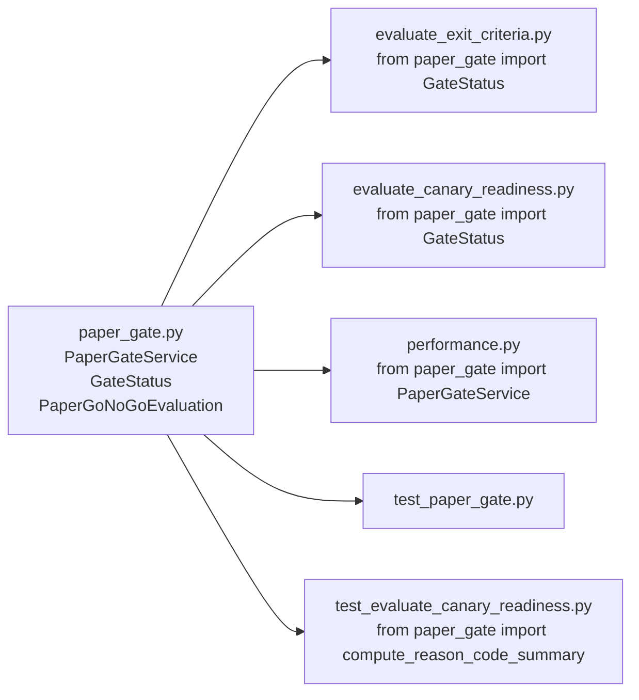

# Rename 마감 — 잔존 old 참조 전수 조사 + 제거 계획

> **작성일**: 2026-05-25  
> **목적**: 환경-틴티드(environment-tinted) 파일명에서 역할-기반(role-based) 파일명으로의 rename을 마감하고, 잔존 old 참조를 전수 제거하기 위한 실행 계획 수립

---

## 1. 개요

이전 rename 작업으로 주요 진입점(`scripts/`)과 테스트(`tests/`)의 환경-틴티드 파일명이 역할-기반 이름으로 변경되었다.  
예) `run_paper_decision_loop.py` → `run_decision_loop.py`, `verify_paper_loop.py` → `verify_decision_loop.py`

그러나 다음 잔존 항목들이 남아 있다:

1. **Backward-compat wrapper 파일** (scripts 6개 + tests 7개 = 13개) — pure re-export
2. **Makefile**이 아직 wrapper 경로(`test_kis_paper_smoke.py`)를 참조
3. **보조 스크립트** docstring/subprocess 경로가 old 이름 참조
4. **paper_gate.py** — domain-specific service (wrapper가 아님)
5. **Docstring-only 경미한 참조** (런타임 영향 없음)

---

## 2. 잔존 old 참조 전수 Inventory

### 2.1 Backward-compat Wrapper 파일 (scripts 디렉터리)

| # | 파일 (OLD, 삭제 대상) | Canonical 진입점 (NEW) | 비고 |
|---|----------------------|----------------------|------|
| W1 | [`scripts/run_paper_decision_loop.py`](scripts/run_paper_decision_loop.py) | `scripts.run_decision_loop` | `from scripts.run_decision_loop import *` |
| W2 | [`scripts/verify_paper_loop.py`](scripts/verify_paper_loop.py) | `scripts.verify_decision_loop` | `from scripts.verify_decision_loop import *` |
| W3 | [`scripts/evaluate_live_gate.py`](scripts/evaluate_live_gate.py) | `scripts.evaluate_canary_readiness` | `from scripts.evaluate_canary_readiness import *` |
| W4 | [`scripts/evaluate_paper_exit.py`](scripts/evaluate_paper_exit.py) | `scripts.evaluate_exit_criteria` | `from scripts.evaluate_exit_criteria import *` |
| W5 | [`scripts/run_near_real_ops_scheduler.py`](scripts/run_near_real_ops_scheduler.py) | `scripts.run_ops_scheduler` | named re-export (`NearRealOpsScheduler`, `main`, `__main__`) |
| W6 | [`scripts/start_with_live_creds.sh`](scripts/start_with_live_creds.sh) | `scripts.start_with_prod_creds.sh` | `exec` delegation |

**제거 방식**: 파일 삭제 (`git rm`)  
**위험도**: 낮음 — pure re-export, canonical 진입점 존재 확인 완료

### 2.2 Backward-compat Wrapper 파일 (tests 디렉터리)

| # | 파일 (OLD, 삭제 대상) | Canonical 테스트 모듈 (NEW) | 비고 |
|---|----------------------|---------------------------|------|
| T1 | [`tests/smoke/test_paper_loop.py`](tests/smoke/test_paper_loop.py) | `tests.smoke.test_decision_loop` | `from tests.smoke.test_decision_loop import *` |
| T2 | [`tests/smoke/test_paper_loop_postgres.py`](tests/smoke/test_paper_loop_postgres.py) | `tests.smoke.test_decision_loop_postgres` | `from tests.smoke.test_decision_loop_postgres import *` |
| T3 | [`tests/smoke/test_kis_paper_smoke.py`](tests/smoke/test_kis_paper_smoke.py) | `tests.smoke.test_kis_sandbox_smoke` | `from tests.smoke.test_kis_sandbox_smoke import *` |
| T4 | [`tests/scripts/test_run_paper_decision_loop.py`](tests/scripts/test_run_paper_decision_loop.py) | `tests.scripts.test_run_decision_loop` | `from tests.scripts.test_run_decision_loop import *` |
| T5 | [`tests/scripts/test_run_near_real_ops_scheduler.py`](tests/scripts/test_run_near_real_ops_scheduler.py) | `tests.scripts.test_run_ops_scheduler` | `from tests.scripts.test_run_ops_scheduler import *` |
| T6 | [`tests/scripts/test_evaluate_live_gate.py`](tests/scripts/test_evaluate_live_gate.py) | `tests.scripts.test_evaluate_canary_readiness` | `from tests.scripts.test_evaluate_canary_readiness import *` |
| T7 | [`tests/scripts/test_evaluate_paper_exit.py`](tests/scripts/test_evaluate_paper_exit.py) | `tests.scripts.test_evaluate_exit_criteria` | `from tests.scripts.test_evaluate_exit_criteria import *` |

**제거 방식**: 파일 삭제 (`git rm`)  
**위험도**: 낮음 — pure re-export, pytest는 canonical 모듈을 직접 import

### 2.3 Makefile 참조 (runtime/CLI 영향 있음)

| 라인 | 내용 | 필요한 변경 |
|------|------|-----------|
| [`Makefile:23`](Makefile:23) | `python3 -m pytest tests/smoke/test_kis_paper_smoke.py ...` | → `tests/smoke/test_kis_sandbox_smoke.py` |
| [`Makefile:26`](Makefile:26) | `python3 -m pytest tests/smoke/test_kis_paper_smoke.py ...` | → `tests/smoke/test_kis_sandbox_smoke.py` |

**위험도**: 중간 — Makefile은 직접 CLI 경로 사용, wrapper 제거 후 깨짐

### 2.4 보조 스크립트 subprocess/docstring 참조

| 파일 | 라인 | 내용 | 유형 | 필요한 변경 |
|------|------|------|------|-----------|
| [`scripts/observe_seeded_news_comparison.py`](scripts/observe_seeded_news_comparison.py) | 54 | `PAPER_LOOP_MODULE = "scripts.run_paper_decision_loop"` | **subprocess runtime** | → `"scripts.run_decision_loop"` |
| [`scripts/observe_seeded_news_comparison.py`](scripts/observe_seeded_news_comparison.py) | 6-7 | docstring: `run_paper_decision_loop` | docstring | 선택적 cleanup |
| [`scripts/observe_seeded_news_comparison.py`](scripts/observe_seeded_news_comparison.py) | 133 | docstring: `run_paper_decision_loop` | docstring | 선택적 cleanup |
| [`scripts/run_event_ingestion_loop.py`](scripts/run_event_ingestion_loop.py) | 11 | docstring: `run_paper_decision_loop.py` | docstring | 선택적 cleanup |
| [`scripts/run_orchestrator_once.py`](scripts/run_orchestrator_once.py) | 6 | docstring: `verify_paper_loop.py` | docstring | 선택적 cleanup |
| [`scripts/run_orchestrator_once.py`](scripts/run_orchestrator_once.py) | 310 | argparse help: `verify_paper_loop.py` | argparse help text | 선택적 cleanup |
| [`scripts/run_near_real_ops_scheduler.py.diagbak`](scripts/run_near_real_ops_scheduler.py.diagbak) | 15, 618 | `run_paper_decision_loop.py` 참조 | diagbak (비운영) | 무시 가능 |

**위험도**: 중간 (subprocess 경로만 필수, docstring은 선택)

### 2.5 paper_gate.py — Domain-Specific Service (wrapper 아님)

| 파일 | 설명 | 상태 |
|------|------|------|
| [`src/agent_trading/services/paper_gate.py`](src/agent_trading/services/paper_gate.py) | Paper Go/No-Go Gate 평가 서비스 (631 lines) | **이번 턴 rename 대상 아님** |

**Import chain**:
- `scripts/evaluate_exit_criteria.py:69` — `from agent_trading.services.paper_gate import GateStatus`
- `scripts/evaluate_canary_readiness.py:61` — `from agent_trading.services.paper_gate import GateStatus`
- `src/agent_trading/api/routes/performance.py:39` — `from agent_trading.services.paper_gate import PaperGateService`
- `tests/services/test_paper_gate.py` — full test suite (630+ lines)
- `tests/scripts/test_evaluate_canary_readiness.py:44` — `from agent_trading.services.paper_gate import compute_reason_code_summary`

**Settings 영향** (settings.py):
```
paper_gate_min_return_pct, paper_gate_min_excess_return_pct, paper_gate_max_drawdown_pct,
paper_gate_min_win_rate_pct, paper_gate_min_filled_orders, paper_gate_max_consecutive_failures,
paper_gate_min_sharpe_ratio, paper_gate_min_sortino_ratio, paper_gate_min_calmar_ratio
```

**Env var 영향**:
```
PAPER_GATE_MIN_RETURN_PCT, PAPER_GATE_MIN_EXCESS_RETURN_PCT, PAPER_GATE_MAX_DRAWDOWN_PCT,
PAPER_GATE_MIN_WIN_RATE_PCT, PAPER_GATE_MIN_FILLED_ORDERS, PAPER_GATE_MAX_CONSECUTIVE_FAILURES,
PAPER_GATE_MIN_SHARPE_RATIO, PAPER_GATE_MIN_SORTINO_RATIO, PAPER_GATE_MIN_CALMAR_RATIO
```

### 2.6 기타 경미한 참조 (변경 불필요)

| 위치 | 내용 | 이유 |
|------|------|------|
| [`pyproject.toml`](pyproject.toml) | `run-orchestrator-once`, `agent-trading` | 이미 role-based, 변경 불필요 |
| [`pytest.ini`](pytest.ini) | `smoke: KIS paper/sandbox...` | 설명 레이블, 변경 불필요 |
| [`docker-compose.yml`](docker-compose.yml) | `APP_ENV=paper`, `KIS_ENV=paper` | **환경 설정 값** (KIS broker 환경), filename rename과 무관 |
| `.env`, `.env.example` | `KIS_ENV=paper`, `KIS_REAL_REST_RPS` | 환경 설정 값, `.env` 수정 금지 제약 |

**중요 구분**: `docker-compose.yml`의 `KIS_ENV=paper`는 **KIS broker 환경**(모의투자)을 지정하는 설정 값이다. 이는 파일명 rename과 전혀 무관하며 절대 변경하면 안 된다.

---

## 3. 질문 답변

### Q1. runtime/CLI에서 실제로 아직 old 이름을 참조하는 곳은 어디인가?

**답변**: 다음 2곳이 **런타임 영향**이 있는 old 참조이다.

1. **`Makefile:23,26`** — `make smoke`, `make smoke-all`이 `tests/smoke/test_kis_paper_smoke.py` 경로 사용
   - 이 경로는 backward-compat wrapper이므로 wrapper 삭제 시 깨짐
   - Canonical 경로 `tests/smoke/test_kis_sandbox_smoke.py`로 변경 필요

2. **`scripts/observe_seeded_news_comparison.py:54`** — `PAPER_LOOP_MODULE = "scripts.run_paper_decision_loop"`
   - 이 상수는 subprocess 실행에 사용됨 (`python -m scripts.run_paper_decision_loop ...`)
   - wrapper 삭제 시 subprocess 호출 실패
   - `"scripts.run_decision_loop"`로 변경 필요

나머지는 **docstring/주석 전용** 참조로 런타임에 영향이 없다.

### Q2. backward-compat wrapper는 이번 턴에서 제거 가능한가?

**답변**: **제거 가능**하다. 단, 다음 사전 조건을 충족해야 한다.

#### 사전 조건 (제거 전 완료 필요)

| # | 항목 | 파일 | 변경 내용 |
|---|------|------|---------|
| P1 | Makefile 경로 변경 | [`Makefile`](Makefile:23) | `test_kis_paper_smoke.py` → `test_kis_sandbox_smoke.py` |
| P2 | subprocess 경로 변경 | [`scripts/observe_seeded_news_comparison.py`](scripts/observe_seeded_news_comparison.py:54) | `PAPER_LOOP_MODULE` 값을 `"scripts.run_decision_loop"`로 변경 |
| P3 | docstring cleanup (선택) | 위 2.4 목록 참조 | 선택적 |

#### 제거 후보 (13 files)

**scripts/ (6 files)**:
```
scripts/run_paper_decision_loop.py          → git rm
scripts/verify_paper_loop.py                 → git rm
scripts/evaluate_live_gate.py               → git rm
scripts/evaluate_paper_exit.py               → git rm
scripts/run_near_real_ops_scheduler.py       → git rm
scripts/start_with_live_creds.sh             → git rm
```

**tests/ (7 files)**:
```
tests/smoke/test_paper_loop.py               → git rm
tests/smoke/test_paper_loop_postgres.py       → git rm
tests/smoke/test_kis_paper_smoke.py           → git rm
tests/scripts/test_run_paper_decision_loop.py → git rm
tests/scripts/test_run_near_real_ops_scheduler.py → git rm
tests/scripts/test_evaluate_live_gate.py      → git rm
tests/scripts/test_evaluate_paper_exit.py     → git rm
```

#### 제거 후 검증

```bash
# 1. 모든 pytest 통과 확인 (known failures 제외)
python -m pytest tests/ -v 2>&1 | tail -5

# 2. Makefile smoke target 정상 동작 확인
make smoke  # dry-run or 실제 실행

# 3. observe_seeded_news_comparison import 확인
python -c "from scripts.observe_seeded_news_comparison import PAPER_LOOP_MODULE; print(PAPER_LOOP_MODULE)"
# → "scripts.run_decision_loop" 출력 확인
```

### Q3. `paper_gate.py`는 이번 턴에서 함께 rename할 수 있는가?

**답변**: **이번 턴에서는 rename하지 않는다.** 별도 이슈로 분리하는 것이 타당하다.

#### 이유
1. **"paper_gate"은 환경-틴티드 naming이 아니다.** Paper Go/No-Go Gate는 paper trading 상태를 평가하는 **도메인 개념**이다. 파일명 rename의 대상은 환경-틴티드(paper/live/near_real)를 역할-기반으로 바꾸는 것이었고, `paper_gate.py`는 여기에 해당하지 않는다.

2. **영향 범위가 크다.** rename 시 변경해야 할 항목:
   - 파일명: `src/agent_trading/services/paper_gate.py`
   - 클래스명: `PaperGateService`, `PaperGateCheck`, `PaperGoNoGoEvaluation`
   - enum명: `GateStatus`, `OverallStatus`
   - settings 필드: 9개의 `paper_gate_*` 필드
   - env var: 9개의 `PAPER_GATE_*` 환경변수
   - import 경로: 5개 파일
   - 테스트 파일: `test_paper_gate.py`, `test_evaluate_canary_readiness.py` 등

3. **범위 밖이다.** 이번 task의 scope은 "wrapper 제거 + Makefile/docstring cleanup"이다. `paper_gate.py` rename은 domain model rename에 해당하며 별도 설계/결정이 필요하다.

#### Import Chain 요약



### Q4. rename 마감 완료 기준을 무엇으로 둘 것인가?

**답변**: 다음 5가지 기준을 모두 충족해야 한다.

| # | 기준 | 검증 방법 | 완료 조건 |
|---|------|----------|----------|
| ✅ 1 | 모든 backward-compat wrapper 제거 | `rg --files \| grep -E 'paper_loop\|live_gate\|paper_exit\|paper_decision\|near_real'` | scripts/ + tests/에서 0건 |
| ✅ 2 | Makefile이 canonical 테스트 경로 사용 | `grep -n 'test_kis_paper_smoke\|test_paper_loop' Makefile` | 0건 |
| ✅ 3 | subprocess 참조가 canonical 경로로 변경 | `grep -rn 'run_paper_decision_loop\|verify_paper_loop\|evaluate_paper_exit\|evaluate_live_gate\|run_near_real' scripts/` | docstring 제외 0건 |
| ✅ 4 | pytest suite 통과 | `python -m pytest tests/ -v` | 기존 known failures만 존재 |
| ❌ 5 | paper_gate.py rename | *별도 이슈* | 이번 턴 미완료 |

**이번 턴 완료 기준**: ✅ 1~4 (5는 별도 이슈)

### Q5. 테스트 실패 3건은 rename과 무관한 known issue로 분리 가능한가?

**답변**: **분리 가능하다.** rename 작업의 성격상 기존 테스트 결과에 영향을 주지 않아야 한다.

#### 근거
1. **Backward-compat wrapper는 pure re-export**이므로 삭제해도 테스트 import 경로에 영향이 없다. pytest가 canonical 모듈을 직접 import하거나, wrapper를 통해 간접 import하나 동일하다.
2. **Makefile 변경**은 smoke target의 CLI 경로만 바꾸며, smoke 테스트 로직 자체는 변경하지 않는다.
3. **subprocess 경로 변경**은 단순 문자열 상수 변경으로, spawn되는 프로세스 로직에 영향을 주지 않는다.

#### 권장 사항
- wrapper 제거 **전**에 현재 테스트 결과 기록 (203 passed, 3 failed)
- wrapper 제거 **후**에도 동일한 3건의 failure만 존재하는지 확인
- 3건의 failure가 rename과 무관하다면 known issue로 backlog 등록

---

## 4. 실행 계획 (Step-by-Step)

### Step 1: 사전 준비
```bash
# 현재 테스트 결과 스냅샷
python -m pytest tests/ -v 2>&1 | tee /tmp/test_before_cleanup.log
# 203 passed, 3 failed 확인
```

### Step 2: Makefile 업데이트
- [`Makefile`](Makefile:23) — `test_kis_paper_smoke.py` → `test_kis_sandbox_smoke.py` (2개 라인)

### Step 3: subprocess 경로 업데이트
- [`scripts/observe_seeded_news_comparison.py`](scripts/observe_seeded_news_comparison.py:54) — `PAPER_LOOP_MODULE` 값 변경

### Step 4: docstring cleanup (선택)
- `scripts/run_orchestrator_once.py:6,310` — `verify_paper_loop.py` → `verify_decision_loop.py`
- `scripts/run_event_ingestion_loop.py:11` — `run_paper_decision_loop.py` → `run_decision_loop.py`
- `scripts/observe_seeded_news_comparison.py:6-7,133` — 동일

### Step 5: wrapper 파일 삭제 (13 files)
- scripts/ 6개 + tests/ 7개 → `git rm`

### Step 6: 검증
```bash
# 1. 잔존 old 참조 확인
rg --files | grep -E 'paper_loop|live_gate|paper_exit|paper_decision|near_real'
# → 0건 (paper_gate.py 제외)

# 2. Makefile 확인
grep -n 'test_kis_paper_smoke\|test_paper_loop' Makefile
# → 0건

# 3. subprocess 참조 확인 (docstring 제외)
rg -n 'run_paper_decision_loop|verify_paper_loop|evaluate_paper_exit|evaluate_live_gate|run_near_real' scripts/
# → docstring만 존재하거나 0건

# 4. pytest 통과 확인
python -m pytest tests/ -v 2>&1 | tail -10
# → 203 passed, 3 failed (known failures)
```

---

## 5. 변경 파일 요약

| 파일 | 변경 유형 | 변경 내용 |
|------|----------|---------|
| `Makefile` | **수정** | smoke target 경로 변경 (2 lines) |
| `scripts/observe_seeded_news_comparison.py` | **수정** | `PAPER_LOOP_MODULE` 상수 변경 (1 line) |
| `scripts/run_orchestrator_once.py` | **수정 (선택)** | docstring cleanup (2 lines) |
| `scripts/run_event_ingestion_loop.py` | **수정 (선택)** | docstring cleanup (1 line) |
| `scripts/run_paper_decision_loop.py` | **삭제** | backward-compat wrapper |
| `scripts/verify_paper_loop.py` | **삭제** | backward-compat wrapper |
| `scripts/evaluate_live_gate.py` | **삭제** | backward-compat wrapper |
| `scripts/evaluate_paper_exit.py` | **삭제** | backward-compat wrapper |
| `scripts/run_near_real_ops_scheduler.py` | **삭제** | backward-compat wrapper |
| `scripts/start_with_live_creds.sh` | **삭제** | backward-compat wrapper |
| `tests/smoke/test_paper_loop.py` | **삭제** | backward-compat wrapper |
| `tests/smoke/test_paper_loop_postgres.py` | **삭제** | backward-compat wrapper |
| `tests/smoke/test_kis_paper_smoke.py` | **삭제** | backward-compat wrapper |
| `tests/scripts/test_run_paper_decision_loop.py` | **삭제** | backward-compat wrapper |
| `tests/scripts/test_run_near_real_ops_scheduler.py` | **삭제** | backward-compat wrapper |
| `tests/scripts/test_evaluate_live_gate.py` | **삭제** | backward-compat wrapper |
| `tests/scripts/test_evaluate_paper_exit.py` | **삭제** | backward-compat wrapper |

**총계**: 수정 2~5 files + 삭제 13 files

---

## 6. 미적용 범위 (Next Steps)

다음은 이번 턴에서 제외하지만, 추후 별도 이슈로 고려할 항목:

1. **`paper_gate.py` rename 검토**
   - Paper Gate → Performance Gate? Readiness Gate?
   - Settings 필드/env var rename
   - 5개+ 파일 import 경로 변경
   - 영향 범위: 중간~대규모

2. **설계 문서 (`plan_docs/`) 내 old naming cleanup**
   - 환경-틴티드 naming을 설명하는 문서들
   - 기능적 영향 없음, 문서 정리 우선순위 낮음

3. **diagbak 파일 (`scripts/run_near_real_ops_scheduler.py.diagbak`)**
   - 운영 파일이 아니므로 cleanup 불필요
