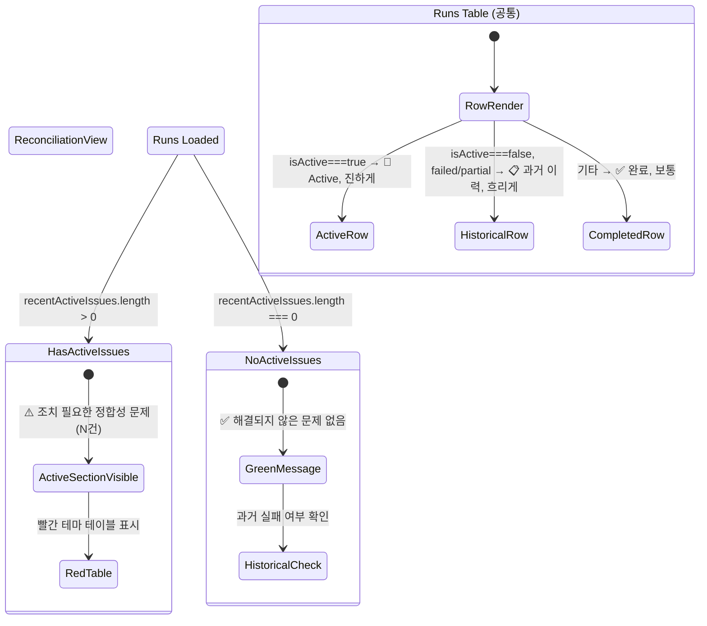
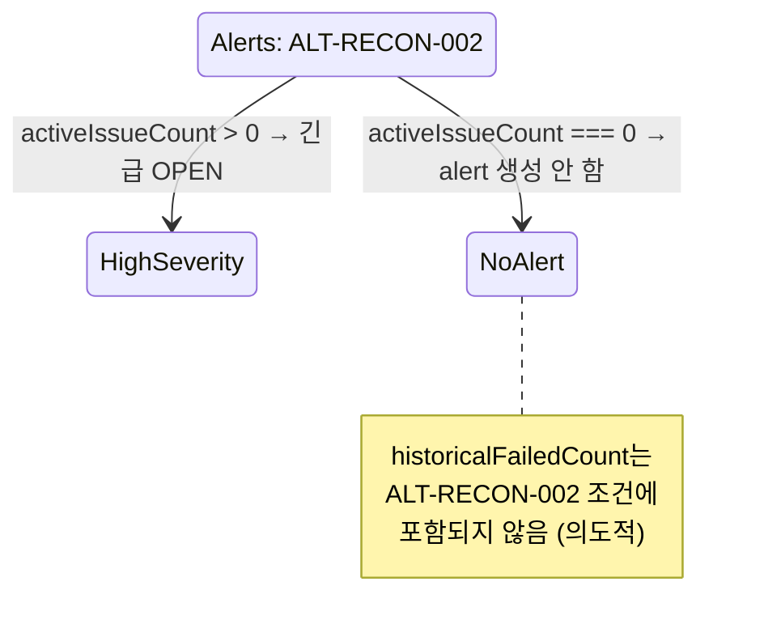

# Historical Failed Reconciliation Run UI 표시 정책 마감 — 설계 문서

**작성일**: 2026-05-25  
**목표**: 운영자가 historical failed reconciliation run을 active issue로 오인하지 않도록 UI 표시 정책을 최종 조정한다.  
**범위**: 표시 정책만 개선 (DB 삭제/만료 작업 아님)

---

## 1. 현재 UI 상태 분석

### 1.1 ReconciliationView.tsx

| 항목 | 현재 구현 상태 | 문제점 |
|------|---------------|--------|
| Active Issues 섹션 | `recentActiveIssues.length > 0`일 때만 표시. 헤더: `⚠️ 조치 필요 (N건)`. 빨간색 테마 테이블 | active issue가 **0**일 때 아무 메시지도 없음. `runsLocksLoading` 블록 안에서 아예 렌더링되지 않음 |
| Runs 테이블 `isActive` 컬럼 | 🔴 `Active` 배지 또는 회색 `—` | historical failed(`isActive=false`)가 `—`로만 표시되어 **"과거 이력"** 임을 인지하기 어려움 |
| `activeOnly` 필터 토글 | `🔴 Active Issues Only` 버튼 | 존재하나, "과거 이력"에 대한 설명이 테이블 상단에 없음 |
| runs 섹션 헤더 | `정합성 점검 실행` | 단순함. 과거 이력 참고용임을 암시하지 않음 |

### 1.2 OperationsDashboardView.tsx

| 항목 | 현재 구현 상태 | 문제점 |
|------|---------------|--------|
| WarningBanner | `d.activeIssueCount > 0 \|\| d.activeLocksCount > 0` 조건 — **historical failed는 무시** | ✅ 올바름. 변경 불필요 |
| StatusCard (정합성, feature-flagged) | `🟡 조치 필요 N건` + `과거 실패 N건` (회색) | active=0, historical>0일 때 positive 메시지가 아님 |
| main reconStatus 변수 (line 824) | `activeIssueCount>0 \|\| activeLocksCount>0` 기준 | ✅ 올바름. historical failed 제외 |
| 운영 경고 StatusCard | `deriveAlerts()` 기반 | ✅ ALT-RECON-002가 activeIssueCount 기준이므로 영향 없음 |

### 1.3 OperationsAlertsView.tsx + alerts.ts

| 항목 | 현재 구현 상태 | 문제점 |
|------|---------------|--------|
| ALT-RECON-002 | `activeIssueCount > 0` → `급급` | ✅ 유지 필요. 변경 불필요 |
| ALT-RECON-003 | 존재하지 않음 | ✅ historical failed만 있을 때 alert 생성 안 함 (의도된 동작) |
| `AlertRuleInput.reconSummary` | `historicalFailedCount` 필드 이미 존재함 | ✅ 타입은 준비되어 있으나 사용처 없음 |

### 1.4 types/api.ts

| 타입 | 상태 | 비고 |
|------|------|------|
| `ReconciliationRunSummary.isActive` | ✅ 이미 존재 | 변경 불필요 |
| `ReconciliationSummary.activeIssueCount` | ✅ 이미 존재 | 변경 불필요 |
| `ReconciliationSummary.historicalFailedCount` | ✅ 이미 존재 | 변경 불필요 |

### 1.5 reconciliation.py (API)

| 엔드포인트 | 상태 | 비고 |
|-----------|------|------|
| `GET /reconciliation/runs` | ✅ `is_active` 필드 반환 | 변경 불필요 |
| `GET /reconciliation/summary` | ✅ `active_issue_count`, `historical_failed_count` 계산 | 변경 불필요 |

---

## 2. 개선 항목 목록

### [A] ReconciliationView — Active Issues 섹션

**Rationale**: active issue가 0일 때 빈 화면이 아닌 positive 메시지를 보여줘야 운영자가 "아무것도 없다 = 정상"임을 확신할 수 있다.

#### A-1. "조치 필요 없음" 메시지 추가
- **조건**: `recentActiveIssues.length === 0` AND runs 데이터 로딩 완료
- **표시**: 빨간색 테이블 대신 초록색 `✅` 아이콘 + 메시지
- **문구**: `"✅ 현재 해결되지 않은 정합성 문제가 없습니다. 과거 실패 이력은 아래에서 확인할 수 있습니다."`
- **위치**: Active Issues 섹션이 있던 자리 (기존 `recentActiveIssues.length > 0` 조건 블록 직후, else 분기)

#### A-2. Active Issues 섹션 헤더 변경 (기존 유지, 문구만 개선)
- 현재: `⚠️ 조치 필요 (N건)`
- 변경: `⚠️ 조치 필요한 정합성 문제` (N건 표시는 유지)
- **Rationale**: "조치 필요"만으로는 무엇을 조치해야 하는지 모호함. "정합성 문제"를 추가

### [B] ReconciliationView — Runs 테이블

**Rationale**: historical failed run이 단순히 `—`로 표시되어 "과거 이력" 인지가 어려움. 시각적 차별화가 필요.

#### B-1. "📋 과거 이력" 배지 추가
- **조건**: `isActive === false` AND `status in ('failed', 'partial')`
- **기존 `isActive` 컬럼**: 
  - active: `🔴 Active` (유지)
  - historical failed: `📋 과거 이력` (신규, 회색 배경)
  - completed/success: `✅ 완료` (신규, 초록색)
- **Rationale**: 세 가지 상태를 명확히 구분. 운영자가 active만 집중하고 나머지는 참고용으로 인지

#### B-2. Historical failed 행 흐리게 표시
- **조건**: `isActive === false` AND `status in ('failed', 'partial')`
- **스타일**: `opacity-50` 또는 `text-[#94a3b8]`로 흐리게
- **단**, row click은 가능해야 함 (상세 패널 열기 위해)
- **Rationale**: 시각적 계층 구조를 만들어 active run에 주의가 집중되도록 함

#### B-3. `isActive` 컬럼 헤더 변경
- 현재: `Active`
- 변경: `유형`
- **Rationale**: "Active"라는 단어는 true/false 이분법을 강조. "유형"은 세 가지 상태를 포괄

#### B-4. 테이블 상단 필터 설명 추가
- **위치**: 필터 pills 아래, DataTable 위
- **문구**: `"🔴 Active: 조치 필요 / 📋 과거 이력: 참고용 (연결 주문 정리됨) / ✅ 완료: 정상"`
- **Rationale**: 각 상태의 의미를 명확히 전달

### [C] ReconciliationView — 설명 문구 (Explanatory Copy)

#### C-1. Active Issues 섹션 설명
- **위치**: active issues 테이블 상단 또는 섹션 헤더 아래
- **문구**: `"⚠️ 이 정합성 run은 아직 해결되지 않은 주문과 연결되어 있습니다."`
- **Rationale**: active issue의 의미를 명시

#### C-2. Run Detail 패널 설명
- **조건**: 선택된 run이 historical failed인 경우
- **문구**: `"📋 이 run의 연결 주문은 모두 정리되었습니다. 감사 이력으로만 참고하세요."`
- **Rationale**: 상세 패널에서도 historical failed 임을 명시

### [D] Dashboard — StatusCard 개선

**Rationale**: active issue 0 + historical failed > 0일 때 positive 메시지 필요.

#### D-1. 정합성 StatusCard 메시지 개선
- 현재 (feature-flagged): `🟡 조치 필요 N건` + `과거 실패 N건`
- **변경 (조건부)**:
  - `activeIssueCount > 0`: 현재와 동일 (`🟡 조치 필요 N건`)
  - `activeIssueCount === 0 && historicalFailedCount > 0`: `"✅ 정합성 양호 (과거 실패 M건)"`
  - `activeIssueCount === 0 && historicalFailedCount === 0`: `"✅ 정합성 양호"`
- **Rationale**: 양수/음수 구분 없이 "과거 실패 M건"만 표시되면 운영자가 불안해할 수 있음. positive 메시지로 리프레임

### [E] Alerts — 정책 결정 (변경 없음, 명시적 기록)

**Rationale**: 현재 구현이 이미 올바른 정책을 반영하고 있음을 문서화.

#### E-1. ALT-RECON-002 유지
- 현재 `activeIssueCount > 0` → `급급` : ✅ 유지
- 변경 사항 없음

#### E-2. ALT-RECON-003 신설하지 않음
- historical failed만 존재할 때 alert 생성 ❌
- **Rationale**: 
  - Noise 최소화: historical failed는 감사 이력일 뿐 조치가 필요하지 않음
  - 운영자가 불필요한 alert에 둔감해지는 현상 방지 (alert fatigue)
  - 필요한 정보는 ReconciliationView에서 직접 확인 가능

### [F] API / 타입 / alerts.ts — 변경 불필요

| 파일 | 이유 |
|------|------|
| `reconciliation.py` | 이미 `is_active`, `active_issue_count`, `historical_failed_count` 정확히 계산 |
| `types/api.ts` | 모든 필요 타입 이미 존재 |
| `alerts.ts` | ALT-RECON-002 로직 정확함. 신규 규칙 불필요 |

---

## 3. 실행 계획 (Subtask 단위)

```
[F-] 사전 확인 / 변경 불필요 파일 검증 (reconciliation.py, types/api.ts, alerts.ts)
  → 변경 없음, 분석 결과 문서화만 수행

[A-1] ReconciliationView: active issue 0일 때 "문제 없음" 메시지 추가
  - 파일: admin_ui/src/components/ReconciliationView.tsx
  - recentActiveIssues.length === 0 조건 분기 추가
  - 초록색 ✅ + 설명 메시지 렌더링
  - 위치: 기존 recentActiveIssues.length > 0 블록 바로 아래 (else)

[A-2] ReconciliationView: Active Issues 섹션 헤더 문구 개선
  - 파일: admin_ui/src/components/ReconciliationView.tsx
  - 헤더: `⚠️ 조치 필요 (${recentActiveIssues.length}건)` → `⚠️ 조치 필요한 정합성 문제`

[B-1] ReconciliationView: isActive 컬럼에 "📋 과거 이력" / "✅ 완료" 배지 추가
  - 파일: admin_ui/src/components/ReconciliationView.tsx
  - runColumns의 isActive render 함수 수정
  - 조건: isActive===true → 🔴 Active
  - 조건: isActive===false && status in ('failed','partial') → 📋 과거 이력 (회색)
  - 조건: 그 외 (completed 등) → ✅ 완료 (초록색)

[B-2] ReconciliationView: historical failed 행 흐리게 표시
  - 파일: admin_ui/src/components/ReconciliationView.tsx
  - DataTable의 rowClassName 또는 tr 스타일 커스터마이징
  - filteredRuns 기준으로 행 클래스 추가

[B-3] ReconciliationView: isActive 컬럼 헤더 "Active" → "유형"
  - 파일: admin_ui/src/components/ReconciliationView.tsx
  - runColumns의 header 값 변경

[B-4] ReconciliationView: 테이블 상단 필터 설명 추가
  - 파일: admin_ui/src/components/ReconciliationView.tsx
  - 필터 pills 아래 span/div 추가
  - 유형별 아이콘 범례 표시

[C-1] ReconciliationView: Active Issues 섹션 설명 문구 추가
  - 파일: admin_ui/src/components/ReconciliationView.tsx
  - active issues 테이블 상단에 설명 문구 렌더링

[C-2] ReconciliationView: Run Detail 패널에 historical failed 설명 추가
  - 파일: admin_ui/src/components/ReconciliationView.tsx
  - selectedRun 조건 분석 후 isActive+status 기반 설명 표시

[D-1] Dashboard: StatusCard 메시지 조건부 개선
  - 파일: admin_ui/src/components/OperationsDashboardView.tsx
  - SHOW_ADVANCED_OPERATION_CARDS 블록 내 정합성 StatusCard
  - activeIssueCount/historicalFailedCount 조건 분기

[E] Alerts: 변경 없음 확인 및 문서 반영
  - 파일: 관련 없음 (정책 결정만)
```

### 작업 순서 (권장)

1. **[F]** 사전 확인 (변경 불필요 파일 검증) — 0분
2. **[B-3]** 컬럼 헤더 "Active" → "유형" — 2분
3. **[B-1]** isActive 컬럼 배지 3종으로 확장 — 5분
4. **[B-2]** historical failed 행 흐리게 — 3분
5. **[B-4]** 테이블 상단 필터 설명 — 3분
6. **[A-2]** Active Issues 헤더 문구 개선 — 1분
7. **[A-1]** active issue 0일 때 메시지 추가 — 5분
8. **[C-1]** Active Issues 설명 문구 — 2분
9. **[C-2]** Run Detail 패널 설명 — 3분
10. **[D-1]** Dashboard StatusCard 개선 — 3분

---

## 4. UI 상태 천이 다이어그램



```mermaid
stateDiagram-v2
    state "Dashboard WarningBanner" as WB
    state "Dashboard StatusCard" as SC
    
    WB --> ShowWarning: activeIssueCount>0 || activeLocksCount>0
    WB --> HideWarning: activeIssueCount===0 && activeLocksCount===0
    
    SC --> ActivePositive: activeIssueCount===0, historicalFailedCount===0
    SC --> ActiveWithHistory: activeIssueCount===0, historicalFailedCount>0
    SC --> IssuesPresent: activeIssueCount>0
    
    ActivePositive --> "✅ 정합성 양호"
    ActiveWithHistory --> "✅ 정합성 양호 (과거 실패 M건)"
    IssuesPresent --> "🟡 조치 필요 N건"
```



---

## 5. 테스트 계획

### 5.1 시나리오 기반 테스트

| # | 시나리오 | 기대 동작 | 적용 컴포넌트 |
|---|---------|-----------|-------------|
| T1 | active issues 3건, historical failed 2건 | Active Issues 섹션 빨간 테이블 표시. runs 테이블에 🔴 3 + 📋 2 혼재 | ReconciliationView |
| T2 | active issues 0건, historical failed 2건 | ✅ 메시지 + runs 테이블에 📋 2건. WarningBanner 미표시 | ReconciliationView, Dashboard |
| T3 | active issues 0건, historical failed 0건 | ✅ 메시지 + runs 테이블. WarningBanner 미표시 | ReconciliationView, Dashboard |
| T4 | 모든 run completed (isActive=false, status=completed) | ✅ 완료 배지. 흐리게 표시 안 함 | ReconciliationView |
| T5 | API 에러 (runs 로딩 실패) | ErrorBanner 표시. ✅ 메시지 미표시 (loading state 보호) | ReconciliationView |
| T6 | Dashboard: active=0, historical=3 | WarningBanner 없음. StatusCard: "✅ 정합성 양과 (과거 실패 3건)" | Dashboard |
| T7 | Dashboard: active=2 | WarningBanner: "🟡 2건 조치 필요". StatusCard: "🟡 조치 필요 2건" | Dashboard |
| T8 | Alerts: active issues 1건 | ALT-RECON-002 긴급 OPEN | AlertsView |
| T9 | Alerts: active 0, historical 3 | ALT-RECON-002 생성 안 함. ALT-OK-001 정보 표시 | AlertsView |

### 5.2 단위 테스트

| # | 테스트 대상 | 테스트 내용 | 파일 |
|---|-----------|-----------|------|
| UT1 | `recentActiveIssues.length === 0` 분기 | ✅ 메시지 렌더링 확인 | ReconciliationView.test.tsx |
| UT2 | isActive 배지 3종 조건 | 각 조건별 올바른 className/텍스트 | ReconciliationView.test.tsx |
| UT3 | historical failed 행 스타일 | opacity 클래스 적용 확인 | ReconciliationView.test.tsx |
| UT4 | Dashboard StatusCard 조건 분기 | 3가지 상태별 메시지 확인 | DashboardView.test.tsx |
| UT5 | ALT-RECON-002 historical failed 무시 | activeIssueCount=0, historical>0 → alert 없음 | alerts.test.ts |

### 5.3 회귀 테스트

| # | 기존 동작 | 변경 후 영향 |
|---|----------|-----------|
| R1 | active issues 있을 때 Active Issues 섹션 표시 | 변화 없음 (조건 동일) |
| R2 | active issues 없을 때 섹션 미표시 | 변화: ✅ 메시지로 대체 |
| R3 | runs 테이블 isActive 컬럼 | 변화: 2값 → 3값 배지 |
| R4 | Dashboard WarningBanner 조건 | 변화 없음 |
| R5 | ALT-RECON-002 alert 생성 조건 | 변화 없음 |

---

## 6. 변경 요약 (Diff Scope)

### 수정 파일

| 파일 | 변경 유형 | 예상 라인 수 |
|------|----------|------------|
| `admin_ui/src/components/ReconciliationView.tsx` | **수정** | ~80줄 (조건 분기 + 배지 + 스타일 + 설명) |
| `admin_ui/src/components/OperationsDashboardView.tsx` | **수정** | ~10줄 (StatusCard 메시지 조건 분기) |

### 변경 불필요 파일

| 파일 | 이유 |
|------|------|
| `admin_ui/src/components/OperationsAlertsView.tsx` | 변경 불필요 (alert 정책 유지) |
| `admin_ui/src/lib/alerts.ts` | 변경 불필요 (ALT-RECON-002 로직 정확) |
| `admin_ui/src/types/api.ts` | 변경 불필요 (모든 타입 이미 존재) |
| `src/agent_trading/api/routes/reconciliation.py` | 변경 불필요 (API 로직 정확) |

---

## 7. Q&A (사용자 질문에 대한 답변 요약)

### Q1. historical failed를 지금 화면에서 어떻게 보여주는 것이 가장 적절한가?

**답변**: 세 가지 시각적 장치를 추가:
1. runs 테이블 `isActive` 컬럼에서 `—` 대신 `📋 과거 이력` 배지 (회색)
2. historical failed 행에 `opacity` 적용으로 시각적 계층화
3. 테이블 상단 범례 설명으로 각 상태 의미 명시

### Q2. active issue가 0일 때 historical failed만 있으면 어떤 경고/배지/문구를 보여야 하는가?

**답변**:
- WarningBanner: 표시하지 않음 (현재 유지)
- StatusCard: `"✅ 정합성 양호 (과거 실패 M건)"` — positive 프레이밍
- ReconciliationView 상단: `"✅ 현재 해결되지 않은 정합성 문제가 없습니다. 과거 실패 이력은 아래에서 확인할 수 있습니다."`

### Q3. Alerts에서 historical failed는 완전히 무시할지, info 수준으로 남길지?

**답변**: **완전히 무시** (noise 최소화).
- ALT-RECON-002 (active issue → 긴급): 유지
- ALT-RECON-003 신설하지 않음
- historical failed만 있으면 alert를 생성하지 않아 alert fatigue 방지
- 필요한 정보는 ReconciliationView에서 직접 조회

### Q4. 운영자가 오해하지 않게 어떤 설명 문구가 필요한가?

**답변**:
- Active Issues 섹션 헤더: `"⚠️ 조치 필요한 정합성 문제"`
- Active Issues 설명: `"⚠️ 이 정합성 run은 아직 해결되지 않은 주문과 연결되어 있습니다."`
- Historical failed 배지: `"📋 과거 이력"`
- Historical failed 설명 (상세 패널): `"📋 이 run의 연결 주문은 모두 정리되었습니다. 감사 이력으로만 참고하세요."`
- 완료 배지: `"✅ 완료"`
- 테이블 상단 범례: `"🔴 Active: 조치 필요 / 📋 과거 이력: 참고용 / ✅ 완료: 정상"`
