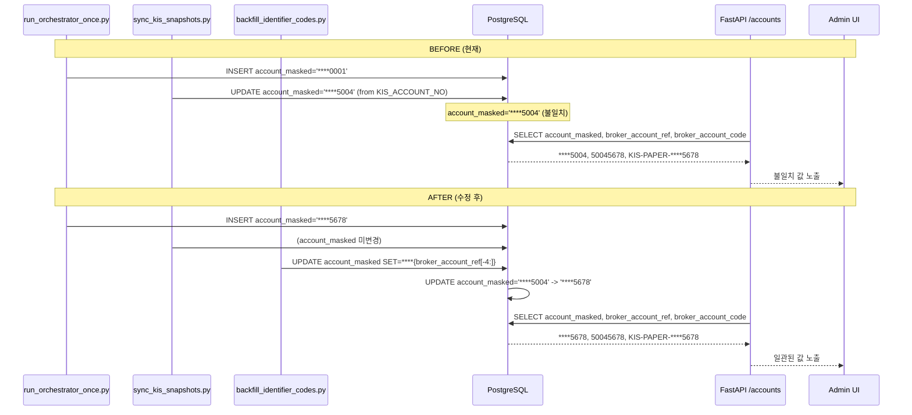

# `account_masked` 정합성 수정 계획

> **보정사항 반영** (2026-05-08):
> 1. `broker_account_ref`가 비어 있거나 4자리 미만인 경우 fallback 규칙을 명시
> 2. backfill은 NULL 또는 불일치 row만 갱신하는 idempotent 조건으로 처리

## 1. 현재 상태 분석

### DB 현재값 (1 row)

| 컬럼 | 값 |
|------|-----|
| `accounts.account_masked` | `****5004` |
| `broker_accounts.account_ref` | `50045678` |
| `broker_accounts.broker_account_code` | `KIS-PAPER-****5678` |

### 불일치

- `broker_account_code` = `KIS-PAPER-****5678` → 마지막 4자리 = `5678` (``account_ref``의 last 4)
- `account_masked` = `****5004` → 마지막 4자리 = `5004` (실제 KIS 계좌번호의 last 4)
- **두 값이 서로 다른 계좌번호를 가리키고 있음**

### `account_masked` 갱신 경로 (2개)

1. **Seed 경로** (`run_orchestrator_once.py:113`, test `_seed_if_empty:139,147`)
   - 정적 값 `"****0001"` 사용 — `broker_account_ref`와 무관
   - 초기 1회만 실행, 이후에는 `skip`

2. **Sync 경로** (`kis_snapshot_sync.py:116-131`)
   - `sync_kis_account_snapshots()`가 매 실행 시 `rest_client.account_number`(실제 KIS 계좌번호)로 `account_masked`를 덮어씀
   - `_mask_account_number()` → `"****{last4}"`
   - 이것이 DB에 `****5004`가 저장된 원인

### `backfill_identifier_codes.py`

- 현재 `broker_account_code`와 `account_code`만 backfill
- `account_masked`는 건드리지 않음

### Test fixture (`conftest.py:76`)

- `account_masked = "****5678"` — 이미 올바름 (``broker_account_ref``의 last 4)

---

## 2. Authoritative Source 결정

### 생성 규칙 (fallback 포함)

```
account_masked =
    "****" + RIGHT(only_digits(broker_account_ref), 4)
    단, broker_account_ref가 NULL 또는 빈 문자열 → "****0000"
    단, 숫자가 하나도 없음 → "****0000"
    단, 숫자가 4개 미만 → "****" + LPAD(숫자, 4, '0')
```

예시:
| broker_account_ref | account_masked | 설명 |
|---|---|---|
| `50045678` | `****5678` | 정상 케이스 |
| `""` (empty) | `****0000` | fallback |
| `NULL` | `****0000` | fallback |
| `ABC` (no digits) | `****0000` | fallback |
| `12` (2 digits) | `****0012` | zero-padded |

이 규칙은 [`scripts/backfill_identifier_codes.py`](/scripts/backfill_identifier_codes.py)에서 `broker_account_code` 생성 시 사용하는 것과 동일한 규칙이다.

**`account_masked`의 authoritative source = `broker_account_ref`의 마지막 4자리**

```
account_masked = "****" + broker_account_ref[-4:]
```

### 근거

1. **`broker_account_code`와의 정합성**: `broker_account_code`(`KIS-PAPER-****5678`)는 이미 `broker_account_ref`(`50045678`)에서 파생됨. `account_masked`도 동일한 기준을 사용해야 일관성이 확보됨.
2. **`broker_account_code`와 `account_masked`는 같은 계좌 신원(Identity)을 표시**: `account_ref`는 이 계좌의 브로커 측 식별자이므로, 두 필드가 같은 계좌번호를 가리켜야 함.
3. **KIS 계좌번호는 인증 파라미터일 뿐**: `settings.kis_account_number`는 환경 변수일 뿐이며, 계좌 identity의 기준이 아님. 브로커 계좌의 identity는 `broker_accounts.account_ref`가 유일한 기준.

### 영향

| 항목 | 현재값 | 수정후 |
|------|--------|--------|
| `account_masked` (DB) | `****5004` | `****5678` |
| `account_masked` (seed) | `****0001` | `****5678` |
| `account_masked` (test fixture) | `****5678` | (변경 없음 — 이미 올바름) |
| `broker_account_code` | `KIS-PAPER-****5678` | (변경 없음) |

---

## 3. 변경 파일 및 상세 수정 사항

### 3.1 [`scripts/run_orchestrator_once.py:113`](/scripts/run_orchestrator_once.py:113)

```python
# BEFORE
account_masked="****0001",
# AFTER
account_masked="****5678",
```

### 3.2 [`tests/integration/test_orchestrator_entrypoint.py:139,147`](/tests/integration/test_orchestrator_entrypoint.py:139)

두 곳(upsert branch line 139, non-upsert branch line 147) 모두 변경:

```python
# BEFORE
"****0001"
# AFTER
"****5678"
```

### 3.3 [`src/agent_trading/services/kis_snapshot_sync.py:116-131`](/src/agent_trading/services/kis_snapshot_sync.py:116)

**`account_masked` 업데이트 로직 제거**

- `sync_kis_account_snapshots()` 함수가 `account_masked`를 KIS 계좌번호로 업데이트하는 부분을 삭제
- `account_repo` 파라미터도 불필요해지므로 Optional 파라미터 목록에서 제거
- `SyncResult.dataclass`에서 `account_masked_updated` 카운터도 제거

```python
# REMOVE entire block (lines 116-131):
# ── 0. Update account_masked from KIS account number ──────────────
if account_repo is not None:
    try:
        raw_acct_no = rest_client.account_number.strip()
        if raw_acct_no:
            masked = _mask_account_number(raw_acct_no)
            existing = await account_repo.get(account_id)
            if existing is not None and existing.account_masked != masked:
                await account_repo.update_metadata(
                    account_id,
                    account_masked=masked,
                )
                result._incr("account_masked_updated")
    except Exception as exc:
        logger.warning("Failed to update account_masked: %s", exc)
        result._add_error(f"account_masked update failed: {exc}")
```

**변경 영향**:
- `_mask_account_number()` 함수도 더 이상 사용되지 않음 — 유지해도 무방하지만 필요 시 제거

### 3.4 [`scripts/sync_kis_snapshots.py`](/scripts/sync_kis_snapshots.py:100)

- `account_repo=repos.accounts` 인자 제거 (더 이상 필요 없음)
- summary 출력에서 `result.account_masked_updated` 줄 제거

### 3.5 [`scripts/backfill_identifier_codes.py`](/scripts/backfill_identifier_codes.py)

**`account_masked` backfill 함수 추가**

새로운 SQL + 함수를 추가하여 `account_masked`가 `broker_account_ref`와 불일치하는 row를 수정:

```sql
UPDATE trading.accounts a
SET account_masked = '****' || 
    CASE
        WHEN LENGTH(REGEXP_REPLACE(ba.account_ref, '[^0-9]', '', 'g')) >= 4
        THEN RIGHT(REGEXP_REPLACE(ba.account_ref, '[^0-9]', '', 'g'), 4)
        ELSE LPAD(REGEXP_REPLACE(ba.account_ref, '[^0-9]', '', 'g'), 4, '0')
    END
FROM trading.broker_accounts ba
WHERE a.broker_account_id = ba.broker_account_id
  AND a.account_masked IS DISTINCT FROM
    ('****' || 
    CASE
        WHEN LENGTH(REGEXP_REPLACE(ba.account_ref, '[^0-9]', '', 'g')) >= 4
        THEN RIGHT(REGEXP_REPLACE(ba.account_ref, '[^0-9]', '', 'g'), 4)
        ELSE LPAD(REGEXP_REPLACE(ba.account_ref, '[^0-9]', '', 'g'), 4, '0')
    END)
```

### 3.6 [`tests/services/test_kis_snapshot_sync.py`](/tests/services/test_kis_snapshot_sync.py)

- `account_masked` 업데이트 테스트 케이스가 있다면 제거 또는 수정

### 3.7 [`admin_ui/src/types/api.ts`](/admin_ui/src/types/api.ts)

- 변경 불필요 (API 스키마는 동일)

### 3.8 [`src/agent_trading/api/schemas.py`](/src/agent_trading/api/schemas.py)

- 변경 불필요 (`AccountSummary.account_masked` 필드 유지)

---

## 4. DB Row 수정 (직접 실행)

기존 row 1건의 `account_masked`를 수정:

```sql
UPDATE trading.accounts
SET account_masked = '****5678'
WHERE account_id = '33333333-3333-3333-3333-333333333333';
```

---

## 5. 검증

### 5.1 `/accounts` API 응답 확인

```bash
curl -s "http://localhost:8000/accounts?client_id=11111111-1111-1111-1111-111111111111" | python -m json.tool
```

기대값:
```json
{
  "account_masked": "****5678",
  "broker_account_ref": "50045678",
  "broker_account_code": "KIS-PAPER-****5678"
}
```

### 5.2 Accounts UI 확인

- Account # 열에 `KIS-PAPER-****5678` 표시
- Detail panel의 Account # 필드에 `****5678` 표시
- Detail panel의 Broker Code에 `KIS-PAPER-****5678` 표시
- Detail panel의 Broker Ref에 `50045678` 표시

### 5.3 테스트 실행

```bash
# 기존 테스트가 sync의 account_masked update에 의존하는지 확인
pytest tests/services/test_kis_snapshot_sync.py -v --no-header
pytest tests/integration/test_orchestrator_entrypoint.py -v --no-header
```

---

## 6. 변경 요약

| # | 파일 | 변경 내용 |
|---|------|-----------|
| 1 | `scripts/run_orchestrator_once.py` | seed `account_masked`: `****0001` → `****5678` |
| 2 | `tests/integration/test_orchestrator_entrypoint.py` | seed `account_masked`: `****0001` → `****5678` (2곳) |
| 3 | `src/agent_trading/services/kis_snapshot_sync.py` | `account_masked` 업데이트 로직 제거, `account_repo` 파라미터 제거 |
| 4 | `scripts/sync_kis_snapshots.py` | `account_repo` 인자 제거, summary 출력 정리 |
| 5 | `scripts/backfill_identifier_codes.py` | `account_masked` backfill 함수 추가 |
| 6 | `tests/services/test_kis_snapshot_sync.py` | 관련 테스트 수정/제거 |
| 7 | DB 직접 UPDATE | `account_masked`: `****5004` → `****5678` |

---

## 7. 수정 전/후 비교

### 수정 전 (현재)
```
broker_account_ref  = 50045678
broker_account_code = KIS-PAPER-****5678
account_masked      = ****5004     ← 불일치
```

### 수정 후
```
broker_account_ref  = 50045678
broker_account_code = KIS-PAPER-****5678
account_masked      = ****5678     ← 일치!
```

---

## 8. Sequence Diagram


