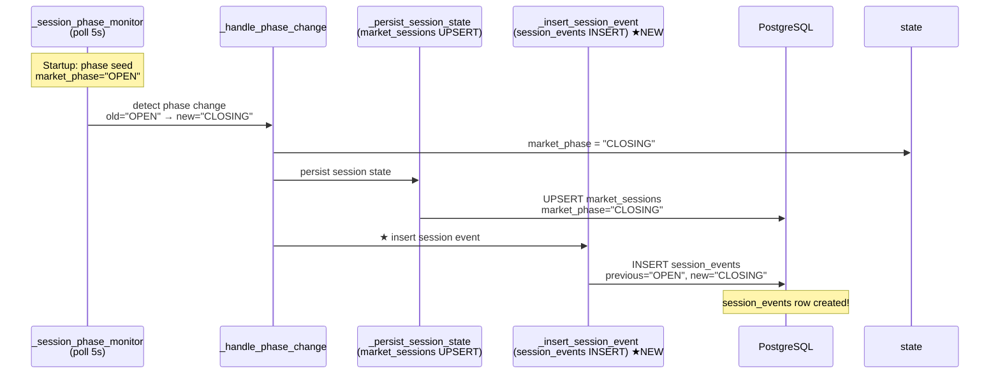

# ops-scheduler market_phase / session_events 기록 누락 원인 분석 및 수정 계획

## 1. 문제 요약

### 증상
| 증상 | 현황 | 원인 |
|------|------|------|
| `trading.market_sessions.market_phase` | 항상 `NULL` | 초기 phase seed 누락 + 첫 persist 시점 race condition |
| `trading.session_events` | 0건 | `_handle_phase_change()`가 `session_events` INSERT를 전혀 호출하지 않음 |
| `/market-sessions/events/recent` API | `"data": []` 반환 | 데이터 자체가 없으므로 UI가 "No events yet" 표시 |

---

## 2. 상세 원인 분석

### 2.1 `market_phase`가 NULL인 이유

#### 원인 ①: Scheduler startup 시 phase seed(초기값) 설정 누락

[`scripts/run_ops_scheduler.py:1382`](scripts/run_ops_scheduler.py:1382)
```python
state = SchedulerState(run_date=run_date)
```
`SchedulerState`의 [`market_phase` 필드는 `None`](scripts/run_ops_scheduler.py:196)으로 초기화된다.

#### 원인 ②: 첫 persist가 phase monitor의 첫 poll보다 먼저 실행됨 (race condition)

[`_run_scheduler()`의 startup sequence](scripts/run_ops_scheduler.py:1371):

```
1. state = SchedulerState(run_date=run_date)         # market_phase = None
2. market_state_provider = await _init_market_state_provider()   # WS 연결
3. session_provider = await _init_session_provider(...)
4. phase_monitor_task = asyncio.create_task(           # 백그라운드 task 생성
       _session_phase_monitor(state, ...)              # 아직 실행되지 않음
   )
5. heartbeat_task = asyncio.create_task(...)
6. Main loop 진입 (또는 --once: 즉시 첫 persist)
```

`_session_phase_monitor`의 첫 poll까지 최소 5초([`poll_interval=5`](scripts/run_ops_scheduler.py:1251))가 소요되는 반면, `--once` 모드에서는 phase monitor가 poll하기 **전에** [`_persist_session_state()`](scripts/run_ops_scheduler.py:1465-1466)가 호출된다.

연속 모드에서도 phase monitor가 phase change를 최초로 감지(`None → "OPEN"`)하여 [`_handle_phase_change()`](scripts/run_ops_scheduler.py:1274)를 호출하기 전까지는 `state.market_phase`가 `None`이다.

### 2.2 `session_events`가 0건인 이유

#### 원인 ③: `_handle_phase_change()`가 `session_events` INSERT를 누락

[`_handle_phase_change()`](scripts/run_ops_scheduler.py:1207-1244)는 phase change 발생 시:
1. `state.market_phase = new_phase` 설정 (✅)
2. `state.last_phase_change = now` 설정 (✅)
3. `_persist_session_state(state, dsn)` 호출 — `market_sessions` UPSERT (✅)
4. **`session_events` INSERT — 누락 (❌)**

`_handle_phase_change()`는 [`_persist_session_state()`](scripts/run_ops_scheduler.py:1244)만 호출할 뿐, `trading.session_events` 테이블에 **절대 INSERT하지 않는다**.

#### Repository 메서드는 구현되어 있지만 사용되지 않음

[`PostgresMarketSessionRepository.add_event()`](src/agent_trading/repositories/postgres/market_sessions.py:94-111)는 `session_events` INSERT를 올바르게 구현하고 있지만:
- Scheduler는 이 Repository를 사용하지 않음
- Scheduler는 [`_persist_session_state()`](scripts/run_ops_scheduler.py:1135)에서 직접 `asyncpg` connection + raw SQL로 `market_sessions` UPSERT만 수행

### 2.3 `SessionEventEntity`와 테이블 구조 — 변경 불필요

| 엔티티/테이블 | 현재 구조 | 변경 필요? |
|---|---|---|
| [`SessionEventEntity`](src/agent_trading/domain/entities.py:501-516) | `market_session_id`, `previous_phase`, `new_phase`, `trigger_source`, `metadata` | ❌ |
| [`session_events` 테이블](db/migrations/0014_add_market_session_tables.sql:57-68) | 동일 컬럼 + FK + indexes | ❌ |

모든 필요한 컬럼이 이미 존재하므로 **새로운 DB migration은 필요하지 않다**.

---

## 3. 수정 대상 파일 및 구체적 변경 사항

### 파일 ①: `scripts/run_ops_scheduler.py`

#### 변경 A: `_handle_phase_change()`에 `session_events` INSERT 추가

**위치**: [`scripts/run_ops_scheduler.py:1207-1244`](scripts/run_ops_scheduler.py:1207)

**변경 내용**:
- `_handle_phase_change()`에서 `_persist_session_state()` 호출 후 (또는 동시에) `session_events` INSERT 수행
- 직접 `asyncpg` connection을 사용하여 `INSERT INTO trading.session_events (...) VALUES (...)` 실행
- `state.session_db_id`가 `None`이면 `_persist_session_state()`를 먼저 호출하여 `session_db_id`를 확보한 후 INSERT

**의사코드**:
```python
async def _handle_phase_change(state, old_phase, new_phase, dsn=None):
    now = datetime.now(KST)
    state.market_phase = new_phase
    state.last_phase_change = now
    
    # ... logging logic (기존 유지) ...
    
    # Persist session state to DB (기존 — market_sessions UPSERT)
    await _persist_session_state(state, dsn)
    
    # ★ NEW: session_events INSERT
    if dsn and state.session_db_id is not None:
        await _insert_session_event(state, dsn, old_phase, new_phase)
```

#### 변경 B: `_insert_session_event()` 함수 신규 작성

**위치**: [`scripts/run_ops_scheduler.py`](scripts/run_ops_scheduler.py:1135) 근처 (`_persist_session_state` 옆)

**신규 함수**:
```python
async def _insert_session_event(
    state: SchedulerState,
    dsn: str | None,
    old_phase: str | None,
    new_phase: str,
) -> None:
    """Insert a phase-change event into the session_events table."""
    if dsn is None or state.session_db_id is None:
        return
    try:
        import asyncpg
        conn = await asyncpg.connect(dsn=dsn)
        try:
            await conn.execute(
                """INSERT INTO trading.session_events
                   (market_session_id, previous_phase, new_phase,
                    trigger_source, metadata, occurred_at)
                   VALUES ($1, $2, $3, $4, $5, $6)""",
                state.session_db_id,
                old_phase,
                new_phase,
                "scheduler_phase_monitor",
                None,
                datetime.now(KST),
            )
        finally:
            await conn.close()
    except Exception:
        logger.exception("Failed to insert session event to DB")
```

#### 변경 C: Scheduler startup 시 phase 초기화 (seed)

**위치**: [`scripts/run_ops_scheduler.py:1382`](scripts/run_ops_scheduler.py:1382) 근처 (state 생성 직후)

**변경 내용**:
- `_session_phase_monitor` task를 생성하기 **전에** 한 번 `market_state_provider.get_current_state()`를 호출하여 현재 phase를 fetch
- `state.market_phase`에 즉시 설정
- 만약 provider가 없거나 실패하면 `None` 유지 (기존 동작)

**의사코드**:
```python
# P2: Initialize 163 WebSocket market state provider
market_state_provider = await _init_market_state_provider()

# ★ NEW: Seed initial market phase on startup
if market_state_provider is not None and market_state_provider.is_connected:
    try:
        initial_state = await market_state_provider.get_current_state()
        state.market_phase = initial_state.phase.value
        state.last_phase_change = datetime.now(KST)
        logger.info(
            "Initial market phase seeded: %s",
            state.market_phase,
        )
    except Exception:
        logger.debug("Could not seed initial market phase (will be set by monitor)", exc_info=True)
```

**효과**:
- 첫 `_persist_session_state()` 호출 시 `market_phase`가 `None`이 아닌 실제 phase로 저장됨
- phase monitor의 첫 poll 전에도 유효한 phase 값 보유
- `_handle_phase_change()`가 첫 poll에서 호출될 때 `old_phase`가 `None`이 아닌 실제 seed 값이 되어, 의미 있는 `session_events` row가 생성됨

#### 변경 D: `_session_phase_monitor`의 첫 poll 로직 개선 (선택적)

**위치**: [`scripts/run_ops_scheduler.py:1267`](scripts/run_ops_scheduler.py:1267)

`old_phase`가 seed 값과 같으면 첫 poll에서 `_handle_phase_change()`가 skip되는 것이 정상이다. 즉시 phase change가 필요하지 않으며, 실제 phase change가 발생할 때만 event가 기록된다.

> **판단**: 변경 C(seed)만으로 충분. 변경 D는 불필요.

### 파일 ②: `src/agent_trading/repositories/postgres/market_sessions.py`

**변경 불필요**. `add_event()` 메서드가 이미 올바르게 구현되어 있다. 다만 scheduler가 이 Repository를 직접 사용하지 않으므로, 참고용으로 유지한다.

### 파일 ③: `src/agent_trading/domain/entities.py`

**변경 불필요**. `SessionEventEntity`와 `MarketSessionEntity` 모두 현재 구조로 충분하다.

### 파일 ④: `src/agent_trading/api/routes/sessions.py`

**변경 불필요**. API 엔드포인트는 올바르게 구현되어 있으며, 데이터만 정상적으로 쌓이면 정상 응답을 반환한다.

---

## 4. 새 DB migration 필요 여부

| 판단 | 사유 |
|------|------|
| **불필요** | `session_events` 테이블의 모든 컬럼(`market_session_id`, `previous_phase`, `new_phase`, `trigger_source`, `metadata`, `occurred_at`)이 이미 phase change 기록을 지원함 |

---

## 5. 데이터 흐름 (수정 후)



---

## 6. API 응답 변화

### `/market-sessions/latest`

| 필드 | 현재 | 수정 후 |
|------|------|---------|
| `data.market_phase` | `null` | `"OPEN"` (실제 phase) |
| `healthy` | `false` (stale) | `true` (fresh, phase 있음) |

### `/market-sessions/events/recent`

| 현재 | 수정 후 |
|------|---------|
| `{"status": "ok", "data": []}` | `{"status": "ok", "data": [{"id": 1, "previous_phase": null, "new_phase": "OPEN", ...}, ...]}` |

---

## 7. 테스트 전략

### 7.1 단위 테스트

| 테스트 대상 | 위치 | 테스트 내용 |
|------------|------|------------|
| `_handle_phase_change()`에 `session_events` INSERT | [`tests/scripts/test_run_ops_scheduler.py::TestHandlePhaseChange`](tests/scripts/test_run_ops_scheduler.py:736) | 기존 phase change 테스트에 `_insert_session_event` mock 호출 검증 추가 |
| `_insert_session_event()` 함수 | `tests/scripts/test_run_ops_scheduler.py` (신규 클래스) | - DSN 없을 때 skip<br>- `session_db_id`가 `None`이면 skip<br>- 실제 SQL 실행 검증 (mock asyncpg) |
| Startup phase seed | `tests/scripts/test_run_ops_scheduler.py` (신규 테스트) | `_run_scheduler` startup 시 market_state_provider.get_current_state()가 호출되고 `state.market_phase`가 설정되는지 검증 |
| `_persist_session_state()`에 phase 포함 | [`tests/scripts/test_run_ops_scheduler.py::TestPersistSessionState`](tests/scripts/test_run_ops_scheduler.py:869) | `market_phase`가 SQL 파라미터로 전달되는지 검증 |

### 7.2 통합 테스트

| 테스트 | 방법 |
|--------|------|
| session_events 데이터 정합성 | `PostgresMarketSessionRepository.add_event()` + `get_events()` 호출 후 round-trip 검증 |
| API 응답 검증 | [`tests/api/test_sessions.py`](tests/api/test_sessions.py) 기존 테스트에서 session_events 데이터 mock 설정 후 응답 검증 |

### 7.3 smoke test

- `python3 scripts/run_ops_scheduler.py --once` 실행 후 DB 직접 조회:
  ```sql
  SELECT market_phase FROM trading.market_sessions ORDER BY checked_at DESC LIMIT 1;
  SELECT * FROM trading.session_events ORDER BY occurred_at DESC LIMIT 5;
  ```

---

## 8. 변경 요약

| # | 파일 | 변경 유형 | 설명 | 위험도 |
|---|------|-----------|------|--------|
| 1 | [`scripts/run_ops_scheduler.py`](scripts/run_ops_scheduler.py) | **수정** | `_handle_phase_change()`에 `session_events` INSERT 호출 추가 | 낮음 |
| 2 | [`scripts/run_ops_scheduler.py`](scripts/run_ops_scheduler.py) | **신규 함수** | `_insert_session_event()` — `session_events` INSERT 전담 | 낮음 |
| 3 | [`scripts/run_ops_scheduler.py`](scripts/run_ops_scheduler.py) | **수정** | Scheduler startup 시 phase seed (첫 poll 전에 현재 phase fetch) | 중간 (WS 의존) |
| 4 | [`scripts/run_ops_scheduler.py`](scripts/run_ops_scheduler.py) | **테스트** | 기존 `TestHandlePhaseChange`에 event INSERT mock 검증 추가 | 낮음 |
| 5 | [`tests/scripts/test_run_ops_scheduler.py`](tests/scripts/test_run_ops_scheduler.py) | **신규 테스트** | `_insert_session_event()` 단위 테스트 | 낮음 |
| 6 | [`tests/scripts/test_run_ops_scheduler.py`](tests/scripts/test_run_ops_scheduler.py) | **신규 테스트** | Startup phase seed 검증 | 낮음 |

### 제외 사항
- `db/migrations/` — 새 migration 불필요
- `src/agent_trading/repositories/postgres/market_sessions.py` — 변경 불필요 (기존 `add_event()` 유지)
- `src/agent_trading/domain/entities.py` — 변경 불필요
- `src/agent_trading/api/routes/sessions.py` — 변경 불필요
- `.env` — 수정 금지 (제약사항)

---

## 9. 실행 subtask 목록

1. **`_insert_session_event()` 신규 함수 작성** — `scripts/run_ops_scheduler.py`에 `_persist_session_state()` 근처에 추가
2. **`_handle_phase_change()` 수정** — `_persist_session_state()` 호출 후 `_insert_session_event()`를 호출하도록 변경
3. **Scheduler startup phase seed 로직 추가** — `market_state_provider.get_current_state()` 초기 호출 + `state.market_phase` 설정
4. **기존 `TestHandlePhaseChange` 테스트 수정** — `_insert_session_event` mock 호출 검증 추가
5. **신규 테스트: `_insert_session_event()` 단위 테스트** — DSN 없음, `session_db_id` 없음, 정상 경로
6. **신규 테스트: startup phase seed 검증** — `_run_scheduler` 초기화 시 phase 설정 확인
7. **smoke test 실행** — `--once` 모드로 DB 데이터 확인
