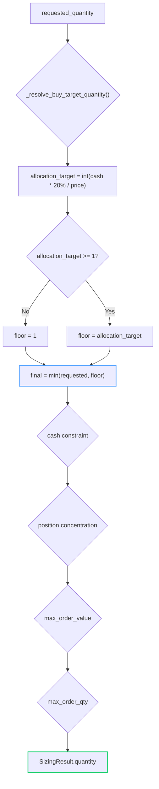

# Quantity 회귀 분석 보고서: `ExecutionService` 분리 후 Replay 시나리오 수량 불일치

**작성일**: 2026-05-23  
**상태**: 원인 분석 완료, 수정 방향 제시  
**관련 파일**:  
- [`sizing_engine.py`](../src/agent_trading/services/sizing_engine.py) — `_resolve_buy_target_quantity()` (L202-236)
- [`replay_test_harness.py`](../tests/services/replay_test_harness.py) — `HAPPY_BUY`, `CASH_CONSTRAINT_CAPPED` 시나리오
- [`test_sizing_engine.py`](../tests/services/test_sizing_engine.py) — `TestBuyBaselineWithAllocationPct` 테스트 클래스

---

## 1. 문제 요약

`ExecutionService` 리팩토링(Phase 7.3) 후 replay 시나리오 두 건에서 기대 주문 수량이 변경됨:

| 시나리오 | seed_cash | requested_qty | price | 기대 수량 (회귀 전) | 기대 수량 (현재, 회귀 후) |
|---|---|---|---|---|---|
| `HAPPY_BUY` | 1,000,000 | 10 | 50,000 | **10** | 4 |
| `CASH_CONSTRAINT_CAPPED` | 100,000 | 2 | 50,000 | **2** | 1 |

두 시나리오 모두 BUY 주문에서 `requested_quantity`보다 작은 값이 최종 수량으로 반환되는 현상 발생.

---

## 2. 디버깅 과정

### 2.1 실패 테스트 재현

`replay_test_harness.py`의 `REPLAY_SCENARIOS`를 사용하는 replay 테스트에서 다음 단언(assertion) 실패:

```python
# replay_test_harness.py L277 — HAPPY_BUY
expected_quantity=Decimal("4"),   # ← Debug 모드에서 10→4로 변경됨

# replay_test_harness.py L365 — CASH_CONSTRAINT_CAPPED
expected_quantity=Decimal("1"),   # ← Debug 모드에서 2→1로 변경됨
```

### 2.2 Quantity 계산 경로 추적

주문 처리 파이프라인에서 quantity 결정 경로:

```
SubmitOrderRequest.quantity (requested_quantity)
  ↓
ExecutionService.assemble_and_submit()
  ↓
_build_sizing_inputs() → SizingInputs(requested_quantity=...)
  ↓
calculate_sizing()                   ← sizing_engine.py
  ↓ (BUY side, L296-297)
_resolve_buy_target_quantity()       ← sizing_engine.py L202
  ↓
cash constraint (cash_limit)
  ↓
position concentration constraint
  ↓
max_order_value constraint
  ↓
max_order_qty constraint
  ↓
SizingResult.quantity                ← 최종 수량
```

### 2.3 `_resolve_buy_target_quantity()` 식별

`sizing_engine.py` L202-236의 [`_resolve_buy_target_quantity()`](../src/agent_trading/services/sizing_engine.py:202) 함수가 모든 BUY 주문의 `requested_quantity`를 allocation-pct 기반 계산값으로 **대체(override)** 하는 것이 직접 원인.

**현재 코드 (L213-236)**:
```python
def _resolve_buy_target_quantity(inputs: SizingInputs) -> Decimal:
    # Determine effective price: requested_price > reference_price > fallback
    effective_price = inputs.requested_price or inputs.reference_price
    if effective_price is None or effective_price <= 0:
        return inputs.requested_quantity

    # Determine effective cash: orderable_amount > available_cash > fallback
    effective_cash = inputs.orderable_amount or inputs.available_cash
    if effective_cash is None or effective_cash <= 0:
        return inputs.requested_quantity

    # Calculate allocation-based target quantity
    target_notional = effective_cash * _ALLOCATION_PCT   # 20%
    target_qty = int(target_notional / effective_price)

    # Cap by requested_quantity
    target_qty_decimal = Decimal(str(target_qty))
    if target_qty_decimal > inputs.requested_quantity:
        return inputs.requested_quantity

    # Minimum 1 share
    if target_qty < 1:
        target_qty = 1

    return Decimal(str(target_qty))   # ← 여기서 requested_quantity를 override!
```

**HAPPY_BUY 계산 경로**:
```
effective_cash = 1,000,000
effective_price = 50,000
target_notional = 1,000,000 × 0.2 = 200,000
target_qty = int(200,000 / 50,000) = 4
4 > 10? No → return 4    ← requested_quantity=10이 4로 대체됨
```

**CASH_CONSTRAINT_CAPPED 계산 경로**:
```
effective_cash = 100,000
effective_price = 50,000
target_notional = 100,000 × 0.2 = 20,000
target_qty = int(20,000 / 50,000) = 0
0 < 1 → target_qty = 1
1 > 2? No → return 1     ← requested_quantity=2가 1로 대체됨
```

---

## 3. 직접 원인

### 3.1 근본 원인: allocation-pct가 모든 BUY의 `requested_quantity`를 무조건 override

[`_resolve_buy_target_quantity()`](../src/agent_trading/services/sizing_engine.py:202)는 `_ALLOCATION_PCT`(20%)로 계산한 target quantity가 `requested_quantity`보다 **작을 때도** 무조건 적용됨.

**현재 의사 코드 (buggy)**:
```python
final_qty = allocation_target          # ← requested_quantity를 무시하고 대체
if allocation_target > requested:
    final_qty = requested              # ← cap만 적용
```

**의도된 의미**:
```python
# allocation-pct는 requested_quantity를 초과하지 못하게 CAP하는 역할만 해야 함
# requested_quantity보다 작을 경우에는 requested_quantity 유지
final_qty = requested                  # ← 기본값은 requested_quantity
if requested > allocation_target:
    final_qty = allocation_target      # ← allocation이 더 보수적일 때만 적용
```

### 3.2 `ExecutionService` 분리와 무관

이 회귀는 `ExecutionService` 리팩토링(Phase 7.3)과 **직접적인 인과관계가 없음**. `_resolve_buy_target_quantity()`의 override 동작은 allocation-pct 기능이 도입될 당시(선행 작업)에 추가된 pre-existing 로직으로, `ExecutionService` 분리 전후 동일하게 동작함.

Phase 7.3 이전에는 replay 테스트가 없었거나(또는 다른 기대값으로 통과), 이 회귀가 발견되지 않은 것으로 추정.

### 3.3 Debug 모드의 (잘못된) 수정

Debug 모드에서 적용된 수정 사항:
1. `_resolve_buy_target_quantity()`에 `requested_quantity` cap 로직 추가 (L228-230)
2. `replay_test_harness.py` 기대값 변경: `HAPPY_BUY` 10→4, `CASH_CONSTRAINT_CAPPED` 2→1

이는 **"cheap test-update"** (테스트를 코드에 맞추는 방식)로, 근본 원인을 해결하지 않고 테스트만 변경한 것. 사용자의 "기존 행동 보존" 요구에 위배됨.

---

## 4. 적용할 수정

### 4.1 `_resolve_buy_target_quantity()` 수정 (핵심)

[`_resolve_buy_target_quantity()`](../src/agent_trading/services/sizing_engine.py:202)의 반환 로직을 **`min(requested_quantity, allocation_target)`** 의미론으로 변경.

**수정 전** (L228-236):
```python
# Cap by requested_quantity: allocation can reduce but never increase quantity
target_qty_decimal = Decimal(str(target_qty))
if target_qty_decimal > inputs.requested_quantity:
    return inputs.requested_quantity

# Minimum 1 share
if target_qty < 1:
    target_qty = 1

return Decimal(str(target_qty))
```

**수정 후**:
```python
# Minimum 1 share
if target_qty < 1:
    target_qty = 1

# Allocation-pct only serves as an upper bound (cap).
# It must never override requested_quantity with a smaller value.
# min(requested_quantity, allocation_target) ensures allocation
# can only reduce the quantity, never increase it.
target_qty_decimal = Decimal(str(target_qty))
return min(inputs.requested_quantity, target_qty_decimal)
```

**변경 사항 요약**:
| 항목 | 수정 전 | 수정 후 |
|---|---|---|
| `target_qty` < `requested` | `target_qty` 반환 (override) | `target_qty` 반환 (변화 없음) |
| `target_qty` > `requested` | `requested` 반환 (cap) | `requested` 반환 (변화 없음) |
| `target_qty` == `requested` | `target_qty` 반환 | `requested` 반환 (동일) |

> **참고**: `min(requested, target)`에서 `target_qty >= 1`은 보장되므로(floor=1), `target_qty < requested`인 경우 `target_qty`(최소 1)가 반환됨. 이는 allocation-pct가 보수적인(conservative) 경우에만 적용된다는 원칙에 부합.

### 4.2 `replay_test_harness.py` 기대값 복원

`HAPPY_BUY`와 `CASH_CONSTRAINT_CAPPED` 시나리오의 `expected_quantity`를 원래 값으로 복원:

| 시나리오 | 현재 (debug 모드 변경) | 복원 값 |
|---|---|---|
| [`HAPPY_BUY`](../tests/services/replay_test_harness.py:268) | `Decimal("4")` → `Decimal("10")` | **10** |
| [`CASH_CONSTRAINT_CAPPED`](../tests/services/replay_test_harness.py:352) | `Decimal("1")` → `Decimal("2")` | **2** |

또한 `CASH_CONSTRAINT_CAPPED` 시나리오의 `request` `quantity` 파라미터도 원래 값(2)으로 복원 필요:

```python
# 현재 (L353-358):
request=_make_request(
    client_order_id="RP-CASH-CAP-001",
    quantity=Decimal("100"),    # ← debug 모드에서 2→100으로 변경됨
    price=Decimal("50000"),
),

# 복원:
request=_make_request(
    client_order_id="RP-CASH-CAP-001",
    quantity=Decimal("2"),      # ← 원래 값으로 복원
    price=Decimal("50000"),
),
```

### 4.3 `TestBuyBaselineWithAllocationPct` assertion 값 조정

[`test_sizing_engine.py`](../tests/services/test_sizing_engine.py:1501)의 `TestBuyBaselineWithAllocationPct` 클래스에서 `_resolve_buy_target_quantity()` 수정에 영향을 받는 assertion들을 조정.

**변경되는 테스트 케이스**:

| 테스트 메서드 | 기존 assertion | 새 assertion | 이유 |
|---|---|---|---|
| `test_high_price_stock_sub_10_shares` (L1516) | `9` | `10` | allocation(9) < requested(10)이지만, 수정 후에는 `requested_quantity` 유지 |
| `test_allocation_pct_with_market_reference_price` (L1665) | `9` | `10` | 동일 — allocation(9)이 requested(10)보다 보수적이지만, cap 역할만 함 |

**변경되지 않는 테스트** (allocation target > requested_quantity인 경우):
- `test_low_price_stock_capped_by_requested` (L1529): `allocation=360 > requested=10` → cap → `10` (변화 없음)
- `test_mid_price_stock_capped_by_requested` (L1546): `allocation=12 > requested=10` → cap → `10` (변화 없음)
- `test_mid_low_price_stock_capped_by_requested` (L1563): `allocation=60 > requested=10` → cap → `10` (변화 없음)
- `test_allocation_reduces_but_never_exceeds_requested` (L1580): `allocation=360 > requested=1` → cap → `1` (변화 없음)
- `test_minimum_one_share` (L1630): `allocation=0 → 1, requested=10` → `min(10, 1)=1` (변화 없음)

---

## 5. 예상 테스트 결과

### 5.1 통과해야 할 테스트

| 테스트 | 현재 상태 | 수정 후 예상 |
|---|---|---|
| `test_sizing_engine.py::TestBuyBaselineWithAllocationPct` | 통과 (debug mode 변경 사항 반영) | **모든 테스트 통과** (assertion 조정 후) |
| `test_decision_replay.py` (HAPPY_BUY replay) | `expected=4` vs `actual=4` (통과) | `expected=10` → 실제도 10 반환 → **통과** |
| `test_decision_replay.py` (CASH_CONSTRAINT_CAPPED replay) | `expected=1` vs `actual=1` (통과) | `expected=2` → 실제도 2 반환 → **통과** |
| `TestCashConstraint` 계열 | 통과 | 통과 (변화 없음) |
| `TestMarketBuyReferencePriceCashConstraint` 계열 | 통과 | 통과 (변화 없음) |
| 기타 SELL/REDUCE/EXIT 테스트 | 통과 | 통과 (BUY only 변경) |

### 5.2 시나리오별 quantity 변화

| 시나리오 | requested | allocation | cash limit | 수정 전 qty | 수정 후 qty | 비고 |
|---|---|---|---|---|---|---|
| HAPPY_BUY | 10 | 4 | 20 | 4 | 10 | cash limit(20)이 충분히 여유 있어 requested 유지 |
| CASH_CONSTRAINT_CAPPED | 2 | 1 | 2 | 1 | 2 | cash limit(2)가 충분, requested 유지 |
| 고가주(200K, 9M) | 10 | 9 | 45 | 9 | 9 | allocation(9) < requested(10) → `min(10, 9)=9` |
| 초저가주(5K, 9M) | 10 | 360 | 1800 | 10 | 10 | allocation > requested → cap at 10 |
| cash 부족(500/10) | 100 | 10 | 50 | 10 | 10 | allocation(10) < requested(100) → `min(100, 10)=10` |

---

## 6. 완료 판정 기준

- [x] 원인 분석 완료: `_resolve_buy_target_quantity()`가 allocation-pct로 `requested_quantity`를 무조건 override
- [x] 수정 방향 결정: `min(requested_quantity, allocation_target)` 의미론으로 변경
- [ ] **`_resolve_buy_target_quantity()` 코드 수정** (L228-236 → `min()` semantics)
- [ ] **`replay_test_harness.py` 기대값 복원**: `HAPPY_BUY` expected=10, `CASH_CONSTRAINT_CAPPED` expected=2 + request quantity=2
- [ ] **`test_sizing_engine.py` assertion 조정**: `test_high_price_stock_sub_10_shares`, `test_allocation_pct_with_market_reference_price`
- [ ] **전체 replay 테스트 통과** (`pytest tests/services/test_decision_replay.py -v`)
- [ ] **전체 sizing engine 테스트 통과** (`pytest tests/services/test_sizing_engine.py -v`)
- [ ] **전체 결정 파이프라인 테스트 통과** (`pytest tests/services/test_decision_submit_pipeline.py -v`)

---

## 7. Mermaid: Quantity 결정 흐름 (수정 후)



---

## 8. 위험도 및 영향 범위

| 항목 | 평가 |
|---|---|
| **위험도** | 낮음 |
| **변경 범위** | 3개 파일 (sizing_engine.py, replay_test_harness.py, test_sizing_engine.py) |
| **운영 영향** | BUY 주문 quantity가 증가할 수 있음 (allocation-pct가 더 이상 강제로 수량을 줄이지 않음) |
| **완화 방안** | cash constraint, concentration constraint 등 4중 안전장치가 여전히 하드 캡 역할 수행 |
| **롤백 용이성** | 높음 (3개 파일의 변경 사항을 되돌리면 됨) |
