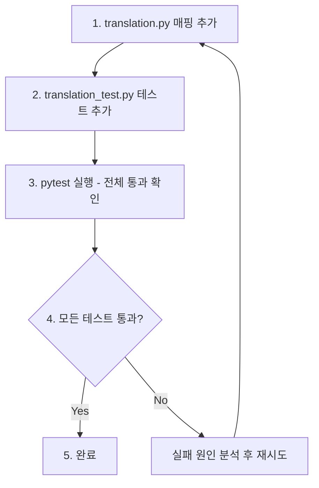

# Task 5a: `resolve_decision_type()` 매핑 누락 수정 설계

## 1. 문제 정의

[`resolve_decision_type()`](src/agent_trading/services/translation.py:135-151) 함수에서 `"approve"`, `"exit"`, `"watch"`, `"reject"` 매핑이 모두 누락되어 있어, 이들 값이 DB `decision_type` 컬럼에 `'hold'`로 잘못 저장됨.

### 증상
- AI가 `"APPROVE"`를 출력 → `resolve_decision_type("APPROVE")` → `DecisionType.HOLD` 반환 (mapping.get() fallback)
- 마찬가지로 `"WATCH"`, `"REJECT"`, `"EXIT"`도 모두 `DecisionType.HOLD`로 fallback되어 DB에 `'hold'`로 저장
- 결과적으로 DB에서 상태 해석이 왜곡됨:
  - `APPROVE` → `hold`로 저장되어 실제로는 주문 요청이 있었던 건이 HOLD로 기록됨
  - `WATCH` → `hold`로 저장되어 모니터링 대상과 단순 보류를 구분할 수 없음
  - `REJECT` → `hold`로 저장되어 기각된 결정을 추적 불가
  - `EXIT` → `hold`로 저장되어 포지션 종료 의도를 식별 불가
- [`decision_json.decision_type`](src/agent_trading/api/schemas.py)과 DB 컬럼 간 불일치

## 2. 현재 상태 분석

### [`DecisionType` enum](src/agent_trading/domain/enums.py:106-117)
```python
class DecisionType(str, Enum):
    APPROVE = "approve"
    REJECT = "reject"
    BUY = "buy"
    SELL = "sell"
    HOLD = "hold"
    CLOSE = "close"
    WATCH = "watch"
    EXIT = "exit"
    REDUCE = "reduce"
```
- `APPROVE`, `EXIT`, `WATCH`, `REJECT` 모두 enum에 **정의되어 있음** ✅

### 현재 [`resolve_decision_type()`](src/agent_trading/services/translation.py:135-151)
```python
def resolve_decision_type(value: str | None) -> DecisionType:
    if not value:
        return DecisionType.HOLD
    cleaned = value.strip().lower()
    mapping: dict[str, DecisionType] = {
        "buy": DecisionType.BUY,
        "strong_buy": DecisionType.BUY,
        "sell": DecisionType.SELL,
        "strong_sell": DecisionType.SELL,
        "hold": DecisionType.HOLD,
        "neutral": DecisionType.HOLD,
        "close": DecisionType.CLOSE,
        "reduce": DecisionType.REDUCE,
        "review": DecisionType.HOLD,
    }
    return mapping.get(cleaned, DecisionType.HOLD)
```
- `"approve"`, `"exit"`, `"watch"`, `"reject"` → 매핑 없음 → **모두 `DecisionType.HOLD`로 fallback**

### [`actionable_types` in `build_submit_order_request_from_decision()`](src/agent_trading/services/translation.py:76)
```python
actionable_types = {"APPROVE", "BUY", "SELL", "EXIT", "REDUCE", "WATCH"}
```
- 이 로직은 `resolve_decision_type()`을 거치지 않고 **원본 문자열**로 비교하므로 정상 동작
- 따라서 `build_submit_order_request_from_decision()`은 영향을 받지 않음
- **문제는 `resolve_decision_type()`을 통해 DB에 저장되는 값만 `'hold'`로 잘못 저장됨**

### [`normalize_decision_type()`](src/agent_trading/services/translation.py:202-242)
- 이미 `"APPROVE"`, `"REJECT"`, `"WATCH"`, `"EXIT"`를 정상 처리 (canonical pass-through)
- 하지만 이 함수는 `resolve_decision_type()`과 별개로 동작하며, AI 출력 정규화용

## 3. 수정 내용

### 3.1 [`translation.py`](src/agent_trading/services/translation.py) — `resolve_decision_type()` 매핑 추가

```python
def resolve_decision_type(value: str | None) -> DecisionType:
    if not value:
        return DecisionType.HOLD
    cleaned = value.strip().lower()
    mapping: dict[str, DecisionType] = {
        "buy": DecisionType.BUY,
        "strong_buy": DecisionType.BUY,
        "sell": DecisionType.SELL,
        "strong_sell": DecisionType.SELL,
        "hold": DecisionType.HOLD,
        "neutral": DecisionType.HOLD,
        "close": DecisionType.CLOSE,
        "reduce": DecisionType.REDUCE,
        "review": DecisionType.HOLD,
        # ↓ 추가되는 항목
        "approve": DecisionType.APPROVE,
        "exit": DecisionType.EXIT,
        "watch": DecisionType.WATCH,
        "reject": DecisionType.REJECT,
    }
    return mapping.get(cleaned, DecisionType.HOLD)
```

### 3.2 수정 제약사항
- **`translation.py`만 수정** (다른 파일 영향 없음)
- `resolve_decision_type()` 함수 **내부 매핑만 추가**
- 함수 외부 로직 변경 금지
- `apply_patch` 사용 필수

## 4. 영향 범위 분석

| 호출 위치 | 영향 | 비고 |
|-----------|------|------|
| [`resolve_order_side()`](src/agent_trading/services/translation.py:154-161) | 간접 영향 | `resolve_decision_type()` 결과로 OrderSide 결정. `APPROVE` → fallback 사용 |
| [`build_submit_order_request_from_decision()`](src/agent_trading/services/translation.py:49-124) | **영향 없음** | `actionable_types`는 원본 문자열 비교 사용 |
| DB 저장 로직 (`decision_orchestrator.py` 등) | **직접 영향** | 올바른 `decision_type` 저장 가능해짐 |
| 기존 테스트 | **영향 없음** | 기존 매핑(buy, sell, hold, close, reduce) 변경 없음 |

## 5. 테스트 설계

### 5.1 대상 파일
[`tests/services/translation_test.py`](tests/services/translation_test.py)

### 5.2 추가할 테스트 케이스 (`TestResolveDecisionType` 클래스에 추가)

```python
def test_approve(self) -> None:
    assert resolve_decision_type("approve") == DecisionType.APPROVE
    assert resolve_decision_type("APPROVE") == DecisionType.APPROVE
    assert resolve_decision_type("Approve") == DecisionType.APPROVE

def test_exit(self) -> None:
    assert resolve_decision_type("exit") == DecisionType.EXIT
    assert resolve_decision_type("EXIT") == DecisionType.EXIT

def test_watch(self) -> None:
    assert resolve_decision_type("watch") == DecisionType.WATCH
    assert resolve_decision_type("WATCH") == DecisionType.WATCH

def test_reject(self) -> None:
    assert resolve_decision_type("reject") == DecisionType.REJECT
    assert resolve_decision_type("REJECT") == DecisionType.REJECT
```

### 5.3 기존 테스트 재확인
- `test_buy` (`BUY`, `strong_buy`) — 변경 없으므로 통과
- `test_sell` (`SELL`, `strong_sell`) — 변경 없으므로 통과
- `test_hold` (`hold`, `neutral`, `review`) — 변경 없으므로 통과
- `test_close` (`close`) — 변경 없으므로 통과
- `test_reduce` (`reduce`) — 변경 없으므로 통과
- `test_none_fallback` (`None`) — 변경 없으므로 통과
- `test_unknown_fallback` (`"garbage"`) — 변경 없으므로 통과

## 6. 구현 순서



## 7. 리스크 및 주의사항

| 리스크 | 완화 방안 |
|--------|-----------|
| `REJECT` 매핑 추가로 인한 예상치 못한 사이드 이펙트 | `REJECT`는 `actionable_types`에 포함되지 않으므로 `build_submit_order_request_from_decision()`에서 `None` 반환 → 안전 |
| `WATCH` 매핑으로 인한 잘못된 주문 제출 | `build_submit_order_request_from_decision()`에서 WATCH는 별도 처리(return None)하므로 안전 |
| 기존 `resolve_order_side()` 동작 변경 | `resolve_order_side()`는 `DecisionType.BUY`/`SELL`/`CLOSE`만 특별 처리하고 나머지는 `fallback` 반환하므로, `APPROVE`/`REJECT`/`EXIT`/`WATCH`는 fallback 사용 → 안전 |

## 8. 검증 항목

- [ ] `DecisionType` enum에 `APPROVE`, `EXIT`, `WATCH`, `REJECT`가 모두 정의되어 있음 ✅
- [ ] `resolve_decision_type("APPROVE")` → `DecisionType.APPROVE` 반환
- [ ] `resolve_decision_type("EXIT")` → `DecisionType.EXIT` 반환
- [ ] `resolve_decision_type("WATCH")` → `DecisionType.WATCH` 반환
- [ ] `resolve_decision_type("REJECT")` → `DecisionType.REJECT` 반환
- [ ] 기존 7개 테스트 케이스 모두 통과
- [ ] 대소문자 변형 처리 확인 (`approve`, `APPROVE`, `Approve` 모두 동일)
