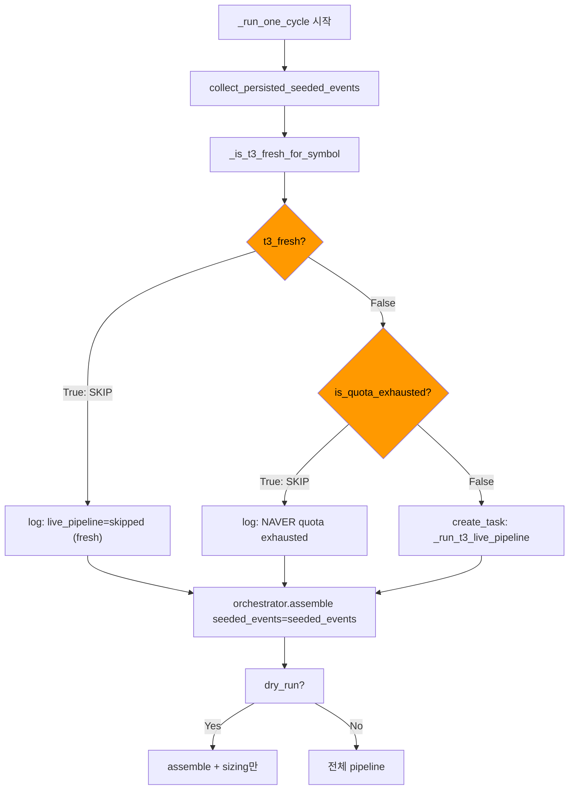

# Fresh Skip 검증 설계 — Mock 기반 단위 테스트

## 1. 현황 분석

### 테스트 1: `has_fresh_t3_events()` — ✅ 이미 구현 완료

`tests/repositories/test_external_events.py` 에 8개 테스트 존재:

| # | 파일 | 테스트명 | 상태 |
|---|------|---------|------|
| 9 | InMemory | `test_inmemory_has_fresh_t3_events_true_within_window` | ✅ |
| 10 | InMemory | `test_inmemory_has_fresh_t3_events_false_beyond_window` | ✅ |
| 11 | InMemory | `test_inmemory_has_fresh_t3_events_false_no_t3` | ✅ |
| 12 | InMemory | `test_inmemory_has_fresh_t3_events_seeded_news_type` | ✅ |
| 19 | Postgres | `test_postgres_has_fresh_t3_events_true_within_window` | ✅ |
| 20 | Postgres | `test_postgres_has_fresh_t3_events_false_beyond_window` | ✅ |
| 21 | Postgres | `test_postgres_has_fresh_t3_events_false_no_t3` | ✅ |
| 22 | Postgres | `test_postgres_has_fresh_t3_events_seeded_news_type` | ✅ |

**검증 커버리지**: freshness window 내 True, window 초과 False, T3 이벤트 없음 False, seeded_news event_type True — 4개 시나리오 전부 커버.

### 테스트 2: `_is_t3_fresh_for_symbol()` — ✅ 이미 구현 완료

`tests/scripts/test_run_decision_loop.py` `TestIsT3FreshForSymbol` 클래스 (L1787-1875)에 4개 테스트 존재:

| 테스트명 | 시나리오 | 검증 |
|---------|---------|------|
| `test_true_when_fresh_events_exist` | freshness window 내 T3 이벤트 존재 | `True` |
| `test_false_when_no_events` | T3 이벤트 없음 | `False` |
| `test_false_when_only_stale_events` | freshness window 초과(3시간 전 ingested) | `False` |
| `test_true_with_seeded_news_event_type` | event_type='seeded_news' (Y| prefix 없음) | `True` |

---

## 2. 신규 테스트 설계

### 테스트 3: `_run_one_cycle()` fresh skip 분기 검증

**대상 코드 경로**: [`scripts/run_decision_loop.py:775-810`](scripts/run_decision_loop.py:775)

```python
seeded_events = await _collect_persisted_seeded_events(repos, symbol)
t3_fresh = await _is_t3_fresh_for_symbol(repos, symbol)
if not t3_fresh:
    if NaverNewsSearchAdapter.is_quota_exhausted():
        logger.warning("T3 live pipeline skipped ... NAVER quota exhausted")
    else:
        task = asyncio.create_task(_run_t3_live_pipeline(...))
```

**접근법**: `_process_one()`은 `_run_loop()` 내부 클로저이므로 직접 호출 불가. 대신 `_run_one_cycle()` 레벨에서 검증. `_mock_runtime_for_one_cycle()`이 생성한 `runtime["repositories"]`를 통해 in-memory repos에 T3 이벤트를 주입한 후 `_run_one_cycle()` 호출.

#### 테스트 3a: `test_t3_fresh_skip_when_fresh_events_exist`

```python
# TestRunOneCycle 클래스에 추가
@pytest.mark.asyncio
async def test_t3_fresh_skip_when_fresh_events_exist(self) -> None:
    """T3 events가 freshness window 내 존재 → T3 live pipeline skip.
    
    검증: _run_one_cycle() 완료, live_pipeline이 실행되지 않음.
    """
    async with _mock_runtime_for_one_cycle() as runtime:
        repos = runtime["repositories"]
        now = datetime.now(timezone.utc)
        
        # Add fresh T3 event (ingested_at = 30분 전 < 7200s window)
        event = ExternalEventEntity(
            event_id=uuid4(),
            event_type="Y|seeded_news",
            source_name="naver",
            source_reliability_tier="T3",
            symbol=SYMBOL,
            market=MARKET,
            published_at=now - timedelta(minutes=30),
            ingested_at=now - timedelta(minutes=30),
            severity="medium",
            direction="neutral",
            headline="Fresh T3 event",
        )
        await repos.external_events.add(event)
        
        # Mock quota exhausted (to avoid real API calls if skip fails)
        from agent_trading.brokers.naver_news_adapter import NaverNewsSearchAdapter
        with patch.object(NaverNewsSearchAdapter, "is_quota_exhausted", return_value=True):
            result = await _run_one_cycle(
                cycle=1,
                submit=False,
                dry_run=True,
                output="text",
                symbol=SYMBOL,
                market=MARKET,
                runtime=runtime,
            )
    
    # DRY_RUN 정상 완료
    assert result["status"] == "DRY_RUN"
    # seeded_events에 T3 이벤트가 포함되어 assemble()로 전달됨
    assert len(result.get("seeded_events", [])) > 0
```

#### 테스트 3b: `test_t3_live_pipeline_executed_when_stale`

```python
@pytest.mark.asyncio
async def test_t3_live_pipeline_executed_when_stale(self) -> None:
    """T3 events가 stale → T3 live pipeline 실행.
    
    검증: _run_t3_live_pipeline()이 create_task()를 통해 실행됨.
    """
    async with _mock_runtime_for_one_cycle() as runtime:
        repos = runtime["repositories"]
        now = datetime.now(timezone.utc)
        
        # Add stale T3 event (3시간 전 ingested > 7200s window)
        event = ExternalEventEntity(
            event_id=uuid4(),
            event_type="Y|seeded_news",
            source_name="naver",
            source_reliability_tier="T3",
            symbol=SYMBOL,
            market=MARKET,
            published_at=now - timedelta(hours=3),
            ingested_at=now - timedelta(hours=3),
            severity="medium",
            direction="neutral",
            headline="Stale T3 event",
        )
        await repos.external_events.add(event)
        
        # Mock quota NOT exhausted → live pipeline should run
        from agent_trading.brokers.naver_news_adapter import NaverNewsSearchAdapter
        with patch.object(NaverNewsSearchAdapter, "is_quota_exhausted", return_value=False):
            # Mock asyncio.create_task to capture whether _run_t3_live_pipeline was called
            original_create_task = asyncio.create_task
            tasks_created: list[object] = []
            
            def _capture_create_task(coro, *args, **kwargs):
                tasks_created.append(coro)
                return original_create_task(coro, *args, **kwargs)
            
            with patch("asyncio.create_task", side_effect=_capture_create_task):
                result = await _run_one_cycle(
                    cycle=1,
                    submit=False,
                    dry_run=True,
                    output="text",
                    symbol=SYMBOL,
                    market=MARKET,
                    runtime=runtime,
                )
    
    assert result["status"] == "DRY_RUN"
    # Verify _run_t3_live_pipeline was scheduled via create_task
    t3_tasks = [c for c in tasks_created 
                if hasattr(c, '__qualname__') and '_run_t3_live_pipeline' in str(c)]
    assert len(t3_tasks) > 0, "T3 live pipeline should be executed when stale"
```

#### 테스트 3c: `test_t3_quota_exhaustion_skip`

```python
@pytest.mark.asyncio
async def test_t3_quota_exhaustion_skip(self) -> None:
    """T3 events stale + NAVER quota 소진 → T3 live pipeline skip.
    
    검증: create_task(_run_t3_live_pipeline)이 호출되지 않음.
    """
    async with _mock_runtime_for_one_cycle() as runtime:
        repos = runtime["repositories"]
        now = datetime.now(timezone.utc)
        
        # Add stale T3 event
        event = ExternalEventEntity(
            event_id=uuid4(),
            event_type="Y|seeded_news",
            source_name="naver",
            source_reliability_tier="T3",
            symbol=SYMBOL,
            market=MARKET,
            published_at=now - timedelta(hours=3),
            ingested_at=now - timedelta(hours=3),
            severity="medium",
            direction="neutral",
            headline="Stale T3 event",
        )
        await repos.external_events.add(event)
        
        # Mock quota exhausted
        from agent_trading.brokers.naver_news_adapter import NaverNewsSearchAdapter
        tasks_created: list[object] = []
        original_create_task = asyncio.create_task
        
        def _capture_create_task(coro, *args, **kwargs):
            tasks_created.append(coro)
            return original_create_task(coro, *args, **kwargs)
        
        with patch.object(NaverNewsSearchAdapter, "is_quota_exhausted", return_value=True), \
             patch("asyncio.create_task", side_effect=_capture_create_task):
            result = await _run_one_cycle(
                cycle=1,
                submit=False,
                dry_run=True,
                output="text",
                symbol=SYMBOL,
                market=MARKET,
                runtime=runtime,
            )
    
    assert result["status"] == "DRY_RUN"
    # Verify NO _run_t3_live_pipeline task was created
    t3_tasks = [c for c in tasks_created 
                if hasattr(c, '__qualname__') and '_run_t3_live_pipeline' in str(c)]
    assert len(t3_tasks) == 0, "T3 live pipeline should NOT be executed when quota exhausted"
```

### 테스트 4: Fresh skip 후 assemble 정상 동작 검증

**대상 코드 경로**: [`scripts/run_decision_loop.py:817-828`](scripts/run_decision_loop.py:817)

```python
intent = await asyncio.wait_for(
    orchestrator.assemble(
        request,
        seeded_events=seeded_events,
    ),
    timeout=PER_AGENT_HARD_TIMEOUT,
)
```

**접근법**: `orchestrator.assemble()`이 `seeded_events`를 정상적으로 수신하는지 검증하기 위해, `DecisionOrchestratorService.assemble()`을 mock하고 호출 인자 검증.

#### 테스트 4a: `test_t3_fresh_skip_assemble_normal`

```python
# TestRunOneCycle 클래스에 추가
@pytest.mark.asyncio
async def test_t3_fresh_skip_assemble_normal(self) -> None:
    """Fresh skip 후에도 assemble()이 seeded_events를 정상 수신.
    
    검증:
    1. assemble()이 seeded_events를 받아 호출됨
    2. cycle result가 DRY_RUN으로 정상
    """
    async with _mock_runtime_for_one_cycle() as runtime:
        repos = runtime["repositories"]
        orchestrator = runtime["orchestrator"]
        now = datetime.now(timezone.utc)
        
        # Add fresh T3 event
        event = ExternalEventEntity(
            event_id=uuid4(),
            event_type="seeded_news",
            source_name="naver",
            source_reliability_tier="T3",
            symbol=SYMBOL,
            market=MARKET,
            published_at=now - timedelta(minutes=5),
            ingested_at=now - timedelta(minutes=5),
            severity="medium",
            direction="neutral",
            headline="Fresh seeded news for assemble test",
        )
        await repos.external_events.add(event)
        
        # Mock assemble to capture seeded_events
        original_assemble = orchestrator.assemble
        captured_seeded_events: list[ExternalEventEntity] = []
        
        async def _capture_assemble(request, *, seeded_events=None):
            if seeded_events:
                captured_seeded_events.extend(seeded_events)
            return await original_assemble(request, seeded_events=seeded_events)
        
        orchestrator.assemble = _capture_assemble
        
        # Mock quota exhausted (safety)
        from agent_trading.brokers.naver_news_adapter import NaverNewsSearchAdapter
        with patch.object(NaverNewsSearchAdapter, "is_quota_exhausted", return_value=True):
            result = await _run_one_cycle(
                cycle=1,
                submit=False,
                dry_run=True,
                output="text",
                symbol=SYMBOL,
                market=MARKET,
                runtime=runtime,
            )
    
    # assemble()이 seeded_events를 수신했는지 검증
    assert len(captured_seeded_events) > 0, "assemble() should receive seeded_events"
    assert captured_seeded_events[0].event_id == event.event_id
    assert result["status"] == "DRY_RUN"
```

#### 테스트 4b: `test_t3_fresh_skip_submit_mode_normal`

```python
@pytest.mark.asyncio
async def test_t3_fresh_skip_submit_mode_normal(self) -> None:
    """Fresh skip + submit 모드에서도 cycle 정상 완료.
    
    Fresh skip이 submit 경로에 영향을 주지 않는지 검증.
    """
    async with _mock_runtime_for_one_cycle() as runtime:
        repos = runtime["repositories"]
        now = datetime.now(timezone.utc)
        
        # Add fresh T3 event
        event = ExternalEventEntity(
            event_id=uuid4(),
            event_type="Y|seeded_news",
            source_name="naver",
            source_reliability_tier="T3",
            symbol=SYMBOL,
            market=MARKET,
            published_at=now - timedelta(minutes=30),
            ingested_at=now - timedelta(minutes=30),
            severity="medium",
            direction="neutral",
            headline="Fresh T3 for submit test",
        )
        await repos.external_events.add(event)
        
        from agent_trading.brokers.naver_news_adapter import NaverNewsSearchAdapter
        with patch.object(NaverNewsSearchAdapter, "is_quota_exhausted", return_value=True):
            result = await _run_one_cycle(
                cycle=1,
                submit=True,
                dry_run=False,
                output="text",
                symbol=SYMBOL,
                market=MARKET,
                runtime=runtime,
            )
    
    # Submit 모드 정상 완료 (status는 mock broker 설정에 따라 SUBMITTED/SKIPPED/ERROR)
    assert result["status"] in ("SUBMITTED", "SKIPPED", "DRY_RUN", "ERROR"), (
        f"Unexpected status: {result['status']}"
    )
    # source_type이 'core' 기본값으로 유지
    assert result.get("source_type", "core") is not None
```

---

## 3. 파일 변경 요약

### `tests/scripts/test_run_decision_loop.py`

**변경 사항**:

1. **`TestRunOneCycle` 클래스 확장** (L709 이후):
   - `test_t3_fresh_skip_when_fresh_events_exist` (테스트 3a)
   - `test_t3_live_pipeline_executed_when_stale` (테스트 3b)
   - `test_t3_quota_exhaustion_skip` (테스트 3c)
   - `test_t3_fresh_skip_assemble_normal` (테스트 4a)
   - `test_t3_fresh_skip_submit_mode_normal` (테스트 4b)

2. **Import 추가** (필요시):
   - `from agent_trading.brokers.naver_news_adapter import NaverNewsSearchAdapter`
   - `import asyncio` (이미 import됨)

### `tests/repositories/test_external_events.py`

**변경 사항 없음** — 이미 8개 테스트로 검증 완료.

---

## 4. 검증 매트릭스

| 시나리오 | 조건 | 기대 결과 | 테스트 |
|---------|------|----------|-------|
| T3 fresh events 존재 | ingested_at < 7200s | T3 live pipeline skip | 3a |
| T3 stale events만 존재 | ingested_at > 7200s | T3 live pipeline 실행 | 3b |
| T3 stale + quota 소진 | is_quota_exhausted=True | T3 live pipeline skip (quota) | 3c |
| Fresh skip + assemble | fresh T3 + dry_run | assemble()에 seeded_events 전달 | 4a |
| Fresh skip + submit | fresh T3 + submit | cycle 정상 완료 | 4b |

---

## 5. Mermaid 다이어그램



---

## 6. 제약 조건 점검

| 제약 | 상태 | 설명 |
|------|------|------|
| `.env` 수정 금지 | ✅ | 환경 변수 변경 없음 |
| `python3`만 사용 | ✅ | pytest로 실행 |
| 기존 테스트 통과 | ✅ | 기존 테스트 변경 없음, 새 테스트만 추가 |
| In-memory repo 사용 | ✅ | `_mock_runtime_for_one_cycle()`이 in-memory repos 사용 |
| Postgres 불필요 | ✅ | 모든 검증 in-memory로 수행 |
