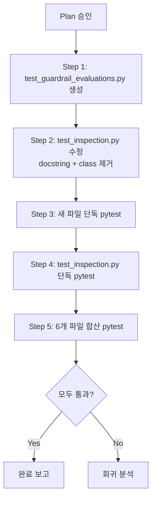

# test_inspection.py → TestGuardrailEvaluations 분리 계획

> **구현 전 고정사항 (사용자 승인 반영)**
> 1. **새 파일 경로**: `tests/api/test_guardrail_evaluations.py` (고정)
> 2. **새 파일 docstring**: agent-runs 호출은 guardrail evaluation의 `decision_context_id` discovery 수단일 뿐, agent-runs 자체 테스트가 아님을 명시
> 3. **test_inspection.py docstring**: `/guardrail-evaluations` 제거 (line 8에 명시되어 있음) — 최소 범위만 수정
> 4. **Helper**: 도입하지 않음. 기존 `client` fixture만 사용
> 5. **합산 집계 범위**: 6개 파일 — guardrail(4) + risk_limit(4) + agent_runs(8) + inspection(37) + metrics(3) + benchmark(12) = 68
> 6. **AgentRuns 경계 설명**: 완료 보고에 "agent-runs endpoint를 호출하지만, 이는 guardrail test의 데이터 lookup 수단일 뿐" 명시

## 1. 의존성 분석: agent-runs API 결합 실체

### TestGuardrailEvaluations (4 tests, lines 427-487)

| Test # | Test명 | agent-runs 의존 | 의존 형태 |
|--------|--------|----------------|----------|
| 1 | `test_list_guardrail_evaluations_by_decision_context` | ✅ | `GET /agent-runs` → `runs[0]["decision_context_id"]` |
| 2 | `test_list_guardrail_evaluations_empty_no_filter` | ❌ | 없음 (단순 no-filter 호출) |
| 3 | `test_get_guardrail_evaluation_by_id` | ✅ | `GET /agent-runs` → ctx_id → list → eval_id |
| 4 | `test_get_guardrail_evaluation_not_found` | ❌ | 없음 (하드코딩 UUID) |

### 의존성의 성격

Test 1과 Test 3이 `GET /agent-runs` API를 호출해 `decision_context_id`를 얻습니다. 
이 의존성은 **파일 간 결합(coupling)이 아니라 fixture 레벨의 데이터 의존성**입니다.

```
seeded_repos fixture → agent-runs seeded data → GET /agent-runs 응답
                                                        ↑
                              TestGuardrailEvaluations ──┘ (API 호출로 ctx_id 획득)
```

### 동일 패턴 비교: TestAgentRunsDetail

[`tests/api/test_agent_runs.py`](tests/api/test_agent_runs.py)의 `TestAgentRunsDetail.test_get_agent_run`도 동일한 discovery 패턴 사용:

| 클래스 | discovery 대상 | 사용처 |
|--------|---------------|--------|
| `TestAgentRunsDetail` | `runs[0]["agent_run_id"]` | 같은 도메인 detail 조회 |
| `TestGuardrailEvaluations` | `runs[0]["decision_context_id"]` | 다른 도메인(guardrail) 필터 조회 |

**차이점**: TestGuardrailEvaluations는 guardrail-evaluation 도메인의 테스트이면서 agent-runs 응답 필드를 사용. 
하지만 이는 **API 계약 레벨의 의존성**일 뿐, test_agent_runs.py의 클래스 구조와는 무관.

### 분리 가능성 판단: **분리 가능** ✅

**근거**:
1. agent-runs 의존성은 `seeded_repos` fixture가 제공하는 데이터에 기반 → 파일 분리와 무관
2. test_agent_runs.py의 구조 변경(클래스명/메서드 변경)이 TestGuardrailEvaluations에 영향을 주지 않음
3. TestAgentRunsDetail도 동일한 discovery 패턴 사용 (이미 분리 완료)
4. 기존 분리 파일과 동일한 fixture(`client` only) 사용

---

## 2. Pre-implementation Decisions

| 항목 | 결정 | 근거 |
|------|------|------|
| **분리 여부** | **분리함** | 위 분석 참조 |
| **새 파일 경로** | `tests/api/test_guardrail_evaluations.py` | 기존 컨벤션 |
| **Helper** | 없음 — `client` fixture만 사용 | 테스트 내에서 직접 `/agent-runs` API 호출 |
| **Docstring 수정** | 필요 — `test_inspection.py` line 8에서 `/guardrail-evaluations` 제거 | 파일 범위 정확성 |
| **Fixture import** | `from tests.api.conftest import client  # noqa: F401` | 기존 분리 파일과 동일 |

---

## 3. 새 파일: [`tests/api/test_guardrail_evaluations.py`](../tests/api/test_guardrail_evaluations.py)

### Import
```python
from __future__ import annotations

from fastapi.testclient import TestClient

from tests.api.conftest import client  # noqa: F401
```

### TestGuardrailEvaluations (4 tests)

```python
class TestGuardrailEvaluations:
    """Guardrail evaluation inspection endpoints.

    Tests 1 and 3 discover a ``decision_context_id`` via ``GET /agent-runs``
    before querying guardrail evaluations. This is a fixture-level data
    dependency (seeded agent runs), not a coupling to ``test_agent_runs.py``.
    """

    def test_list_guardrail_evaluations_by_decision_context(
        self, client: TestClient,
    ) -> None:
        """``GET /guardrail-evaluations?decision_context_id=...`` returns results."""
        # Get a decision context ID from agent runs
        runs_resp = client.get("/agent-runs")
        runs = runs_resp.json()
        assert len(runs) >= 1
        ctx_id = runs[0]["decision_context_id"]

        response = client.get(
            f"/guardrail-evaluations?decision_context_id={ctx_id}"
        )
        assert response.status_code == 200
        data = response.json()
        assert len(data) >= 1
        assert data[0]["overall_passed"] is True
        assert data[0]["rule_set_version"] == "v1.0"

    def test_list_guardrail_evaluations_empty_no_filter(
        self, client: TestClient,
    ) -> None:
        """``GET /guardrail-evaluations`` returns empty list when no filter given."""
        response = client.get("/guardrail-evaluations")
        assert response.status_code == 200
        assert response.json() == []

    def test_get_guardrail_evaluation_by_id(
        self, client: TestClient,
    ) -> None:
        """``GET /guardrail-evaluations/{id}`` returns a single evaluation."""
        # First get list to find an evaluation ID
        runs_resp = client.get("/agent-runs")
        runs = runs_resp.json()
        assert len(runs) >= 1
        ctx_id = runs[0]["decision_context_id"]

        list_resp = client.get(
            f"/guardrail-evaluations?decision_context_id={ctx_id}"
        )
        evaluations = list_resp.json()
        assert len(evaluations) >= 1
        eval_id = evaluations[0]["guardrail_evaluation_id"]

        detail_resp = client.get(f"/guardrail-evaluations/{eval_id}")
        assert detail_resp.status_code == 200
        detail = detail_resp.json()
        assert detail["guardrail_evaluation_id"] == eval_id
        assert detail["overall_passed"] is True

    def test_get_guardrail_evaluation_not_found(
        self, client: TestClient,
    ) -> None:
        """``GET /guardrail-evaluations/{id}`` returns 404 for unknown UUID."""
        response = client.get(
            "/guardrail-evaluations/00000000-0000-0000-0000-000000000000"
        )
        assert response.status_code == 404
```

**모든 assertion은 원본과 완전 동일** (line 427-487).

---

## 4. [`test_inspection.py`](../tests/api/test_inspection.py) 변경 사항

### 4.1 Docstring 수정 (line 8)
**Before:**
```python
Covers: ``GET /orders``, ... ``GET /guardrail-evaluations``.
```

**After:**
```python
Covers: ``GET /orders``, ... (guardrail-evaluations 제거)
```

### 4.2 `TestGuardrailEvaluations` 클래스 제거
Lines 427-487 (61 lines) 완전 제거.

---

## 5. 예상 테스트 분포

**이번 분리 범위 기준 (6개 파일)**:

| 파일 | 테스트 수 |
|------|----------|
| `test_guardrail_evaluations.py` | **4** (신규) |
| `test_risk_limit_snapshots.py` | 4 |
| `test_agent_runs.py` | 8 |
| `test_inspection.py` | **37** (41→37) |
| `test_performance_metrics.py` | 3 |
| `test_performance_benchmark_history.py` | 12 |
| **합계** | **68** |

---

## 6. 실행 단계



### Step 1: 새 파일 생성
- [`tests/api/test_guardrail_evaluations.py`](../tests/api/test_guardrail_evaluations.py) 작성
- Docstring: 4 tests, agent-runs 의존성 설명 포함
- Import: `TestClient`, `client` fixture

### Step 2: test_inspection.py 수정
- Docstring: `/guardrail-evaluations` 제거
- `TestGuardrailEvaluations` class (lines 427-487) 제거

### Step 3: 새 파일 단독 테스트
```bash
python3 -m pytest tests/api/test_guardrail_evaluations.py -q
```
Expected: **4 passed**

### Step 4: test_inspection.py 단독 테스트
```bash
python3 -m pytest tests/api/test_inspection.py -q
```
Expected: **37 passed** (41 - 4)

### Step 5: 6개 파일 합산 테스트
```bash
python3 -m pytest tests/api/test_guardrail_evaluations.py tests/api/test_risk_limit_snapshots.py tests/api/test_agent_runs.py tests/api/test_inspection.py tests/api/test_performance_metrics.py tests/api/test_performance_benchmark_history.py -q
```
Expected: **68 passed** (4 + 4 + 8 + 37 + 3 + 12)

---

## 7. 제약 조건 점검

| 조건 | 상태 |
|------|------|
| assertion 변경 금지 | ✅ 모든 assertion 동일 |
| endpoint 구현 변경 금지 | ✅ 해당 없음 |
| schema 변경 금지 | ✅ 해당 없음 |
| service 변경 금지 | ✅ 해당 없음 |
| DB migration 금지 | ✅ 해당 없음 |
| 과도한 리팩터링 금지 | ✅ file split only |
| fixture import 스타일 일관성 | ✅ 기존 패턴과 동일 |
| docstring 수정 최소화 | ✅ 해당 endpoint만 제거 |
| admin UI 변경 금지 | ✅ 해당 없음 |
