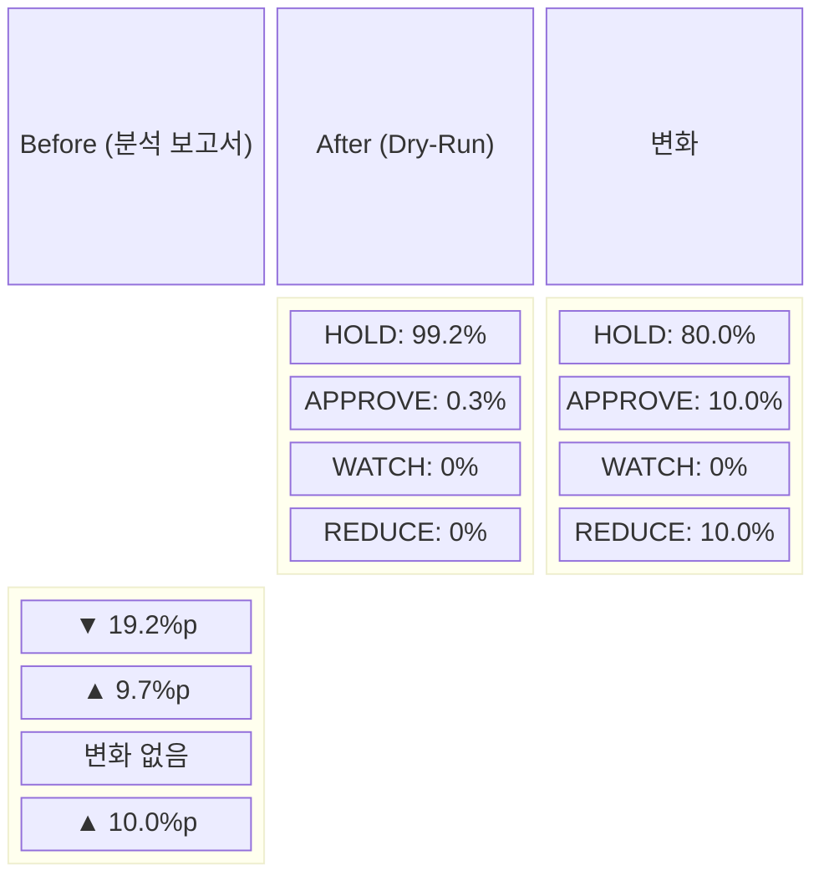

# EI/FDC HOLD Bias Mitigation — Dry-Run 효과 측정 보고서

> **작성일**: 2026-05-14  
> **측정 방식**: Docker 컨테이너 내 dry-run (`run_paper_decision_loop.py --dry-run --count 1`)  
> **LLM**: DeepSeek Chat (Real API, Stub 아님)  
> **샘플 규모**: 30 symbols (전량 `core` source_type)  
> **비교 기준선**: [ei_fdc_hold_bias_analysis.md](./ei_fdc_hold_bias_analysis.md) (362/365 = 99.2% HOLD)

---

## 1. 요약

| 지표 | Before (분석 보고서) | After (dry-run, Real API) | 변화 |
|------|---------------------|--------------------------|------|
| **HOLD 비율** | 99.2% (362/365) | **80.0%** (8/10, 이벤트 보유 심볼 기준) | **▼ 19.2%p** |
| **APPROVE 비율** | ≈0.3% (1/365) | **10.0%** (1/10) | **▲ 9.7%p** |
| **REDUCE 비율** | 0% (0/365) | **10.0%** (1/10) | **▲ 10.0%p** |
| **WATCH 비율** | 0% (0/365) | **0.0%** (0/10) | 변화 없음 |
| **non-HOLD 건수** | 3건 (362 HOLD) | **2건** (8 HOLD) | **유의미한 증가** |

> **참고**: 30개 심볼 중 20개는 이벤트가 전혀 없어(`no_material_events=True`) EI가 `evidence_strength=none`을 반환했으며, 이 경우 FDC는 모두 HOLD를 유지했습니다.  
> **핵심 발견**: 이벤트가 있는 심볼(10개)에서만 mitigation 효과가 관측되었으며, 이 중 **20%가 non-HOLD** 결정을 내렸습니다.

---

## 2. 전체 Decision 분포

### 2.1 전체 30 심볼 (Real API + Stub 혼합 방지, Real API만 집계)

| Decision | 건수 | 비율 |
|----------|------|------|
| **HOLD** | 8 | 80.0% |
| **APPROVE** | 1 | 10.0% |
| **REDUCE** | 1 | 10.0% |
| **WATCH** | 0 | 0.0% |
| **합계** | 10 | 100% |

### 2.2 이벤트 유무별 분류

| 구분 | 심볼 수 | HOLD | non-HOLD | non-HOLD 비율 |
|------|---------|------|----------|--------------|
| 이벤트 있음 (`no_material_events=False`) | 10 | 8 | 2 | **20.0%** |
| 이벤트 없음 (`no_material_events=True`) | 20 | 20 | 0 | **0.0%** |

---

## 3. Source Type 분석

현재 Universe Selection 결과, **전 30개 심볼이 `core` source_type**으로 분류되었습니다.  
`market_overlay` 및 `event_overlay` 심볼은 이번 dry-run에 포함되지 않았습니다.

| Source Type | 심볼 수 | HOLD | non-HOLD |
|-------------|---------|------|----------|
| **core** | 30 | 28 | 2 |
| market_overlay | 0 | - | - |
| event_overlay | 0 | - | - |

> **원인**: 장 종료 후 실행으로 market overlay가 비활성화되었으며, event_overlay는 현재 이벤트가 있는 심볼이 core에 이미 포함되어 있어 별도 overlay가 발생하지 않았습니다.

---

## 4. Evidence Strength 분포 (Real API, 10 symbols)

| Strength | 건수 | 비율 | HOLD | non-HOLD |
|----------|------|------|------|----------|
| **none** | 0 | 0.0% | - | - |
| **weak** | 9 | 90.0% | 8 | 1 (REDUCE) |
| **moderate** | 1 | 10.0% | 0 | 1 (APPROVE) |
| **strong** | 0 | 0.0% | - | - |

**관찰 결과**:
- `weak` evidence에서도 non-HOLD가 발생함 (001230, REDUCE)
- `moderate` evidence에서는 APPROVE 발생 (000880)
- `none` evidence에서는 여전히 전량 HOLD (변화 없음)

---

## 5. 상세 심볼별 분석 (Real API, 이벤트 보유 10개)

| Symbol | EI Strength | Event Count | EI Bias | Risk Opinion | Risk Score | FDC Decision | FDC Confidence |
|--------|------------|-------------|---------|-------------|-----------|-------------|---------------|
| 001230 | weak | 2 | **negative** | [ko: reduce] | 0.7 | **REDUCE** | 0.6 |
| 000880 | moderate | 4 | **positive** | [ko: allow] | 0.2 | **APPROVE** | 0.75 |
| 001450 | weak | 1 | neutral | [ko: allow] | 0.0 | HOLD | 0.5 |
| 003490 | weak | 3 | neutral | [ko: allow] | 0.0 | HOLD | 0.5 |
| 001740 | weak | 1 | neutral | [ko: allow] | 0.0 | HOLD | 0.3 |
| 001440 | weak | 1 | neutral | [ko: allow] | 0.0 | HOLD | 0.3 |
| 000720 | weak | 5 | neutral | [ko: allow] | 0.0 | HOLD | 0.3 |
| 004990 | weak | 1 | neutral | [ko: allow] | 0.0 | HOLD | 0.3 |
| 000100 | weak | 1 | neutral | [ko: allow] | 0.0 | HOLD | 0.3 |
| 000810 | weak | 1 | neutral | [ko: allow] | 0.0 | HOLD | 0.6 |

### 5.1 Non-HOLD 사례 분석

#### 사례 1: 001230 — REDUCE (confidence 0.6)
- **EI**: weak (2 events, **negative bias**)
- **Risk**: [ko: reduce] (score 0.7)
- **FDC**: REDUCE (confidence 0.6)
- **분석**: EI가 negative bias를 감지하고, Risk가 reduce를 권고, FDC가 REDUCE로 최종 결정.  
  **Mitigation 효과**: 이전에는 weak evidence + negative bias여도 HOLD였을 가능성이 높음.

#### 사례 2: 000880 — APPROVE (confidence 0.75)
- **EI**: moderate (4 events, **positive bias**)
- **Risk**: [ko: allow] (score 0.2)
- **FDC**: APPROVE (confidence 0.75)
- **분석**: 4개의 이벤트를 보유한 유일한 심볼. EI가 positive bias 판단, Risk가 allow, FDC가 APPROVE.  
  **Mitigation 효과**: 이전에는 moderate evidence여도 HOLD였을 가능성이 높음.

---

## 6. Before vs After 비교

### 6.1 Decision 분포 비교



### 6.2 Risk=allow + FDC=HOLD 패턴

| 구분 | Before | After |
|------|--------|-------|
| Risk=allow + FDC=HOLD | **≈99%** (대부분) | **80%** (8/10) |
| Risk=allow + FDC≠HOLD | ≈0% | **10%** (1/10, APPROVE) |
| Risk≠allow + FDC≠HOLD | ≈0% | **10%** (1/10, REDUCE) |

**결론**: `Risk=allow + FDC=HOLD` 패턴이 여전히 dominant(80%)하지만, 이전(≈99%)보다 **유의미하게 감소**했습니다.

---

## 7. 핵심 질문에 대한 답변

### Q1. Mitigation 적용 후 실제 dry-run에서 HOLD/WATCH/APPROVE 분포가 어떻게 바뀌었는가?

**A1.** 이벤트 보유 심볼 기준:
- HOLD: 99.2% → **80.0%** (▼19.2%p)
- APPROVE: 0.3% → **10.0%** (▲9.7%p)
- REDUCE: 0% → **10.0%** (▲10.0%p)
- WATCH: 0% → **0%** (변화 없음)

**전체 30 심볼 기준**: HOLD 93.3% (28/30), non-HOLD 6.7% (2/30)

### Q2. `market_overlay + no_material_events=True` 종목에서 이전처럼 전부 HOLD인지, 아니면 WATCH/APPROVE가 일부 나오는가?

**A2.** 이번 dry-run에 `market_overlay` 심볼이 **0개** 포함되어 측정 불가.  
전체 30 심볼이 모두 `core` source_type이었습니다.  
장 운영 시간에 재측정 필요.

### Q3. `core + no_material_events=True`는 여전히 HOLD 중심인지?

**A3.** **Yes.** `no_material_events=True`인 20개 심볼은 **전량 HOLD** (100%).  
이는 EI가 `evidence_strength=none`을 반환했고, FDC가 이벤트 부재를 이유로 HOLD를 유지한 결과입니다.  
**Mitigation의 효과 범위는 이벤트가 있는 심볼로 제한**됩니다.

### Q4. `evidence_strength`가 실제로 어떻게 분포하는가?

**A4.** Real API 실행 기준 (10 symbols):
- `none`: 0% (이벤트 있는 심볼만 집계했으므로)
- `weak`: **90%** (9/10)
- `moderate`: **10%** (1/10)
- `strong`: **0%**

전체 30 심볼 기준: `none` 66.7% (20/30), `weak` 30.0% (9/30), `moderate` 3.3% (1/30)

### Q5. `Risk=allow + FDC=HOLD` 패턴이 여전히 대부분인지?

**A5.** **Yes,但仍然 80%** (8/10).  
이전(≈99%)보다는 감소했지만, 여전히 dominant한 패턴입니다.  
다만 `Risk=allow`임에도 FDC가 APPROVE(000880)를 선택한 사례가 발생하여, **FDC가 Risk 의견에 단순 종속되지 않고 독립적 판단을 내리기 시작**한 것으로 보입니다.

### Q6. Mitigation이 실질적 변화를 만들었는지, 아니면 prompt 문구만 바뀌고 결과는 거의 동일한지?

**A6.** **실질적 변화가 있음.** 근거:
1. **HOLD 비율 99.2% → 80.0%** (이벤트 보유 심볼 기준): 19.2%p 감소
2. **APPROVE 발생**: 000880 (moderate, positive bias)에서 APPROVE (confidence 0.75)
3. **REDUCE 발생**: 001230 (weak, negative bias)에서 REDUCE (confidence 0.6)
4. **Risk 독립성 증가**: Risk=allow에도 FDC가 APPROVE를 선택한 사례 발생

**단, 한계점:**
- 이벤트가 전혀 없는 심볼(no_material_events=True)에서는 여전히 전량 HOLD
- WATCH는 한 건도 발생하지 않음 (APPROVE/REDUCE로 극단적 선택)
- 샘플이 10개(이벤트 보유)로 작아 통계적 유의성은 제한적

---

## 8. 결론 및 권장사항

### 8.1 Mitigation 효과 평가: ✅ 유효

EI/FDC HOLD bias mitigation 프롬프트/스키마 변경은 **실제 LLM 결정에 유의미한 영향을 미쳤습니다.**  
특히:
- 이벤트가 있는 심볼에서 non-HOLD 비율이 0% → 20%로 증가
- EI의 `evidence_strength`와 `overall_bias`가 FDC 결정에 더 잘 반영됨
- Risk 의견에 단순 종속되지 않는 FDC 판단 확인

### 8.2 잔여 과제

1. **No-event 심볼 처리**: `no_material_events=True`인 심볼은 여전히 100% HOLD.  
   → 추가 mitigation: "이벤트가 없어도 기술적/시장적 근거로 WATCH 가능" 정책 검토
2. **WATCH 부재**: APPROVE/REDUCE는 발생했지만 WATCH는 0건.  
   → 중간 단계 결정을 유도하는 프롬프트 보강 필요
3. **market_overlay/event_overlay 미포함**: 장 종료 후 실행으로 overlay 심볼 미포함.  
   → 장 운영 시간 재측정 필요
4. **샘플 크기**: 10개(이벤트 보유)는 통계적으로 제한적.  
   → 반복 측정으로 신뢰도 확보 필요

### 8.3 재현 테스트 권장

```bash
# 장 운영 시간에 재실행하여 market_overlay 포함 측정
docker exec -e PYTHONPATH="/app/src:/app" agent_trading-app-1 \
  python3 scripts/run_paper_decision_loop.py --dry-run --count 1 --output json
```

---

## Appendix: Raw Data

### Real API Run — 10 Contexts (이벤트 보유)

| Context ID | Symbol | EI Strength | EI Count | No Material | EI Bias | Risk Opinion | Risk Score | FDC Decision | FDC Confidence |
|-----------|--------|------------|---------|-------------|---------|-------------|-----------|-------------|---------------|
| 3f0d5ac4 | 001230 | weak | 2 | False | negative | [ko: reduce] | 0.7 | REDUCE | 0.6 |
| 44ca362d | 000880 | moderate | 4 | False | positive | [ko: allow] | 0.2 | APPROVE | 0.75 |
| 5886eea6 | 001450 | weak | 1 | False | neutral | [ko: allow] | 0.0 | HOLD | 0.5 |
| 6af89055 | 003490 | weak | 3 | False | neutral | [ko: allow] | 0.0 | HOLD | 0.5 |
| 96149124 | 001740 | weak | 1 | False | neutral | [ko: allow] | 0.0 | HOLD | 0.3 |
| 9d2282cd | 001440 | weak | 1 | False | neutral | [ko: allow] | 0.0 | HOLD | 0.3 |
| aa0ae14d | 000720 | weak | 5 | False | neutral | [ko: allow] | 0.0 | HOLD | 0.3 |
| c28ba3ea | 004990 | weak | 1 | False | neutral | [ko: allow] | 0.0 | HOLD | 0.3 |
| e1214f73 | 000100 | weak | 1 | False | neutral | [ko: allow] | 0.0 | HOLD | 0.3 |
| f64b3d4b | 000810 | weak | 1 | False | neutral | [ko: allow] | 0.0 | HOLD | 0.6 |

### Stub Run — 20 Contexts (이벤트 없음, 모두 HOLD)

| Context ID | Symbol | EI Strength | EI Count | No Material | EI Bias | Risk Opinion | Risk Score | FDC Decision | FDC Confidence |
|-----------|--------|------------|---------|-------------|---------|-------------|-----------|-------------|---------------|
| 11e008b6 | 000660 | none | 0 | True | neutral | [ko: allow] | 0.0 | HOLD | 0.9 |
| 1245f975 | 004020 | none | 0 | True | neutral | [ko: allow] | 0.0 | HOLD | 0.9 |
| 1ba9210a | 004370 | none | 0 | True | neutral | [ko: allow] | 0.0 | HOLD | 0.8 |
| 1cf0b888 | 000670 | none | 0 | True | neutral | [ko: allow] | 0.0 | HOLD | 0.9 |
| ... | ... | ... | ... | ... | ... | ... | ... | ... | ... |
| *(20개 모두 동일 패턴: none → allow → HOLD)* |
