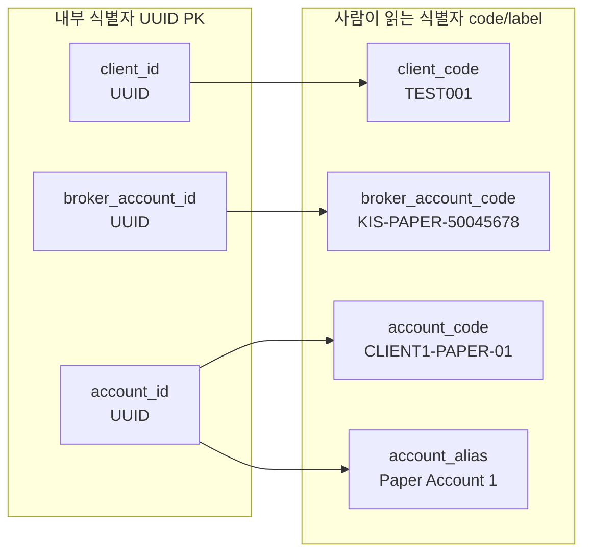
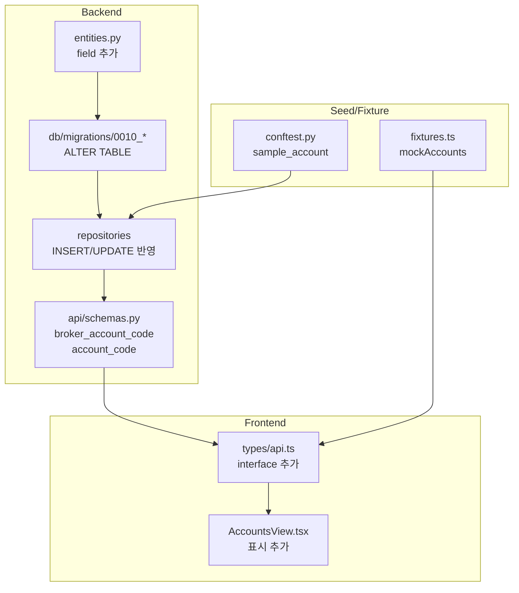

# Internal Identifier Policy — UUID Generation Standard & Code/Label Separation

## 0. UUID Generation Policy

### 원칙
1. **모든 internal ID(PK/FK)는 UUID를 사용한다.**
2. **UUID는 opaque한 internal 식별자이며, business meaning을 포함하지 않는다.**
3. **사람이 읽는 식별자는 별도 `code` / `label` / `alias` 필드가 담당한다.**

### UUID Version: v4 (랜덤) / v5 (name-based)

| 생성 방식 | 사용처 | 비고 |
|-----------|--------|------|
| `uuid4()` (random) | **Runtime entity 생성** — 모든 production 코드 | 충돌 확률이 무시할 수준, 단순함 |
| `uuid.uuid5()` (name-based, SHA-1) | **Seed/Test deterministic UUID** — idempotent seeding | 같은 name에서 항상 같은 UUID 생성, FK 관계 유지 |

### Seed/Test UUID 규칙

- `uuid5(NAMESPACE_DNS, "{entity_type}.{context}")` 형식 사용
- 예: `uuid.uuid5(uuid.NAMESPACE_DNS, "client.entrypoint")`
- 반복 숫자 패턴(`11111111-...`, `22222222-...`) **금지**
- 하드코딩된 UUID 문자열은 `UUID("...")` 리터럴로 명시하고, 생성 방식을 주석에 기록

### 사람이 읽는 식별자 계층

| 역할 | 필드 | 예시 |
|------|------|------|
| 내부 PK/FK (opaque) | `*_id` (UUID) | `301961b4-75d9-533c-92b7-69a306cdd435` |
| 사람이 읽는 code | `*_code` | `EPC001`, `KIS-PAPER-****5678` |
| 사람이 읽는 label | `name`, `account_alias` | `Entrypoint Client`, `Paper Account 1` |

---

# Internal Identifier Policy — 규칙형 code/display metadata 도입 (이하 원본)

## 1. 현황 분석

### 현재 식별자 구조

| Entity | PK (UUID) | Human-readable 식별자 | 상태 |
|--------|-----------|----------------------|------|
| `ClientEntity` | `client_id` | `client_code` (예: `TEST001`), `name` (예: `Test Client`) | ✅ 이미 있음 |
| `BrokerAccountEntity` | `broker_account_id` | `account_ref` (예: `50045678`) — raw KIS 계좌번호 | ⚠️ broker/환경 정보 미포함 |
| `AccountEntity` | `account_id` | `account_alias` (예: `Paper Account 1`), `account_masked` (예: `****1234`) | ⚠️ 규칙형 code 없음 |
| `AccountSummary` (API) | `account_id` (UUID) | `account_alias`, `account_masked`, `broker_account_ref` | ⚠️ UUID는 truncate/tooltip 처리됨 |

### 직전 작업에서 이미 개선된 사항
- `broker_account_ref`가 API 응답에 포함됨 (from `BrokerAccountEntity.account_ref`)
- UI에서 `account_alias`가 primary label, UUID는 tooltip/truncation으로 숨김
- `account_masked`가 KIS 계좌번호 기준으로 보정 가능

### 이번 작업에서 추가할 간격 (gap)

| 문제 | 해결 |
|------|------|
| `broker_account_ref`가 raw 계좌번호 (`50045678`) — broker/환경 정보 없음 | `broker_account_code` = `KIS-PAPER-50045678` |
| `account_alias`가 자유 텍스트 (`Paper Account 1`) — 규칙 부재 | `account_code` = `CLIENT1-PAPER-01` |

---

## 2. 설계 결정

### 원칙
1. **UUID PK는 유지** — 모든 FK 관계는 UUID 기반 그대로
2. **code는 nullable + backfill 가능** 구조로 시작
3. **code 생성 규칙은 entity 책임**으로 둠 (별도 service 필요 없음)
4. **기존 `account_alias`는 건드리지 않음** — 사용자 정의 label 유지
5. **`broker_account_ref`(API schema field)는 유지** — 새 `broker_account_code`와 공존

### 필드 설계

#### `BrokerAccountEntity.broker_account_code`
- **형식**: `{BROKER_SHORT}-{ENV}-{MASKED_REF}`
- **예시**: `KIS-PAPER-****5678`, `KIS-REAL-****1234`
- **nullable**: `str | None = None` (기존 데이터 backfill용)
- **생성 규칙**: `f"{broker_name.upper()}-{environment.value.upper()}-{masked(account_ref)}"` — account_ref의 마지막 4자리만 사용, 앞은 `****`로 마스킹
- **참고**: raw account_ref 전체를 code에 노출하지 않음. masked/normalized source 사용.

#### `AccountEntity.account_code`
- **형식**: `{CLIENT_CODE}-{ENV}-{ALIAS_WORD}`
- **예시**: `CLIENT1-PAPER-PAPER`, `CLIENT1-LIVE-LIVE`
- **nullable**: `str | None = None` (기존 데이터 backfill용)
- **생성 규칙**:
  ```python
  # account_alias의 첫 번째 단어를 대문자로 변환, 특수문자 제거
  word = re.sub(r'[^A-Z0-9]', '', account_alias.split()[0].upper())
  return f"{client_code}-{env}-{word}"
  ```
  - 예: `"Paper Account 1"` → 첫 단어 `"Paper"` → `PAPER` → `CLIENT1-PAPER-PAPER`
  - 예: `"Live Account 1"` → 첫 단어 `"Live"` → `LIVE` → `CLIENT1-LIVE-LIVE`

#### `AccountSummary` (API schema)
- `broker_account_code: str | None = None` 추가
- `account_code: str | None = None` 추가

---

## 3. 변경 파일 목록

### Step 1: 정책 문서 — `/plans/internal_identifier_policy.md` (현재 파일)
- 식별자 정책 요약
- UUID vs code/label 분리 원칙

### Step 2: Entity 정의
- **`src/agent_trading/domain/entities.py`**
  - `BrokerAccountEntity`: `broker_account_code: str | None = None` 추가
  - `AccountEntity`: `account_code: str | None = None` 추가

### Step 3: DB Migration
- **`db/migrations/0010_add_identifier_codes.sql`**
  ```sql
  ALTER TABLE trading.broker_accounts
    ADD COLUMN broker_account_code VARCHAR(255);  -- nullable, backfill 가능

  ALTER TABLE trading.accounts
    ADD COLUMN account_code VARCHAR(255);  -- nullable, backfill 가능
  ```

### Step 4: PostgreSQL Repository
- **`src/agent_trading/repositories/postgres/accounts.py`**
  - INSERT/UPDATE에 `account_code` 포함
  - `row_mapper.py`에서 새 컬럼 매핑 확인
- **`src/agent_trading/repositories/postgres/broker_accounts.py`**
  - INSERT/UPDATE에 `broker_account_code` 포함
- **`src/agent_trading/db/row_mapper.py`**
  - 새 컬럼 매핑 추가 (필요 시)

### Step 5: In-memory Repository (변경 불필요 — dataclass field만 추가되면 자동 처리)

### Step 6: Repository Protocol
- **`src/agent_trading/repositories/contracts.py`** (변경 불필요 — entity field 추가만으로 충분)

### Step 7: API Schema
- **`src/agent_trading/api/schemas.py`**
  - `AccountSummary`: `broker_account_code: str | None = None`, `account_code: str | None = None` 추가
  - (선택) `ClientDetail`에는 `client_code`가 이미 있음

### Step 8: API Routes
- **`src/agent_trading/api/routes/accounts.py`**
  - `_enrich_account()`: broker_account_code가 entity에 있으면 자동으로 포함됨 (from_attributes)
  - 추가 로직 불필요 (entity field가 schema로 자동 변환)

### Step 9: Frontend Types
- **`admin_ui/src/types/api.ts`**
  - `AccountSummary`: `broker_account_code: string | null`, `account_code: string | null` 추가

### Step 10: Admin UI
- **`admin_ui/src/components/AccountsView.tsx`**
  - Detail panel: "Broker Ref" 아래에 "Broker Code" 표시 (broker_account_code)
  - (선택) Account list: `account_code`를 추가 컬럼으로 표시하거나 tooltip에 포함

### Step 11: Seed/Fixture 데이터
- **`tests/conftest.py`**
  - `sample_client`: `client_code`는 이미 `TEST001` — 유지
  - `sample_account`: `account_code` 추가 (예: `TEST001-PAPER-01`)
- **`tests/repositories/test_accounts.py`** (변경 불필요 — 기존 테스트는 기존 필드만 검증)
- **`admin_ui/src/__tests__/test-utils/fixtures.ts`**
  - `mockAccounts`: `broker_account_code`, `account_code` 추가
- **`admin_ui/src/__tests__/accounts.test.tsx`** (변경 불필요 — 기존 assertions 유지)

### Step 12: 테스트
- Python: entity field round-trip (in-memory + postgres)
- TypeScript: compile 확인
- accounts UI 테스트

---

## 4. 코드 생성 규칙 상세

### broker_account_code
```python
def _build_broker_account_code(
    broker_name: str,
    environment: Environment,
    account_ref: str,
) -> str:
    env = environment.value.upper()  # "paper" → "PAPER"
    return f"{broker_name.upper()}-{env}-{account_ref}"
    # 예: "KIS-PAPER-50045678"
```

### account_code
```python
def _build_account_code(
    client_code: str,
    environment: Environment,
    account_alias: str,
) -> str:
    env = environment.value.upper()
    # alias에서 identifier 추출 (첫 단어 + 숫자)
    # 또는 client_code + environment + seq
    alias_part = account_alias.split()[0] if account_alias else "ACC"
    return f"{client_code}-{env}-{alias_part}"
    # 예: "CLIENT1-PAPER-Paper"
```

> **참고**: `account_code` 정확한 포맷은 구현 시 결정. `account_alias` 기반 변환 vs 별도 seq 부여 중 선택.

---

## 5. 변경 금지 확인
- ✅ UUID PK 자체 변경 — 하지 않음
- ✅ 기존 FK 관계 재설계 — 하지 않음
- ✅ broker submit semantics 변경 — 하지 않음
- ✅ admin UI write 기능 추가 — 하지 않음
- ✅ 기존 `account_alias` 덮어쓰기 — 하지 않음
- ✅ 대규모 전면 마이그레이션 — 하지 않음 (nullable + backfill)

---

## 6. Mermaid: 식별자 계층



---

## 7. Mermaid: 데이터 흐름



---

## 8. Todo List

| # | 작업 | 파일 | 비고 |
|---|------|------|------|
| 1 | 정책 문서 작성 | `plans/internal_identifier_policy.md` | ✅ 현재 문서 |
| 2 | Entity field 추가 | `entities.py` | broker_account_code, account_code (nullable) |
| 3 | DB migration 추가 | `db/migrations/0010_add_identifier_codes.sql` | ALTER TABLE ADD COLUMN |
| 4 | Postgres repo 반영 | `postgres/accounts.py`, `postgres/broker_accounts.py` | INSERT/UPDATE에 새 컬럼 포함 |
| 5 | row_mapper 확인 | `db/row_mapper.py` | 새 컬럼 매핑 (필요 시) |
| 6 | API schema 반영 | `api/schemas.py` | AccountSummary에 broker_account_code, account_code |
| 7 | Frontend types 반영 | `admin_ui/src/types/api.ts` | AccountSummary interface |
| 8 | Admin UI 반영 | `AccountsView.tsx` | Detail panel에 code 표시 |
| 9 | Seed/fixture 정리 | `tests/conftest.py`, `admin_ui/fixtures.ts` | account_code 등 추가 |
| 10 | 테스트 | TypeScript compile + accounts 테스트 | 회귀 확인 |

---

## 9. 위험 및 고려사항

| 위험 | 영향 | 대응 |
|------|------|------|
| broker_account_code 포맷 변경 시 DB data stale | code가 DB에 저장되므로 변경 시 backfill 필요 | 초기 포맷을 신중히 결정, nullable 유지 |
| UI 컬럼 증가로 혼란 | code/label/alias가 많아지면 오히려 복잡 | Detail panel에만 code 추가, list는 최소 유지 |
| account_code 생성 규칙이 모호 | account_alias가 자유 텍스트라 규칙 변환이 어려움 | 간단한 포맷으로 시작, 필요시 추후 보강 |
