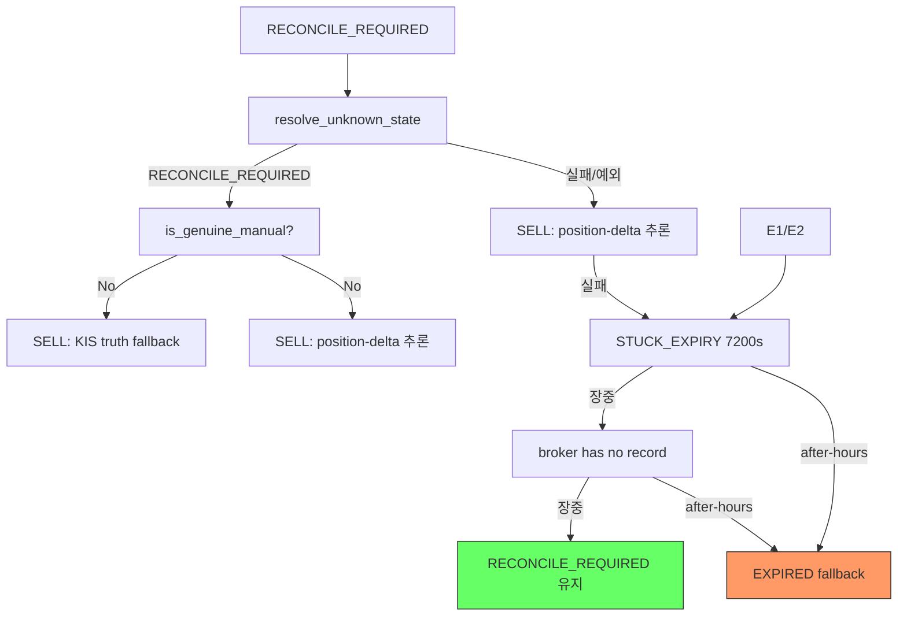
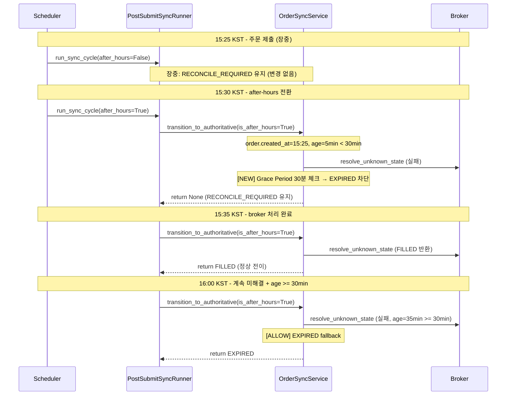
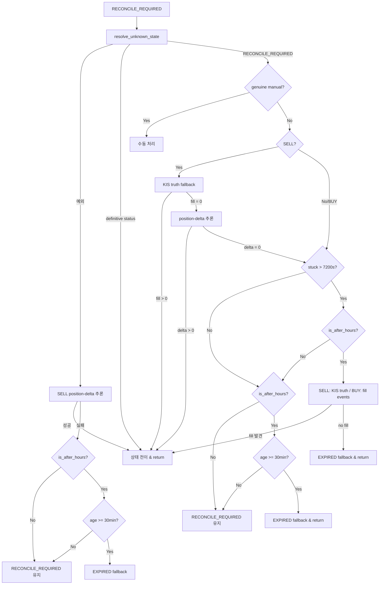

# 장중 BUY/SELL fallback 기반 EXPIRED 전이 금지 — 설계 보고서

> **작성일**: 2026-05-21  
> **분석 대상**: [`src/agent_trading/services/order_sync_service.py`](../src/agent_trading/services/order_sync_service.py)

---

## 1. 현재 상태 분석

### 1.1 EXPIRED fallback 경로 요약

[`transition_to_authoritative()`](../src/agent_trading/services/order_sync_service.py:743)는 `RECONCILE_REQUIRED` 상태의 주문을 해소하기 위해 3가지 fallback 경로를 통해 `EXPIRED`로 전이시킨다.



### 1.2 경로별 장중 차단 검증

#### 경로 A: `resolve_unknown_state()` 실패 (line 882-888)

```python
if not is_after_hours:
    logger.warning("Intraday: EXPIRED fallback suppressed ...")
    return None  # RECONCILE_REQUIRED 유지
```

- **장중 차단**: ✅ `not is_after_hours` → `return None`
- **after-hours**: ✅ EXPIRED fallback 허용
- **SELL 사전 처리**: ✅ 예외 발생 시 position-delta 추론 먼저 시도 (line 805-875)

#### 경로 B: STUCK_EXPIRY (7200s) (line 1131-1343)

```python
if stuck_duration > _STUCK_EXPIRY_SECONDS:
    if not is_after_hours:
        logger.warning("Intraday: STUCK_EXPIRY suppressed ...")
        # broker has no record 경로로 fall through
    else:
        # after-hours: KIS truth (SELL) / fill events (BUY) 확인 후 EXPIRED
```

- **장중 차단**: ✅ `not is_after_hours` → 로그만 출력 후 fall through
- **after-hours fill 확인**: ✅ SELL은 KIS truth, BUY는 fill events 조회 후 EXPIRED
- **7200s 카운트다운**: 장중에도 진행되지만 after-hours까지 EXPIRED 유발하지 않음

#### 경로 C: broker has no record (line 1349-1355)

```python
if not is_after_hours:
    logger.warning("Intraday: EXPIRED fallback suppressed ...")
    return None  # RECONCILE_REQUIRED 유지
```

- **장중 차단**: ✅ `not is_after_hours` → `return None`
- **after-hours**: ✅ EXPIRED fallback 허용

### 1.3 EXPIRED 복구 메커니즘

[`sync_order_post_submit()`](../src/agent_trading/services/order_sync_service.py:192)의 terminal 상태 처리부:

1. **broker truth 직접 확인** (line 203-226): `broker.get_order_status()`로 FILLED/PARTIALLY_FILLED 확인
2. **SELL position-delta 추론** (line 228-268): position snapshot 비교를 통한 후행 복구
3. **안전 조건** (`_can_recover_expired`, line 1846-1886): 생성 후 24시간 이내만 복구 허용
4. **복구 시간 윈도우** (`_RECENT_EXPIRY_WINDOW_SECONDS=3600`, line 58): EXPIRED 후 1시간 이내만 복구 시도

---

## 2. 문제점 식별

### 2.1 실제 버그: after-hours "broker has no record" 경로에서 최근 주문(young order) EXPIRED

#### 증상

`STUCK_EXPIRY` 체크는 `order.created_at` 기준 7200s를 검사한다. 그러나 `stuck_duration < 7200s`인 경우 STUCK_EXPIRY 블록을 skip하고 **곧바로 "broker has no record" 경로**(line 1345)로 fall through된다. 이 경로는 `is_after_hours=True`만 확인하고 **주문 생성 시간을 전혀 고려하지 않는다**.

#### 발생 시나리오

1. 주문이 장 종료 직전(예: 15:25 동시호가 중) 제출되어 `RECONCILE_REQUIRED` 상태가 됨
2. `order.created_at` 기준 경과 시간이 7200s 미만 → STUCK_EXPIRY 블록 skip
3. resolve_unknown_state 등 모든 선행 복구 시도 실패
4. "broker has no record" 경로 도달 → `is_after_hours=True` → **EXPIRED fallback**
5. 해당 주문은 생성된지 불과 5~10분밖에 안 된 유효한 주문이지만 EXPIRED 처리됨

#### 영향

- **장 마감 동시호가 주문**이 잘못 EXPIRED될 위험
- after-hours 첫 sync cycle(15:30~)에서 발생 가능
- EXPIRED 후 1시간 이내 broker truth 복구가 가능하지만, 취소할 수 없는 오판

#### 관련 코드 위치

- [`transition_to_authoritative()`](../src/agent_trading/services/order_sync_service.py:743)
- "broker has no record" 경로: **line 1345-1355**
- `resolve_unknown_state` 실패 경로: **line 882-888** (동일 문제 존재)

### 2.2 잠재적 문제: `_is_after_hours()` 단순 시간 비교 (하드코딩 15:30)

[`PostSubmitSyncRunner._is_after_hours()`](../src/agent_trading/services/order_sync_service.py:1956-1962):

```python
@staticmethod
def _is_after_hours() -> bool:
    kst = ZoneInfo("Asia/Seoul")
    now = datetime.now(kst)
    market_close = now.replace(hour=15, minute=30, second=0, microsecond=0)
    return now >= market_close
```

#### 리스크

- 스케줄러를 통하지 않고 직접 `run_sync_cycle()` 호출 시(또는 `after_hours=None`), 15:30 KST 하드코딩 사용
- 휴장일/부분휴장(Early close) 등에 대응 불가
- 15:30이 아닌 마감 시간(예: 선물옵션 동시만기일 15:15)에 부정확

#### 현재 완화 요소

- [`run_near_real_ops_scheduler.py`](../scripts/run_near_real_ops_scheduler.py)는 `MarketPhaseCode.AFTER_HOURS` 감지 후 명시적 `after_hours=True` 전달 (line 1175-1180)
- `run_sync_cycle()`의 `after_hours` 파라미터가 `None`이 아닌 경우 `_is_after_hours()` 미사용 (line 2099)
- 실운영에서는 스케줄러를 통해 실행되므로 영향 없음

**판단**: 수정 불필요 (fallback 메커니즘으로 충분, 스케줄러가 우회)

### 2.3 검토 결과: 수정 불필요한 항목

| 잠재적 문제 | 분석 결과 | 판단 |
|---|---|---|
| **STUCK_EXPIRY 카운트다운 장중 진행** | 7200s 도달해도 after-hours까지 EXPIRED 유발 안 함. after-hours 시 fill/KIS truth 확인 선행 | ✅ 설계 의도대로 동작 |
| **BUY 복구가 broker truth에만 의존** | position-delta는 SELL 전용. BUY는 fill events 조회로 대체 가능. inherent limitation | ✅ 수정 불필요 (trade-off) |
| **`_RECENT_EXPIRY_WINDOW_SECONDS=3600`** | 1시간이면 broker fill 지연 커버 가능. 24h age check도 별도 존재 | ✅ 수정 불필요 |

---

## 3. 수정 방안

### 3.1 Fix A: "broker has no record" 경로에 최소 연령(Grace Period) 조건 추가

#### 대상

[`transition_to_authoritative()`](../src/agent_trading/services/order_sync_service.py:743)의 "broker has no record" 경로 (line 1345-1355)

#### 변경 내용

after-hours라도 주문 생성 후 **30분(1800초)** 미만이면 EXPIRED fallback을 중단하고 `RECONCILE_REQUIRED`를 유지한다.

```python
# Line 1345-1355 (변경 전)
if not is_after_hours:
    logger.warning(
        "Intraday: EXPIRED fallback suppressed for order %s "
        "[broker has no record] — keeping RECONCILE_REQUIRED",
        broker_order.broker_order_id,
    )
    return None  # RECONCILE_REQUIRED 유지
```

```python
# Line 1345-1355 (변경 후)
if not is_after_hours:
    logger.warning(
        "Intraday: EXPIRED fallback suppressed for order %s "
        "[broker has no record] — keeping RECONCILE_REQUIRED",
        broker_order.broker_order_id,
    )
    return None  # RECONCILE_REQUIRED 유지

# After-hours: young order 보호 — 생성 후 30분 미만이면 EXPIRED 금지
if order.created_at is not None:
    age_seconds = (datetime.now(timezone.utc) - order.created_at).total_seconds()
    if age_seconds < 1800:  # 30분 grace period
        logger.warning(
            "After-hours: EXPIRED fallback suppressed for recent order %s "
            "[age=%.0fs < 1800s, broker has no record] — "
            "keeping RECONCILE_REQUIRED",
            broker_order.broker_order_id, age_seconds,
        )
        return None  # 다음 sync cycle에 재시도
```

#### 상수 정의

`_GRACE_PERIOD_AFTER_HOURS_EXPIRED_SECONDS: int = 1800  # 30분`을 파일 상단에 추가.

### 3.2 Fix B: `resolve_unknown_state` 실패 경로에도 동일 Grace Period 적용

#### 대상

[`transition_to_authoritative()`](../src/agent_trading/services/order_sync_service.py:743)의 `resolve_unknown_state` 예외 처리 경로 (line 882-888)

#### 변경 내용

동일한 30분 grace period 조건을 추가한다. 단, 이 경로는 SELL position-delta 추론(line 805-875)이 이미 선행되었으므로, position-delta 추론에도 실패한 경우에만 적용된다.

```python
# Line 882-888 (변경 전)
if not is_after_hours:
    logger.warning(
        "Intraday: EXPIRED fallback suppressed for order %s "
        "[resolve_unknown_state failed: %s] — keeping RECONCILE_REQUIRED",
        broker_order.broker_order_id, exc,
    )
    return None
```

```python
# Line 882-888 (변경 후)
if not is_after_hours:
    logger.warning(
        "Intraday: EXPIRED fallback suppressed for order %s "
        "[resolve_unknown_state failed: %s] — keeping RECONCILE_REQUIRED",
        broker_order.broker_order_id, exc,
    )
    return None  # RECONCILE_REQUIRED 유지, 다음 sync cycle에 재시도

# After-hours: young order 보호 — 생성 후 30분 미만이면 EXPIRED 금지
if order.created_at is not None:
    age_seconds = (datetime.now(timezone.utc) - order.created_at).total_seconds()
    if age_seconds < 1800:  # 30분 grace period
        logger.warning(
            "After-hours: EXPIRED fallback suppressed for recent order %s "
            "[age=%.0fs < 1800s, resolve_unknown_state failed: %s] — "
            "keeping RECONCILE_REQUIRED",
            broker_order.broker_order_id, age_seconds, exc,
        )
        return None  # 다음 sync cycle에 재시도
```

### 3.3 Fix C: EXPIRED 복구 시간 윈도우 확장 (선택 사항)

#### 대상

[`_RECENT_EXPIRY_WINDOW_SECONDS`](../src/agent_trading/services/order_sync_service.py:58)

#### 검토

현재 3600초(1시간)는 broker fill 데이터가 T+1로 지연될 경우 부족할 수 있다. 실제 KIS paper API의 fill 응답 지연 시간 데이터를 확인 후 필요 시 7200초(2시간) 또는 14400초(4시간)로 확장.

```python
# 변경 전
_RECENT_EXPIRY_WINDOW_SECONDS: int = 3600  # 1시간

# 변경 후 (검토 후 결정)
_RECENT_EXPIRY_WINDOW_SECONDS: int = 7200  # 2시간
```

**판단**: 당장 수정 불필요. 운영 데이터 수집 후 필요 시 적용.

---

## 4. 영향 범위 분석

### 변경의 범위

| 수정 | 영향 파일 | 영향 라인 |
|---|---|---|
| Fix A | [`order_sync_service.py`](../src/agent_trading/services/order_sync_service.py) | line 1345-1355 (broker no record 경로) |
| Fix B | [`order_sync_service.py`](../src/agent_trading/services/order_sync_service.py) | line 882-888 (resolve_unknown_state 실패 경로) |
| Fix C | [`order_sync_service.py`](../src/agent_trading/services/order_sync_service.py) | line 58 (상수값) |

### 영향도 (Fix A + B 기준)

- **기존 after-hours EXPIRED 동작**: 생성 후 30분 미만 주문에 한해 지연. 30분 이상 주문은 기존과 동일하게 EXPIRED fallback 허용
- **장중 동작**: 변경 없음 (`not is_after_hours` → `return None`)
- **복구 메커니즘**: 변경 없음. EXPIRED 후 broker truth 확인 및 position-delta 추론 계속 동작
- **성능 영향**: 없음 (단순 시간 비교)

---

## 5. 테스트 계획

### 5.1 단위 테스트 ([`tests/services/test_order_state_transition.py`](../tests/services/test_order_state_transition.py))

| 테스트 케이스 | 설명 | 검증 |
|---|---|---|
| `test_after_hours_expired_blocked_for_young_order_broker_no_record` | after-hours + broker no record + order age < 30min | RECONCILE_REQUIRED 유지 |
| `test_after_hours_expired_allowed_for_old_order_broker_no_record` | after-hours + broker no record + order age >= 30min | EXPIRED fallback 허용 |
| `test_after_hours_expired_blocked_for_young_order_resolve_failed` | after-hours + resolve_unknown_state 실패 + order age < 30min | RECONCILE_REQUIRED 유지 |
| `test_after_hours_expired_allowed_for_old_order_resolve_failed` | after-hours + resolve_unknown_state 실패 + order age >= 30min | EXPIRED fallback 허용 |
| `test_intraday_expired_blocked_unchanged` | 장중 + 모든 경로 | 기존 차단 동작 변경 없음 |

### 5.2 통합 테스트

| 테스트 케이스 | 설명 |
|---|---|
| `test_eod_sync_young_order_protection` | EOD sync cycle에서 15:25 제출 주문이 15:31에 EXPIRED되지 않는지 검증 |
| `test_after_hours_recovery_on_late_fill` | after-hours EXPIRED 후 30분 이내 broker truth FILLED 반환 시 복구 확인 |

### 5.3 모의 해석 (Mermaid)



---

## 6. 부록: 코드 분석 상세

### 6.1 `transition_to_authoritative()` 전체 흐름도



### 6.2 관련 상수 및 설정값

| 상수 | 값 | 위치 | 용도 |
|---|---|---|---|
| `_STUCK_EXPIRY_SECONDS` | 7200 | line 54 | 주문 생성 후 EXPIRED fallback threshold |
| `_RECENT_EXPIRY_WINDOW_SECONDS` | 3600 | line 58 | EXPIRED 후 복구 시도 시간 윈도우 |
| `_GRACE_PERIOD_AFTER_HOURS_EXPIRED_SECONDS` | **1800 (신규)** | line TBD | After-hours young order 보호 grace period |
| `_can_recover_expired` age limit | 86400 (24h) | line 1879 | 복구 허용 최대 주문 연령 |
| `_is_genuine_manual_reconciliation` age limit | 86400 (24h) | line 1832 | 수동 처리 판단 threshold |
