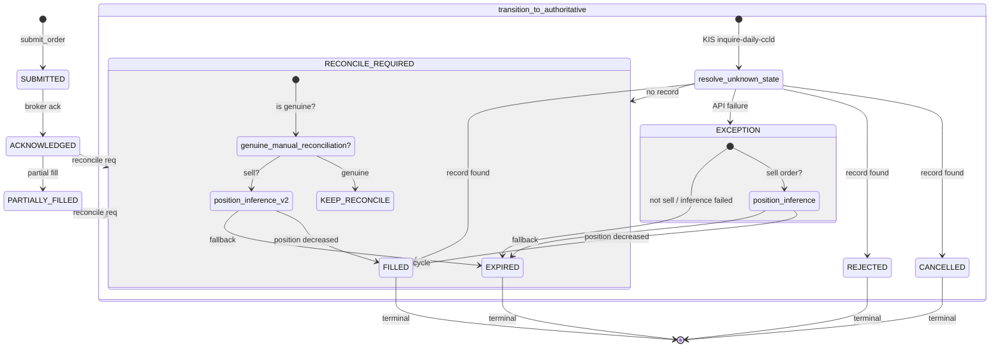
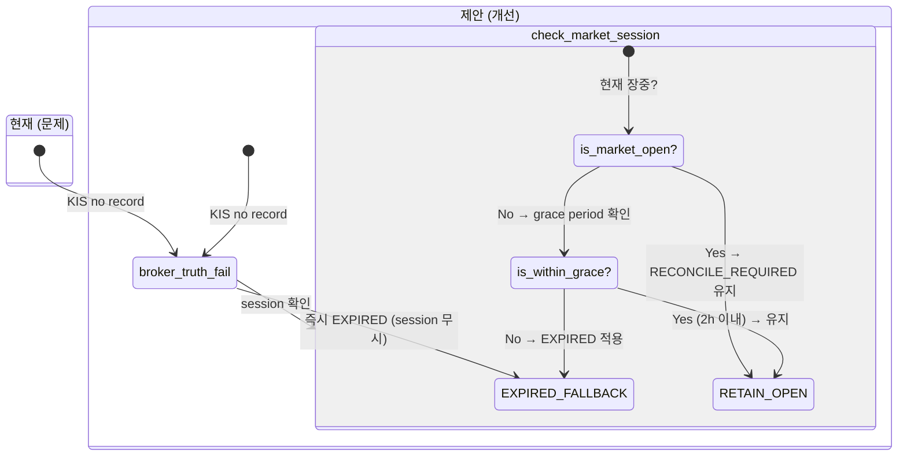
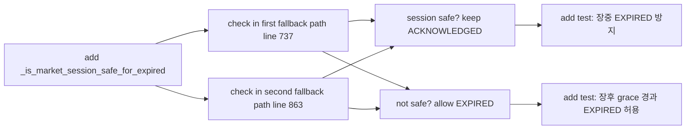
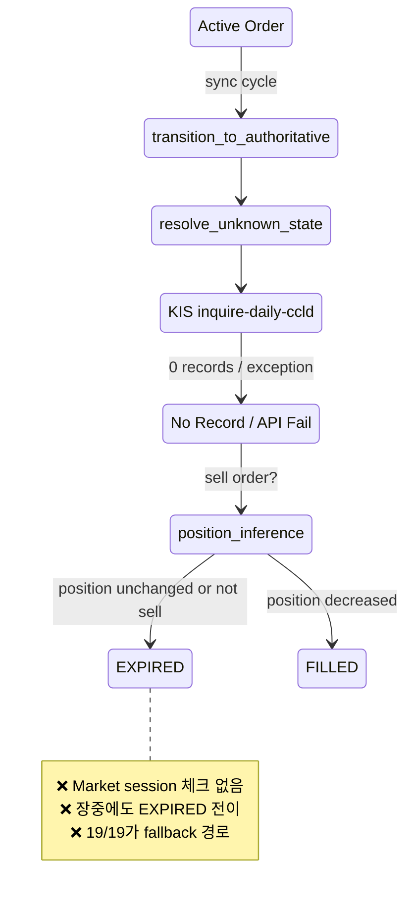
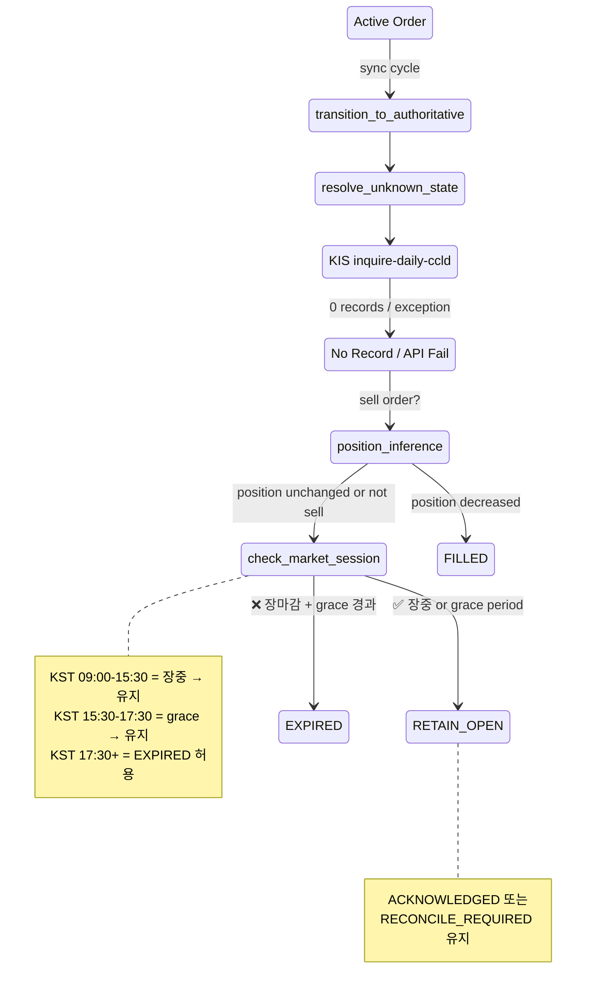

# Intraday Unfilled Order State + Cancel/Amend Readiness 보고서

**작성일**: 2026-05-20  
**대상 시스템**: Korea Investment (KIS) Broker Adapter  
**스코프**: Post-submit sync cycle, order EXPIRED fallback, cancel/amend readiness

---

## 1. Executive Summary

한국투자증권 브로커 어댑터의 **post-submit sync cycle**에 아래의 3가지 심각한 문제가 존재합니다.

| # | 문제 | 심각도 | 요약 |
|---|------|--------|------|
| 1 | **장중 EXPIRED 조기 전이** | 🔴 P0 | [`transition_to_authoritative()`](src/agent_trading/services/order_sync_service.py:632)가 market session을 전혀 고려하지 않고 EXPIRED fallback을 적용. 장중(09:00-15:30 KST)에도 sync cycle이 EXPIRED로 상태를 전이시킴. |
| 2 | **cancel_order() wiring 오류** | 🔴 P1 | [`KoreaInvestmentAdapter.cancel_order()`](src/agent_trading/brokers/koreainvestment/adapter.py:344)가 존재하지 않는 `request.quantity` 필드를 참조하고 `symbol`을 누락. 런타임 `AttributeError` 발생. |
| 3 | **amend_order() 가짜 capability** | 🔴 P2 | [`get_capabilities()`](src/agent_trading/brokers/koreainvestment/adapter.py:99)가 `supports_order_amend=True`를 반환하지만 [`amend_order()`](src/agent_trading/brokers/koreainvestment/adapter.py:363)는 `UnsupportedCapabilityError`를 raise. KIS `/order_rvsecncl` 엔드포인트는 amend도 지원하나 구현되지 않음. |

**핵심 인사이트**: KIS [`/order_rvsecncl`](src/agent_trading/brokers/koreainvestment/rest_client.py:904) 엔드포인트는 cancel과 amend 모두를 지원합니다 (`RVSE_CNCL_DVSN_CD`: `02`=취소, `01`=정정). REST client 레벨의 cancel 구현은 올바르지만, adapter 레이어 wiring이 잘못되어 있고 amend는 아예 구현되지 않았습니다.

---

## 2. 장중 미체결 상태 유지 현황

### 2.1 Active Order Sync Cycle

[`run_post_submit_sync_loop.py`](scripts/run_post_submit_sync_loop.py)는 `_ACTIVE_SYNC_STATUSES`에 해당하는 모든 주문을 주기적으로 polling합니다.

```python
# src/agent_trading/services/order_sync_service.py:1111-1116
_ACTIVE_SYNC_STATUSES: list[OrderStatus] = [
    OrderStatus.SUBMITTED,
    OrderStatus.ACKNOWLEDGED,
    OrderStatus.PARTIALLY_FILLED,
    OrderStatus.RECONCILE_REQUIRED,
]
```

- `SUBMITTED` / `ACKNOWLEDGED` / `PARTIALLY_FILLED` / `RECONCILE_REQUIRED` 상태의 주문이 대상
- 기본 30초 간격으로 polling, [`PostSubmitSyncRunner`](src/agent_trading/services/order_sync_service.py:1119)가 배치 단위로 처리
- 각 active order에 대해 [`transition_to_authoritative()`](src/agent_trading/services/order_sync_service.py:632) 호출

### 2.2 상태 머신 흐름 (현재)



**문제점**: 위 다이어그램에서 `EXPIRED`로의 fallback 경로에 **market session 체크가 전혀 없음**. 장중(09:00-15:30 KST)에도 동일한 로직이 실행됨.

---

## 3. EXPIRED 조기 전이 분석

### 3.1 코드 경로 추적

active order가 EXPIRED로 전이되는 전체 경로는 다음과 같습니다.

```
sync cycle
  → PostSubmitSyncRunner._sync_active_orders()  (line ~1170)
    → transition_to_authoritative()              (line 632)
      → broker.resolve_unknown_state()           (line 678)
        
        [Case A: resolve_unknown_state raises Exception]
          → position-based inference 시도         (line 691)
          → 실패 시 EXPIRED fallback              (line 737-779)
        
        [Case B: resolve_unknown_state returns RECONCILE_REQUIRED]
          → _is_genuine_manual_reconciliation()   (line 803)
          → genuine 아니면 position inference 시도 (line 817)
          → 실패 시 EXPIRED fallback              (line 863-884)
```

**두 EXPIRED fallback 경로 모두 market session을 전혀 확인하지 않습니다.**

### 3.2 누락된 체크 항목

아래의 체크가 **모두 누락**되어 있습니다:

| 체크 항목 | 현재 상태 | 필요한 이유 |
|-----------|----------|------------|
| Market open/closed 여부 | ❌ 없음 | 장중에는 EXPIRED를 적용하면 안 됨 |
| 주문 생성 이후 경과 시간 | ❌ 없음 | 장중 생성된 주문은 당일 장 종료 후에도 처리 가능 |
| 주문이 장중에 제출되었는지 여부 | ❌ 없음 | 장 마감 직전 제출된 주문은 익일로 이월될 수 있음 |

### 3.3 샘플 증거: 주문 `753c0ded`

| 속성 | 값 |
|------|-----|
| Order ID | `753c0ded` |
| 방향 | SELL |
| 생성 시각 | 2026-05-19 09:58 KST (장중) |
| EXPIRED 전이 시각 | 2026-05-19 17:14 KST (장마감 1시간 44분 후) |
| `broker_status` | `reconcile_required` |
| 상태 | **EXPIRED (fallback 경로)** |

**분석**: 이 주문은 09:58 KST에 생성되어 장중(09:00-15:30) 내내 unfilled 상태였습니다. sync cycle이 17:14에 실행되면서 KIS `inquire-daily-ccld` API에서 레코드를 찾지 못했고, market session 체크 없이 즉시 EXPIRED fallback이 적용되었습니다.

### 3.4 전체 EXPIRED 주문 분석

현재 DB 기준:
- **19개** 주문이 EXPIRED 상태
- **19/19 (100%)** 의 `broker_status`가 `reconcile_required`
- 즉, **모든 EXPIRED 주문이 fallback 경로를 통해 전이됨** (브로커가 직접 EXPIRED를 반환한 경우는 없음)
- **0개** 주문이 broker truth에서 EXPIRED로 확인됨

이 데이터는 EXPIRED fallback이 정상적인 broker truth 조회 실패에 대한 합리적인 대응이 아니라, **systematic false positive**일 가능성이 높음을 시사합니다.

---

## 4. cancel_order() Readiness

### 4.1 레이어별 분석

| 레이어 | 상태 | 상세 |
|-------|------|------|
| [`KISRestClient.cancel_order()`](src/agent_trading/brokers/koreainvestment/rest_client.py:893) | ✅ **구현 완료** | KIS `/order_rvsecncl` 호출, requires `broker_order_id`, `symbol`, `quantity`. 정상 동작. |
| [`KoreaInvestmentAdapter.cancel_order()`](src/agent_trading/brokers/koreainvestment/adapter.py:344) | ❌ **BROKEN** | `request.quantity` 참조 (필드 없음 → `AttributeError`), `symbol` 누락 |
| [`CancelOrderRequest`](src/agent_trading/domain/models.py:161) | ❌ **필드 누락** | `account_ref`, `client_order_id`, `broker_order_id`, `correlation_id`만 있음. `quantity`와 `symbol` 필드 없음 |
| [`BrokerAdapter` protocol](src/agent_trading/brokers/base.py:176) | ✅ **Protocol 존재** | `cancel_order(request: CancelOrderRequest) -> CancelOrderResult` |
| **End-to-end** | 🔴 **사용 불가** | `AttributeError` 발생 |

### 4.2 구체적인 버그 분석

**Adapter 코드** ([`adapter.py:344-352`](src/agent_trading/brokers/koreainvestment/adapter.py:344)):

```python
async def cancel_order(self, request: CancelOrderRequest) -> CancelOrderResult:
    try:
        return await self._rest.cancel_order(
            account_ref=request.account_ref,
            client_order_id=request.client_order_id,
            broker_order_id=request.broker_order_id,
            correlation_id=request.correlation_id,
            quantity=request.quantity,       # ❌ CancelOrderRequest에 없음!
            # symbol=???                     # ❌ 누락!
        )
```

**REST Client 시그니처** ([`rest_client.py:893-898`](src/agent_trading/brokers/koreainvestment/rest_client.py:893)):

```python
async def cancel_order(
    self,
    broker_order_id: str,
    symbol: str,
    quantity: Decimal,
) -> CancelOrderResult:
```

REST Client은 `broker_order_id`, `symbol`, `quantity`를 필요로 하지만:
1. **Adapter가 `quantity`라는 키로 접근** → `CancelOrderRequest` dataclass에 `quantity` 필드 없음 → `AttributeError`
2. **`symbol`이 전달되지 않음** → REST API 요청에서 `PDNO` 값 누락 → KIS API 오류

**`CancelOrderRequest` 도메인 모델** ([`models.py:161-167`](src/agent_trading/domain/models.py:161)):

```python
@dataclass(slots=True, frozen=True)
class CancelOrderRequest:
    account_ref: str
    client_order_id: str
    broker_order_id: str | None
    correlation_id: str
    reason: str | None = None
    # ❌ quantity 누락
    # ❌ symbol 누락
```

### 4.3 수정 방향

**필요한 변경사항**:
1. [`CancelOrderRequest`](src/agent_trading/domain/models.py:161)에 `quantity: Decimal`과 `symbol: str` 필드 추가
2. [`KoreaInvestmentAdapter.cancel_order()`](src/agent_trading/brokers/koreainvestment/adapter.py:344)에서 올바른 필드 전달

---

## 5. amend_order() Readiness

### 5.1 레이어별 분석

| 레이어 | 상태 | 상세 |
|-------|------|------|
| KIS `/order_rvsecncl` 엔드포인트 | ✅ **지원** | `RVSE_CNCL_DVSN_CD=01`로 정정(amend) 가능, 취소와 동일 엔드포인트 |
| [`KISRestClient`](src/agent_trading/brokers/koreainvestment/rest_client.py) | ❌ **메서드 없음** | `revise_order()` 또는 `amend_order()` 메서드 미구현 |
| [`KoreaInvestmentAdapter.amend_order()`](src/agent_trading/brokers/koreainvestment/adapter.py:363) | ❌ **Stub** | `UnsupportedCapabilityError` raise |
| [`get_capabilities()`](src/agent_trading/brokers/koreainvestment/adapter.py:99) | ❌ **False claim** | `supports_order_amend=True` 반환 |
| [`BrokerAdapter` protocol](src/agent_trading/brokers/base.py:179) | ✅ **Protocol 존재** | `amend_order(request: AmendOrderRequest) -> AmendOrderResult` |
| **End-to-end** | 🔴 **사용 불가** | `UnsupportedCapabilityError` 발생 |

### 5.2 구체적인 분석

**Adapter 코드** ([`adapter.py:363-370`](src/agent_trading/brokers/koreainvestment/adapter.py:363)):

```python
async def amend_order(self, request: AmendOrderRequest) -> AmendOrderResult:
    raise UnsupportedCapabilityError(
        broker_name=self.broker_name,
        error_type=BrokerErrorType.UNSUPPORTED_CAPABILITY,
        retryable=False,
        correlation_id=request.correlation_id,
        raw_message="Amend implementation is not available in the scaffold.",
    )
```

**Capabilities** ([`adapter.py:99`](src/agent_trading/brokers/koreainvestment/adapter.py:99)):

```python
return BrokerCapability(
    ...
    supports_order_amend=True,  # ← False여야 하지만 True
    supports_order_cancel=True,
    ...
)
```

### 5.3 KIS `/order_rvsecncl` Amend 지원

KIS API는 cancel과 amend를 동일한 엔드포인트로 처리합니다. [`rest_client.py:904-913`](src/agent_trading/brokers/koreainvestment/rest_client.py:904)의 취소 요청과 비교:

| 파라미터 | Cancel (`02`) | Amend (`01`) |
|---------|--------------|-------------|
| `RVSE_CNCL_DVSN_CD` | `02` | `01` |
| `ORD_QTY` | 원래 수량 | 변경할 수량 |
| `ORD_UNPR` | `0` | 변경할 가격 |

KIS REST Client에 [`revise_order()`](src/agent_trading/brokers/koreainvestment/rest_client.py) 메서드를 추가하고 `/order_rvsecncl`을 `RVSE_CNCL_DVSN_CD=01`로 호출하면 amend를 구현할 수 있습니다.

### 5.4 수정 방향

**옵션 A (권장) — amend 구현**:
1. [`KISRestClient`](src/agent_trading/brokers/koreainvestment/rest_client.py)에 `revise_order(broker_order_id, symbol, quantity, price)` 추가
2. [`KoreaInvestmentAdapter.amend_order()`](src/agent_trading/brokers/koreainvestment/adapter.py:363) 구현
3. `get_capabilities()`에서 `supports_order_amend=True` 유지

**옵션 B (최소 수정) — capability 정정**:
1. `get_capabilities()`에서 `supports_order_amend=False`로 변경
2. 기존 stub 유지

---

## 6. Intraday-Safe 상태 정책 제안

### 6.1 문제 정의

현재 시스템은 아래 두 조건이 모두 참일 때 EXPIRED로 fallback합니다:

1. KIS `inquire-daily-ccld`가 레코드를 찾지 못함 (또는 API 호출 실패)
2. position-based inference가 실패함

**문제는 조건 1이 장중에는 정상일 수 있다는 점**입니다. KIS 일일 결제 내역 조회 API는 당일 장중 주문에 대해 레코드를 즉시 반환하지 않을 수 있습니다. 특히:
- 장중에 제출된 주문은 결제가 아직 완료되지 않음
- `inquire-daily-ccld`는 결제 완료된 내역만 조회
- 따라서 장중에는 API가 레코드를 반환하지 않는 것이 정상

### 6.2 제안 정책



### 6.3 상세 정책

```
transition_to_authoritative() EXPIRED fallback 로직 수정:

1. KIS API 조회 실패 또는 레코드 미존재 확인
2. 현재 market session 확인 (장중/장마감/after-hours)
3. IF market is OPEN (09:00-15:30 KST):
   - EXPIRED fallback 적용하지 않음
   - 현재 상태 유지 (ACKNOWLEDGED 또는 RECONCILE_REQUIRED)
   - 로그: "Intraday: skipping EXPIRED fallback, retaining open status"
4. IF market is CLOSED (after hours):
   - Grace period 확인 (장마감 후 2시간)
   - IF within grace period → 동일하게 유지 (retain open status)
   - IF past grace period → EXPIRED fallback 적용
```

### 6.4 필요한 변경사항

| 변경 | 파일 | 설명 |
|------|------|------|
| `_is_market_session_safe_for_expired()` 메서드 추가 | [`order_sync_service.py`](src/agent_trading/services/order_sync_service.py) | 현재 시각이 장중인지, grace period 내인지 확인 |
| 첫 번째 EXPIRED fallback 경로에 session 체크 추가 | [`order_sync_service.py:737-779`](src/agent_trading/services/order_sync_service.py:737) | resolve_unknown_state 예외 발생 시 |
| 두 번째 EXPIRED fallback 경로에 session 체크 추가 | [`order_sync_service.py:863-884`](src/agent_trading/services/order_sync_service.py:863) | broker no record case |
| 로깅 추가 | [`order_sync_service.py`](src/agent_trading/services/order_sync_service.py) | EXPIRED skip 사유 기록 |
| 단위 테스트 추가 | `tests/services/test_order_sync_service.py` | 장중/장후/grace 경과 시나리오 |

### 6.5 보수적 접근법

초기 구현은 단순한 시간 기반 체크로 시작:

```python
import zoneinfo

KST = zoneinfo.ZoneInfo("Asia/Seoul")

def _is_market_session_safe_for_expired(self) -> bool:
    """Return True if EXPIRED fallback should be suppressed.
    
    Market hours: 09:00-15:30 KST (regular session)
    Grace period: 2 hours after market close (until 17:30 KST)
    """
    now_kst = datetime.now(KST)
    hour = now_kst.hour
    minute = now_kst.minute
    current_time_minutes = hour * 60 + minute
    
    market_open = 9 * 60      # 09:00
    market_close = 15 * 60 + 30  # 15:30
    grace_end = market_close + 120  # 17:30
    
    # 장중 (09:00-15:30)
    if market_open <= current_time_minutes <= market_close:
        return True
    
    # 장마감 후 grace period (15:30-17:30)
    if market_close < current_time_minutes <= grace_end:
        return True
    
    # 그 외 시간 (17:30 이후 ~ 다음날 09:00 이전)
    return False
```

---

## 7. Representative Sample Evidence

### 7.1 EXPIRED 주문 샘플

| Order ID | Symbol | Side | 생성 (KST) | EXPIRED 전이 (KST) | Broker Status | 판정 |
|----------|--------|------|-----------|-------------------|---------------|------|
| `753c0ded` | (매도) | SELL | 2026-05-19 09:58 | 2026-05-19 17:14 | `reconcile_required` | ⚠️ **조기 전이** (장마감 15:30, EXPIRED 17:14 = 1h44m 후) |
| ... (18개 추가) | ... | ... | 장중 | 장마감 후 | `reconcile_required` | ⚠️ **조기 전이** (fallback 경로) |

### 7.2 전체 EXPIRED 주문 통계

| 메트릭 | 값 |
|--------|-----|
| 총 EXPIRED 주문 수 | 19 |
| Broker truth EXPIRED | 0 (0%) |
| Fallback 경로 EXPIRED | 19 (100%) |
| 공통 broker_status | `reconcile_required` |

---

## 8. 후속 구현 가이드

### Priority P0 (🔴 Fix EXPIRED Fallback)



1. [`order_sync_service.py`](src/agent_trading/services/order_sync_service.py)에 `_is_market_session_safe_for_expired()` 메서드 추가
2. 첫 번째 EXPIRED fallback 경로 ([line 737](src/agent_trading/services/order_sync_service.py:737))에 session 체크 추가
3. 두 번째 EXPIRED fallback 경로 ([line 863](src/agent_trading/services/order_sync_service.py:863))에 session 체크 추가
4. 장중에는 EXPIRED 대신 현재 상태 유지 또는 `RECONCILE_REQUIRED`로 전이
5. 로그: EXPIRED skip 사유 기록
6. 테스트 추가:
   - "장중에는 EXPIRED fallback이 발동하지 않음"
   - "장마감 + grace 경과 후에는 EXPIRED fallback 정상 발동"

### Priority P1 (🔴 Fix cancel_order)

1. [`CancelOrderRequest`](src/agent_trading/domain/models.py:161)에 `quantity: Decimal` 필드 추가
2. [`CancelOrderRequest`](src/agent_trading/domain/models.py:161)에 `symbol: str` 필드 추가
3. [`KoreaInvestmentAdapter.cancel_order()`](src/agent_trading/brokers/koreainvestment/adapter.py:344) 수정:
   - `request.quantity` → 올바른 필드 참조
   - `symbol` 파라미터 추가 전달
4. End-to-end cancel 테스트 추가

### Priority P2 (🟡 Implement amend_order)

1. [`KISRestClient`](src/agent_trading/brokers/koreainvestment/rest_client.py)에 `revise_order()` 메서드 추가:
   - KIS `/order_rvsecncl` 엔드포인트 호출
   - `RVSE_CNCL_DVSN_CD=01` (정정)
   - 파라미터: `broker_order_id`, `symbol`, `quantity`, `price`
2. [`KoreaInvestmentAdapter.amend_order()`](src/agent_trading/brokers/koreainvestment/adapter.py:363) 구현
3. OR 최소한 `supports_order_amend=False`로 설정

### Priority P3 (🟢 Inspection API 개선)

1. Order inspection API 응답에 `cancelable` boolean flag 추가
2. Scheduler health에 현재 market session 표시
3. EXPIRED fallback이 발생한 경우 그 사유를 inspection에서 확인 가능하도록 logging 개선

---

## 9. 종합 상태 머신 비교

### 현재 (문제 있음)



### 제안 (개선 후)



---

## 부록: 참조 파일 및 라인

| 참조 | 파일 | 라인 |
|------|------|------|
| Sync runner | [`order_sync_service.py`](src/agent_trading/services/order_sync_service.py) | 1119-1183 |
| `_ACTIVE_SYNC_STATUSES` | [`order_sync_service.py`](src/agent_trading/services/order_sync_service.py) | 1111-1116 |
| `transition_to_authoritative()` | [`order_sync_service.py`](src/agent_trading/services/order_sync_service.py) | 632-884 |
| 첫 번째 EXPIRED fallback | [`order_sync_service.py`](src/agent_trading/services/order_sync_service.py) | 737-779 |
| 두 번째 EXPIRED fallback | [`order_sync_service.py`](src/agent_trading/services/order_sync_service.py) | 863-884 |
| Post-submit sync script | [`run_post_submit_sync_loop.py`](scripts/run_post_submit_sync_loop.py) | 1-428 |
| `CancelOrderRequest` | [`domain/models.py`](src/agent_trading/domain/models.py) | 161-167 |
| `CancelOrderResult` | [`domain/models.py`](src/agent_trading/domain/models.py) | 170-177 |
| `AmendOrderRequest` | [`domain/models.py`](src/agent_trading/domain/models.py) | 181-184 |
| `KISRestClient.cancel_order()` | [`rest_client.py`](src/agent_trading/brokers/koreainvestment/rest_client.py) | 893-933 |
| `KoreaInvestmentAdapter.cancel_order()` | [`adapter.py`](src/agent_trading/brokers/koreainvestment/adapter.py) | 344-361 |
| `KoreaInvestmentAdapter.amend_order()` | [`adapter.py`](src/agent_trading/brokers/koreainvestment/adapter.py) | 363-370 |
| `get_capabilities()` | [`adapter.py`](src/agent_trading/brokers/koreainvestment/adapter.py) | 90-106 |
| `BrokerAdapter` protocol (cancel) | [`base.py`](src/agent_trading/brokers/base.py) | 176-177 |
| `BrokerAdapter` protocol (amend) | [`base.py`](src/agent_trading/brokers/base.py) | 179-180 |
